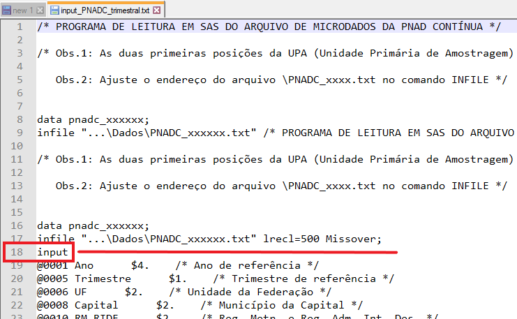

# Importando e exportando dados com `readr`, `readxl` e `haven`


## Introdução e pré-requisitos {#sec:importando_dados}

Em algum ponto, você vai trabalhar com os seus próprios dados no R e, para isso, você precisa obrigatoriamente importar esses dados para dentro do R. Neste capítulo, vamos aprender como utilizar as funções dos pacotes `readr`, `readxl` e `haven`, para ler e importar dados presentes em arquivos de texto (*plain text files* - `.txt` ou `.csv`), em planilhas do Excel (`.xlsx`) e em arquivos produzidos por programas estatísticos como o Stata (`.dta`), SPSS (`.sav`; `.zsav` e `.por`) e SAS (`.sas`).

Para que você tenha acesso as funções e possa acompanhar os exemplos desse capítulo você precisa chamar pelos pacotes `readr`, `readxl` e `haven`, através do comando `library()`. O pacote `readr` especificamente, está incluso dentro do `tidyverse` e, por isso, você também pode chamar por ele.

```{r, eval = FALSE}
library(tidyverse)

library(readr)
library(readxl)
library(haven)
```


## Fontes de dados

Os seus dados podem vir de diferentes tipos de fontes. Com isso, os métodos necessários para acessar e importar esses dados para o R, mudam. Em resumo, os seus dados podem provir de três tipos de fontes diferentes:

1) Arquivo estático salvo no disco rígido de seu computador.

2) Servidor local ou *online*.

3) Página da internet.

Nós normalmente transportamos os nossos dados através de um arquivo estático, que pode ser salvo em nosso computador. Por isso, ao importar os nossos dados para o R, vamos estar preocupados na grande maioria das vezes, em ler um arquivo que se encontra salvo em nosso computador. Por este motivo, os métodos que serão mostrados nesse capítulo, buscam ler e importar diferentes tipos de arquivos estáticos. Em um processo como esse, a localização desse arquivo no disco rígido é um fator importante. Além disso, diferentes tipos de arquivos são estruturados de maneiras distintas e, por essa razão, você vai precisar de uma função no R que seja capaz de ler esse tipo de arquivo, ou em outras palavras, que seja capaz de reconhecer a estrutura desse arquivo.

Por outro lado, se você está importando os seus dados a partir de um servidor, você muito provavelmente estará extraindo dados de um DBMS (*database management system*). Os sistemas DBMS mais famosos e mais utilizados no mundo, são os sistemas que utilizam a linguagem SQL (*Structured Query Language*). Para extrair um conjunto de dados desse tipo de fonte, você em geral necessita de uma chave, ou uma API (*Application Programming Interface*) que lhe garanta acesso ao servidor e, portanto, acesso aos dados que você deseja importar. Esse processo de importação não será tratado aqui, mas você vai precisar das funções disponíveis em pacotes como `jsonlite`, `odbc` e `DBI` para tal processo.

Além dessas alternativas, você pode estar interessado em coletar dados de uma página da internet. Não estou me referindo a um arquivo estático que esteja disponível para *download* através dessa página da internet, mas sim, de coletar o conteúdo dessa página, de coletar os dados que formam a própria página da internet em si. Esse tipo de coleta, e os métodos envolvidos nesse processo, são comumente chamados de *web scraping*, e hoje, representam uma área importante em análise de dados. Esse processo de importação também não será mostrado aqui, mas você pode consultar as funções dos pacotes `httr`, `xml2` e `rvest` para executar tal processo.


## Diretório de trabalho

A linguagem R possui uma forte noção de diretórios de trabalho [@wickham2017, p 113]. O diretório de trabalho (*working directory*) é o local de seu computador onde o R vai procurar pelos arquivos que você demanda, e será onde o R vai guardar todos os arquivos que você pede a ele que salve. 

Isso significa que em todas as ocasiões em que você estiver no R, ele estará trabalhando com alguma pasta específica de seu computador. No RStudio, você pode identificar o seu diretório de trabalho atual na parte esquerda e superior do console, logo abaixo do nome de sua guia (`Console`), como mostrado na figura 3.1. Repare abaixo, que no momento em que a foto presente na figura 3.1 foi tirada, eu estava trabalhando com uma pasta de meu computador chamada `Curso-R`, que por sua vez, se encontrava dentro de uma pasta chamada `Projeto curso R`.

```{r, echo = F, out.width="70%", fig.cap = "Diretório de trabalho - Console RStudio"}
knitr::include_graphics("Figuras/diretorio_console.png")
```

Nós também podemos descobrir o diretório de trabalho atual em nossa sessão do R, através da função `getwd()`.

```{r, eval = F}
getwd()
```
```
## [1] "C:/Users/Pedro/Documents/Projeto curso R/Curso-R"
```

Dessa forma, supondo que o meu diretório de trabalho atual seja a pasta `Curso-R`, se eu pedir por algum arquivo chamado `frase.txt`, o R vai procurar por esse arquivo dentro dessa pasta `Curso-R`. Isso tem duas implicações muito importantes. Primeiro, o arquivo `frase.txt` deve estar dentro dessa pasta `Curso-R`, caso contrário o R não poderá encontrar o arquivo. Segundo, temos uma maneira muito simples e poderosa de acessarmos qualquer arquivo que esteja presente na pasta `Curso-R`, pois precisamos apenas do nome desse arquivo, como no exemplo abaixo.


```{r, eval = F}
read_lines("frase.txt")
```
```{r, echo = F}
read_lines("Dados/frase.txt")
```


Um ponto muito importante é que a extensão do arquivo (que traduz o seu tipo) também faz parte do nome do arquivo. No exemplo acima, o arquivo se chama `frase` e possui a extensão `.txt`, logo, o nome do arquivo a ser fornecido ao R é `frase.txt`.

## Definindo endereços do disco rígido no R {#sec:enderecos_disco_rigido}

Portanto, o mecanismo de diretórios de trabalho apenas limita o escopo de busca do R. Dito de outra forma, ele define onde o R irá procurar pelos seus arquivos e, onde esses arquivos serão salvos através do R. Entretanto, isso não quer dizer que você não possa acessar arquivos que se encontram em outras áreas do seu computador. Porém, para acessarmos qualquer arquivo que esteja fora de seu diretório de trabalho atual, nós precisamos obrigatoriamente fornecer o endereço até esse arquivo para o R.

### Cuidados ao definir endereços

Alguns cuidados no R são necessários ao definir um endereço até um arquivo. Primeiro, endereços de seu disco rígido devem sempre ser fornecidos como textos (*strings*), por isso, lembre-se de contornar o seu endereço com aspas duplas ou simples no R. Segundo, o Windows utiliza por padrão a barra inclinada à esquerda (`\`) para separar cada diretório presente no caminho até um certo arquivo. Todavia, a barra inclinada à esquerda possui um significado especial para o R. 

Abordando especificamente o segundo ponto, você tem duas alternativas para contornar as particularidades das barras inclinadas utilizadas nos endereços de seus arquivos: 1) utilizar o estilo dos sistemas Mac e Linux, que utilizam a barra inclinada à direita (`/`) para separar os diretórios; 2) ou contornar o comportamento especial de uma barra inclinada à esquerda, com duas barras inclinadas à esquerda (`\\`). Ou seja, é como se essas duas barras `\\` significassem apenas uma barra `\` para o R. Eu particularmente prefiro utilizar o estilo dos sistemas Mac e Linux para resolver esse problema, pois ele incorre em um trabalho menor de digitação.

Por exemplo, eu possuo um arquivo chamado `livros.txt` localizado dentro da pasta `Lista de compras`, que por sua vez, se encontra dentro da minha pasta de `Documentos` do Windows. Segundo o padrão do Windows, o endereço até esse arquivo seria: `"C:\Users\Pedro\Documents\Lista de compras\livros.txt"`. Porém, levando-se em conta os pontos que acabamos de abordar, nós poderíamos fornecer um dos dois endereços abaixo para me referir a este arquivo no R:

```{r, include = F}
livros <- read_csv("Dados/livros.txt")
```


```{r, eval = FALSE}
livros <- read_csv("C:\\Users\\Pedro\\Documents\\Lista de compras\\livros.txt")

livros <- read_csv("C:/Users/Pedro/Documents/Lista de compras/livros.txt")
```
```{r}
livros
```


### Endereços relativos e absolutos

A depender do seu diretório de trabalho atual, e de onde o seu arquivo de interesse se encontra, você pode utilizar dois estilos diferentes de endereços (relativo e absoluto) para se referir a um dado arquivo. Vamos utilizar como exemplo, o conjunto de arquivos mostrados na figura 3.2 que se encontram dentro de uma pasta chamada `Dados`. 

```{r, echo = F, fig.cap="Exemplo de arquivos", out.width="80%"}
knitr::include_graphics("Figuras/arquivos.png")
```

Caso o seu diretório de trabalho atual fosse, por exemplo, a pasta `Projeto curso R`, você poderia fornecer um endereço relativo para qualquer um desses arquivos presentes na pasta `Dados`. Pois a pasta `Dados` se encontra dentro da pasta `Projeto curso R`. Em outras palavras, a pasta `Dados` é uma subpasta da pasta `Projeto curso R`. 

Logo, um endereço relativo possui como ponto inicial, o seu diretório de trabalho atual. Por isso, você pode acessar qualquer arquivo que esteja dentro de seu diretório de trabalho, ou dentro de alguma de suas subpastas, através de um endereço relativo. No caso dos arquivos da pasta `Dados`, nós poderíamos fornecer o endereço `"Curso-R/Dados/"` para chegarmos a pasta `Dados`. Em seguida, precisaríamos apenas acrescentar o nome do arquivo de nosso desejo. Por exemplo, se fôssemos ler o arquivo de nome `covid.csv`, o endereço resultante seria `"Curso-R/Dados/covid.csv"`.

Por outro lado, se o seu diretório de trabalho atual for uma pasta posterior à pasta `Dados` (ou seja, uma subpasta da pasta `Dados`), e você quiser acessar um dos arquivos da pasta `Dados`, você terá que fornecer um endereço absoluto até o arquivo em questão. Um endereço absoluto é um endereço que parte desde o disco rígido de seu computador até o arquivo de interesse. Por isso, um endereço absoluto sempre aponta para o mesmo local de seu computador, independente de qual seja o seu diretório de trabalho atual.

Para coletarmos o endereço absoluto de um arquivo no Windows, podemos clicar com o botão direito do mouse sobre o arquivo de interesse, e selecionar a opção `Propriedades`. Uma caixa vai abrir em sua tela, contendo diversas informações sobre o arquivo em questão. Logo a sua frente, temos a seção chamada `Local` na parte inicial dessa caixa, onde podemos encontrar o endereço absoluto até a pasta onde o seu arquivo de interesse está localizado. 

Logo, se eu utilizasse esse recurso sobre um dos arquivos mostrados na figura 3.2, eu encontraria o seguinte endereço nessa seção `Local`: `"C:\Users\Pedro\Documents\Projeto curso R\Curso-R\Dados"`. Com esse endereço, precisamos apenas adicionar o nome do arquivo desejado, e ajustar as barras inclinadas à esquerda de acordo com as alternativas apresentadas na seção anterior. Por exemplo, se o nosso arquivo de interesse fosse o `covid.csv`, o endereço absoluto a ser fornecido ao R seria: `"C:/Users/Pedro/Documents/Projeto curso R/Curso-R/Dados/covid.csv"`.

Segundo @wickham2017, é recomendável que você evite endereços absolutos, especialmente se você trabalha em conjunto. Pois é muito provável que os computadores de seus parceiros de trabalho não possuem exatamente a mesma estrutura de diretórios que o seu computador. Por isso, o ideal é que você sempre organize todos os arquivos referentes a um certo projeto ou a uma certa análise, dentro de uma pasta específica de seu computador. Dessa forma, você pode tornar essa pasta específica o seu diretório de trabalho no R, e a partir daí, fornecer endereços relativos até cada arquivo. 


## Plataforma de Projetos do RStudio

No R, você pode configurar o seu diretório de trabalho atual, através da função `setwd()`. Basta fornecer o endereço absoluto até a pasta com a qual você deseja trabalhar. Veja o exemplo abaixo, em que eu escolho a pasta de `Documentos` do Windows como o meu diretório de trabalho:

```{r, eval = F}
setwd("C:/Users/Pedro/Documents")
```

Porém, esse não é um método recomendado de se configurar o seu diretório de trabalho, especialmente porque nós precisamos realizar essa configuração toda vez em que acessamos o R, sendo algo contraproducente. Por isso, @wickham2017 caracterizam a plataforma de Projetos do RStudio, como uma forma mais adequada e eficiente de realizarmos essa configuração.

```{r, echo = F, out.width="75%", fig.cap="Plataforma de Projetos do RStudio - Parte 1"}
knitr::include_graphics("Figuras/projetos_menu.png")
```

Ao criar um projeto no RStudio, você está apenas criando um arquivo com o nome desse projeto e que possui uma extensão `.Rproj`. Esse arquivo `.Rproj` funciona como um link até a pasta onde você o guardou. Dessa forma, ao acessarmos esse projeto no RStudio, o seu console já vai estar trabalhando com a pasta onde o arquivo `.Rproj` foi salvo. Em termos técnicos, toda vez que você acessar esse projeto, o RStudio vai automaticamente configurar essa pasta como o seu diretório de trabalho atual do R.

Para criarmos um projeto no RStudio, você pode acessar um pequeno menu localizado na parte superior e direita de sua tela, mostrado na figura 3.3. Ao selecionar a opção `New Project...`, o seu RStudio vai abrir uma aba que está exposta na figura 3.4. Nessa aba, você vai selecionar como deseja criar o novo arquivo `.Rproj`. Caso você já tenha organizado todos os arquivos de seu projeto uma pasta específica, você pode selecionar a opção `Existing Directory` para salvar o arquivo `.Rproj` nessa pasta já existente. Por outro lado, caso você esteja iniciando a sua análise do zero, você pode selecionar a opção `New Directory` para criar um novo diretório em seu computador, onde você vai guardar todos os arquivos referentes ao seu projeto.

```{r, echo = F, out.width="70%", fig.cap = "Plataforma de Projetos do RStudio - Parte 2"}
knitr::include_graphics("Figuras/projetos_caixa.png")
```

Ao selecionar uma dessas opções, o RStudio também vai lhe questionar sobre o tipo desse projeto, ou dito de outra maneira, qual o tipo de produto que você busca gerar com esse projeto, através da aba mostrada na figura 3.5. Ou seja, se você está planejando construir um novo pacote para o R, é interessante que você selecione a segunda opção (`R Package`) dessa aba. Pois assim, o próprio RStudio vai automaticamente criar para você, os principais arquivos que um pacote do R precisa ter. Em geral, você vai selecionar a primeira opção (`New Project`) para criar um projeto padrão.

```{r, echo = F, out.width="70%", fig.cap = "Plataforma de Projetos do RStudio - Parte 3"}
knitr::include_graphics("Figuras/tipo_projeto_mod.png")
```

No exemplo apresentado pela figura 3.6, eu estou criando um projeto padrão chamado `projeto_mortalidade` na pasta `Desktop` (que corresponde a área de trabalho) de meu computador. Com isso, uma nova pasta chamada `projeto_mortalidade` será criada, e sempre que eu acessar novamente o projeto `projeto_mortalidade` no RStudio, através do pequeno menu mostrado na figura 3.3, o RStudio vai automaticamente configurar a pasta `projeto_mortalidade` como o diretório de trabalho atual do R.


```{r, echo = F, out.width="70%", fig.cap = "Plataforma de Projetos do RStudio - Parte 4"}
knitr::include_graphics("Figuras/diretorio_projeto.png")
```


## Importando arquivos de texto com `readr`

Arquivos de texto, também conhecidos como *plain text files*, ou *flat files*, estão entre os formatos de arquivo mais utilizados em todo o mundo para transportar e armazenar dados. Por isso é muito importante que você conheça esses arquivos e saiba reconhecê-los.

Um arquivo de texto, normalmente assume a extensão `.txt`, e contém apenas cadeias de textos ou cadeias de valores numéricos que são organizados em linhas. Apesar de simples, os dados armazenados podem ser organizados de diferentes formas em cada linha do arquivo. Por essa razão, um arquivo de texto pode assumir diferentes extensões que identificam o tipo de arquivo de texto ao qual ele pertence.

Em outras palavras, nós possuímos diferentes tipos de arquivos de texto, e a diferença básica entre eles, está na forma como os valores são organizados em cada linha do arquivo. Um dos tipos de arquivo de texto mais famosos é o arquivo CSV (*comma separated file*), que utiliza vírgulas (ou pontos e vírgulas como é o caso brasileiro) para separar os valores de diferentes colunas em cada linha do arquivo. Por isso, não basta que você identifique se o seu arquivo de interesse é um arquivo de texto, pois você também precisa identificar o **tipo** de arquivo de texto no qual ele se encaixa.

Para importarmos os dados presentes nesses arquivos, vamos utilizar as funções do pacote `readr`, que oferece um conjunto de funções especializadas em arquivos de texto. Logo abaixo, temos uma lista que associa os respectivos tipos de arquivos de texto a cada uma das funções desse pacote.

1) `read_delim()`: essa é uma função geral, que é capaz de ler qualquer tipo de arquivo de texto em que os valores estão delimitados por algum caractere especial.

2) `read_csv2()`: lê arquivos CSV (*comma separated file*) que seguem o padrão adotado por alguns países europeus. Arquivos `.txt` ou `.csv`, em que os valores são separados por ponto e vírgula (;).

3) `read_csv()`: lê arquivos CSV (*comma separated file*) que seguem o padrão americano. Arquivos `.txt` ou `.csv` onde os valores são separados por vírgula (,).

4) `read_tsv()`: lê arquivos TSV (*tab separated values*). Arquivos `.txt` ou `.tsv` onde os valores são separados por tabulação (`\t`).

5) `read_fwf()`: lê arquivos FWF (*fixed width file*). Arquivos `.txt` ou `.fwf` onde cada coluna do arquivo possui uma largura fixa de valores.


Perceba que o nome de todas as funções acima segue o padrão `read_*()`, onde a palavra presente no ponto `*` corresponde a extensão que identifica o tipo de arquivo no qual a função é especializada. Nós sempre iniciamos qualquer uma das funções acima, pelo endereço até o arquivo que desejamos ler. Como exemplo inicial, eu possuo um arquivo CSV chamado `Censo_2010.csv`, que se encontra dentro da pasta `6 - Importacao`. 

```{r, include = FALSE}
library(readr)

Censo_2010 <- read_csv2("Dados/Censo_2010.csv")
```

```{r, eval = FALSE}
library(readr)

Censo_2010 <- read_csv2("Parte 1/6 - Importacao/Censo_2010.csv")
```

```
## ‐‐ Column specification ‐‐‐‐‐‐‐‐‐‐‐‐‐‐‐‐‐‐‐‐‐‐‐‐‐‐‐‐‐‐‐‐‐
## cols(
## `Região metropolitana` = col_character(),
## `População residente` = col_double(),
## `População em área urbana` = col_double(),
## `População em área não urbanizada` = col_double(),
## `População em área isolada` = col_double(),
## `Área rural` = col_double(),
## `Aglomerado urbano` = col_double(),
## Povoado = col_double(),
## Núcleo = col_double(),
## `Outros aglomerados` = col_double(),
## `Código unidade` = col_double()
## )

```

Perceba também no exemplo acima, que eu salvo o resultado da função `read_csv2()` em um objeto chamado `Censo_2010`. Isso é muito importante! Lembre-se sempre de salvar o resultado das funções `read_*()` em algum objeto. Pois a função `read_csv2()` busca apenas ler o arquivo `Censo_2010.csv` e encaixar o seu conteúdo em uma tabela (ou um `data.frame`) do R. Ou seja, em nenhum momento, a função `read_csv2()` se preocupa em salvar os dados que ela coletou do arquivo `Censo_2010.csv`, em algum lugar que podemos acessar futuramente. É por essa razão, que eu salvo a tabela gerada pela função `read_csv2()` em um objeto. Pois dessa forma, eu posso acessar novamente os dados que coletamos do arquivo `Censo_2010.csv`, através do objeto `Censo_2010`.

```{r}
Censo_2010
```


Mesmo que o arquivo `Censo_2010.csv` seja claramente um arquivo CSV, nós precisamos identificar qual o padrão que ele está adotando. Nos EUA, um arquivo CSV utiliza vírgulas (`,`) para separar os valores de cada coluna. Porém, pelo fato de nós, brasileiros, usarmos a vírgula para delimitar casas decimais em números reais, nós empregamos o padrão de um arquivo CSV adotado por alguns países europeus, que utilizam o ponto e vírgula (`;`) como separador. Logo abaixo, temos as linhas iniciais do arquivo `Censo_2010.csv` e, podemos rapidamente identificar que esse arquivo utiliza o padrão europeu. É por este motivo que eu utilizo a função `read_csv2()`, e não a função `read_csv()` para ler o arquivo.

```
Manaus  AM;2106322;1972885;3011;;108160;;22266;;;30
Homens;1036676;964041;2018;;59024;;11593;;;30
Mulheres;1069646;1008844;993;;49136;;10673;;;30
Careiro da Várzea;23930;1000;;;21089;;1841;;;1301159
Homens;12688;481;;;11281;;926;;;1301159
Mulheres;11242;519;;;9808;;915;;;1301159
```


Apesar de ser esse o padrão adotado por nós brasileiros, você enfrentará ocasiões em que o seu arquivo de texto possui separadores diferentes do esperado. Por exemplo, talvez os seus dados sejam separados por cifrões (`$`).

```{r}
t <- "Ano$Código$Dia$Valor
2020$P.A22$01$4230.45
2020$B.34$02$1250.28
2020$S.T4$03$3510.90"

### Pelo fato do meu computador utilizar o sistema ISO-8859-1,
### eu tenho que utilizar a função iconv() para garantir
### que o texto que eu escrevi acima esteja no encoding UTF-8.
t <- iconv(t, from = "ISO-8859-1", to = "UTF-8")

writeLines(t)
```

Em casos como esse, você será obrigado a definir explicitamente o separador utilizado no arquivo. Para isso, você pode utilizar a função `read_delim()`, que possui o argumento `delim`, onde podemos determinar o caractere que delimita as colunas no arquivo.

```{r}
read_delim(t, delim = "$")
```

Como um outro exemplo, arquivos TSV são simplificadamente um arquivo CSV que utiliza um caractere especial de tabulação como separador, representado pelos caracteres `\t`. Ou seja, nós podemos recriar a função `read_tsv()` através da função `read_delim()`, ao configurarmos o argumento `delim`, como no exemplo abaixo.

```{r}
t <- "Ano\tCódigo\tDia\tValor
2020\tP.A22\t01\t4.230,45
2020\tB.34\t02\t1.250,28
2020\tS.T4\t03\t3.510,90"

### Pelo fato do meu computador utilizar o sistema ISO-8859-1,
### eu tenho que utilizar a função iconv() para garantir
### que o texto que eu escrevi acima esteja no encoding UTF-8.
t <- iconv(t, from = "ISO-8859-1", to = "UTF-8")

writeLines(t)

read_delim(t, delim = "\t")
```


### Definindo os tipos de dados em cada coluna

Caso nós não informarmos em qualquer uma das funções `read_*()`, qual o tipo de dado contido em cada coluna de nosso arquivo de texto, essas funções vão por padrão, ler as 1000 primeiras linhas de seu arquivo, e com base nessas 1000 linhas, vão tentar adivinhar qual o tipo de dado contido em cada coluna. Após esse processo, a função `read_*()` vai ler as linhas restantes do arquivo, se baseando nos tipos identificados pela função.

Tendo isso em mente, todas as funções `read_*()` sempre nos fornecem uma pequena descrição, contendo a especificação de cada coluna (`Column specification`). Essa descrição está nos informando justamente qual foi o "chute" da função, ou qual o tipo de dado que a função utilizou em cada coluna. Veja no exemplo abaixo, que a função `read_csv()` interpretou que as colunas `Título` e `Autor` continham dados textuais e, por isso, utilizou colunas do tipo `character` (`col_character()`) para guardar esses dados. Por outro lado, a função percebeu que a coluna `Preço` continha dados numéricos e, por essa razão, preferiu utilizar uma coluna do tipo `double` (`col_double()`) para alocar esses dados na tabela.

```{r, eval = FALSE}
livros <- read_csv("C:/Users/Pedro/Documents/Lista de compras/livros.txt")
```
```
-- Column specification --------------------------------
cols(
  Título = col_character(),
  Autor = col_character(),
  Preço = col_double()
)
```

Isso é uma característica importante e útil das funções `read_*()`, pois podemos contar com esse sistema para definir os tipos de cada coluna do arquivo. Porém, esse é um sistema que se torna cada vez mais frágil a medida em que o tamanho de nosso arquivo aumenta. Pois essas 1000 primeiras linhas começam a representar uma parte cada vez menor do arquivo e, portanto, as suas chances de demonstrarem fielmente os tipos de dados presentes em todo arquivo, ficam cada vez menores.

Por isso, é provável que em algum momento, você terá de contornar esse comportamento, e definir explicitamente os tipos de dados contidos em cada coluna por meio do argumento `col_types` de qualquer função `read_*()`. 

Para construirmos essa definição, nós utilizamos a função `cols()` e suas variantes `col_*()`. Dentro da função `cols()`, precisamos igualar o nome da coluna presente no arquivo de texto à função `col_*()` que corresponde ao tipo de dado desejado. No exemplo abaixo, ao igualar as colunas `year`, `month` e `day` à função `col_integer()`, eu estou definindo que essas colunas devem ser interpretadas como colunas do tipo `integer`. Enquanto isso, ao igualar as colunas `carrier` e `tailnum` à função `col_character()`, eu estou requisitando que essas colunas sejam lidas como colunas do tipo `character`. 

Por outro lado, a função `cols()` nos oferece um atalho chamado `.default`. Mediante esse atalho, podemos nos referir a todas as colunas do arquivo de uma vez. Por isso, no exemplo abaixo, ao igualar esse atalho à função `col_double()`, eu estou dizendo à função `cols()`, que qualquer outra coluna do arquivo que não tenha sido definida explicitamente na função `cols()`, deve ser interpretada como uma coluna do tipo `double`. Por este motivo, as colunas `dep_time` e `dep_delay` (e várias outras), que não foram configuradas explicitamente na função `cols()`, acabaram sendo interpretadas como colunas do tipo `double`.

```{r, include = FALSE}
tipos_col <- cols(
  .default = col_double(),
  year = col_integer(),
  month = col_integer(),
  day = col_integer(),
  carrier = col_character(),
  tailnum = col_character(),
  origin = col_character(),
  dest = col_character(),
  time_hour = col_datetime(format = "")
)

flights <- read_csv2(
  "Dados/flights.csv",
  col_types = tipos_col
)
```


```{r, eval = FALSE}
tipos_col <- cols(
  .default = col_double(),
  year = col_integer(),
  month = col_integer(),
  day = col_integer(),
  carrier = col_character(),
  tailnum = col_character(),
  origin = col_character(),
  dest = col_character(),
  time_hour = col_datetime(format = "")
)

flights <- read_csv2(
  "flights.csv",
  col_types = tipos_col
)
```
```{r}
flights
```


### Compreendendo o argumento `locale` {#sec:readr_locale}

O argumento `locale` está presente em todas as funções `read_*()`, e é responsável por definir as especificações do arquivo de texto que mudam de país para país. No Brasil, por exemplo, datas são definidas no formato "Dia/Mês/Ano", enquanto nos EUA, datas se encontram no formato "Ano-Mês-Dia". No Brasil, utilizamos vírgulas para separar a parte decimal de um número, enquanto nos EUA, essa separação é definida por um ponto final. Uma diferença ainda mais importante, se encontra no sistema de *encoding* adotado, que varia de maneira muito violenta ao longo dos países. 

O R, é uma linguagem centrada nos padrões americanos, por isso, sempre que você estiver tentando ler algum arquivo de texto que não se encaixa de alguma forma neste padrão, você terá que ajustar o `locale` da função `read_*()` que você está utilizando. Algumas funções já preveem e adotam essas diferenças, um exemplo disso, é a função `read_csv2()`, que é na verdade um atalho para o padrão adotado por nós brasileiros, e por alguns países europeus. 

Como exemplo inicial, vamos tentar ler o arquivo `pib_per_capita.csv`, que novamente se encontra dentro da pasta `6 - Importacao`. Dessa vez, vamos utilizar a função geral do pacote, a `read_delim()`. Lembre-se que nessa função, você deve sempre indicar qual o caractere separador do arquivo, através do argumento `delim`.

```{r, eval = FALSE}
pib <- read_delim("Parte 1/6 - Importacao/pib_per_capita.csv", delim = ";")
pib
```


```
## # A tibble: 853 x 7
##  IBGE2   IBGE `Munic\xedpio`        `Popula\xe7\xe3o`   Ano PIB
##  <dbl>  <dbl> <chr>                             <dbl> <dbl> <chr>
## 1   10 310010 "Abadia dos Dourados"              6972  2017 33.389.769,00
## 2   20 310020 "Abaet\xe9"                       23223  2017 96.201.158,00
## 3   30 310030 "Abre Campo"                      13465  2017 29.149.429,00
## 4   40 310040 "Acaiaca"                          3994  2017 2.521.892,00
## 5   50 310050 "A\xe7ucena"                       9575  2017 15.250.077,00
## 6   60 310060 "\xc1gua Boa"                     13600  2017 29.988.906,00
## 7   70 310070 "\xc1gua Comprida"                 2005  2017 74.771.408,00
## 8   80 310080 "Aguanil"                          4448  2017 15.444.038,00
## 9   90 310090 "\xc1guas Formosas"               19166  2017 11.236.696,00
## 10 100 310100 "\xc1guas Vermelhas"              13477  2017 48.088.397,00
## # ... with 843 more rows, and 1 more variable: PIB per capita <chr>
```


Algo deu errado durante a importação, pois as colunas `PIB` e `PIB per capita` foram importadas como colunas de texto (`character`), sendo que elas são claramente numéricas. Em momentos como esse, é interessante que você consulte as primeiras linhas do arquivo, para compreender melhor a sua estrutura e identificar o que deu errado. Por isso, temos logo abaixo, as três primeiras linhas do arquivo `pib_per_capita.csv`. Perceba que os dois últimos valores em cada linha, representam os dados das colunas `PIB` e `PIB per capita`. Ao olharmos, por exemplo, para o número 33.389.769,00 nós podemos identificar qual o problema que está ocorrendo em nossa importação. 

```
10;310010;Abadia dos Dourados;6972;2017;33.389.769,00;4.789,12
20;310020;Abaeté;23223;2017;96.201.158,00;4.142,49
30;310030;Abre Campo;13465;2017;29.149.429,00;2.164,83
```

O motivo para tal conflito, se encontra justamente no uso do ponto final como separador de milhares, e da vírgula para marcar a parte decimal dos números dispostos nas colunas `PIB` e `PIB_per_capita`. Ou seja, como não informamos nada sobre as particularidades do arquivo, a função `read_delim()` está imaginando que o arquivo `pib_per_capita.csv` se encontra no padrão americano. Por isso, para que esse problema seja corrigido, nós precisamos avisar a função `read_delim()`, sobre essas particularidades de nosso arquivo.

Para fornecer tais informações, utilizamos a função `locale()`, como no exemplo abaixo. No nosso caso, precisamos ajustar o caractere responsável por separar os milhares, e o caractere que separa a parte decimal dos nossos números, que correspondem aos argumentos `grouping_mark` e `decimal_mark` da função `locale()`, respectivamente. Perceba no exemplo abaixo, que após provermos essas informações à função `read_delim()` através da função `locale()`, as colunas `PIB` e `PIB per capita` foram corretamente interpretadas como colunas numéricas (`double`).


```{r, eval = FALSE}
pib <- read_delim(
  "Parte 1/6 - Importacao/pib_per_capita.csv",
  delim = ";",
  locale = locale(decimal_mark = ",", grouping_mark = ".")
)

pib
```

```
## # A tibble: 853 x 7
##  IBGE2   IBGE `Munic\xedpio`        `Popula\xe7\xe3o`   Ano      PIB
##  <dbl>  <dbl> <chr>                             <dbl> <dbl>    <dbl>
## 1   10 310010 "Abadia dos Dourados"              6972  2017 33389769
## 2   20 310020 "Abaet\xe9"                       23223  2017 96201158
## 3   30 310030 "Abre Campo"                      13465  2017 29149429
## 4   40 310040 "Acaiaca"                          3994  2017  2521892
## 5   50 310050 "A\xe7ucena"                       9575  2017 15250077
## 6   60 310060 "\xc1gua Boa"                     13600  2017 29988906
## 7   70 310070 "\xc1gua Comprida"                 2005  2017 74771408
## 8   80 310080 "Aguanil"                          4448  2017 15444038
## 9   90 310090 "\xc1guas Formosas"               19166  2017 11236696
## 10 100 310100 "\xc1guas Vermelhas"              13477  2017 48088397
## # ... with 843 more rows, and 1 more variable: PIB per capita <dbl>
```


Apesar de resolvermos o problema gerado anteriormente nas colunas `PIB` e `PIB per capita`, ainda há algo que precisamos corrigir nessa importação. O problema remanescente, se encontra em colunas textuais e no título de algumas colunas. Perceba que alguns desses textos (especialmente em letras acentuadas) estão esquisitos. Por exemplo, a coluna que deveria se chamar `Município` está denominada como `Munic\xedpio`.

Esse é um típico problema de *encoding*, onde a função `read_delim()` imagina que o arquivo `pib_per_capita.csv` se encontra em um sistema de *encoding* específico, quando na verdade, ele se encontra em um outro sistema. Ou seja, tudo o que precisamos fazer, é informar qual o sistema correto de leitura do arquivo à função `read_delim()`. Por padrão, todas as funções do pacote `readr` vão pressupor que os seus arquivos se encontram no sistema UTF-8 de *encoding*. Porém, a enorme maioria dos computadores brasileiros utilizam um outro sistema, chamado de ISO-8859-1, que também é conhecido pelo termo "Latin1". 

Nas funções do pacote `readr`, nós podemos definir o *encoding* de leitura do arquivo, através do argumento `encoding` presente na função `locale()`. Nesse argumento, você pode fornecer tanto o nome oficial do sistema (`ISO-8859-1`) quanto o seu apelido (`Latin1`). Repare no exemplo abaixo, que ao definirmos o *encoding* correto de leitura, os problemas em elementos textuais foram resolvidos. Para ter uma melhor compreensão desse problema, por favor, leia a seção [*Encoding* de caracteres](#sec:encoding).

```{r, include = FALSE}
pib <- read_delim(
  "Dados/pib_per_capita.csv",
  delim = ";",
  locale = locale(
      decimal_mark = ",",
      grouping_mark = ".",
      encoding = "Latin1"
    )
)
```
```{r, eval = FALSE}
pib <- read_delim(
  "Parte 1/6 - Importacao/pib_per_capita.csv",
  delim = ";",
  locale = locale(
    decimal_mark = ",",
    grouping_mark = ".",
    encoding = "Latin1"
  )
)
```
```{r}
pib
```


### Sobre o erro `nchar(x, "width") : invalid multibyte string`

O exemplo do arquivo `pib_per_capita.csv` da seção anterior, é bastante útil, pois o arquivo possui três características distintas que não se encaixam no padrão americano de um CSV: 1) o arquivo é delimitado por pontos e vírgulas (`;`); 2) o arquivo utiliza pontos para separar os milhares, e vírgulas para separar a parte decimal de números; 3) o arquivo utiliza o *encoding* `ISO-8859-1` ao invés do sistema `UTF-8`.

Porém, em versões mais recentes do R e do pacote `readr`, o *encoding* do arquivo passou a ser uma configuração ainda mais importante durante o processo de importação. Como destacamos anteriormente, todas as funções `read_*()` do pacote `readr`, vão sempre ler os seus arquivos com o pressuposto de que eles utilizam o sistema `UTF-8` de *encoding*. 

Em versões passadas, caso você tentasse ler um arquivo que estivesse em um *encoding* diferente do `UTF-8`, as funções `read_*()` leriam o arquivo normalmente. Devido à diferença entre o *encoding* do arquivo e o *encoding* utilizado pela função `read_*()`, certas palavras como `"Município"` seriam trocadas por `"Munic\xedpio"`. Ou seja, os comandos mostrados na seção anterior mostram como esse processo funcionava antigamente.

Contudo, em versões mais atuais do pacote `readr`, os comandos apresentados na seção anterior costumam resultar no erro `nchar(x, "width") : invalid multibyte string`. Tal erro, ocorre justamente pela diferença de *encodings*. Portanto, enquanto em versões mais antigas, as funções `read_*()` costumavam ser mais permissivas, hoje, nas versões mais atuais, essas funções costumam reclamar com maior facilidade caso o arquivo em questão não esteja utilizando o *encoding* `UTF-8`. 

Sendo assim, mesmo que os códigos apresentados na seção anterior sejam um retrato do passado, eles ainda assim são bastante úteis para demonstrar como certas configurações de seu arquivo podem afetar o seu processo de importação para dentro do R. 

De qualquer forma, caso você enfrente o erro `nchar(x, "width") : invalid multibyte string` ao utilizar uma das funções `read_*()`, tente definir o *encoding* correto do arquivo que você está tentando ler, com a função `locale()`. Por exemplo, o arquivo `pib_per_capita.csv` utiliza o sistema `ISO-8859-1`, logo, o comando para importar esse arquivo nos dias atuais seria:

```{r, eval = FALSE}
### Funciona em todas as versões:
pib <- read_delim(
  "Parte 1/6 - Importacao/pib_per_capita.csv",
  delim = ";",
  locale = locale(
    decimal_mark = ",",
    grouping_mark = ".",
    encoding = "ISO-8859-1"
  )
)
```


Isso também se estende aos exemplos que dei com o objeto `t`. Um desses exemplos está reproduzido abaixo. Perceba que nesses exemplos, eu sempre utilizo a função `iconv()`, para garantir que o texto escrito esteja no encoding `UTF-8`, antes de repassá-lo para a função `read_delim()`. 


```{r}
t <- "Ano\tCódigo\tDia\tValor
2020\tP.A22\t01\t4.230,45
2020\tB.34\t02\t1.250,28
2020\tS.T4\t03\t3.510,90"

### Pelo fato do meu computador utilizar o sistema ISO-8859-1,
### eu tenho que utilizar a função iconv() para garantir
### que o texto que eu escrevi acima esteja no encoding UTF-8.
t <- iconv(t, from = "ISO-8859-1", to = "UTF-8")

writeLines(t)

read_delim(t, delim = "\t")
```


Caso eu não utilize essa função, o texto vai estar utilizando o *encoding* `ISO-8859-1` e, por isso, a função `read_delim()` vai levantar o erro de `invalid multibyte string`, como demonstrado abaixo:

```{r, eval = FALSE}
t <- "Ano\tCódigo\tDia\tValor
2020\tP.A22\t01\t4.230,45
2020\tB.34\t02\t1.250,28
2020\tS.T4\t03\t3.510,90"

read_delim(t, delim = "\t")
```

```
Rows: 3 Columns: 4
Error in nchar(x, "width") : invalid multibyte string, element 1
```

Por essa razão, aplico a função `iconv()` sobre o objeto `t` antes de entregá-lo para a função `read_delim()`. Uma outra forma de solucionarmos esse problema seria avisarmos sobre o *encoding* utilizado pelo arquivo, com a função `locale()`.

```{r}
t <- "Ano\tCódigo\tDia\tValor
2020\tP.A22\t01\t4.230,45
2020\tB.34\t02\t1.250,28
2020\tS.T4\t03\t3.510,90"

read_delim(
  t, delim = "\t",
  locale = locale(encoding = "ISO-8859-1")
)
```


### Outras configurações envolvendo linhas e colunas

Nessa seção, vamos utilizar como exemplo base, o arquivo CSV que forma o objeto `t` abaixo. Perceba que esse arquivo utiliza pontos e vírgulas como separador, e que ele não possui cabeçalho aparente. Ou seja, aparentemente os nomes das colunas não estão definidos no arquivo.

```{r}
t <- "2020;P.A22;01;4230.45
2020;B.34;02;1250.28
2020;S.T4;03;3510.90
2020;B.35;04;1200.25
2020;F.J4;05;1542.20
2020;A.12;06;9854.09
2020;B.Q2;07;7654.10
2020;G.T4;08;4328.36
2020;E.7A;09;2310.25"

#t <- iconv(t, from = "ISO-8859-1", to = "UTF-8")

writeLines(t)

read_delim(t, delim = "\t")

read_delim(t, delim = ";")
```

Por padrão, as funções `read_*()` utilizam a primeira linha do arquivo para construir o nome de cada coluna presente. Mas se você deseja evitar esse comportamento, você pode configurar o argumento `col_names` para `FALSE`. Dessa forma, a função `read_*()` vai gerar nomes genéricos para cada coluna. Uma outra alternativa é fornecer um vetor ao argumento `col_names`, contendo os nomes de cada coluna na ordem em que elas aparecem no arquivo, como no exemplo abaixo.

```{r}
col <- c("Ano", "Código", "Dia", "Valor")

read_delim(t, delim = ";", col_names = col)
```

Além disso, as funções `read_*()` nos permite determinar o número máximo de linhas que desejamos ler de um arquivo, através do argumento `n_max`. Logo, mesmo que um arquivo de texto qualquer possua 500 mil linhas, nós podemos ler apenas as 10 primeiras linhas desse arquivo, ao configurarmos esse argumento. No exemplo abaixo, eu estou lendo apenas as 5 primeiras linhas do arquivo `t`.

```{r}
read_delim(t, delim = ";", n_max = 5, col_names = col)
```

Para mais, também podemos indiretamente definir a linha pela qual a função deve iniciar a leitura, por meio do argumento `skip`. Nesse argumento, você vai determinar quantas linhas do início do arquivo devem ser desconsideradas pela função. Portanto, no exemplo abaixo, eu estou ignorando as 2 primeiras linhas do arquivo `t`.

```{r}
read_delim(t, delim = ";", skip = 2, col_names = col)
```


## Um estudo de caso: lendo os microdados da PNAD Contínua com `read_fwf()` {#sec:estudo_pnad_continua}

A PNAD Contínua é uma pesquisa amostral, e vem sendo realizada desde janeiro de 2012 pelo Instituto Brasileiro de Geografia e Estatística [@ibge_pnad]. Os principais indicadores periódicos do mercado de trabalho são extraídos dessa pesquisa, e por isso, ela representa uma das principais fontes de informação econômica e demográfica do país. Nessa seção, vamos utilizar as funções do pacote `readr` para importarmos os microdados da divulgação trimestral dessa pesquisa para o R.

A PNAD Contínua, é organizada em três pesquisas que possuem periodicidades diferentes, são elas: PNAD Contínua Anual, PNAD Contínua Mensal e PNAD Contínua Trimestral. Em outras palavras, ao longo do ano, existem três pesquisas da PNAD Contínua, sendo construídas ao mesmo tempo. Porém, essas três pesquisas são divulgadas em períodos diferentes do ano, empregam níveis de agregação diferentes, e buscam medir variáveis demográficas diferentes. Nessa seção, vamos focar nos microdados da divulgação trimestral da PNAD Contínua, sendo essa a principal parte da PNAD Contínua, e a mais utilizada. Você pode encontrar os microdados da PNAD Contínua Trimestral, na [página oficial da pesquisa](https://www.ibge.gov.br/estatisticas/sociais/trabalho/9171-pesquisa-nacional-por-amostra-de-domicilios-continua-mensal.html?=&t=microdados), ou no endereço da [página do servidor](ftp://ftp.ibge.gov.br/Trabalho_e_Rendimento/Pesquisa_Nacional_por_Amostra_de_Domicilios_continua/Trimestral/), onde esses microdados estão hospedados.

Para que você possa acompanhar os comandos mostrados nessa seção, lembre-se de chamar pelo pacote `readr`, ou pelo `tidyverse` (que contém o pacote `readr`), através do comando `library()`. 

```{r, include = F}
library(readr)
library(tidyverse)
```

```{r, eval = F}
library(readr)
library(tidyverse)
```


### Conhecendo a estrutura dos microdados

Antes de importarmos esses dados, precisamos conhecer a estrutura do arquivo que contém esses dados. Ou seja, precisamos saber qual a extensão desse arquivo, e de que maneira os dados estão organizados dentro desse arquivo. Como exemplo, eu fui até a [página oficial da pesquisa](https://www.ibge.gov.br/estatisticas/sociais/trabalho/9171-pesquisa-nacional-por-amostra-de-domicilios-continua-mensal.html?=&t=microdados), e baixei os microdados do primeiro trimestre de 2020. O arquivo veio compactado (`.zip`), e por isso, eu o descompactei para que tivéssemos acesso ao arquivo bruto que contém os microdados, mostrado na figura 3.7.

```{r, echo = FALSE, fig.cap = "Arquivo contendo os microdados da PNAD Contínua - 1° Trimestre de 2020", out.width="75%"}
knitr::include_graphics("Figuras/arquivos_PNAD.png")
```

Como podemos ver pela figura 3.7, o arquivo é um simples documento de texto (extensão `.txt`), e todas as funções de importação do pacote `readr` são capazes de ler este tipo de arquivo. Porém, ainda temos que identificar o tipo, ou a estrutura desse documento de texto. Em outras palavras, precisamos compreender como esses dados estão organizados dentro desse arquivo. Será que os valores de cada coluna são separados por vírgulas (`.csv`)? por ponto e vírgula (`.csv`)? por tabulação (`.tsv`)? Para descobrirmos, precisamos dar uma olhada no arquivo.

Porém, o tamanho do arquivo é considerável (aproximadamente 222 MB). Isso nos dá a entender que a base de dados contida nesse arquivo, é relativamente grande. Como nós queremos dar apenas uma olhada, talvez seja mais interessante lermos apenas as 5 primeiras linhas do arquivo. As funções de importação do pacote `readr`, geralmente possuem um argumento `n_max`, onde podemos configurar o número máximo de linhas a serem lidas do arquivo. Portanto, ao aplicarmos a função `read_csv()` abaixo, podemos ver as cinco primeiras linhas do arquivo. A primeira coisa que podemos abstrair do resultado, é que o arquivo de texto parece uma muralha de números, e aparentemente não se encaixa em nenhuma das hipóteses anteriores.

```{r, eval=FALSE}
read_csv(
  "C:/Users/Pedro/Downloads/PNADC_012020/PNADC_012020.txt",
  n_max = 5
)
```

```
## # A tibble: 5 x 1
##   `202011111  11000001611100110107511000098.75663631000139.734222300005349~
##   <chr>                                              
## 1 202011111  11000001611100110107511000098.75663631000139.7342223000053491~
## 2 202011111  11000001611100110107511000098.75663631000139.7342223000053491~
## 3 202011111  11000001611100110107511000098.75663631000139.7342223000053491~
## 4 202011111  11000001611100110307511000098.75663631000139.7342223000053491~
## 5 202011111  11000001611100110307511000098.75663631000139.7342223000053491~
```


Esse é um exemplo de arquivo chamado de *fixed width file* (`.fwf`), ou "arquivo de largura fixa". Provavelmente, o principal motivo pelo qual o IBGE decidiu adotar esse formato de arquivo na divulgação de seus dados, está no fato de que arquivos desse tipo, são muito mais rápidos de se ler em programas, do que um arquivo CSV tradicional. Pois os valores de cada coluna em um arquivo *fixed width file*, se encontram sempre nos mesmos lugares ao longo do arquivo. Em contrapartida, esse tipo de arquivo, torna a sua vida mais difícil, pois você precisa especificar a largura, ou o número de caracteres presentes em cada coluna, para a função que será responsável por ler esse arquivo. 

Ou seja, nesse tipo arquivo, não há qualquer tipo de valor ou especificação responsável por delimitar as colunas da base de dados. O arquivo simplesmente contém todos os valores, um do lado do outro. Será sua tarefa, dizer ao programa (no nosso caso, o R) quantos caracteres estão presentes em cada coluna, ou em outras palavras, definir em quais caracteres estão as "quebras" de colunas.

Isso significa, que você irá precisar de um dicionário desses dados, contendo as especificações de cada coluna dessa base de dados. No caso da PNAD Contínua, são oferecidos: 1) o dicionário das variáveis (geralmente em uma planilha do Excel, com extensão `.xls`), que contém uma descrição completa de cada variável (ou coluna) presente na base; 2) e o arquivo de texto `input`, que contém as especificações para a importação da base. Você pode baixar esses arquivos separadamente, na [página do servidor](ftp://ftp.ibge.gov.br/Trabalho_e_Rendimento/Pesquisa_Nacional_por_Amostra_de_Domicilios_continua/Trimestral/) em que os microdados são hospedados, ou então, você pode baixar um ZIP (`Dicionario_input.zip`) desses arquivos neste [link](https://www.ibge.gov.br/estatisticas/downloads-estatisticas.html?caminho=Trabalho_e_Rendimento/Pesquisa_Nacional_por_Amostra_de_Domicilios_continua/Trimestral/Microdados/Documentacao). Logo abaixo, na figura 3.8, temos uma foto desses arquivos em meu computador.

```{r, echo = FALSE, fig.cap = "Arquivos input e dicionário da PNAD Contínua", out.width="75%"}
knitr::include_graphics("Figuras/arquivos_input_pnad.png")
```


Entretanto, para surpresa de muitos, o arquivo de texto `input` (que geralmente assume o nome de `input_PNADC_trimestral.txt`), é na verdade, um *script* de importação utilizado pelo programa estatístico SAS^[https://www.sas.com/en_us/home.html]. O SAS é um programa estatístico pago, parecido com o seu concorrente SPSS^[https://www.ibm.com/products/spss-statistics], sendo um programa mais popular no mercado americano. Logo, se você estivesse trabalhando com o programa SAS, você já teria um *script* pronto para importar os microdados da PNAD Contínua. Como não é o nosso caso, temos que extrair, a partir desse *script* de SAS, as especificações de cada coluna.

### Extraindo especificações de um *script* SAS

Como veremos mais a frente, extrair as especificações desse *script* é uma tarefa simples, e existem hoje, diversas ferramentas que podemos utilizar para rapidamente extrairmos essas informações do *script*, sem a necessidade de um trabalho manual. Porém, antes de partirmos para a prática, precisamos primeiro, compreender a estrutura do *script* de SAS, presente nesse arquivo *input* (`input_PNADC_trimestral`). Na figura 3.9, temos um resumo que descreve essa estrutura. 

O *script*, ou mais especificamente, os comandos que definem a importação dos dados, se inicia pelo termo `input`, logo, estamos interessados em todas as configurações feitas após esse termo. As especificações de cada coluna, são compostas por 3 itens principais: 1) a posição inicial dessa coluna (ou a posição do caractere que inicia essa coluna); 2) o nome dessa coluna; e 3) a largura dessa coluna, ou em outras palavras, a quantidade de caracteres presentes em cada linha dessa coluna. Para o nosso objetivo, precisamos extrair os dois últimos componentes (o nome e a largura da coluna), além de definirmos se essa coluna é numérica ou textual, que é determinado pela presença ou não de um cifrão (`$`) ao lado da largura da coluna, no *script*.

```{r, echo = FALSE, fig.cap = "Resumo da estrutura de um script de importação do SAS", out.width="85%"}
knitr::include_graphics("Figuras/estrutura_script_sas.png")
```

A melhor forma de organizarmos essas especificações, é criarmos uma tabela, onde cada linha corresponde a uma coluna dos microdados, e cada coluna dessa tabela contém uma das especificações (nome da coluna, largura da coluna, é numérica ou textual?) de cada coluna dos microdados. Para construir essa tabela, eu costumo utilizar macros de um programa de edição de texto (como o Notepad++^[https://notepad-plus-plus.org/]) sobre o arquivo `input` (`input_PNADC_trimestral.txt`), de forma a eliminar os textos irrelevantes, e arrumar as especificações na estrutura de um arquivo CSV (`.csv`). Dessa forma, eu posso importar esse arquivo CSV resultante para o R, e adquirir a tabela que desejo. Como um guia, você pode ter acesso a esse arquivo CSV, através da cópia que deixei no \hyperref[sec:apendice_b]{Apêndice A}.

Portanto, após extrair as especificações de cada coluna do arquivo `input`, eu tenho como resultado, um arquivo CSV chamado `widths.txt`, que eu posso ler através da função `read_csv()`. Veja pelo resultado abaixo, que eu defini três colunas nesse arquivo CSV. A coluna `variavel` possui os nomes da colunas, na ordem em que elas aparecem no *script* do arquivo `input`, e portanto, nos microdados. A coluna `width` possui o número de caracteres presentes em cada uma dessas colunas. Já a coluna `char`, possui um valor lógico, indicando se os dados contidos nessa coluna, devem ser interpretados como texto (`TRUE`), ou como números (`FALSE`).
```{r, include = FALSE}
col_width <- read_csv(
  "Dados/widths.txt", 
  col_names = c("variavel", "width", "char")
)
```


```{r, eval = FALSE}
col_width <- read_csv(
  "C:/Users/Pedro/Downloads/PNADC_012020/widths.txt", 
  col_names = c("variavel", "width", "char")
)
```

```
## -- Column specification --------------------------------
## cols(
##   variavel = col_character(),
##   width = col_double(),
##   char = col_logical()
## )
```

```{r, eval = FALSE}
col_width
```

```
## # A tibble: 217 x 3
##    variavel  width char 
##    <chr>     <dbl> <lgl>
##  1 Ano           4 TRUE 
##  2 Trimestre     1 TRUE 
##  3 UF            2 TRUE 
##  4 Capital       2 TRUE 
##  5 RM_RIDE       2 TRUE 
##  6 UPA           9 TRUE 
##  7 Estrato       7 TRUE 
##  8 V1008         2 TRUE 
##  9 V1014         2 TRUE 
## 10 V1016         1 TRUE 
## # ... with 207 more rows
```


### O pacote `SAScii` como um atalho útil

O pacote `SAScii` nos oferece um conjunto de funções voltadas para a importação de arquivos *fixed width file*. Porém, o pacote também nos oferece uma função capaz de converter *scripts* de importação do programa SAS, e extrair as especificações de cada coluna em um `data.frame`. Ou seja, podemos utilizar a função `parse.SAScii()` para extrairmos as especificações de cada coluna do *script* presente no arquivo `input`.

Essa função é bem simples, e possui dois argumentos principais: 1) `sas_ri`, o endereço até o arquivo contendo o *script* de SAS a ser convertido; 2) `beginline`, a linha do arquivo em que o *script* de importação se inicia, ou em outras palavras, a linha do *script* onde o termo `input` aparece. Como podemos ver pela figura 3.10, eu abri o arquivo `input` em meu Notepad++, que possui na lateral esquerda, a numeração de cada linha. Dessa forma, eu posso rapidamente identificar que o termo `input` aparece na linha 18 do arquivo.

```{r, echo = F, out.width="70%", fig.cap = "Início do script de importação"}

```

Com essas informações em mente, eu poderia gerar a tabela `col_width`, através dos seguintes comandos:

```{r, include = FALSE}
library(SAScii)
library(tibble)
```
```{r, eval = FALSE}
library(SAScii)
library(tibble)
```
```{r, eval = FALSE}
col_width <- parse.SAScii(
  "C:/Users/Pedro/Downloads/PNADC_012020/input_PNADC_trimestral.txt",
  beginline = 18
)
```
```{r, include = FALSE}
col_width <- parse.SAScii(
  "Dados/input_PNADC_trimestral.txt",
  beginline = 18
)
```
```{r}
as_tibble(col_width)
```


### Importando os microdados da PNAD Contínua

Agora que possuímos as especificações necessárias de cada coluna, podemos começar o processo de importação dos microdados da PNAD Contínua. Como esses microdados estão estruturados em um arquivo de texto do tipo *fixed width file* (`.fwf`), podemos utilizar a função `read_fwf()` para ler o arquivo. Pois como o próprio nome dessa função dá a entender, ela é especializada nesse tipo de arquivo. 

O primeiro argumento (`file`) dessa função, é o caminho até o arquivo a ser importado. Já o segundo argumento (`col_positions`), será o local onde vamos fornecer as especificações de cada coluna. Entretanto, nós precisamos utilizar uma função como a `fwf_widths()`, para definirmos essas especificações no argumento `col_positions`. Na função `fwf_widths()` temos apenas dois argumentos, que são `widths` e `col_names`. Basta fornecermos ao argumento `widths`, as larguras de cada coluna, e ao argumento `col_names`, os nomes de cada coluna, como no exemplo abaixo.

```{r, eval=FALSE}
pnad_continua <- read_fwf(
  "C:/Users/Pedro/Downloads/PNADC_012020/PNADC_012020.txt",
  col_positions = fwf_widths(col_width$width, col_names = col_width$variavel)
)
```

```
## -- Column specification -------------------------------------
## cols(
##   .default = col_double(),
##   RM_RIDE = col_logical(),
##   V1008 = col_character(),
##   V1014 = col_character(),
##   V1027 = col_character(),
##   V1028 = col_character(),
##   V1029 = col_character(),
##   V2001 = col_character(),
##   V2003 = col_character(),
##   V2005 = col_character(),
##   V2008 = col_character(),
##   V20081 = col_character(),
##   V2009 = col_character(),
##   `3003` = col_logical(),
##   V3003A = col_character(),
##   V3004 = col_logical(),
##   V3005 = col_logical(),
##   V3006 = col_character(),
##   V3009 = col_logical(),
##   V3009A = col_character(),
##   V3011 = col_logical()
## # ... with 87 more columns
## )
## i Use `spec()` for the full column specifications.
## Warning: 156486 parsing failures.
## row  col               expected actual   file
## 1670 V40431  1/0/T/F/TRUE/FALSE 2        'C:/Users/Pedro/Downloads/PNADC~'
## 2194 V4057   1/0/T/F/TRUE/FALSE 2        'C:/Users/Pedro/Downloads/PNADC_~'
## 2194 V405811 1/0/T/F/TRUE/FALSE 3        'C:/Users/Pedro/Downloads/PNADC~'
## 2194 V405812 1/0/T/F/TRUE/FALSE 00001200 'C:/Users/Pedro/Downloads/PNADC~'
## 2194 V405912 1/0/T/F/TRUE/FALSE 00000000 'C:/Users/Pedro/Downloads/PNADC~'
## .... ....... .................. ........ .........................
## See problems(...) for more details.
```


Como podemos ver acima, pela mensagem de *parsing failures*, obtivemos alguns problemas durante a importação. Isso ocorre, pois a função `read_fwf()` está tendo que adivinhar sozinha, quais são os tipos de dados contidos em cada coluna dos microdados. Lembre-se que por padrão, se não fornecemos uma descrição dos tipos de dados de cada coluna a qualquer função do pacote `readr`, essas funções vão automaticamente ler as 1000 primeiras linhas de cada coluna, e se basear nesses 1000 valores para determinar o tipo de dado incluso em cada coluna do arquivo.

Esse sistema automático, apesar de útil, se torna frágil a medida em que o tamanho da nossa base cresce. Pois essas 1000 linhas vão representar uma parte cada vez menor da base, e, portanto, podem não ser suficientes para determinar com precisão o tipo de dado contido em cada coluna. No nosso exemplo, a base da PNAD possui 487 mil linhas, logo, essas 1000 linhas representam apenas 0,2% da base. Se a função não está sendo capaz de adivinhar corretamente, os tipos de dados de cada coluna, nós precisamos dizer a ela exatamente quais são esses tipos. Para isso, vamos utilizar os dados contidos na coluna `char`, da nossa tabela `col_width`.

As funções de importação do pacote `readr`, possuem o argumento `col_types`, onde podemos definir os tipos de cada coluna. Essa definição pode ser fornecida, utilizando-se a função `cols()`. Porém, para o nosso caso, creio que será mais prático, utilizarmos um método alternativo que o argumento `col_types` disponibiliza. Esse método alternativo, consiste em fornecermos um vetor de letras, contendo a primeira letra de cada tipo. Essas letras devem estar na ordem em que as colunas aparecem em seus dados. Logo, se eu fornecer o vetor `"ccdlcdd"`, a função irá interpretar a primeira e a segunda coluna como dados do tipo `character`, enquanto a terceira e a quarta coluna serão interpretadas como dados dos tipos `double` e `logical`, respectivamente.

Primeiro, precisamos construir esse vetor de letras, que indicam o tipo de cada coluna. Com os dados da nossa tabela `col_width`, nós já sabemos que todo valor `TRUE` na coluna `char`, indica uma coluna de texto, e, portanto, essa coluna deve ser interpretada como uma coluna do tipo `character`. Já os valores `FALSE` indicam uma coluna numérica, e por isso, essa coluna deve ser interpretada como uma coluna do tipo `double`. Com isso, podemos utilizar a função `ifelse()`, para construírmos um vetor inicial de letras, baseado nos valores da coluna `char`. Em seguida, podemos juntar todas essas letras em um *string* só, com a função `paste()`.

```{r, include = FALSE}
tipos <- ifelse(col_width$char == TRUE, "c", "d")

tipos <- paste(tipos, collapse = "")

tipos
```

```{r, eval = FALSE}
tipos <- ifelse(col_width$char == TRUE, "c", "d")

tipos <- paste(tipos, collapse = "")

tipos
```

```
[1] "ccccccccccccdddcdccccccdcccccccccccccccccccccccccccccccccccccccccccc
cccccccccccccccccccccccccccdccdcccccdccdddcdddccccccccccccdccdcccccdccddd
ccccdccdccccccdcddcccccccccccccdddcccccdcccccccccccccccccccddcddccdddddcc"
```


Agora com o vetor `tipos`, podemos fornecê-lo ao argumento `col_types` e realizar novamente o processo de importação, com os tipos das colunas sendo corretamente interpretados. Porém, repare que mesmo definindo os tipos das colunas, obtivemos novamente erros durante o processo de importação. Dessa vez, foram mais de 2 milhões de erros. Isso não significa necessariamente que o nosso processo de importação esteja incorretamente especificado. Porém, nós deveríamos pelo menos compreender o porquê esses erros ocorrem.

```{r, eval = FALSE}
pnad_continua <- read_fwf(
  "C:/Users/Pedro/Downloads/PNADC_012020/PNADC_012020.txt",
  col_positions = fwf_widths(col_width$width, col_names = col_width$variavel), 
  col_types = tipos
)
```

```
## Warning: 2032039 parsing failures.
## row    col expected actual                                              file
##   1 VD4032 a double      . 'C:/Users/Pedro/Downloads/PNADC_012020/PNADC_01~'
##   1 VD4033 a double      . 'C:/Users/Pedro/Downloads/PNADC_012020/PNADC_01~'
##   1 VD4034 a double      . 'C:/Users/Pedro/Downloads/PNADC_012020/PNADC_01~'
##   2 VD4031 a double      . 'C:/Users/Pedro/Downloads/PNADC_012020/PNADC_01~'
##   2 VD4032 a double      . 'C:/Users/Pedro/Downloads/PNADC_012020/PNADC_01~'
## ... ...... ........ ...... ................................................
## See problems(...) for more details.
```


### Analisando erros de importação

Nós podemos obter através da função `problems()`, uma tabela contendo todos os erros que ocorreram durante esse processo de importação. Precisamos apenas fornecer a essa função, os comandos que geraram esses problemas, como no exemplo abaixo.

```{r, eval = FALSE}
problemas <- problems(
  read_fwf(
    "C:/Users/Pedro/Downloads/PNADC_012020/PNADC_012020.txt",
    col_positions = fwf_widths(col_width$width, col_names = col_width$variavel), 
    col_types = tipos
  )
)

problemas
```

```
## # A tibble: 2,032,039 x 5
##      row col    expected   actual file
##    <int> <chr>  <chr>      <chr>  <chr>        
##  1     1 VD4032 a double   .      'C:/Users/Pedro/Downloads/PNADC_012020/PNAD~
##  2     1 VD4033 a double   .      'C:/Users/Pedro/Downloads/PNADC_012020/PNAD~
##  3     1 VD4034 a double   .      'C:/Users/Pedro/Downloads/PNADC_012020/PNAD~
##  4     2 VD4031 a double   .      'C:/Users/Pedro/Downloads/PNADC_012020/PNAD~
##  5     2 VD4032 a double   .      'C:/Users/Pedro/Downloads/PNADC_012020/PNAD~
##  6     2 VD4033 a double   .      'C:/Users/Pedro/Downloads/PNADC_012020/PNAD~
##  7     2 VD4034 a double   .      'C:/Users/Pedro/Downloads/PNADC_012020/PNAD~
##  8     2 VD4035 a double   .      'C:/Users/Pedro/Downloads/PNADC_012020/PNAD~
##  9     3 VD4031 a double   .      'C:/Users/Pedro/Downloads/PNADC_012020/PNAD~
## 10     3 VD4032 a double   .      'C:/Users/Pedro/Downloads/PNADC_012020/PNAD~
## # ... with 2,032,029 more rows
```


Pelo que podemos ver da coluna `actual`, parece que os erros estão ocorrendo, pela presença de um ponto final ("."), nos locais em que deveriam estar números (`double`). Podemos utilizar a função `unique()` sobre a coluna `actual` para identificarmos se há algum outro problema que precisamos analisar. Pelo resultado abaixo, percebemos que todos os mais de 2 milhões de erros gerados, estão sendo causados por essa presença de pontos finais na base. Também podemos utilizar a função `unique()` sobre a coluna `col`, para descobrirmos em quais colunas esse erro ocorre. Vemos abaixo, que esses erros estão concentrados em cinco das últimas colunas de toda a base (a última coluna da base é VD4037).

```{r, eval = F}
unique(problemas$actual)
```

```
## [1] "."
```

```{r, eval = F}
unique(problemas$col)
```
```
## [1] "VD4032" "VD4033" "VD4034" "VD4031" "VD4035"
```


Seria uma boa ideia, olharmos mais de perto como essas colunas aparecem no arquivo de microdaddos. Para determinarmos a parte do arquivo que diz respeito a essas colunas, precisamos descobrir o intervalo de caracteres que cobrem essas colunas, através dos dados da tabela `col_width`. Para isso, vamos precisar descobrir o número total de caracteres em cada linha (ou em outras palavras, a largura total da base), ao somarmos a largura de todas as colunas na tabela `col_width`. Ao longo do caminho, teremos que subtrair uma faixa desse total, para descobrirmos o caractere que inicia o intervalo de colunas que estamos interessados.

```{r}
(total_caracteres <- sum(col_width$width))
```

Em seguida, podemos aplicar a função `tail()` sobre a tabela `col_width`, para extrairmos as últimas linhas dessa tabela, e verificarmos as especificações das colunas que cobrem essa faixa. Pois nós sabemos que as variáveis que geraram problemas na importação, estão entre as últimas colunas dos microdados, logo, as especificações dessas colunas vão se encontrar nas últimas linhas da tabela `col_width`. Vemos abaixo, que as duas últimas colunas da base (VD4036 e VD4037), das quais não estamos interessados, possuem juntas, 2 caracteres de largura. Portanto, o intervalo que cobre as colunas que geraram os problemas na importação (VD4031-VD4035), termina no 462° caractere, como vemos abaixo. Pelo resultado de `tail()`, vemos que as colunas das quais estamos interessados (VD4031-VD4035), somam 15 caracteres de largura. Tendo isso em mente, o intervalo que cobre essas colunas, se inicia no 448° caractere.

```{r}
tail(col_width, 7)

(fim_intervalo <- total_caracteres - 2)

(inicio_intervalo <- fim_intervalo - 15 + 1)
```

Portanto, nós temos agora a posição dos caracteres que iniciam e terminam o intervalo de caracteres que dizem respeito as colunas que estamos interessados. Porém, ainda precisamos calcular os caracteres de início e de fim de cada uma das cinco colunas (VD4031-VD4035), que cobrem esse intervalor. Para esse trabalho, podemos aplicar uma simples aritmética, como a aplicada pelo código abaixo.

```{r}
(inicio <- (0:4 * 3) + inicio_intervalo)

(fim <- (1:5 * 3) + inicio_intervalo - 1)
```


Agora que nós temos as posições dos caracteres que iniciam e que terminam cada uma das cinco colunas, podemos importar apenas essas cinco colunas ao R. Para isso, podemos usar novamente a função `read_fwf()`, aliada à função `fwf_positions()`. Ou seja, utilizamos anteriormente a função `fwf_widths()` para determinarmos as especificações de todas as colunas da base. Porém, como nós queremos importar apenas uma parte dessa base, vamos utilizar a função `fwf_positions()` para determinarmos as especificações dessas colunas desejadas.

Na função `fwf_positions()`, temos três argumentos principais: 1) `start`, um vetor contendo as posições dos caracteres que iniciam cada coluna; 2) `end`, um vetor contendo as posições dos caracteres que terminam cada coluna; 3) `col_names`, um vetor contendo os nomes dessas colunas selecionadas. Tendo esses argumentos em mente, podemos importar as cinco colunas da seguinte maneira:

```{r, eval = FALSE}
colunas <- c("VD4031","VD4032","VD4033","VD4034","VD4035")

conferir <- read_fwf(
  "C:/Users/Pedro/Downloads/PNADC_012020/PNADC_012020.txt",
  col_positions = fwf_positions(
    start = inicio,
    end = fim,
    col_names = colunas
  )
)
```
```
## -- Column specification ------------------------------------
## cols(
##   VD4031 = col_character(),
##   VD4032 = col_character(),
##   VD4033 = col_character(),
##   VD4034 = col_character(),
##   VD4035 = col_character()
## )
```

Logo abaixo, temos o resultado do intervalo que selecionamos do arquivo, em que podemos ver o grupo de pontos finais que estão causando o problema. Agora, temos que identificar o motivo desses pontos estarem aí. Se nós retornarmos às especificações dessas colunas apresentadas na tabela `col_width`, nós sabemos que essas colunas são colunas numéricas. Será que esses pontos estão aí, para marcar as casas decimais dos números dessa coluna?

Talvez não seja esse o caso. Pois se esses pontos estivessem de fato, marcando as casas decimais, porque eles não aparecem na primeira linha das colunas VD4031 e VD4035? Isto é, por que o valor 040 que aparece nessas colunas, não se apresenta como 0.40, ou 04.0, ou 40.0 na tabela `conferir`? Lembre-se que os valores da tabela `conferir`, são apresentados exatamente da forma como eles se apresentam no arquivo dos microdados, pois todas essas colunas estão sendo interpretadas como `character`. Ou seja, esses valores que eram meros textos no arquivo dos microdados, continuam sendo textos no R, de forma que não houve nenhuma conversão desses valores.

```{r, eval = FALSE}
conferir
```
```
## # A tibble: 487,937 x 5
##    VD4031 VD4032 VD4033 VD4034 VD4035
##    <chr>  <chr>  <chr>  <chr>  <chr> 
##  1 040    .      .      .      040   
##  2 .      .      .      .      .     
##  3 .      .      .      .      .     
##  4 .      .      .      .      .     
##  5 .      .      .      .      .     
##  6 040    .      .      .      040   
##  7 .      .      .      .      .     
##  8 .      .      .      .      .     
##  9 .      .      .      .      .     
## 10 040    .      .      .      040   
## # ... with 487,927 more rows
```

Pela visão que temos até o momento, parece que as colunas VD4032, VD4033 e VD4034, estão vazias, de forma que elas possuem apenas pontos finais em toda a sua extensão. Talvez seja o momento de verificarmos essa hipótese. Podemos fazer isso, novamente por meio da função `unique()`. Pelos resultados abaixo, as colunas VD4032, VD4033 e VD4034 estão de fato vazias. Com isso, temos a seguinte questão: por que uma coluna numérica está preenchida com pontos? Se esses pontos não estão marcando as casas decimais em cada linha, é mais provável que esses pontos estejam ali simplesmente para marcar um valor vazio, ou uma observação que não pôde ser mensurada.

```{r, eval = FALSE}
unique(conferir$VD4032)
```
```
## [1] "."
```
```{r, eval = FALSE}
unique(conferir$VD4033)
```
```
## [1] "."
```
```{r, eval = FALSE}
unique(conferir$VD4034)
```
```
## [1] "."
```


Em resumo, nós sabemos pelas especificações das colunas presentes no arquivo `input`, que as colunas VD4032, VD4033 e VD4034 devem ser interpretadas como colunas numéricas. Ao que tudo indica, esses pontos não possuem o propósito de delimitar as casas decimais. Seria apropriado encontrarmos alguma documentação que nos pudesse guiar sobre esses questionamentos. Porém, até onde pesquisei, não há qualquer menção a esses pontos ao longo da documentação do IBGE sobre esses microdados. Com as informações que possuímos, só podemos inferir que esses valores estão servindo para marcar valores não-disponíveis (em outras palavras, estão cumprindo o papel de um valor `NA`) nessas colunas. 

Tendo essas considerações em mente, todos esses pontos presentes nessas colunas, devido ao erro que eles incorrem durante o processo de importação, serão convertidos para valores `NA` ao importarmos a base, e, portanto, vão representar observações não-disponíveis na base. Ou seja, se a função `read_fwf()` não consegue interpretar corretamente um valor, ele acaba sendo convertido para um valor `NA`.

```{r, eval = FALSE}
pnad_continua <- read_fwf(
  "C:/Users/Pedro/Downloads/PNADC_012020/PNADC_012020.txt",
  col_positions = fwf_widths(col_width$width, col_names = col_width$variavel), 
  col_types = tipos
)
```


## Exportando os seus dados com o pacote `readr`

Mais do que importar os seus dados para dentro do R, haverá um momento em que você deseja exportar os seus resultados para fora do R, de forma que você possa enviá-los para os seus colegas de trabalho ou para utilizá-los em outros programas. Em um momento como esse, você deseja escrever um arquivo estático em seu computador, contendo esses resultados. O pacote `readr` oferece funções que permitem a escrita de um conjunto de arquivos de texto. Logo abaixo, temos uma lista relacionando os tipos de arquivos de texto às respectivas funções do pacote:

1) `write_csv2()`: constrói um arquivo CSV, segundo o padrão adotado por alguns países europeus; utilizando pontos e vírgulas (`;`) como separador.

2) `write_csv()`: constrói um arquivo CSV, segundo o padrão americano; utilizando vírgulas (`,`) como separador.

3) `write_tsv()`: constrói um arquivo TSV.

4) `write_delim()`: função geral onde você pode definir o caractere a ser utilizado como separador no arquivo de texto construído.


Um fator muito importante sobre o pacote `readr` em geral, é que todas as suas funções utilizam o *encoding* UTF-8 o tempo todo. Logo, ao utilizar essas funções para exportar os seus dados, lembre-se sempre que os arquivos construídos por essas funções vão estar utilizando o *encoding* UTF-8. Isso significa que ao utilizar esses arquivos em outros programas como o Excel, você precisa informar ao programa para utilizar o *encoding* UTF-8 ao ler o arquivo. 

Para além disso, você não terá nenhum outro problema com esses arquivos. Porém, caso você se sinta incomodado com esse comportamento, você pode utilizar as variantes dessas funções presentes nos pacotes básicos do R (`write.csv2()`, `write.csv()`, `write.table()`). Pois essas funções variantes vão escrever o arquivo definido, de acordo com o *encoding* padrão de seu sistema.

O primeiro argumento (`x`) dessas funções, se trata do nome do objeto em sua sessão que contém os dados que você deseja exportar. Já no segundo argumento (`file`) dessas funções, você deve definir o nome do novo arquivo estático que será construído. Por exemplo, se eu possuo uma tabela chamada, e desejo salvá-la em um arquivo chamado `transf.csv`, eu preciso construir os seguintes comandos:

```{r, eval = FALSE}
write_csv2(transf, file = "transf.csv")
```

Após executar os comandos acima, você irá encontrar na pasta que representa o seu diretório de trabalho atual no R, um novo arquivo chamado `transf.csv` que contém os seus dados. Vale destacar, que você pode salvar esse novo arquivo em diferentes áreas de seu computador. Basta que você forneça um endereço (absoluto ou relativo) até a pasta desejada, em conjunto com o nome do novo arquivo. Como exemplo, eu posso salvar a tabela `Censo_2010` dentro da minha área de trabalho da seguinte forma:

```{r, eval = F}
write_csv2(Censo_2010, file = "C:/Users/Pedro/Desktop/Censo_2010.csv")
```


## Importando planilhas do Excel com `readxl` {#sec:read_excel}

O Excel continua sendo um dos programas mais populares no mundo e, por essa razão, muitas pessoas ainda o utilizam para analisar dados e gerar gráficos. Tendo isso em vista, nessa seção, vamos aprender como podemos importar para o R, dados que se encontram em planilhas do Excel (`.xlsx`), através da função `read_excel()` que pertence ao pacote `readxl`.

O principal argumento da função `read_excel()` corresponde novamente ao endereço até o arquivo que você deseja ler, ou apenas o seu nome caso esse arquivo se encontre em seu diretório de trabalho atual. 

```{r, include = FALSE}
library(readxl)

codigos <- read_excel("Dados/codigos.xlsx")
```

```{r, eval=FALSE}
library(readxl)

codigos <- read_excel("codigos.xlsx")
```
```{r}
codigos
```

### Delimitando a parte de seu arquivo `.xlsx`

Um único arquivo `.xlsx` pode conter várias planilhas, ou várias abas (*sheet*'s) diferentes. Por padrão, a função `read_excel()` sempre lê a primeira planilha de seu arquivo `.xlsx`. Porém, você pode ler diferentes planilhas de seu arquivo por meio do argumento `sheet`. Somos capazes de selecionar a planilha desejada de acordo com a sua ordem (1, 2, 3, ...), ou de acordo com o nome dado à aba que a contém.

```{r, eval = FALSE}
## Lê a terceira planilha do arquivo
read_excel("datasets.xlsx", sheet = 3)
```
```{r, echo = FALSE}
read_excel("Dados/datasets.xlsx", sheet = 3)
```


```{r, eval = FALSE}
## Lê a planilha presente na aba denominada mtcars
read_excel("datasets.xlsx", sheet = "mtcars")
```
```{r, echo = FALSE}
read_excel("Dados/datasets.xlsx", sheet = "mtcars")
```

Além dessas configurações, conseguimos delimitar o intervalo de células a serem lidas pela função, através do argumento `range`. Podemos fornecer esse intervalo em dois estilos diferentes. Nós podemos utilizar o sistema tradicional do Excel (CL:CL), como no exemplo abaixo, em que estamos lendo da célula A1 à célula C150 através da notação `A1:C150`.

```{r, eval = FALSE}
read_excel("datasets.xlsx", range = "A1:C150")
```
```{r, echo = FALSE}
read_excel("Dados/datasets.xlsx", range = "A1:C150")
```

Uma outra possibilidade é utilizarmos as funções `cell_cols()` e `cell_rows()` que limitam o intervalo para apenas uma das dimensões da planilha. Ou seja, nós empregamos a função `cell_cols()`, quando desejamos ler todas as linhas, e, apenas algumas colunas da planilha. Enquanto com a função `cell_rows()`, desejamos ler todas as colunas da tabela, porém, queremos extrair apenas uma parte das linhas. 

As colunas de uma planilha do Excel, são identificadas por uma letra ou por um conjunto de letras (ex: A; E; F; BC). Por isso, ao utilizar a função `cell_cols()` você pode delimitar as colunas a serem lidas de duas formas: 1) utilizando a notação do Excel (C:C), com as letras que representam as colunas desejadas; 2) ou através de um vetor numérico que representa a ordem das colunas, e contém o intervalo desejado.

```{r, eval = FALSE}
## Da coluna A até a coluna C
read_excel("datasets.xlsx", range = cell_cols("A:C"))

## Da 1° até a 3° coluna
read_excel("datasets.xlsx", range = cell_cols(1:3))
```

Por outro lado, para delimitarmos o intervalo de linhas em `cell_rows()` precisamos apenas fornecer um vetor de dois elementos, contendo os limites superior e inferior do intervalo, ou então, uma sequência que cobre esses limites.

```{r, eval = FALSE}
## Da 1° até a 140° linha
read_excel("datasets.xlsx", range = cell_rows(1:140))

## Da 10° até a 400° linha
read_excel("datasets.xlsx", range = cell_rows(c(10, 400)))
```

O argumento `range` é tão flexível que nós podemos utilizá-lo para executar o trabalho do argumento `sheet`. Isto é, além do intervalo de células, nós também podemos selecionar a aba do arquivo `.xlsx` a ser lida pela função, através do argumento `range`. No Excel, quando você está utilizando em sua planilha, algum valor que é proveniente de uma outra planilha do mesmo arquivo `.xlsx`, o Excel cria uma referência até esse valor. Essa referência possui o nome da planilha em conjunto com a referência da célula onde o valor se encontra, separados por um ponto de exclamação (`!`). Logo, se eu quisesse ler da célula A1 até a célula C150, da planilha denominada `mtcars`, do arquivo `datasets.xlsx`, eu precisaria criar a seguinte referência no argumento `range`:

```{r, eval = FALSE}
read_excel("datasets.xlsx", range = "mtcars!A1:C150") 
```
```{r, echo = FALSE}
read_excel("Dados/datasets.xlsx", range = "mtcars!A1:C150") 
```


Apesar de sua flexibilidade, o argumento `range` pressupõe que você conheça exatamente as células que compõe os limites de sua tabela, ou então, que você pelo menos tenha uma boa compreensão de onde eles se encontram. Por isso, você também possui na função `read_excel()` os argumentos `skip` e `n_max`, que funcionam exatamente da mesma forma empregada pelas funções do pacote `readr`. Logo, esses argumentos representam uma alternativa menos flexível, mas, talvez sejam mais ideais para as suas necessidades, especialmente se você deseja apenas pular algumas linhas de metadados que se encontram no início de sua planilha.

```{r, eval = FALSE}
read_excel("datasets.xlsx", sheet = 2, n_max = 50, skip = 10, col_names = FALSE) 
```
```
## # A tibble: 23 x 11
##     ...1  ...2  ...3  ...4  ...5  ...6  ...7  ...8  ...9 ...10 ...11
##    <dbl> <dbl> <dbl> <dbl> <dbl> <dbl> <dbl> <dbl> <dbl> <dbl> <dbl>
##  1  19.2     6 168.    123  3.92  3.44  18.3     1     0     4     4
##  2  17.8     6 168.    123  3.92  3.44  18.9     1     0     4     4
##  3  16.4     8 276.    180  3.07  4.07  17.4     0     0     3     3
##  4  17.3     8 276.    180  3.07  3.73  17.6     0     0     3     3
##  5  15.2     8 276.    180  3.07  3.78  18       0     0     3     3
##  6  10.4     8 472     205  2.93  5.25  18.0     0     0     3     4
##  7  10.4     8 460     215  3     5.42  17.8     0     0     3     4
##  8  14.7     8 440     230  3.23  5.34  17.4     0     0     3     4
##  9  32.4     4  78.7    66  4.08  2.2   19.5     1     1     4     1
## 10  30.4     4  75.7    52  4.93  1.62  18.5     1     1     4     2
## # ... with 13 more rows
```


### Definindo os tipos de dados contidos em cada coluna

Por padrão, a função `read_excel()` vai automaticamente decifrar os tipos de dados contidos em cada coluna. Porém, diferentemente das funções do pacote `readr`, que constroem essa suposição com base nos dados em si do arquivo, a função `read_excel()` adivinha os dados contidos em cada coluna, com base nos tipos associados a cada célula da planilha. Ou seja, se as células de uma coluna estão associadas ao tipo `Texto`, essa coluna será transformada no R em uma coluna do tipo `character`.

Pelo fato do Excel tratar cada célula de forma individual, você possui uma liberdade muito grande no programa. Por exemplo, você pode misturar dados de diferentes tipos em uma mesma coluna, ou em uma mesma linha de uma planilha do Excel. Porém, essa liberdade tem o seu preço. Um programa que trata as suas células dessa maneira, gera uma estrutura inconsistente em seus dados. Esse fato é importante, pois você tem um trabalho muito maior ao replicar cálculos em sua tabela. Com uma estrutura inconsistente, você precisa pensar não apenas em quais tipos estão associados a cada coluna de sua tabela, mas também, em quais tipos estão associados a cada célula de cada coluna. As chances de erros serem gerados durante o processo, são bem maiores.

Portanto, o sistema que a função `read_excel()` adota, está de acordo com essa característica. Pois se diversas células em uma mesma coluna possuírem tipos diferentes associados a elas, a função será capaz de reconhecer essa inconsistência, e agir adequadamente. Nós sabemos que o R leva muito a sério a consistência de seus dados, especialmente se tratando de vetores com suas regras de coerção e, por isso, tal liberdade presente em programas como o Excel, representam um desafio para a importação de dados provenientes dessa plataforma. 

No R, há duas maneiras principais de lidarmos com essa possível inconsistência de uma planilha do Excel. Uma está no uso do tipo `character`, pois esse é o tipo de dado mais flexível de todos e, portanto, consegue guardar qualquer outro tipo de dado. Outra está na adoção de listas para qualquer coluna que apresente essa inconstância.

Portanto, em toda coluna que possui dados de diferentes tipos em suas células, a função `read_excel()` vai geralmente transformar essa coluna, em uma coluna do tipo `character`. Veja no exemplo abaixo, mais especificamente, na coluna `value` que contém ao menos três tipos de dados diferentes.

```{r}
read_excel(readxl_example("clippy.xlsx"))
```


Como destacamos, uma outra alternativa, seria transformarmos essa coluna em uma lista. Dessa forma, nós podemos incluir qualquer tipo de dado em cada elemento dessa lista (ou em cada "célula" dessa coluna). Porém, teremos que pedir explicitamente a função `read_excel()` que realize esse tipo de transformação, através do argumento `col_types`.

Portanto, em todas as ocasiões que você precisar evitar que a função `read_excel()` decifre os tipos os tipos de cada coluna, você pode definir de forma explícita esses tipos no argumento `col_types`. Você precisa apenas fornecer um vetor a esse argumento, contendo rótulos que representam os tipos de cada coluna na ordem em que elas aparecem na planilha. Os rótulos possíveis nesse argumento são : `"skip"`, `"guess"`, `"logical"`, `"numeric"`, `"date"`, `"text"` e `"list"`.

```{r}
read_excel(readxl_example("clippy.xlsx"), col_types = c("text", "list"))
```


## Importando arquivos do SPSS, Stata e SAS com o pacote `haven`

Apesar de serem programas mais populares em mercados específicos, especialmente o mercado americano, algumas pessoas no Brasil ainda utilizam programas como o Stata para produzirem as suas pesquisas. Por isso, nessa seção, vamos utilizar as funções do pacote `haven`, com o objetivo de importarmos dados que estejam presentes em arquivos produzidos por um desses três programas: SPSS (`.sav`, `.zsav`, `.por`), Stata (`.dta`) e SAS (`.sas7bdat`, `.sas7bcat`). Logo abaixo, temos uma lista relacionando as funções do pacote com os respectivos formatos de arquivo.

```{r, include = F}
library(haven)
```

1) `read_dta()` - Stata (`.dta`).

2) `read_spss()` - SPSS (`.sav`, `.zsav`, `.por`).

3) `read_sas()` - SAS (`.sas7bdat`, `.sas7bcat`).


Assim como as funções de importações vistas até o momento, o primeiro argumento das três funções acima, se trata do endereço ou do nome do arquivo (caso ele se encontre em seu diretório de trabalho atual) que você deseja ler.

```{r, eval = FALSE}
read_spss("survey.sav")

read_sas("survey.sas7bdat")

read_dta("pnad_2015.dta")
```

### Tratando variáveis rotuladas

Os programas SPSS, SAS e Stata permitem, e muitas vezes utilizam, um sistema de rótulos sobre seus valores. O uso desses rótulos é especialmente comum em colunas que representam variáveis qualitativas (cor, sexo, faixa etária, etc.). Nessas colunas, os dados são representados por valores numéricos, porém, esses valores são rotulados com um valor textual que corresponde a faixa, ou a categoria a qual aquele valor numérico corresponde.

Como exemplo, veja a tabela abaixo, ou mais especificamente, as colunas `sex`, `marital` e `child`. Perceba que essas três colunas, estão sendo tratadas como colunas do tipo `double + labelled` (`dbl + lbl`). Ou seja, os dados presentes nessas colunas, são dados numéricos (`double`). Porém, certos rótulos (`labelled`) estão associados a cada um desses valores. Por exemplo, todo valor igual a 1 na coluna `child`, indica que a pessoa entrevistada naquela linha é responsável por alguma criança (`YES`), enquanto todo valor igual a 2, representa uma pessoa que não possui uma criança sobre a sua tutela (`NO`).

```{r, eval = FALSE}
pesquisa <- read_spss("survey.sav")

pesquisa
```
```{r, echo = FALSE}
pesquisa <- read_spss("Dados/survey.sav")

pesquisa
```

Toda coluna que estiver rotulada no arquivo, será importada dessa maneira para o R, criando um tipo misto. Porém, após a importação dos dados, o ideal é que você sempre transforme essas colunas "mistas" para o tipo `factor`, pois esse tipo de dado apresenta um suporte muito melhor ao longo da linguagem R. Tal transformação pode ser facilmente gerada através da função `as_factor()`, que provêm do pacote `forcats`.

```{r}
library(forcats)

pesquisa <- as_factor(pesquisa)

pesquisa
```


### Delimitando partes do arquivo

Todas as três funções do pacote `haven` possuem os argumentos `skip` e `n_max`, que novamente, funcionam da mesma forma que é empregado pelas funções do pacote `readr`. Portanto, o argumento `skip` e `n_max` definem o número de linhas a serem ignoradas no início do arquivo, e o número máximo de linhas do arquivo a serem lidas, respectivamente.

```{r, eval = FALSE}
read_spss("survey.sav", skip = 5)
```
```{r, echo = FALSE}
read_spss("Dados/survey.sav", skip = 5)
```

```{r, eval = FALSE}
read_spss("survey.sav", n_max = 10)
```
```{r, echo = FALSE}
read_spss("Dados/survey.sav", skip = 5)
```

Além dessas opções, as funções também oferecem o argumento `col_select`, pelo qual você pode definir quais colunas do arquivo devem ser importadas. Esse recurso é particularmente interessante quando você possui um arquivo muito grande, como os microdados da PNAD contínua, e você deseja utilizar apenas algumas colunas, ou apenas algumas variáveis da pesquisa. Para selecionar colunas no argumento `col_select`, você pode fornecer um vetor contendo os nomes das colunas desejadas, porém, uma outra alternativa mais útil é utilizar um vetor de índices que representam a ordem das colunas desejadas.

```{r, eval = FALSE}
read_spss("survey_complete.sav", col_select = 45:52)
```
```{r, echo = FALSE}
read_spss("Dados/survey_complete.sav", col_select = 45:52)
```


```{r, eval = FALSE}
read_dta("pnad_2015.dta", col_select = c("uf", "v0102", "v0103", "cor", "sexo"))
```
```{r, echo = FALSE}
read_dta("Dados/pnad_2015.dta", col_select = c("uf", "v0102", "v0103", "cor", "sexo"))
```


## *Encoding* de caracteres {#sec:encoding}

Quando nós estamos trabalhando com dados em um computador, estamos lidando com registros digitalizados de informação, e esses registros quase sempre contêm letras e palavras, ou simplesmente, variáveis textuais (*strings* ou caracteres). Dados geográficos, por exemplo, usualmente vem acompanhado de certas informações textuais, como partes de um endereço (cidade, região, rua, etc.), que dão suporte à identificação e localização de certa informação. Como um outro exemplo, dados de uma pesquisa amostral comumente possuem variáveis qualitativas que funcionam como rótulos, e que categorizam cada pessoa entrevistada em um certo grupo (homem ou mulher; branco, pardo, preto, amarelo ou indígena; etc.). 

Em uma escala microscópica, as informações presentes em um computador são armazenadas como *bytes* de informação, que por sua vez são formados por *bits* de informação, que nada mais são do que combinações específicas de 0's e 1's. Com esse fato, eu quero destacar que os nossos computadores não são capazes de guardar diretamente letras, palavras e outros valores textuais. Na verdade, o que os nossos computadores são capazes de guardar, são os códigos binários que em conjunto formam os *bytes* de informação que representam cada uma das letras, ou cada um dos caracteres que formam a sua palavra, o seu parágrafo ou o seu capítulo. Como exemplo, o nome "Belo Horizonte", é representado em meu computador através da seguinte sequência de *bytes*:

```{r}
charToRaw("Belo Horizonte")
```

Cada um dos *bytes* acima, representam uma letra, e para que o seu computador seja capaz de relacionar cada um desses *bytes* às respectivas letras que eles representam, ele utiliza um sistema que nós chamamos de *encoding*. É possível que o sistema operacional de seu computador utilize um sistema de *encoding* diferente do meu. Com isso, os *bytes* que representam o nome "Belo Horizonte" em seu computador, podem ser diferentes dos *bytes* acima.


### Um pouco sobre fontes, *encoding* e tipografia {#sec:fontes_encoding_tipografia}

Para apresentar visualmente em sua tela, uma palavra ou um texto, o seu computador precisa relacionar caracteres (*characters*) com os seus respectivos *glyphs* [@haralambous2007]. Uma fonte que se encontra em seu computador, representa um conjunto de *glyphs*. Um *glyph* é uma imagem ou um desenho de cada letra que está definida dentro dessa fonte. Quando você está, por exemplo, escrevendo um novo documento no Word, e você aperta a tecla "A", um caractere (que corresponde a letra A) é enviado para o seu computador. Após o seu computador descobrir o *glyph* da fonte que você está utilizando, que corresponde ao caractere A, o Word vai desenhar a palavra A em seu documento, através do *glyph* que corresponde a esse caractere [@haralambous2007]. 

```{r, include=F}
chines <- intToUtf8(c(20320,22909))
```


Ou seja, quando as letras A e `A` aparecem em sua tela, elas representam o mesmo caractere, mas utilizam diferentes *glyphs* para serem desenhadas na tela de seu computador, pois ambos os caracteres utilizam fontes diferentes. Por um outro ângulo, nós podemos escrever uma frase de mesmo significado em diferentes línguas, porém, muito provavelmente vamos utilizar diferentes caracteres em cada língua. Por exemplo, ao escrevermos "Olá", "Hello", "Bonjour" ou "`r chines`", estamos dizendo a mesma coisa, porém, estamos utilizando caracteres ou letras bem diferentes para tal ato.

Portanto, quando importamos os nossos dados para dentro do R, qualquer informação ou variável textual que esteja presente nesses dados, são guardadas em nosso computador como *bytes* de informação; e o sistema que o nosso computador utiliza, para traduzir esses *bytes* de informação, em caracteres, que futuramente serão renderizados em nossa tela, através dos *glyphs* que os representa, é chamado de *encoding* [@haralambous2007].

Os primeiros sistemas de *encoding* eram capazes de representar apenas as letras de línguas anglo-saxônicas. Porém, a medida em que os chineses precisavam escrever um relatório em sua língua, ou a partir do momento em que o povo nórdico precisava representar em seus computadores os diferentes acentos presentes em seu alfabeto, diversos outros sistemas de *encoding* foram sendo desenvolvidos ao longo do tempo. Por isso, nós temos hoje uma miscelânia muito grande de sistemas em uso no mundo. Sendo essa confusão, a principal motivação por trás do desenvolvimento do sistema Unicode, que busca universalizar todos esses sistemas em um só [@haralambous2007].


### Problemas que emergem do *encoding*

Por que esse assunto é importante dentro da leitura e escrita de arquivos? Porque diferentes arquivos podem utilizar diferentes sistemas de *encoding*, e se quisermos trabalhar corretamente com os dados textuais presentes nesses arquivos, nós devemos interpretá-los através do sistema de *encoding* correto. 

Quando você lê um arquivo de acordo com um sistema de *encoding* diferente do sistema que o arquivo de fato utiliza, uma troca de caracteres (ou de letras) ocorre. Com isso, os textos presentes em seu arquivo, ou no nosso caso, em nossos dados, podem ficar bem estapafúrdios. Devido a essa troca de caracteres, há grandes chances de que uma simples pesquisa por algum caractere específico, fique prejudicada. 

Como exemplo, eu possuo abaixo um vetor `t` contendo algumas palavras. Ao utilizar a função `grep()` para pesquisar por qualquer palavra que contenha a letra "Á". Como resultado, a função nos retorna o número 1, indicando que o primeiro elemento do vetor (a palavra "Árabe") possui essa letra.

```{r}
t <- c("Árabe", "Francês" ,"Japonês", "Chinês")

grep("Á", x = t)
```

Agora, se eu pedir ao R, que interprete o vetor `t` segundo um *encoding* diferente, perceba que a função `grep()` não é mais capaz de encontrar uma palavra que contenha a letra "Á".

```{r}
Encoding(t) <- "UTF-8"

t

grep("Á", x = t)
```


Na hipótese de você abrir um arquivo e estar utilizando o *encoding* incorreto, desde de que você não salve esse arquivo, você não vai corrompê-lo. Em resumo, se algum caractere de seu texto não estiver da forma como você esperava, não salve o seu arquivo! Antes, você precisa ajustar o *encoding* de leitura do arquivo, até o momento em que a leitura dos textos presentes em seu arquivo esteja correta.

Apenas para que esse problema fique claro, vamos pegar como exemplo, o arquivo `livros.txt`, que utiliza o sistema de *encoding* UTF-8.

```{r, eval = F}
livros <- read_csv("livros.txt")

livros
```
```
# A tibble: 4 x 3
  Titulo                             Autor                       Preco
  <chr>                              <chr>                       <dbl>
1 O Hobbit                           J. R. R. Tolkien             40.7
2 Matemática para Economistas        Carl P. Simon e Lawrence B~ 140. 
3 Microeconomia: uma Abordagem Mode~ Hal R. Varian               141. 
4 A Luneta Âmbar                     Philip Pullman               42.9
```


Agora, veja abaixo o que acontece se utilizarmos o *encoding* errado na leitura do arquivo. Alguns sistemas de *encoding* são relativamente próximos e, por isso, menos trocas tendem a ocorrer em seus textos quando utilizamos o *encoding* errado. Porém, alguns sistemas são muito divergentes e, portanto, os seus textos podem ficar bem bizarros. Perceba abaixo, que ao utilizarmos o *encoding* Latin1, apenas as letras acentuadas foram trocadas.

```{r, eval = F}
livros <- read_csv("livros.txt", locale = locale(encoding = "Latin1"))

livros
```
```
# A tibble: 4 x 3
  Titulo                              Autor                      Preco
  <chr>                               <chr>                      <dbl>
1 "O Hobbit"                          J. R. R. Tolkien            40.7
2 "Matemática para Economistas"      Carl P. Simon e Lawrence ~ 140. 
3 "Microeconomia: uma Abordagem Mode~ Hal R. Varian              141. 
4 "A Luneta Ã\u0082mbar"              Philip Pullman              42.9
```

Portanto, tudo o que precisamos fazer aqui, é voltar para o *encoding* correto de leitura, ao ajustar o valor utilizado no argumento `encoding` de `locale()`, como vimos na seção [Compreendendo o argumento locale](#sec:readr_locale). Em geral, no Brasil se utiliza o sistema ISO-8859-1, ou simplesmente Latin1. Já as funções do pacote `readr` utilizam por padrão, o sistema UTF-8, por isso, você terá de ajustar o *encoding* de leitura com certa frequência.

### A função `guess_encoding()` como um possível guia

Nem sempre temos a sorte de sabermos o *encoding* utilizado por um certo arquivo. Por isso, o pacote `readr` oferece a função `guess_encoding()`, que pode descobrir o *encoding* utilizado por certo arquivo. Como foi destacado por @wickham2017 [, p 133], essa função funciona melhor quando você possui uma quantidade grande de texto no qual ela pode se basear. Além disso, ela não é certeira 100% do tempo, porém, ela lhe oferece um início razoável caso você esteja perdido.

Para utilizar essa função, você precisa fornecer o seu texto como *bytes*. Ou seja, antes de utilizar essa função, você muito provavelmente terá de converter o seu texto para *bytes*^[Vetores contendo *bytes* de informação são comumente chamados de *raw vectors* pela comunidade de R.]. Para isso, você pode utilizar a função `charToRaw()`, entretanto, essa função busca transformar um vetor de comprimento 1, logo, para utilizarmos essa função, temos de inserir todos os nossos valores textuais em um único *string*.

Como exemplo, vamos utilizar a coluna `Municípios` do arquivo `Cod_IBGE.txt`, que possui os nomes dos municípios do estado de Minas Gerais. Perceba abaixo, que o arquivo utiliza um *encoding* diferente do padrão utilizado pela função `read_csv2()`, pois a quarta coluna que deveria se chamar `Municípios`, foi interpretada como `Munic<U+653C><U+3E64>pios`.
```{r, include = F}
df <- read_csv2("Dados/Cod_IBGE.txt", locale = locale(encoding = "Latin1"))
```
```{r, eval = F}
df <- read_csv2("Cod_IBGE.txt", locale = locale(encoding = "Latin1"))
```
```
-- Column specification -----------------------------------
cols(
  IBGE = col_double(),
  IBGE2 = col_double(),
  SEF = col_double(),
  `Munic<U+653C><U+3E64>pios` = col_character()
)
```


Para unir todos os nomes de municípios, presentes na coluna `Munic<U+653C><U+3E64>pios`, nós podemos utilizar a função `paste()`, de acordo com as especificações abaixo. Em seguida, podemos transformar o resultado de `paste()` em um vetor de *bytes*, e fornecê-lo para a função `guess_encoding()`.

```{r}
t <- paste(df[[4]], collapse = " ")

raw <- charToRaw(t)

guess_encoding(raw)
```

Repare que a função nos deu 57% de chance do arquivo `Cod_IBGE.txt` estar utilizando o *encoding* ISO-8859-1, que é de fato o *encoding* utilizado pelo arquivo.


```{r, child = "Exercícios/exec_cap3.Rmd"}

```


