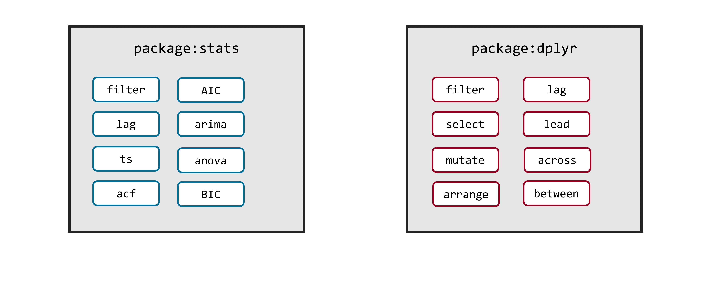
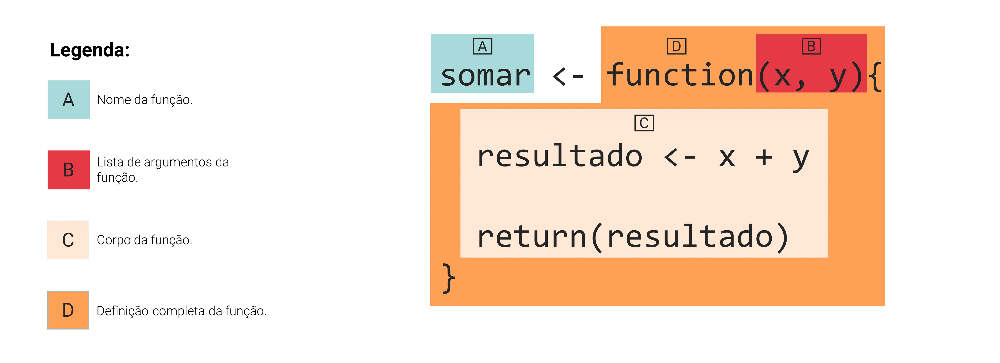

# Funções e Loops no R


## Introdução

Neste capítulo, veremos apenas uma introdução de como você pode criar as suas próprias funções no R, e automatizar alguns passos utilizando *loop*'s. É importante frisar que no início pode ser bem difícil de implementar a sua função. Isso ocorre principalmente, porque as funções quando executadas, rodam em um ambiente diferente do seu. 

Você talvez tenha ficado confuso com essa afirmativa, se perguntando: "O que diabos você quer dizer com um ambiente diferente?". O R não só é uma linguagem que trabalha com objetos, mas ele também é uma linguagem que trabalha com objetos que estão guaradados em ambientes específicos. Os ambientes no R são comumente chamados por *environments*. Vamos descrevê-los em mais detalhes na próxima seção.

Tudo o que você precisa entender agora, é que todas as operações que uma função realiza, ocorrem de forma implícita, em um local onde você não consegue ver cada uma dessas operações. É essa característica que torna bem difícil no início, a criação de funções pelo usuário. Ao tentar implementar a sua função pela primeira vez, você vai enfrentar quase sempre, algum erro. E pelo fato de você não conseguir acompanhar cálculo por cálculo da função, quando um erro aparece, a principal pergunta que você se faz é: "De onde este erro está vindo? Em que lugar da minha função ele ocorre?"

Tendo essas considerações em mente, vou mostrar aqui como você pode começar a montar as suas próprias funções, dando algumas dicas de como enfrentar erros, e quais são as formas de organizá-las, para que você não se perca no meio do processo.


## Noções básicas de *environments* {#sec:environments}

O R é não apenas uma linguagem que trabalha com objetos, mas também é uma linguagem que trabalha com objetos que estão contidos (ou guardados) em certos *environments*. Um *environment* (ou ambiente) no R, é parecido com uma lista nomeada, **onde cada nome mantido nessa lista é único**. Sendo que esses nomes dispostos em uma espécie de lista, nada mais são do que os nomes dos objetos que estão guardados e disponíveis nesse respectivo *environment*.

### O *environment* global

Toda vez que você inicia a sua sessão no R, você está trabalhando com um *environment* que chamamos de *global environment*, ou ambiente global. Logo, todos os seus objetos que você cria em sua sessão, são guardados no *global environment*. Você pode se referir a esse *environment* através da função `globalenv()`. Por exemplo, eu posso usar a função `ls()` para listar os nomes de todos os objetos que estão disponíveis especificamente no *global environment*, como no exemplo abaixo. No R, o endereço desse *environment* é referenciado como `R_GlobalEnv`.

```{r, eval = FALSE}
# Iniciei uma nova sessão no R

a <- 1
b <- 2

ls(envir = globalenv())
```
```
## [1] "a" "b"
```


Portanto, um *environment* é uma espécie de caixa, ou como um espaço reservado para guardar um certo conjunto de objetos. O seu *global environment* é um desses *environments*, onde ficam todos os seus objetos que você normalmente cria em sua sessão. Porém, todas as vezes que você está trabalhando no R, há diversos outros *environments* ativos. O motivo, ou a razão principal para a existência dessas estruturas, está na forma como a linguagem R procura pelos objetos que você pede a ela. Ou seja, como é destacado por @wickham2015_advanced os *environments* são a estrutura que sustentam as regras de *scoping*, ou as regras de "busca" da linguagem R. Mas pelo fato desse ser um assunto mais avançado da linguagem, isto não será abordado aqui. Você pode consultar @wickham2015_advanced para mais detalhes.

Tudo o que eu quero destacar nessa seção a respeito de *environments*, é o fato de que todo objeto está ligado a um certo *environment*. Logo toda função (lembre-se que tudo no R são objetos) possui o seu *environment*, e por isso, você terá muitas ocasiões em que você terá de acessar uma função através de seu respectivo *environment*, ao invés de simplesmente chamar pelo nome dessa função no console.

Por essas razões, podemos entender que um dos principais papéis desempenhados pelos *environments* no R, é o de adicionar uma nova camada de identificação de objetos. Se antes o R identificava os valores contidos em objetos, através do nome desse objeto que está conectado a esses valores, com o uso de *environments*, o R agora pode identificar diferentes valores ou diferentes objetos, através do nome desse objeto e do *environment* ao qual ele pertence. 

Pense por exemplo, no objeto `LETTERS`. Esse objeto está disponível toda vez que você inicia a sua sessão no R, pois ele se encontra no *environment* `base` (que faz parte de um dos pacotes básicos da linguagem, que sempre são carregados para a sua sessão). Nós podemos identificar o *environment* ao qual um objeto pertence, através da função `where()` do pacote `pryr`. Perceba que esse objeto, contém apenas as letras do alfabeto em maiúsculo. 

```{r}
LETTERS
```
```{r, eval = FALSE}
pryr::where("LETTERS")
```
```{r, eval = FALSE, highlight=FALSE}
## <environment: base>
```


Portanto, mesmo que eu crie um objeto em minha sessão, ou em outras palavras, um objeto em meu *global environment* chamado `LETTERS`, o R ainda será capaz de diferenciar esses dois objetos denominados `LETTERS`, através do *environment* ao qual eles pertencem. Após criarmos um novo `LETTERS`, se eu chamar por este objeto no console, o resultado será o valor contido no objeto `LETTERS` do meu *global environment*. Isso ocorre, pois o R irá sempre procurar primeiro por um objeto em seu *global environment*. Depois ele irá procurar em outros *environments* pelo objeto ao qual você requisitou. Esse caminho de *environments* pelo qual o R percorre durante sua procura, é comumente chamado por *search path* (ou "caminho de busca"). Para acessarmos o valor do objeto `LETTERS` original, podemos utilizar a função `get()`, que possui um argumento (`envir`) onde podemos definir qual o *environment* em que o R deve procurar pelo objeto. Podemos ver esse problema, através de uma representação visual como a da figura 5.1.

```{r, eval = FALSE}
env <- pryr::where("LETTERS")
```
```{r, include = FALSE}
env <- pryr::where("LETTERS")
```
```{r}
LETTERS <- "a"

LETTERS

get("LETTERS", envir = env)
```


```{r, out.width="80%", echo = FALSE, fig.cap="Representação de environments"}
knitr::include_graphics("Figuras/environments2.png")
```


### Os *environments* de pacotes

Portanto, o trabalho de um *environment* no R, é o de vincular, ou de associar um conjunto de nomes (os nomes dos objetos), a seus respectivos conjuntos de valores \cite[Cáp. 7]{wickham2015_advanced}. Ou seja, um dos principais papéis que um *environment* desempenha no R, é o de organizar um conjunto de objetos, de forma que o R seja capaz de diferenciar dois ou mais objetos com o mesmo nome.

Um bom exemplo disso, é a função `filter()` do pacote `dplyr`, que vimos no capítulo 4. Pois nós temos dentre os pacotes básicos do R, mais especificamente no pacote `stats`, uma outra função também chamada `filter()`. Por isso, sempre que chamamos pelo pacote `dplyr` através de `library()`, a seguinte mensagem aparece, nos informando que há um choque entre as duas funções.

```{r, eval = FALSE}
library(dplyr)
```
```{r, eval = FALSE, highlight=FALSE}
Attaching package: ‘dplyr’

The following objects are masked from ‘package:stats’:

    filter, lag
```

Essa mensagem está nos informando, que o pacote `dplyr` possui funções com os mesmos nomes das funções `filter()` e `lag()` do pacote `stats`, e por isso, ela estaria "escondendo" esses objetos de forma a evitar conflitos. Isso significa, que após carregarmos o pacote `dplyr`, e ele "esconder" essas funções, se nós chamarmos pela função `filter()` no console, estaremos utilizando a função do pacote `dplyr`, e não a função do pacote `stats`.

```{r, echo = F, fig.cap="Ambientes de pacotes no R"}

```


Portanto, essas duas funções `filter()`, são funções diferentes, que servem para propósitos diferentes. O único fator que permite ao R, diferenciar essas funções uma da outra, é o fato de que elas se encontram em ambientes, ou *environments* diferentes, como demonstrado na figura 5.2. Isso significa que todas as funções, possuem um *environment* ao qual estão associadas. Por isso, nós podemos diferenciar as funções `filter()` e `lag()` de ambos os pacotes (`dplyr` e `stats`), através do nome do *environment* ao qual essas funções pertencem.

Pacotes são um caso especial, pois eles contém dois *environments* diferentes que se relacionam entre si. Um é o *environment* propriamente dito do pacote, que contém os seus respectivos objetos, e um outro comumente chamada de *namespace*. Essa diferenciação só será útil na prática, quando você estiver desenvolvendo um novo pacote para o R. Logo, não se preocupe em entender agora a diferença entre esses dois espaços. Apenas entenda que pacotes no R, vão além de simples *environments* que contém os seus próprios objetos e funções, e que estão separados de seu *global environment*.


Tendo isso em mente, quando desejamos utilizar uma função que está em conflito com uma outra função de um outro pacote, nós devemos definir de alguma forma, o *environment* do pacote no qual o R deve procurar pela função que você está chamando. No caso de pacotes, podemos acessar funções definidas em seus respectivos *environments*, ao fornecer o nome do pacote que contém essa função, em seguida, abrir duas vezes dois pontos (`::`), e depois, colocar o nome da função que desejamos, como no exemplo abaixo.

```{r}
x <- ts(rnorm(100), start = c(1, 1990), end = c(4, 1998), frequency = 12)

stats::filter(x, filter = c(0.5, 0.8, 0.2))
```


### O *environment* de execução de uma função {#sec:environment_exec}

Toda função no R, possui o que nós chamamos de *function environment*, que corresponde ao *environment* no qual elas foram criadas. No exemplo abaixo, podemos ver esses *environments* pertencentes às funções `filter()` do pacote `dplyr`, e `seq()` do pacote `base`. Como um outro exemplo, caso eu crie uma nova função em minha sessão, perceba que o *environment* a qual ela pertence, se trata justamente do *global environment* (`R_GlobalEnv`).

```{r}
rlang::fn_env(dplyr::filter)

rlang::fn_env(seq)

soma <- function(x, y){
  return(x + y)
}

rlang::fn_env(soma)
```

Porém, as funções também possuem o que chamamos de *environment* de execução, que se trata do *environment* no qual os seus cálculos são executados. Ou seja, sempre que você executa uma função, os cálculos realizados por essa função são feitos em um *environment* separado do seu *global environment*. Como consequência, você não consegue visualizar o resultado de cada cálculo ou passo executado por essa função, pois essas etapas estão sendo realizadas em um local distante do *environment* no qual você se encontra. É dessa característica que surge uma das principais dificuldades em se criar a sua própria função. Pois já que você não pode visualizar os resultados de cada cálculo aplicado pela função, você terá que prever quais seriam as possibilidades para cada cálculo. Isso exige de você muita experiência com a linguagem, e nem sempre essa experiência será suficiente para para representar a realidade com precisão.

No exemplo abaixo, estou criando uma função `f_env`, que nos retorna justamente o endereço do *environment* no qual essa função executou a soma entre 4 e 5. Perceba que a cada momento em que eu executo essa função, ela me retorna um endereço diferente. Logo, esses *environments* de execução são temporários (ou efêmeros se preferir), e utilizados uma única vez pela função.

```{r}
f_env <- function(){
  
  soma <- 4 + 5
  
  env <- environment()
  
  return(env)
}

f_env()

f_env()
```

O motivo principal pelo qual esses *environments* de execução existem, é pelo fato de que nós em geral, não queremos que a função mexa ou altere os nossos objetos salvos em nosso *global environment*. Veja por exemplo, a função `norm` que busca normalizar uma variável numérica qualquer. Nessa função, três objetos são criados. Um contendo a média de x (`media`), outro possuindo o desvio-padrão da mesma variável (`desvio_pad`), e um último contendo os valores já normalizados (`normalizado`).

```{r}
norm <- function(x){
  media <- mean(x)
  desvio_pad <- sd(x)
  
  normalizado <- (x - media)/desvio_pad
  
  return(normalizado)
}

y <- rnorm(50)

norm(y)
```

Pelo fato de que a função `norm` executa os seus cálculos, e portanto, cria os seus objetos em um ambiente separado, mesmo que eu tenha objetos em meu *global environment* que se chamam `media`, ou `desvio_pad`, ou `normalizado`, em nenhum momento a função `norm` irá afetá-los. A função `norm` pode até utilizar-se de objetos que estão guardados em meu *global environment* para realizar os seus cálculos, mas em nenhum momento ela irá alterar o valor dessas variáveis em meu *global environment*, a menos que eu peça explicitamente para que ela realize tal alteração. Isso algo que eu não pretendo mostrar aqui, pois exige de você leitor, um conhecimento e experiência maiores com os *environments* do R.


## Uma introdução teórica às funções no R

As funções, lhe permitem automatizar tarefas, em uma forma mais intuitiva e poderosa, do que uma simples estratégia de copiar-colar [@wickham2017]. Portanto, sempre que houver algum tipo de repetição em seu trabalho, você pode utilizar uma função, em conjunto com um *loop*, para automatizar esse processo. Em outras palavras, uma função lhe permite com apenas um comando, aplicar várias outras funções e processos diferentes de uma vez só. Dessa forma, fica mais fácil aplicar repetidamente o mesmo conjunto de processos e comandos sobre os seus dados.

Vamos supor exemplo, que você seja o dono de 4 lojas de doces caseiros, e que essas lojas estão localizadas na cidade de Belo Horizonte, mais especificamente nos bairros Barro Preto, Savassi, Centro e Padre Eustáquio. Toda semana, o gerente de cada loja, te envia uma planilha contendo as vendas diárias de cada produto em sua loja. Você como dono dessas lojas, deseja sempre calcular algumas estatísticas para acompanhar as vendas de suas empresas. 

Porém, são 4 planilhas enviadas toda semana, e se você tem que calcular as mesmas estatísticas toda semana, porque não criar uma função que já executa esses cálculos por você? Dessa forma, você consegue calcular todas as suas estatísticas com apenas um comando, economizando tempo e esforço na manutenção dessas estatísticas. 

Vamos supor, que as planilhas de cada loja, assumem a seguinte estrutura abaixo. Como exemplo, vamos utilizar a planilha referente a loja localizada no bairro Savassi:

```{r, include = FALSE}
library(tibble)
library(dplyr)

set.seed(430)
savassi <- tibble(
  dia = sample(1:5, size = 785, replace = T),
  mes = 4L,
  ano = 2020L,
  vendedor = sample(c("Márcia", "Ana", "Nathália"), size = 785, replace = T),
  produtoid = sample(c("10014", "10115", "23010", "53200"), size = 785, replace = T),
  valor = 0
)
valor <- c("10014" = 7.89, "10115" = 15.45, "23010" = 4.1, "53200" = 11.25)

savassi$valor <- unname(valor[savassi$produtoid])

savassi <- arrange(savassi, dia)
```


```{r}
savassi
```


Portanto, cada planilha, apresenta cada venda que ocorreu durante a semana em uma determinada loja, e inclui informações como: o dia em que a venda ocorreu, o vendedor que realizou a venda, o valor da venda, e o código de identificação do produto que foi vendido. Vamos supor, que você esteja interessado em calcular: a receita total diária da loja, o número de vendas diárias de cada produto, e o lucro total dessa semana na loja de referência da planilha. Para isso, precisaríamos dos seguintes comandos:

```{r, eval =FALSE}
library(dplyr)
library(magrittr)

receita_por_dia <- as.vector(rowsum(savassi$valor, savassi$dia))
names(receita_por_dia) <- paste("Dia", unique(savassi$dia))


vendas_produto <- savassi %>%
  group_by(dia, mes, produtoid) %>% 
  summarise(
    receita = sum(valor),
    n_vendas = n()
  ) %>% 
  ungroup()


custo <- c("23010" = 1.5, "10014" = 5.43, "10115" = 11, "53200" = 8.9)

vendas_produto <- vendas_produto %>% 
  mutate(
    custo_t = custo[vendas_produto$produtoid] * n_vendas,
    lucro = receita - custo_t
  )

lucro_total <- sum(vendas_produto$lucro)
```

É um conjunto considerável de comandos, e você terá que replicá-los para outras 3 planilhas. Você pode criar uma função, ou um conjunto de funções, com o objetivo de facilitar esse processo de aplicação desses comandos sobre cada planilha. Porém, como temos ao menos três estatísticas diferentes (receita total diária; numéro de vendas diárias atingidas em cada produto; lucro total da semana), seria mais adequado, criarmos uma função especializada para cada uma dessas estatísticas, e em seguida, criar uma quarta função que será a nossa função principal, que ficará responsável por aplicar essas três funções especializadas que criamos, sobre as tabelas de vendas de cada loja.

Para iniciarmos uma nova função no R, nós precisamos utilizar a palavra chave `function`. Dito de outra forma, essa palavra chave indica ao R, que os próximos comandos, representam os componentes da nossa nova função. Toda função no R, possui três partes principais, mostradas na figura abaixo. Primeiro, temos o nome da função, que corresponde ao nome do objeto em que você está salvando a sua função. Segundo, temos os argumentos, ou os parâmetros dessa função, que são definidos dentro de um par de parênteses posicionados ao lado da palavra chave (`function`). Terceiro, temos o corpo da função, que é definido dentro de um par chaves (`{}`). Dentro desse par de chaves, você deve colocar todos os comandos, ou todos os cálculos que você deseja aplicar sobre os *input*'s da função. 

```{r, echo = FALSE, out.width="80%", fig.cap="Estrutura de uma função"}

```

Os *input*'s de uma função, são os objetos, ou os dados que você fornece à função para ela trabalhar. Esses *input*'s são geralmente fornecidos, ao conectarmos um objeto a um dos argumentos da função. Porém, esses *input*'s não precisam estar conectados a algum argumento, nem precisam fazer parte de seu *global environment*.

Toda função no R, possui ainda um quarto componente, que se trata do *environment* ao qual ela pertence, que definimos na seção ["O *environment* de execução de uma função"](#sec:environment_exec). Esse componente é automaticamente definido no momento em que você cria a função, e é comumente chamado de *function environment*. Para relembrarmos, esse item se trata apenas do *environment* no qual você está criando essa função. Como na maioria do tempo, você estará trabalhando no seu *global environment*, a maioria das funções que você criar, teram o *global environment* como o seu *function environment*.


Como exemplo, eu posso criar através dos comandos abaixo, uma simples função de soma chamada `funcao_soma()`, que possui dois parâmetros, ou dois argumentos chamados `x` e `y`. O objeto `soma` que está definido dentro do corpo da função, é criado sempre que você executa a função `funcao_soma()`. Porém, como todas as funções são executadas em um ambiente separado de seu *global environment*, o objeto `soma` é criado e salvo em um ambiente diferente do seu, e por isso, você não possui acesso direto ao objeto `soma` a partir de seu environment. Mas você possui acesso indireto ao objeto `soma`, se você pedir a função `funcao_soma()`, que lhe retorne (como resultado da função) o que foi salvo neste objeto, como requisitado no exemplo abaixo pela função `return()`.

```{r}
funcao_soma <- function(x,y){
  soma <- x + y
  return(soma)
}

funcao_soma(54, 32)
```

Os argumentos de toda função, funcionam como apelidos que auxiliam a função, sobre como e onde ela deve posicionar no corpo da função, os valores que fornecermos a esses argumentos. Ou seja, você não precisa nomear os seus objetos com o mesmo nome presente nos argumentos de uma função. Pois a função utiliza o nome de seus argumentos, apenas como um meio de transportar os seus *input*'s para o seu corpo. 

Como exemplo, eu possuo abaixo uma função chamada `extrair()`. Pelo corpo da função, podemos identificar que essa função irá extrair os valores de uma coluna chamada `horario`, do objeto que conectarmos ao argumento `x`, e irá salvar esses valores em um objeto chamado `extr_x`. Por outro lado, também podemos perceber que a função `extrair()` busca aplicar a função `order()` sobre os valores contidos na coluna `valor`, que está presente no objeto que fornecermos ao argumento `y`. Porém, no caso do argumento `z`, a função vai apenas somar os valores (através da função `sum()`) contidos no objeto que oferecermos à esse argumento da função `extrair()`.

```{r}
extrair <- function(x, y, z){
  extr_x <- x$horario
  extr_y <- order(y$valor)
  calc_z <- sum(z)
}
```

Para acessarmos a função que acabamos de criar, precisamos apenas utilizar o nome do objeto onde salvamos a função e abrirmos um par de parênteses. Logo, se eu quisesse acessar a função `extrair`, eu devo utilizar os comandos abaixo. Lembre-se que ao utilizar uma função, você pode definir um argumento implicitamente, ou explicitamente. Se você não deixa claro a que argumento um objeto está conectado, esse objeto é conectado ao argumento correspondente a sua ordem. Em outras palavras, no exemplo abaixo, o primeiro objeto dentro do parênteses (como o objeto `funcionarios` abaixo), é conectado ao primeiro argumento da função `extrair` (argumento `x`), o segundo objeto (`vendas`), ao segundo argumento (argumento `y`), e assim por diante. Porém, caso você deseja fornecer algum objeto fora da ordem dos argumentos de uma função, você deve definir explicitamente qual o argumento que aquele objeto deve ser direcionado. Para isso, basta igualar o objeto ao nome do argumento desejado da função.

```{r, eval = FALSE}
extrair(funcionarios, vendas, vendas)

extrair(funcionarios, z = vendas, y = vendas)
```


## Construindo um conjunto de funções

Vamos retornar ao nosso exemplo, em que você é dono de 4 lojas de doces localizadas na cidade de Belo Horizonte, e você precisa toda semana manter um conjunto de três estatísticas sobre cada loja. Em mais detalhes, precisamos calcular para cada loja, as seguintes estatísticas:

1) Receita total diária (queremos identificar se houve alguma variação importante na receita, ao longo da semana).

2) Número de vendas diárias de cada produto (queremos saber quais produtos estão bombando).

3) Lucro total da semana (nessa semana, entramos no azul? ou no vermelho?).

Eu poderia muito bem criar uma única função que é capaz de calcular todas essas estatísticas de uma vez só. Porém, com o objetivo de incentivar melhores práticas, vou criar um conjunto de 4 funções. Dentre esse conjunto, 3 função serão responsáveis por calcular as estatísticas, e uma quarta função será responsável por aplicar as três funções anteriores sobre alguma tabela que fornecermos como *input*.

### Calculando a receita total diária

Vamos começar, com uma função para calcular a receita total diária de cada loja. Primeiro, precisamos decidir um nome para o nossa função, ou em outras palavras, o nome do objeto em que vamos salvar a nossa função. O nome desse objeto, se torna o nome dessa função. Dessa forma, podemos acessar a função salva no objeto `receita_diaria`, ao abrirmos parênteses após esse nome.

Para calcularmos a receita total diária, precisamos de duas informações: as colunas `valor` e `dia`. A coluna `dia`, define os grupos que queremos utilizar para calcular a nossa receita total. E a coluna `valor`, informa a receita adquirida em cada venda. A função `rowsum()` representa uma solução eficiente para calcularmos essa receita, e possui dois argumentos principais: 1) `x`, o vetor (ou `data.frame`) com os valores a serem somados; 2) `group`, o vetor contendo os valores que apresentam o grupo de cada observação em `x`. Porém, como essa função costuma nos retornar uma matriz como resultado, eu posso aplicar a função `as.vector()` sobre ela, para transformar esse resultado em um vetor.

```{r}
receita_diaria <- function(vl, grp){
  
  receita <- as.vector(rowsum(x = vl, group = grp))
}

receita_diaria(savassi$valor, savassi$dia)
```

Como definimos anteriormente, os nomes dos argumentos (`vl` e `grp`) da nossa função, são apenas pronomes, ou apelidos para os *input*'s da nossa função. Esses apelidos, servem apenas para guiar a função, e determinam onde esses `input`'s devem ser posicionados no corpo da função. No exemplo acima, o pedaço `rowsum(x = vl` no corpo da função, indica que o *input* que nós fornecermos ao argumento `vl` da função `receita_diaria()`, deve ser conectado ao argumento `x` da função `rowsum()`.

Você talvez tenha percebido, que ao executarmos a função `receita_diaria()` acima, nenhum resultado foi retornado. Isso ocorre, porque nós não utilizamos no corpo da função, algum comando para retornar o objeto (`receita`) onde o resultado foi salvo. Ou seja, a função aplicou sim os comandos que definimos em seu corpo. Ela apenas não se preocupou em nos retornar o resultado. Para isso, podemos simplesmente chamar pelo nome do objeto, ao final do corpo da função. Ou utilizar uma função como `print()` ou `return()` para nos retornar esse resultado. Eu prefiro utilizar uma função, pois é uma maneira mais formal e clara de se definir o objeto que contém o resultado de sua função. Veja abaixo, que ao colocarmos a função `return()` no corpo, a nossa função passa a nos retornar as receitas totais diárias calculadas.

```{r}
receita_diaria <- function(vl, grp){
  
  receita <- as.vector(rowsum(x = vl, group = grp))
  
  return(receita)
}

receita_diaria(savassi$valor, savassi$dia)
```

Entretanto, o vetor resultante de `receita_diaria()`, ainda carece de alguma notação, que seja capaz de nos informar o dia que cada valor presente no vetor se refere. Ou seja, o valor 1508,27 se refere a que dia do mês? Dia 01? 02? 03? ... Com isso, eu utilizo a função `names()` sobre o objeto `receita`, para definir um nome para cada um desses valores, contendo o dia a que eles se referem.

```{r}
receita_diaria <- function(vl, grp){
  
  receita <- as.vector(rowsum(x = vl, group = grp))
  names(receita) <- paste("Dia", unique(grp))
  
  return(receita)
}

receita_diaria(savassi$valor, savassi$dia)
```


### Calculando o número de vendas diárias de cada produto

Agora que temos a função `receita_diaria()`, podemos passar agora, para o cálculo do numéro de vendas diárias atingidas em cada produto. Vou chamar essa função de `produtos_vendas()`, e ela vai possuir apenas um argumento (`dados`), que representa a planilha de cada loja, contendo os dados de cada venda da semana. 

Para realizarmos o cálculo desejado, precisamos realizar duas etapas: 1) pegar a tabela que fornecermos como *input* e agrupá-la, ou seja, precisamos definir o grupo da tabela, e para isso, podemos utilizar a função `group_by()`; 2) em seguida, podemos calcular as estatísticas e guardá-las em uma nova tabela. A função `summarise()` é uma boa alternativa para essa etapa. Uma outra etapa opcional, mas não obrigatória nesse cálculo, é a de eliminar a definição dos grupos da tabela, com o objetivo de retornar a tabela calculada, para o estado de uma tabela tradicional. Como eu disse, essa é uma etapa opcional, e que não afeta em nada a nossa tabela em si, estamos apenas "desagrupando" a tabela, ou eliminando a descrição que definia os grupos dessa tabela. Para essa etapa opcional, podemos utilizar a função `ùngroup()`.

```{r, include = FALSE}
produtos_vendas <- function(dados){

  vendas_produto <- dados %>%
    group_by(dia, produtoid) %>% 
    summarise(
      receita = sum(valor),
      n_vendas = n()
    ) %>% 
    ungroup()
  
  return(vendas_produto)
}
```

```{r, eval = FALSE}
produtos_vendas <- function(dados){

  vendas_produto <- dados %>%
    group_by(dia, produtoid) %>% 
    summarise(
      receita = sum(valor),
      n_vendas = n()
    ) %>% 
    ungroup()
  
  return(vendas_produto)
}

produtos_vendas(savassi) %>% print(n = 10)
```

```
## # A tibble: 20 x 4
##      dia produtoid receita n_vendas
##    <int> <chr>       <dbl>    <int>
##  1     1 10014        339.       43
##  2     1 10115        680.       44
##  3     1 23010        152.       37
##  4     1 53200        338.       30
##  5     2 10014        284.       36
##  6     2 10115        865.       56
##  7     2 23010        160.       39
##  8     2 53200        405        36
##  9     3 10014        252.       32
## 10     3 10115        525.       34
## # ... with 10 more rows
```


### Calculando o lucro total

Após criarmos as funções `produtos_vendas()` e `receita_diaria()`, precisamos de uma função para calcularmos o lucro total. Vou dar o nome de `calc_lucro()` a essa função. Sendo que para o cálculo do lucro, precisamos apenas subtrair o custo total da receita total. O cálculo da receita total é simples, precisamos apenas somar os valores dispostos na coluna `valor` da tabela de cada loja. 

Já para o custo total, temos uma solução prática através do uso de *subsetting*. Precisamos primeiro criar um vetor contendo os custos de cada produto (vetor `custo`). Em seguida, nós replicamos esse vetor ao longo da tabela de vendas de cada loja, de acordo com cada produto vendido (`custo[x$produtoid]`). Por último, nós somamos os custos desse vetor para chegarmos ao custo total.

```{r}
calc_lucro <- function(x){
  
  custo <- c("23010" = 1.5, "10014" = 5.43, "10115" = 11, "53200" = 8.9)
  
  custo_total <- sum(custo[x$produtoid])
  
  receita_total <- sum(x$valor)

  lucro_total <- receita_total - custo_total
  
  return(lucro_total)
}

calc_lucro(savassi)
```


### Agrupando essas funções em uma só

Após construírmos todas as três funções que precisamos aplicar, nós podemos criar uma última função, que irá aplicar todas essas três funções de uma vez só. Agora, como podemos retornar múltiplos resultados em uma função? Pois nós temos agora, três resultados diferentes a serem calculados pela função, e nós gostaríamos de ter acesso a cada um desses três resultados. A resposta para essa pergunta, é uma lista. Pois você pode incluir o que você quiser dentro de uma lista, logo, basta colocarmos todos os resultados em uma lista, e pedir a função `return()` que nos retorne essa lista, como resultado da função `calc_stats()` abaixo.

```{r}
calc_stats <- function(tabela){
  
  receita <- receita_diaria(vl = tabela$valor, grp = tabela$dia)
  
  lucro_total <- calc_lucro(tabela)
  
  produtos_vendas <- produtos_vendas(tabela)
  
  lista <- list(
    receita = receita,
    lucro = lucro_total,
    vendas = produtos_vendas
  )
  
  return(lista)
}
```

Com a função `calc_stats()`, fica mais simples replicar os cálculos ao longo das tabelas de cada loja, como no exemplo abaixo.

```{r, eval = FALSE}
savassi_stats <- calc_stats(savassi)
barro_preto_stats <- calc_stats(barro_preto)
padre_eustaquio_stats <- calc_stats(padre_eustaquio)
centro_stats <- calc_stats(centro)
```


## Introduzindo loops

Como o próprio nome dá a entender, um *loop* busca criar um ciclo que se repete em torno de uma operação (ou de um conjunto de operações). Em outras palavras, um *loop* cria uma repetição, e em uma dessas repetições, um mesmo conjunto de operações são aplicadas pelo R. O objetivo de um *loop*, é que a cada repetição, podemos alterar os *input*'s das funções que estão sendo aplicadas nessas operações, e consequentemente, os seus resultados.

Na seção passada, vimos como podemos criar funções, que representam uma forma concisa de aplicar todos os seus passos e cálculos, com apenas um comando. Agora, com o uso de *loop*'s, podemos aplicar repetidamente uma função ao longo de diversos pontos, ou sobre diversos *input*'s diferentes. Dito de outra forma, com um *loop*, podemos automatizar o processo de aplicação de uma função ao longo de diferentes *input*'s. 

Na linguagem R, temos dois tipos, ou duas famílias principais de *loop*'s. Mas aqui vou focar apenas em um desses tipos, que é o *loop* `for()`. A estrutura básica de um `for()` *loop*, se assemelha muito à estrutura de uma função. Porém, diferente de uma função, você não precisa salvar um `for()` *loop* em algum objeto. Um `for()` *loop* é sempre iniciado pela palavra chave `for`. Ao lado dessa palavra chave, devem ser posicionados um par de parênteses, e um par de chaves. Criando assim, a estrutura básica abaixo.

```{r, eval = F}
for(i in vetor){
  # Corpo do loop
}
```

Um `for()` *loop* possui dois componentes principais: 1) a definição do *loop*, que rege como os índices do *loop* vão variar a cada repetição; 2) e o corpo deste *loop*, que contém todas as funções e operações que serão aplicadas em cada repetição. A definição do *loop* é sempre definida nos parênteses que estão logo em seguida da palavra chave `for`, e será onde você irá definir quantas vezes o *loop* irá repetir, e também, sobre qual conjunto de valores ele vai variar. 

```{r, echo = F, out.width="80%", fig.cap = "Estrutura de um loop", fig.pos="h"}
knitr::include_graphics("Figuras/loop1.png")
```

Um `for()` *loop* possui um índice, que a cada repetição, assume um valor diferente. Você deve determinar o conjunto de valores que esse índice vai assumir, na definição do *loop*, ao fornecer um vetor (ou uma função que retorne um vetor) contendo esse conjunto de valores, a direita da palavra chave `in`. Sendo que através desse vetor, ou desse conjunto de valores, você está indiretamente determinando quantas vezes o *loop* vai repetir as operações definidas em seu corpo. Ou seja, se o vetor fornecido na definição do *loop*, possui 5 valores diferentes, o *loop* vai gerar 5 repetições, mas se esse vetor possui 10 valores, o *loop* vai gerar 10 repetições, e assim por diante.

Já o corpo do *loop*, funciona da mesma forma que o corpo de uma função. Dessa maneira, o corpo de um *loop*, contém todas as funções e transformações que o `for()` *loop* vai aplicar em cada repetição. Com isso, você vai utilizar o índice do *loop*, para variar os `input`'s utilizados pelas funções presentes no corpo desse *loop*, e consequentemente, variar os seus resultados gerados a cada repetição do *loop*.

O índice dos *loop*'s mostrados nessa seção, é representado pela letra `i`. Você pode dar o nome que quiser a esse índice, basta substituir o `i` na definição do *loop* pelo nome desejado. No nosso caso aqui, nós optamos por utilizar a letra `i` para nos referir a esse índice, e por isso, em todos os locais do corpo do *loop*, em que a letra i aparece sozinha\footnote{Ou seja, não estou me referindo as letras `i`'s que aparecem no meio de palavras como \texttt{pr**i**nt}.}, temos um local onde o índice será utilizado. Em outras palavras, se o meu índice é chamado pela letra `i`, e eu possuo uma parte do corpo de meu *loop*, como `sum(i)`, isso significa que a cada repetição do *loop*, a função `sum()` será aplicada sobre o valor que o índice `i` assumir nessa respectiva repetição.

O exemplo mais simples de um *loop*, seria um que mostra cada valor incluso no vetor que eu forneci na definição do *loop*. No exemplo abaixo, estou criando um *loop* que vai variar sobre uma sequência de 1 a 10. Perceba abaixo, que o `for()` *loop* não está executando nada além de um simples comando de `print()` sobre o valor assumido pelo índice `i`. Ou seja, a cada repetição, tudo o que `for()` *loop* está fazendo é mostrar qual o valor que o índice `i` assumiu nessa repetição.

```{r}
for(i in 1:10){
  print(i)
}
```


Portanto, no exemplo acima, ao estipularmos na definição de *loop*, o conjunto de valores sobre os quais o índice do *loop* iria variar, incluímos uma sequência de 1 a 10, através do código `1:10`. Entretanto, nós podemos incluir o que quisermos como conjunto de valores, desde que eles estejam em algum vetor (seja esse vetor, um vetor atômico ou uma lista). Por exemplo, nós podemos colocar um vetor de nomes, como no exemplo abaixo.

```{r}
vec <- c("Ana", "Eduardo", "Heloísa")

for(i in vec){
  print(i)
}
```

Porém, uma forma mais interessante e poderosa de se utilizar o índice de seu *loop*, é através de um mecanismo de *subsetting*. Ou seja, você pode utilizar o índice de seu *loop*, como um índice de *subsetting*, em cada repetição do *loop*. Dessa forma, a cada repetição, você aplica as funções definidas no corpo do *loop*, em uma parte diferente de seus dados. O índice de seu *loop*, passa a ser o índice que representa uma parte específica de seus objetos, ao ser utilizado pelas funções de *subsetting* (funções `[` e `[[`). Lembre-se que podemos utilizar diferentes tipos de índice dentro das funções de *subsetting*, como demonstrado na seção [*Subsetting*](#sec:subsetting), porém, no caso de um *loop*, os índices de tipo numérico (`integer`) e textual (`character`) são os mais úteis.

Por exemplo, logo abaixo, temos uma lista que contém alguns valores numéricos. Porém, eu dei um nome a cada um desses valores numéricos. Perceba abaixo, que no corpo do *loop* (mais especificamente no código `lista[[i]]`), estamos utilizando a função `[[` para extrair o elemento do objeto `lista`, que possui o nome igual ao valor que o nosso índice `i` assume em uma dada repetição. Dessa forma, nós estamos multiplicando por 10, apenas os elementos de `lista`, que estão nomeados de acordo com os valores contidos no vetor `vec`, que representa o conjunto de valores que o índice do *loop* vai assumir. Ou seja, nós podemos utilizar um `for()` *loop*, para aplicarmos uma função apenas sobre algumas partes específicas de nossos dados (deixando outras partes intactas). Perceba abaixo, que em nenhum momento o *loop* chega a lidar com o valor 40, que está nomeado como Marcos no objeto `lista`.


```{r}
vec <- c("Ana", "Eduardo", "Heloísa")

lista <- list(
  "Ana" = 15,
  "Eduardo" = 30,
  "Heloísa" = 10,
  "Marcos" = 40
)

for(i in vec){
  print(lista[[i]])
  print(lista[[i]] * 10)
}
```


### O problema do vetor crescente {#sec:growing_vector}

Para salvar os resultados gerados em cada repetição do `for()` *loop*, é **muito importante** que você crie previamente, um objeto que possa guardar esses resultados [@gillespie2017; @wickham2017]. Em outras palavras, você precisa reservar o espaço necessário para guardar os resultados, antes mesmo de executar o `for()` *loop*. Por exemplo, se eu possuo um `data.frame` contendo 4 colunas numéricas, e desejo calcular a média de cada coluna, eu preciso criar algum objeto que possa receber as 4 médias que serão geradas pelo *loop*. No exemplo abaixo, eu utilizo a função `vector()` para criar um novo vetor atômico chamado `media`, que é do tipo `double` e que possui 4 elementos. Logo, dentro do corpo do *loop*, eu salvo os resultados da função `mean()` dentro de cada elemento desse vetor `media`.

```{r}
df <- data.frame(
  a = rnorm(20),
  b = rnorm(20),
  c = rnorm(20),
  d = rnorm(20)
)

media <- vector(mode = "double", length = 4)
for(i in 1:4){
  media[i] <- mean(df[[i]])
}

media
```


Esse problema é conhecido por muitos usuários, como o *growing vector problem* (ou "problema do vetor crescente"). Caso você se esqueça de reservar previamente o espaço para guardar os resultados, o seu *loop* será bem lento. Pois a cada repetição do *loop*, um novo resultado é gerado e, portanto, o computador tem que reservar um tempo para aumentar o vetor onde esse resultado será guardado, de forma que aquele novo resultado "caiba" neste vetor. Ou seja, se o meu *loop* vai gerar 2 mil repetições, o meu computador vai ter que parar 2 mil vezes durante o processo, para aumentar um elemento a mais em meu vetor, com o objetivo de guardar o novo resultado gerado em cada uma dessas 2 mil repetições. Por outro lado, se eu já reservo previamente um vetor com 2 mil elementos, o meu computador não precisa parar durante o processo, pois todo o espaço necessário já está preparado e a espera do novo resultado gerado em cada repetição.

Por isso, você precisa sempre pensar sobre quais tipos de resultados serão gerados em seu *loop*. Ou seja, será que a cada repetição de seu *loop*, um único número é gerado (por exemplo, uma média)? Ou um vetor (podemos aplicar um teste lógico em cada coluna, e ter um vetor lógico como resultado)? Ou uma tabela (na próxima seção, damos um exemplo desse caso)? A partir do momento que você sabe qual o tipo de resultado que será gerado pelo seu *loop*, você pode identificar com mais facilidade, qual a melhor estrutura para guardar esses valores. Pergunte-se: será que um vetor atômico consegue guardar esses resultados? Ou uma lista é mais adequada? Lembre-se que vetores atômicos só podem guardar dentro de si, valores que pertencem ao mesmo tipo de dado (`double`, `integer`, `logical`, `character`, etc.). Além disso, nós não podemos guardar um vetor, ou uma tabela, ou em outras palavras, um conjunto de valores dentro de cada elemento de um vetor atômico. Logo, caso o resultado de cada repetição de seu *loop* seja, por exemplo, uma tabela, é melhor que você utilize uma lista para guardá-las. 


## Um estudo de caso: uma demanda real sobre a distribuição de ICMS {#sec:demanda_dist_ICMS}

Nessa seção, vou apresentar um exemplo prático, sobre uma demanda real que chegou até mim em 2020. Na época, eu trabalhava como estagiário na Diretoria de Estatística e Informações da Fundação João Pinheiro (FJP-MG), mais especificamente com uma lei estadual que é tradicionalmente chamada de Lei Robin Hood (Lei 18.030 de 2009 - MG). Essa lei rege a distribuição do ICMS total de Minas Gerais, ao longo dos municípios do estado. 

Em resumo, o Governo de Minas Gerais, coleta o ICMS (imposto sobre operações relativas à circulação de mercadorias e sobre prestações de serviços de transporte interestadual, intermunicipal e de comunicação) gerado em todo o estado, e ao final de um período, ele redistribui esse valor para os 853 municípios do estado. Cada município, possui um índice de participação, que corresponde à porcentagem do ICMS total ao qual o respectivo município tem direito. Em outras palavras, se o ICMS total gerado no estado em um perído foi de 8,5 bilhões de reais, e o município de Belo Horizonte possui um índice de participação equivalente a 0,009, isso significa que ao final do período, 0,9% do ICMS total, ou 76,5 milhões de reais serão transferidos para a prefeitura do município de Belo Horizonte.

A lei possui diversos critérios presentes no cálculo do índice de participação de cada município, sendo alguns deles: Turismo, Esporte, Patrimônio Cultural, População e Receita Própria. Em suma, o índice de participação de cada município, é calculado a partir de uma média ponderada dos índices de cada um desses diversos critérios da lei. Você pode encontrar uma descrição completa desses critérios e do cálculo dos índices de participação, no texto original da lei^[https://www.almg.gov.br/consulte/legislacao/completa/completa-nova-min.html?tipo=LEI&num=18030&comp=&ano=2009&texto=original].

### A demanda em si

A demanda é muito simples, porém, ela é trabalhosa e envolve um volume excessivo de repetição se você optar por utilizar programas como Excel para resolvê-la. Dentre os vários critérios da lei, temos o critério de Meio Ambiente, e o orgão responsável pelo cálculo do índice referente a esse critério, é a SEMAD-MG (Secretaria de Estado de Meio Ambiente e Desenvolvimento Sustentável). Um dia, a SEMAD chegou até nós da Fundação João Pinheiro (FJP), pedindo por todos os valores de ICMS transferidos para cada município, ao longo dos anos de 2018 e 2019, de acordo com o critério do Meio Ambiente da Lei Robin Hood.

Nós da FJP, calculamos todo mês, os valores transferidos de ICMS separados por cada critério da lei, e para cada município. Ou seja, para o ano de 2019, pense por exemplo, em uma lista de arquivos de Excel parecida com a lista abaixo, onde cada planilha corresponde aos valores de ICMS transferidos em um mês específico do ano. 

```{r, echo = F, out.width="80%", fig.cap = "Lista de arquivos do Excel"}
knitr::include_graphics("Figuras/planilhas1.png")
```

Dando uma olhada mais de perto, cada uma dessas planilhas do Excel, assumem a estrutura abaixo. Onde cada linha da tabela, representa um município do estado de Minas Gerais, e cada coluna (ou pelo menos, grande parte dessas colunas), representa os valores de ICMS transferidos segundo os índices de um critério específico da lei. Ou seja, a coluna `Educação`, nos apresenta os valores de ICMS transferidos para cada município do estado, considerando-se o índice que cada um desses municípios adquiriram no critério de Educação, e também, considerando-se a parcela que o critério de Educação representa do total de ICMS distribuído. 

```{r}
library(readxl)

Abril_2019 <- read_excel("planilhas/Abril_2019.xlsx")

Abril_2019
```


Porém, temos dois problemas aqui: 1) A SEMAD precisa apenas dos valores de ICMS transferidos de acordo com o critério de Meio Ambiente, e nada mais; 2) A SEMAD precisa dos valores de ICMS transferidos ao longo de todos os meses dos anos de 2018 e 2019, e se nós temos 12 planilhas por ano, temos que reunir então 24 planilhas para a secretaria. Alguns poderiam argumentar que esses pontos não se configuram como problemas de fato. Em outras palavras, algumas pessoas poderiam dizer algo como: "Ora, você precisa apenas pegar as 24 planilhas, depois juntá-las em um arquivo `.zip`, e simplesmente enviar esse arquivo para a SEMAD. A SEMAD que se vire para coletar e organizar as informações dessas planilhas!". 

Entretanto, essa não é uma boa política de trabalho. Transportando esse problema para um ambiente mais corporativo, o excesso de informação traz dificuldades para a tomada de decisão da empresa, pois ele camufla aquelas pequenas informações que são de fato relevantes. Ou seja, carregar apenas as informações que são relevantes para a empresa, representa uma boa prática. Além disso, o pedido da SEMAD é simples, e os problemas pontuados acima são de rápida e fácil solução no R, através do uso de funções e *loop*'s.

Como exemplo prático, vamos mostrar a metodologia apenas para essas 12 planilhas referentes ao ano de 2019, e você pode replicar facilmente essa metodologia para as outras 12, 24, 36 ou quantas outras planilhas desejar. Em suma, a metodologia que vou apresentar envolve duas etapas: 1) juntar todas essas 12 planilhas, em uma planilha só. Ou seja, desejamos guardar em uma planilha única, os valores transferidos aos municípios de MG em cada mês do ano de 2019; 2) Selecionar apenas as colunas relevantes para a SEMAD no arquivo final. Tendo essas etapas em mente, isso seria um trabalho muito repetitivo no Excel. Uma repetição que é cansativa, e que pode facilmente te levar a erros no processo. Aqueles com mais experiência no Excel, poderiam utilizar a plataforma de *queries* do programa para carregar os dados de cada planilha. Porém, apenas pelo tempo que você levaria para configurar a sua *querie*, seria muito mais rápido se você simplesmente adotasse a estratégia de `Crtl+C` e `Ctrl+V`, para transferir os dados em uma planilha única.

Por outro lado, traduzindo essa metodologia para o R, precisaríamos realizar as seguintes etapas: 1) construir uma função, que será responsável por importar essas planilhas para o R, além de já inserir uma coluna que define o mês a que os dados se referem, e de selecionar apenas as colunas relevantes para a SEMAD; 2) em seguida, podemos utilizar um *loop* para replicar a função criada ao longo de todas as planilhas disponíveis na pasta; 3) por fim, uní-las em uma única tabela com a função `bind_rows()`. Ou seja, o objetivo é ler todas as 12 planilhas com apenas um comando, e em seguida, utilizar um segundo comando para unir essas planilhas em uma só.

Tendo isso em mente, o primeiro passo é criarmos uma função que será responsável por importar e configurar os dados de cada planilha. Antes disso, vamos coletar os nomes de cada planilha, através da função `list.files()`. Como o próprio nome dá a entender, essa função busca listar os nomes de todos os arquivos contidos em uma pasta. Caso você não defina alguma pasta específica na função (diferente do que fizemos abaixo), `list.files()` vai listar todos os arquivos presentes no seu diretório de trabalho atual do R.

```{r}
nomes_planilhas <- list.files("planilhas/")

nomes_planilhas
```


Em resumo, a nossa função (chamada `ler_excel()`) vai receber como *input*, o nome de cada planilha que acabamos de coletar através da função `list.files()`, e vai aplicar 3 etapas principais: 1) importar para o R, a planilha que contém o nome que fornecemos como *input*; 2) a função vai selecionar apenas as colunas relevantes à SEMAD (as colunas que contém os códigos de cada município, e a coluna `Meio Ambiente`); 3) em seguida, essa função vai criar três novas colunas nessa planilha, que contém o nome da planilha de onde esses dados vieram, além do mês e do ano, que estão implícitos no nome dessa planilha.

Para importarmos as planilhas do Excel, podemos utilizar a função `read_excel()`, que introduzimos na seção [Importando arquivos em Excel com `readxl`](#sec:read_excel). Porém, para fornecermos os endereços corretos de cada planilha à função `read_excel()`, nós precisamos criar um mecanismo que possa colar o caminho até a pasta onde se encontram esses arquivos, ao nome de cada planilha. Algo que podemos facilmente resolver com o uso da função `paste()`. Com essa função, podemos unir o nome da pasta onde as planilhas se encontram (pasta `planilhas`), ao nome de cada planilha que a função receber como *input*.

Para adicionarmos novas colunas à planilha, nós podemos utilizar a função `mutate()`, que introduzimos na seção [Adicionando variáveis à nossa tabela com `mutate()`](#sec:mutate_dplyr). Essas novas colunas são necessárias, pois vão conter informações essenciais como o mês e ano a que os dados se referem. Dentre essas novas colunas, teremos a coluna `Origem`, que vai conter apenas o nome da planilha que está sendo lida pela função, e que portanto, guarda a origem dos dados selecionados pela função. Dessa forma, nós teremos dentro dos nossos dados, uma coluna que é capaz de nos informar a planilha de onde os dados vieram. 

Em contrapartida, como o mês e o ano a que os dados de cada planilha se referem, estam implícitos no próprio nome da planilha, precisamos de funções que possam lidar com *input*'s textuais. Para extrairmos os anos de cada planilha, nós podemos utilizar a função `parse_number()` (que é capaz de extrair números que se encontram em uma cadeia de texto), guardando o resultado dessa função, em uma coluna chamada `Ano`. Entretanto, para extrairmos o mês do nome de cada planilha, teremos um pouco mais de trabalho. Pois os nomes de cada planilha variam em comprimento, e por isso, não posso simplesmente extrair os 5, 6, ou 7 primeiros caracteres de cada nome. A melhor alternativa, é utilizarmos a função `str_length()` para calcularmos o número total de caracteres em cada nome, e em seguida, eliminarmos a parte que permanece constante em todos os nomes das planilhas (mais especificamente, a parte `_2019`).

```{r, include = F}
library(readxl)
library(tidyverse)

ler_excel <- function(x){
  
    caminho <- paste("planilhas/", x, sep = "")
    
    planilha <- read_excel(caminho) %>% 
      mutate(
        Origem = x,
        Ano = parse_number(x),
        Mês = str_sub(x, start = 1, end = str_length(x) - 10)
      ) %>% 
      select(IBGE1, `Municípios`, Origem, Ano, `Mês`, `Meio Ambiente`)
    
    return(planilha)
}
```
```{r, eval = F}
library(readxl)
library(tidyverse)

ler_excel <- function(x){
  
    caminho <- paste("planilhas/", x, sep = "")
    
    planilha <- read_excel(caminho) %>% 
      mutate(
        Origem = x,
        Ano = parse_number(x),
        Mês = str_sub(x, start = 1, end = str_length(x) - 10)
      ) %>% 
      select(IBGE1, `Municípios`, Origem, Ano, `Mês`, `Meio Ambiente`)
    
    return(planilha)
}
```


Com a nossa função `ler_excel()` construída, podemos aplicá-la sobre o primeiro nome contido em nosso objeto `nomes_planilhas`, como um teste. Pelo resultado abaixo, nós podemos confirmar que a função está funcionando exatamente como esperávamos.

```{r, warning=F}
ler_excel(nomes_planilhas[1])
```

Agora que temos a função construída, nós somos capazes de utilizar um `for()` *loop* para replicar a função `ler_excel()` sobre cada uma das 12 planilhas presentes na pasta `planilhas` do meu computador. Porém, é muito importante destacar, que toda vez em que você tiver que guardar os resultados de seu `for()` *loop*, você **sempre** deve criar antes de executar o *loop*, alguma estrutura que seja capaz de guardar os resultados deste *loop*. Caso você não realize esse processo, é muito possível que o seu *loop* se torne muito lento, pelo fato de que o computador terá de guardar um certo tempo (durante a execução do *loop*), para se preocupar em alocar esses resultados na memória de seu computador. 

Como definimos na seção [O problema do vetor crescente](#sec:growing_vector), você precisa pensar sobre qual a estrutura de dado é a mais adequada para receber (ou armazenar) os resultados de seu *loop*. No exemplo dessa seção, o nosso *loop* está gerando a cada repetição, uma tabela, ou um `data.frame`. Nós sabemos que serão 12 `data.frame`'s gerados, e portanto, precisamos de uma estrutura que seja capaz de guardar essas 12 tabelas. Para o nosso caso, uma lista é a melhor opção, pois podemos incluir o que quisermos em cada elemento de uma lista. Por isso eu crio uma lista chamada `planilhas`, antes de excutar o *loop*. Essa lista possui 12 elementos (que no momento estão vazios), onde serão guardados cada uma das tabelas resultantes da nossa função `ler_excel()`. 

Perceba também abaixo, que dentro da definição do *loop*, eu utilizo a função `seq_along()` sobre o objeto `nomes_planilhas`. Essa função é um atalho útil, para criarmos uma sequência que vai de 1 até o número total de elementos presentes no objeto `nomes_planilhas`. Ou seja, a função `seq_along()` gera exatamente o mesmo resultado do que o comando `1:length(nomes_planilhas)`. Porém, a função `seq_along(x)` (ao contrário do comando `1:length(x)`) se comporta de maneira adequada em situações extremas^[O principal exemplo, é quando o seu objeto possui comprimento 0, ou 0 elementos. Essa situação geralmente ocorre de maneira não proposital, sendo resultado de algum erro durante alguma etapa de seus cálculos. Em um caso como esse, o comando `1:length(x)` equivale ao comando `1:0`, e como resultado, a sequência `c(1, 0)` será gerada. Já a função `seq_along(x)`, vai gerar um vetor numérico vazio nesse caso. Um vetor numérico vazio evita que o nosso *loop* seja executado, e essa é a ação mais apropriada para um exemplo como esse.], e por isso, representa uma forma mais segura de criarmos uma sequência numérica que irá servir como o conjunto de valores sobre o qual o índice do *loop* vai atuar.

```{r}
planilhas <- vector(mode = "list", length = length(nomes_planilhas))

for(i in seq_along(nomes_planilhas)){
  
  planilhas[[i]] <- ler_excel(nomes_planilhas[i])
  
}
```

Após executarmos o *loop*, cada uma das 12 planilhas foram guardadas em cada elemento da lista `planilhas`. Perceba abaixo, que cada uma das planilhas se encontram agora no formato que esperávamos, após aplicarmos a função `ler_excel()`, pois temos apenas as colunas que a SEMAD necessita.

```{r}
planilhas[[3]]
```


Porém, ainda não atingimos o resultado desejado. Lembre-se que cada uma das 12 planilhas, se encontram no momento, separadas em cada elemento de uma lista. Nós estabelecemos anteriormente, que o ideal seria reunirmos todas essas 12 tabelas, em uma só. Para executarmos esse passo, nós podemos simplesmente aplicar a função `bind_rows()` sobre a lista `planilhas`. Como o próprio nome da função dá a entender, ela busca unir, ou colar linhas de diferentes tabelas. Em uma outra perspectiva, é como se a função `bind_rows()` estivesse "empilhando" as tabelas, uma em cima da outra. Portanto, se nós temos 12 tabelas diferentes, onde cada linha de cada uma dessas tabelas representa um dos 853 municípios de Minas Gerais, ao unirmos todas essas tabelas, deveríamos ter como resultado, uma única tabela contendo 10.236 linhas ($853 \times 12 = 10.236$).

```{r}
planilhas <- bind_rows(planilhas)

planilhas
```

### Conclusão

Uma tarefa que inicialmente seria trabalhosa e extremamente repetitiva em muitos programas comuns (como o Excel), pode ser resolvida no R de maneira fácil e rápida, através do uso de uma função e um *loop*. Tínhamos como objetivo, reunir os dados presentes em 12 planilhas em uma única tabela, e em seguida, selecionar apenas aquelas colunas que eram de interesse da SEMAD. Se reunirmos todos os comandos que utilizamos no R, temos um *script* com mais ou menos 30 linhas. Ou seja, com apenas 30 linhas, nós economizamos um tempo e esforço enormes em nosso trabalho.

```{r, eval = FALSE}
library(readxl)
library(tidyverse)

nomes_planilhas <- list.files("planilhas/")

ler_excel <- function(x){
  
    caminho <- paste("planilhas/", x, sep = "")
    
    planilha <- read_excel(caminho) %>% 
      mutate(
        Origem = x,
        Ano = parse_number(x),
        Mês = str_sub(x, start = 1, end = str_length(x) - 10)
      ) %>% 
      select(IBGE1, `Municípios`, Origem, Ano, `Mês`, `Meio Ambiente`)
    
    return(planilha)
}
```
```{r, eval = F}
planilhas <- vector(mode = "list", length = length(nomes_planilhas))

for(i in seq_along(nomes_planilhas)){
  
  planilhas[[i]] <- ler_excel(nomes_planilhas[i])
  
}

planilhas <- bind_rows(planilhas)
```


A partir daqui, com a tabela única em nossas mãos, nós precisamos apenas exportar essa tabela para fora do R. Algo que pode ser rapidamente realizado através de uma função como a `write_csv2()`, que introduzimos na seção [Exportando dados em arquivos de texto com readr](#sec:exportando_readr).


