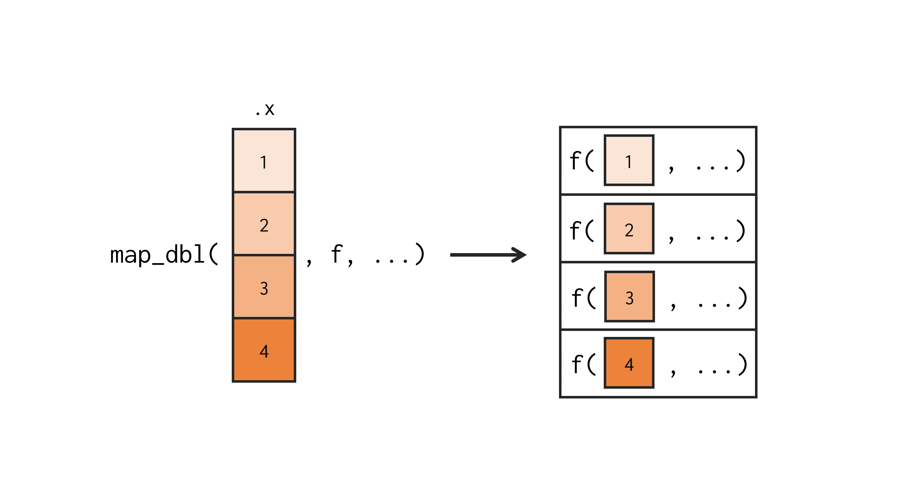
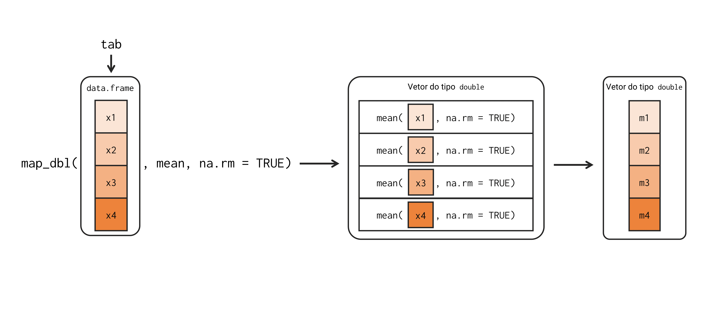
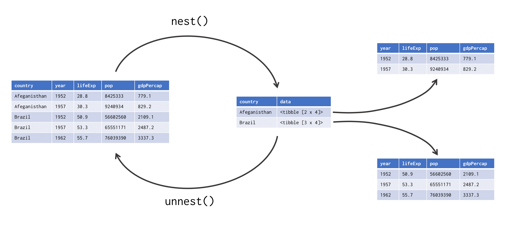
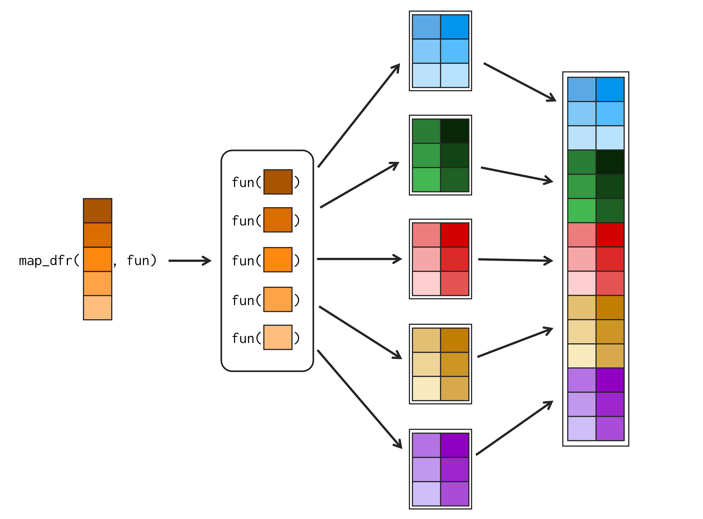
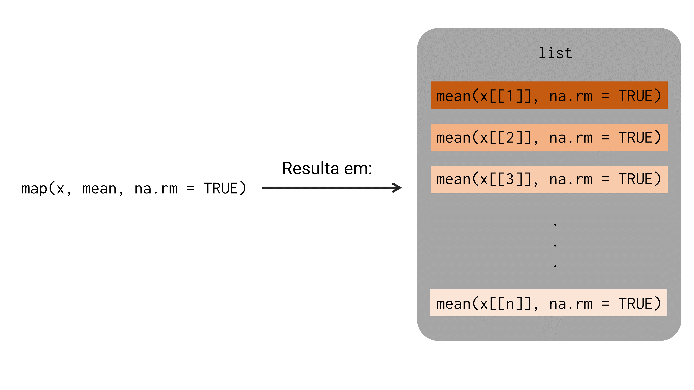
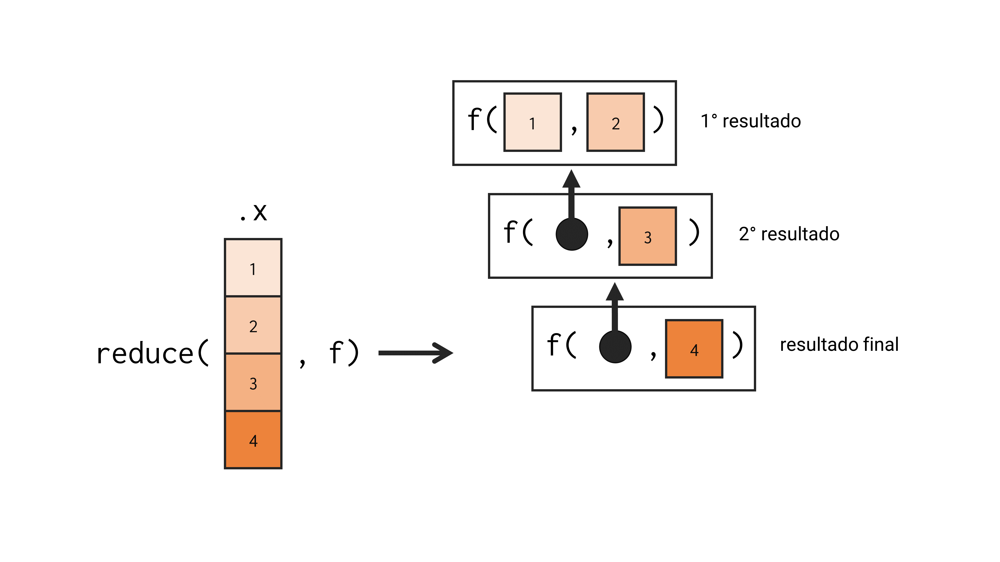

# *Functional programming* com `purrr`


## Introdução

Neste capítulo, vamos introduzir um outro pacote do `tidyverse`, chamado de `purrr`. Esse pacote provê um conjunto de ferramentas que ampliam as funcionalidades de *functional programming* do R. Para ter acesso às funções desse pacote, você pode chamar tanto pelo `tidyverse` quanto pelo `purrr` diretamente.

```{r, eval = FALSE}
library(tidyverse)
library(purrr)
```


## *Loops* implícitos com a família `map`

A principal fraqueza de um `for` *loop* é que ele foca demasiada atenção sobre os objetos envolvidos na iteração. Isso por um lado é bom, pois você consegue identificar todas as "dependências" de um `for` *loop*, mas, por um outro lado, é ruim. Pois na maioria das vezes, é muito mais importante identificarmos a ação, a transformação ou a funcionalidade que está sendo aplicada sobre esses objetos em cada iteração.

Por exemplo, abaixo temos dois `for` *loops* diferentes que aplicam uma determinada operação sobre o objeto `tab`. O que cada `for` *loop* abaixo está fazendo? Qual a diferença entre eles? Após observá-los por um tempo você vai acabar percebendo que a única diferença entre esses dois `for` *loops* está na função que está sendo aplicada sobre cada coluna de `tab`.

```{r}
tab <- data.frame(
  x1 = rnorm(10),
  x2 = rnorm(10),
  x3 = rnorm(10),
  x4 = rnorm(10)
)

vec1 <- vector("double", length = ncol(tab))
for(i in seq_along(tab)){
  vec1[i] <- mean(tab[[i]], na.rm = TRUE)
}


vec2 <- vector("double", length = ncol(tab))
for(i in seq_along(tab)){
  vec2[i] <- median(tab[[i]], na.rm = TRUE)
}

print(vec1)
print(vec2)
```


É esse o problema que a família de funções `map` busca solucionar, ao nos fornecer um meio de construirmos *loops* em um formato mais funcional, destacando assim, as transformações e funções que estamos aplicando em cada repetição, ao invés dos objetos envolvidos na iteração. Como exemplo, podemos replicar o mesmo exemplo de `for` *loops* acima, utilizando a família de funções `map`, da seguinte forma:

```{r, eval = TRUE}
library(purrr)
vec1 <- map_dbl(tab, mean, na.rm = TRUE)
vec2 <- map_dbl(tab, median, na.rm = TRUE)

print(vec1)
print(vec2)
```

Perceba acima, o quão simples e sucinto é para expressarmos uma operação com a família `map`. Vamos explicar daqui a pouco, em detalhes como essas funções funcionam. Por enquanto, quero apenas destacar que agora com a função `map_dbl()`, está muito fácil de identificarmos a diferença entre os dois *loops* acima. Pois a única coisa que está de fato mudando entre uma linha e outra, é a função aplicada sobre cada coluna de `tab`, que são as funções `mean()` e `median()`. Dessa forma, você pode rapidamente entender que o primeiro *loop* está calculando a média de cada coluna, enquanto o segundo *loop*, está calculando a mediana.

### A família de funções `map()`

Portanto, o pacote `purrr` nos oferece a família de funções `map`, a qual possui 7 membros diferentes, sendo eles:

- `map()`: retorna uma lista.
- `map_dbl()`: retorna um vetor atômico do tipo `double`.
- `map_chr()`: retorna um vetor atômico do tipo `character`.
- `map_int()`: retorna um vetor atômico do tipo `integer`.
- `map_lgl()`: retorna um vetor atômico do tipo `logical`.
- `map_dfr()` e `map_dfc()`: retornam um `data.frame`.

Todas essas 7 funções possuem os mesmos argumentos e realizam exatamente o mesmo trabalho. A única diferença entre elas, está na estrutura de dado em que o resultado é retornado. Tal estrutura é identificada pelo sufixo presente no nome de cada função. Portanto, todas essas funções `map` aceitam um objeto como *input*, e retornam como *output*, um novo objeto de mesmo comprimento que o objeto de *input*, e na estrutura identificada pelo sufixo no nome da função [@wickham2017].

Toda função `map` possui 3 argumentos principais, sendo eles: 1) `.x`, que é o objeto sobre o qual `map` vai iterar, ou, sobre o qual ela vai aplicar o *loop*; 2) `.f`, que é a função a ser aplicada sobre cada elemento de `.x`; e 3) `...`, que é a lista de argumentos a serem repassados para a função definida em `.f`. 

Em resumo, todas as funções `map` buscam aplicar a função definida em `.f` sobre cada elemento do objeto `.x`. Consequentemente, o resultado de toda função `map` é um novo objeto contendo os resultados da função definida em `.f` aplicada sobre cada elemento do objeto definido em `.x`. Tal ação, está representada na figura 16.1.

```{r, echo = FALSE, fig.cap = "Representação simples da tarefa executada por \\texttt{map\\_dbl()}", out.width="70%"}

```


Portanto, no exemplo anterior, em que aplicamos a função `map_dbl()` sobre o objeto `tab`, o que `map_dbl()` fez, foi criar um *loop* para aplicar as funções `mean()` e `median()` sobre cada elemento de `tab`. Como `tab` é um `data.frame`, cada elemento desse objeto corresponde a uma coluna do `data.frame`. A medida em que as funções `mean()` e `median()` foram sendo aplicadas sobre cada coluna de `tab`, a função `map_dbl()` foi coletando e armazenando os seus resultados em um vetor atômico do tipo `double`. Por fim, a função `map_dbl()` nos retorna como *output*, este vetor atômico contendo todos os resultados gerados. A figura 16.2 abaixo, apresenta esse processo de forma mais detalhada.

```{r, echo = FALSE, fig.cap = "Representação mais detalhada da tarefa executada por \\texttt{map\\_dbl()}", out.width="100%"}

```

### No fundo, estamos utilizando um `for` *loop*

No fim das contas, todas as funções `map` utilizam em algum momento um `for` *loop* para aplicar a função `.f` sobre cada elemento do objeto `.x`. Um detalhe é que essas funções constroem esse `for` *loop* em C, com o objetivo de gerar máxima performance. A título de ilustração, poderíamos reproduzir em R a definição da função `map()`, da seguinte forma:

```{r}
map <- function(.x, .f, ...){
  resultados <- vector("list", length = length(.x))
  for(i in seq_along(.x)){
    resultados[[i]] <- .f(.x[[i]], ...)
  }
  
  return(resultados)
}

map(tab, mean, na.rm = TRUE)
```

```{r, include=FALSE}
rm(map)
```


Com essa definição em mente, você também pode rapidamente atribuir as diferenças entre as funções `map()`, `map_dbl()`, e todas as demais funções `map`, à primeira linha dessa definição com a função `vector()`. Ou seja, a diferença principal entre as funções `map()` e `map_dbl()` (ou qualquer outra das funções `map`) é o tipo de vetor criado pela função `vector()`. Tal diferença está marcada na figura 16.3.

```{r, echo = FALSE, fig.cap = "Diferenças entre as definições das funções `map`", out.width="100%"}
knitr::include_graphics("Figuras/dif_map.png")
```

Sendo assim, todas as funções `map` ainda dependem de um `for` *loop* para realizar o seu trabalho. Porém, essas funções assumem o trabalho duro de criar esse `for` *loop* por você. Como resultado, você economiza parte de seu tempo, e deixa a intenção de seu código mais clara. 


### Se não existe uma solução pronta no R, crie a sua própria

Um dos grandes poderes das funções `map`, é que elas te ajudam a aplicar as suas ações sobre múltiplos *inputs* diferentes. Por "suas ações", quero destacar que, se você não possui uma função já pronta no R que execute a ação que você deseja aplicar sobre cada elemento de seu objeto, você pode muito bem criar uma função personalizada, que aplique exatamente essa ação da forma como você deseja. Replicar depois essa função personalizada para os demais *inputs* se torna um passo muito simples com as funções `map`.

Por exemplo, imagine que você tenha uma lista como o objeto `l` abaixo, onde cada elemento é uma nova lista que pode conter um número variável de elementos. Agora, imagine que você queira identificar quais elementos dessa lista possuem `NA`'s. Nesse caso, você pode criar uma função como a `tem_na()` abaixo, que aceita uma lista como *input*, e utiliza as funções `is.na()` e `any()` para descobrir se algum dos elementos dessa lista contém um valor `NA`. Em seguida, podemos simplesmente replicar essa função para cada elemento da lista `l` com a função `map_lgl()`.

```{r}
tem_na <- function(x){
  teste <- is.na(x)
  resultado <- any(teste)
  return(resultado)
}

l <- list(
  list(1, 2, 3, NA),
  list(24, 12),
  list(21, NA, 4),
  list(56, 19, 20, 43)
)

vec <- map_lgl(l, tem_na)
vec
```


### Alguns atalhos úteis das funções `map`

Existem alguns atalhos úteis que você pode utilizar ao definir o argumento `.f` nas funções `map`. Por exemplo, suponha que você possua uma lista com várias informações referentes a um determinado aluno. Caso você precise coletar as idades de cada aluno em um vetor atômico por exemplo, você poderia fornecer à função `map_dbl()`, uma função anônima responsável por extrair o item `idade` de uma lista de *input*, como demonstrado abaixo.

```{r}
alunos <- list(
  Ana = list(idade = 15, altura = 1.67),
  Bruno = list(idade = 17, altura = 1.75),
  Amanda = list(idade = 21, altura = 1.88),
  Eduardo = list(idade = 14, altura = 1.62)
)

alunos %>% 
  map_dbl(function(x) x$idade)
```

Apesar de bem prático escrevermos uma função anônima dessa forma, podemos utilizar uma notação ainda mais simples. Tal notação consiste em utilizar um til (`~`) como uma abreviação para a declaração da função anônima, e um ponto final (`.`) para determinar onde o argumento será posicionado no corpo dessa função anônima. Tendo isso em mente, poderíamos reproduzir o exemplo acima, da seguinte forma:

```{r}
alunos %>% 
  map_dbl(~.$idade)
```

Portanto, o til substitui de certa forma a palavra-chave `function`, e o ponto final representa o argumento da função, ou, o elemento sobre o qual a função será aplicada. Contudo, como esse processo de extrair informações específicas de uma lista é algo muito comum, as funções `map` também oferecem um outro atalho, que seria o uso de uma *string*. Logo, se você deseja extrair um item de uma lista presente em cada elemento de um objeto, você pode simplesmente fornecer o nome desse item em uma *string* à função `map`.

```{r}
alunos %>% 
  map_dbl("idade")
```


## Um estudo de caso: aplicando um modelo econométrico sobre diferentes países

Nessa seção, vamos reproduzir o famoso exemplo dado por Hadley Wickham em sua palestra *"Managing many models with R"*. Pois esse exemplo demonstra bem, como as funções `map` ampliam as nossas capacidades com a linguagem R. Tal exemplo, começa pelo dataset `gapminder`, disponível através do pacote `gapminder`. Esse dataset contém dados de expectativa de vida (`lifeExp`), população (`pop`) e PIB per capita (`gdpPercap`) de diversos países do mundo (`country`), ao longo de vários anos (`year`).

```{r, include=FALSE}
library(gapminder)
```
```{r, eval = FALSE}
library(gapminder)
```
```{r}
gapminder
```

Repare abaixo, que esse dataset contém dados de 142 países diferentes, ao longo de 5 continentes do mundo. Dentre esses vários países, temos uma expectativa de vida estimada que varia de 23,59 até 82,60 anos, e um PIB per capita de 241 até 113.523 dólares.

```{r}
dplyr::n_distinct(gapminder$country)
dplyr::n_distinct(gapminder$continent)
range(gapminder$lifeExp)
range(gapminder$gdpPercap)
```

Com esses dados em mãos, podemos utilizar um modelo econométrico para tentar explicar a expectativa de vida da população de cada país com base no seu PIB per capita. Essa é uma hipótese clássica da literatura econômica, que se baseia na ideia de que um povo vive melhor e por mais tempo, quando ele possui uma maior capacidade de adquirir bens e serviços. Tal modelo econométrico está apresentado abaixo, onde $lifeExp_j$ representa a expectativa de vida estimada para o país $j$, e $gdpPercap_j$, o PIB per capita observado para o mesmo país $j$.


\[lifeExp_j= \beta_{0} + \beta_{1} \times gdpPercap_j\]


Caso você nunca tenha visto ou estudado sobre econometria (também conhecida como "análise de regressão linear"), não se preocupe em entender exatamente como o modelo é calculado, ou o que a equação acima representa. Se preocupe apenas em entender os seguintes pontos: 1) a função `lm()` é uma função presente nos pacotes básicos do R, que é capaz de calcular esse tipo de modelo; 2) precisamos aplicar essa função `lm()` sobre os dados de cada país, para obtermos os resultados do modelo separados para cada país.

Como um primeiro exemplo, para aplicarmos esse modelo econométrico sobre os dados de um país em específico, como o Brasil, poderíamos fazer o seguinte: 

```{r}
library(tidyverse)

br <- gapminder %>% 
  filter(country == "Brazil")

modelo <- lm(lifeExp ~ gdpPercap, data = br)
summary(modelo)
```

Portanto, no exemplo acima, o objeto `modelo` contém os resultados do modelo para o Brasil. Pois aplicamos a função `lm()` especificamente sobre os dados do Brasil. Todavia, caso aplicássemos a função `lm()` diretamente sobre a tabela `gapminder` inteira, teríamos na verdade, os resultados do modelo para todo o mundo (sem distinção de países). Pois estamos utilizando os dados de todos os países ao mesmo tempo para calcular o modelo.

```{r}
### Abaixo temos os resultados do modelo para
### todo o mundo. Pois aplicamos a função lm() sobre
### os dados de todos os países de uma vez só.
modelo <- lm(lifeExp ~ gdpPercap, data = gapminder)
summary(modelo)
```

Agora, como poderíamos calcular os resultados desse modelo separados para cada um dos 142 países descritos em `gapminder`? Com a ajuda das funções `map`, replicar esse modelo para os 142 países, se torna uma tarefa extremamente simples de ser feita. 

Pelo fato da função `map()` aplicar uma determinada função sobre cada elemento de um objeto, podemos utilizar `map()` para aplicarmos `lm()` sobre os dados de cada país. Sendo assim, cada elemento do objeto utilizado por `map()`, deve conter os dados de um país específico. Logo, cada elemento deste objeto seria muito provavelmente um `data.frame` contendo os dados de um país. 

Dito de outra forma, vamos aplicar a função `map()` sobre uma lista de `data.frame`'s. Por esse motivo, a função que `map()` vai aplicar sobre cada elemento dessa lista, deve aceitar como *input*, um `data.frame` contendo os dados de um país específico, e gerar como *output*, os resultados do modelo aplicado sobre esses dados de *input*. Como primeiro passo, vamos criar essa função.


### A função que calcula o modelo econométrico

Portanto, precisamos criar uma função que aceita um `data.frame` como *input*, e que calcula o modelo econométrico sobre os dados desse *input*. A função `aplicar_modelo()` abaixo, cumpre justamente esse papel. Tudo que essa função faz é aplicar a função `lm()` sobre o `data.frame` de *input* (argumento `x`). Perceba também que, independente de qual for o `data.frame` que fornecermos a essa função, ela vai sempre calcular o mesmo modelo, pois a equação na função `lm()` sempre será `lifeExp ~ gdpPercap`.

```{r}
aplicar_modelo <- function(x){
  lm(lifeExp ~ gdpPercap, data = x)
}
```


### Criando uma lista de `data.frame`'s

Podemos criar a lista de `data.frame`'s, contendo os dados de cada país, de diversas formas. Em sua palestra, Hadley Wickham utilizou a função `nest()`, proveniente do pacote `tidyr`, para criar essa lista de `data.frame`'s dentro de uma coluna do `data.frame` original. Ou seja, Wickham utilizou `nest()` para criar uma espécie de `data.frame` de `data.frame`'s, pois ele queria demonstrar esta poderosa ideia de um *nested* `data.frame`. Porém, como uma solução ainda mais simples, também poderíamos utilizar a função `split()` para dividirmos a tabela `gapminder` em uma lista, onde cada elemento dessa lista conteria um `data.frame` com os dados de um país diferente. Ambas as soluções são perfeitamente válidas.


### Com a função `split()`

Precisamos separar em diferentes elementos, os dados de cada país descrito na tabela `gapminder`. Para isso, podemos utilizar a função `split()`. Em resumo, essa função aceita um vetor ou `data.frame` como *input*, e divide esse objeto de *input* em diferentes elementos de uma lista, com base em algum vetor de grupos. 

Logo, podemos pedir à `split()` que divida a tabela `gapminder` de acordo com os valores da coluna `country`. Veja o resultado abaixo:

```{r}
dados_por_pais <- gapminder %>% split(~country)
dados_por_pais[[1]]
```

Portanto, o objeto `dados_por_pais` é uma lista, onde cada elemento dessa lista, contém um `data.frame` com os dados de um país específico. Agora, podemos utilizar a função `map()` para simplesmente aplicarmos a função `aplicar_modelo()` sobre cada elemento dessa lista, ou, sobre os dados de cada país. Como resultado, teremos uma nova lista, onde cada elemento dessa lista, contém os resultados do modelo para um determinado país. No exemplo abaixo, estou mostrando os resultados do modelo para o Afeganistão. Curiosamente, o coeficiente estimado pelo modelo foi negativo (-0,00224), indicando assim, que para o Afeganistão, aumentos no PIB per capita reduzem a expectativa de vida estimada da população. Um resultado que contradiz a nossa hipótese inicial.

```{r}
modelos <- map(dados_por_pais, aplicar_modelo)
summary(modelos[[1]])
```

Com a lista `modelos`, podemos continuar utilizando a função `map()` para extrair informações específicas desses modelos. Por exemplo, os comandos abaixo utilizam a função `glance()` do pacote `broom` para extrair o $R^2$ (coeficiente de determinação) estimado por cada modelo. No exemplo abaixo, estou mostrando os coeficientes dos 10 primeiros países.

```{r}
r2s <- modelos %>%
  map(broom::glance) %>%
  map_dbl("r.squared")

r2s[1:10]
```


### Com a função `nest()`

Apesar da função `split()` já nos oferecer uma ótima solução, também podemos muito bem adotar a solução mostrada por Wickham, que utiliza a função `nest()` para criar um "`data.frame` de `data.frame`'s". 

No momento, cada linha da tabela `gapminder` descreve os dados de um país em um determinado ano. Entretanto, a nossa intenção com essa solução, é transformar a tabela `gapminder`, de modo que cada linha da tabela contenha todos os dados de um determinado país para todos os anos. Podemos realizar essa transformação, ao agruparmos à tabela pela coluna `country` (com a função `group_by()`) e, em seguida, aplicarmos a função `nest()` do pacote `tidyr`, como demonstrado abaixo:


```{r, eval = FALSE}
library(tidyr)
library(magrittr)
library(dplyr)
```
```{r}
dados_por_pais <- gapminder %>%
  group_by(country, continent) %>% 
  nest()

dados_por_pais
```

Dessa vez, o objeto `dados_por_pais` é um `data.frame` que contém três colunas (`country`, `continent` e `data`). A coluna `data` é uma lista, e cada elemento dessa lista contém um novo `data.frame`, que por sua vez, contém todos os dados referentes ao país identificado na coluna `country` da tabela. 

Ou seja, ainda estamos utilizando uma lista de `data.frame`'s, onde cada `data.frame` dessa lista contém os dados de um país específico. A diferença agora, é que essa lista está inserida em uma coluna de um `data.frame`, ao invés de estar em um objeto separado.

Portanto, a figura 16.4 abaixo apresenta de forma gráfica a transformação executada por `nest()`. Repare também, que o pacote `tidyr` nos oferece a função `unnest()`, com a qual podemos reverter a transformação executada por `nest()`. 

```{r, echo = FALSE, out.width = "100%", fig.cap = "Transformação executada por `nest()`"}

```


Como exemplo, os dados do Brasil estão na 15° linha da tabela `dados_por_pais`. Logo, eu posso adquirir todos os dados do Brasil, ao acessar o 15° elemento da coluna `data`. Perceba abaixo, que um novo `data.frame` é retornado, que contém todos os dados referentes ao Brasil.

```{r}
dados_por_pais$data[[15]]
```

Agora, precisamos apenas aplicar a função `aplicar_modelo()` sobre cada elemento da coluna `data`. Para isso, podemos utilizar novamente a função `map()`, dessa vez, dentro da função `mutate()` que introduzimos no capítulo 4. Dessa maneira, `map()` vai executar a função `aplicar_modelo()` para cada elemento da coluna `data`, e retornar uma lista com os resultados, e a função `mutate()` vai adicionar essa lista como uma nova coluna do `data.frame`.

```{r}
modelos <- dados_por_pais %>% 
  mutate(
    resultados = data %>% map(aplicar_modelo)
  )

modelos
```

Agora, cada elemento da coluna `resultados` contém todos os resultados do modelo para cada país da tabela `gapminder`. A partir daqui, podemos utilizar novamente as funções `map` para extrairmos as informações específicas dos modelos. Por exemplo, podemos extrair o beta estimado ($\beta_1$) e o coeficiente de determinação de cada país, e adicioná-los como novas colunas da tabela modelos.

```{r}
modelos <- modelos %>% 
  mutate(
    glance = resultados %>% map(broom::glance),
    tidy = resultados %>% map(broom::tidy),
    beta_estimado = tidy %>% map_dbl(~.[["estimate"]][2]),
    r2 = glance %>% map_dbl("r.squared")
  ) %>% 
  select(-glance, -tidy)

modelos
```

Com esses resultados em mãos, podemos criar visualizações muito interessantes. Como o gráfico de dispersão abaixo, que apresenta a relação entre o beta estimado e o coeficiente de determinação do modelo. Repare nesse gráfico, que os países da Europa, em geral, possuem um beta estimado baixo, indicando assim, que aumentos no PIB per capita tem baixos impactos na expectativa de vida. Isso provavelmente ocorre, porque esses países já possuem expectativas de vida relativamente altas. 

Por outro lado, perceba também que os países africanos parecem se concentrar nos dois extremos do gráfico, com os maiores e menores betas estimados. Os maiores betas, indicam que aumentos no PIB per capita trazem fortes impactos positivos sobre as expectativas de vida nesses países. Isso provavelmente se deve à vida precária e a baixa expectativa de vida que a população desses países enfrenta, de modo que, uma melhoria mínima pode trazer grandes impactos positivos nas condições de vida dessas populações.

Para mais, repare que os países africanos que possuem betas estimados negativos também possuem coeficientes de determinação baixos, indicando assim, um baixo poder explicativo do modelo. Isso é um sinal de que o nosso modelo não consegue explicar muito dos dados desses países, e provavelmente, esse baixo poder explicativo gerou um beta estimado negativo, que é algo inesperado para essa relação entre expectativa de vida e renda per capita. 

Talvez, esses países tem características importantes que os outros países não possuem, e que afetam essa relação econômica. Por exemplo, muitos países africanos enfrentam guerras civis recorrentes. Guerras desse tipo geram impactos negativos na expectativa de vida, e as mortes podem gerar quedas na população total do país, o que resultaria em um aumento do PIB per capita (*ceteris paribus*). 

```{r, out.width="60%"}
modelos %>% 
  ggplot() +
  geom_point(
    aes(x = r2, y = beta_estimado, color = continent)
  )
```


## Comparando a família `map` à família `apply`

Os pacotes básicos do R, nos oferecem a família `apply` de funções, a qual desenvolve um papel muito similar às funções `map`. Os membros dessa família estão listados abaixo:

- `apply` (*generic apply*): retorna diferentes tipos de estrutura a depender de um conjunto de condições.
- `lapply` (*list apply*): retorna uma lista.
- `sapply` (*simple apply*): tenta simplificar o resultado para uma estrutura mais "simples", a depender do comprimento de cada resultado gerado por `FUN`.
- `vapply` (*vector apply*): retorna um vetor de mesmo tipo de dado que o vetor definido no argumento `FUN.VALUE`.


Tendo isso em mente, todas essas funções aceitam um objeto (`X`) e uma função (`FUN`) em seus dois primeiros argumentos. Essas funções `apply` vão aplicar a função `FUN` sobre cada elemento do objeto `X` fornecido, e retornar como resultado, um novo objeto contendo todos os resultados gerados pela função `FUN` aplicada sobre cada elemento do objeto `X`.


Um dos principais motivos pelos quais a família `apply` tem perdido espaço para a família `map`, é pelo fato dessas funções serem menos consistentes, especialmente quanto à estrutura do resultado retornado. Por exemplo, `apply()` pode retornar um vetor, um `array` ou uma lista como resultado. Para mais, as condições que determinam qual dessas estruturas é retornada por `apply()` são levemente confusas. Se estiver curioso, leia a seção `Value` da documentação interna (`?apply`).

A função `sapply()` também é um outro caso de incosistência, pois essa função altera a estrutura de dados retornada, a depender do comprimento de cada um dos resultados gerados pela função `FUN`. Isso significa que, a estrutura de dados retornada por `sapply()` é determinada por um conjunto de resultados aos quais nós não temos acesso enquanto a função não completar a sua execução. Ou seja, nós não somos capazes de prever com antecedência, qual será a estrutura retornada por `sapply()`. Isso é um problema grave, dado que ele pode gerar bugs em seu script com muita facilidade, caso você não esteja preparado para lidar com literalmente qualquer tipo de resultado possível de `sapply()`.

São inconsistências desse tipo, que tornaram as funções `map` o padrão utilizado pela comunidade na construção de muitos pacotes e funções. Pois as funções `map` são extremamente consistentes em seus resultados. Por esse mesmo motivo, que as funções `lapply()` e `vapply()` são exemplos de funções `apply` que ainda são muito utilizadas em diversos pacotes e funções existentes na atualidade. 

Pois diferente de `apply()` e `sapply()`, essas funções são consistentes em seus resultados. A função `lapply()` é equivalente à função `map()`, pois ela sempre lhe retorna uma lista como resultado. Já a função `vapply()` vai sempre retornar um vetor de mesmo tipo de dado que o vetor fornecido ao seu argumento `FUN.VALUE`. Ou seja, poderíamos reproduzir a função `map_dbl()` com `vapply()`, ao fornecermos um vetor do tipo `double` ao seu argumento `FUN.VALUE`.


```{r}
numeros <- list(
  c(1.5, 2.5, 3),
  c(9.8, 1.2),
  c(1.2, 1.3, 1.5, 1.1)
)


somas <- vapply(numeros, FUN = sum, FUN.VALUE = double(1))
print(somas)
```

Na verdade, a função `vapply()` também é capaz de retornar matrizes e arrays. Tudo depende de como você organiza o objeto fornecido ao argumento `FUN.VALUE`. Isso é um diferencial importante, que nenhuma das funções `map` são capazes de fazer até o momento. 

```{r}
### Retorna uma matriz
vapply(numeros, FUN = range, FUN.VALUE = double(2))

### Retorna um array
vapply(numeros, FUN = range, FUN.VALUE = array(double(1), dim = c(1,2,1)))
```


## Identificando erros nas funções `map`

A cada iteração do loop criado por `map`, estamos executando a função definida no argumento `.f`. Isso significa que, em um loop de 10 mil iterações, essa função será chamada 10 mil vezes. Isso é um detalhe importante, pois um erro pode surgir em cada uma dessas 10 mil chamadas. E caso esse erro ocorra, como você faria para identificar a sua fonte? É esse tema que vamos abordar nessa seção.


Vamos utilizar os comandos abaixo como exemplo. Perceba que um erro foi levantado.

```{r, include = FALSE}
valores <- list(
  2.5, 5.1, 6.7, 8.9, "9.1", 0.2,
  "4.4", "5.1", "7.4", 3.6, 3.8,
  4.2, 8.7, 8.8
)
```


```{r, eval = FALSE}
valores <- list(
  2.5, 5.1, 6.7, 8.9, "9.1", 0.2,
  "4.4", "5.1", "7.4", 3.6, 3.8,
  4.2, 8.7, 8.8
)


logaritmos <- valores %>% map_dbl(log)
```

```
Error in .Primitive("log")(x, base) :
  non-numeric argument to mathematical function
```

A principal dificuldade que temos é identificar **onde** o erro ocorreu. Isto é, em qual das iterações esse erro ocorreu? Será que ele ocorre logo na primeira iteração do loop? Ou, talvez na última iteração? Ou ainda, ao longo de várias iterações diferentes do loop?

Para identificar tais pontos, poderíamos ter acesso aos resultados que foram gerados com sucesso, e aos resultados que fracassaram. Para isso, o pacote `purrr` nos provê a função `safely()`. 

Você deve aplicar essa função `safely()` sobre a função `.f` que você deseja utilizar dentro de `map()`. Como resultado, `safely()` gera uma nova versão da função `.f`, que é capaz de coletar os todos os resultados gerados, mesmo que eles levantem algum erro durante sua execução.

```{r}
safe_log <- safely(log)
safe_log
```

O que essa nova versão da função faz, é sempre gerar uma lista com dois elementos (`result` e `error`) para cada *input*. O elemento `result` vai estar preenchido com o resultado da função caso ele tenha sido gerado com sucesso, enquanto o elemento `error`, estará vazio. Entretanto, caso algum erro ocorra e o resultado da função não possa ser gerado, o contrário ocorre. Ou seja, o elemento `result` estará vazio, enquanto o elemento `error` irá conter o erro que interrompeu a execução.

No primeiro exemplo abaixo, o elemento `result` gerado por `safe_log()` contém o valor `2.302585`, que corresponde ao resultado de `log(10)`. Isso significa que o valor da expressão `log(10)` pôde ser calculado com sucesso, sem nenhum erro encontrado. Porém, no segundo exemplo abaixo, o elemento `result` está vazio, enquanto o elemento `error` contém a mensagem de erro gerada. Logo, o resultado da expressão `log("a")` não pôde ser calculada com sucesso, pois o erro contido no elemento `error` foi levantado durante a execução.

```{r}
safe_log(10) %>% str()
safe_log("a") %>% str()
```

Agora, podemos simplesmente fornecer para `map()` a nova função criada. Repare que dessa vez, eu estou utilizando a função `map()` ao invés da função `map_dbl()` para coletar os resultados gerados por `safe_log()`. Pois a função `log()` gera um único valor do tipo `double` para cada *input*, já a função `safe_log()`, gera uma lista com dois elementos (`result` e `error`) para cada *input*. Como exemplo, mostro abaixo os resultados para os 3 primeiros elementos. Perceba que nenhum desses elementos levantou algum erro, dado que o elemento `error` está vazio para todos eles.

```{r}
logaritmos <- valores %>% map(safe_log)
logaritmos[1:3] %>% 
  str()
```

Sendo assim, para identificarmos quais elementos de `valores` são os responsáveis por levantar o erro que vimos anteriormente, podemos navegar por cada elemento de `logaritmos`, e descobrir em quais deles, o elemento `error` não está vazio.

```{r}
erros <- logaritmos %>% map("error")
erro_nao_vazio <- erros %>% map_lgl(~!is.null(.))

valores[erro_nao_vazio] %>% 
  str()
```


Repare acima, que antes de aplicar o teste lógico para saber quais erros estavam vazios, eu precisei extrair primeiro o elemento `error` de todos os elementos de `logaritmos`. Como uma alternativa, podemos reorganizar os elementos de `logaritmos` em duas listas diferentes, uma contendo todos os resultados gerados (`result`), e outra, contendo todos os erros gerados (`error`). 

Para isso, basta aplicarmos a função `transpose()` sobre o objeto `logaritmos`. Agora, o objeto `logaritmos` contém dentro dele, uma lista de resultados (`result`) e uma lista de erros (`error`).

```{r}
logaritmos <- transpose(logaritmos)
logaritmos$result[1:3]
logaritmos$error[1:3]
```

Com essa estrutura, podemos reproduzir o teste anterior com:

```{r}
erro_nao_vazio <- map_lgl(logaritmos$error, ~!is.null(.))

valores[erro_nao_vazio] %>% 
  str()
```


Portanto, sabemos agora que os elementos `"9.1"`, `"4.4"`, `"5.1"` e `"7.4"` do objeto `valores` estão levantando erros quando aplicamos a função `log()` sobre eles. Com isso, podemos reproduzir o erro ao aplicar a função `log()` sobre um desses elementos. Dessa forma, podemos analisar caso a caso de forma mais concentrada, e entender o que está gerando o erro. 

```{r, eval = FALSE}
log("9.1")
```
```
Error in log("9.1") : non-numeric argument to mathematical function
```

De qualquer forma, você provavelmente já entendeu qual é o problema. Esses elementos estão sendo interpretados pelo tipo `character`, ao invés de um tipo numérico como o tipo `double`. Em outras palavras, a função `log()` não sabe como calcular o logaritmo de um valor textual (ou uma *string*), como `"9.1"`.

Tendo isso em mente, poderíamos aplicar a função `as.double()` sobre esses elementos para resolvermos esse problema. Perceba que após realizarmos essa correção, o comando com `map_dbl()` executa normalmente sem nenhum erro.

```{r}
valores[erro_nao_vazio] <- valores[erro_nao_vazio] %>% 
  map(as.double)

### Agora, os comandos abaixo funcionam normalmente
### sem nenhum erro.
logaritmos <- valores %>% map_dbl(log)
logaritmos 
```


Portanto, a função `safely()` te oferece um conjunto de informações mais completas sobre cada execução, pois ela te traz exatamente qual foi a mensagem de erro retornada. Porém, em algumas ocasiões, você só quer coletar os resultados gerados. 

Para isso, temos uma outra função irmã mais simplificada, que é a função `possibly()`. Assim como ocorre com `safely()`, essa função `possibly()` recebe uma outra função como *input*, e retorna como *output*, uma nova versão da função de *input*. Assim como ocorre com `safely()`, a função criada por `possibly()` vai sempre executar com sucesso, mesmo que um erro seja levantado pela função principal `.f`.

Para mais, a função `possibly()` te permite definir um valor padrão de retorno, caso a execução da função principal `.f` retorne um erro. Por exemplo, com os comandos abaixo, estou definindo que se a função `log()` levantar algum erro para um determinado *input*, ela deve retornar como *output* o valor `NA_real_`.

```{r}
valores <- list(
  3.2, 4.4, 5.1, 8.6,
  "A", "B", "C"
)

valores %>% 
  map_dbl(possibly(log, NA_real_))
```

Apesar de duas opções bastante úteis, você pode ainda estar interessado em coletar outras informações sobre a execução de cada iteração. Como exemplo, a função `quietly()` exerce um papel semelhante à `safely()`, mas, ao invés de coletar erros, essa função busca coletar os resultados, mensagens e avisos gerados em cada iteração, além dos possíveis *outputs* que são mostrados na tela.

Perceba no exemplo abaixo, que assim como ocorre com `safely()` e `possibly()`, `quietly()` também nos retorna uma nova versão da função `print()`. Quando eu aplico essa nova função sobre algum *input* qualquer, é retornado uma lista com 4 elementos. Como os elementos `warnings` e `messages` abaixo estão vazios, isso significa que não houveram avisos ou mensagens acionadas durante a execução da expressão `print(8)`. Para mais, podemos ver através dos itens `result` e `output`, o resultado da expressão e, também, qual é o texto apresentado em nosso console quando a expressão `print(8)` é executada.

```{r}
quiet_print <- quietly(print)
quiet_print(8)
```


Sendo assim, podemos utilizar a função `quietly()` em conjunto com `map()` para coletarmos essas informações sobre a execução de uma função qualquer sobre vários *inputs* diferentes. Veja no exemplo abaixo, que o segundo *input* da lista `x` (`-10`) gerou um aviso, pois o elemento `warnings` da segunda lista no resultado não está vazio.

```{r}
x <- list(5, -10, 15)
x %>%
  map(quietly(log)) %>% 
  str()
```


## Compreendendo as funções `map_dfr()` e `map_dfc()`

Novamente, as funções `map_dfc()` e `map_dfr()` realizam exatamente o mesmo trabalho e possuem os mesmos argumentos das demais funções `map`. Contudo, como você já deve ter pressuposto pelo sufixo `df`, as funções `map_dfc()` e `map_dfr()` retornam como resultado, um `data.frame`. Porém, essas duas funções constroem esse novo `data.frame` de maneiras distintas. 

Em primeiro lugar, você pode utilizar as funções `map_dfr()` e `map_dfc()`, sempre que um `data.frame` é gerado a cada iteração do *loop* criado pela função `map`. Ou seja, quando aplicamos a função `.f` sobre um elemento de `.x`, um `data.frame` é gerado como resultado. Dito ainda de uma outra forma, a função `.f` recebe um elemento de `.x` como *input*, e gera um novo `data.frame` como *output*. 


```{r, echo = FALSE, out.width="80%", fig.cap = "\\texttt{map\\_dfr()} une os `data.frame`'s gerados, por linha"}

```


```{r, echo = FALSE, out.width="100%", fig.cap = "\\texttt{map\\_dfc()} une os `data.frame`'s gerados, por coluna"}
knitr::include_graphics("Figuras/map_dfc.png")
```

Portanto, se você utiliza a função `map_df*()` sobre um objeto de 50 elementos, é esperado que 50 `data.frame`'s sejam gerados durante a execução de `map_df*()`. Após gerar todos esses 50 `data.frame`'s, a função `map_df*()` em questão, vai tentar uni-los em um único `data.frame`. Por fim, a função vai retornar como resultado, esse `data.frame` único, que contém os resultados de todos os 50 `data.frame`'s gerados.

Por isso, a única diferença essencial entre as funções `map_dfr()` e `map_dfc()`, está na forma como essas funções vão unir esses 50 `data.frame`'s gerados. Como você pode observar nas figuras 16.5 e 16.6, `map_dfr()` une os `data.frame`'s por linha, enquanto `map_dfc()`, une por coluna.

Tendo esses pontos em mente, as funções `map_dfr()` e `map_dfc()` são particularmente úteis, quando desejamos aplicar uma função sobre cada elemento de um objeto, e armazenar todos os resultados em um `data.frame` único. 


## Um estudo de caso: uma demanda real sobre a distribuição de ICMS {#sec:demanda_dist_ICMS}

Nessa seção, vou apresentar um exemplo prático, sobre uma demanda real que chegou até mim em 2020. Na época, eu trabalhava como estagiário na Diretoria de Estatística e Informações da Fundação João Pinheiro (FJP-MG), mais especificamente com uma lei estadual que é tradicionalmente chamada de Lei Robin Hood (Lei 18.030 de 2009 - MG). Essa lei rege a distribuição do ICMS total de Minas Gerais, ao longo dos municípios do estado. 

Em resumo, o Governo de Minas Gerais, coleta o ICMS (imposto sobre operações relativas à circulação de mercadorias e sobre prestações de serviços de transporte interestadual, intermunicipal e de comunicação) gerado em todo o estado, e ao final de um período, ele redistribui esse valor para os 853 municípios do estado. Cada município, possui um índice de participação, que corresponde à porcentagem do ICMS total ao qual o respectivo município tem direito. Em outras palavras, se o ICMS total gerado no estado em um período foi de 8,5 bilhões de reais, e o município de Belo Horizonte possui um índice de participação equivalente a 0,009, isso significa que ao final do período, 0,9% do ICMS total, ou 76,5 milhões de reais serão transferidos para a prefeitura do município de Belo Horizonte.

Diversos critérios descritos na lei regem o cálculo deste índice de participação de cada município, sendo alguns deles: Turismo, Esporte, Patrimônio Cultural, População e Receita Própria. Em suma, o índice de participação de cada município, é uma média ponderada dos índices de cada um desses diversos critérios da lei. Você pode encontrar uma descrição completa desses critérios e do cálculo dos índices de participação, no texto original da lei^[https://www.almg.gov.br/consulte/legislacao/completa/completa-nova-min.html?tipo=LEI&num=18030&comp=&ano=2009&texto=original].

### A demanda em si

A demanda é muito simples, porém, ela é trabalhosa e envolve um volume excessivo de repetição se você optar por utilizar programas como Excel para resolvê-la. Dentre os vários critérios da lei, temos o critério de Meio Ambiente, e o órgão responsável pelo cálculo do índice referente a esse critério, é a SEMAD-MG (Secretaria de Estado de Meio Ambiente e Desenvolvimento Sustentável). Um dia, a SEMAD chegou até nós da Fundação João Pinheiro (FJP), pedindo por todos os valores de ICMS transferidos para cada município, ao longo dos anos de 2018 e 2019, de acordo com o critério do Meio Ambiente da Lei Robin Hood.

Os funcionários da FJP, calculam e publicam todo mês, os valores transferidos de ICMS separados por cada critério da lei, e para cada município. Ou seja, para o ano de 2019, pense por exemplo, em uma lista de arquivos de Excel parecida com a lista abaixo, onde cada planilha corresponde aos valores de ICMS transferidos em um mês específico do ano. 

```{r, echo = F, out.width="80%", fig.cap = "Lista de arquivos do Excel"}
knitr::include_graphics("Figuras/planilhas1.png")
```

Dando uma olhada mais de perto, cada uma dessas planilhas do Excel, assumem a estrutura abaixo. Onde cada linha da tabela, representa um município do estado de Minas Gerais, e cada coluna (ou pelo menos, grande parte dessas colunas), representa os valores de ICMS transferidos segundo os índices de um critério específico da lei. Ou seja, a coluna `Educação`, nos apresenta os valores de ICMS transferidos para cada município do estado, considerando-se o índice que cada um desses municípios adquiriram no critério de Educação, e também, considerando-se a parcela que o critério de Educação representa do total de ICMS distribuído. 

```{r}
library(readxl)
Abril_2019 <- read_excel("planilhas/Abril_2019.xlsx")
Abril_2019
```


Porém, temos dois problemas aqui: 1) A SEMAD precisa apenas dos valores de ICMS transferidos de acordo com o critério de Meio Ambiente, e nada mais; 2) A SEMAD precisa dos valores de ICMS transferidos ao longo de todos os meses dos anos de 2018 e 2019, e se nós temos 12 planilhas por ano, temos que reunir informações de 24 planilhas diferentes para a secretaria. 

Portanto, temos aqui uma típica tarefa extremamente repetitiva e monótona, que ninguém gosta de fazer. Imagine você abrindo na mão, cada uma das 24 planilhas, procurando pela coluna do Meio Ambiente, copiando e colando ela em um novo arquivo contendo apenas os dados de Meio Ambiente, preenchendo colunas de ano e mês para manter a rastreabilidade dos registros, etc. Aqueles com mais experiência no Excel, poderiam argumentar que uma solução mais segura, seria utilizar a plataforma de *queries* do programa para carregar os dados das 24 planilhas em uma planilha única. Porém, apenas pelo tempo que você levaria para importar cada arquivo e configurar cada *querie*, seria muito mais rápido se você simplesmente adotasse a estratégia de `Crtl+C` e `Ctrl+V`, para transferir todos os dados para uma planilha única.

Além disso, tarefas muito repetitivas são, não apenas muito cansativas, mas também, muito *error-prone* (ou seja, elas elevam muito as suas chances de erros). Esses são dois fatores que podem ser facilmente evitados através do uso de funções e de *loop*'s no R. Ao construir uma função que define as ações que você deseja aplicar, e um *loop* que replique essa função para todas as x planilhas, você permite que o seu computador realize o trabalho duro e cansativo por você. Com isso, as suas chances de erro se reduzem muito, e você realiza o mesmo trabalho em menor tempo. Pois os nossos computadores são extremamente rápidos e precisos para realizar todo tipo de cálculo. Afinal, é para isso que eles foram feitos.


### Planejando os passos

Como exemplo prático, para formatar os arquivos segundo as necessidades da SEMAD-MG, vou demonstrar as seguintes etapas: 1) importar essas planilhas para o R; 2) adicionar colunas de referência para cada planilha (ano e mês a que os dados se referem); 3) unir todas as planilhas em uma tabela única; 4) selecionar apenas as colunas relevantes para a SEMAD; 5) exportar o resultado para fora do R.

### Importando as planilhas

Tendo isso em mente, o primeiro passo seria importarmos essas planilhas. Mas, para isso precisamos dos *path*'s, ou, dos caminhos até esses arquivos. Podemos coletar essa informação, através da função `list.files()`, a qual pertence aos pacotes básicos do R. Como o próprio nome dá a entender, essa função busca listar os nomes de todos os arquivos contidos em determinada uma pasta. Caso você não defina alguma pasta específica na função (diferente do que fizemos abaixo), `list.files()` vai listar todos os arquivos presentes no seu diretório de trabalho atual do R. 

Neste exemplo, todas as 12 planilhas já estão separadas dentro de uma pasta de meu computador chamada `"planilhas"`. Por isso, forneço abaixo o nome dessa pasta à função `list.files()`. Como resultado, o objeto `caminhos` contém o caminho até todas essas planilhas que desejamos importar para dentro do R.

```{r}
caminhos <- list.files("planilhas/", full.names = TRUE)
caminhos
```

Agora que temos os caminhos até todas essas planilhas, importá-las para dentro do R se torna algo extremamente simples. Podemos simplesmente utilizar a função `map()` para aplicar uma função (que seja capaz de ler esses arquivos) sobre cada um desses caminhos. Lembre-se que, podemos importar planilhas do Excel para dentro do R, através da função `readxl::read_excel()` que introduzimos no capítulo 4.

```{r}
library(readxl)
library(purrr)

planilhas <- map(caminhos, read_excel)
planilhas[[1]]
```

Agora, o objeto `planilhas` é uma lista de 12 elementos. Cada elemento dessa lista, contém um `data.frame` que corresponde aos dados de uma das 12 planilhas.


### Conferindo a estrutura dos arquivos

Vamos aproveitar que já importamos as 12 planilhas, para fazermos algumas conferências sobre esses arquivos. Será que todas as planilhas possuem a mesma estrutura (o mesmo número de linhas, as mesmas colunas, os mesmos tipos de dados, etc.) ? Logo abaixo, estamos utilizando a função `nrow()` para coletarmos os números de linhas de cada tabela, `ncol()` para o número de colunas, e `colnames()` para os nomes das colunas. Perceba abaixo, que todas as planilhas possuem o mesmo número de linhas e colunas.


```{r}
n_linhas <- map_int(planilhas, nrow)
print(n_linhas)

n_colunas <- map_int(planilhas, ncol)
print(n_colunas)
```

Para conferirmos os nomes das colunas temos um pouco mais de trabalho, mas nada que seja muito distante do que foi mostrado até o momento.

```{r}
nomes_colunas <- map(planilhas, colnames)
referencia <- nomes_colunas[[1]]

igual_a_referencia <- vector("logical", length = 12)
for(i in seq_along(nomes_colunas)){
  igual_a_referencia[i] <- all(nomes_colunas[[i]] == referencia)
}

names(igual_a_referencia) <- caminhos
print(igual_a_referencia)
```

Perceba pelo resultado acima, que os arquivos `Dezembro_2019.xlsx` e `Novembro_2019.xlsx` possuem alguma divergência no nome de suas colunas. Podemos rapidamente descobrir que colunas são essas com um simples teste lógico e *subsetting*:

```{r}
## Coluna diferente no arquivo Dezembro_2019.xlsx
nomes_colunas[[3]][ !referencia == nomes_colunas[[3]] ]

## Coluna diferente no arquivo Novembro_2019.xlsx
nomes_colunas[[10]][ !referencia == nomes_colunas[[10]] ]
```

Pelos resultados acima, podemos observar que as duas planilhas possuem uma coluna chamada `cota minima`, a qual não está presente nas demais planilhas. Essa mesma coluna está nomeada como `Cota Mínima`, nas demais planilhas. Como resultado, caso você estivesse aplicando um *loop* sobre cada uma das 12 planilhas, e estivesse procurando por uma coluna chamada `Cota Mínima` em cada uma delas, o R não seria capaz de encontrar essa coluna nos arquivos `Dezembro_2019.xlsx` e `Novembro_2019.xlsx`.

Pelo fato de estarmos preocupados com a coluna de `Meio Ambiente`, essa diferença se torna um pouco irrelevante para nós. Entretanto, caso estivéssemos trabalhando com essa coluna de `Cota Mínima` em cada planilha, teríamos um grande problema a ser resolvido.


### Adicionando colunas de referência

Apesar de já termos importado todas as 12 planilhas, temos um grande problema a ser solucionado. Os dados de cada planilha não possuem qualquer coluna ou metadado de referência que indique o período ao qual os dados se referem. 

Dito de outra forma, ao olharmos para os dados da primeira planilha, podemos ver os valores monetários de cada município para cada critério. Porém, a que mês esses valores monetários se referem? Dezembro? Janeiro? Março? E de que ano? 2019? ou 2020?  


```{r}
planilhas[[1]]
```

Sabemos que os dados dessa primeira planilha se referem ao mês de abril de 2019, pois essa informação está incrustada no nome da primeira planilha descrita no objeto `caminhos`, o qual utilizamos para importar todas as 12 planilhas. Porém, qualquer pessoa que não tenha acesso ao objeto `caminhos`, não será capaz de identificar tal informação. 

Por isso, seria muito importante adicionarmos colunas de mês e ano em cada uma das 12 planilhas. Para isso, podemos aplicar os comandos abaixo. Pelo fato do mês e do ano de cada planilha estarem definidos nos próprios nomes dos arquivos, os primeiros comandos buscam extrair essas informações a partir do objeto `caminhos`. Depois disso, utilizamos um `for` *loop* para adicionar essas informações a cada uma 12 tabelas.

```{r}
nomes_arquivos <- basename(caminhos)

meses <- stringr::str_replace(
  nomes_arquivos, "(.*)_(.*)[.]xlsx", "\\1"
)

anos <- stringr::str_replace(
  nomes_arquivos, "(.*)_(.*)[.]xlsx", "\\2"
)

anos <- as.integer(anos)

### Um for loop para visitar cada uma das
### 12 planilhas e adicionar as colunas Ano e Mes:
for(i in seq_along(planilhas)){
  planilhas[[i]] <- planilhas[[i]] %>% 
    mutate(
      Ano = anos[i],
      Mes = meses[i]
    )
}

### Os dados de Abril de 2019:
planilhas[[1]] %>% select(Ano, Mes)

### Os dados de Dezembro de 2019:
planilhas[[3]] %>% select(Ano, Mes)
```


### Selecionando apenas as colunas relevantes

Agora que adicionamos as colunas de referência a cada uma das 12 planilhas, podemos nos preocupar em selecionar apenas as colunas relevantes para a SEMAD de cada planilha. Para isso, podemos simplesmente aplicar a função `select()` que vimos no capítulo 4, sobre cada planilha.

Aqui, podemos nos aproveitar do argumento especial `...` da função `map()`. Lembre-se que `map()` utiliza esse argumento especial para coletar os argumentos que serão repassados para a função (`.f`) que estamos aplicando.

```{r,echo = FALSE, fig.cap = "Relembrando os argumentos de `map()`", out.width="90%"}
knitr::include_graphics("Figuras/map2.png")
```


Lembre-se também, que os argumentos repassados serão constantes ao longo de todo o *loop*. Em outras palavras, esses argumentos serão sempre os mesmos em cada chamada da função `.f`. Logo, quando você digita um comando como `map(x, mean, na.rm = TRUE)`, a função `map()` vai sempre repassar o argumento `na.rm` com o valor `TRUE` em cada chamada à função `mean()`.


<!-- ```{r, echo = FALSE, fig.cap = "Argumentos repassados à `...` são reutilizados em cada chamada à função `.f`", out.width="70%"} -->
<!--  -->
<!-- ``` -->


Para compreender como você pode se aproveitar desse argumento, pense em como você aplicaria a função `select()` sobre apenas 1 das 12 planilhas. Perceba abaixo, que estamos repassando os argumentos `Ano`, `Mes`, `IBGE1`, `Municípios` e `Meio Ambiente` à função.

```{r}
planilhas[[1]] %>% 
  select(Ano, Mes, IBGE1, Municípios, `Meio Ambiente`)
```

Essas são as colunas que estamos interessados em extrair de cada planilha. Ou seja, queremos sempre repassar esses 5 argumentos à função `select()`, pois desejamos selecionar sempre essas mesmas colunas de cada planilha. Tendo isso em mente, podemos aplicar o seguinte comando:

```{r}
planilhas <- map(
  planilhas, select,
  ## Argumentos repassados para select():
  Ano, Mes, IBGE1, Municípios, `Meio Ambiente`
)
```


### Unindo as 12 planilhas em uma só

Temos agora, uma lista contendo todas as 12 planilhas com apenas as colunas que a SEMAD necessita. Porém, lembre-se que cada planilha, está atualmente separada em um elemento diferente da lista. Nós estabelecemos anteriormente, que o ideal seria reunirmos todas essas 12 tabelas, em uma só. 

Para executarmos esse passo, nós podemos simplesmente aplicar a função `bind_rows()` (que introduzimos no capítulo 4) sobre a lista `planilhas`. Se nós temos 12 planilhas diferentes, onde, cada linha de cada planilha representa um dos 853 municípios de Minas Gerais, ao unirmos todas essas tabelas, devemos ter como resultado, uma única tabela contendo 10.236 linhas ($853 \times 12 = 10.236$).

```{r}
resultado <- bind_rows(planilhas)
resultado
```

Contudo, se você relembrar da função `map_dfr()` que expomos anteriormente, você pode chegar à conclusão de que poderíamos ter eliminado esse passo, ao utilizarmos essa função `map_dfr()` para aplicarmos a função `select()` sobre cada planilha. Pois, como destacamos, a função `map_dfr()` vai aplicar a função `.f` sobre cada elemento de `.x` e, em seguida, vai tentar unir todos os resultados em um único `data.frame`.

```{r}
## Todos os resultados já são armazenados
## em um único data.frame:
resultado <- map_dfr(
  planilhas, select,
  ## Argumentos repassados para select():
  Ano, Mes, IBGE1, Municípios, `Meio Ambiente`
)
```


### Conclusão

Portanto, uma tarefa que inicialmente seria trabalhosa e extremamente repetitiva em muitos programas comuns (como o Excel), pode ser resolvida no R de maneira fácil e rápida, através do uso das funções `map()`. 

Tínhamos como objetivo, reunir os dados presentes em 12 planilhas em uma única tabela, e em seguida, selecionar apenas aquelas colunas que eram de interesse da SEMAD. Se reunirmos todos os comandos que utilizamos no R, temos um *script* com mais ou menos 30 linhas. Ou seja, com apenas 30 linhas, somos capazes de economizar um tempo e esforço enormes em nosso trabalho.

A partir daqui, com a tabela única em nossas mãos, nós precisamos apenas exportar essa tabela para fora do R. Algo que pode ser rapidamente realizado através de uma função como a `write_csv2()`, que introduzimos na seção [Exportando dados em arquivos de texto com readr](#sec:exportando_readr).

```{r, eval = FALSE}
caminhos <- list.files("planilhas/")
planilhas <- map(caminhos, planilhas)

nomes_arquivos <- basename(caminhos)

meses <- stringr::str_replace(
  nomes_arquivos, "(.*)_(.*)[.]xlsx", "\\1"
)

anos <- stringr::str_replace(
  nomes_arquivos, "(.*)_(.*)[.]xlsx", "\\2"
)

anos <- as.integer(anos)

for(i in seq_along(planilhas)){
  planilhas[[i]] <- planilhas[[i]] %>% 
    mutate(
      Ano = anos[i],
      Mes = meses[i]
    )
}

resultado <- map_dfr(
  planilhas, select,
  Ano, Mes, IBGE1, Municípios, `Meio Ambiente`
)

### Para exportar o resultado:
readr::write_csv2(
  resultado, "tabela_para_SEMAD.csv"
)
```


## Iterando sobre vários *input*'s simultaneamente

A medida em que você vai ganhando familiaridade com a família `map` de funções, você vai sentir a necessidade de expandir ainda mais as suas funcionalidades. Parte dessa expansão, reside em aplicar o *loop* implícito sobre um número maior de *input*'s. Por esse motivo, o pacote `purrr` também nos oferece as famílias `map2` e `pmap` de funções.

### Utilizando dois *input*'s

Como o próprio nome dá a entender, a única diferença entre as famílias `map` e `map2`, é que as funções `map2` recebem 2 objetos (`.x` e `.y`) diferentes de *input*. Ou seja, as funções `map2` buscam aplicar a função `.f` sobre cada elemento de `.x` e de `.y` de forma simultânea. Em mais detalhes, cada elemento de `.x` é repassado como primeiro argumento de `.f`, enquanto cada elemento de `.y` é posicionado no segundo argumento de `.f`.

Vale destacar que o *loop* (criado pela função `map2` em questão) é aplicado de forma paralela sobre os objetos `.x` e `.y`. Ou seja, na primeira iteração, serão utilizados os elementos `.x[[1]]` e `.y[[1]]`, na segunda iteração, os elementos `.x[[2]]` e `.y[[2]]`, e assim por diante. A figura 16.9 abaixo, apresenta tal *loop* de maneira gráfica:

```{r, echo = FALSE, out.width="80%", fig.cap = "Representação da tarefa executada pela função \\texttt{map\\_dbl()}"}
knitr::include_graphics("Figuras/map2_simple.png")
```

Além disso, a família `map2` também tem um membro para cada estrutura de dado que você deseja retornar. Logo, a função `map2()` retorna uma lista, `map2_chr()`, um vetor do tipo `character`, `map2_dfr()`, um `data.frame`, e assim por diante.


Como exemplo, suponha que você tivesse os dois vetores (`x` e `y`) abaixo. Agora, suponha também que você desejasse compilar os menores números possíveis entre esses dois vetores. Ou seja, você deseja encontrar o menor número entre cada elemento de `x` e `y`. Você poderia realizar esse trabalho, através das funções `map2_int()` e `min()`, como demonstrado abaixo:

```{r}
x <- c(2L, 6L, 9L)
y <- c(1L, 7L, 4L)

map2_int(x, y, min)
```

É importante frisar, que os objetos `.x` e `.y` precisam necessariamente ter o mesmo comprimento. Caso você não respeite essa regra, um erro será levantado pela função `map2` que você está utilizando.

```{r, eval = FALSE}
map2(1:2, 1:3, sum)
```

```
# Error: Mapped vectors must have consistent lengths:
# * `.x` has length 2
# * `.y` has length 3
```


### Utilizando $n$ *input*'s

Se é possível utilizarmos 1 ou 2 *input*'s diferentes em uma função `map`, porque não permitirmos também um número arbitrário de *input*'s ? Esse é exatamente o objetivo que a família `pmap` de funções busca cumprir. 

Assim como as demais famílias apresentadas até o momento, a família `pmap` também contém um membro para cada tipo de estrutura de dado que você deseja retornar. Sendo assim, `pmap_int()` retorna um vetor do tipo `integer`, enquanto `pmap()` retorna uma lista, e assim por diante.

Todavia, enquanto as funções `map` e `map2` podem receber um objeto qualquer em seus primeiros argumentos, uma função `pmap` recebe necessariamente uma lista (`.l`) em seu primeiro argumento. Essa lista deve conter todos os *input*'s sobre os quais você deseja aplicar o *loop*. Dito de outra forma, cada elemento dessa lista `.l` corresponde a um *input* diferente que será utilizado na função `.f`.

Isso significa que você deve armazenar todos os *input*'s (sobre os quais você deseja aplicar a função `.f`) dentro de uma lista, e, fornecer essa lista à função `pmap`. Apesar desse detalhe, uma função `pmap` aplica o *loop* de forma simultânea sobre todos os *input*'s (da mesma forma como ocorre com as funções `map` e `map2`). 

Como resultado, se você fornece uma lista como `list(x, y, z)` à função `pmap`, na primeira iteração serão utilizados os elementos `x[[1]]`, `y[[1]]` e `z[[1]]`, já na segunda iteração, os elementos `x[[2]]`, `y[[2]]` e `z[[2]]`, e assim por diante. Esse processo está apresentado na figura 16.10 abaixo:

```{r, echo = FALSE, out.width="100%", fig.cap = "Representação da tarefa executada pela função \\texttt{pmap\\_dbl()}"}
knitr::include_graphics("Figuras/pmap_simple.png")
```

Perceba também pela figura 16.10, que os elementos da lista `.l` são fornecidos como argumentos para a função `.f`, de acordo com a posição que eles ocupam na lista. Sendo assim, o primeiro elemento da lista `.l` é fornecido como primeiro argumento de `.f`, enquanto o segundo elemento, como segundo argumento de `.f`, e assim por diante.

A função `pmap` realiza essa correspondência por posição sempre que você não dá um nome específico para cada elemento da lista. Como exemplo, a função `rnorm()` possui 3 argumentos (`n`, `mean` e `sd`). Caso eu nomeie os elementos da lista `.l` de acordo com esses 3 argumentos, eu posso reorganizar esses *input*'s dentro da lista `.l` da maneira que eu bem entender. Pois nesse caso, a função `pmap` em questão, vai conectar cada argumento da função aos nomes dos elementos da lista `.l`.

Como exemplo, repare abaixo, que o primeiro elemento da lista `args` foi corretamente associado ao argumento `mean`, mesmo que esse argumento não seja o primeiro argumento da função `rnorm()`.

```{r}
set.seed(1)
args <- list(
  mean = c(15, 50, 500), n = c(2, 3, 5), sd = c(1, 1, 5)
)

pmap(args, rnorm)
```


Pelo fato de um `data.frame` ser essencialmente, uma lista nomeada que contém elementos de mesmo comprimento, podemos armazenar tranquilamente os nossos *input*'s em um `data.frame`, e fornecê-lo à função `pmap`.

```{r}
set.seed(1)
args <- data.frame(
  mean = c(15, 50, 500), 
  n = c(2, 3, 5),
  sd = c(1, 1, 5)
)

pmap(args, rnorm)
```

Um outro detalhe, é que assim como todas as funções `map` e `map2` que vimos até o momento, `pmap` também possui o argumento especial `...` para repassar argumentos específicos para a função `.f`. Logo, todo argumento que você fornecer após o (ou à direita do) argumento `.f`, são argumentos que serão sempre repassados à função `.f` em cada iteração do *loop*. No exemplo abaixo, estamos repassando os argumentos `na.rm = TRUE` e `names = TRUE` em todas as chamadas à função `quantile()`.

```{r}
args <- data.frame(
  probs = c(0.25, 0.5, 0.75)
)

dists <- list(
  c(NA, 2.5, 8.1, 3.9),
  c(42.2, NA, 93.2, 35.1),
  c(0.9, 27.1, 5.3, NA)
)

args$x <- dists


pmap(args, quantile, na.rm = TRUE, names = TRUE)
```


## A família `walk()`

O pacote `purrr`, também nos oferece a família `walk` de funções, a qual é composta por apenas três membros: `walk()`, `walk2()` e `pwalk()`. Em resumo, as funções `walk` funcionam da mesma maneira que as funções `map`, contudo, elas não retornam, por padrão, algum resultado para o usuário. 

Em mais detalhes, as funções `walk` constroem o *loop* implícito e aplicam a função `.f` sobre cada elemento dos objetos de *input*. Porém, essas funções não coletam os resultados gerados pela função `.f` a cada iteração, até porque, uma função `walk` tem como pressuposto, que a função `.f` não retorna nenhum resultado.

Por esse motivo, você geralmente utiliza a família `walk`, quando você deseja aplicar o mesmo *loop* implícito da família `map`, mas não está preocupado em coletar os resultados gerados. Ou ainda, quando a função `.f` que você deseja aplicar, não retorna um resultado por padrão, e sim, imprime alguma informação em seu console, ou altera objetos, configurações e *environments* presentes em sua sessão. No exemplo abaixo, estou aplicando a função `print()` sobre cada elemento de `l`.

```{r}
l <- list(1, 2, 3, 4)

walk(l, print)
```

Como você já deve ter inferido, a função `walk()` aceita um objeto (`.x`) de *input* e uma função `.f`, enquanto a função `walk2()` aceita dois objetos (`.x` e `.y`) de *input* e uma função `.f`. Já a função `pwalk()` aceita uma lista (`.l`) contendo $n$ objetos de *input*, além de uma função `.f`. Assim como as demais funções que vimos ao longo desse capítulo, essas três funções também possuem o argumento especial `...`, com o qual podemos repassar argumentos para a função `.f` em todas as chamadas executadas.


## Agregando resultados com `reduce()`

Em algumas ocasiões, você tem uma lista complexa que você deseja reduzir para uma lista mais simples [@wickham2017]. É em momentos como esse, que as funções `Reduce()` e `purrr::reduce()` se tornam extremamente úteis. Ambas as funções realizam exatamente o mesmo trabalho. A diferença entre elas, é que a função `Reduce()` pertence aos pacotes básicos do R, enquanto `reduce()` advém do pacote `purrr`.

Você possivelmente já conhece o termo *reduce*, especialmente se você já trabalhou com alguma outra linguagem de programação focada no paradigma FP. Mas esse termo também é muito associado ao modelo *MapReduce* que é comumente utilizado em ferramentas para processamento de *BigData*.

Em resumo, `reduce()` busca combinar todos os elementos de um objeto em um único valor. Ou seja, de certa forma, essa função `reduce()` calcula uma "agregação" dos elementos de um objeto. Esse processo combinatório de `reduce()` é uma operação bastante comum em diversos tipos de computação. Por isso, várias linguagens de programação oferecem uma função parecida com `reduce()`. Um exemplo é o método `functools.reduce()` da linguagem Python.

A forma como `reduce()` conduz essa combinação é na realidade, bastante simples. Considerando um objeto que possua 4 elementos como exemplo, `reduce()` vai primeiro, aplicar a função `.f` sobre os elementos 1 e 2, produzindo o resultado `r1`; em seguida, ela aplica novamente a função `.f` sobre o resultado anterior (`r1`) e o elemento 3, produzindo assim, o resultado `r2`; em seguida, ela aplica a função `.f` sobre o resultado anterior (`r2`), e o elemento 4, produzindo assim, o resultado final `r3`, que contém dentro de si, um resumo de todos os 4 elementos do objeto. Descrevendo de outra forma, o resultado de uma expressão como `reduce(1:4, f)` seria `f(f(f(1, 2), 3), 4)`. Tal processo de combinação está apresentado de maneira gráfica na figura 16.11 abaixo:


```{r, echo =FALSE, out.width="90%", fig.cap = "Representação da combinação executada por `reduce()`"}

```

Um dos exemplos mais clássicos de uso da função `reduce()` ao longo de várias linguagens de programação, seria o cálculo de uma soma vetorizada. Ou seja, através da função `reduce()` conseguimos reproduzir a mesma funcionalidade da função `sum()`. No exemplo abaixo, a função `reduce()` está calculando o valor da expressão `(((1+2)+3)+4)+5`, que é basicamente o mesmo cálculo de `sum(1:5)`.

```{r}
reduce(1:5, `+`)
## O mesmo cálculo:
sum(1:5)
```

Com esse exemplo em mente, podemos expandi-lo com facilidade para as demais operações aritméticas, como multiplicação, potência e divisão:

```{r}
## Multiplicação:
reduce(1:5, `*`)
## Divisão:
reduce(1:5, `/`)
## Potência:
reduce(1:5, `^`)
```

Um outro exemplo em que `reduce()` se torna extremamente útil, seria quando desejamos unir vários `data.frame`'s através de *join*'s (os quais apresentamos no capítulo 6). Fica meio chato, escrevermos vários *join*'s separados para unirmos todas essas tabelas, e a função `reduce()` oferece uma maneira elegante e eficiente de resumirmos essa operação.

```{r}
dias <- data.frame(
  dia = seq.Date(as.Date("2021-12-01"), as.Date("2021-12-10"), by = "1 day")
)

savassi <- data.frame(
  dia = c(as.Date("2021-12-01"), as.Date("2021-12-03"), as.Date("2021-12-05")),
  vendas_savassi = c(1200, 4500, 3400)
)


centro <- data.frame(
  dia = c(
    as.Date("2021-12-02"), as.Date("2021-12-03"), as.Date("2021-12-04"),
    as.Date("2021-12-05"), as.Date("2021-12-07"), as.Date("2021-12-10")
  ),
  vendas_centro = c(2400, 3600, 3100, 1400, 1500, 2700)
)


barreiro <- data.frame(
  dia = c(
    as.Date("2021-12-07"), as.Date("2021-12-08"), as.Date("2021-12-09")
  ),
  vendas_barreiro = c(5400, 4500, 8700)
)

### Unindo todas essas tabelas através de um FULL JOIN:
reduce(list(dias, savassi, centro, barreiro), full_join, by = "dia")
```


Apesar da praticidade de `reduce()`, é importante que você conheça muito bem a operação que você está aplicando sobre os elementos. Pois a depender da forma como essa operação é realizada, a direção do processo combinatório realizado por `reduce()` pode te levar a diferentes resultados. 

Como um primeiro exemplo, quando aplicamos o operador de potenciação (`^`) sobre o vetor `1:4`, o resultado gerado por `reduce()` é de 1. Pois a função calculou o valor da expressão `(((1^2)^3)^4)`. Ou seja, estamos elevando repetidamente 1 a um determinado número, e 1 elevado a qualquer coisa é sempre igual a 1. 

```{r}
reduce(1:4, `^`)
```

Se invertermos a ordem da combinação (através do argumento `.dir`), o mesmo resultado é retornado. Pois dessa forma, `reduce()` está calculando o valor da expressão `(1^(2^(3^4)))`. Ou seja, no fim das contas, ainda estamos elevando 1 a um número gigantesco.

```{r}
reduce(1:4, `^`, .dir = "backward")
```
Entretanto, não se engane por esse caso especial, ou por essa exceção à regra. Pois o resultado da operação de potenciação depende sim da ordem em que os elementos são combinados. Podemos enxergar isso, ao retirarmos o número 1 dessa expressão. Portanto, as expressões `((2^3)^4)` e `(2^(3^4))`, calculadas abaixo por `reduce()`, geram resultados diferentes, pois elas resultam em $8^4$ e $2^{81}$ (respectivamente).

```{r}
reduce(2:4, `^`)
reduce(2:4, `^`, .dir = "backward")
```

Como um segundo exemplo, perceba que a estrutura das listas `a` e `b` abaixo são diferentes, mesmo que ambas tenham sido construídas com base no mesmo objeto (`1:4`) e função (`list`).

```{r}
a <- reduce(1:4, list)
b <- reduce(1:4, list, .dir = "backward")

str(a)
str(b)
```

Sendo assim, a depender da função que você está aplicando através de `reduce()`, você terá que inverter a ordem da combinação através do argumento `.dir`, para chegar ao resultado que você deseja.


```{r testes de print de árvore para listas, include = FALSE, eval = FALSE}
a <- reduce(1:4, list)

get_deep_indexes <- function(list, .env = env){
  for(i in seq_along(list)){
    current_element <- list[[i]]
    
    if(length(current_element) > 1){
      assign("deep_i", get("deep_i", envir = .env) + 1, envir = .env)
      get_deep_indexes(current_element)
    } else {
      deep_indexes[[i]] <<- get("deep_i", envir = .env)
    }
  }
}

print_list <- function(list){
  deep_i <- 1
  env <- environment()
  nodes <- vector("list", length = length(list))
  deep_indexes <- vector("list", length = length(list))
  
  for(i in seq_along(list)){
    nodes[[i]] <- reduce(list, ~.[[i]]) %>%
      as_vector()
  }
  
  get_deep_indexes(list, .env = env)
  
  return(deep_indexes)
}

print_list(a)

reduce(a, ~.[[1]])

```


## Acumulando resultados com `accumulate()`

Se podemos combinar os diversos resultados gerados para produzir um único valor, também podemos "acumular" esses resultados, através da função `accumulate()`. Esse processo é um pouco diferente, pois, ao invés de produzir um único valor, ele acaba produzindo um novo objeto de mesmo comprimento que o objeto de *input*. Contudo, esse processo ainda herda parte da metodologia combinatória empregada por `reduce()`.

Como exemplo, quando utilizamos `accumulate()` para aplicar o operador de soma (`+`) sobre o vetor `1:4`, o resultado é a soma acumulada do vetor. Ou seja, a expressão abaixo é equivalente à expressão `cumsum(1:4)`.

```{r}
accumulate(1:4, `+`)
```

Com esse exemplo, podemos entender um pouco melhor o que `accumulate()` faz. Em resumo, `accumulate()` aplica o mesmo processo combinatório de `reduce()`, porém, ele armazena cada resultado gerado ao longo do processo. A figura 16.12 abaixo, traz uma representação do processo executado por `accumulate()`. 

Perceba nessa figura, que para retornar um novo objeto de mesmo comprimento que o objeto de *input*, `accumulate()` precisa gerar um resultado para cada elemento deste objeto. Devido a essa regra, na primeira iteração, `accumulate()` precisa aplicar a função `.f` somente sobre o primeiro elemento do objeto de *input*, para nas próximas iterações, aplicar a função `.f` em pares.

```{r, echo = FALSE, out.width="100%", fig.cap = "Representação da tarefa executada por `accumulate()`"}
knitr::include_graphics("Figuras/accumulate.png")
```

Caso `accumulate()` não fizesse esse passo na primeira iteração, a função nos retornaria um novo objeto de $n-1$ elementos, para um objeto de *input* de $n$ elementos. O que desrespeitaria a regra de mesmo comprimento entre o *input* e *output* da função.

Descrevendo ainda de uma outra forma, a expressão `accumulate(1:4, f)` resulta em um vetor de 4 elementos, onde o primeiro elemento contém o resultado de `f(1)`; o segundo elemento, de `f(f(1),2)`; o terceiro elemento, de `f(f(f(1),2),3)`; e o quarto elemento, de `f(f(f(f(1),2),3),4)`.

Assim como ocorre em `reduce()`, `accumulate()` também possui um argumento `.dir` que define a direção do processo combinatório. Ao invertermos a ordem desse processo, os 4 elementos do vetor resultante da expressão `accumulate(1:4, f)` conteriam os resultados das expressões `f(f(f(f(4),3),2),1)`, `f(f(f(4),3),2)`, `f(f(4),3)` e `f(4)`, respectivamente.

```{r}
accumulate(1:4, `+`, .dir = "backward")
```


```{r, child = "Exercícios/exec_cap16.Rmd"}
```


