--- 
knit: "bookdown::render_book"
title: "Introdução à Linguagem R: seus fundamentos e sua prática"
author: "Pedro Faria"
date: "`r Sys.Date()`"
site: "bookdown::bookdown_site"
documentclass: book
url: "bem-vindo.html"
cover-image: "capa.png"
bibliography: bibliografia.bib
link-citations: yes
description: "This is a minimal example of using the bookdown package to write a book. The output format for this example is bookdown::gitbook."
---

# Bem vindo! {-}

<a href="https://amz.run/5UiM/"></a> Você está no site do livro "Introdução à Linguagem R: seus fundamentos e sua prática". Esta obra, tem como objetivo, ensinar os fundamentos da Linguagem R e como eles se aplicam na prática de análises de dados. Alguns temas incluem: estruturas e tipos de dados; coerção e *subsetting*; importação de dados e operações sobre tabelas; dados relacionais e join’s; geração de gráficos; controles de fluxo, funções e loop’s; datas e fatores; dentre outros.

Através deste site, você pode ler o livro completo gratuitamente. Você também pode [comprar uma versão física ou em Ebook deste livro na Amazon](https://amz.run/5UiM). Atualmente, o livro se encontra em sua 4° edição, e está licenciado segundo a Licença Creative Commons - Atribuição - NãoComercial 4.0 Internacional. Você pode visitar a [página dessa licença](http://creativecommons.org/licenses/by-nc/4.0/).


<!--chapter:end:index.Rmd-->

```{r, include = FALSE}
pckgs <- c("tidyverse", "knitr", "lubridate", "lobstr", "vctrs", "readxl", "haven", "SAScii", "nycflights13", "glue", "RcppRoll")

load_packages <- function (...) {
  for (i in c(...)) {
    library(i, character.only = TRUE)
  }
}


load_packages(pckgs)

def.chunk.hook  <- knitr::knit_hooks$get("chunk")

knitr::opts_chunk$set(echo = TRUE, size = "small", fig.align = "center", dev = "cairo_pdf", fig.width = 6.5, fig.height = 4.5)
knitr::knit_hooks$set(chunk = function(x, options) {
  x <- def.chunk.hook(x, options)
  ifelse(options$size != "normalsize", paste0("\n \\", options$size,"\n\n", x, "\n\n \\normalsize"), x)
})

options(width = 75)
```

<!--chapter:end:setup.Rmd-->


# Sobre o autor {-}


**Pedro Duarte Faria**


Pedro Duarte Faria é economista formado pela Universidade Federal de
Ouro Preto - UFOP. Atualmente é Analista de Performance e Inteligência
de Negócios em Take Blip, e *Associate Developer for Apache Spark 3.0*
certificado pela empresa Databricks.

O autor conta com mais de 3 anos de experiência no mercado
de análise de dados, construindo *pipelines*, relatórios e análises para
instituições de pesquisa e algumas das maiores empresas do setor financeiro brasileiro
como o Banco BMG, Sodexo e Banco Pan, além de lidar com algumas bases de dados que passam do bilhão de linhas.

Além dessas experiências, Pedro já ministrou vários cursos sobre a linguagem R, dentro de centros de pós-graduação (como o PPEA-UFOP^[<https://ppea.ufop.br/>]) além de organizações federais e estaduais (como a FJP-MG^[<http://fjp.mg.gov.br/>]). Como pesquisador, tem experiência em especial na área de Economia da Ciência, Tecnologia e Inovação.

Lattes: <http://lattes.cnpq.br/0308632529554550>

Site pessoal: <https://pedro-faria.netlify.app/>

Twitter: [\@PedroPark9](https://twitter.com/PedroPark9)

Mastodon: [\@pedropark99\@fosstodon.org](https://fosstodon.org/\@pedropark99)


# Prefácio {-}

## A história deste livro {-}

Este livro surgiu inicialmente, como um material de apoio aos pesquisadores e alunos do Curso Introdutório de R, que foi realizado durante o primeiro semestre de 2020, na Fundação João Pinheiro^[A Fundação João Pinheiro (fundada em 1969), é uma instituição de pesquisa e ensino vinculada à Secretaria de Estado de Planejamento e Gestão de Minas Gerais, e é responsável por produzir as principais estatísticas econômicas, sociais e demográficas do estado de Minas Gerais.] (FJP-MG).

O projeto foi idealizado na época, por um conjunto de três pessoas. Dentre elas, estão os autores da primeira edição desta obra: Pedro Duarte Faria e João Pedro Figueira Amorim Parga. Portanto, esse material é resultado dessa experiência de ensino, onde buscamos compartilhar conhecimentos sobre essa linguagem com outras pessoas. 

Eu (Pedro) como professor, aluno e economista, sou muito grato por ter compartilhado essas experiências, com meu querido colega João Pedro Figueira Amorim Parga, que me ajudou a montar a primeira edição deste livro. 

Após a primeira edição desta obra, o livro continuou sendo mantido e desenvolvido por Pedro Duarte. Desde então, o livro já passou por várias revisões, buscando sempre ser refletir os padrões mais modernos da Linguagem R. O livro já foi inclusive reescrito do zero, passando por uma reformulação completa durante o ano de 2021.


```{r, results='asis', echo=FALSE}
assinatura <- c(
  "Pedro Duarte Faria", "26/11/2022",
  "Belo Horizonte - MG", "Brasil"
)

output_format <- if (fs::path_file(getwd()) == 'Livro_R') "latex" else "html"

if (output_format == "latex") {
  assinatura[1:3] <- sprintf("%s\\newline", assinatura[1:3])
  assinatura <- paste0(assinatura, collapse = "\n")
  assinatura <- sprintf(
    "\\begin{%s}\n\\textit{\n%s\n}\n\\end{%s}\n", 
    "flushleft", assinatura, "flushleft"
  )
} else {
  assinatura[1:3] <- sprintf("%s<br>", assinatura[1:3])
  assinatura <- paste0(assinatura, collapse = "\n")
  assinatura <- sprintf(
    "<i>\n%s\n</i>", assinatura
  )
}

cat(assinatura)
```


## Qual o objetivo deste livro? {-}

As origens da linguagem R, remetem a um dos mais importantes laboratórios de pesquisa do mundo, a Bell Labs, localizada nos EUA. Por sua origem, a enorme maioria dos materiais de referência a respeito da linguagem, estão em inglês, incluindo as principais fontes de ajuda da linguagem, como o StackOverflow^[<https://stackoverflow.com/questions/tagged/r>], ou as páginas e manuais internos do CRAN R^[<https://cran.r-project.org/>].

Entretanto, a comunidade de R no Brasil, tem se expandido constantemente nos últimos anos. Brasileiros tem desenvolvido importantes pacotes para a linguagem, que trazem grande apoio à produção científica do país. Apenas para citar alguns desses excelentes trabalhos, estão \citeonline{@geobr; @read_dbc; @cepr; @sidrar; @pnadc}. 

Como resultado, bons materiais em português, de referência e apoio à linguagem tem surgido. Exemplos são: os materiais curtos montados pelo Curso R^[<https://www.curso-r.com/material/>]; os trabalhos realizados pelos capítulos brasileiros do grupo R-Ladies^[<https://rladies.org/>], como os posts do capítulo de Belo Horizonte^[<https://medium.com/rladiesbh>], e os encontros desenvolvidos pelo capítulo de São Paulo^[<https://www.meetup.com/pt-BR/rladies-sao-paulo/>]; além de alguns materias produzidos pelo Departamento de Estatística da UFPR, como um site de apoio ao seu curso^[<http://cursos.leg.ufpr.br/ecr/>], ou este produzido por um dos professores do departamento, o Dr. Walmes Marques Zeviani^[<http://leg.ufpr.br/~walmes/cursoR/data-vis/>].


Porém, mesmo com esse avanço, grande parte desses conteúdos em português geralmente caem em algum desses dois problemas: 1) carecem de profundidade, ou de detalhamento sobre o que está "ocorrendo nos bastidores". Em outras palavras, esses materiais são muito abstratos, pois tentam abordar muita coisa em um espaço muito curto, sem dar o devido tempo a cada um dos componentes por trás da linguagem; 2) ou são especializados demais. Por exemplo, materiais que ensinam como estimar modelos específicos (ex: regressão linear sobre dados em painel), ou a trabalhar com bases de dados específicas (ex: PNAD contínua). Em outras palavras, esses materiais concedem em geral, uma visão muito restrita sobre a linguagem, e que é de difícil transposição para outros cenários e necessidades práticas.


Esses problemas emergem do próprio objetivo que esses materiais buscam cumprir. Como exemplo, os materiais escritos pelo Curso-R carregam certa abstração, pois em nenhum momento esses materiais pretendem oferecer uma revisão completa e profunda sobre o tema, mas sim, tutoriais rápidos e úteis, que lhe mostram o básico. 

Tendo isso em mente, esta obra em específico, representa uma tentativa de combater esses dois problemas. Ao discutir pacotes largamente utilizados nas mais diversas aplicações, além de fornecer uma visão aprofundada sobre os fundamentos (ou a teoria) da linguagem R. Por isso, o público-alvo deste livro são os brasileiros que desejam obter uma base mais sólida e uma visão mais abrangente da linguagem, de forma que eles possam identificar mais facilmente, as possíveis soluções que o R oferece para vários problemas de seu trabalho. 


Como resultado, este material é até certo ponto, prolixo em muitos assuntos aos quais são comumente tratados como simples e rápidos de se compreender (e.g. Objetos). Ao mesmo tempo, este material certamente busca ser descritivo, e não poupa detalhes em assuntos que são complexos e de difícil compreensão (e.g. Funções e *Loops*). Para mais, fornecemos ao longo da obra, diversos diagramas e representações visuais, que ajudam o leitor, a formar um modelo mental sobre como a linguagem R funciona. A obra também oferece exercícios ao final de cada capítulo, e suas respostas estão disponíveis na página de publicação do livro.

Vários exemplos são fornecidos em cada tópico. Alguns desses exemplos são reais e retirados diretamente de nosso dia-a-dia com a linguagem. Já uma outra parte desses exemplos, buscam evidenciar ou demonstrar problemas práticos que podem emergir de seu trabalho com a linguagem e, portanto, mostrar quais são as possíveis soluções a serem empregadas. Dessa forma, podemos construir um *workflow*, ou um modelo mental de trabalho com a linguagem, ao longo de diferentes tópicos importantes para a sua aplicação prática em análise de dados.


Você sempre pode encontrar uma versão atualizada desta obra, em sua página de publicação^[<https://pedro-faria.netlify.app/pt/publication/book/introducao_linguagem_r/>]. O livro foi criado e é até hoje desenvolvido por meio do pacote `rmarkdown` e do sistema \LaTeX. Grande parte do conhecimento exposto aqui, está baseado em diversas referências sobre a linguagem R, em especial os trabalhos de \citeonline{@wickham2015_advanced; @peng2015; @wickham2017; @long2019}, 
assim como a documentação oficial da linguagem R \cite{Rlanguage, Rintroduction}.


## Novidades desta quarta edição {-}

Esta quarta edição traz algumas melhorias que buscam manter um dos principais objetivos deste livro, que é ser uma referência **moderna**, introdutória e técnica sobre a Linguagem R.

Primeiro, a seção do capítulo 4 que citava o pacote `SAScii` foi removida. Pois durante o desenvolvimento desta quarta edição, foi identificado que este pacote não estava funcionando corretamente em versões mais recentes do R^[O autor original do pacote lançou um *fix* recente. Talvez esse *fix* seja suficiente para a volta deste pacote em edições futuras da obra. <https://github.com/ajdamico/SAScii/commit/7e69cd22ebb2153e702f19c01040bc0fe64545ef>.].

Segundo, uma nova seção foi adicionada ao capítulo 5, para introduzir o novo operador *pipe* do R (`|>`) - que está disponível desde a versão 4.1 da linguagem, além de explicar as diferenças deste novo operador com o operador *pipe* do pacote `magrittr`.

Terceiro, várias melhorias e pequenas correções foram aplicadas sobre o capítulo 8, com o objetivo de melhorar a clareza do conhecimento exposto e da organização do capítulo.

Quarto, a seção [Alterando as fontes do seu gráfico](#sec:ggplot_theme_novas_fontes) no capítulo 9 foi reformulada, com o objetivo de substituir o pacote `extrafont` (o qual era a solução descrita em edições passadas desta obra) pelo pacote `ragg`, o qual se tornou uma solução mais moderna e robusta para o uso de fontes em gráficos do R.

Quinto, tivemos algumas melhorias sobre o capítulo 4, especialmente sobre a descrição de endereços absolutos e relativos, assim como a seção [A função `guess_encoding()` como um possível guia](#sec:readr_guess_encoding) que foi atualizada com o objetivo de acompanhar as mudanças recentes sobre a função `readr::guess_encoding()`.


## Porque aprender R? Quais são as suas vantagens? {-}

Em resumo, uma parte crescente de nosso trabalho é realizada dentro de um computador, e a linguagem R nos permite comunicar as nossas intenções e necessidades para esse computador de maneira muito mais precisa e eficiente.

Temos dependido cada vez mais de computadores para desenvolver as nossas tarefas. Isso vale tanto para secretários, que precisam enviar e-mails, organizar agendas e reuniões; ou para engenheiros, que precisam desenhar plantas e calcular volumes de materiais; ou para analistas, que precisam construir planilhas, calcular indicadores e construir relatórios; e para várias outras categorias de profissionais.

Como um outro exemplo, praticamente a totalidade da ciência atual é desenvolvida dentro de um computador. Todo cientista precisa (em algum momento) escrever um artigo científico, e, tal atividade geralmente é feita hoje em programas como Microsoft Word, LibreOffice e Latex. Além disso, cientistas usam computadores para desenvolver experimentos nas mais diversas áreas da ciência, seja simulando cenários, ou desenvolvendo modelos computacionais que explicam a realidade que nos cerca.

Saber como se comunicar com o seu computador nunca foi tão importante como nos dias de hoje. Se você possui esse tipo de conhecimento, você é capaz de dizer ao seu computador, exatamente o que você precisa que ele faça, e, com isso, você pode deixar o trabalho duro com ele. Ou seja, você é capaz de delegar e automatizar tarefas, pois o seu computador passa a realizar esse trabalho por você. Consequentemente, você consegue realizar mais trabalho, em menos tempo.


### Computadores e linguagens de programação {-}

Computadores falam um único idioma, que é o código binário (ou *machine code*). Entretanto, este idioma é extremamente complicado para nós seres humanos. Por esse conflito, programadores e cientistas criaram o que chamamos de linguagens de programação. A linguagem R é uma dessas várias linguagens existentes.

Uma linguagem de programação é uma espécie de idioma intermediário, que utilizamos para criar um programa. Um programa é um conjunto de instruções que podem ser seguidas e executadas por um computador com o objetivo de desempenhar uma atividade específica. 

Sendo assim, nós utilizamos uma linguagem de programação (como a linguagem R) para dizer aos nossos computadores, o que eles devem fazer, quais são os elementos envolvidos nessa atividade, com quem ou o quê o computador deve se comunicar, de onde ele deve extrair os recursos, e como ele vai combinar esses recursos e calcular o resultado que desejamos obter ao final dessa atividade.

Essa atividade pode ser qualquer coisa, desde enviar um e-mail todos os dias para a diretoria, contendo o último relatório gerado, ou, estimar um modelo com os dados mais recentes do Yahoo Finance, até reorganizar um conjunto de planilhas do Excel no formato adequado para serem inseridas em uma base de dados.

Como uma parte cada vez maior do trabalho humano está sendo realizada através de computadores, existe um conjunto crescente de atividades, problemas e desafios que você pode solucionar ao construir um programa através de uma linguagem como o R. 

Como exemplo, programas como Adobe Photoshop e Figma foram desenvolvidos a partir do momento em que designers precisavam desenhar sites, materiais, artes e documentos para o mundo digital da web. Logo, antes desse período, ou, antes dessas necessidades surgirem, não existiam grandes motivos para desenharmos artes e documentos através de computadores. 

Ou seja, uma necessidade surgiu, e por essa necessidade, certas pessoas utilizaram uma linguagem de programação para construir um programa que permitisse que os designers desenvolvessem o seu trabalho dentro de um computador. Como exemplo, tanto o Figma quanto o Adobe Photoshop são programas construídos a partir da linguagem C++.

Imagine por exemplo, criar um programa capaz de controlar um robô que está a milhares de quilômetros de distância. Na verdade, esse programa já existe. A NASA (agência espacial americana) possui diversos projetos focados em robótica e automação, e tem desenvolvido vários programas para controlar (à distância) os seus robôs espaciais. Você pode saber mais desses programas, ao navegar pelo site do programa de transferência tecnológica da agência^[<https://software.nasa.gov/>] (NASA'S TECHNOLOGY TRANSFER PROGRAM).


### Velocidade e capacidade de processamento {-}

Em resumo, linguagens como Python e R possuem um nível de abstração mínimo, que facilita muito a sua compreensão e o seu trabalho com elas. Devido a essas escolhas, essas linguagens (Python e R) não são particularmente rápidas se comparadas com outras linguagens de programação que lhe obrigam a especificar cada componente de sua análise, como as linguagens C e C++. Pois o computador tem de reservar um tempo para calcular e compilar essas especificações por você.

Porém, mesmo com essas características, essas linguagens são muito mais rápidas do que programas tradicionais como Excel, e lidam muito melhor com grandes volumes de dados. Por exemplo, se você usa o Excel em seu trabalho, você provavelmente sabe que as suas versões mais recentes são capazes de abrir arquivos com mais de 1 milhão de linhas. Mas se você já tentou, por exemplo, adicionar uma nova coluna calculada a este arquivo, você rapidamente percebeu que o Excel não foi feito para lidar eficientemente com arquivos desta magnitude. 

Com linguagens como o R, você possui uma capacidade de processamento muito maior, e os seus problemas geralmente se limitam a quantidade de memória que você possui em seu computador. Se você possui memória suficiente para alocar uma tabela com mais de 1 milhão de linhas, o seu trabalho com esses dados será muito mais rápido e eficiente no R. E como os componentes de computadores tem ficado cada vez mais baratos, essa vantagem tende a aumentar com o tempo. Hoje, um cartucho de 16GB de RAM (que já é uma quantidade muito boa de memória) é muito mais barato, do que ele era a 10 anos atrás.


### Reprodutibilidade: automatizando processos e reduzindo riscos {-}

Vamos a um exemplo prático! Eu comecei a aplicar a linguagem R, quando ainda trabalhava na Diretoria de Estatística e Informações da Fundação João Pinheiro (FJP) como estagiário. A FJP é uma instituição de pesquisa ligada à Secretaria de Estado de Planejamento e Gestão de Minas Gerais, e é responsável pela produção e divulgação das principais estatísticas econômicas e demográficas do estado de Minas Gerais. 

Na época, uma de minhas responsabilidades era a produção de mapas temáticos para os informativos mensais de PIB das regiões intermediárias do estado. Eu poderia fabricar esses mapas, utilizando programas especializados como o QGis. Porém, utilizar o QGis, tornava a atividade repetitiva e manual.

Para mais, cada uma das etapas do processo (importar os dados de PIB, importar os *shapefiles*, escolher as cores do mapa, escolher os títulos e rótulos, criar uma legenda, etc.) não eram salvas em algum lugar. Consequentemente, o mapa criado no QGis, não era reproduzível! 

Essas considerações são muito importantes, pois quase sempre eu tinha que reconstruir o mapa. Seja porque o editorial sugeria o uso de novas cores, ou porque o tamanho da fonte estava pequeno, ou principalmente, porque erros podem surgir no processo! Se o mapa gerado pelo QGis possui um erro, seja por falha humana ou do computador, eu tenho que recomeçar o trabalho do zero, pois as etapas do processo não foram salvas de alguma forma.


É tendo essas preocupações em mente, que eu construí na época, um *script* no R (isto é, um programa), que guarda todos os comandos necessários para produzir esses mapas. Dessa maneira, não apenas cada etapa do processo é contida e salva em cada comando do R utilizado, mas eu também posso reproduzir cada uma dessas etapas (ou comandos), com muita facilidade, ao longo de vários pontos diferentes. 

Isso significa, por exemplo, que eu posso criar um mapa com as mesmas especificações, para cada uma das 13 regiões intermediárias, em questão de segundos, e utilizando apenas 1 comando. Caso eu precise, também posso expandir esse programa, para gerar um mapa com as mesmas especificações, para todas as regiões intermediárias do país. Novamente, esses mapas são gerados em questão de segundos, pois computadores são extremamente rápidos em seus cálculos.


A figura abaixo, é uma representação deste *script*, onde delimito cada uma das etapas que o R realiza para construir esses mapas por mim. Se a nossa equipe descobre um erro no mapa, eu posso voltar ao *script*, e executá-lo parte por parte, e descobrir em qual delas o erro surge. Será que eu errei ao filtrar os dados? Ou o R não conseguiu gerar o gráfico corretamente? Ou será que o erro aparece antes mesmo de eu importar os dados para o R? 


```{r, out.width="70%", fig.cap="Um exemplo de script contendo comandos do R", echo = FALSE}
knitr::include_graphics("Figuras/plot_exemplo_mod.png")
```


A partir do momento em que eu descubro em qual parte de meu *script* o erro ocorre, eu posso corrigir o erro naquele local em específico, e após me assegurar de que tudo está ok, eu posso executar todo o *script* novamente, e assim, o novo mapa contendo as correções aplicadas é gerado em questão de segundos. Dessa forma, eu estou automatizando as etapas repetitivas que possuo em meu trabalho, e não preciso começar do zero caso algum erro ocorra durante o processo.

Neste caso, eu posso inclusive criar alguns processos automatizados que conferem a robustez dos dados, para evitar que erros humanos gerem mais dor de cabeça do que o necessário. Por exemplo, se na minha base de dados, cada linha representa um município de Minas Gerais, eu posso criar um sistema que confere se esta base possui 853 linhas (número total de municípios no estado de Minas Gerais). Como os mapas são geralmente produzidos para cada região intermediária do estado, eu posso também, me certificar que o número de linhas (ou o número de municípios) que compõe cada região intermediária dessa base, estão corretos.


### Conexões e API's {-}

A linguagem R possui vários pacotes e interfaces que facilitam a sua conexão com servidores e outras linguagens. Exemplos são os pacotes `DBI` e `odbc`, que são muito utilizados para a conexão de sua sessão do R, com servidores SQL (*Structured Query Language*). Com essa conexão, você pode puxar resultados de *queries* direto do servidor para a sua sessão do R.

Outro exemplo, é o pacote `Rcpp` que provê uma boa interface entre o R e a linguagem C++. Com este pacote, você pode misturar comandos em C++ com os seus comandos em R, com o objetivo de utilizar uma linguagem mais rápida (C++) em processos que são, por natureza, muito trabalhosos para o seu computador.

Além disso, tanto o Python quanto o R, possuem interfaces para se comunicar entre si. Isto é uma ferramenta muito poderosa! Pois você pode se aproveitar do melhor que as duas principais linguagens utilizadas em análise de dados oferecem. O R possui um arsenal estatístico melhor do que o Python, porém, ele não possui a conectividade e amplitude de aplicações que o Python oferece. No caso do R, o pacote `reticulate` fornece tal interface para o interpretador do Python.

Para mais, grandes esforços tem sido empregado no desenvolvimento de pacotes voltados para serviços web. Uma área que até pouco tempo, possuía pouco suporte dentro da linguagem R. Hoje, você já pode criar sites (pacote `blogdown`), dashboards interativos em HTML (pacote `shiny`), além de REST APIs (pacote `plumber`) com os recursos disponíveis. Também há pacotes como `httr` e `rvest`, que possibilitam a realização de atividades de *web scrapping*. Além dos pacotes `xml2` e `jsonlite`, que permitem a leitura de dados em XML e JSON, respectivamente. Para esse tópico, você pode descobrir mais pacotes na seção de Web Technologies do CRAN R^[<https://cran.r-project.org/web/views/WebTechnologies.html>].

Por último, o time da Microsoft, também tem desenvolvido interfaces em seus serviços da Azure Cloud Computing, permitindo que você utilize R em seus projetos na plataforma. Caso esteja interessado nisso, você pode consultar a página da empresa sobre este serviço^[<https://docs.microsoft.com/en-us/azure/architecture/data-guide/technology-choices/r-developers-guide>].


### Comunidade {-}

O R é uma linguagem gratuita e *open source* e, por isso, o seu crescimento como linguagem depende não apenas da fundação que a mantém e a atualiza (*R Foundation*), mas também depende de sua comunidade que está o tempo todo discutindo, inovando e abrindo novos caminhos, tudo isso de forma aberta e gratuita. Esta obra é uma contribuição a essa comunidade e um convite a você. Venha para a comunidade de R!

Portanto, a comunidade é um dos principais ativos da linguagem R (e também do Python). Grande parte dessa comunidade, está concentrada no [Twitter](https://twitter.com/). Mas essa comunidade também está muito presente em blogs, comentando novas soluções e recursos para a linguagem (sendo o Tidyverse blog^[<https://www.tidyverse.org/blog/>], Rweekly^[<https://rweekly.org/>]  e ROpensci^[<https://ropensci.org/>] os principais exemplos) e, com isso, você pode se manter atualizado sobre o que a linguagem oferece. Por outro lado, parte desses blogs, possuem um foco maior em tutoriais, e representam assim, um local em que você sempre pode aprender mais sobre o R (o principal exemplo dessa categoria se trata do R-Bloggers^[<https://www.r-bloggers.com/>]).

Recentemente, um novo e excelente centro de discussão foi criado pela comunidade, denominado R4DS Online Learning Community^[<https://www.rfordatasci.com/>], um nome que claramente se refere a obra de @wickham2017. Esse é um ótimo local para criar conversas com membros da comunidade, e pedir por ajuda em algum problema que você esteja enfrentando. 

Além disso, a comunidade de R também possui forte presença no StackOverflow^[<https://stackoverflow.com/questions/tagged/r>], que é comumente caracterizado como o principal canal de dúvidas e de ajuda em diversas linguagens de programação. Logo, se você não sabe como realizar um processo, ou não consegue descobrir de onde um erro está surgindo em seu *script*, você pode pedir por ajuda da comunidade ao postar uma pergunta, ou encontrar uma pergunta parecida com o seu problema que já foi respondida no StackOverflow.

No caso do Brasil, a principal força motriz de nossa comunidade provavelmente se encontra nos capítulos brasileiros do R-Ladies global, além do blog Curso-R. Por exemplo, temos os encontros mensais online realizados pelo capítulo de São Paulo, além dos bons tutoriais escritos pelo capítulo de Belo Horizonte. Existem também, outros capítulos no Brasil^[Você pode consultar a lista completa dos capítulos brasileiros na página principal do R-Ladies global: <https://rladies.org/>.], que também realizam alguns encontros.

```{r, echo = F, out.width="80%", fig.cap = "Code Hero por Allison Horst"}
knitr::include_graphics("Figuras/code_hero.jpg")
```


<!--chapter:end:prefacio.Rmd-->


# (PART) Introduzindo a Linguagem R {-}


# Noções Básicas do R


## Uma descrição do R

### História do R

A linguagem R, nasceu durante a década de 90, inicialmente como um projeto de pesquisa de Ross Ihaka e Robert Gentleman, ambos estatísticos e pesquisadores associados na época ao departamento de estatística da Universidade de Auckland [@ihaka1996]. Porém, as origens da linguagem R retornam a década de 70, com o desenvolvimento da linguagem S, em um dos mais importantes laboratórios de pesquisa do mundo, a Bell Labs [@peng2015].

Pois como foi descrito por @ihaka1996, a linguagem R foi desenvolvida com fortes influências das linguagens S e Scheme. Sendo que a própria sintaxe da linguagem R, se assemelha muito a da linguagem S. Por isso, muitos autores como @peng2015 e @chambers2008, caracterizam a linguagem R como um dialeto da linguagem S. Segundo @ihaka1996 a linguagem S representava uma forma concisa de se expressar ideias e operações estatísticas para um computador e, por isso, foi uma fonte de inspiração importante para o R. Em outras palavras, comparado às demais linguagens, a linguagem S oferecia uma sintaxe mais atrativa e confortável para estatísticos executarem as suas ideias, e grande parte dessa sintaxe, foi transportada para o R. 

### R

R é um *software* estatístico que oferece um ambiente para análise interativa de dados, e que conta com uma poderosa linguagem de programação, e é dessa linguagem que vamos tratar neste livro. Diferente de outras linguagens como C e C++, que são linguagens compiladas, a linguagem R é uma linguagem interpretada. Isso significa, que para trabalharmos no R, vamos estar constantemente enviando comandos escritos para o Console do programa, e esse Console vai avaliar os comandos que enviarmos (segundo as "regras gramaticais" da linguagem R), antes de executá-los. 

Logo, o console é o coração do R, e a mais importante ferramenta do programa [@adler2010, p 11], pois é nele que se encontra o interpretador que vai avaliar e executar todos os nossos comandos. O uso de uma linguagem de programação, representa uma maneira extremamente eficiente de se analisar dados, e que de certa forma, adquire um aspecto interativo no R, ou cria uma sensação de que estamos construindo (interativamente) uma conversa com o console. Ou seja, o trabalho no R funciona da seguinte maneira: 1) você envia um comando para o console; 2) o comando é avaliado pelo console e é executado; 3) o resultado desse comando é retornado pelo console; 4) ao olhar para o resultado, você analisa se ele satisfaz os seus desejos; 5) caso não, você faz ajustes em seu comando (ou utiliza um comando completamente diferente), e o envia novamente para o console; e assim, todo o ciclo recomeça.

### O sistema e universo do R {#sec:sistema_universo_r}

O universo do R pode ser divido em duas partes, sendo elas:

1. O sistema "básico" do R, que é composto pelos pacotes básicos da linguagem. Esses pacotes são a base da linguagem R, e são comumente chamados pela comunidade, por `base R`. Pois diversas das funções básicas do R, advém de um pacote chamado `base`. Lembrando que você pode baixar e instalar esses pacotes básicos, pelo site do [Comprehensive R Archive Network (CRAN R)](https://cran.r-project.org).

2. Todo o resto, ou mais especificamente, todos os pacotes externos ao sistema "básico", desenvolvidos pelo público em geral da linguagem. A grande maioria desses pacotes também estão disponíveis através do [Comprehensive R Archive Network (CRAN R)](https://cran.r-project.org), mas alguns outros estão presentes apenas em outras plataformas, como o [GitHub](https://github.com/).

Todas as funcionalidades e operações disponíveis no R, são executadas através de suas funções, e essas funções são divididas em "pacotes". O sistema "básico" do R, contém um conjunto de pacotes que oferecem as funcionalidades básicas da linguagem. Alguns desses pacotes básicos, são `base` (fornece funções de uso geral) e `stats` (fornece funções para análises e operações estatísticas). Caso você precise de funcionalidades que vão além do que está disponível neste sistema "básico", ou neste conjunto de pacotes "básicos" do R, é neste momento em que você precisa instalar outros pacotes que estão fora desse sistema "básico", e que oferecem funções que possam executar as funcionalidades que você deseja. Vamos dissecar alguns desses pacotes "externos" ao longo deste material, com especial atenção ao conjunto de pacotes fornecidos pelo [`tidyverse`](https://www.tidyverse.org/).

Pelo fato do R ser gratuito e *open source*, várias pessoas estão constantemente desenvolvendo novas funcionalidades, e efetivamente expandindo o universo da linguagem R. Esses pacotes desenvolvidos pelos próprios usuários da linguagem, servem como grande apoio ao trabalho de outros usuários. Ou seja, se você possui um problema a sua frente, é muito provável que alguém tenha enfrentado o mesmo problema, ou algo próximo, e que tenha desenvolvido uma solução para aquele problema no formato de um pacote do R. Assim, você pode resolver os seus problemas, com a ajuda do trabalho de outras pessoas que passaram pelas mesmas dificuldades.

### RStudio

O RStudio, é um Ambiente de Desenvolvimento Integrado (*Integrated Development Environment* - IDE, em inglês) para o R. Em síntese, esse programa oferece um ambiente com diversas melhorias, atalhos e ferramentas que facilitam de maneira expressiva, o seu trabalho com o R. Algumas dessas funcionalidades incluem: indentação automática, realces de código, menus rápidos para importação e exportação de arquivos, além de diversos atalhos de teclado úteis. Sendo, portanto, uma ferramenta muito recomendada para qualquer usuário que venha a trabalhar com a linguagem R [@gillespie2017]. 

Para encontrar mais detalhes sobre o programa, você pode consultar o [site oficial do RStudio](https://rstudio.com).


## Introdução ao R e RStudio: noções básicas

### Executando comandos: Console {#sec:console}

Você trabalha no R através de sua linguagem de programação. Você importa os seus dados, remove ou acrescenta colunas, reordena a sua base, constrói gráficos, e estima os seus parâmetros, através de comandos escritos que devem ser interpretados e executados pelo Console. Qual o porquê de tudo isso? Por que precisamos de um console para interpretar os nossos comandos? A resposta se encontra no fato de que o seu computador não fala a sua língua!

Ou seja, o seu computador não sabe o que os verbos "ordenar" e "selecionar" significam, estejam eles em qualquer língua humana que você conseguir imaginar agora. Pois o seu computador, só fala e compreende uma única língua, que é extremamente difícil para nós seres humanos, que são os *bits* ou *bytes* de informação. Se quisermos nos comunicar com o nosso computador, e passarmos instruções e comandos para serem executados por ele, nós devemos repassar essas informações como *bits* de informação. Com isso, o trabalho do Console, e principalmente do interpretador presente nele, é o de traduzir os seus comandos escritos na linguagem R (que nós seres humanos conseguimos entender), para comandos em *bits*, de forma que o seu computador possa compreender o que você está pedindo a ele que faça.

Tanto no programa padrão do R, quanto no RStudio, o console se localiza a esquerda de sua tela, como mostrada na figura 1.1:


```{r, fig.cap = "Consoles no R padrão (à esquerda) e no RStudio (à direita)", out.width="90%", echo = FALSE}
if( is_html_output() ){
  
  knitr::include_graphics(c("Figuras/r_console.png", "Figuras/rstudio_console.png"))

}
```


```{r, results = 'asis', echo = FALSE}
text = '\\begin{figure}

{\\centering \\includegraphics[width=0.475\\linewidth ]{Figuras/r_console}\\includegraphics[width=0.475\\linewidth ]{Figuras/rstudio_console} }

\\caption{Consoles no R padrão (à esquerda) e no RStudio (à direita)}\\label{fig:unnamed-chunk-4-}
\\end{figure}

\\normalsize'

if (output_format == 'latex') {
  cat(text)
}
```


Ao olhar para o Console, você pode perceber que em sua parte inferior, nós temos no início da linha um símbolo de "maior que" (`>`). Esse símbolo, significa que o Console está pronto e esperando por novos comandos a serem interpretados. Ou seja, você coloca os seus comandos à frente deste símbolo, e em seguida, você aperta `Enter` para confirmar o envio dos comandos. Assim, os comandos serão avaliados, e o console vai lhe retornar o resultado destes comandos. Há algumas ocasiões em que o console vai apenas executar os comandos, e não irá lhe mostrar automaticamente o resultado. Isso geralmente ocorre quando você está salvando os resultados desses comandos em um objeto (iremos aprender sobre eles mais a frente). 

Como um exemplo clássico, eu posso utilizar o R como uma simples calculadora, ao escrever o comando "1 + 3" no Console (e apertar a tecla `Enter`), e como não estou salvando o resultado dessa soma em algum objeto, o console me mostra automaticamente o resultado dessa operação.

```{r, eval = T}
1 + 3
```


Vale destacar, que todo comando que você escrever no Console, deve estar completo para ser avaliado. Dito de outra forma, quando você escreve no Console, algum comando que ainda está incompleto de alguma forma (por exemplo, que ainda está faltando fechar algum par de parênteses, ou está faltando uma vírgula, ou está faltando algum valor a ser fornecido), e você aperta `Enter` para ele ser avaliado, o símbolo `>` do Console, será substituído por um `+`, te indicando que ainda falta algo em sua expressão. Neste caso, o Console ficará esperando até que você escreva o restante, e complete o comando, como mostrado na figura 1.2. Em uma situação como essa, você pode abortar a operação, e reescrever do início o seu comando, ao apertar a tecla `Esc` de seu computador.


```{r, out.width='80%', echo=FALSE, fig.cap = "Expressões incompletas"}
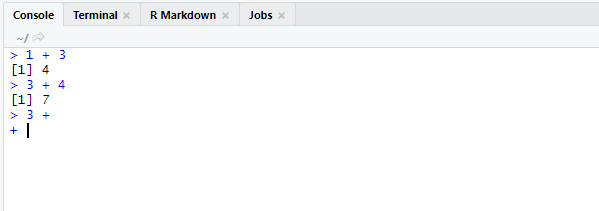
```


### Comentários

O R possui diversos caracteres especiais, e que sofrem ou geram efeitos distintos ao serem avaliados. Um desses caracteres, é o *hash* (`#`), que no R, representa o início de um comentário. Ou seja, todo e qualquer comando, letra ou expressão escrita após o símbolo `#` (incluindo o próprio símbolo `#`), será completamente ignorado pelo Console. Portanto, o símbolo `#` constitui uma forma útil de incluirmos anotações e comentários em nossos comandos. Por exemplo, você talvez tenha dificuldade de lembrar o que cada função faz, e por isso, você pode utilizar o símbolo `#` para inserir pequenas descrições e lembretes ao longo de seus comandos, para relembrá-lo o que cada função faz.

```{r}
# A função sum() serve para somar um
# conjunto de números.
sum(1,2,3,4,5)
```

### Comandos e resultados

O símbolo de "maior que" (`>`) no Console, também representa uma forma útil de você diferenciar o que é um comando a ser interpretado pelo R, e o que foi retornado pelo R como o resultado desse comando. Ou seja, todo bloco de texto em seu Console, que estiver logo à direita do símbolo `>`, representa um bloco de comandos a serem avaliados (ou que já foram avaliados) pelo R. Em contrapartida, todo texto que não possuir o símbolo `>` à sua esquerda, representa o resultado do comando anterior, ou então, uma mensagem de erro referente a esse comando anterior. 

Uma outra forma útil de identificar os resultados de seus comandos, é perceber que eles sempre vêm acompanhados por algum índice numérico no início de cada linha. Esse índice pode estar dentro de um par de colchetes (como `[1]`), ou pode estar livre, como no resultado da função `data.frame()` apresentado na figura 1.3. Perceba que esses números são apenas índices, logo, eles não fazem parte do resultado de seus comandos, e são apenas valores que marcam o início cada linha de seu resultado.

```{r, echo = F, out.width="85%", fig.cap = "Comandos e seus respectivos resultados no Console"}
knitr::include_graphics("Figuras/comandos_e_resultados_mod.png")
```


### Histórico de comandos

O Console possui uma memória dos comandos que você executou anteriormente. Tanto que esses comandos e seus resultados, permanecem visíveis ao navegarmos pelo Console. Porém, você também pode navegar pelos comandos previamente executados, ao utilizar a seta para cima ($\uparrow$) de seu teclado, quando estiver no Console. Através dessa tecla, os comandos executados anteriormente são apresentados na linha de inserção de códigos do próprio Console. 

Porém, você também pode visualizar de forma mais eficiente o seu histórico de comandos, ao acessar a janela `History` do RStudio, que fica na parte direita e superior de sua tela, como mostrado na figura 1.4. Uma outra forma de abrirmos essa janela, está na função `history()`. Com essa função, você pode determinar até quantos comandos anteriores devem ser exibidos nessa janela.

```{r, eval=FALSE}
# Exibir os últimos 10 comandos executados
history(10)
```

```{r, echo=FALSE, out.width = '60%', fig.align = 'center', fig.cap = 'Aba History - Quadrante superior direito'}
knitr::include_graphics('Figuras/history.png')
```

Para mais, você também pode visualizar esse histórico de comandos, por meio de uma pequena janela aberta em seu Console, como na figura 1.5. Quando estiver no console, você pode acessar essa janela, ao pressionar as teclas `Ctrl` + $\uparrow$.

```{r, echo=FALSE, out.width = '60%', fig.align = 'center', fig.cap = 'Histórico de comandos - Console', fig.pos="h"}
knitr::include_graphics("Figuras/historico_janela_console.png")
```


### Operações matemáticas básicas {#sec:operacoes_matematicas}

O R pode ser utilizado como uma simples calculadora, através de seus operadores aritméticos. 

```{r}
# Simples Adição
3 + 15

# Multiplicação
3 * 125

# Potenciação
3 ^ 4

# Miscelânia de operadores
((4.505 * 100)/ 5) + 0.015 
```


Você irá rapidamente perceber que esses operadores são extremamente úteis e estão por toda parte, sendo utilizados em diversas outras operações muito mais complexas. Por isso, é importante que você leve um tempo se familiarizando com esses operadores. Temos na tabela 1.1, uma lista dos principais operadores aritméticos, além de alguns comandos no R, que exemplificam o seu uso.

|  <!-- -->   |
| :------------ |
|  |
Table: (\#tab:label2) Operadores aritméticos do R


## Introdução a objetos 

Uma das principais características do R, é que ele é uma linguagem orientada a objetos (*object oriented*). Objetos são o método que o R possui para guardar os valores, funções e resultados que você produz. Como foi posto por @adler2010 [, p 50], todo código do R, busca utilizar, manipular ou modificar de alguma forma, um objeto do R. Logo, quando você estiver trabalhando com seus dados no R, você estará constantemente aplicando operações e transformações sobre os objetos onde seus dados estão guardados, de uma forma interativa e dinâmica. 

Para que um objeto seja criado, o R necessita de uma forma de referenciar aquele objeto, ou em outras palavras, uma forma de reconhecer o objeto ao qual você está requisitando. Esse mecanismo consiste fundamentalmente de um nome [@chambers2008, p 24]. Ou seja, todo objeto no R, possui um nome, e será através desse nome, que você será capaz de acessar esse objeto. Portanto, para você salvar todo e qualquer resultado ou valor no R, você precisa obrigatoriamente salvá-lo dentro de um objeto, isto é, dar um nome a esse resultado ou valor que você está gerando.

No exemplo abaixo, eu estou guardando a minha idade em um objeto chamado `idade_pedro`. Dessa forma, quando eu precisar deste número em algum momento de minha análise, eu preciso apenas chamar pelo nome onde guardei este número, ou nos termos do R, pelo nome dei ao objeto onde guardei este número.

```{r}
idade_pedro <- 22
```

Após criarmos o objeto de nome `idade_pedro`, eu posso acessar o valor que foi salvo nele, ao chamar pelo nome do objeto no Console.

```{r}
idade_pedro
```

Sempre que você estiver criando um objeto, ele irá seguir essa estrutura acima. Você possui primeiro o nome do objeto, depois o símbolo de `assignment` (`<-`), e por último, o valor (ou o conjunto de valores) que você quer guardar dentro deste objeto. Independente do quê, ou, do porquê, o código à direita do símbolo de `assignment` faz, ao ver essa estrutura, você sabe de antemão que esses comandos estão criando um objeto. 

```{r, out.width='70%', echo=FALSE, fig.align='center', fig.cap = "Estrutura necessária para criar um objeto"}
knitr::include_graphics("Figuras/objeto.png")
```

Nós podemos sobrepor o valor guardado em um objeto, ao atribuir um novo valor a este objeto. Neste caso, estaríamos perdendo o valor que salvamos anteriormente neste objeto. Como exemplo, se eu atribuir o texto "Importado" ao objeto `idade_pedro`. Após este novo comando, se chamarmos pelo nome do objeto, o R irá lhe mostrar o novo texto que acabamos de guardar, e o número 22 que estava anteriormente guardado nele, se perdeu.

```{r}
idade_pedro <- "Importado"

idade_pedro
```

Caso você tenha que sobrepor o valor de um objeto, mas você não quer perder o valor que está salvo em nele, você deve conectar este valor a um novo objeto. Se um valor não está conectado a um nome, o R vai jogar este valor fora, por isso, precisamos de uma nova conexão até ele, ou em outras palavras, precisamos conectá-lo a um novo nome. Dessa forma, podemos tranquilamente sobrepor o valor guardado em `idade_pedro`, pois agora, o valor 22 está guardado em um outro objeto.

```{r}
idade_pedro <- 22

numero_importante <- idade_pedro

idade_pedro <- "Importado"

# Ao chamar pelo nome de
# ambos os objetos, temos dois valores
# diferentes

idade_pedro

numero_importante
```


### Como nomear um objeto

Como foi destacado por @wickham2017, existem regras sobre como você pode nomear os seus objetos no R. Segundo @Rintroduction [, p 4], o nome de um objeto, pode conter qualquer símbolo alfanumérico (qualquer letra ou número), inclusive letras acentuadas. Sendo que o nome desse objeto, deve obrigatoriamente se iniciar por uma letra, ou por um ponto (`.`), como por exemplo, os nomes: `População`; `dados.2007`; `.abc`; `media_1990`. 

Porém, um nome não pode começar por um número, logo, um nome como `1995populacao`, não é permitido. Também não é possível, que se inicie um nome por um ponto (`.`) caso ele seja seguido por um número. Logo, você não pode criar um objeto com o nome `.2media`, mas você pode criar um objeto que possua o nome `.m2edia` ou `.media2`.

Em suma, o nome de um objeto pode conter os seguintes tipos de caractere:

* Letras.
* Números.
* `_` (*underline*).
* `.` (ponto).

Além disso, o nome de um objeto pode se iniciar com um:

* Letra.
* `.` (ponto, desde que não seja seguido por um número).


Porém, o nome de qualquer objeto, **não deve começar** por um:

* `_` (*underline*).
* Número.
* `.` (ponto) seguido de um número.

Pode ser difícil pensar em um nome para os seus objetos. Mas a melhor alternativa, é sempre dar um nome claro e descritivo aos seus objetos, mesmo que esse nome possa ficar muito extenso. Por exemplo, `microdados_pnad_2020` para uma base de dados contendo os microdados da PNAD de 2020; ou `vetor_idade`, para um vetor que contém as idades das pessoas que foram entrevistadas em uma pesquisa.

### O R é *case-sensitive*

O R é uma linguagem *case-sensitive*. Isso significa, que ele é capaz de diferenciar a capitalização de sua escrita. Logo, um objeto chamado `a`, é um objeto completamente diferente de um objeto chamado `A`. Veja o exemplo abaixo.

```{r maiuscula minuscula}
casa <- 10 ^ 2
cAsa <- 2 + 2

casa
cAsa
```

Como visto, os objetos `casa` e `cAsa` contêm valores diferentes, e, portanto, representam objetos distintos.

### Como utilizar objetos

Um objeto é de certa forma, uma referência até um certo conjunto de valores, e você utiliza, ou acessa essa referência, através do nome que você deu a esse objeto. Logo, sempre que você quiser utilizar os valores que estão guardados em algum objeto (seja dentro de alguma função ou em alguma operação específica), você precisa apenas utilizar o nome que você deu a esse objeto. 

Por exemplo, se eu quero somar um conjunto de valores guardados em um objeto chamado `vec_num`, eu posso fornecer o nome deste objeto à função `sum()`.

```{r}
vec_num <- c(2.5, 5.8, 10.1, 25.2, 4.4)

soma <- sum(vec_num)

soma
```


## Funções (noções básicas) {#sec:funcoes}


Como destacado por @chambers2016, até as funções que você utiliza, são objetos no R. A grande maioria das funções são escritas e utilizadas, segundo o formato abaixo. Portanto, sempre que você for utilizar uma função no R, você deve escrever o nome dessa função, e em em seguida, abrir um par de parênteses. Dentro destes parênteses, você irá fornecer os argumentos (ou *input*'s) que serão utilizados pela função para gerar o seu resultado.

```{r, eval = F}
nome_da_função(lista_de_argumentos)
```


Os operadores aritméticos utilizados até aqui (`+`, `-`, `*`, etc.) também são funções para o R, porém, eles representam um tipo especial de *função*. Pois nós podemos posicionar os seus argumentos, ao redor desses operadores (ex: `2 + 3`). Por outro lado, nós podemos escrever esses operadores (ou essas funções), da forma "tradicional", ou como as demais funções no R são escritas, o que é demonstrado logo abaixo. Perceba que pelo fato do nome da função (a função que representa o operador +), se iniciar por um símbolo que não respeita as regras que definimos anteriormente (sobre como nomear um objeto), para nos referirmos a esse objeto, ou a essa função, nós devemos contornar o nome dessa função por acentos graves.

```{r}
# O mesmo que 2 + 3
`+`(2, 3)

# O mesmo que 12 + 8
`+`(12, 8)
```


Os argumentos da função identificam os dados que serão transformados, ou representam especificações que vão modificar o comportamento da função, ou modificar a metodologia de cálculo utilizada. Dessa forma, nós definimos os argumentos das funções (i.e., incluímos as especificações desejadas) para que possamos obter os resultados de acordo com as nossas necessidades. Sendo que a `lista_de_argumentos`, corresponde a uma lista onde cada argumento é separado por uma vírgula (`,`), como no exemplo abaixo.

```{r, eval = F}
exemplo_função(argumento1 = valor_argumento1, argumento2 = valor_argumento2)
```


Um argumento pode ser um símbolo, que contém um valor específico (ex.: `argumento1 = valor_argumento1`) ou o argumento especial '`...`', que pode conter qualquer número de argumentos (geralmente, o argumento especial é encontrado em funções em que a quantidade de argumentos que será passada é desconhecida). Algumas funções possuem valores padrões em seus argumentos. Em outras palavras, caso você não defina algum valor específico para este tipo de argumento, a função vai utilizar um valor pré-definido para esse argumento. Usualmente, os valores padrão são os valores mais comuns, que utilizam as metodologias mais conservadoras ou tradicionais de cálculo da função.

Por exemplo, a função `sum()` possui o argumento `na.rm`, que define se os valores `NA` presentes em um objeto, devem ser ignorados ou não durante o cálculo da soma. Por padrão, esse argumento é configurado para `FALSE` (falso). Isso significa, que qualquer valor `NA` que estiver presente no objeto a ser somado, vai alterar o comportamento da soma executada por `sum()`. Por isso, se quisermos ignorar os valores `NA` durante o cálculo da soma, nós precisamos definir explicitamente o argumento `na.rm` para `TRUE` (verdadeiro).

```{r}
vec <- c(1.2, 2.5, 3, NA_real_, 7.6)

sum(vec)

sum(vec, na.rm = TRUE)
```


Ao definirmos os valores a serem utilizados em cada argumento de uma função, nós não precisamos determinar o nome do argumento a ser utilizado. Como exemplo, veja a função `rnorm()` abaixo. O primeiro argumento (`n`) da função, define o número de observações a serem geradas; o segundo (`mean`), define a média desses valores; e o terceiro (`sd`), define o desvio padrão que esses valores vão seguir ao serem gerados. 

```{r, eval=FALSE}
# A função rnorm() e seus argumentos
rnorm(n, mean, sd)
```

Quando nós não definimos explicitamente o nome do argumento que estamos utilizando, o R vai conectar o valor que fornecemos, de acordo com a ordem que os argumentos aparecem na função. Ou seja, o primeiro valor, será conectado ao primeiro argumento da função. Já o segundo valor, será conectado ao segundo argumento da função. E assim por diante. Isso significa, que se quisermos configurar algum argumento, fora da ordem em que ele aparece na função, nós teremos que explicitar o nome do argumento a ser utilizado.


```{r}
rnorm(10, 15, 2.5)

rnorm(n = 10, sd = 2.5, mean = 15)
```


## Erros e ajuda: como e onde obter {#sec:erros_ajuda}

Ao começar a aplicar o conhecimento exposto neste livro, você rapidamente irá enfrentar situações adversas, onde vão surgir muitas perguntas das quais eu não ofereço uma resposta aqui. Por isso, é muito importante que você conheça o máximo de recursos possíveis, dos quais você pode consultar e pedir por ajuda [@wickham2017].

Hoje, a comunidade internacional de R, é muito grande, e há diversos locais onde você pode encontrar ajuda, e aprender cada vez mais sobre a linguagem. Nessa seção, vamos explicar como utilizar os guias internos do R e do RStudio, além de algumas técnicas de pesquisa e de perguntas que podem te ajudar a responder as suas dúvidas.


### Ajuda Interna do R: `help()` e `?`

Toda função no R, possui uma documentação interna, que contém uma descrição completa (ou quase sempre completa) da função. Essas documentações são muitas vezes úteis, especialmente para descobrirmos os argumentos de uma função, ou para compreendermos que tipo de valores devemos utilizar em um certo argumento, ou então, em ocasiões mais específicas, para adquirirmos um conhecimento mais completo sobre o comportamento de uma função. 

Para acessar essa documentação, você pode anteceder o nome da função com o operador `?`, ou então, utilizar a função `help()` sobre o nome da função de interesse. Como exemplo, com os comandos abaixo, você pode consultar a documentação interna da função `mean()`.

```{r, eval = F}
# Usando `help()`
help("mean")
# Usando `?`
?mean
```

Se você estiver no programa padrão do R, ao executar um desses comandos, um arquivo HTML contendo a documentação será aberto em seu navegador. Mas se você estiver no RStudio, a documentação será aberta na janela de `Help` do próprio RStudio, localizada no quadrante direito e inferior de sua tela, como mostrado na figura 1.7.

```{r, echo = F, fig.cap = "Documentação interna da função de média no RStudio", out.width="70%"}
knitr::include_graphics("Figuras/ajuda_mean_rstudio.png")
```

A documentação interna de uma função, lhe dá uma descrição completa sobre quais tipos de valores devem (ou podem) ser inseridos em cada argumento da função. Entretanto, caso você esteja apenas em dúvida sobre os nomes dos argumentos de uma função, você pode rapidamente sanar essa dúvida, ao utilizar a função `args()` sobre o nome da função. Com essa função, uma estrutura é retornada, contendo a palavra chave `function`, e a lista de argumentos da função dentro de um par de parênteses. Porém, se a função de interesse possui diferentes métodos (como é o caso da função `mean()`, e de muitas outras funções), é muito provável que o resultado da função `args()` será de pouca utilidade, a menos que você pesquise por um método específico da função. 

```{r}
args("mean")
```

Veja no exemplo abaixo, que ao selecionarmos o "método padrão" da função de média (`mean.default()`), dois novos argumentos foram retornados (`trim` e `na.rm`) pela função `args()`. 

```{r}
args("mean.default")
```

Por esses motivos, a documentação interna representa uma fonte mais completa e segura de consulta sobre uma função. Como exemplo, na figura 1.8 podemos ver a seção de `Arguments`, da documentação interna da função `mean()`. Nessa seção, podemos encontrar uma descrição sobre o que cada argumento faz e, principalmente, sobre que tipo de valor cada um desses argumentos é capaz de receber. Vemos abaixo, pela descrição do argumento `x`, que a função `mean()` possui métodos específicos para vetores numéricos, lógicos, de data, de data-hora e de intervalos de tempo. Com essas informações, nós sabemos, por exemplo, que a função não possui métodos para vetores de texto. Também podemos deduzir dessa descrição, que a função `mean()` é capaz de lidar apenas com vetores, e, portanto, o uso de `data.frame`'s e listas está fora de cogitação.

```{r, echo = F, fig.cap = "Seção de argumentos da documentação interna da função de média", out.width="80%"}
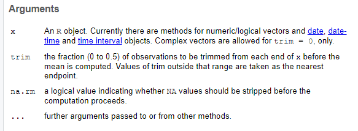
```


### Um exemplo clássico de ajuda interna

Um exemplo clássico em que a ajuda interna do R é bem útil, se encontra na função `round()`, que utilizamos para arredondar valores numéricos de acordo com um número de casas decimais.

```{r}
# Arredondar 3.1455 para duas casas decimais
round(3.1455, digits = 2)
```

Porém, há diversas maneiras de se arredondar um número, e você talvez se pergunte quais desses métodos estão disponíveis no R. Para responder a essa pergunta, você talvez pense em procurar por mais detalhes sobre a função `round()` em sua documentação interna. Temos o início dessa documentação na figura 1.9, e a primeira coisa que chama atenção é a lista de funções irmãs de `round()`. Ou seja, possuímos nessa lista, 5 funções diferentes (`ceiling()`, `floor()`, `trunc()`, `round()` e `signif()`), que buscam aplicar diferentes métodos de arredondamento. 

```{r, echo = F, fig.cap = "Documentação interna da função `round()`", out.width="80%"}
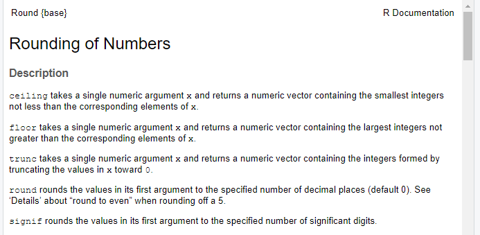
```

Ao olharmos para a descrição da função `floor()` (*"takes the largest integer not greater than the corresponding value of x"*, ou "seleciona o maior número inteiro que não é maior do que o valor correspondente em x"), podemos compreender que essa função busca sempre arredondar um número para baixo, independentemente de qual número esteja presente na última casa decimal. Também podemos entender pela descrição da função `ceiling()`, que ela executa justamente o processo contrário (*"takes the smallest integer not less than the corresponding value of x"*, ou "seleciona o menor número inteiro que não é menor que o valor correspondente de x"), e arredonda qualquer número sempre para cima.

```{r}
vec <- c(0.4, 2.5, 3.7, 3.2, 1.8)

floor(vec)

ceiling(vec)
```

A seção de detalhes dessa documentação (mostrada na figura 1.10) é particularmente útil. Pois ela nos oferece uma boa descrição das implicações do padrão adotado pela função (IEC 60559). Além disso, a descrição presente na seção de detalhes também nos aponta uma particularidade importante sobre a função `round()`. Pois ao arredondar um decimal igual ao número 5, a função `round()` normalmente irá buscar o número inteiro par mais próximo. 

```{r, echo = F, out.width="80%", fig.cap = "Seção de detalhes da documentação interna da função `round()`"}
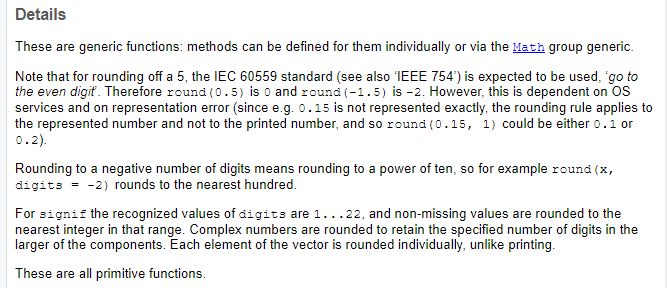
```


A importância deste ponto, emerge do fato de que algumas funções de arredondamento muito utilizadas possuem um comportamento diferente de `round()`, em uma situação como essa. Um exemplo está na função `ARRED()` do Excel, que sempre arredonda um número para cima, a partir do momento em que a sua última casa decimal atinge um valor igual ou acima de 5. Se os nossos números são arredondados de formas distintas ao longo de certos programas, diferentes valores ou resultados podem ser estimados. Em geral, nós desejamos evitar isso. 

Para que essa diferença fique clara, se eu arredondar os números 9,5 e 6,5, a função `round()` vai gerar como resultado, os números 10 e 6. Pois durante o processo de arredondamento, a função `round()` está preocupada em encontrar o número par mais próximo do valor em questão, e não sobre qual direção o arredondamento vai assumir.

```{r}
vec <- c(9.5, 6.5, 4.5, 1.5, 2.5)

round(vec, digits = 0)
```


### Ajuda Externa: referências, documentação oficial e canais úteis

Apesar de útil, a documentação interna de uma função é limitada. Essa situação tende a se confirmar especialmente em pacotes externos aos pacotes básicos do R, ao encontrarmos em suas documentações, seções de `Details` rasas e de pouca utilidade. Por isso, é interessante se aprofundar e conhecer outras referências externas ao R, produzidas por autores/usuários (livros-texto, cursos online, etc) que oferecem o seu conhecimento sobre a linguagem como um suporte à comunidade. 

Ao longo desse livro, vamos descrever diversas funções que provêm dos pacotes do `tidyverse`. Por isso, é interessante que você se familiarize com os sites desses pacotes^[https://www.tidyverse.org/packages/]. Todos esses sites possuem uma página de *"Reference"*, que contém a documentação de todas as funções do pacote. Uma outra fonte rápida de informação, são as "colas" (ou *"cheatsheets"*) produzidas pela equipe do RStudio, chamadas de [RStudio Cheatsheets](https://rstudio.com/resources/cheatsheets/).

Além disso, temos diversos livros-textos importantes sobre a linguagem, que oferecem diversos conhecimentos extremamente valiosos, como as obras de \citeonline{@wickham2017; @gillespie2017; @peng2015; @grolemund2014; @chambers2008; @adler2010}, além da documentação oficial da linguagem presente em \citeonline{@Rintroduction; @Rlanguage}.


Também há diversos cursos e materiais disponíveis, que podem ser boas fontes de informação. Dentre eles, temos o curso [Introduction to R](https://www.datacamp.com/courses/free-introduction-to-r), da plataforma Datacamp. Além disso, temos um bom material de consulta em português, construído pela equipe do [Curso-R](http://material.curso-r.com), além do material produzido pelo professor Walmes Marques Zeviani, intitulado [Manipulação e Visualização de Dados](http://leg.ufpr.br/~walmes/cursoR/data-vis/).

Para mais, temos alguns blogs que fazem boas reflexões e sempre trazem um bom conteúdo sobre a linguagem. Esse é o caso do site [R-Bloggers](https://www.r-bloggers.com), que possui uma boa discussão sobre os mais diversos assuntos no R. Um outro exemplo, é o [blog do Tidyverse](https://www.tidyverse.org/blog/), que constantemente descreve novos pacotes, novas funções disponíveis e novas aplicações para o R que podem ser muito interessantes para o seu trabalho.

Além dessas referências, é muito importante que você se familiarize com os canais de dúvida disponíveis, como o [Stackoverflow](https://stackoverflow.com). Pois esses canais serão, com certeza, a sua principal fonte de ajuda no R. Em síntese, o StackOverflow funciona da seguinte maneira: 1) alguém envia uma pergunta; 2) cada pergunta, é marcada por um conjunto de *tags*, que definem a linguagem de programação, ou pacote, ou assunto específico a que se refere a dúvida; 3) qualquer pessoa, pode postar uma resposta nessa pergunta, ou algum comentário que seja útil; 4) as respostas mais úteis e completas, serão votadas para cima, pelos próprios usuários do site; 5) dessa forma, as respostas mais úteis e completas, vão sempre aparecer primeiro na postagem da dúvida em questão.

Para encontrar perguntas especificamente voltadas para a linguagem R no StackOverflow, você deve sempre procurar por perguntas marcadas com a *tag* `[r]`, ou por algum pacote específico da linguagem. Por exemplo, o StackOverflow contém um estoque enorme de dúvidas marcadas com a *tag* `ggplot2`, que se refere ao pacote `ggplot2`, que vamos discutir mais à frente. Logo, o StackOverflow representa uma fonte extremamente importante sobre esse pacote.

Além do StackOverflow, nós também possuímos o [RStudio Community](https://community.rstudio.com/), que também é um canal de dúvidas bastante ativo, e que funciona de maneira muito similar ao StackOverflow. Onde pessoas fazem uma pergunta, que é marcada por *tags* que definem o pacote ou o assunto específico que a pergunta se refere. Porém, as perguntas no RStudio Community, tendem a assumir um aspecto mais parecido com uma discussão (ao invés de um caráter de pergunta-resposta presente no StackOverflow). Ou seja, uma pergunta abre de certa forma, uma discussão. Uma pessoa fornece uma resposta, depois outra fornece um outro olhar sobre a pergunta, o autor descreve novas dúvidas, novas respostas surgem, podendo assim, criar uma discussão infindável em torno da dúvida inicial.

As fontes de ajuda externas ao R, serão a sua maior ajuda, e a sua principal referência. Pois como foi destacado por @chase2020, ninguém é completamente autodidata. Todos nós cometemos erros, e uma das grandes vantagens de uma comunidade como a do R, é que muito conhecimento é produzido e compartilhado em torno desses erros. Por essa razão, ao invés de autodidatas (*self-taught*), @chase2020, assim como os autores desta obra, prefirímos nos caracterizar como seres instruídos pela comunidade (*community-taught*).


### Um exemplo clássico de ajuda externa

Uma das primeiras dúvidas que atingem os iniciantes, diz respeito aos objetos criados, ou melhor dizendo, aos objetos não criados em sua sessão. Você já viu na seção [Introdução a objetos](#sec:objetos), qual a estrutura básica necessária para criarmos um objeto (`nome_do_objeto <- valor_do_objeto`). Porém, você pode acabar se perdendo durante o seu trabalho, de forma a não saber quais objetos você criou em sua sessão. Em situações como essa, você pode executar a função `ls()`. Essa função irá listar o nome de todos os objetos que estão criados em sua sessão atual do R.

```{r}
ls()
```

Com isso, caso você esteja em dúvida se você já criou ou não, um certo objeto em sua sessão, você pode conferir se o nome deste objeto aparece nessa lista resultante da função `ls()`. Caso o nome do objeto não se encontre nela, você sabe que o objeto em questão ainda não foi criado. 

Por outro lado, você pode estar interessado em apagar um certo objeto de sua sessão. Tal resultado, pode ser atingido através da função `rm()`. Logo, se eu possuo um objeto chamado `dados_2007`, e eu desejo eliminá-lo de minha sessão, eu preciso apenas fornecer o nome deste objeto à função `rm()`.

```{r, eval = F}
# Removendo o objeto chamado
# dados_2007 de minha sessão
rm(dados_2007)
```


Na próxima seção, vamos abordar o uso de *scripts* no R, e um erro muito comum quando você está começando a utilizar *scripts*, é se esquecer de executar os comandos para criar um objeto. Ou seja, muitos iniciantes escrevem no *script*, os comandos necessários para criar o seu objeto, mas acabam se esquecendo de enviar esses comandos para o Console, onde eles serão avaliados e executados. 

A função `ls()` oferece uma forma rápida de consulta, que pode sanar a sua dúvida em ocasiões como essa. Mas uma outra forma ainda mais efetiva de sanarmos essa dúvida, consiste em chamar pelo nome deste objeto no console. Se algum erro for retornado, há grandes chances de que você ainda não criou esse objeto em sua sessão. Veja o exemplo abaixo na figura 1.11, em que chamo por um objeto chamado `microdados_pnad_2020`, e um erro é retornado.

```{r, echo = FALSE, fig.cap = "Mensagem de erro - Console", out.width="70%"}
knitr::include_graphics("Figuras/console_erro.png")
```


Sempre que você não souber o que um erro significa, ou a que termo ele está se referindo, faça uma pesquisa rápida sobre esse erro no Google. Se o seu erro está sendo gerado, ao executar uma função específica, você pode anteceder o erro gerado, por um "R" e pelo nome da função utilizada, na barra de pesquisa do Google. No nosso caso, talvez seja melhor pesquisarmos apenas pelo erro antecedido por um "R", como na figura abaixo. Há alguma chance de você encontrar referências de ajuda em português. Porém, as chances são infinitamente maiores se você pesquisar por artigos e perguntas escritas em inglês. Por isso, se a sua mensagem de erro estiver em português (como é o caso da mensagem na figura acima), é melhor que você tente traduzi-la para o inglês, caso você tente pesquisar por ela no Google.

Podemos encontrar no primeiro link da página mostrada na figura 1.12, uma pergunta postada no StackOverflow. Como o StackOverflow é geralmente uma boa referência de ajuda, há uma boa chance de encontrarmos o que estamos necessitando nesse link.

```{r, echo = FALSE, fig.cap = "Pesquisa Google sobre mensagem de erro", out.width="85%", fig.pos="h"}
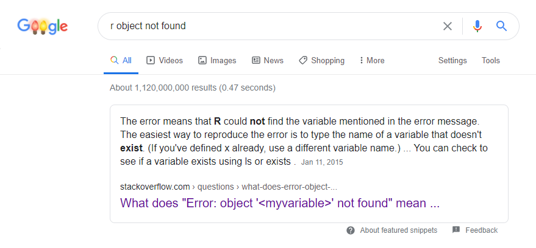
```

Ao acessarmos uma pergunta do StackOverflow, a primeira parte que aparece em sua tela, é a pergunta em si. Perguntas que são muito úteis, e que traduzem uma dúvida muito comum dos usuários, tendem a ser "votadas para cima". A pergunta exposta na figura 1.13, possui 37 votos. Ou seja, essa pergunta foi útil o suficiente para ajudar no mínimo 37 pessoas.

```{r, echo = FALSE, fig.cap = "Pergunta StackOverflow - Parte 1", out.width="85%", fig.pos="h"}
knitr::include_graphics("Figuras/pergunta_stackoverflow.png")
```

Logo abaixo da pergunta em si, temos as respostas de usuários que se dispuseram a respondê-la. As respostas mais úteis para a pergunta em questão, tendem a ter maiores votos dos usuários e, por isso, tendem a aparecer primeiro na página em relação as outras respostas menos úteis. Como podemos ver na figura 1.14, a primeira resposta possui 33 votos.

```{r, echo = FALSE, fig.cap = "Pergunta StackOverflow - Parte 2", out.width="85%", fig.pos="h"}
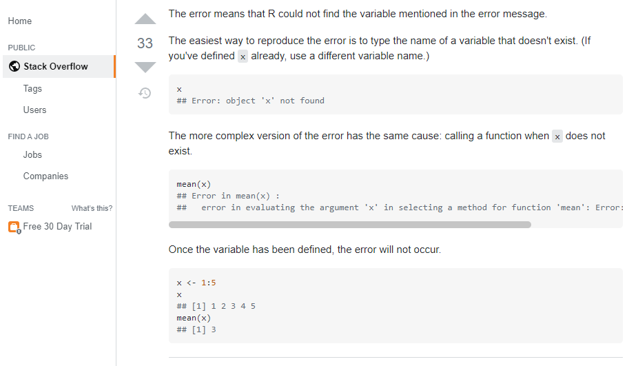
```

A resposta mostrada na figura 1.14, é bem esclarecedora. Como o autor pontua, um erro do tipo "objeto x não foi encontrado" (ou *"object x not found"*) ocorre quando tentamos utilizar um objeto que ainda não existe, um objeto que ainda não foi definido. A partir do momento em que você define esse objeto, esse erro não ocorre mais.

Como pontuei anteriormente, é muito comum de um aluno escrever os comandos necessários para criar um objeto em seu *script*, mas se esquecer de enviar esses comandos do *script* para o Console, onde serão avaliados e executados. Por isso, sempre que ocorrer esse erro, confira se você conseguiu enviar os comandos para o Console. Também confira se os comandos utilizados para criar o objeto, foram de fato executados, isto é, confirme se nenhum erro apareceu durante a execução desses comandos. Pois a depender da gravidade do erro gerado, a execução dos comandos pode ter sido comprometida e, portanto, o objeto não pôde ser criado.

Por isso, sempre que enfrentar algum erro no R, tente fazer uma pesquisa rápida no Google. Em geral, você pode copiar e colar diretamente a mensagem, ou citar apenas trechos, ou a oração principal da mensagem de erro na pesquisa. É interessante sempre colocar um "r" antes da mensagem de erro, para definir um pouco melhor a sua pesquisa e encontrar links referentes à linguagem R. 

Uma boa referência externa para compreender e solucionar erros no R, é o StackOverflow. Você pode encontrar todas as perguntas referentes à linguagem R disponíveis nesse site, ao pesquisar pela tag `[r]`, ou, acessando diretamente o link dessas perguntas: [https://stackoverflow.com/questions/tagged/r](https://stackoverflow.com/questions/tagged/r). Perceba na figura 1.15, que no momento de captura dessa imagem, existiam 432.084 perguntas disponíveis que descrevem alguma dúvida sobre a linguagem R. Hoje, esse número provavelmente é maior.

```{r, out.width = "80%", fig.cap = "Pesquisando por todas as perguntas referentes à linguagem R", echo = FALSE}
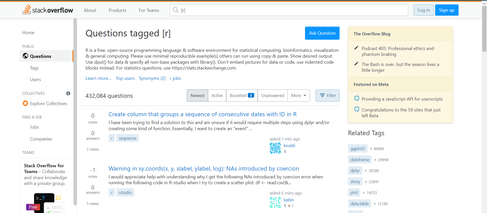
```


## Scripts {#sec:scripts}

Até o momento, estivemos utilizando diretamente o console para executarmos os nossos comandos. Porém, você provavelmente se sentiu um pouco perdido ao procurar pelos últimos comandos que você executou e, se sentiu um pouco frustrado ao ter que digitar novamente o comando caso queira executá-lo uma segunda vez. Por essa razão, à medida que você trabalha com o R, a necessidade de guardar os seus comandos anteriores em algum lugar, se torna cada vez mais urgente. Para isso, você pode utilizar um *script*.

Um *script* é um simples arquivo de texto, que contém a extensão `.R`, para indicar que todo o texto contido neste arquivo, representam comandos do R. Portanto, um *script* contém um conjunto de códigos e comandos do R que podem ser facilmente acessados, editados e executados através das ferramentas e atalhos do RStudio, tornando o seu fluxo de trabalho com o R mais eficiente. Ao utilizar o RStudio, os códigos contidos nos scripts podem ser executados individualmente ou em conjunto.


Para criar um script no RStudio, você possui duas opções: 1) clicar em *File* $\rightarrow$ *New File* $\rightarrow$ *R Script*; ou 2) utilizar o atalho `Ctrl` + `Shift` + `N`. Após criar o *script*, o quadrante esquerdo do RStudio será dividido verticalmente em dois: a parte superior comporta o editor de *script*'s e a inferior o Console. Como resultado, o seu ambiente do RStudio ficará semelhante ao ambiente exibido na figura 1.16.

```{r FIG criar script, echo=FALSE, out.width = '100%', fig.align = 'center', fig.cap = 'Quadrantes da área de trabalho do RStudio, após a abertura de um script'}
knitr::include_graphics('Figuras/quadrantes_script_mod.png')
```


Você pode criar títulos que delimitam as áreas, ou as etapas de seu *script*, e é uma forma muito eficiente de navegar pelo seu *script*, caso ele seja muito grande. Na figura 1.17, um exemplo destes títulos está identificado pela seta azul. Também na figura 1.17, temos uma caixa vermelha, e dentro dela podemos ver uma referência que aponta qual a seção, ou melhor, qual o título da seção no qual o nosso cursor se encontra atualmente. O meu cursor se encontra no momento, na seção "Importando os dados para o R". Ao clicar sobre esta referência especificada na caixa vermelha, uma nova caixa de seleção irá aparecer contendo cada um dos títulos que você criou em seu *script*, e ao clicar sobre um destes títulos, você será redirecionado para o início desta seção no *script*.

```{r, echo = FALSE, out.width = "80%", fig.cap = "Títulos e comentários em *scripts*"}
knitr::include_graphics('Figuras/script_2_mod.png')
```


Esses títulos especiais, são formados pela união entre o caractere de comentário do R (`#` - *hashtag*), o texto que você quer inserir neste título, e vários sinais de menos (`-`) em sequência, formando assim a seguinte estrutura: `### <título desejado> -------`. O número de *hashtag*'s e de sinais de menos que você insere, são arbitrários. Ao invés de escrevê-los a mão, o RStudio oferece um atalho que cria automaticamente esses títulos, através das teclas `Ctrl + Shift + R`.

Lembre-se que você também pode adicionar pequenas anotações e comentários em seu *script* com *hashtags* (`#`). Nós definimos em seções anteriores, que este é um caractere especial da linguagem, e que qualquer texto que você colocar a frente dele, será ignorado pelo console. Na figura 1.17, temos um exemplo deste comentário que está marcado por uma seta verde. 

Esses comentários são uma boa forma de descrever o que os comandos abaixo dele fazem, ou então de apontar configurações e cuidados importantes que você deve ter com esses comandos. Isso é importante especialmente com aquelas funções que você raramente utiliza, pois é menos provável que você se lembre de como elas funcionam, ou de como elas se comportam.


### Executando comandos de um script

A essa altura, você já sabe que para executarmos qualquer comando do R, ele precisa ser enviado para o console, onde será avaliado e executado. Por isso, ao utilizarmos um *script*, desejamos uma forma rápida de enviarmos esses comandos que estão guardados neste *script*, para o console do R. O RStudio oferece um atalho para isso, que é o `Ctrl + Enter`. Veja a figura 1.18, se o cursor de seu mouse estiver sobre o retângulo vermelho desenhado no *script*, ao apertar o atalho `Ctrl + Enter`, o RStudio enviará todo o bloco de comandos que criam o objeto `dados_selecionados`, para o console. Agora, se o cursor de seu mouse estivesse sobre o retângulo verde desenhado no *script*, o RStudio enviaria o bloco de comandos que formam o objeto `media_estados`.

```{r, echo = FALSE, out.width = "70%", fig.cap = "Executando comandos de um *script*"}
knitr::include_graphics("Figuras/script_comand_mod.png")
```

Após enviar um bloco de comandos para o console, através deste atalho, o RStudio irá automaticamente mover o cursor de seu mouse para o próximo bloco de comandos. Desta maneira, você pode executar parte por parte de seu *script* em sequência e, conferir os resultados de cada bloco no console.

Além disso, o RStudio também oferece um outro atalho para caso você queira executar todos os comandos de um *script* de uma vez só. Para isso, você pode apertar as teclas `Crtl + Alt + R`.


### Salvando um *script*

Ao salvar o seu *script*, você está salvando os comandos necessários para gerar os seus resultados. Isto é, através de *script*'s você possui uma poderosa ferramenta para a reprodutibilidade de sua análise. Em outras palavras, com um *script*, você é capaz de salvar **os comandos necessários para se obter o resultado desejado**, no lugar dos próprios resultados em si. Dito de outra forma, é muito mais prático carregarmos a metodologia necessária para se obter um resultado, do que o resultado em si. Pois você pode gerar repetidamente os mesmos resultados através dos comandos salvos em seu *script*, quantas vezes forem necessárias. Por outro lado, você não é capaz de gerar o *script*, ou os comandos necessários, ou a metodologia de cálculo utilizada, a partir de seus resultados. 


Para salvar um *script* que está aberto em seu RStudio, você pode clicar em *File* $\rightarrow$ *Save As...*, e escolher o diretório em que o arquivo será guardado. Você também pode salvar esse *script*, ao clicar sobre o símbolo de disquete, presente logo abaixo do nome desse *script*, no canto superior direito. Uma vez definido o nome do *script* e o local onde ele será guardado, você pode clicar em *File* $\rightarrow$ *Save*, ou utilizar o atalho `Ctrl + S` para salvar o *script* corrente a medida em que você for editando-o. 

Além desses pontos, lembre-se que um *script* é nada mais do que um arquivo de texto com uma extensão `.R` e, por isso, ele pode ser aberto normalmente por editores de texto padrão (como o Bloco de Notas do Windows, ou por programas como Notepad ++ e Sublime Text).


## Pacotes {#sec:pacotes}

Como descrevemos anteriormente na seção [O sistema e universo do R](#sec:sistema_universo_r), o R pode ser divido em duas partes: os pacotes básicos da linguagem; e todos os demais pacotes externos que foram criados e ofertados pela comunidade do R. Um pacote (*package*) corresponde a unidade fundamental de compartilhamento de códigos e funções no R [@wickham2015_packages]. Dito de outra forma, segundo as palavras de @wickham2017, um pacote do R é uma coleção de funções, dados e documentação que estendem as funcionalidades do R.


No momento de escrita desta obra (novembro de 2020), existem mais de [16.000 pacotes disponíveis no CRAN](https://cran.r-project.org/web/packages/). Segundo @wickham2015_packages, esta grande variedade de pacotes representa uma das principais razões para o sucesso do R nos anos recentes, e ressalta o seguinte pensamento: **é bastante provável que algum usuário já tenha enfrentado o mesmo problema que você, e após solucioná-lo, tenha ofertado um pacote que possa auxiliar você, na busca dessa solução**. Logo, você pode obter enormes benefícios ao utilizar o conjunto de funções desenvolvidas por outros usuários para resolver os seus problemas.


### Como utilizar um pacote

Como é descrito por @adler2010, para utilizarmos um pacote no R, precisamos "carregá-lo" para a nossa sessão. Porém, para "carregarmos" um pacote para a nossa sessão, esse pacote precisa estar instalado em nosso computador. Logo, em resumo, nós devemos realizar os seguintes passos [^4]:

1. Instalar o pacote a partir do servidor do CRAN: `install.packages("nome_do_pacote")`.
2. Carregar o pacote em cada sessão no R: `library(nome_do_pacote)`.


Você precisa executar o primeiro passo (instalar o pacote com a função `install.packages()`) apenas uma vez. Após instalar o pacote em sua máquina, você precisa carregar esse pacote através da função `library()` em toda sessão no R que você desejar utilizar as funções desse pacote. Ou seja, toda vez que iniciar o R, você precisa carregar o pacote para ter acesso às suas funções.

Por exemplo, se você desejasse utilizar as funções disponíveis no pacote `ggplot2`, que possui um conjunto de funções voltadas para a composição de gráficos, você precisaria dos comandos abaixo. Repare que o nome do pacote é fornecido como *string* à função `install.packages()`. Logo, sempre que for instalar um pacote, lembre-se de contornar o nome do pacote por aspas (simples ou duplas). 


```{r, eval=FALSE}
# Instalar o pacote `ggplot2` em seu computador
install.packages("ggplot2")
# Carregar o pacote `ggplot2` em sua sessão atual do R
library(ggplot2)
```

Como @gillespie2017 destaca, uma boa prática a ser adotada é carregar todos os pacotes necessários sempre no início de seu *script*. Dessa forma, você está acoplando a sua sessão, todas as dependências necessárias para aplicar todas as funções dispostas ao longo de seu *script*.


### Identificando os pacotes instalados em sua máquina e aqueles que foram carregados para a sua sessão

Um dos métodos mais diretos de se identificar se um determinado pacote está ou não carregado em sua sessão, consiste em você tentar utilizar uma das funções desse pacote. Se um erro aparecer durante esse processo, indicando que tal função não foi encontrada ou que ela não existe, há grandes chances de que o pacote pelo qual você está preocupado, não se encontra disponível em sua sessão atual.

Por exemplo, eu posso tentar utilizar a função `mutate()` do pacote `dplyr` como eu normalmente faria. Pela mensagem de erro abaixo, sabemos que o R não pôde encontrar a função `mutate()`, logo, o pacote `dplyr` provavelmente não foi carregado para a minha sessão até o momento.

```{r, eval=F}
mutate()
```
```
Error in mutate() : não foi possível encontrar a função "mutate"
```


Apesar de rápido, este método é um pouco inseguro. Pois, existe a chance de um dos pacotes que já estão carregados em minha sessão, possuir uma função com o mesmo nome `mutate()`. Em outras palavras, ao tentar executar a função `mutate()` em minha sessão, pode ser que o R encontre uma função `mutate()` diferente da que estou procurando. Por isso, um método mais seguro é necessário.


A resposta para tal necessidade se encontra na lista de *environments* conectados à minha sessão atual do R. Cada pacote que você carrega para a sua sessão, é representado por um *environment* que está acoplado ao seu *environment* principal. Logo, para descobrirmos se um pacote foi carregado com sucesso para a nossa sessão, podemos consultar se esse pacote está incluso na lista de todos os *environments* presentes em nossa sessão. Para obtermos uma lista dos *environments* presentes em nossa sessão, nós podemos executar a função `search()`, como abaixo:

```{r}
search()
```


Os valores que estiverem na forma `package:nome_do_pacote` indicam o *environment* de um pacote que está carregado em sua sessão atual do R. Já o valor denominado `.GlobalEnv`, representa o *global environment*, que é o seu *environment* principal de trabalho, onde todos os seus objetos criados são salvos. Vamos descrever em mais detalhes esses pontos, na seção [Noções básicas de *environments*](#sec:environments). Por enquanto, perceba pelo resultado acima, que os pacotes `tibble` e `tidyr` estão carregados em minha sessão, pois os seus *environments* (`package:tibble` e `package:tidyr`) estão listados no resultado da função `search()`.


Por outro lado, você talvez enfrente algum erro ao tentar carregar o pacote de seu interesse. Nesse caso, um bom movimento seria se certificar que esse pacote está instalado em sua máquina. Segundo @adler2010, se você precisa identificar todos os pacotes instalados em sua máquina, você pode executar a função `library()` sem definir nenhum argumento ou pacote em específico. 

```{r, eval=FALSE}
# Uma nova janela será aberta em seu RStudio
# contendo uma lista de todos os pacotes instalados
library()
```

Caso o pacote que você está tentando carregar não apareça na lista resultante de `library()`, significa que esse pacote não está instalado em sua máquina. Logo, você precisa instalá-lo com a função `install.packages()` antes que você possa utilizar as funcionalidades desse pacote em sua sessão do R.


### Acessando as funções de um pacote sem carregá-lo para sua sessão

Apesar de ser uma prática ideal na maioria das situações, você talvez não queira carregar um pacote específico e, mesmo assim, utilizar uma de suas funções. Tal opção pode gerar uma importante economia de espaço em sua memória RAM, durante a sua análise. Até porque, se você vai utilizar apenas uma única função do pacote, talvez não haja necessidade de carregar o pacote inteiro.

Para acessarmos uma função de um pacote que não foi carregado ainda em nossa sessão, precisamos chamar primeiro pelo pacote de onde estamos tirando a função, como na estrutura abaixo.

```{r acessar função sem carregar pacote, eval=FALSE}
# Acessar uma função de um pacote sem carregá-lo
nome_do_pacote::nome_da_função()
```

Logo, se você quisesse acessar a função `filter()` do pacote `dplyr`, por exemplo, você precisa primeiro chamar pelo pacote `dplyr` e, em seguida, posicionar duas vezes dois pontos (`:`) para acessar uma função ou objeto presente neste pacote. Por último, basta digitar o nome da função de interesse.

```{r, eval = F}
# Para acessar a função filter() sem chamar
# pelo pacote dplyr
dplyr::filter()
```


### Atualizando pacotes

A linguagem R está o tempo todo evoluindo e se aprimorando e, por essa razão, muitos dos pacotes disponíveis hoje, são constantemente atualizados, com o objetivo de implementar novas funcionalidades e/ou aperfeiçoar a eficiência de suas funções. Logo, é uma boa prática que você mantenha os pacotes instalados em seu computador, constantemente atualizados. Para atualizar um pacote, você precisa apenas instalá-lo novamente, através da função `install.packages("nome_do_pacote")`, ou acessar a opção *Tools* $\rightarrow$ *Check for Packages Updates...* no RStudio, como está demonstrado na figura 1.19. Através dessa opção, o RStudio irá listar todos os pacotes que possuem versões mais recentes e, portanto, podem ser atualizados. A grande vantagem é que você pode atualizar todos os pacotes presentes nessa lista de uma vez só.


```{r, echo=FALSE, out.width = '70%', fig.align = 'center', fig.cap = 'RStudio: Opção para atualização de pacotes'}
knitr::include_graphics('Figuras/check_updates.png')
```


[^4]: Uma parte pequena dos pacotes disponíveis, não se encontram no CRAN, mas sim em outras plataformas como o GitHub. Neste caso, você precisa instalá-los a partir de funções do pacote `devtools`. Para mais detalhes, consulte o item [Installing a Package from GitHub](https://rc2e.com/navigatingthesoftware#recipe-installGH) de @long2019.


```{r, child = "Exercícios/exec_cap1.Rmd"}
```


<!--chapter:end:01-nocoes-basicas.Rmd-->


# Fundamentos da Linguagem R


## Introdução {#sec:fundamentos_R}

Nas próximas seções vou abordar os fundamentos da linguagem: os básicos de sua sintaxe, quais são as estruturas e tipos de dados que a linguagem oferece, e como as suas regras de *coercion* funcionam. 

Na maior parte de sua análise, você não vai estar interessado em como o R está estruturando ou interpretando os seus dados em um dado momento. Porém, várias das funções ou ações que você deseja aplicar, exigem que os seus dados estejam estruturados em uma forma específica. Logo, ter familiaridade com os fundamentos do R, com as suas estruturas e suas propriedades, e principalmente, poder reconhecê-las, vai te salvar muito tempo. Com esse conhecimento, será mais fácil de você evitar erros, e será mais fácil de identificar e transformar a estrutura de seus dados para qualquer que seja a sua necessidade em um dado momento de sua análise.


Tendo isso em mente, além de introduzir a linguagem, as próximas seções também tem como objetivo, lhe fornecer uma base sólida desses fundamentos, para que você possa identificar e transitar entre essas diversas estruturas e tipos de dados, de forma fluida.


## Mais detalhes sobre objetos

Uma das principais características do R, é que ele é uma linguagem orientada a objetos (*object oriented*). Isto significa, que quando você estiver trabalhando com seus dados no R, você estará aplicando operações e transformações sobre os objetos onde seus dados estão guardados.

Os objetos no R, são como as caixas que você utiliza na sua mudança. Você guarda algo dentro dessa caixa, e coloca um adesivo com um nome para essa caixa, para que você se lembre do que está dentro dela. No dia seguinte à mudança, quando você precisar do conteúdo que está guardado naquela caixa, você procura essa caixa pelo nome que você deu a ela. 

No exemplo abaixo, eu estou criando um objeto, que dou o nome de `data_aniversario`, e estou utilizando o símbolo `<-` para definir o valor deste objeto para a data de aniversário de um amigo importante (20 de maio). O símbolo `<-` é comumente chamado de *assignment*, e significa que estamos atribuindo um valor a um objeto (no caso abaixo, `data_aniversario`). Em outras palavras, os comandos abaixo, podem ser lidos como: eu atribuo ao objeto de nome `data_aniversario`, o valor de `"20 de maio"`. Após isso, sempre que eu chamar por esse nome, o R irá procurar por uma caixa (ou um objeto) que possui um adesivo com um nome de `data_aniversario`. Quando ele encontrar essa caixa, ele irá me retornar no console o que tem dentro dessa caixa (ou desse objeto).

```{r}
data_aniversario <- "20 de maio"

### Quando eu chamo pelo nome deste objeto
### no console, o R me retorna o que tem dentro dele.
data_aniversario
```

O conceito de objeto é uma metáfora, ou uma forma útil de enxergarmos este sistema. Pois para o R, o nome `data_aniversario` se trata apenas uma conexão até o valor (`"20 de maio"`). Para demonstrarmos essa ideia, vamos utilizar os endereços desses objetos. Isto é, todos os valores contidos nos objetos que você cria em sua sessão do R, vão obrigatoriamente ocupar um espaço, ou um endereço da memória RAM de seu computador. Enquanto este objeto estiver "vivo", ou seja, enquanto esta conexão entre o nome `x` e os seus valores permanecer acessível em sua sessão, esses valores vão estar ocupando um endereço específico de sua memória RAM. Para descobrirmos esse endereço, nós podemos utilizar a função `ref()` do pacote `lobstr`. Vamos supor por exemplo, que nós criamos um vetor chamado `x`, que contém três números. Perceba abaixo pelo resultado da função `ref()`, que ao criar este objeto `x`, os seus valores foram alocados no endereço `0x1ca169c03d8` da minha memória RAM.

```{r, eval = FALSE}
library(lobstr)

x <- c(6, 7, 8)

ref(x)
```
```
## [1:0x1ca169c03d8] <dbl> 
```


Portanto, um objeto no R, nada mais é do que uma conexão entre um nome e valores que estão guardados em um endereço da memória RAM de seu computador. Os únicos momentos em que este endereço muda, serão todas as vezes em que você reiniciar a sua sessão no R, ou todas vezes em que você executar novamente os códigos necessários para criar os seus objetos. Tendo isso em mente, em uma representação visual, um objeto no R pode ser representado pela figura 2.1.

```{r, echo = F, fig.cap = "Representação de um objeto", out.width="60%"}
knitr::include_graphics("Figuras/objetos_1.png")
```

Para desenvolvermos essa ideia, pense o que ocorreria, se atribuíssemos os valores do objeto `x`, a um novo objeto. Segundo essa perspectiva, nós estaríamos apenas conectando o vetor com os valores 6, 7 e 8, a um novo nome, no exemplo abaixo, ao nome `y`. Nós poderíamos utilizar novamente a função `ref()` para conferirmos o endereço onde os valores do objeto `y`, se encontram, e perceba que eles estão no mesmo local que os valores do objeto `x`.

```{r, eval = FALSE}
y <- x

ref(y)
```
```
## [1:0x1ca169c03d8] <dbl> 
```

Logo, se atualizarmos a nossa representação visual, temos o seguinte resultado:

```{r, echo = F, fig.cap = "Conectando mais nomes a um mesmo conjunto de valores", out.width="60%"}
knitr::include_graphics("Figuras/objetos_2.png")
```

Em outras palavras, o R em nenhum momento criou uma cópia do vetor contendo os valores 6, 7 e 8, e alocou essa cópia no objeto `y`. Ele apenas conectou um novo nome (`y`) a esse vetor de valores. Por isso, quando você possui um objeto, e atribui um novo valor a este objeto, você está na verdade eliminando a conexão que o nome deste objeto possuía com o valor que estava guardado anteriormente naquele objeto. Ou seja, se você retornar ao vetor `x`, e definir um novo valor para ele, você estaria eliminando a sua conexão com o vetor que contém os números 6, 7 e 8, e atribuindo essa conexão a um outro conjunto de valores. Por exemplo, caso eu executasse o comando `x <- "Hello World"`, o resultado seria uma nova conexão como você pode ver pela figura 2.3.

```{r, echo = F, fig.cap = "Atribuindo novos valores a seus objetos", out.width="60%"}
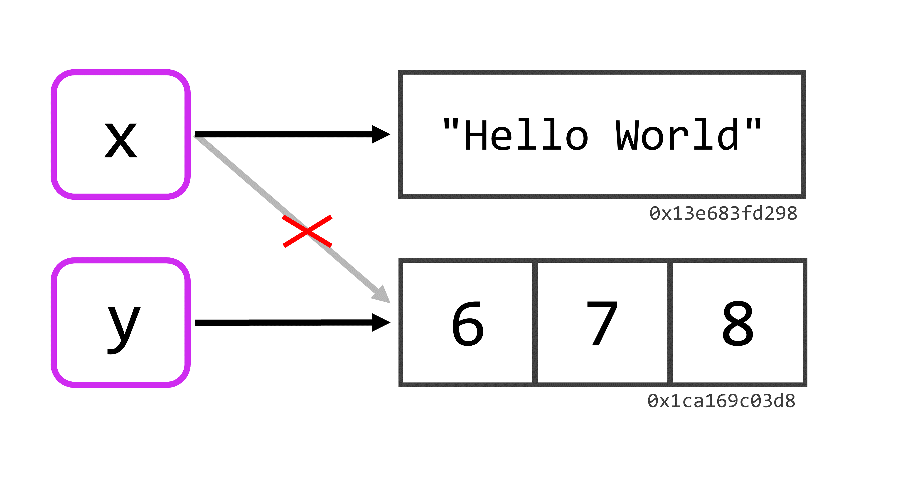
```


O R vai jogar fora, qualquer valor que não esteja conectado a um nome, ou a um objeto em sua sessão. Logo, tendo em mente a figura 2.3, caso eu atribuísse um novo valor ao objeto `y`, a última conexão até o vetor que contém os números 6, 7 e 8, seria eliminada. Com isso, este vetor não possuiria mais nenhuma conexão até um nome e, por isso, seria descartado pelo R. Portanto, se você precisa atribuir um novo valor para um determinado objeto, mas deseja manter o valor que você deu a ele anteriormente, basta que você crie uma nova conexão até o valor antigo. Em outras palavras, se você quer manter este valor, basta conectá-lo a um novo objeto. 

No exemplo abaixo, eu crio um objeto (`economista_1`) contendo o nome de um economista famoso, e em seguida conecto este nome a um novo objeto (`economista_anterior`). Portanto, o nome de Keynes está agora conectado a dois nomes, ou está contido em dois objetos diferentes em sua sessão no R. Por último, eu sobreponho o nome de Keynes que guardei no primeiro objeto (`economista_1`), pelo nome de outro economista famoso. Quando faço isso, estou efetivamente eliminando uma das conexões até o nome de Keynes, e atribuindo essa conexão ao nome de Schumpeter. Porém, como o nome de Keynes ainda possui uma conexão existente (`economista_anterior`), o nome continua "vivo" e presente em nossa sessão, e se quisermos acessar novamente esse nome, basta chamarmos pelo objeto onde o salvamos.

```{r}
# Primeiro valor
economista_1 <- "John Maynard Keynes"

# Atribuindo o primeiro valor a um novo
# objeto
economista_anterior <- economista_1

# Sobrepondo o primeiro valor no
# primeiro objeto com um novo nome
economista_1 <- "Joseph Alois Schumpeter"

economista_1

economista_anterior
```


## Como o R organiza e interpreta os seus dados

Em resumo, o R possui diferentes formas de estruturar (ou de organizar) os dados que você fornece a ele. Essas formas são o que estou chamando de estruturas de dados. Quando estamos decidindo em qual estrutura devemos armazenar os nossos dados, estamos basicamente fazendo o processo mental descrito na figura 2.4:


```{r, fig.cap = "Estruturas de dados", out.width = "80%", echo = FALSE}
knitr::include_graphics("Figuras/talvez_um_vetor.png")
```

Além da forma como os nossos dados estão organizados dentro de uma estrutura do R, nós também podemos estar interessados em como o R está interpretando esses dados, em um dado momento. Isso é uma questão extremamente relevante, na medida em que diferentes funções esperam como *input*, um tipo de dado específico, ou também, pelo fato do R aplicar (em alguns casos) diferentes "versões" de uma mesma função, a depender do tipo associado aos seus dados. 

Portanto, estamos nos perguntando qual o tipo de dado que o R está associando a um certo conjunto de valores, e em muitas ocasiões podemos nos surpreender com as escolhas da linguagem. Uma surpresa, que está representada na figura 2.5. Como exemplo, quando eu vejo o valor `"20/05/2020"`, eu rapidamente o associo à data 20 de maio de 2020, mas será que o R compreende que este valor se trata de uma data? A resposta curta é, não.

Pelo fato das datas não estarem entre os tipos de dados básicos do R, valores como `"20/05/2020"` são tratados inicialmente como simples textos (isto é, valores do tipo `character`), enquanto não dissermos explicitamente para o R, que esses valores se tratam de datas. Isso é um ponto importante, pois várias funções ou ações que queremos executar no R, exigem que os seus dados estejam no tipo adequado. Por isso, você vai enfrentar diversas situações onde o console lhe retorna um erro confuso, e depois de alguns minutos, você busca conferir a estrutura de seus dados, e supreendentemente descobre que o R estava o tempo todo interpretando os seus números como textos! 

```{r, fig.cap = "Tipos de dados", out.width = "80%", echo = FALSE}
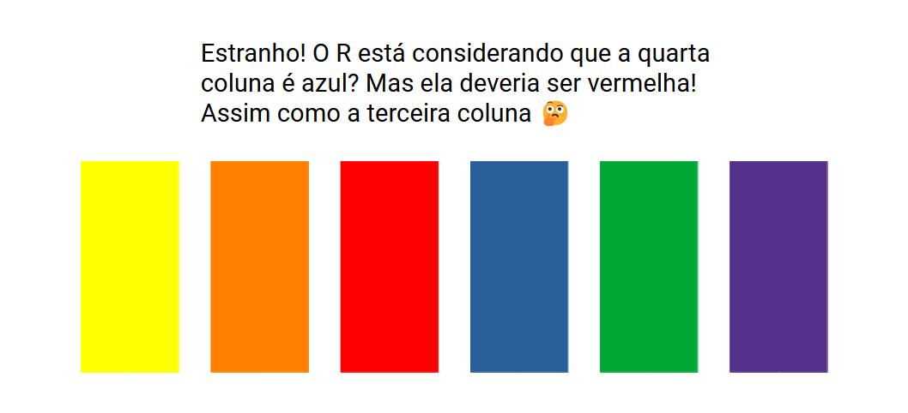
```

Portanto, vamos começar descrevendo nas próximas seções as estruturas de dados presentes na linguagem e, em seguida, os tipos de dados básicos do R. Nessas seções, não vamos incluir uma estrutura do R em específico, que é o `array`. Nós veremos mais a frente, as matrizes (`matrix`), que no fundo são um caso especial de `array`. Enquanto matrizes são vetores com duas dimensões (uma dimensão para as linhas e outra para as colunas), os `array` são vetores com "n" dimensões. Em outras palavras, com um `array` você pode criar um objeto tridimensional (3 dimensões), ou se quiser ir longe, um objeto com 4, 5, ou infinitas dimensões.


## Estruturas de dados {#sec:estruturas_dados}
### Vetores {#sec:vetores_estrutura}

Os vetores são a estrutura básica da linguagem R, pois todas as outras estruturas, são construídas a partir desses vetores. Um vetor é simplesmente uma sequência de valores. Valores que podem ser datas, números, textos, índices, ou qualquer outro tipo que você imaginar. Pelo fato de ser uma simples sequência de valores, o vetor é uma estrutura unidimensional. É como se esse vetor fosse composto por apenas uma coluna, que você preenche com quantas linhas você precisar. Ou então, você também pode imaginá-lo como uma corda, que amarra e mantém os seus valores conectados um atrás do outro.


A forma mais simples de se criar um vetor, é através da função `c()` (abreviação para *combine*, ou combinar), em que você fornece os valores que quer incluir neste vetor, separando-os por vírgulas. A outra forma (indireta) de se criar um vetor, é através de funções que retornam por padrão este tipo de estrutura. Um exemplo simples, é a função `:` que serve para criar sequências numéricas no R, no exemplo abaixo, uso essa função para criar uma sequência de 1 a 10. Outro exemplo, seria a função `rep()` que serve para repetir um conjunto de valores, por quantas vezes você quiser.

```{r}
c(48, 24, 12, 6)

c("a", "b", "c", "d")

1:10

rep(c("Ana", "Eduardo"), times = 5)
```


Como o vetor é uma estrutura unidimensional, eu posso acessar um único valor dentro desse vetor, utilizando apenas um índice. Por exemplo, se eu quero extrair o quarto valor dessa sequência, eu utilizo o número 4, se eu quero o terceiro valor, o número 3, e assim por diante. Para acessar "partes", ou um único valor de uma estrutura no R, nós utilizamos a função `[`, e para utilizá-la, basta abrir colchetes após o nome do objeto onde você salvou este vetor, ou após a função que está gerando este vetor. 

```{r}
vetor <- 1:10

vetor[4]

c("a", "b", "c")[3]
```


Para acessar mais de um valor dentro deste vetor, você terá que fornecer um novo vetor de índices à função `[`. Um jeito prático de criar este novo vetor de índices, é criando uma sequência com a função `:` que vimos anteriormente. Um detalhe, é que o R irá extrair os valores na ordem em que você os dá a `[`. Logo, se eu dentro de `[` incluir o vetor `c(2,4,6,1)`, o R irá lhe retornar um novo vetor, que contém o segundo, quarto, sexto e primeiro item do vetor anterior, respectivamente. Caso você repita algum índice, o R irá repetir o valor dentro do vetor resultante, e não te avisará sobre isso.

```{r}
vetor <- 1:25

vetor[1:4]

vetor[8:13]

vetor[c(2,4,4,1)]
```


Os vetores que estamos criando com essas funções são comumente chamados de vetores atômicos (*atomic vector*). Esses vetores possuem uma propriedade simples e importante: **vetores atômicos possuem apenas um único tipo de dado dentro deles**. Você não consegue guardar dentro de um mesmo vetor, valores de dois tipos de dados diferentes (por exemplo, textos e números) sem que alguma transformação ocorra. Caso você tente burlar essa regra, o R irá automaticamente converter os valores para um único tipo de dado, e pode ser que parte desses dados não possam ser convertidos de forma lógica para este único tipo, e acabam sendo "perdidos" neste processo. Falaremos mais sobre esse processo de conversão, quando chegarmos em tipos de dados.

### Matrizes

Matrizes nada mais são do que vetores com duas dimensões. Se você possui dados atualmente alocados em um vetor, e deseja organizá-los em colunas e linhas, você pode rapidamente criar uma matriz com este vetor, ao adicionar dimensões a ele, através da função `dim()`. Você usa a função sobre o vetor desejado à esquerda do símbolo de *assignment* (`<-`), e atribui um valor ao resultado dessa função. No caso de matrizes, esse valor será um vetor com dois elementos, o primeiro definindo o número de linhas, e o segundo, o número de colunas.

```{r}
vetor <- 1:6

dim(vetor) <- c(3,2)

vetor
```

Uma outra forma de criar uma matriz, é através da função `matrix()`. Você primeiro fornece um vetor à função, e define quantas colunas você deseja em `ncol`, e quantas linhas em `nrow`. Um detalhe que fica claro no exemplo abaixo, é que ao criar uma matriz, ela por padrão será preenchida por coluna, e não por linha. Caso você queira que ela seja preenchida por linha, você deve adicionar o valor `TRUE`, ao argumento `byrow` na função.

```{r}
# Para preencher a matriz, por linha, adicione
# byrow = TRUE à função
matrix(1:20, nrow = 5, ncol = 4)
```

Os vetores são estruturas unidimensionais, e com apenas um índice poderíamos acessar um valor contido nele. Porém, as matrizes possuem duas dimensões, logo, temos que fornecer dois índices à função `[` para acessarmos um único elemento dessa matriz. Basta você separar esses dois índices por uma vírgula, onde o primeiro valor corresponde a linha, e o segundo, a coluna desejada. No exemplo abaixo, estou extraindo o elemento que se encontra na terceira linha da quarta coluna.

```{r}
matriz <- matrix(1:20, nrow = 5, ncol = 4)

matriz[3,4]
```

Eu posso também extrair uma parte dessa matriz, ao fornecer mais valores dentro de um vetor, para cada um dos dois índices. No primeiro exemplo abaixo, eu extraio todos os valores da primeira a terceira linha da segunda coluna da matriz. Agora, caso eu queira extrair todos os valores de uma dimensão (todas as linhas, ou todas as colunas), basta que eu deixe em "branco" ao lado de cada índice. No segundo exemplo abaixo, estou extraindo todos os valores da segunda coluna.

```{r}
matriz[1:3, 2] # É o mesmo que: matriz[c(1,2,3), 2]

matriz[ , 2]
```


Pelo fato de matrizes serem vetores com duas dimensões, elas herdam a propriedade do vetor, e, portanto: **matrizes podem conter dados de apenas um único tipo**. Por essa característica, você provavelmente utilizará essa estrutura poucas vezes. De qualquer forma é útil conhecê-la.


### Listas {#sec:estrutura_listas}

A lista é uma estrutura especial e muito importante do R, pois ela é a exceção da propriedade dos vetores (que podem conter apenas um tipo de dado). **Portanto, uma lista é um vetor, onde cada elemento deste vetor pode ser não apenas de um tipo de dado diferente, mas também de tamanho e estrutura diferentes.** Dito de outra forma, você pode incluir o que você quiser em cada elemento de uma lista.


Uma lista é criada pela função `list()`, e para utilizá-la, basta fornecer os valores que deseja inserir em cada elemento desta lista, separados por vírgulas. No exemplo abaixo, estou inserindo no primeiro elemento desta lista a data que vimos anteriormente ("20/05/2020"), no segundo, estou incluindo uma matriz, no terceiro, um vetor com nomes, e no quarto, um `data.frame` (falaremos sobre eles após essa seção).

```{r}
# Lista nomeada
# nome = valor
lista <- list(
  data = "20/05/2020",
  matriz = matrix(1:20, ncol = 4, nrow = 5),
  vetor = c("Belo Horizonte", "Londrina", "Macapá"),
  tabela = data.frame(x = 21:30, y = rnorm(10))
)

lista
```

Perceba que nós nomeamos cada elemento dessa lista. Isso abre novas possibilidades, pois agora podemos utilizar um sistema diferente da função `[` para acessarmos os valores específicos de uma lista, utilizando o operador `$`. Através deste operador, podemos acessar os elementos dessa lista, através do nome que demos para cada um deles. O problema deste sistema, é que ele lhe permite acessar todos os valores contidos em um elemento de sua lista, mas não lhe permite extrair valores específicos contidos em cada um destes elementos da lista.

```{r}
lista$matriz

lista$vetor
```

Você não precisa nomear cada um dos elementos dessa lista como fizemos acima. Eu nomeie apenas para dar um exemplo do operador `$`. Porém, neste caso em que você não atribui um nome a esses elementos, você não pode acessá-los mais pelo operador `$`, e terá que retornar à funçaõ `[` para tal serviço. Em outras palavras, se você deseja criar uma lista, mas não está muito preocupado em nomear cada um dos elementos que vão estar nessa lista, basta separar esses valores por vírgulas como no exemplo abaixo:

```{r}
lista <- list(
  c(6, 7, 8),
  c("a", "b", "c"),
  c(T, F, T)
)

lista
```


Antes de prosseguirmos, darei uma nova descrição (dessa vez, uma descrição visual) de uma lista, para que você fixe na sua cabeça o que ela é. Eu espero que eu tenha desejado bem o suficiente, para que você seja capaz de identificar um trem carregando quatro vagões na figura 2.6. Podemos pensar esse trem como uma lista, e os seus vagões como os elementos dessa lista. Tendo isso em mente, temos na figura 2.6 uma representação de uma lista com quatro elementos. 

Como disse anteriormente, podemos incluir o que quisermos dentro de cada elemento dessa lista, ou dentro de cada vagão desse trem. Pois cada vagão é capaz de comportar elementos de qualquer dimensão e em qualquer estrutura, e como esses vagões estão separados uns dos outros, esses elementos não precisam compartilhar das mesmas características. Dito de outra forma, eu posso carregar 15 toneladas de ouro no primeiro vagão, 100 Kg de carvão no segundo vagão, e 1 Kg de ferro no terceiro vagão. 


```{r, out.width="70%", fig.cap = "Representação de uma lista", echo = FALSE}
knitr::include_graphics("Figuras/lista.png")
```

Portanto, a lista é uma estrutura que lhe permite transportar todos esses diferentes elementos, em um mesmo objeto no R (ou todos esses diferentes componentes em um mesmo trem). Quando chegarmos em interação, você verá que essa característica torna a lista, uma estrutura extremamente útil.

Agora como eu posso extrair valores dessa lista através da função `[` ? Bem, a lista é a exceção da propriedade dos vetores, mas ela continua sendo um vetor em sua essência, ou uma estrutura unidimensional. Por isso, você pode acessar um item de uma lista com apenas um índice dentro de `[`.

Porém, caso você usar apenas um colchete para selecionar o primeiro elemento de sua lista, você percebe que uma pequena descrição (`"[[1]]"`), ou o nome que você deu aquele elemento, aparece em cima dos valores contidos neste elemento da lista. Por isso, se você deseja extrair apenas os valores desse elemento, sem essa descrição, você deve utilizar o índice dentro de dois colchetes.

```{r}
lista <- list(
  1:20,
  "O ano tem 365 dias",
  matrix(1:20, ncol = 4, nrow = 5)
)

lista[1]

lista[[1]]

lista[[2]]

lista[[3]]
```


Isso ocorre, porque quando você utiliza apenas um colchete para selecionar o primeiro elemento, o R acaba lhe retornando uma nova lista contendo um elemento, e não apenas o que está dentro deste elemento em si. Dizendo em termos da representação visual que utilizamos na figura 2.6, se eu possuo um trem com quatro vagões, e utilizo um colchete para selecionar o primeiro vagão, o R me retorna um novo trem que contém o primeiro vagão. Mas se eu utilizo dois colchetes, o R me retorna apenas o primeiro vagão, e nada mais.


```{r, out.width="70%", fig.cap = "Diferença entre um e dois colchetes em listas", echo = FALSE}
knitr::include_graphics("Figuras/colchetes.png")
```


Mas como eu faço para extrair um valor específico de um elemento de uma lista? Para isso você deve abrir um novo colchete após os colchetes duplos que você criou para selecionar o elemento da lista. A partir daí, basta replicar o que vimos anteriormente com os índices. No exemplo abaixo, estou primeiro selecionando o terceiro elemento da nossa lista (que é uma matriz), e selecionando o item da terceira linha da primeira coluna desta matriz.

```{r}
lista[[3]][3,1]
```


### Tabelas no R: `data.frame` {#sec:estrutura_data_frames}

O `data.frame` é a principal estrutura utilizada para guardar tabelas e bases de dados no R. Na grande maioria das vezes que você importar os seus dados para o R, eles serão alocados dentro de um `data.frame`. Essa estrutura é no fundo, uma lista com algumas propriedades a mais. Por isso, o `data.frame` herda uma de suas principais propriedades: **cada uma das colunas da tabela formada por um `data.frame`, pode conter um tipo de dado diferente das demais colunas deste `data.frame`.**

Esta é uma das principais características que tornam o `data.frame`, uma estrutura adequada para guardar a grande maioria das bases de dados. Pois é muito comum, que você possua em sua base, diversas colunas contendo dados de diferentes tipos. Por exemplo, você pode ter uma base que possui uma coluna contendo datas, outras duas contendo valores numéricos, e uma última coluna contendo textos, ou rótulos indicando a qual indicador ou grupo, os valores numéricos da linha se referem. E ao importar uma base como essa para o R, é de seu desejo que o R interprete essas colunas corretamente e mantenha os tipos desses dados intactos.

Os `data.frame`'s são criados pela função `data.frame()`. Você deve preencher essa função com os valores que você deseja alocar em cada coluna separados por vírgulas. Você pode escolher não dar um nome a cada coluna, neste caso a função se ocupará de dar um nome genérico para elas. Caso opte por definir esses nomes, você deve fornecê-los antes dos valores da coluna, seguindo a seguinte estrutura:

```{r}
# Estrutura Básica:
# data.frame(
#   <nome_coluna> = <valor_coluna> 
# )

data.frame(
  nomes = rep(c("Ana", "Eduardo"), times = 5),
  numeros = rnorm(10),
  constante = 25
)
```

Caso você esteja em dúvida, tudo o que a função `rnorm()` faz é gerar valores aleatórios seguindo uma distribuição normal. Vemos que no exemplo acima, geramos uma tabela com 3 colunas e 10 linhas, e aqui chego a segunda principal propriedade de um `data.frame`, que é: **todas as colunas de um `data.frame` devem possuir o mesmo número de linhas**. O motivo dessa propriedade é um pouco óbvio, pois se estamos tentando formar uma tabela de dados, é natural pensarmos que ela deve formar um retângulo uniforme. 


Isso significa, que se eu pedisse para a função `rep()` repetir os valores 6 vezes (ao invés de 5), gerando assim um vetor de 12 elementos (ou 12 linhas), a função `data.frame()` me retornaria um erro, indicando que o número de linhas criadas pelos diferentes vetores não possuem o mesmo número de linhas.


Caso não tivéssemos essa propriedade, estaríamos permitindo que alguma dessas colunas deste `data.frame`, fosse mais longa do que as outras. Neste caso, como você lidaria com as observações "sobressalentes" da tabela ? Você possui um valor na coluna x que não possui um valor correspondente na coluna y, será que você considera o valor da coluna y como vazio ? Não disponível ? Não existente ? Enfim, uma confusão que é desnecessária.

Essa propriedade nos garante que para cada observação (ou linha) da nossa tabela, deve **sempre** existir um valor na coluna y correspondente ao valor da coluna x, mesmo que o valor da coluna y seja um valor `NA` (não disponível), ou algo indicando que não foi possível coletar esse valor no plano físico de nossa atividade.

Ao voltar para o exemplo acima, você pode perceber que na terceira coluna que definimos em `data.frame()`, demos uma simples constante (25) à função. Como resultado, a função acaba preenchendo toda a coluna por essa constante. Isso ocorre sempre que você fornece um único valor a uma coluna de seu `data.frame`, seja este valor, uma data, um texto, um número ou qualquer outro tipo que imaginar.

A partir daqui, é interessante criarmos um modelo visual em nossa cabeça, sobre o que um `data.frame` representa. Como disse anteriormente, um `data.frame`, é basicamente uma lista, com algumas propriedades a mais, em especial a propriedade de que todos os seus elementos devem possuir o mesmo número de linhas. Portanto, se você quer imaginar um `data.frame` em sua mente, você pode imaginar uma lista, onde cada um de seus elementos, representa uma coluna desse `data.frame`. Em conjunto, essas colunas (ou os elementos dessa lista) formam uma tabela, sendo essa tabela, comumente referida como um `data.frame`.

```{r, fig.cap = "Representação de um `data.frame` a partir de uma lista", out.width="80%", echo = FALSE}
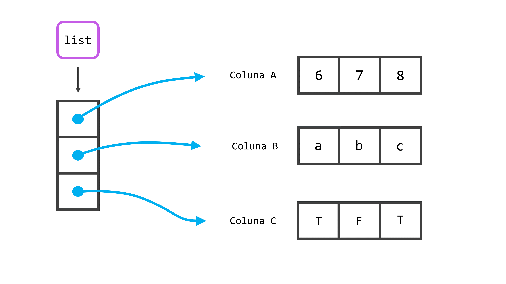
```


Vale destacar um outro comportamento da função `data.frame()`. Ela transforma por padrão, todos os textos em fatores (*factor*), ou em outras palavras, valores de uma variável categórica que possui um conjunto limitado de valores possíveis. Vamos aprender mais sobre este tipo de dados nas próximas seções. Inicialmente, isso não tem grandes implicações sobre os seus dados. Eles vão continuar sendo apresentados como textos, e a única grande mudança será sobre a forma como o R irá ordenar esses valores caso você peça isso a ele. Mas é importante saber deste detalhe, pois você vai querer suprimir esse comportamento na maioria das vezes. Para isso, basta adicionar o valor `FALSE` para o argumento `stringsAsFactors`.

```{r}
tabela <- data.frame(
  cidade = rep(c("Belo Horizonte", "Londrina", "Macapá"), times = 4),
  valor = rnorm(12),
  stringsAsFactors = FALSE
)

# Estou utilizando a função is.character()
# para confirmar que data.frame() manteve
# a coluna de cidades como texto (characters)
is.character(tabela$cidade)
```

No exemplo acima, você também percebe que eu utilizei dentro da função `is.character()`, o operador `$` para acessar os valores da coluna `cidade` da nossa tabela. Em `data.frame`'s você sempre pode utilizar este mecanismo para acessar os valores de uma das colunas de sua tabela, pois `data.frame()` irá sempre se preocupar em nomear as colunas caso você não o faça. Portanto, mesmo que `data.frame()` invente um nome completamente esquisito para as suas colunas, elas sempre terão um nome para o qual você pode se referir com `$`.


Isso não significa que você deixará de utilizar o sistema `[`, pois essa função é muito mais flexível do que você imagina. Uma de suas principais e mais poderosas ferramentas, é um sistema que é comumente chamado de *logical subsetting*. Com ele, podemos usar a função `[` para extrair valores de um objeto, de acordo com o resultado de testes lógicos. Em diversas funções de pacotes que você utilizar, se você visitar o código fonte dessas funções, você irá encontrar este sistema sendo utilizado em algum momento, sendo portanto, uma ferramenta extremamente útil dentro do R.


Em resumo, se você quer extrair todos os valores de uma coluna de seu `data.frame`, você pode utilizar o sistema `$`, ou o mesmo sistema que utilizamos em matrizes, ao deixar o índice das linhas em "branco" dentro de `[`. Se você quer extrair partes específicas de sua tabela, você terá que usar `[` da mesma forma que o utilizamos em matrizes. Como as colunas de um `data.frame` são nomeados, você pode também extrair uma coluna inteira, ao colocar o nome dessa coluna entre aspas dentro dos colchetes. Todos os sistemas utilizados abaixo, nos retorna todos os valores da coluna `cidade`.

```{r, eval = FALSE}
tabela$cidade

tabela[, 1]

tabela[["cidade"]]
```

Você deve ter percebido acima que utilizei novamente os dois colchetes, ao me referir dentro deles pelo nome da coluna desejada. Este sistema funciona exatamente da mesma forma que ele funciona em listas. Se eu utilizar um colchete, o R me retorna um `data.frame` contendo uma única coluna (neste caso, a coluna `cidade`), se eu uso dois colchetes, o R me retorna um vetor contendo apenas os valores dessa coluna.

Agora, voltando um pouco em nossa descrição, quando eu disse que um `data.frame` são listas, pois herdava muitas de suas propriedades, eu acabei omitindo uma dessas propriedades para evitar confusões. Você deve ter percebido pelos exemplos anteriores, que cada elemento de um `data.frame` é uma coluna de sua tabela. Você talvez tenha percebido também que todos esses elementos nos exemplos anteriores, eram vetores. Isso é uma característica marcante de um `data.frame`, pois na maioria das vezes em que você ver um, ele estará servindo apenas como um laço, que amarra e mantém diferentes vetores unidos em uma mesma estrutura, vetores esses que juntos formam uma tabela.

Você deve estar pensando: "Mas é claro que cada coluna é um vetor! Não faria sentido se eu incluísse matrizes ou outras tabelas em uma coluna de uma tabela! Um vetor é a estrutura que faz mais sentido para essas colunas!". Bom, eu creio que agora é uma boa hora para "explodir" a sua cabeça!...ou pelo menos metaforicamente falando. **A outra propriedade que `data.frame`'s herdam de listas, é que cada um de seus elementos também não precisam ser da mesma estrutura. **

Essa propriedade significa que eu posso incluir sim, uma matriz, ou um outro `data.frame`, como uma nova coluna de um `data.frame` que está salvo em algum objeto. Lembre-se que a principal diferença entre um `data.frame` e uma lista, é que os elementos de um `data.frame` precisam obrigatoriamente ter o mesmo número de linhas. No exemplo abaixo, eu estou criando inicialmente um `data.frame` com 10 linhas e 2 colunas, logo, se eu quiser incluir uma nova tabela como uma nova coluna desse `data.frame`, essa nova tabela (ou novo `data.frame`) deve possuir 10 linhas (mas esse novo `data.frame` pode ter quantas colunas você desejar). 

Você pode facilmente adicionar uma nova coluna a um `data.frame`, utilizando o operador `$`. Você escreve primeiro o nome do objeto onde o seu `data.frame` está contido, abre o cifrão (`$`), e em seguida, coloca um nome de uma coluna que não existe em seu `data.frame` até aquele momento. Se não há alguma coluna neste `data.frame` que possui este nome, o R irá adicionar esta coluna a ele, e para você preencher essa coluna com algum valor, basta utilizar o símbolo de *assignment* (`<-`), como se você estivesse salvando algum valor em um novo objeto. Após criar essa nova coluna, eu chamo por ela, para que o R me mostre o que tem nessa coluna, e como esperávamos, ele me retorna o novo `data.frame` que criamos.

```{r}
tabela <- data.frame(
  cidade = rep(c("Belo Horizonte", "Londrina"), times = 5),
  valor = rnorm(10)
)

tabela$novo_dataframe <- data.frame(
  x = rep("Ana", times = 10),
  y = rep("Eduardo", times = 10),
  z = 25
)

tabela$novo_dataframe
```

Na figura 2.9, estou utilizando a função `str()` sobre o objeto `tabela`. Essa função nos retorna no console, uma descrição da estrutura de um objeto. No retângulo vermelho, temos a estrutura geral do objeto, vemos que o objeto `tabela` é um `data.frame` com dez linhas e três colunas. Os nomes de suas três colunas estão especificadas no retângulo verde. A direita do nome da terceira coluna (chamada `novo_dataframe`), podemos ver uma descrição de sua estrutura marcada por um retângulo azul. Vemos neste retângulo azul, portanto, a estrutura desta terceira coluna, e podemos confirmar que se trata também de um `data.frame` com 10 linhas e 3 colunas, e no retângulo roxo, podemos ver o nome das três colunas (no caso abaixo, colunas x, y e z) contidas neste segundo `data.frame`. Os falantes de língua inglesa costumam se referir a esta situação onde inserimos uma nova estrutura dentro de uma mesma estrutura, como uma *nested structure*, ou uma estrutura "aninhada". Logo, o exemplo que estou dando, se trata de um *nested* `data.frame`. Pois estamos inserindo um `data.frame`, dentro de um outro `data.frame`.

```{r, fig.cap = "Estrutura de um `data.frame` aninhado", echo = FALSE, out.width="80%"}
knitr::include_graphics("Figuras/str_dataframe_mod.png")
```

Se você chamar pelo nome `tabela` no console, para ver o que tem dentro deste objeto, o console irá lhe mostrar um `data.frame` com 10 linhas e 5 colunas. Pois ele lhe apresenta tanto as 2 colunas definidas como vetores em `tabela`, quanto as 3 colunas definidas em `tabela$novo_dataframe`, tudo em uma mesma tabela. Entretanto, como vimos através da função `str()`, o R está considerando este objeto como um `data.frame` com 10 linhas e 3 colunas, onde a terceira coluna contém um novo `data.frame` de 10 linhas e com outras 3 colunas, e não como um único `data.frame` com 10 linhas e 5 colunas.

Tendo essas considerações em mente, você pode sim incluir dados que estão em qualquer uma das estruturas anteriormente mencionadas, dentro de uma coluna (ou elemento) de um `data.frame`. Essa propriedade é mais citada nos manuais originais da linguagem \cite{Rlanguage, Rintroduction}, enquanto é muito pouco mencionada, ou pouco explicada em detalhes em outros livros-texto sobre a linguagem. Pois é uma propriedade que faz pouco sentido, considerando-se as principais aplicações de um `data.frame`. Porém, com essa propriedade, você pode pensar facilmente em uma outra estrutura que é muito mais útil e muito mais poderosa, para ser incluída em uma nova coluna de seu `data.frame`. Essa estrutura, é uma lista! 


Pense um pouco sobre isso. Uma lista é um vetor em sua essência, e por isso, pode facilmente formar uma nova coluna desse `data.frame`. A vantagem de se incluir uma lista, é que agora em cada célula (ou em cada linha) dessa nova coluna, eu posso guardar um dado de um tipo, tamanho e estrutura diferentes. Se fossemos utilizar a representação visual da seção anterior, é como se a coluna de seu `data.frame` tenha se transformado em um trem, e agora cada célula, ou cada linha dessa coluna, tenha se tornado um vagão deste trem. Com essa realidade, você pode por exemplo, facilmente aplicar um modelo de regressão sobre 1.000 bases de dados diferentes, e ainda guardar os resultados em cada linha de uma nova coluna, tudo isso com apenas um comando! Dessa forma, você terá em uma coluna de seu `data.frame` contendo uma lista, lista essa que está mantendo todos esses 1.000 `data.frame`'s diferentes juntos.

Se você consegue entender a língua inglesa, mesmo que sutilmente, eu altamente recomendo que assista a palestra de Hadley Wickham, entitulada *"Managing many models with R"*, que está disponível no YouTube^[https://www.youtube.com/watch?v=rz3_FDVt9eg]. Nesta palestra, ele dá um exemplo prático de como você pode implementar essa ideia, ao aplicar um modelo de regressão sobre várias bases diferentes, utilizando essa propriedade em um `data.frame`.


### `tibble`'s como uma alternativa moderna aos `data.frame`'s {#sec:fundamentos_tibble}

Um `tibble` nada mais é do que uma "versão moderna" de um `data.frame`. Essa estrutura de dado é originária do pacote `tibble`, logo, se você deseja utilizá-la em algum de seus dados, você terá que chamar obrigatoriamente por esse pacote com o comando `library()`^[Caso tenha alguma dificuldade em chamar pelo pacote, volte a seção [Pacotes](#sec:pacotes) para descobrir o passo que você se esqueceu de cumprir.]. Lembre-se que o pacote deve estar instalado em sua máquina, para que você seja capaz de chamar por ele com o comando `library()`.

Portanto, essa estrutura foi criada com o intuito de melhorar alguns comportamentos do `data.frame`, que eram adequados para a sua época, mas que hoje, são desnecessários e que podem gerar um pouco de dor de cabeça. Tais estruturas podem ser criadas do zero, através da função `tibble()`, que funciona da mesma maneira que `data.frame()`. Você dá o nome para cada coluna, e após um igual (`=`) você define o que irá preencher cada uma dessas colunas.

```{r}
library(tibble)

tab_tibble <- tibble(
  Datas = seq.Date(as.Date("2020-12-01"), as.Date("2020-12-10"), by = 1),
  Usuario = sample(c("Ana", "Eduardo"), size = 10, replace = T),
  Valor = sample(c(2000, 3000, 4000, 5000), size = 10, replace = T)
)

tab_tibble
```

Por outro lado, se você já possui um `data.frame` e deseja convertê-lo para um `tibble`, você precisa apenas aplicar a função `as_tibble()` sobre ele.

```{r, eval = FALSE}
tabela <- as_tibble(tabela)
```


A primeira melhoria dessas estruturas, se encontra no método de `print()`, ou em outras palavras, na forma como o R lhe mostra a sua tabela no console. Quando chamamos por um objeto que é um `data.frame`, o console acaba lhe retornando muito mais linhas do que o necessário (ele pode retornar até 1000 linhas), além de todas as colunas da tabela. Se o seu `data.frame` possui várias colunas, você pode se sentir frustrado com esse comportamento, pois se alguma coluna de sua tabela não couber ao lado das colunas anteriores, o console acaba quebrando o resultado em várias "linhas", algo que pode tornar a leitura confusa com certa facilidade.

As origens do R são antigas (> 50 anos), e aparentemente esse não era um comportamento muito ruim na época, talvez porque as dimensões das tabelas dessa época eram muito limitadas. Porém, com as capacidades de processamento atuais, essa atitude é desnecessária ou indesejada em quase todas as situações. Veja no exemplo abaixo, onde eu pego a base `flights` (que possui 19 variáveis diferentes), e transformo-a em um `data.frame` com a função `as.data.frame()`. Para que o resultado não consuma muito espaço deste material, eu ainda limito o resultado às 5 primeiras linhas da tabela com `head()`. Perceba que a tabela foi dividida em 3 linhas diferentes de *output*.

```{r}
library(nycflights13)

as.data.frame(flights) %>% 
  head(n = 5)
```

Quando as suas tabelas são `tibble`'s, o console lhe retorna por padrão, apenas as 10 primeiras linhas da tabela (caso a tabela seja muito pequena, ele pode lhe retornar todas as linhas), o que já é o suficiente para vermos a sua estrutura. Além disso, caso as próximas colunas não caibam em uma mesma "linha", ou ao lado das colunas anteriores, o `tibble` acaba omitindo essas colunas para não sobrecarregar o seu console de resultados. Lembre-se que você sempre pode ver toda a tabela, em uma janela separada através da função `View()`.

```{r, eval = FALSE}
View(flights)
```


Veja o exemplo abaixo, onde eu chamo novamente pela base `flights`. O primeiro detalhe que você percebe, é a dimensão da tabela (algo que não é informado, quando chamamos por um `data.frame`) no canto superior esquerdo da tabela (336.776 linhas e 19 colunas). O segundo detalhe, é que o tipo de dado contido em cada coluna, está descrito logo abaixo do nome da coluna, de acordo com a abreviação deste tipo. Por exemplo, nas três primeiras colunas estão contidos números inteiros (*integer*'s - `int`), enquanto na sexta coluna (`dep_delay`) temos números decimais (*double*'s - `dbl`).

Mesmo que em um `tibble`, você fique sem a possibilidade de visualizar todas as outras colunas da tabela, que não cabem na mesma linha junto com as colunas anteriores, um `tibble` sempre lhe retorna logo abaixo da tabela, uma lista contendo o nome de todas as colunas restantes, além do tipo de dado contido em cada coluna, através das mesmas abreviações que vimos nas colunas anteriores.


```{r}
flights
```

Além desses pontos, `tibble`'s vão sempre criar destaques, ou ênfases em certos dados no console, algo que os `data.frame`'s não fazem em nenhum momento. Por exemplo, `tibble`'s vão sempre marcar de vermelho, qualquer número que seja negativo, uma funcionalidade que é bem familiar aos usuários de Excel que utilizam formatação condicional. Um outro detalhe, é que essa estrutura também marca as casas dos milhares com um pequeno sublinhado, o que facilita muito a leitura de números muito grandes.

```{r, out.width="25%", echo = FALSE, fig.cap = "Ênfase em valores numéricos presentes em um `tibble`"}
knitr::include_graphics("Figuras/marcacoes.png")
```


Para mais, um comportamento muito comum de um `data.frame`, é converter os seus dados em textos, para fatores (`factor`). Este não é um comportamento de todo ruim, e nem sempre ele ocorre. Porém o principal valor dos fatores no R, está no uso de *dummies* em regressões e análises estatísticas, além da maneira como a ordenação de seus valores é executada. Estas características são importantes, mas também são irrelevantes para uma gama muito grande de situações. Em outras palavras, este é um comportamento desnecessário na maioria de nossas análises. 

Por isso, uma outra característica que os `tibble`'s carregam, é que eles nunca transformam os seus dados para um outro tipo. Isso é um ponto muito importante! As funções com as quais nós trabalhamos no R, geralmente funcionam melhor com (ou são especializadas em) uma estrutura ou tipo de dado específico, e quando nós estruturamos as nossas análises sobre essas funções, nós desejamos evitar mudanças não autorizadas sobre os tipos e estruturas utilizados.

Ou seja, é sempre melhor evitar transformações implícitas de seus dados. Pois essas operações podem muito bem, levantar erros dos quais você não compreende, até que você (depois de muito tempo analisando os resultados) perceba que os seus dados foram convertidos para algo incompatível com o que você deseja realizar.

Dessa forma, em um `tibble` os seus dados em texto são interpretados como textos (`character`), a menos que você peça explicitamente ao R que interprete esses dados de uma outra forma. Veja o exemplo abaixo, onde utilizo a função `str()` para ver um resumo da estrutura de cada tabela. Podemos ver abaixo, que a coluna `text` na tabela `tib` contém dados do tipo `character` (`chr`), enquanto essa mesma coluna na tabela `df`, possui dados do tipo `factor`.

```{r, eval=FALSE}
tib <- tibble(
  x = rnorm(10),
  text = sample(c("Ana", "Eduardo"), size = 10, replace = T)
)

df <- data.frame(
  x = rnorm(10),
  text = sample(c("Ana", "Eduardo"), size = 10, replace = T)
)

str(tib)
```
```
tibble [10 x 2] (S3: tbl_df/tbl/data.frame)
 $ x   : num [1:10] 0.172 0.315 0.119 -0.155 -0.165 ...
 $ text: chr [1:10] "Eduardo" "Ana" "Eduardo" "Eduardo" ...
```
```{r, eval=FALSE}
str(df)
```
```
'data.frame':	10 obs. of  2 variables:
 $ x   : num  0.0639 -0.4522 0.7528 -1.3353 1.454 ...
 $ text: Factor w/ 2 levels "Ana","Eduardo": 2 2 2 1 2 2 1 1 2 1
```

Uma última característica de um `tibble`, é que ele lhe permite criar colunas com nomes que não respeitam as regras usuais do R. Por exemplo, não é permitido criar variáveis que possuam um nome que se inicia por um número, ou então, que possuam algum tipo de espaço ao longo dele. Mas dentro de um `tibble`, você não possui tais restrições. No exemplo abaixo, eu tento ultrapassar essa regra na função `data.frame()`, e ela acaba preenchendo o espaço no nome, com um ponto (.), e também coloca uma letra qualquer antes do número da coluna "10_janeiro", enquanto em um `tibble`, isso não ocorre. Entretanto, mesmo que você possua essa liberdade em um `tibble`, ao se referir a essas colunas que não se encaixam nas regras do R, você terá de contornar o nome dessas colunas, com acentos graves (\texttt{`}).

```{r}
data_frame <- data.frame(
    "Nome coluna" = rnorm(10),
    "10_janeiro" = rnorm(10)
  )

tibble <- tibble(
    "Nome coluna" = rnorm(10),
    "10_janeiro" = rnorm(10)
  )

head(data_frame, 10)

tibble

tibble$`10_janeiro`
```


Portanto, os `tibble`'s foram criados com o intuito de manter as funcionalidades importantes de um `data.frame`, e ao mesmo tempo, eliminar comportamentos que hoje são desnecessários ou ineficientes. Em resumo, um `tibble` é uma estrutura preguiçosa. Pois ele nunca converte implicitamente os seus dados para algum outro tipo, ele não altera o nome de suas colunas, e ele também não sobrecarrega o seu console com linhas e linhas de resultados, lhe mostrando apenas o necessário.


## Tipos de dados {#sec:fundamentos_tipos_dados}


Como foi destacado anteriormente, além das estruturas de dados, o R possui os tipos de dados. Tipos esses que dizem respeito a forma como o R está interpretando os seus dados, em um dado momento. Os cinco tipos de dados básicos da linguagem são:

1. `character`: valores de texto ou caracteres.

2. `double`: valores númericos inclusos no conjunto dos números reais.

3. `integer`: valores númericos inclusos no conjunto de números inteiros, ou basicamente, números sem casas decimais.

4. `logical`: valores `TRUE` (verdadeiro) e `FALSE` (falso), resultantes de testes lógicos.

5. `complex`: valores em números complexos.


Vários outros tipos de dados mais complexos, como datas (`Date`) e fatores (`factor`), são construídos a partir desses 5 tipos básicos da linguagem. Tendo isso em mente, o único tipo básico que não irei abordar nas próximas seções, será o tipo `complex`, pois é um tipo muito específico e extremamente raro na linguagem.


Vale destacar que, diferentes autores denominam essa propriedade de formas diferentes, ou, tendem a misturá-la em outros conceitos. Como exemplo, @peng2015 denomina os "tipos de dados" como "classes atômicas de objetos" (ou, *"atomic classes of objects"*), enquanto @wickham2017, costuma se referir a essa propriedade como "tipos de vetores" (ou, *"vector types"*). Todavia, independente da forma como os autores denominam essa propriedade, a lógica permanece a mesma.

O termo utilizado por @wickham2017 é mais apropriado para essa situação. Não apenas porque ele representa melhor a forma como esses conceitos são apresentados nos manuais internos da linguagem \cite{Rlanguage, Rintroduction}, mas também, porque o termo utilizado por @peng2015 mistura dois conceitos importantes que são diferentes entre si: a classe e o tipo de um objeto. 

O tipo do objeto, (isto é, o que estou chamando aqui de tipo de dado - `character`, `double`, etc.), determina a representação interna do objeto. Ou seja, como esse objeto é armazenado internamente em C `structs` e na memória RAM de seu computador. Já a classe é um atributo do objeto, que determina quais são os métodos de funções a serem aplicados sobre este objeto [@chambers2016, p 45]. 

### Textos e caracteres (`character`)

Variáveis textuais são extremamente comuns nas mais diversas análises. Tais variáveis são geralmente denominadas de variáveis categóricas, pois em geral, elas buscam classificar os seus dados em certas categorias e grupos. Para além dessas variáveis, também é comum utilizarmos textos para definir rótulos e títulos de gráficos, ou ainda, para definir certos argumentos de funções. Para armazenar, interpretar e transformar esse tipo de dado, o R nos oferece o tipo `character`. Valores do tipo `character` também são conhecidos pelo termo *string* (ou *string of characters*).

Todo valor em texto no R (isto é, todo dado do tipo `character`), deve ser fornecido entre aspas (simples - `'`, ou duplas - `"`), sendo essa uma convenção utilizada em quase todas as linguagens de programação, e no R não é diferente. Esta convenção se torna ainda mais importante no R, pois ela também serve para diferenciar valores em texto de nomes de objetos.

Em outras palavras, quando queremos acessar os valores que estão dentro de um objeto, nós simplesmente escrevemos o nome deste objeto. Entretanto, quando estamos fornecendo um simples texto ao R, é muito comum que nos esqueçamos de contornar esse texto com aspas. Como resultado, o R acaba interpretando esse valor como o nome de um objeto e, por isso, começa a procurar por um objeto que possua um nome igual a este texto que você digitou. Caso o R não encontre um objeto com um nome equivalente a esse texto, ele vai lhe retornar um erro indicando que ele não foi capaz de encontrar um objeto com este nome em sua sessão. 

Para mais, caso este texto que você digitou, possua algum espaço, o R vai lhe retornar um erro um pouco diferente, dizendo que o símbolo que você inseriu no console, é inesperado ou inválido. De qualquer forma, o problema desse erro é o mesmo, você provavelmente se esqueceu de contornar o texto por aspas.


```{r, eval = FALSE}
O_ano_tem_365_dias
## Erro: objeto 'O_ano_tem_365_dias' não encontrado

O ano tem 365 dias
## Erro: unexpected symbol in "O ano"

"O ano tem 365 dias"
## [1] "O ano tem 365 dias"
```

Vale destacar que, um par de aspas, delimita um único valor do tipo `character`. Portanto, para criar um vetor contendo vários valores do tipo `character`, você tem que contornar cada um desses valores por aspas. Caso você contorne todos os diferentes valores por um único par de aspas, você vai criar um vetor do tipo `character` que contém 1 único elemento. Tal problemática está demonstrada abaixo.

```{r}
vec <- c("a, b, c, d")
length(vec)

vec2 <- c("a", "b", "c", "d")
length(vec2)
```


### Números reais (`double`)

Em quase todos os momentos que você estiver trabalhando com dados numéricos, esses dados vão estar sendo interpretados pelo tipo `double`. Pois este tipo básico abarca todo o conjunto dos números reais. E como o conjunto de números inteiros (`integer`) está incluso no conjunto dos números reais, quando você insere um número inteiro, ou um número sem casas decimais no console, ele será interpretado inicialmente pelo R como um número real (`double`). 

Dito de outra forma, ao inserirmos apenas o número 10 no console, o R vai interpretar este 10 como um `double`, e não como `integer`, independente do fato desse número aparecer no console sem casas decimais. Pense como se este 10, fosse na verdade para o R algo como 10,00000000000... No exemplo abaixo, eu utilizo a função `is.integer()` para perguntar ao R, se ele está interpretando este valor como um `integer`, e como esperávamos a função nos retorna um `FALSE`, indicando que não se trata de um número inteiro.

```{r}
# O R está basicamente interpretando
# este 10 como 10.00000000, mesmo
# que ele te mostre
10

is.double(10)

is.integer(10)
```

Vale destacar, que o R é uma linguagem centralizada nos padrões americanos, e que, portanto, utiliza o ponto para definir casas decimais, ao invés da vírgula que nós brasileiros utilizamos. Por esse motivo, para criar um vetor de números decimais, você deve utilizar um ponto para delimitar as casas decimais de seus valores. As vírgulas servem apenas para separar os diferentes valores deste vetor.

```{r}
c(1.24, 2.25, 3.62381, 7.05)
```


### Números inteiros (`integer`)

O tipo `integer` abarca o conjunto dos números inteiros, ou basicamente todos os números sem casas decimais. Você utilizará muito este tipo, quando estiver utilizando sequências numéricas, seja para extrair partes de um objeto com a função `[`, ou gerando um índice para as linhas de sua tabela. Como vimos na seção anterior, caso você insira um número sem casas decimais no console, o R vai interpretar inicialmente este número como um `double`. 

Assim sendo, você tem três formas de se criar um `integer` no R. A primeira é inserindo um L maiúsculo após o número que você está criando. A segunda, é transformando o seu vetor do tipo `double` para o tipo `integer`, através da função `as.integer()`. A terceira, seria através de funções que lhe retornam por padrão este tipo de dado, sendo o principal exemplo, a função `:` que lhe retorna, por padrão, uma sequência de `integer`'s. Podemos confirmar se os números criados são de fato `integer`'s, usando a função `is.integer()`.

```{r}
c(1L, 2L, 3L, 10L)

as.integer(c(1, 2, 10.2561, 1.55))

is.integer(1:10)
```


### O tipo numérico (`numeric`)

Em alguns momentos você pode se deparar com o tipo `numeric`. Ele nada mais é do que um "apelido" para os tipos `integer` e `double`. Dito de outra forma, os tipos `integer` e `double` são conjuntamente conhecidos como o tipo `numeric` [@wickham2015_advanced]. 

Entretanto, mesmo que `numeric` seja um sinônimo para os tipos `integer` e `double`, o R não costuma empregar esse nome `numeric` de forma uniforme. Na maioria das ocasiões em que o tipo `numeric` aparece, o R está na verdade, se referindo especificamente ao tipo `double`. De qualquer forma, apenas entenda que se um conjunto de dados está associado ao tipo `double` ou ao tipo `integer`, ele também está diretamente associado ao tipo `numeric`.

```{r}
is.numeric(1L)
is.numeric(1.25)
```


### Valores lógicos (`logical`)

No R, valores lógicos são interpretados pelo tipo de dado `logical` e, como você já deve ter percebido, este tipo abrange apenas dois valores possíveis, que são verdadeiro - `TRUE`, e falso - `FALSE`. Valores lógicos também são muito conhecidos em diversas linguagens de programação pelo termo `boolean`. Você irá utilizar muito este tipo de dado para filtrar linhas de seu `data.frame`, para preencher uma coluna de rótulos, ou para identificar valores "não disponíveis" e *outliers* em sua base de dados.

Temos dois métodos de se obter esse tipo de valor no R. A primeira, é escrevê-los na mão, podendo também se referir apenas a primeira letra maiúscula de cada um, ao invés de escrever toda a palavra.

```{r}
vetor_logico <- c(T, F, T, TRUE, FALSE)
vetor_logico
```

A segunda e principal forma, é através de testes lógicos. No exemplo abaixo, eu estou criando um vetor com 5 elementos, e em seguida, peço ao R que me diga se cada elemento deste vetor é maior do que 5. Vemos que apenas o terceiro e o quarto elemento deste vetor, são maiores do que 5.

```{r}
vetor <- c(0.5, 2.45, 5.6, 7.2, 1.3)
vetor > 5
```

O que acabamos de fazer acima, se trata de um teste lógico, pois estamos testando uma hipótese (maior do que 5) sobre cada um dos elementos deste vetor. Como resultado, o R lhe retorna um vetor com o mesmo comprimento do primeiro, porém agora, este vetor está preenchido com `TRUE`'s e `FALSE`'s, lhe indicando quais dos elementos do primeiro vetor se encaixam na hipótese que você definiu. 

Este vetor contendo apenas valores lógicos, não é tão útil em sua singularidade. Porém, ao utilizarmos ele sobre à função `[`, podemos utilizar o sistema que mencionei anteriormente, chamado de *logical subsetting*, que é uma forma extremamente útil de extrairmos partes de um objeto. A ideia, é extrairmos qualquer elemento deste objeto que possua um valor `TRUE` correspondente em um teste lógico específico que podemos definir. Consequentemente, poderíamos utilizar o teste anterior que criamos, para extrair todos os elementos do vetor, que são maiores do que 5, desta forma:

```{r}
vetor[vetor > 5]
```

Para criar um teste lógico, você precisa utilizar algum operador lógico (como os operadores `>` e `==`), ou então, alguma função que aplique este tipo de teste e lhe retorne um valor lógico como resultado (por exemplo, a função `is.integer()`).


## Identificando tipos e estruturas com a função `str()` e as funções `is.*()` {#sec:funcoes_str_is}

Na linguagem Python, a função `str()` serve para convertermos um objeto para o tipo *string*. Porém, na linguagem R, essa mesma função `str()` exerce um papel completamente diferente. No R, o nome `str` representa na realidade uma abreviação para *structure* (ou "estrutura"). Por isso, a função `str()` nos fornece uma pequena descrição da estrutura de um objeto específico.

Como um primeiro exemplo, quando aplicamos a função `str()` sobre a tabela `diamonds` do pacote `ggplot2`, o R nos retorna uma descrição contendo: a estrutura na qual esse objeto se encontra (`tibble`); as dimensões dessa tabela (`53,940 x 10`); as classes associadas a esse objeto (`S3: tbl_df/tbl/data.frame`); os nomes das colunas dessa tabela (`$ carat`, `$ cut`, `$ color`, etc); além de uma abreviação que indica o tipo de dado associado a cada uma dessas colunas (`num` para `numeric`, `int` para `integer`, etc.).

```{r}
library(ggplot2)
str(diamonds)
```


Como um segundo exemplo, ao aplicarmos a função `str()` sobre uma lista, a descrição resultante me confirma que o objeto se trata de uma lista de 5 elementos (`List of 5`). Devido à abreviação `chr` presente nos elementos `produto_vendido` e `data_de_registro`, nós também identificamos que os valores armazenados nesses elementos da lista estão associados ao tipo `character`.

```{r}
registro_venda <- list(
  produto_vendido = "Leite Mua 1L",
  unidades_vendidas = 5,
  preco_por_unidade = 3.45,
  valor_venda = 5 * 3.45,
  data_de_registro = "2021-08-22"
)

str(registro_venda)
```


Como um terceiro exemplo, quando aplicamos a função `str()` sobre um vetor, podemos identificar o tipo de dado associado àquele vetor além de suas dimensões. Pela demonstração abaixo, sabemos através da abreviação `int` que o vetor `sequencia` contém dados do tipo `integer`, e que este vetor possui 100 elementos (`[1:100]`).


```{r}
sequencia <- 1:100
str(sequencia)
```

Portanto, a função `str()` é a forma mais prática e visual de se identificar as características principais de um objeto no R. Entretanto, futuramente você vai enfrentar situações onde você deve construir um programa (isto é, um *script*) que executa determinadas ações a depender da estrutura de um objeto ou dos tipos de dados associados a ele. Ou seja, haverá momentos em que você precisa inserir dentro de seu programa, testes que realizam essas verificações de forma automática. O primeiro passo para a construção desses testes são as funções `is.*()`.

Em geral, toda função `is.*()` retorna um único valor do tipo `logical`, informando se o objeto em questão pertence ou não ao tipo ou estrutura definido no nome dessa função. O tipo ou estrutura para a qual você está testando é definido no próprio nome da função. Por exemplo, se eu utilizo a função `is.character(x)`, eu estou querendo testar se o objeto `x` está associado ao tipo `character`. Como demonstrado abaixo, a função `is.character()` me retorna um valor `TRUE` para o objeto `nome`, entretanto, o mesmo não ocorre para o objeto `idade`. 

```{r}
nome <- "Pedro Faria"
idade <- 23

is.character(nome)
is.character(idade)
```

Em resumo, se você deseja testar se um objeto possui uma certa propriedade, procure por uma função cujo nome comece por `"is."` seguido pelo nome dessa estrutura ou tipo no qual você está interessado. Como uma lista inicial, as funções para os tipos de dados são:

- `is.integer()`.
- `is.character()`.
- `is.numeric()`.
- `is.double()`.
- `is.logical()`.
- `is.atomic()`.
- `is.complex()`.

Já para o caso das estruturas de dados, estamos nos referindo às seguintes funções:

- `is.vector()`.
- `is.list()`.
- `is.data.frame()`.
- `is.matrix()`.
- `is.array()`.
- `tibble::is_tibble()`


Uma outra forma (mais informal) de se identificar o tipo de dado associado a um objeto (ou a uma parte desse objeto) é através da função `typeof()`. Ao aplicar essa função sobre um objeto específico (ou sobre uma parte desse objeto), a função nos retorna o nome do tipo de dado associado a este objeto.

```{r}
vec <- c(1L, 2L, 3L)
typeof(vec)
```


### Tome muito cuidado com `is.vector()` e `is.numeric()`

A função `is.vector()` testa se um objeto é um vetor atômico. Porém, o principal problema dessa função é que ela baseia o seu teste na ausência de atributos, ao invés de se preocupar se o objeto se encaixa ou não na descrição de um vetor. Você pode encontrar mais detalhes sobre isso ao ler atentamente a documentação interna da função, com o comando `?is.vector`. Mas em resumo, a função `is.vector()` testa se o objeto em questão, é um vetor que não possui atributos (exceto o atributo `names`). 

Vamos descrever o que são atributos mais a frente, mas devido a essa especificação, a função `is.vector()` retorna `FALSE` para diversos tipos de vetores "não-atômicos", como os tipos `factor`, `Date`, `POSIXct` e `POSIXlt` (vamos descrever esses tipos em capítulos posteriores), pois todos eles possuem um atributo chamado `class`. Para mais, saiba que `is.vector()` retorna `TRUE` para listas, pois como descrevemos na seção [Listas](#sec:estrutura_listas), listas são no fundo, vetores. Além disso, listas geralmente contém no máximo um atributo `names` (o qual é permitido por `is.vector()`). 
Para demonstrar os resultados gerados por cada função que vou apresentar nessa seção, estou criando abaixo alguns objetos de teste, além de uma função que será responsável por aplicar a função sobre cada um desses objetos.

```{r}
m <- matrix(1)
a <- array(1, dim = c(1,1,1))
l <- list(1)
d <- data.frame(1)
v1 <- as.Date("2021-01-01")
v2 <- factor("a")
vec <- double(1)


aplicar_teste <- function(x){
  objs <- list(m, a, l, d, v1, v2, vec, NULL)
  r <- purrr::map_lgl(objs, x)
  names(r) <- c(
    "matrix", "array", "list",
    "data.frame", "Date", 
    "factor", "double", 
    "NULL"
  )
  return(r)
}
```


Perceba pelo resultado abaixo, que a função `is.vector()` nos retorna `TRUE` para uma lista (`list`), mas nos retorna `FALSE` para diversos vetores associados a tipos "não-atômicos" da linguagem, como os tipos `Date` e `factor`.

```{r}
aplicar_teste(is.vector)
```

Devido a essas características, caso você deseje testar se um objeto `x` é um vetor atômico de forma mais restrita (isto é, que retorna `FALSE` para listas e `FALSE` para tipos de dados "não-atômicos" como `Date` e `factor`), você pode utilizar o teste lógico `is.vector(x) & !is.list(x)`. Como demonstrado abaixo, esse teste retorna `TRUE` para `vec`, mas `FALSE` para `l` e para `v1`.

```{r}
is.vector(l) & !is.list(l) # lista
is.vector(v1) & !is.list(v1) # Vetor do tipo Date
is.vector(vec) & !is.list(vec) # Vetor do tipo double
```

Dentro dos pacotes básicos do R nós temos a função `is.atomic()`, mas o pacote `purrr` nos oferece uma função "irmã" chamada de `is_atomic()` . A única diferença entre essas duas funções, é que `is_atomic()` retorna `FALSE` para um valor `NULL`, enquanto `is.atomic()` retorna `TRUE`. Para além desse detalhe, você pode reparar abaixo, que ambas as funções retornam um valor `TRUE` para matrizes (`matrix`) e *arrays* (`array`). 

```{r, include = FALSE}
library(purrr)
```

```{r, eval = FALSE}
library(purrr)
```
```{r}
aplicar_teste(is_atomic)
aplicar_teste(is.atomic)
```

Com esses detalhes em mente, se você deseja adotar um conceito levemente mais abrangente de vetor, de forma a testar se um objeto é um vetor e incluir os diversos tipos "não-atômicos" como `Date` e `factor`, você pode utilizar a função `is_atomic()` do pacote `purrr`. Mas também é necessário contornar o comportamento de `is_atomic()` para matrizes e *arrays*, ao aplicar o teste lógico `is_atomic(x) & is.null(dim(x))`.

```{r, include = FALSE}
library(purrr)
```
```{r, eval = FALSE}
library(purrr)
```

```{r}
is_atomic(m) & is.null(dim(m)) # Matriz
is_atomic(a) & is.null(dim(a)) # Array
is_atomic(v1) & is.null(dim(v1)) # Vetor do tipo Date
is_atomic(vec) & is.null(dim(vec)) # Vetor do tipo double
```


Para além de `is_atomic()`, o pacote `purrr` também nos oferece a função `is_vector()`. Ao invés de se preocupar com os atributos que um objeto carrega, a função `is_vector()` verifica se o objeto `x` é armazenado (na camada mais profunda da linguagem) a partir de um vetor. Entretanto, como os vetores atômicos são a unidade fundamental das demais estruturas de dados presentes na linguagem, este conceito de vetor adotado por `is_vector()` é bastante abrangente, de modo que a função nos retorna `TRUE` para todas as estruturas e tipos de dados, como está demonstrado abaixo. Portanto, de certa forma, `is_vector()` busca identificar se um dado objeto é construído a partir de um vetor, mas não necessariamente se ele é um vetor *per se*.

```{r}
aplicar_teste(is_vector)
```


Por último, como o tipo `numeric` é um sinônimo para os tipos `integer` e `double`, ao aplicar a função `is.numeric()` sobre um objeto, você está na verdade testando se esse objeto específico está associado ao tipo `double` ou ao tipo `integer`. Se você precisa que esse objeto esteja associado a apenas um desses dois tipos, utilize a função correspondente a esse tipo (`is.integer()` ou `is.double()`) ao invés de `is.numeric()`.


## Coerção no R {#sec:coercion_R_fundamentos}

Quando discuti sobre vetores e sua principal propriedade (**vetores podem manter apenas um tipo de dado dentro dele**), eu mencionei que caso você tentasse burlar essa regra, o R automaticamente converteria todos os valores para um único tipo de dado. Este processo é usualmente chamado por *coercion*, ou coerção, e iremos explicar como ele funciona nesta seção.

Em resumo, coerção é o processo em que o R converte automaticamente e, **implicitamente**, valores de um tipo de dado para um outro tipo. Esse processo é bem semelhante ao processo de coerção que ocorre na linguagem JavaScript, sendo a soma entre um número e um *string*, o exemplo mais clássico de coerção em JavaScript. Reproduzindo esse exemplo abaixo, nós estamos somando um valor numérico a um texto. Ao perceber essa diferença entre os tipos de dados, o JavaScript converte automaticamente o valor `10` para o tipo *string*, antes de executar a soma. Logo, ao realizar essa conversão, o JavaScript transforma uma soma entre um número e um *string*, em uma soma entre dois *strings* e, como resultado, o JavaScript apenas concatena os dois números um do lado do outro, como demonstrado abaixo:

```{js}
// Em JavaScript:
var x = 10 + "20"
print(x)
```

```
1020
```


```{js, eval = FALSE}
typeof(x)
```

```
"string"
```


Apesar da semelhança, processos de coerção no R, ocorrem geralmente quando estamos lidando com vetores de alguma maneira, especialmente quando estamos alterando partes de um vetor específico, ou também, quando estamos calculando um vetor a partir de uma função, e essa função nos retorna mais de 1 tipo de dado em seus resultados. Provavelmente, o exemplo mais clássico de coerção no R, está na concatenação entre um número e um texto. Perceba abaixo, que independente do vetor `vec` possuir valores do tipo `integer` (`1L` e `2L`), todo o vetor foi automaticamente convertido para o tipo `character`.

```{r}
vec <- c(1L, 2L, "Texto")
typeof(vec)
```

Um outro exemplo bem comum de coerção no R, é quando inserimos valores de um tipo "y" em um vetor que contém valores de um tipo "x". Repare abaixo que, inicialmente, o vetor `a` possuía 3 elementos que pertenciam ao tipo `integer`. Porém, ao inserirmos um texto como quarto elemento desse vetor, todos os elementos desse vetor foram automaticamente convertidos para o tipo `character`:

```{r}
a <- c(1L, 2L, 3L)
typeof(a)

a[4] <- "Texto"
print(a)
typeof(a)
```


Os exemplos acima são ilustrativos, pois na prática, você geralmente não provoca um processo coerção de forma proposital. Na grande maioria das vezes, você será surpreendido por tal evento. Um exemplo bastante comum no dia-a-dia de coerção ocorre durante a importação de bases de dados mal formatadas. Isso significa que, um processo de coerção pode representar, em muitos momentos, um sinal vermelho para você, lhe indicando que há algo mal formatado na sua base de dados, ou que, você não está incluindo alguma configuração importante no comando de importação da base, ou ainda, que algum de seus comandos no R está gerando um *bug*, ou um resultado que os demais comandos de seu *script* não são capazes de lidar com.


Por outro lado, uma situação em que é extremamente útil nos aproveitarmos dessa coerção, é quando queremos somar um vetor lógico. Pois ao convertermos um vetor `logical` para um vetor `integer`, os valores `TRUE` são automaticamente convertidos para 1, enquanto valores `FALSE` são convertidos para 0. Com isso, você pode aplicar a função `sum()` sobre um teste lógico para descobrir, por exemplo, quantos elementos de um vetor são maiores do que 5. Para mais, ao calcularmos a média desse vetor lógico, com a função `mean()`, estamos na verdade calculando a proporção de `TRUE`'s neste vetor.

```{r}
vec <- c(1.2, 3.6, 7.8, 1.9, 5.2, 9.6)
sum(vec > 5)
mean(vec > 5)
```


Um processo de coerção ocorre apenas sobre vetores atômicos. Porém, lembre-se que todas as outras estruturas são construídas a partir desses vetores, ou todas as outras estruturas podem conter esses vetores dentro delas. Por isso, uma coluna de seu `data.frame`, ou toda uma matriz, podem sofrer uma coerção, independentemente de você ter ou não requisitado por tal transformação.

### A árvore de coerção

Quando o processo de coerção ocorre, o R segue uma regra bem simples para escolher o tipo de dado para o qual os seus valores serão convertidos. Em resumo, o R irá sempre transformar os seus dados para o tipo de dado mais flexível, seguindo uma espécie de árvore ou hierarquia, a qual está referenciada na figura 2.11. Você pode ver que o tipo `character`, está no topo da árvore e, portanto, é o tipo mais flexível de todos, enquanto o `logical` que está na base, é o tipo mais restrito de todos. 


Isso significa, que se você criar um vetor com valores `integer` e `logical`, todos esses valores serão convertidos para `integer`'s. Por outro lado, se for um vetor com valores `integer` e `character`, esses valores serão convertidos para `character`'s. E assim por diante. Ou seja, você é capaz de prever para qual tipo esse vetor será convertido, ao olhar para os dois tipos que estão sendo misturados neste vetor, e identificar qual deles é tipo de dado mais flexível.

```{r, echo = FALSE, out.width = "65%", fig.cap = "Árvore de coerção", warning = FALSE}
library(ggplot2, warn.conflicts = FALSE, quietly = TRUE)
library(magrittr, warn.conflicts = FALSE, quietly = TRUE)

coord_text <- data.frame(
  x = 3,
  y = c(4, 3, 2, 1),
  label = c("character", "double", "integer", "logical"),
  x_nudge = c(0.125, 0.09, 0.1, 0.1),
  y_nudge = 0.17
)


coord_arrow <- data.frame(
  y = c(1.2, 2.2, 3.2),
  yend = c(1.7, 2.7, 3.7)
)


coord_text %>% 
  ggplot(aes(x = x, y = y)) +
  geom_rect(aes(
    xmin = x - x_nudge,
    xmax = x + x_nudge,
    ymin = y - y_nudge - 0.03,
    ymax = y + y_nudge - 0.03,
    fill = label
  )) +
  geom_text(aes(label = label), size = 7) +
  geom_segment(aes(
    x = 3,
    xend = 3,
    y = y,
    yend = yend
  ),
  data = coord_arrow,
  arrow = arrow(),
  size = 1.5
  ) +
  scale_x_continuous(limits = c(2.6, 3.4)) +
  scale_fill_manual(values = c("#7CAE00", "#F8766D", "#00BFC4", "#C77CFF")) +
  theme_void() +
  theme(legend.position = "none")
```


### Coerções explícitas com as funções `as.*()`

Na seção [Identificando tipos e estruturas com a função `str()` e as funções `is.*()`](#sec:funcoes_str_is), mostramos as funções `is.*()` que servem para identificarmos se um objeto pertence ou não a uma estrutura ou um tipo de dado específicos. Para além dessas funções, o R também nos oferece as funções `as.*()`. 

Em suma, as funções `as.*()` servem para convertermos explicitamente os valores de um objeto para um tipo de dado específico. Ou seja, você aplica uma dessas funções quando você deseja provocar explicitamente um processo de coerção sobre um objeto. Como exemplo, se eu tenho um vetor contendo valores do tipo `double`, e desejo transformá-los em valores do tipo `character`, eu preciso apenas fornecer este vetor à função `as.character()`. Veja o exemplo abaixo: 

```{r}
vetor <- c(0, 1, 0.5, -2, 20)
as.character(vetor)
```

Da mesma forma como ocorre com as funções `is.*()`, o nome da função `as.*()` que você está utilizando, determina o tipo de dado com o qual essa função trabalha. Logo, a função `as.logical()` busca converter um objeto para o tipo `logical`, enquanto a função `as.integer()`, converte um objeto para o tipo `integer`, e assim por diante. Abaixo temos uma lista dessas funções.

- `as.character()`.
- `as.double()`.
- `as.integer()`.
- `as.logical()`.
- `as.numeric()`.

Apesar de serem funções extremamente úteis, o R não é capaz de fazer mágica. Quando uma função `as.*()` encontra algum elemento que ela não consegue converter (de alguma forma lógica) para o tipo especificado, a função acaba inserindo um valor `NA` (valor não disponível) no lugar deste elemento. Por exemplo, se eu possuo o objeto `D` abaixo, e tento convertê-lo para o tipo `double`, apenas o terceiro elemento deste objeto é de fato convertido, pois o R **não sabe como** converter os outros dois elementos para o tipo `double`.

```{r}
D <- c("R$2,45", "Texto", "8.90")
as.double(D)
```

Como um outro exemplo, ao utilizarmos a função `as.logical()` sobre um objeto `x`, se esse objeto `x` se encontra no tipo `double` ou `integer`, todos os valores que forem iguais a 0, serão convertidos para `FALSE`, enquanto todos os demais valores (diferentes de 0) serão convertidos para `TRUE`. Contudo, se o objeto `x` se encontra no tipo `character`, apenas textos explícitos dos valores lógicos (`FALSE` e `TRUE`), podem ser convertidos. Perceba pelo exemplo abaixo, que o R consegue converter apenas os elementos 1, 5 e 6 do vetor.

```{r}
vetor <- c("TRUE", "a", "b", "c", "F", "T")

as.logical(vetor)
```


### Também podemos converter estruturas de dados com as funções `as.*()`

Apesar do processo de coerção ocorrer (de forma automática e implícita) apenas sobre os tipos de dados associados a um objeto, nós também temos a capacidade de provocar um "processo de coerção" sobre a estrutura de dado empregada por um objeto, com as funções `as.*()`. Ou seja, da mesma forma que temos uma função `as.*()` para cada tipo de dado, nós também temos uma função `as.*()` para cada estrutura de dado do R. Como uma lista inicial, temos as seguintes funções:

- `as.vector()`.
- `as.list()`.
- `as.matrix()`.
- `as.array()`.
- `as.data.frame()`.
- `tibble::as_tibble()`.


Algumas conversões são bem diretas, e simples de se compreender. Por exemplo, uma lista (`list`) pode ser facilmente convertida para um `data.frame`, pois como descrevemos na seção [Tabelas no R: `data.frame`](#sec:estrutura_data_frames), um `data.frame` é no fundo, uma lista nomeada com elementos de mesmo comprimento. Tal conversão é demonstrada no exemplo abaixo.

```{r}
lista <- list(
  produtoid = c(1335, 1335, 1242, 1198),
  preco = c(2.4, 2.4, 5.6, 1.9),
  unidades = c(200, 100, 430, 90)
)

data_frame <- as.data.frame(lista)
data_frame
```


Por outro lado, algumas conversões podem ser estranhas. Por exemplo, ao convertermos uma matriz para uma lista, cada elemento dessa matriz é transformada em um elemento dessa nova lista. Esse mesmo processo ocorre se convertermos um vetor em uma lista. Lembre-se que, uma matriz é no fundo, um vetor com duas dimensões. Logo, ao requisitarmos a conversão de uma matriz para uma lista, é como se essa matriz fosse convertida primeiro para um vetor e, a partir desse vetor, fosse convertida para uma lista.

```{r}
m <- matrix(1:4, nrow = 2, ncol = 2)
m

as.list(m)
```


## Um estudo de caso: importando os dados da PINTEC-IBGE para o R

Como um exemplo prático de coerção, durante um determinado dia eu (Pedro) estava analisando os dados da PINTEC-IBGE (Pesquisa de Inovação), mais especificamente, a tabela 1 da pesquisa referente à edição de 2000. Com os comandos abaixo, você pode baixar o arquivo dessa tabela em Excel para um diretório temporário de seu computador e importá-la para dentro de seu R, de modo que você possa acompanhar os próximos comandos que vou mostrar.

```{r, eval = FALSE}
library(readxl)
github <- "https://github.com/pedropark99/"
pasta <- "Curso-R/raw/master/Dados/"
arquivo <- "tab01_2000.xls"

url <- paste0(github, pasta, arquivo)

dir <- tempdir()
caminho <- paste(dir, arquivo, sep = "\\")

download.file(url, destfile = caminho, mode = "wb")

tab1 <- readxl::read_excel(
  caminho, 
  range = "A9:R57",
  col_names = paste0("X", 1:18)
)
```


Neste dia, eu estava tentado calcular uma simples soma das colunas `X5` e `X6`, porém, o R estava me retornando o erro abaixo, me indicando que alguma dessas colunas estava associada a um tipo de dado não-numérico. 

```{r, eval = FALSE}
tab1$X6 + tab1$X5
```

```
Error in tab1$X6 + tab1$X5 : non-numeric argument to binary operator
```

Este é um erro inesperado, pois quando abrimos o arquivo Excel da tabela, podemos observar que praticamente todas as colunas da tabela (incluindo as colunas `X6` e `X5`) são claramente colunas numéricas e, portanto, deveriam estar sendo interpretadas por tipos numéricos. Ao analisarmos mais de perto a estrutura do objeto `tab1` com a função `str()`, podemos perceber que diversas colunas da tabela (incluindo a coluna `X6`) estão sendo interpretadas pelo tipo `character`, ao invés do tipo `double`.

```{r, eval = FALSE}
str(tab1)
```

```
tibble [49 x 18] (S3: tbl_df/tbl/data.frame)
 $ X1 : chr [1:49] "Total" "Indústrias extrativas" ...
 $ X2 : num [1:49] 72005 1729 70277 10253 9491 ...
 $ X3 : num [1:49] 22698 297 22401 3024 2773 ...
 $ X4 : num [1:49] 12658.5 92.5 12566 1683.5 1559 ...
 $ X5 : num [1:49] 10355.5 68.1 10287.3 1553.2 1439.4 ...
 $ X6 : chr [1:49] "2974.6496207720083" "27.740643394384399" ...
 $ X7 : num [1:49] 18160 285 17874 2558 2320 ...
 $ X8 : num [1:49] 16753 254 16499 2331 2099 ...
 $ X9 : num [1:49] 2000 36 1964 327 318 ...
 $ X10: num [1:49] 8120.3 80.7 8039.6 1216.7 1105.9 ...
 $ X11: num [1:49] 8944 146 8798 1325 1221 ...
 $ X12: chr [1:49] "3427.0471614397024" "25.137011567518176" ...
 $ X13: chr [1:49] "2996.0692977925214" "91.851470771912076" ...
 $ X14: num [1:49] 2520.6 28.6 2492 355.6 322.8 ...
 $ X15: chr [1:49] "4276.5049681355704" "62.304616808180924" ...
 $ X16: chr [1:49] "2264.1329981437439" "6.021725515719007" ...
 $ X17: chr [1:49] "1175.6811947066112" "51.283169365446376" ...
 $ X18: chr [1:49] "836.69077528521564" "4.99972192701554" ...
```


Podemos confirmar esse cenário, ao aplicarmos a função `is.character()` sobre a coluna `X6`, como demonstrado abaixo:

```{r, eval = FALSE}
is.character(tab1$X6)
```

```
[1] TRUE
```


Portanto, identificamos a origem do erro: a coluna `X6` está sendo interpretada pelo tipo `character` e, consequentemente, não pode ser somada diretamente a uma coluna do tipo `numeric`. Poderíamos utilizar a função `as.numeric()` sobre a coluna `X6` e somar o resultado à coluna `X5` para contornarmos esse problema. Todavia, seria útil identificarmos o porquê dessa coluna estar sendo interpretada desde o início como uma coluna de texto.

Se no arquivo original `tab01_2000.xls`, essas colunas estão configuradas como colunas numéricas, o mesmo deveria ocorrer dentro do R. Porque o R decidiu aplicar o tipo `character` sobre essas colunas? Podemos encontrar a resposta para essa pergunta ao olharmos mais atentamente para o intervalo da linha 15 à linha 24 dessa coluna `X6`. Abaixo, estou justamente selecionando esse intervalo de linhas da coluna. Perceba que na sexta linha do resultado, temos um símbolo de menos (`-`).

```{r, eval = FALSE}
tab1[15:24, "X6"]
```

```
### A tibble: 10 x 1
##    X6                
##    <chr>             
##  1 47.766222201789986
##  2 53.292711161353139
##  3 0                 
##  4 1.222975124981859 
##  5 0                 
##  6 -                 
##  7 1.222975124981859 
##  8 452.69478203700271
##  9 384.49410807956616
## 10 68.200673957436564
```

Pense sobre "como o R deveria interpretar esse sinal de menos?". Considerando apenas as 10 primeiras linhas da coluna `X6`, o R claramente optaria por um tipo de dado numérico para interpretar essa coluna. Contudo, ao se deparar com esse sinal de menos, como o R converteria esse símbolo para um número? A resposta é: ele simplesmente não sabe como realizar essa conversão! Logo, como o R não sabe como converter esse sinal de menos para um número, ele optou por interpretar esse símbolo pelo tipo de dado mais flexível de todos. Isto é, o tipo `characater`. Ao interpretar esse símbolo pelo tipo `character`, o R percebeu que teria de converter toda a coluna `X6` para o tipo `character` para manter esses dados juntos em uma mesma coluna.


Concluindo, este é um exemplo onde uma formatação ruim da base de dados, pode levar a coerções implícitas e inesperadas no R. Como um exercício, você pode abrir o arquivo `tab01_2000.xls` no Excel, e eliminar manualmente esse símbolo de menos da coluna `X6`, e tentar importar novamente o arquivo para o R. Ao fazer isso, você vai perceber que o tipo `double` será empregado sobre a coluna `X6`, ao invés do tipo `character`, pois justamente o R não enfrentou o entrave de encontrar um símbolo ou um texto, em uma coluna que é claramente numérica.


## *Subsetting*

As operações de *subsetting*, são extremamente importantes no R, e você irá utilizá-las com grande frequência ao longo de seu trabalho. Ao longo das seções de [Estruturas de Dados](#sec:estruturas_dados), eu dei exemplos sobre como utilizar o *subsetting* com cada tipo de estrutura. Tendo isso em mente, essa seção busca explicitar (ou formalizar) algumas características importantes dessas operações. Como o próprio nome dá a entender, as operações de *subsetting* servem para extrairmos ou modificarmos *subsets* (partes) de seus objetos [@Rlanguage]. Como vimos anteriormente, essas operações são realizadas pelas funções `[` e `[[`. 

Para utilizar a função `[`, você precisa abrir um par de colchetes (`[ ]`) após o nome do objeto (ou função) com o qual está trabalhando. Já para a função `[[`, você necessita abrir dois pares de colchetes (`[[ ]]`) após o nome (ou função) com o qual você está trabalhando. Também já vimos ao longo das seções de [Estruturas de Dados](#sec:estruturas_dados), que para extrairmos partes de estruturas unidimensionais como vetores e listas, precisamos de apenas um índice, ou de um único conjunto de índices. Mas para extrairmos partes de estruturas bidimensionais, como matrizes e `data.frame`'s, precisamos de dois índices, ou de dois conjuntos de índices. 

Além disso, lembre-se que como definimos anteriormente, as listas são estruturas especiais, pois podem conter diversas outras estruturas em seus elementos. Portanto, apesar das listas serem estruturas unidimensionais, elas podem conter outras estruturas bidimensionais dentro delas. Por isso, caso você esteja interessado em extrair partes de uma estrutura bidimensional, que está dentro de algum elemento de uma lista, por exemplo, você irá precisar de uma combinação entre um único índice (para acessar o elemento da lista) e outros dois conjuntos de índices (para acessar uma parte específica da estrutura bidimensional).


### Principais diferenças entre as funções `[` e `[[`:

1) A função `[` é capaz de trabalhar com todas as dimensões disponíveis de um objeto. Quais serão essas dimensões disponíveis depende da estrutura em que o objeto se encontra. Por outro lado, a função `[[` pode trabalhar apenas com uma dessas dimensões disponíveis.

2) A função `[` nos permite extrair um conjunto de elementos (ou seções) de um objeto (Ex: da 1° a 100° linha de um `data.frame`; os elementos 4, 5 e 8 de um vetor; do 3° ao 6° elemento de uma lista). Já a função `[[` nos permite extrair uma única parte, ou um único elemento de um objeto (Ex: o 5° elemento de uma lista; a 2° coluna de um `data.frame`; o 10° elemento de um vetor).

3) A função `[` geralmente lhe retorna um resultado na mesma estrutura de seu objeto original. Em outras palavras, se você utilizar a função `[` sobre uma lista, ela irá lhe retornar uma lista como resultado. Já a função `[[`, geralmente lhe retorna um resultado em uma estrutura diferente. Dito de outra forma, se você utilizar a função `[[` sobre um `data.frame`, por exemplo, ela geralmente vai lhe retornar um vetor como resultado.


### Dimensões disponíveis em *subsetting*

A estrutura em que um objeto se encontra, define as dimensões que estão disponíveis para as funções `[` e `[[` . Logo, se você está trabalhando com um `data.frame`, por exemplo, você possui duas dimensões (linhas e colunas) com as quais você pode trabalhar com a função `[`. Mas se você está trabalhando com uma estrutura unidimensional, como um vetor atômico, você terá apenas uma única dimensão (os elementos desse vetor) para trabalhar em ambas às funções de *subsetting* (`[` e `[[`).

Uma das diferenças básicas entre as funções `[` e `[[`, se encontra no número de dimensões com as quais elas podem trabalhar. A função `[`, seria uma forma mais "geral" de *subsetting*, pois ela pode trabalhar com todas as dimensões disponíveis segundo a estrutura que um objeto se encontra. Já a função `[[`, representa uma forma mais restritiva de *subsetting*, pois ela trabalha em geral com apenas uma única dimensão de seu objeto (independentemente de qual seja a sua estrutura).

Portanto, se temos uma estrutura bidimensional como um `data.frame`, a função `[` pode trabalhar com as suas duas dimensões (linhas e colunas). Porém, a função `[[` pode trabalhar apenas com uma dessas dimensões, sendo no caso de `data.frame`'s, a dimensão das colunas. Agora, quando estamos trabalhando com uma estrutura unidimensional, como nós possuímos apenas uma dimensão (elementos) disponível, não há diferença entre as funções `[` e `[[` no sentido estabelecido anteriormente. De qualquer maneira, a função `[` continuará sendo a forma mais geral e flexível de *subsetting* para objetos unidimensionais. Pois a função `[` lhe permite selecionar um conjunto, ou uma sequência de elementos de uma estrutura unidimensional, enquanto que com a função `[[`, você poderá selecionar apenas um único elemento dessa estrutura. Um resumo das dimensões disponíveis em cada estrutura, se encontra na tabela 2.1.


|  <!-- -->   |
| :------------ |
| 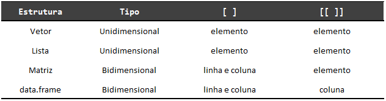 |
Table: (\#tab:label3) Resumo das dimensões disponíveis em cada estrutura


|  <!-- -->   |
| :------------ |
| 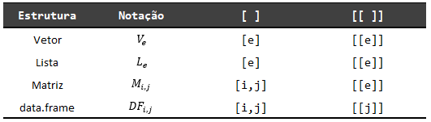 |
Table: (\#tab:label4) Notação matemática das dimensões disponíveis em cada estrutura


Nós também podemos ver essas diferenças entre as dimensões disponíveis em cada estrutura e para cada função de *subsetting*, sob uma perspectiva mais matemática, ao formar uma notação matemática de cada estrutura, incluindo subscritos que representem as suas respectivas dimensões. Essa visão está exposta na tabela 2.2. Por exemplo, pegando um `data.frame` chamado $DF$, com $i$ linhas e $j$ colunas ($DF_{i,j}$), temos que o comando `DF[2,4]` busca extrair o valor (ou valores) localizados na 2° linha da 4° coluna da tabela. Por outro lado, considerando-se uma lista chamada $L$, contendo $e$ elementos ($L_e$), o comando `L[[4]]`, traz como resultado, o 4° elemento dessa lista.


### Tipos de índices

Os índices que você fornece às funções `[` e `[[`, podem ser de três tipos: 1) índices de texto - `character`; 2) índices numéricos - `integer`; 3) índices lógicos - `logical`. Logo abaixo, temos um exemplo do uso de índices numéricos sobre um vetor qualquer. Lembre-se que no caso de vetores, nós podemos utilizar um único índice para extrairmos um único valor do objeto em questão, e nós utilizamos dois ou mais índices, para extrairmos um conjunto de valores deste mesmo vetor.

```{r}
vec <- c(2.2, 1.3, 4.5, 3.7, 5.2)

vec[4]

vec[1:4]

vec[c(3,5,1)]
```

Para utilizar um índice de texto (`character`), o objeto sobre o qual você está trabalhando, deve ser uma estrutura nomeada. Todas as estruturas (vetor, lista, matriz e `data.frame`) permitem o uso de nomes, que você pode acessar e definir através de funções como `colnames()`, `row.names()` e `names()`. Sendo que algumas estruturas, mais especificamente os `data.frame`'s, vão sempre nomear automaticamente os seus elementos. Ou seja, você sempre poderá utilizar um índice de texto em um `data.frame`, para selecionar alguma de suas colunas. Pois mesmo que você se esqueça de nomear alguma coluna, ao criar o seu `data.frame`, a função que cria essa estrutura irá automaticamente criar um nome qualquer para cada coluna não nomeada.


```{r}
df <- data.frame(
  id = LETTERS[1:10],
  nome = "Ana",
  valor = rnorm(10),
  "Belo Horizonte"
)

df

colnames(df)[4] <- "cidade"

df[["cidade"]]

df[c("id", "valor")]

df[["valor"]]

df[["nome"]]
```


Em outras estruturas como um vetor, nomes não são atribuídos automaticamente a cada um de seus elementos, e por isso, você deve nomear os elementos deste vetor, para que você seja capaz de utilizar um índice de texto nele. Para isso, basta igualar esses elementos a um valor em texto (valor entre aspas) que representa esse nome, como no exemplo abaixo:

```{r}
vec <- c("a" = 1, "b" = 2, "c" = 3, "d" = 4)

vec["c"]

vec[c("a", "c", "b")]

vec[["b"]]
```


Por último, os índices lógicos (`TRUE` ou `FALSE`) são extremamente úteis em diversas aplicações, especialmente quando desejamos realizar um *subsetting* mais "complexo". Porém, pelo fato de que a função `[[` nos permite extrair apenas uma única parte de um objeto, os índices lógicos são de certa forma inúteis com essa função. Portanto, sempre que utilizar índices do tipo lógico para selecionar os seus dados, você muito provavelmente quer utilizá-los com a função `[`. Por padrão, as funções `[` e `[[`, vão extrair todas as partes de um objeto, que possuírem um valor `TRUE` correspondente.

Portanto, no exemplo abaixo, caso eu utilize o vetor lógico `vlog`, para selecionar valores do vetor `vec`, a função `[` irá selecionar o 2°, 3° e 5° valor do vetor `vec`. Pois são essas as posições no vetor `vlog` que contém `TRUE`'s. Porém, a principal forma de gerarmos esses vetores lógicos a serem utilizados na função `[`, é através de testes lógicos. Por exemplo, podemos testar quais valores do vetor `vec`, são maiores do que 3, através do operador lógico `>` (maior que).

```{r}
vec <- c(2.2, 1.5, 3.4, 6.7, 8.9)

vlog <- c(FALSE, TRUE, TRUE, FALSE, TRUE)

vec[vlog]

vec[vec > 3]
```

O R possui vários operadores lógicos diferentes, e o operador `>` é apenas um deles. Um outro operador muito conhecido, é o de negação `"!"`. Este operador é utilizado, quando você deseja inverter um teste lógico, ou de certa forma, inverter o comportamento da função `[` quando fornecemos índices lógicos. O que o operador `!` faz na verdade, é inverter os valores de um vetor lógico. Logo, se eu aplicar este operador ao vetor `vlog`, esse será o resultado:

```{r}
!vlog
```


Portanto, os valores que antes eram `TRUE`, passam a ser `FALSE`, e vice-versa. Por isso, ao utilizarmos o operador `!` sobre um teste lógico qualquer, nós invertemos o teste em questão. Pois o operador `!` inverte os valores do vetor lógico resultante desse teste. Com isso, se eu utilizar esse operador sobre o teste anterior, onde testamos quais valores do vetor `vec` são maiores do que 3, nós estaremos efetivamente testando a hipótese contrária, de que esses valores são menores ou iguais a 3. Vale ressaltar, que esse operador deve ser posicionado antes do objeto que você deseja inverter, ou antes do teste lógico a ser realizado.

```{r}
vec[!vec > 3]
```

Um uso muito comum deste operador, é em conjunto com a função `is.na()`. Essa função, aplica um teste lógico sobre cada valor de um vetor, testando a hipótese de que esse valor se trata de um valor não-disponível (`NA`). Por isso, caso o valor em questão, seja de fato um valor não-disponível, a função `is.na()` irá retornar um `TRUE` correspondente, caso contrário, a função vai lhe retornar um `FALSE`. Logo, caso eu utilize a função `is.na()` dentro da função `[`, estaremos selecionando todos os valores não-disponíveis de um vetor. Porém, é muito mais comum que as pessoas queiram fazer justamente o contrário, que é eliminar esses valores não-disponíveis de seus dados. Por essa razão, é muito comum que se utilize o operador `!` em conjunto com a função `is.na()`, pois dessa forma, estaremos selecionando justamente os valores que se encaixam na hipótese contrária a testada por `is.na()`.

```{r}
vec <- c(2.2, 1.3, NA_real_, NA_real_, 2.5)

vec

vec[is.na(vec)]

vec[!is.na(vec)]
```


Vamos pensar no caso de um `data.frame`. Como definimos anteriormente, temos duas dimensões com as quais podemos trabalhar na função `[`, com este tipo de estrutura. Podemos por exemplo, utilizar o operador `!` e a função `is.na()` sobre a dimensão das linhas desse `data.frame`. Dessa forma, podemos eliminar todas as linhas dessa tabela, que possuam algum valor não-disponível em uma coluna. Veja o exemplo abaixo, em que uma tabela chamada `df`, contém três valores não-disponíveis na coluna `valor`.

```{r}
df <- data.frame(
  id = LETTERS[1:8],
  valor = c(1.2, 2.5, NA_real_, 5.5, NA_real_, NA_real_, 3.5, 1.3),
  nome = sample(c("Ana", "Luiza", "João"), size = 8, replace = TRUE)
)

df

nao_e_NA <- !(is.na(df$valor))

df[nao_e_NA, ]
```


### O operador `$` e a estrutura do resultado

Você provavelmente se lembra do operador `$`, que se trata de um atalho à função `[[`. Porém, você talvez tenha percebido também, que utilizamos o operador `$` apenas em estruturas nomeadas. Logo, apesar de o operador `$` ser um "irmão" da função `[[`, ele não herda todas as características dessa função. Por exemplo, nós não podemos utilizar índices numéricos ou lógicos com este operador, para selecionarmos alguma parte de um objeto. Isto significa, que o operador `$` se trata de uma versão ainda mais restrita de *subsetting*, em relação à função `[[`. As únicas estruturas nomeadas com as quais este operador funciona, são listas e `data.frame`'s. Em outras palavras, mesmo que você nomeie os elementos de um vetor atômico, você não poderá utilizar o operador `$` para selecionar um desses elementos.


```{r, eval = F}
vec <- c("a" = 2.5, "b" = 4.3, "c" = 1.2)

vec$a
```
```{r, eval = F, highlight=F}
Error in vec$a : $ operator is invalid for atomic vectors
```


Dentre as características da função `[[` herdadas pelo operador `$`, está o fato de que este operador pode trabalhar apenas com uma dimensão de um objeto. Em listas, podemos utilizar o operador `$` para selecionarmos algum dos elementos nomeados dessa lista. Já em `data.frame`'s, o operador `$` pode ser utilizado para selecionarmos uma das colunas desse `data.frame`^[Lembre-se que no fundo, `data.frame`'s são listas, com a propriedade de que todos os elementos dessa lista, devem possuir o mesmo número de linhas. Portanto, se cada coluna desse `data.frame` representa um elemento da lista que forma esse `data.frame`, ao utilizarmos o operador `$`, também estaríamos selecionando um "elemento", que se traduz em uma coluna do `data.frame`.]. 


Um outro ponto a ser discutido, é que tanto o operador `$`, quanto a função `[[`, geram um resultado em uma estrutura diferente da estrutura do objeto original. Ou seja, quando realizamos um *subsetting* por meio desses operadores, o resultado geralmente possui uma estrutura com menos componentes do que a estrutura do objeto original, de onde estamos retirando esta parte. Dito de outra forma, se utilizarmos o operador `$`, ou a função `[[` para selecionarmos a coluna `valor` do `data.frame df` abaixo, o resultado de ambas as funções, serão um vetor atômico contendo os valores dessa coluna, e não um `data.frame` contendo apenas a coluna `valor`. 

Logo, o uso da função `[[` (ou do operador `$`) sobre `data.frame`'s, vão lhe trazer a coluna (ou o elemento) em si do `data.frame`, e não um novo `data.frame` contendo essa coluna. Podemos confirmar isso, com o uso da função `str()`, que nos traz um resumo da estrutura de um objeto. Perceba nos exemplos abaixo, que em ambos os casos, o resultado da função `str()` está nos dizendo que o objeto resultante do uso de `$` ou de `[[`, se trata de um vetor atômico contendo dados do tipo numérico (`num`).


```{r}
df <- data.frame(
  id = LETTERS[1:10],
  valor = rnorm(10),
  nome = sample(c("Ana", "Luiza", "João"), size = 10, replace = TRUE)
)

str(df$valor)

str(df[["valor"]])
```


Essa característica é definida em detalhes no capítulo 4 de @wickham2015_advanced. Sendo exatamente esta característica, que eu estava querendo destacar na figura 2.7, quando estávamos descrevendo as listas. Se você utilizar a função `[` para selecionar um elemento de uma lista, o resultado será uma nova lista contendo esse elemento. Mas se você utilizar a função `[[` para fazer este trabalho, o resultado será apenas o elemento em si. 


Você pode entender essa característica como uma "simplificação do resultado", como se as funções `[[` e `$` gerassem um resultado em uma estrutura mais simples do que a do objeto original. Porém, eu creio que essa é uma forma equivocada de se enxergar esse sistema, pois estruturas não são usualmente comparadas em níveis de complexidade, mas sim por suas propriedades e características. 

Por isso, uma forma mais útil e fiel de se enxergar essa característica, é através da representação apresentada pela figura 2.7, onde através da função `[[`, podemos selecionar o elemento em si, e não uma nova estrutura contendo este elemento. Além disso, uma outra forma útil de enxergarmos essa característica no resultado das funções `[[` e `$`, é como uma forma de eliminarmos componentes da estrutura do objeto original. Em outras palavras, podemos enxergar o operador `$` ou a função `[[`, como uma forma de gerarmos um resultado com menos componentes do que a estrutura do objeto original.

Por exemplo, se temos um `data.frame` chamado `df`, onde temos duas colunas simples (que são vetores atômicos), e em seguida, adicionamos duas novas colunas, uma contendo uma lista, e outra contendo um outro `data.frame` de duas colunas (`y` e `z`), nós temos uma estrutura razoavelmente complexa. Se utilizarmos a função `str()`, para nos fornecer um resumo da estrutura de `df`, vemos que esse objeto tem pelo menos três componentes: 1) os vetores representados pelas colunas `x` e `nome`; 2) os cinco elementos da lista alocada na coluna `lista`; 3) e as duas colunas contidas no `data.frame` da coluna `outro_df`.

```{r}
df <- data.frame(
  x = rnorm(5),
  nome = "Ana"
)

df$lista <- list(1, 2, 3, 4, 5)
df$outro_df <- data.frame(y = rnorm(5), z = rnorm(5))

str(df)
```


Caso eu utilize as funções `[[` e `$` para selecionarmos alguma das colunas de `df`, podemos aplicar novamente a função `str()` sobre o resultado, para compreendermos sua estrutura. Veja pelo exemplo abaixo, que o resultado da função `str()` nos descreve uma estrutura com menos componentes do que a estrutura original. Com isso, eu quero destacar que a estrutura desse resultado não necessariamente será menos "complexa" do que a original, mas sim que essa estrutura terá menos componentes. Portanto, pelo menos um dos componentes da estrutura original, será eliminado com o uso de `[[` ou de `$`.


```{r}
str(df[["lista"]])

str(df[["outro_df"]])

str(df$outro_df)
```


## Valores especiais do R

Na linguagem R, possuímos alguns valores especiais, que não apenas são tratados de maneira diferente em relação a outros valores, mas que também efetivamente alteram o comportamento de algumas operações importantes na linguagem. Por exemplo, se você tentar dividir qualquer número por zero no console, ao invés do R lhe retornar um erro, lhe indicando que essa divisão é indefinida, o console vai lhe retornar o valor `Inf`, que se refere a infinito (ou *infinite*). 

Por outro lado, de forma ainda mais estranha, se você tentar dividir zero por ele mesmo, o console vai lhe retornar o valor `NaN`, que significa *"not a number"*, ou em outras palavras, que o valor resultante da divisão não é um número. 

Assim como várias outras linguagens de programação, o R também possui um valor "nulo", ou, em outras palavras, um valor que representa o "vazio" ou o "nada". Este valor é o `NULL`. Você encontra esse valor, sempre que a função ou expressão que você executou não possui um valor de retorno definido.

Esses são alguns exemplos de valores especiais que você pode adquirir. Porém, o valor especial mais comum, é o valor `NA`, que significa *not avaliable*, ou "não-disponível". Este valor geralmente é resultado de uma dessas duas situações: 1) ao importar a sua base de dados para o R, a linguagem vai preencher automaticamente todas as células em sua base que estiverem vazias, com um valor `NA`; 2) quando você executa (ou causa de maneira indireta) um processo de coerção, no qual o R não consegue realizar. Ou seja, se o R não souber como converter um valor específico, para o tipo de dado ao qual você requisitou, ele vai lhe retornar um valor `NA` correspondente àquele valor.

Portanto, a primeira situação ocorre durante o processo de importação de dados, em todas as ocasiões em que você possuir alguma observação vazia na base de dados que você está importando. Logo, se em uma planilha do Excel, por exemplo, você possuir alguma célula vazia em sua tabela, ao importar essa planilha para o R, essas células vazias serão preenchidas com valores `NA` no R. Lembre-se que um valor `NA` indica uma observação não-disponível, o que significa que o valor correspondente aquela observação não pôde ser observado, ou não pôde ser registrado no momento de coleta dos dados.

Já a segunda situação, ocorre sempre quando o R não sabe como realizar o processo de coerção, pelo qual requisitamos, de uma forma lógica. Por exemplo, isso ocorre ao tentarmos converter valores de texto para números com `as.double()`. Pois o R não sabe como, ou não sabe qual a maneira mais adequada de se converter esses valores em texto para números. Por isso, a linguagem vai lhe retornar como resultado, valores `NA`.

### Os impactos desses valores especiais {#sec:impactos_valores_especiais}

Por que estamos falando desses valores especiais? Porque eles alteram o comportamento de certas operações importantes do R e, com isso, podem deixar você desorientado! Por exemplo, se você tentar calcular a soma de uma coluna (de um `data.frame`) que contém um valor `NA`, o resultado dessa operação será um valor `NA`. Da mesma forma, se a coluna possuir um valor `NaN`, o resultado dessa soma será um valor `NaN`. Para que isso ocorra, o valor especial pode estar em qualquer linha que seja, basta que ele ocorra uma única vez, que a sua soma não vai funcionar.

```{r}
sum(c(1, 2, 3, NA, 4))

sum(c(1, 2, 3, NaN, 4))
```

Isso não significa que esses valores especiais serão uma dor de cabeça para você, pois cada um deles tem o seu propósito, e eles o cumprem muito bem. Mas é importante que você saiba do quão especiais eles são, e dos efeitos que eles causam em certas operações no R. Com isso, se em alguma situação uma função lhe retornar um valor `NA`, quando ela deveria lhe retornar algum valor definido, ou se essa função se comportar de maneira inesperada, você pode desconfiar que algum valor especial presente em seus dados, possa ser a fonte de sua surpresa.

Em geral, todas as funções que são afetadas por esses valores especiais, como as funções `sum()` e `mean()`, possuem um argumento `na.rm`, que define se a função deve ignorar esses valores especiais em seus cálculos. Portanto, caso uma coluna de seu `data.frame` possua esses valores especiais, e você precisa ignorá-los durante o cálculo de uma soma, lembre-se de configurar este argumento para verdadeiro (`TRUE`).

```{r}
sum(c(1, 2, 3, NA, 4), na.rm = TRUE)
```

Um outro tipo de operação importante que é afetada por esses valores especiais, são os testes lógicos. Como exemplo, vamos criar um teste lógico sobre os dados apresentados pela tabela `compras`. Nós temos nessa tabela, o nome da composição química dos principais remédios que estão em falta nos estoques de três grandes hospitais. Os três remédios presentes nessa tabela, são remédios bem comuns, como o valor `AA` que se refere à composição química da Aspirina (Ácido Acetilsalicílico).

```{r}
compras <- structure(list(ano = c(2019, 2019, 2019, 2019, 2019, 2019, 2019, 
2019, 2019, 2019), mes = c(2L, 4L, 5L, 6L, 8L, 8L, 10L, 10L, 
10L, 12L), hospital1 = c("AA", NA, "dexametasona", "AA", NA, 
"doxiciclina", NA, "AA", "doxiciclina", NA), hospital2 = c("AA", 
"doxiciclina", "dexametasona", "dexametasona", "AA", NA, "dexametasona", 
"AA", "dexametasona", "AA"), hospital3 = c("AA", "AA", "dexametasona", 
NA, "dexametasona", "doxiciclina", "dexametasona", NA, NA, "AA"
)), row.names = 1:10, class = "data.frame")


compras
```

Por exemplo, se nós quiséssemos identificar todas as linhas na tabela `compras`, em que a composição química da Aspirina (valor `AA`) aparece em pelo menos um dos hospitais (ou dito de outra forma, em pelo menos uma das colunas), poderíamos aplicar um teste lógico sobre a tabela `compras`. O teste lógico abaixo, serve para esse propósito, mas se olharmos para o resultado desse teste, podemos identificar que algo está errado.

```{r}
teste <- compras$hospital1 == "AA" |
  compras$hospital2 == "AA" |
  compras$hospital3 == "AA" 

teste
```

Perceba acima, que o teste lógico detectou com sucesso todas as linhas da tabela `compras`, que possuem um valor `AA` em pelo menos uma de suas colunas. Mais especificamente, as linhas de posição 1°, 2°, 4°, 5°, 8° e 10°. Porém, podemos também identificar, que para as linhas de posição 6°, 7° e 9° na tabela, o teste lógico `teste` nos retornou valores `NA`. Ou seja, ao invés do teste lógico nos retornar um valor `FALSE`, para as linhas que não possuem um valor `AA` ao longo de suas colunas, ele acaba nos retornando um valor `NA`, pelo simples fato de que temos um valor `NA` em pelo menos uma das colunas. Isso se torna um grande problema, a partir do momento em que desejamos filtrar a nossa tabela `compras`, ao fornecer o nosso vetor `teste`, à função de *subsetting*.

```{r}
compras[teste, ]
```


Portanto, o problema gerado pelos valores `NA` presentes no resultado do teste lógico, é que eles geram indiretamente um novo problema a ser resolvido. O objetivo principal está em identificar as linhas da tabela `compras`, que possuem um valor `AA`, em pelo menos uma de suas colunas, e filtrá-las da tabela. Porém, ao fornecermos esse vetor `teste` à função de *subsetting*, a função `[` acaba adicionando uma nova linha ao resultado, para cada valor `NA` presente no vetor `teste`. Logo, o resultado que era para ter 6 linhas, acaba tendo 9. Com isso, teríamos um novo trabalho de eliminar essas novas linhas de `NA`'s, para chegarmos às linhas que queremos filtrar da nossa tabela `compras`.


### Valores especiais também estão associados a algum tipo de dado

Vale destacar que, assim como qualquer outro valor no R, os valores especiais do R também estão associados a algum dos 5 tipos básicos de dados apresentados na seção [Tipos de dados](#sec:fundamentos_tipos_dados). Como exemplo, os valores `Inf`, `-Inf` e `NaN` são valores associados ao tipo `double`.

```{r}
typeof(Inf)
typeof(-Inf)
typeof(NaN)
```

Por outro lado, o valor `NA` é por padrão, um valor do tipo `logical`. Porém, diferentemente de `Inf`, `-Inf` e `NaN`, o valor `NA` possui diferentes "versões" para cada um dos 5 tipos de dados. Essas versões são `NA_character_`, `NA_real_`, `NA_complex_` e `NA_integer_`. Temos também outras "versões" referentes a tipos de dados mais complexos, como `NA_POSIXct_` e `NA_Date_` que se referem aos tipos `POSIXct` e `Date`, os quais vamos descrever no capítulo [Introdução à variáveis de tempo com `lubridate`](#sec:lubridate_var_tempo).

```{r}
typeof(NA)
typeof(NA_character_)
typeof(NA_real_)
```

Portanto, valores como `Inf`, `-Inf` e `NaN` estão presentes apenas no tipo `double`, enquanto o valor `NA` possui uma "versão" para cada tipo de dado no R. Tanto que, se tentarmos converter um valor como `NaN` para algum outro tipo, como o tipo `logical`, ele será automaticamente convertido para um valor `NA` do tipo `logical`, como demonstrado abaixo.

```{r}
as.logical(NaN)
```


### Como identificar valores especiais

Por serem valores especiais, o R nos oferece um conjunto de funções para cada um desses valores especiais, as quais estão listadas abaixo:

- `is.na()`.
- `is.finite()`.
- `is.infinite()`.
- `is.nan()`

A função `is.finite()` busca identificar se um valor numérico é finito, o que significa basicamente, um valor do tipo `numeric` diferente de `Inf`, `-Inf`, `NaN` e de `NA`. Perceba abaixo que, quando digo que a função `is.finite()` busca testar valores numéricos, estou querendo dizer que essa função é irrelevante para testar valores do tipo `character`, dado que ela nos retorna `FALSE` para qualquer valor textual. Repare também que essa função nos retorna `TRUE` para dados do tipo `logical`, dado que, no fundo, valores do tipo `logical` são armazenados através de 1's e 0's do tipo `integer`.

```{r}
library(purrr)
objs <- list(Inf, NaN, NA, "texto", 1.25, 1L, TRUE)
r <- map_lgl(objs, is.finite)
names(r) <- c(
  "Inf", "NaN", "NA",
  "character", "double",
  "integer", "logical"
)

print(r)
```

Ao descobrir o valor `NA`, você talvez tenha pensado que você seria capaz de identificar esse valor especial por um simples teste de igualdade. Entretanto, como descrevemos na seção [Os impactos desses valores especiais](#sec:impactos_valores_especiais), valores especiais alteram o comportamento de testes lógicos tradicionais, de modo que, um teste de igualdade como `x == NA` vai sempre resultar em um novo valor `NA`.

```{r}
x <- NA
x == NA
```
Portanto, a forma adequada de se testar se um determinado objeto no R contém um valor `NA`, é aplicar a função `is.na()` sobre o objeto em questão. Caso o seu objetivo seja justamente o contrário (isto é, testar se o objeto não contém um valor `NA`), você precisa apenas inverter o teste lógico ao adicionar o operador `!` sobre a função.

```{r}
is.na(x)
# Fazendo o teste inverso:
!is.na(x)
```


Já as funções `is.infinite()` e `is.nan()` funcionam exatamente da mesma forma, com a diferença que, essas funções testam se o objeto contém valores infinitos (`Inf` e `-Inf`) e valores `NaN`, respectivamente.

```{r}
is.infinite(Inf)
is.nan(NaN)
```


```{r, child = "Exercícios/exec_cap2.Rmd"}
```


<!--chapter:end:02-fundamentos.Rmd-->


# (PART) Importando, organizando e transformando dados {-}


# Introduzindo o universo do `tidyverse`

Os próximos capítulos buscam introduzir os diversos pacotes que compõe o *core* (ou o centro) do universo do `tidyverse`. Em suma, o `tidyverse` é uma coleção de pacotes que compartilham de uma mesma filosofia, gramática e estrutura de dados, de modo que, ao aprender um de seus pacotes você tem mais facilidade de aprender o próximo deles [@wickham2019]. Em outras palavras, cada um dos diferentes pacotes inclusos no `tidyverse` é focado em uma atividade específica (importação, transformação, formatação, visualização, etc.), porém, todos eles compartilham de uma mesma "base", de forma que, juntos, esses pacotes se complementam. 


Grande parte da filosofia do universo `tidyverse` é tornar a análise de dados no R mais rápida e prática. Nesse sentido, o `tidyverse` se assemelha e muito ao principal módulo da linguagem Python voltado para análise de dados, o `pandas`. Uma outra parte importante da filosofia do `tidyverse` está intrinsicamente conectada ao fluxo da ciência de dados introduzido por @wickham2017. Esse fluxo está reproduzido na figura 3.1. A ideia básica desse fluxo, é que todo projeto de análise de dados pode ser resumido a produção de um programa que executa 6 etapas específicas. Perceba que, eu listei (em azul escuro) os nomes dos pacotes geralmente empregados em cada uma dessas 6 etapas desse fluxo. Parte desses pacotes listados não serão descritos nessa obra e, portanto, estão apenas como referências no fluxo.


```{r, echo = FALSE, out.width="100%", fig.cap = "Fluxo de trabalho da ciência de dados"}
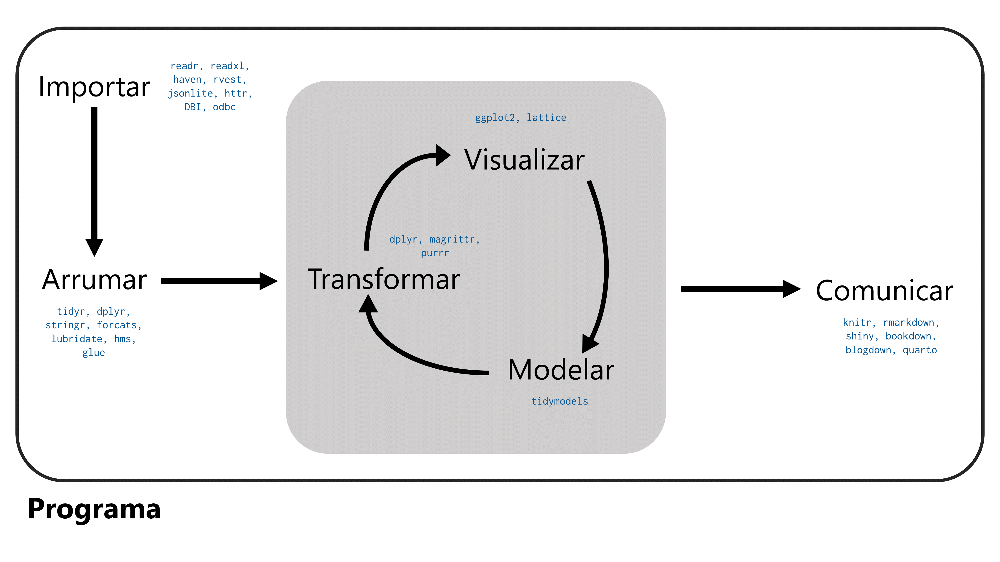
```


Portanto, seguindo o fluxo, para que você possa realizar qualquer análise sobre um conjunto qualquer de dados, você precisa primeiro, importar essa base de dados para dentro do R. Ou seja, você precisa tornar esse conjunto de dados acessível ao R. Por isso, o fluxo se inicia com a etapa "Importar". Em seguida, temos a etapa "Arrumar", onde você geralmente aplica diversas correções e preenchimentos sobre esse conjunto de dados. Pois são extremamente raros os casos em que uma base de dados chega a você, no exato formato que você precisa para a sua análise e, por isso, você quase sempre precisa gastar um certo tempo "arrumando" essa base.

Após arrumar sua base de dados, você em geral inicia um ciclo de análises, o qual envolve quase sempre 3 etapas: "Transformar", "Visualizar" e "Modelar": você adiciona novas colunas, filtra as observações de seu interesse, calcula certos indicadores e produz estatísticas sumárias desses dados. Depois, você visualiza esses resultados em algum gráfico, para que você possa visualizar e identificar padrões e características que os seus dados carregam. Mais tarde, ao conter uma compreensão melhor de seus dados, você começa a aplicar modelos que possam explicar esses padrões. Porém, talvez o primeiro modelo que você aplique se mostre ineficiente e, por essa razão, você acaba aplicando novas transformações e ajustes, calculando novos indicadores e filtrando novas observações com o objetivo de gerar melhores visualizações e modelos desses dados, reiniciando assim o ciclo.


Dentro desse ciclo, haverá um momento em que você vai chegar ao modelo desejado, e com ele, às conclusões de sua análise. Após ter essas conclusões em mãos, você provavelmente deseja publicar ou apresentar esses resultados para um público específico. A partir daí temos a etapa "Comunicar", que conciste em produzir artigos, apresentações e materiais pelos quais você é capaz de descrever e apresentar concisamente os seus resultados. Finalizando assim, o fluxo da ciência de dados.


## Os diferentes pacotes do `tidyverse`

A lista abaixo contém os pacotes que formam o *core* do `tidyverse`. Para cada pacote, temos uma breve descrição de sua especialidade. Não se preocupe em entender exatamente o que eles fazem, pois isso ficará mais claro a medida em que você caminhar por este livro.

1) `ggplot2`: visualização de dados, ou produção de gráficos.

2) `dplyr`: verbos para manipulação de tabelas.

3) `readr`: importação e exportação de dados em arquivos de texto.

4) `tibble`: `data.frame`'s modernos.

5) `stringr`: manipulação de texto (`character`).

6) `forcats`: trabalhando com fatores (`factor`).

7) `tidyr`: formatar e limpar os seus dados.

8) `purrr`: repita você mesmo com *functional programming*.


## Acessando o `tidyverse`

Portanto, o `tidyverse` nada mais é do que um pacote que estende as funcionalidades do R, ao trazer junto dele, um conjunto de importantes pacotes que vão facilitar e muito o seu trabalho. Para ter acesso a qualquer pacote no R, você precisa primeiro, se certificar que este pacote está instalado no seu computador. Para instalar um determinado pacote em sua máquina, você deve executar a função `install.packages()`, com o nome do pacote desejado entre aspas.

```{r, eval=FALSE}
install.packages("tidyverse")
```


Você realiza essa etapa apenas uma vez, ou então, sempre que você troca de computador, ou quando você atualiza a sua versão do R. Após instalar o pacote, você precisa apenas "chamar" por ele, através da função `library()`. Essa etapa deve ser feita sempre que você inicia o R, e deseja utilizar as funcionalidades deste pacote.

Ao executar o comando `library(tidyverse)`, uma caixa vai aparecer, contendo uma lista de todos os principais pacotes importados para a sua sessão. Os símbolos verdes de "v" no início do nome de cada pacote, nos indica que ele foi corretamente anexado à nossa sessão atual do R. Na parte inferior dessa caixa, temos uma lista de conflitos (*Conflicts*). Essa caixa está apenas listando quais funções do `tidyverse` possuem o mesmo nome de alguma função que já está presente em sua sessão atual do R. 

Ou seja, a parte inferior dessa caixa não é um erro, mas sim uma mensagem lhe indicando quais funções possuem um "irmão bastardo", que está presente em sua sessão. Quase sempre, as funções do pacote `tidyverse` vão estar a frente dessa função "bastarda", logo, quando você chamar por essa função, você vai estar utilizando a função do `tidyverse`, ao invés da função "bastarda". De qualquer forma, apenas entenda que, ao executar o comando `library()`, se aparecer uma caixa como a da imagem abaixo, você tem acesso aos pacotes do `tidyverse` em sua sessão do R e, que com isso, você está pronto para continuar.


```{r, echo = FALSE, fig.cap = "Chamando pelo pacote `tidyverse`", out.width = "90%"}
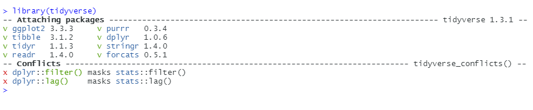
```


<!--chapter:end:03-tidyverse.Rmd-->


# Importando e exportando dados com `readr`, `readxl` e `haven`


## Introdução e pré-requisitos {#sec:importando_dados}

Em algum ponto, você vai trabalhar com os seus próprios dados no R e, para isso, você precisa obrigatoriamente importar esses dados para dentro do R. Neste capítulo, vamos aprender como utilizar as funções dos pacotes `readr`, `readxl` e `haven`, para ler e importar dados presentes em arquivos de texto (*plain text files* - `.txt` ou `.csv`), em planilhas do Excel (`.xlsx`) e em arquivos produzidos por programas estatísticos como o Stata (`.dta`), SPSS (`.sav`; `.zsav` e `.por`) e SAS (`.sas`).

Para que você tenha acesso as funções e possa acompanhar os exemplos desse capítulo você precisa chamar pelos pacotes `readr`, `readxl` e `haven`, através do comando `library()`. O pacote `readr` especificamente, está incluso dentro do `tidyverse` e, por isso, você também pode chamar por ele.

```{r, eval = FALSE}
library(tidyverse)

library(readr)
library(readxl)
library(haven)
```


## Fontes de dados

Os seus dados podem vir de vários tipos de fontes diferentes. Com isso, os métodos necessários para acessar e importar esses dados para o R, mudam a depender de qual seja esse tipo de fonte. Para citar alguns tipos bastante comuns de fontes de dados, temos:

1) Arquivos estáticos salvo no disco rígido de seu computador.

2) APIs (*Application Programming Interface*);

3) Bancos de dados (e.g. MySQL, Cassandra, MongoDB, PostgreSQL, etc.);

4) Arquivos fornecidos por um servidor (e.g. um página HTML);

Cada um desses tipos de fontes exigem técnicas ou métodos de importação diferentes entre si. Por exemplo, para importarmos dados de bancos de dados, nós precisamos criar uma conexão com esse banco, geralmente através de um driver ODBC (*Open DataBase Connectivity*). Como um outro exemplo, para coletarmos dados de uma API, nós geralmente precisamos construir e enviar uma requisição HTTP para essa API.

Eu não espero que você entenda o que esses termos significam (ODBC? HTTP? ...). O que eu realmente quero que você entenda aqui, é que você vai, em geral, utilizar pacotes e funções diferentes do R para importar os seus dados, a depender de onde, ou do tipo de fonte da qual você está extraindo esses dados.

Por exemplo, para importar os seus dados de um banco de dados através do R, você geralmente vai utilizar as funções dos pacotes `DBI` e `odbc`. Por outro lado, para importar dados de uma API você geralmente vai utilizar as funções do pacote `httr`.

Para mais, você vai perceber que os pacotes e funções utilizados dentro de um mesmo tipo de fonte, também podem variar. Por exemplo, ao longo desse capítulo, vamos mostrar métodos para se importar dados de arquivos estáticos salvos em seu computador. Porém, você vai perceber que os pacotes e funções utilizados são diferentes para cada tipo de arquivo estatíco. Ou seja, a função utilizada para importar uma planilha do Excel é diferente da função utilizada para importar um arquivos CSV, e assim por diante.

## Arquivos estáticos

Arquivos estatícos são um método prático de se transportar dados entre computadores. Uma situação comum que mostra essa praticidade é: "o seu colega de trabalho precisa dos dados daquela planilha que só você tem no seu computador. Para isso, você pode salvar essa planilha, em um arquivo `.xlsx`, e enviar um email para esse colega com esse arquivo `.xlsx` em anexo. A partir daí, o seu colega pode baixar esse arquivo para o computador dele".

Portanto, arquivos estatícos são os arquivos que você normalmente salva em seu computador. Todo arquivo estatíco possui uma extensão que define o tipo do arquivo estatíco que ele é. Por exemplo, planilhas do Excel são salvas em arquivos com extensão `.xlsx` ou `.xls`. Já arquivos CSV são arquivos com extensão `.csv`, e arquivos de texto padrão possuem extensão `.txt`.

Um detalhe característico desse tipo de fonte de dado, é que sempre que você for importar os dados de um arquivo estático para o R, você terá que coletar obrigatoriamente o endereço no disco rígido no qual esse arquivo está salvo atualmente. Vamos descrever em breve como coletar esses endereços. Mais especificamente na seção [Definindo endereços do disco rígido no R](#sec:enderecos_disco_rigido).


## Diretório de trabalho

A Linguagem R possui uma forte noção de diretórios de trabalho [@wickham2017, p 113]. O diretório de trabalho (ou *working directory*) é a pasta de seu computador onde o R está atualmente enraizado, ou, em outras palavras, é a pasta para a qual o R está olhando atualmente. 

Portanto, sempre que você estiver no R, ele vai estar necessariamente trabalhando com alguma pasta específica de seu computador. Será nessa pasta que o R vai inicialmente procurar pelos arquivos que você demanda, e também será nessa pasta que o R vai inicialmente salvar todos os arquivos que você pedir a ele que salve. 

No RStudio, você pode identificar o seu diretório de trabalho atual na parte esquerda e superior do console, logo abaixo do nome de sua guia (`Console`), como mostrado na figura 3.1. Repare abaixo, que no momento em que a foto presente na figura 3.1 foi tirada, eu estava trabalhando com uma pasta de meu computador chamada `Curso-R`, que por sua vez, se encontrava dentro de uma pasta chamada `Projeto curso R`.

```{r, echo = F, out.width="70%", fig.cap = "Diretório de trabalho - Console RStudio"}
knitr::include_graphics("Figuras/diretorio_console.png")
```

Por outro lado, você também pode descobrir o seu diretório de trabalho atual ao executar a função `getwd()` no console:

```{r, eval = F}
getwd()
```
```
## [1] "C:/Users/Pedro/Documents/Projeto curso R/Curso-R"
```

### Um exemplo

Vamos supor que o meu diretório de trabalho atual seja a pasta `Curso-R`, a qual está dentro da pasta `Projeto curso R`. Se eu pedir por algum arquivo chamado `frase.txt`, o R vai procurar por esse arquivo dentro dessa pasta `Curso-R`:

```{r, eval = F}
readLines("frase.txt")
```

```
## [1] "Aristóteles foi um filósofo da Grécia Antiga"
```

Isso tem duas implicações muito importantes:

1) o arquivo `frase.txt` deve estar dentro dessa pasta `Curso-R`, caso contrário o R não poderá encontrar esse arquivo;
2) temos uma maneira muito simples e poderosa de acessarmos qualquer arquivo que esteja presente na pasta `Curso-R`, pois precisamos apenas do nome desse arquivo, como no exemplo abaixo;

Um ponto muito importante é que a extensão do arquivo (que traduz o tipo do arquivo estático) também faz parte do nome do arquivo. No exemplo acima, o arquivo se chama `frase` e possui a extensão `.txt`, logo, o nome do arquivo a ser fornecido ao R é `frase.txt`.

## Definindo endereços do disco rígido no R {#sec:enderecos_disco_rigido}

Portanto, o mecanismo de diretórios de trabalho apenas limita o escopo de busca do R. Dito de outra forma, ele define onde o R irá procurar pelos seus arquivos e, onde esses arquivos serão salvos através do R.

Entretanto, isso não te impede de acessar arquivos que se encontram em outras áreas do seu computador. Porém, para acessar qualquer arquivo que esteja em uma pasta diferente do seu diretório de trabalho atual, você precisa obrigatoriamente fornecer o endereço até esse arquivo para o R.

### Cuidados ao definir endereços

Alguns cuidados no R são necessários ao definir um endereço até um arquivo. Primeiro, endereços de seu disco rígido devem sempre ser fornecidos como textos (*strings*). Por isso, lembre-se de contornar o seu endereço com aspas duplas ou simples no R. Segundo, o Windows utiliza por padrão a barra inclinada à esquerda (`\`) para separar cada diretório presente no caminho até um certo arquivo. Todavia, a barra inclinada à esquerda possui um significado especial para o R. 

Abordando especificamente o segundo ponto, você tem duas alternativas para contornar as particularidades das barras inclinadas utilizadas nos endereços de seus arquivos: 1) utilizar o estilo dos sistemas Mac e Linux, que utilizam a barra inclinada à direita (`/`) para separar os diretórios; 2) ou contornar o comportamento especial de uma barra inclinada à esquerda, com duas barras inclinadas à esquerda (`\\`). Ou seja, é como se essas duas barras `\\` significassem apenas uma barra `\` para o R. Eu particularmente prefiro utilizar o estilo dos sistemas Mac e Linux para resolver esse problema, pois ele incorre em um trabalho menor de digitação.

Por exemplo, eu tenho um arquivo chamado `livros.txt` localizado dentro da pasta `Lista de compras`, que por sua vez, se encontra dentro da minha pasta de `Documentos` do Windows. Segundo o padrão do Windows, o endereço até esse arquivo seria: `"C:\Users\Pedro\Documents\Lista de compras\livros.txt"`. Porém, levando-se em conta os pontos que acabamos de abordar, nós poderíamos fornecer escrever esse endereço dos dois modos expostos abaixo:


```{r, include = F}
livros <- read_csv("Dados/livros.txt")
```


```{r, eval = FALSE}
livros <- read_csv("C:\\Users\\Pedro\\Documents\\Lista de compras\\livros.txt")

livros <- read_csv("C:/Users/Pedro/Documents/Lista de compras/livros.txt")
```
```{r}
livros
```


### Endereços relativos e absolutos

Existem dois tipos de endereços do disco rígido que você pode fornecer ao R, endereços relativos e endereços absolutos. Endereços absolutos, são endereços que começam pelo disco rígido e vão até o nome do arquivo. Esse tipo de endereço é chamado de absoluto, porque ele aponta para um endereço único e absoluto de seu computador. Ou seja, não existe nenhum outro local de seu computador com este endereço.

Um exemplo de endereço absoluto é o endereço do arquivo `livros.txt` que fornecemos no exemplo da seção anterior (`C:/Users/Pedro/Documents/Lista de compras/livros.txt`). Este é um endereço absoluto pois ele começa pelo disco rígido `C:/` e vai até o nome do arquivo `livros.txt` específico que desejamos ler.


Para coletarmos o endereço absoluto de um arquivo no Windows, podemos clicar com o botão direito do mouse sobre o arquivo de interesse, e selecionar a opção `Propriedades`. Uma caixa vai abrir em sua tela, contendo diversas informações sobre o arquivo em questão. Logo a sua frente, temos a seção chamada `Local` na parte inicial dessa caixa, onde podemos encontrar o endereço absoluto até a pasta onde o seu arquivo de interesse está localizado.

De outro modo, endereços relativos são endereços "relativos" a um ponto inicial. Esse ponto inicial é sempre o seu diretório de trabalho atual. Ou seja, todo endereço relativo sempre começa pelo seu diretório de trabalho atual. O comando `readLines("frase.txt")` que mostramos em uma seção anterior é um exemplo de uso de um endereço relativo. Pois nós fornecemos diretamente o nome do arquivo, logo, o R pesquisa por esse arquivo no diretório de trabalho atual.

Tendo isso em mente, sempre que você for construir um endereço relativo, identifique primeiro qual o seu diretório de trabalho atual, e, a partir desse diretório, pense em qual é o caminho restante para chegar ao arquivo que você deseja importar.

Vamos utilizar como exemplo, o conjunto de arquivos mostrados na figura 3.2 que se encontram dentro de uma pasta chamada `Dados`. Perceba que essa pasta `Dados` está dentro de uma pasta `Curso-R`, que por sua vez está dentro de uma pasta `Projeto curso R`:

```{r, echo = F, fig.cap="Exemplo de arquivos", out.width="80%"}
knitr::include_graphics("Figuras/arquivos.png")
```

Vamos supor que o nosso diretório de trabalho atual fosse, por exemplo, a pasta `Projeto curso R`. Nesse caso, poderíamos fornecer um endereço relativo para qualquer um desses arquivos presentes na pasta `Dados`. Pois a pasta `Dados` se encontra dentro da pasta `Projeto curso R`. Em outras palavras, a pasta `Dados` é uma subpasta da pasta `Projeto curso R`.

Lembre-se, **um endereço relativo possui como ponto inicial, o seu diretório de trabalho atual**. Por isso, você sempre pode utilizar um endereço relativo para acessar qualquer arquivo que esteja dentro de seu diretório de trabalho, ou dentro de alguma de suas subpastas. No caso dos arquivos da pasta `Dados`, nós poderíamos fornecer o endereço `"Curso-R/Dados/"` para chegarmos a pasta `Dados`. Em seguida, precisaríamos apenas acrescentar o nome do arquivo de nosso desejo. Por exemplo, para ler o arquivo de nome `covid.csv`, o endereço resultante seria `"Curso-R/Dados/covid.csv"`.

### *Wildcards* em endereços do disco rígido

Ao fornecer endereços do disco rígido, você tem a opção de utilizar um *wildcard*. Temos dois *wildcards* comumente utilizados em endereços do disco rígido, que são o ponto final (`.`) e dois pontos finais (`..`). Ou seja, esses dois textos específicos possuem significados especiais em endereços do disco rígido, e podem ser utilizados em qualquer sistema operacional que você esteja (Mac, Windows, Linux, etc.).

O ponto final representa um apelido para o seu diretório de trabalho atual. Isso significa que, os endereços relativos `"./Curso-R/Dados/convid.csv"` e `"Curso-R/Dados/convid.csv"` são equivalentes. Já os dois pontos, se referem ao diretório anterior ao diretório atual. Por exemplo, o endereço `"Curso-R/.."` é equivalente ao endereço `"."`, isto é, ao diretório de trabalho atual. 

Ou seja, o endereço `"Curso-R/.."` se refere à pasta anterior à pasta `Curso-R`. Como um outro exemplo, o endereço `"src/writexml/../xml.cpp"` se refere ao arquivo `xml.cpp` que está dentro da pasta anterior à pasta `writexml`, que nesse exemplo é a pasta `src`. Portanto, este endereço é equivalente à `"src/xml.cpp"`. 

Vale destacar que você pode empilhar um *wildcard* múltiplas vezes. Dessa forma, você consegue "subir" vários *steps* na árvore genealógica de pastas de seu computador, ou, em outras palavras, você consegue "andar várias pastas para trás". Por exemplo, o endereço `"../../../planilha_importante.xlsx"` se refere à um arquivo chamado `planilha_importante.xlsx` que está a três pastas anteriores ao seu diretório de trabalho atual.


### Qual tipo de endereço utilizar?

Segundo @wickham2017, é recomendável que você evite endereços absolutos, especialmente se você trabalha em conjunto com outras pessoas em um mesmo projeto. Pois é muito provável que os computadores de seus parceiros de trabalho não possuem exatamente a mesma estrutura de diretórios que o seu computador. Por isso, o ideal é que você sempre organize todos os arquivos referentes a um certo projeto ou a uma certa análise, dentro de uma pasta específica de seu computador. Dessa forma, você pode tornar essa pasta específica o seu diretório de trabalho no R, e a partir daí, fornecer endereços relativos até cada arquivo. 


## Plataforma de Projetos do RStudio

No R, você pode configurar o seu diretório de trabalho atual, através da função `setwd()`. Basta fornecer o endereço absoluto até a pasta com a qual você deseja trabalhar. Veja o exemplo abaixo, em que eu escolho a pasta de `Documentos` do Windows como o meu diretório de trabalho:

```{r, eval = F}
setwd("C:/Users/Pedro/Documents")
```

Porém, esse não é um método recomendado de se configurar o seu diretório de trabalho, especialmente porque nós precisamos realizar essa configuração toda vez em que acessamos o R, sendo algo contraproducente. Por isso, @wickham2017 caracterizam a plataforma de Projetos do RStudio, como uma forma mais adequada e eficiente de realizarmos essa configuração.

```{r, echo = F, out.width="75%", fig.cap="Plataforma de Projetos do RStudio - Parte 1"}
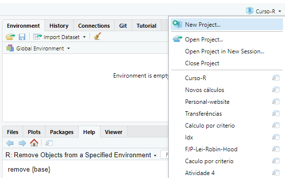
```

Ao criar um projeto no RStudio, você está apenas criando um arquivo com o nome desse projeto e que possui uma extensão `.Rproj`. Esse arquivo `.Rproj` funciona como um link até a pasta onde você o guardou. Dessa forma, ao acessarmos esse projeto no RStudio, o seu console já vai estar trabalhando com a pasta onde o arquivo `.Rproj` foi salvo. Em termos técnicos, toda vez que você acessar esse projeto, o RStudio vai automaticamente configurar essa pasta como o seu diretório de trabalho atual do R.

Para criarmos um projeto no RStudio, você pode acessar um pequeno menu localizado na parte superior e direita de sua tela, mostrado na figura 3.3. Ao selecionar a opção `New Project...`, o seu RStudio vai abrir uma aba que está exposta na figura 3.4. Nessa aba, você vai selecionar como deseja criar o novo arquivo `.Rproj`. Caso você já tenha organizado todos os arquivos de seu projeto uma pasta específica, você pode selecionar a opção `Existing Directory` para salvar o arquivo `.Rproj` nessa pasta já existente. Por outro lado, caso você esteja iniciando a sua análise do zero, você pode selecionar a opção `New Directory` para criar um novo diretório em seu computador, onde você vai guardar todos os arquivos referentes ao seu projeto.

```{r, echo = F, out.width="70%", fig.cap = "Plataforma de Projetos do RStudio - Parte 2"}
knitr::include_graphics("Figuras/projetos_caixa.png")
```

Ao selecionar uma dessas opções, o RStudio também vai lhe questionar sobre o tipo desse projeto, ou dito de outra maneira, qual o tipo de produto que você busca gerar com esse projeto, através da aba mostrada na figura 3.5. Ou seja, se você está planejando construir um novo pacote para o R, é interessante que você selecione a segunda opção (`R Package`) dessa aba. Pois assim, o próprio RStudio vai automaticamente criar para você, os principais arquivos que um pacote do R precisa ter. Em geral, você vai selecionar a primeira opção (`New Project`) para criar um projeto padrão.

```{r, echo = F, out.width="70%", fig.cap = "Plataforma de Projetos do RStudio - Parte 3"}
knitr::include_graphics("Figuras/tipo_projeto_mod.png")
```

No exemplo apresentado pela figura 3.6, eu estou criando um projeto padrão chamado `projeto_mortalidade` na pasta `Desktop` (que corresponde a área de trabalho) de meu computador. Com isso, uma nova pasta chamada `projeto_mortalidade` será criada, e sempre que eu acessar novamente o projeto `projeto_mortalidade` no RStudio, através do pequeno menu mostrado na figura 3.3, o RStudio vai automaticamente configurar a pasta `projeto_mortalidade` como o diretório de trabalho atual do R.


```{r, echo = F, out.width="70%", fig.cap = "Plataforma de Projetos do RStudio - Parte 4"}
knitr::include_graphics("Figuras/diretorio_projeto.png")
```


## Importando arquivos de texto com `readr`

Arquivos de texto, também conhecidos como *plain text files*, ou *flat files*, estão entre os formatos de arquivo mais utilizados em todo o mundo para transportar e armazenar dados. Por isso é muito importante que você conheça esses arquivos e saiba reconhecê-los.

Um arquivo de texto, normalmente assume a extensão `.txt`, e contém apenas cadeias de textos ou cadeias de valores numéricos que são organizados em linhas. Apesar de simples, os dados armazenados podem ser organizados de diferentes formas em cada linha do arquivo. Por essa razão, um arquivo de texto pode assumir diferentes extensões que identificam o tipo de arquivo de texto ao qual ele pertence.

Em outras palavras, nós possuímos diferentes tipos de arquivos de texto, e a diferença básica entre eles, está na forma como os valores são organizados em cada linha do arquivo. Um dos tipos de arquivo de texto mais famosos é o arquivo CSV (*comma separated file*), que utiliza vírgulas (ou pontos e vírgulas como é o caso brasileiro) para separar os valores de diferentes colunas em cada linha do arquivo. Por isso, não basta que você identifique se o seu arquivo de interesse é um arquivo de texto, pois você também precisa identificar o **tipo** de arquivo de texto no qual ele se encaixa.

Para importarmos os dados presentes nesses arquivos, vamos utilizar as funções do pacote `readr`, que oferece um conjunto de funções especializadas em arquivos de texto. Logo abaixo, temos uma lista que associa os respectivos tipos de arquivos de texto a cada uma das funções desse pacote.

1) `read_delim()`: essa é uma função geral, que é capaz de ler qualquer tipo de arquivo de texto em que os valores estão delimitados por algum caractere especial.

2) `read_csv2()`: lê arquivos CSV (*comma separated file*) que seguem o padrão adotado por alguns países europeus. Isto é, arquivos `.txt` ou `.csv` onde os valores são separados por ponto e vírgula (;).

3) `read_csv()`: lê arquivos CSV (*comma separated file*) que seguem o padrão americano. Isto é, arquivos `.txt` ou `.csv` onde os valores são separados por vírgula (,).

4) `read_tsv()`: lê arquivos TSV (*tab separated values*). Arquivos `.txt` ou `.tsv` onde os valores são separados por tabulação (`\t`).

5) `read_fwf()`: lê arquivos FWF (*fixed width file*). Arquivos `.txt` ou `.fwf` onde cada coluna do arquivo possui uma largura fixa de valores.


Perceba que o nome de todas as funções acima segue o padrão `read_*()`, onde a palavra presente no ponto `*` corresponde a extensão que identifica o tipo de arquivo no qual a função é especializada. Nós sempre iniciamos qualquer uma das funções acima, pelo endereço até o arquivo que desejamos ler. Como exemplo inicial, eu possuo um arquivo CSV chamado `Censo_2010.csv`, que se encontra dentro da pasta `6 - Importacao`. 

```{r, include = FALSE}
library(readr)

Censo_2010 <- read_csv2("Dados/Censo_2010.csv")
```

```{r, eval = FALSE}
library(readr)

Censo_2010 <- read_csv2("Parte 1/6 - Importacao/Censo_2010.csv")
```

```
## ‐‐ Column specification ‐‐‐‐‐‐‐‐‐‐‐‐‐‐‐‐‐‐‐‐‐‐‐‐‐‐‐‐‐‐‐‐‐
## cols(
## `Região metropolitana` = col_character(),
## `População residente` = col_double(),
## `População em área urbana` = col_double(),
## `População em área não urbanizada` = col_double(),
## `População em área isolada` = col_double(),
## `Área rural` = col_double(),
## `Aglomerado urbano` = col_double(),
## Povoado = col_double(),
## Núcleo = col_double(),
## `Outros aglomerados` = col_double(),
## `Código unidade` = col_double()
## )

```

Perceba também no exemplo acima, que eu salvo o resultado da função `read_csv2()` em um objeto chamado `Censo_2010`. **Isso é muito importante!** Lembre-se sempre de salvar o resultado das funções `read_*()` em algum objeto. 

Pois a função `read_csv2()` busca apenas ler o arquivo `Censo_2010.csv` e encaixar o seu conteúdo em uma tabela (ou um `data.frame`) do R. Ou seja, em nenhum momento, a função `read_csv2()` se preocupa em salvar os dados que ela coletou do arquivo `Censo_2010.csv`, em algum lugar que podemos acessar futuramente. 

É por esse motivo, que eu salvo a tabela gerada pela função `read_csv2()` em um novo objeto do R chamado `Censo_2010`. Pois dessa forma, eu posso acessar novamente os dados que coletamos do arquivo `Censo_2010.csv`, através deste objeto `Censo_2010`.

```{r}
Censo_2010
```


Mesmo que o arquivo `Censo_2010.csv` seja claramente um arquivo CSV, nós precisamos identificar qual o padrão que ele está adotando. Nos EUA, um arquivo CSV utiliza vírgulas (`,`) para separar os valores de cada coluna. Porém, pelo fato de nós, brasileiros, usarmos a vírgula para delimitar casas decimais em números reais, nós empregamos o padrão de um arquivo CSV adotado por alguns países europeus, que utilizam o ponto e vírgula (`;`) como separador.

Logo abaixo, temos as linhas iniciais do arquivo `Censo_2010.csv` e, podemos rapidamente identificar que esse arquivo utiliza o padrão europeu, pois os valores estão separados por ponto e vírgula (`;`). Por essa razão que eu utilizo a função `read_csv2()`, e não a função `read_csv()` para ler o arquivo.

```
Manaus  AM;2106322;1972885;3011;;108160;;22266;;;30
Homens;1036676;964041;2018;;59024;;11593;;;30
Mulheres;1069646;1008844;993;;49136;;10673;;;30
Careiro da Várzea;23930;1000;;;21089;;1841;;;1301159
Homens;12688;481;;;11281;;926;;;1301159
Mulheres;11242;519;;;9808;;915;;;1301159
```


Apesar de ser esse o padrão adotado por nós brasileiros, você enfrentará ocasiões em que o seu arquivo de texto possui separadores diferentes do esperado. Por exemplo, talvez os seus dados sejam separados por cifrões (`$`).

```{r}
t <- "Ano$Código$Dia$Valor
2020$P.A22$01$4230.45
2020$B.34$02$1250.28
2020$S.T4$03$3510.90"

writeLines(t)
```

Em casos como esse, você será obrigado a definir explicitamente o separador utilizado no arquivo. Para isso, você pode utilizar a função `read_delim()`, que possui o argumento `delim`, onde podemos determinar o caractere que delimita as colunas no arquivo.

```{r}
read_delim(t, delim = "$")
```

Como um outro exemplo, arquivos TSV são simplificadamente um arquivo CSV que utiliza um caractere especial de tabulação como separador, representado pelos caracteres `\t`. Ou seja, nós podemos recriar a função `read_tsv()` através da função `read_delim()`, ao configurarmos o argumento `delim`, como no exemplo abaixo.

```{r}
t <- "Ano\tCódigo\tDia\tValor
2020\tP.A22\t01\t4.230,45
2020\tB.34\t02\t1.250,28
2020\tS.T4\t03\t3.510,90"

writeLines(t)

read_delim(t, delim = "\t")
```


### Definindo os tipos de dados em cada coluna

As funções `read_*()` vão sempre, por padrão, ler as 1000 primeiras linhas de seu arquivo, e com base nessas 1000 linhas, elas vão tentar adivinhar qual o tipo de dado contido em cada coluna. Após esse processo, em que a função `read_*()` escolhe um tipo de dado para cada coluna, a função lê as linhas restantes do arquivo, se baseando nesses tipos de dados identificados por ela.

Todas as funções `read_*()` vão sempre fornecer uma pequena descrição, contendo a especificação de cada coluna (`Column specification`). Essa descrição está nos informando justamente qual foi o "chute" da função, ou qual o tipo de dado que a função utilizou para ler os dados de cada coluna. 

Veja no exemplo abaixo, que a função `read_csv()` interpretou que as colunas `Título` e `Autor` continham dados em texto e, por isso, utilizou colunas do tipo `character` (`col_character()`) para ler e armazenar esses dados. Por outro lado, a função percebeu que a coluna `Preço` continha dados numéricos e, por essa razão, preferiu utilizar uma coluna do tipo `double` (`col_double()`) para alocar esses dados na tabela.

```{r, eval = FALSE}
livros <- read_csv("C:/Users/Pedro/Documents/Lista de compras/livros.txt")
```
```
-- Column specification --------------------------------
cols(
  Título = col_character(),
  Autor = col_character(),
  Preço = col_double()
)
```

Isso é uma característica importante e útil das funções `read_*()`, pois podemos contar com esse sistema para definir os tipos de cada coluna do arquivo. Porém, esse é um sistema que se torna cada vez mais frágil a medida em que o tamanho de nosso arquivo aumenta. Pois essas 1000 primeiras linhas começam a representar uma parte cada vez menor do arquivo e, portanto, as suas chances de demonstrarem fielmente os tipos de dados presentes em todo arquivo, ficam cada vez menores.

Por isso, é provável que em algum momento, você terá de contornar esse comportamento padrão, e definir explicitamente os tipos de dados que você deseja utilizar para ler cada coluna de seu arquivo. Este controle é feito por meio do argumento `col_types` de qualquer função `read_*()`. 

Para construirmos essa definição, nós utilizamos a função `cols()` e suas variantes `col_*()`. Dentro da função `cols()`, precisamos igualar o nome da coluna presente no arquivo de texto à função `col_*()` que corresponde ao tipo de dado que desejamos utilizar nessa coluna. 

No exemplo abaixo, ao igualar as colunas `year`, `month` e `day` à função `col_integer()`, eu estou definindo que essas colunas devem ser interpretadas como colunas do tipo `integer`. Ao mesmo tempo, ao igualar as colunas `carrier` e `tailnum` à função `col_character()`, eu estou requisitando que essas colunas sejam lidas como colunas do tipo `character`. 

Para mais, a função `cols()` nos oferece um atalho útil chamado `.default`. Mediante esse atalho, podemos nos referir a todas as colunas do arquivo de uma vez só. Por isso, no exemplo abaixo, ao igualar esse atalho à função `col_double()`, eu estou dizendo à função `cols()`, que qualquer outra coluna do arquivo que não tenha sido definida explicitamente na função `cols()`, deve ser interpretada como uma coluna do tipo `double`. Por este motivo, as colunas `dep_time` e `dep_delay` (e várias outras), que não foram configuradas explicitamente na função `cols()`, acabaram sendo interpretadas como colunas do tipo `double`.

```{r, include = FALSE}
tipos_col <- cols(
  .default = col_double(),
  year = col_integer(),
  month = col_integer(),
  day = col_integer(),
  carrier = col_character(),
  tailnum = col_character(),
  origin = col_character(),
  dest = col_character(),
  time_hour = col_datetime(format = "")
)

flights <- read_csv2(
  "Dados/flights.csv",
  col_types = tipos_col
)
```


```{r, eval = FALSE}
tipos_col <- cols(
  .default = col_double(),
  year = col_integer(),
  month = col_integer(),
  day = col_integer(),
  carrier = col_character(),
  tailnum = col_character(),
  origin = col_character(),
  dest = col_character(),
  time_hour = col_datetime(format = "")
)

flights <- read_csv2(
  "flights.csv",
  col_types = tipos_col
)
```
```{r}
flights
```


### Compreendendo o argumento `locale` {#sec:readr_locale}

O argumento `locale` está presente em todas as funções `read_*()`, e é responsável por definir as especificações do arquivo de texto que mudam de país para país. No Brasil, por exemplo, datas são definidas no formato "Dia/Mês/Ano", enquanto nos EUA, datas se encontram no formato "Ano-Mês-Dia". Além disso, no Brasil, utilizamos vírgulas para separar a parte decimal de um número, enquanto nos EUA, essa separação é definida por um ponto final. Uma diferença ainda mais importante, se encontra no sistema de *encoding* adotado, que varia de maneira muito violenta ao longo dos países. 

O R, é uma linguagem centrada nos padrões americanos, por isso, sempre que você estiver tentando ler algum arquivo de texto que não se encaixa de alguma forma neste padrão, você terá que ajustar o `locale` da função `read_*()` que você está utilizando. Algumas funções já preveem e adotam essas diferenças. Um exemplo disso, é a função `read_csv2()`, que é na verdade um atalho para o padrão de arquivo CSV adotado por nós brasileiros, e por alguns países europeus. 

Como exemplo inicial, vamos tentar ler o arquivo `pib_per_capita.csv`, que novamente se encontra dentro da pasta `6 - Importacao`. Dessa vez, vamos utilizar a função geral do pacote, a `read_delim()`. Lembre-se que nessa função, você deve sempre indicar qual o caractere separador do arquivo, através do argumento `delim`.

```{r, eval = FALSE}
pib <- read_delim("Parte 1/6 - Importacao/pib_per_capita.csv", delim = ";")
pib
```


```
## # A tibble: 853 x 7
##  IBGE2   IBGE `Munic\xedpio`        `Popula\xe7\xe3o`   Ano PIB
##  <dbl>  <dbl> <chr>                             <dbl> <dbl> <chr>
## 1   10 310010 "Abadia dos Dourados"              6972  2017 33.389.769,00
## 2   20 310020 "Abaet\xe9"                       23223  2017 96.201.158,00
## 3   30 310030 "Abre Campo"                      13465  2017 29.149.429,00
## 4   40 310040 "Acaiaca"                          3994  2017 2.521.892,00
## 5   50 310050 "A\xe7ucena"                       9575  2017 15.250.077,00
## 6   60 310060 "\xc1gua Boa"                     13600  2017 29.988.906,00
## 7   70 310070 "\xc1gua Comprida"                 2005  2017 74.771.408,00
## 8   80 310080 "Aguanil"                          4448  2017 15.444.038,00
## 9   90 310090 "\xc1guas Formosas"               19166  2017 11.236.696,00
## 10 100 310100 "\xc1guas Vermelhas"              13477  2017 48.088.397,00
## # ... with 843 more rows, and 1 more variable: PIB per capita <chr>
```


Algo deu errado durante a importação deste arquivo. Pois as colunas `PIB` e `PIB per capita` foram importadas como colunas de texto (`character`), sendo que elas são claramente colunas numéricas. Em momentos como esse, é interessante que você consulte as primeiras linhas do arquivo, para compreender melhor a sua estrutura e identificar o que deu errado. 

Por isso, temos logo abaixo, as três primeiras linhas do arquivo `pib_per_capita.csv`. Perceba que os dois últimos valores em cada linha, representam os dados das colunas `PIB` e `PIB per capita`. Ao olharmos, por exemplo, para o número 33.389.769,00 nós podemos identificar qual o problema que está ocorrendo em nossa importação. 

```
10;310010;Abadia dos Dourados;6972;2017;33.389.769,00;4.789,12
20;310020;Abaeté;23223;2017;96.201.158,00;4.142,49
30;310030;Abre Campo;13465;2017;29.149.429,00;2.164,83
```

O motivo para tal conflito, se encontra justamente no uso do ponto final como separador de milhares, e da vírgula para marcar a parte decimal dos números dispostos nas colunas `PIB` e `PIB_per_capita`. Ou seja, como não informamos nada sobre as particularidades do arquivo, a função `read_delim()` está imaginando que o arquivo `pib_per_capita.csv` se encontra no padrão americano. Por isso, para que esse problema seja corrigido, nós precisamos avisar a função `read_delim()`, sobre essas particularidades de nosso arquivo.

Para fornecer tais informações, utilizamos a função `locale()`, como no exemplo abaixo. No nosso caso, precisamos ajustar o caractere responsável por separar os milhares, e o caractere que separa a parte decimal dos nossos números, que correspondem aos argumentos `grouping_mark` e `decimal_mark` da função `locale()`, respectivamente. Perceba no exemplo abaixo, que após provermos essas informações à função `read_delim()` através da função `locale()`, as colunas `PIB` e `PIB per capita` foram corretamente interpretadas como colunas numéricas (`double`).


```{r, eval = FALSE}
pib <- read_delim(
  "Parte 1/6 - Importacao/pib_per_capita.csv",
  delim = ";",
  locale = locale(decimal_mark = ",", grouping_mark = ".")
)

pib
```

```
## # A tibble: 853 x 7
##  IBGE2   IBGE `Munic\xedpio`        `Popula\xe7\xe3o`   Ano      PIB
##  <dbl>  <dbl> <chr>                             <dbl> <dbl>    <dbl>
## 1   10 310010 "Abadia dos Dourados"              6972  2017 33389769
## 2   20 310020 "Abaet\xe9"                       23223  2017 96201158
## 3   30 310030 "Abre Campo"                      13465  2017 29149429
## 4   40 310040 "Acaiaca"                          3994  2017  2521892
## 5   50 310050 "A\xe7ucena"                       9575  2017 15250077
## 6   60 310060 "\xc1gua Boa"                     13600  2017 29988906
## 7   70 310070 "\xc1gua Comprida"                 2005  2017 74771408
## 8   80 310080 "Aguanil"                          4448  2017 15444038
## 9   90 310090 "\xc1guas Formosas"               19166  2017 11236696
## 10 100 310100 "\xc1guas Vermelhas"              13477  2017 48088397
## # ... with 843 more rows, and 1 more variable: PIB per capita <dbl>
```


Apesar de resolvermos o problema gerado anteriormente nas colunas `PIB` e `PIB per capita`, ainda há algo que precisamos corrigir nessa importação. O problema remanescente, se encontra em colunas textuais e no título de algumas colunas. Perceba que alguns desses textos (especialmente em letras acentuadas) estão esquisitos. Por exemplo, a coluna que deveria se chamar `Município` está denominada como `Munic\xedpio`.

Esse é um típico problema de *encoding*, onde a função `read_delim()` imagina que o arquivo `pib_per_capita.csv` se encontra em um sistema de *encoding* específico, quando na verdade, ele se encontra em um outro sistema. Ou seja, tudo o que precisamos fazer, é informar qual o sistema correto de leitura do arquivo à função `read_delim()`. Por padrão, todas as funções do pacote `readr` vão pressupor que os seus arquivos se encontram no sistema UTF-8 de *encoding*. Porém, a enorme maioria dos computadores brasileiros utilizam um outro sistema, chamado de ISO-8859-1, que também é conhecido pelo termo "Latin1". 

Nas funções do pacote `readr`, nós podemos definir o *encoding* de leitura do arquivo, através do argumento `encoding` presente na função `locale()`. Nesse argumento, você pode fornecer tanto o nome oficial do sistema (`ISO-8859-1`) quanto o seu apelido (`Latin1`). Repare no exemplo abaixo, que ao definirmos o *encoding* correto de leitura, os problemas em elementos textuais foram resolvidos. Para ter uma melhor compreensão desse problema, por favor, leia a seção [*Encoding* de caracteres](#sec:encoding).

```{r, include = FALSE}
pib <- read_delim(
  "Dados/pib_per_capita.csv",
  delim = ";",
  locale = locale(
      decimal_mark = ",",
      grouping_mark = ".",
      encoding = "Latin1"
    )
)
```
```{r, eval = FALSE}
pib <- read_delim(
  "Parte 1/6 - Importacao/pib_per_capita.csv",
  delim = ";",
  locale = locale(
    decimal_mark = ",",
    grouping_mark = ".",
    encoding = "Latin1"
  )
)
```
```{r}
pib
```


### Sobre o erro `nchar(x, "width") : invalid multibyte string`

O exemplo do arquivo `pib_per_capita.csv` da seção anterior, é bastante útil, pois o arquivo possui três características distintas que não se encaixam no padrão americano de um CSV: 1) o arquivo é delimitado por pontos e vírgulas (`;`); 2) o arquivo utiliza pontos para separar os milhares, e vírgulas para separar a parte decimal de números; 3) o arquivo utiliza o *encoding* `ISO-8859-1` ao invés do sistema `UTF-8`.

Porém, em versões mais recentes do R e do pacote `readr`, o *encoding* do arquivo passou a ser uma configuração ainda mais importante durante o processo de importação. Como destacamos anteriormente, todas as funções `read_*()` do pacote `readr`, vão sempre ler os seus arquivos com o pressuposto de que eles utilizam o sistema `UTF-8` de *encoding*. 

Em versões passadas, caso você tentasse ler um arquivo que estivesse em um *encoding* diferente do `UTF-8`, as funções `read_*()` leriam o arquivo normalmente. Devido à diferença entre o *encoding* do arquivo e o *encoding* utilizado pela função `read_*()`, certas palavras como `"Município"` seriam trocadas por `"Munic\xedpio"`. Ou seja, os comandos mostrados na seção anterior mostram como esse processo funcionava antigamente.

Contudo, em versões mais atuais do pacote `readr`, os comandos apresentados na seção anterior costumam resultar no erro `nchar(x, "width") : invalid multibyte string`. Tal erro, ocorre justamente pela diferença de *encodings*. Portanto, enquanto em versões mais antigas, as funções `read_*()` costumavam ser mais permissivas, hoje, nas versões mais atuais, essas funções costumam reclamar com maior facilidade caso o arquivo em questão não esteja utilizando o *encoding* `UTF-8`. 

Sendo assim, mesmo que os códigos apresentados na seção anterior sejam um retrato do passado, eles ainda assim são bastante úteis para demonstrar como certas configurações de seu arquivo podem afetar o seu processo de importação para dentro do R. 

De qualquer forma, caso você enfrente o erro `nchar(x, "width") : invalid multibyte string` ao utilizar uma das funções `read_*()`, tente definir o *encoding* correto do arquivo que você está tentando ler, com a função `locale()`. Por exemplo, o arquivo `pib_per_capita.csv` utiliza o sistema `ISO-8859-1`, logo, o comando para importar esse arquivo nos dias atuais seria:

```{r, eval = FALSE}
### Funciona em todas as versões:
pib <- read_delim(
  "Parte 1/6 - Importacao/pib_per_capita.csv",
  delim = ";",
  locale = locale(
    decimal_mark = ",",
    grouping_mark = ".",
    encoding = "ISO-8859-1"
  )
)
```


<!-- Isso também se estende aos exemplos que dei com o objeto `t`. Um desses exemplos está reproduzido abaixo. Perceba que nesses exemplos, eu sempre utilizo a função `iconv()`, para garantir que o texto escrito esteja no encoding `UTF-8`, antes de repassá-lo para a função `read_delim()`.  -->


<!-- ```{r} -->
<!-- t <- "Ano\tCódigo\tDia\tValor -->
<!-- 2020\tP.A22\t01\t4.230,45 -->
<!-- 2020\tB.34\t02\t1.250,28 -->
<!-- 2020\tS.T4\t03\t3.510,90" -->

<!-- writeLines(t) -->

<!-- read_delim(t, delim = "\t") -->
<!-- ``` -->


<!-- Caso eu não utilize essa função, o texto vai estar utilizando o *encoding* `ISO-8859-1` e, por isso, a função `read_delim()` vai levantar o erro de `invalid multibyte string`, como demonstrado abaixo: -->

<!-- ```{r, eval = FALSE} -->
<!-- t <- "Ano\tCódigo\tDia\tValor -->
<!-- 2020\tP.A22\t01\t4.230,45 -->
<!-- 2020\tB.34\t02\t1.250,28 -->
<!-- 2020\tS.T4\t03\t3.510,90" -->

<!-- read_delim(t, delim = "\t") -->
<!-- ``` -->

<!-- ``` -->
<!-- Rows: 3 Columns: 4 -->
<!-- Error in nchar(x, "width") : invalid multibyte string, element 1 -->
<!-- ``` -->

<!-- Por essa razão, aplico a função `iconv()` sobre o objeto `t` antes de entregá-lo para a função `read_delim()`. Uma outra forma de solucionarmos esse problema seria avisarmos sobre o *encoding* utilizado pelo arquivo, com a função `locale()`. -->

<!-- ```{r} -->
<!-- t <- "Ano\tCódigo\tDia\tValor -->
<!-- 2020\tP.A22\t01\t4.230,45 -->
<!-- 2020\tB.34\t02\t1.250,28 -->
<!-- 2020\tS.T4\t03\t3.510,90" -->

<!-- read_delim( -->
<!--   t, delim = "\t", -->
<!--   locale = locale(encoding = "ISO-8859-1") -->
<!-- ) -->
<!-- ``` -->


### Outras configurações envolvendo linhas e colunas

Nessa seção, vamos utilizar como exemplo base, o arquivo CSV que forma o objeto `t` abaixo. Perceba que esse arquivo utiliza pontos e vírgulas como separador, e que ele não possui cabeçalho aparente. Ou seja, aparentemente os nomes das colunas não estão definidos no arquivo.

```{r}
t <- "2020;P.A22;01;4230.45
2020;B.34;02;1250.28
2020;S.T4;03;3510.90
2020;B.35;04;1200.25
2020;F.J4;05;1542.20
2020;A.12;06;9854.09
2020;B.Q2;07;7654.10
2020;G.T4;08;4328.36
2020;E.7A;09;2310.25"

writeLines(t)
```

Por padrão, as funções `read_*()` utilizam a primeira linha do arquivo para construir o nome de cada coluna presente.

```{r}
read_delim(t, delim = ";")
```


Mas se você deseja evitar esse comportamento, você pode configurar o argumento `col_names` para `FALSE`. Dessa forma, a função `read_*()` vai gerar nomes genéricos para cada coluna, como no exemplo abaixo:

```{r}
read_delim(t, delim = ";", col_names = FALSE)
```

Uma outra alternativa é fornecer um vetor ao argumento `col_names`, contendo os nomes de cada coluna na ordem em que elas aparecem no arquivo, como no exemplo abaixo.

```{r}
col <- c("Ano", "Código", "Dia", "Valor")

read_delim(t, delim = ";", col_names = col)
```

Além disso, as funções `read_*()` nos permite determinar o número máximo de linhas que desejamos ler de um arquivo, através do argumento `n_max`. Logo, mesmo que um arquivo de texto qualquer possua 500 mil linhas, nós podemos ler apenas as 10 primeiras linhas desse arquivo, ao configurarmos esse argumento. No exemplo abaixo, eu estou lendo apenas as 5 primeiras linhas do arquivo `t`.

```{r}
read_delim(t, delim = ";", n_max = 5, col_names = col)
```

Para mais, também podemos indiretamente definir a linha pela qual a função deve iniciar a leitura, por meio do argumento `skip`. Nesse argumento, você vai determinar quantas linhas do início do arquivo devem ser desconsideradas pela função. Portanto, no exemplo abaixo, eu estou ignorando as 2 primeiras linhas do arquivo `t`.

```{r}
read_delim(t, delim = ";", skip = 2, col_names = col)
```


## Um estudo de caso: lendo os microdados da PNAD Contínua com `read_fwf()` {#sec:estudo_pnad_continua}

A PNAD Contínua é uma pesquisa amostral, e vem sendo realizada desde janeiro de 2012 pelo Instituto Brasileiro de Geografia e Estatística [@ibge_pnad]. Os principais indicadores periódicos do mercado de trabalho são extraídos dessa pesquisa, e por isso, ela representa uma das principais fontes de informação econômica e demográfica do país. Nessa seção, vamos utilizar as funções do pacote `readr` para importarmos os microdados da divulgação trimestral dessa pesquisa para o R.

A PNAD Contínua, é organizada em três pesquisas que possuem periodicidades diferentes, são elas: PNAD Contínua Anual, PNAD Contínua Mensal e PNAD Contínua Trimestral. Em outras palavras, ao longo do ano, existem três pesquisas da PNAD Contínua, sendo construídas ao mesmo tempo. Porém, essas três pesquisas são divulgadas em períodos diferentes do ano, empregam níveis de agregação diferentes, e buscam medir variáveis demográficas diferentes. Nessa seção, vamos focar nos microdados da divulgação trimestral da PNAD Contínua, sendo essa a principal parte da PNAD Contínua, e a mais utilizada. Você pode encontrar os microdados da PNAD Contínua Trimestral, na página oficial da pesquisa^[<https://www.ibge.gov.br/estatisticas/sociais/trabalho/9171-pesquisa-nacional-por-amostra-de-domicilios-continua-mensal.html?=&t=microdados>].


Para que você possa acompanhar os comandos mostrados nessa seção, lembre-se de chamar pelo pacote `readr`, ou pelo `tidyverse` (que contém o pacote `readr`), através do comando `library()`. 

```{r, include = F}
library(readr)
library(tidyverse)
```

```{r, eval = F}
library(readr)
library(tidyverse)
```


### Conhecendo a estrutura dos microdados

Antes de importarmos esses dados, precisamos conhecer a estrutura do arquivo que contém esses dados. Ou seja, precisamos saber qual a extensão desse arquivo, e de que maneira os dados estão organizados dentro desse arquivo. Como exemplo, eu fui até a página oficial da pesquisa^[<https://www.ibge.gov.br/estatisticas/sociais/trabalho/9171-pesquisa-nacional-por-amostra-de-domicilios-continua-mensal.html?=&t=microdados>], e baixei os microdados do primeiro trimestre de 2020. O arquivo veio compactado (`.zip`), e por isso, eu o descompactei para que tivéssemos acesso ao arquivo bruto que contém os microdados, mostrado na figura 3.7.

```{r, echo = FALSE, fig.cap = "Arquivo contendo os microdados da PNAD Contínua - 1° Trimestre de 2020", out.width="75%"}
knitr::include_graphics("Figuras/arquivos_PNAD.png")
```

Como podemos ver pela figura 3.7, o arquivo é um simples documento de texto (extensão `.txt`), e todas as funções de importação do pacote `readr` são capazes de ler este tipo de arquivo. Porém, ainda temos que identificar o tipo, ou a estrutura desse documento de texto. Em outras palavras, precisamos compreender como esses dados estão organizados dentro desse arquivo. Será que os valores de cada coluna são separados por vírgulas (`.csv`)? por ponto e vírgula (`.csv`)? por tabulação (`.tsv`)? Para descobrirmos, precisamos dar uma olhada no arquivo.

Porém, o tamanho do arquivo é considerável (aproximadamente 222 MB). Isso nos dá a entender que a base de dados contida nesse arquivo, é relativamente grande. Como nós queremos dar apenas uma olhada, talvez seja mais interessante lermos apenas as 5 primeiras linhas do arquivo. Lembre-se que as funções de importação do pacote `readr`, geralmente possuem um argumento `n_max`, onde podemos configurar o número máximo de linhas a serem lidas do arquivo. 

Portanto, ao aplicarmos a função `read_csv()` abaixo, podemos ver as cinco primeiras linhas do arquivo. A primeira coisa que podemos abstrair do resultado, é que o arquivo de texto parece uma muralha de números, e aparentemente não se encaixa em nenhuma das hipóteses anteriores.

```{r, eval=FALSE}
read_csv(
  "C:/Users/Pedro/Downloads/PNADC_012020/PNADC_012020.txt",
  n_max = 5
)
```

```
## # A tibble: 5 x 1
##   `202011111  11000001611100110107511000098.75663631000139.734222300005349~
##   <chr>                                              
## 1 202011111  11000001611100110107511000098.75663631000139.7342223000053491~
## 2 202011111  11000001611100110107511000098.75663631000139.7342223000053491~
## 3 202011111  11000001611100110107511000098.75663631000139.7342223000053491~
## 4 202011111  11000001611100110307511000098.75663631000139.7342223000053491~
## 5 202011111  11000001611100110307511000098.75663631000139.7342223000053491~
```


Esse é um exemplo de arquivo chamado de *fixed width file* (`.fwf`), ou "arquivo de largura fixa". Provavelmente, o principal motivo pelo qual o IBGE decidiu adotar esse formato de arquivo na divulgação de seus dados, está no fato de que arquivos desse tipo, são muito mais rápidos de se ler em programas, do que um arquivo CSV tradicional. 
Pois os valores de cada coluna em um arquivo *fixed width file*, se encontram sempre nos mesmos lugares ao longo de todo o arquivo. Em contrapartida, esse tipo de arquivo, torna a sua vida mais difícil, pois você precisa especificar a largura, ou o número de caracteres presentes em cada coluna, para a função que será responsável por ler esse arquivo. 

Ou seja, nesse tipo arquivo, não há qualquer tipo de valor ou especificação responsável por delimitar as colunas da base de dados. O arquivo simplesmente contém todos os valores, um do lado do outro. Será sua tarefa, dizer ao programa (no nosso caso, o R) quantos caracteres estão presentes em cada coluna, ou em outras palavras, definir em quais caracteres estão as "quebras" de colunas.

Isso significa que você irá precisar de um dicionário desses dados, contendo as especificações de cada coluna dessa base de dados. No caso da PNAD Contínua, são oferecidos: 1) o dicionário das variáveis (geralmente em uma planilha do Excel, com extensão `.xls`), que contém uma descrição completa de cada variável (ou coluna) presente na base; 2) e o arquivo de texto `input`, que contém as especificações para a importação da base.

Esses arquivos geralmente estão disponíveis através de um ZIP (`Dicionario_input.zip`) que fica na seção de "Documentação" na página oficial da pesquisa^[<https://www.ibge.gov.br/estatisticas/sociais/trabalho/9171-pesquisa-nacional-por-amostra-de-domicilios-continua-mensal.html?=&t=microdados>]. Logo abaixo, na figura 3.8, temos uma foto desses arquivos em meu computador.

```{r, echo = FALSE, fig.cap = "Arquivos input e dicionário da PNAD Contínua", out.width="75%"}
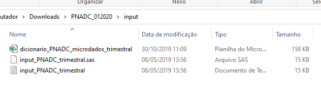
```


Entretanto, para surpresa de muitos, o arquivo de texto `input` (que geralmente assume o nome de `input_PNADC_trimestral.txt`), é na verdade, um *script* de importação utilizado pelo programa estatístico SAS^[https://www.sas.com/en_us/home.html]. O SAS é um programa estatístico pago, parecido com o seu concorrente SPSS^[https://www.ibm.com/products/spss-statistics]. Ambos os programas são mais populares no mercado americano.

Logo, se você estivesse trabalhando com o programa SAS, você já teria um *script* pronto para importar os microdados da PNAD Contínua. Como não é o nosso caso, temos que extrair, a partir desse *script* de SAS, as especificações de cada coluna.

### Extraindo especificações de um *script* SAS

Como veremos mais a frente, extrair as especificações desse *script* é uma tarefa simples, e existem hoje, diversas ferramentas que podemos utilizar para rapidamente extrairmos essas informações do *script*, sem a necessidade de um trabalho manual. Porém, antes de partirmos para a prática, precisamos primeiro, compreender a estrutura do *script* de SAS, presente nesse arquivo *input* (`input_PNADC_trimestral`). Na figura 3.9, temos um resumo que descreve essa estrutura. 

O *script*, ou mais especificamente, os comandos que definem a importação dos dados, se inicia pelo termo `input`, logo, estamos interessados em todas as configurações feitas após esse termo. As especificações de cada coluna, são compostas por 3 itens principais: 1) a posição inicial dessa coluna (ou a posição do caractere que inicia essa coluna); 2) o nome dessa coluna; e 3) a largura dessa coluna, ou em outras palavras, a quantidade de caracteres presentes em cada linha dessa coluna. Para o nosso objetivo, precisamos extrair os dois últimos componentes (o nome e a largura da coluna), além de definirmos se essa coluna é numérica ou textual, que é determinado pela presença ou não de um cifrão (`$`) ao lado da largura da coluna, no *script*.

```{r, echo = FALSE, fig.cap = "Resumo da estrutura de um script de importação do SAS", out.width="85%"}
knitr::include_graphics("Figuras/estrutura_script_sas.png")
```

A melhor forma de organizarmos essas especificações, é criarmos uma tabela, onde cada linha corresponde a uma coluna dos microdados, e cada coluna dessa tabela contém uma das especificações (nome da coluna, largura da coluna, é numérica ou textual?) de cada coluna dos microdados. Para construir essa tabela, eu costumo utilizar macros de um programa de edição de texto (como o Notepad++^[https://notepad-plus-plus.org/]) sobre o arquivo `input` (`input_PNADC_trimestral.txt`), de forma a eliminar os textos irrelevantes, e arrumar as especificações na estrutura de um arquivo CSV (`.csv`). Dessa forma, eu posso importar esse arquivo CSV resultante para o R, e adquirir a tabela que desejo. Como um guia, você pode ter acesso a esse arquivo CSV, através da cópia que deixei no \hyperref[sec:apendice_b]{Apêndice A}.

Portanto, após extrair as especificações de cada coluna do arquivo `input`, eu tenho como resultado, um arquivo CSV chamado `widths.txt`, que eu posso ler através da função `read_csv()`. Veja pelo resultado abaixo, que eu defini três colunas nesse arquivo CSV. A coluna `variavel` possui os nomes da colunas, na ordem em que elas aparecem no *script* do arquivo `input`, e portanto, nos microdados. A coluna `width` possui o número de caracteres presentes em cada uma dessas colunas. Já a coluna `char`, possui um valor lógico, indicando se os dados contidos nessa coluna, devem ser interpretados como texto (`TRUE`), ou como números (`FALSE`).

```{r, include = FALSE}
col_width <- read_csv(
  "Dados/widths.txt", 
  col_names = c("variavel", "width", "char")
)
```


```{r, eval = FALSE}
col_width <- read_csv(
  "C:/Users/Pedro/Downloads/PNADC_012020/widths.txt", 
  col_names = c("variavel", "width", "char")
)
```

```
## -- Column specification --------------------------------
## cols(
##   variavel = col_character(),
##   width = col_double(),
##   char = col_logical()
## )
```

```{r, eval = FALSE}
col_width
```

```
## # A tibble: 217 x 3
##    variavel  width char 
##    <chr>     <dbl> <lgl>
##  1 Ano           4 TRUE 
##  2 Trimestre     1 TRUE 
##  3 UF            2 TRUE 
##  4 Capital       2 TRUE 
##  5 RM_RIDE       2 TRUE 
##  6 UPA           9 TRUE 
##  7 Estrato       7 TRUE 
##  8 V1008         2 TRUE 
##  9 V1014         2 TRUE 
## 10 V1016         1 TRUE 
## # ... with 207 more rows
```


### Importando os microdados da PNAD Contínua

Agora que possuímos as especificações necessárias de cada coluna, podemos começar o processo de importação dos microdados da PNAD Contínua. Como esses microdados estão estruturados em um arquivo de texto do tipo *fixed width file* (`.fwf`), podemos utilizar a função `read_fwf()` para ler o arquivo. Pois como o próprio nome dessa função dá a entender, ela é especializada nesse tipo de arquivo. 

O primeiro argumento (`file`) dessa função, é o caminho até o arquivo a ser importado. Já o segundo argumento (`col_positions`), será o local onde vamos fornecer as especificações de cada coluna. Entretanto, nós precisamos utilizar uma função como a `fwf_widths()`, para definirmos essas especificações no argumento `col_positions`. Na função `fwf_widths()` temos apenas dois argumentos, que são `widths` e `col_names`. Basta fornecermos ao argumento `widths`, as larguras de cada coluna, e ao argumento `col_names`, os nomes de cada coluna, como no exemplo abaixo.

```{r, eval=FALSE}
pnad_continua <- read_fwf(
  "C:/Users/Pedro/Downloads/PNADC_012020/PNADC_012020.txt",
  col_positions = fwf_widths(col_width$width, col_names = col_width$variavel)
)
```

```
## -- Column specification -------------------------------------
## cols(
##   .default = col_double(),
##   RM_RIDE = col_logical(),
##   V1008 = col_character(),
##   V1014 = col_character(),
##   V1027 = col_character(),
##   V1028 = col_character(),
##   V1029 = col_character(),
##   V2001 = col_character(),
##   V2003 = col_character(),
##   V2005 = col_character(),
##   V2008 = col_character(),
##   V20081 = col_character(),
##   V2009 = col_character(),
##   `3003` = col_logical(),
##   V3003A = col_character(),
##   V3004 = col_logical(),
##   V3005 = col_logical(),
##   V3006 = col_character(),
##   V3009 = col_logical(),
##   V3009A = col_character(),
##   V3011 = col_logical()
## # ... with 87 more columns
## )
## i Use `spec()` for the full column specifications.
## Warning: 156486 parsing failures.
## row  col               expected actual   file
## 1670 V40431  1/0/T/F/TRUE/FALSE 2        'C:/Users/Pedro/Downloads/PNADC~'
## 2194 V4057   1/0/T/F/TRUE/FALSE 2        'C:/Users/Pedro/Downloads/PNADC_~'
## 2194 V405811 1/0/T/F/TRUE/FALSE 3        'C:/Users/Pedro/Downloads/PNADC~'
## 2194 V405812 1/0/T/F/TRUE/FALSE 00001200 'C:/Users/Pedro/Downloads/PNADC~'
## 2194 V405912 1/0/T/F/TRUE/FALSE 00000000 'C:/Users/Pedro/Downloads/PNADC~'
## .... ....... .................. ........ .........................
## See problems(...) for more details.
```


Como podemos ver acima, pela mensagem de *parsing failures*, obtivemos alguns problemas durante a importação. Isso ocorre, pois a função `read_fwf()` está tendo que adivinhar sozinha, quais são os tipos de dados contidos em cada coluna dos microdados. Lembre-se que por padrão, se não fornecemos uma descrição dos tipos de dados de cada coluna a qualquer função do pacote `readr`, essas funções vão automaticamente ler as 1000 primeiras linhas de cada coluna, e se basear nesses 1000 valores para determinar o tipo de dado incluso em cada coluna do arquivo.

Esse sistema automático, apesar de útil, se torna frágil a medida em que o tamanho da nossa base cresce. Pois essas 1000 linhas vão representar uma parte cada vez menor da base, e, portanto, podem não ser suficientes para determinar com precisão o tipo de dado contido em cada coluna. No nosso exemplo, a base da PNAD possui 487 mil linhas, logo, essas 1000 linhas representam apenas 0,2% da base. Se a função não está sendo capaz de adivinhar corretamente, os tipos de dados de cada coluna, nós precisamos dizer a ela exatamente quais são esses tipos. Para isso, vamos utilizar os dados contidos na coluna `char`, da nossa tabela `col_width`.

As funções de importação do pacote `readr`, possuem o argumento `col_types`, onde podemos definir os tipos de cada coluna. Essa definição pode ser fornecida, utilizando-se a função `cols()`. Porém, para o nosso caso, creio que será mais prático, utilizarmos um método alternativo que o argumento `col_types` disponibiliza. Esse método alternativo, consiste em fornecermos um vetor de letras, contendo a primeira letra de cada tipo. Essas letras devem estar na ordem em que as colunas aparecem em seus dados. Logo, se eu fornecer o vetor `"ccdlcdd"`, a função irá interpretar a primeira e a segunda coluna como dados do tipo `character`, enquanto a terceira e a quarta coluna serão interpretadas como dados dos tipos `double` e `logical`, respectivamente.

Primeiro, precisamos construir esse vetor de letras, que indicam o tipo de cada coluna. Com os dados da nossa tabela `col_width`, nós já sabemos que todo valor `TRUE` na coluna `char`, indica uma coluna de texto, e, portanto, essa coluna deve ser interpretada como uma coluna do tipo `character`. Já os valores `FALSE` indicam uma coluna numérica, e por isso, essa coluna deve ser interpretada como uma coluna do tipo `double`. Com isso, podemos utilizar a função `ifelse()`, para construírmos um vetor inicial de letras, baseado nos valores da coluna `char`. Em seguida, podemos juntar todas essas letras em um *string* só, com a função `paste()`.

```{r, include = FALSE}
tipos <- ifelse(col_width$char == TRUE, "c", "d")

tipos <- paste(tipos, collapse = "")

tipos
```

```{r, eval = FALSE}
tipos <- ifelse(col_width$char == TRUE, "c", "d")

tipos <- paste(tipos, collapse = "")

tipos
```

```
[1] "ccccccccccccdddcdccccccdcccccccccccccccccccccccccccccccccccccccccccc
cccccccccccccccccccccccccccdccdcccccdccdddcdddccccccccccccdccdcccccdccddd
ccccdccdccccccdcddcccccccccccccdddcccccdcccccccccccccccccccddcddccdddddcc"
```


Agora com o vetor `tipos`, podemos fornecê-lo ao argumento `col_types` e realizar novamente o processo de importação, com os tipos das colunas sendo corretamente interpretados. Porém, repare que mesmo definindo os tipos das colunas, obtivemos novamente erros durante o processo de importação. Dessa vez, foram mais de 2 milhões de erros. Isso não significa necessariamente que o nosso processo de importação esteja incorretamente especificado. Porém, nós deveríamos pelo menos compreender o porquê esses erros ocorrem.

```{r, eval = FALSE}
pnad_continua <- read_fwf(
  "C:/Users/Pedro/Downloads/PNADC_012020/PNADC_012020.txt",
  col_positions = fwf_widths(col_width$width, col_names = col_width$variavel), 
  col_types = tipos
)
```

```
## Warning: 2032039 parsing failures.
## row    col expected actual                                              file
##   1 VD4032 a double      . 'C:/Users/Pedro/Downloads/PNADC_012020/PNADC_01~'
##   1 VD4033 a double      . 'C:/Users/Pedro/Downloads/PNADC_012020/PNADC_01~'
##   1 VD4034 a double      . 'C:/Users/Pedro/Downloads/PNADC_012020/PNADC_01~'
##   2 VD4031 a double      . 'C:/Users/Pedro/Downloads/PNADC_012020/PNADC_01~'
##   2 VD4032 a double      . 'C:/Users/Pedro/Downloads/PNADC_012020/PNADC_01~'
## ... ...... ........ ...... ................................................
## See problems(...) for more details.
```


### Analisando erros de importação

Nós podemos obter através da função `problems()`, uma tabela contendo todos os erros que ocorreram durante esse processo de importação. Precisamos apenas fornecer a essa função, os comandos que geraram esses problemas, como no exemplo abaixo.

```{r, eval = FALSE}
problemas <- problems(
  read_fwf(
    "C:/Users/Pedro/Downloads/PNADC_012020/PNADC_012020.txt",
    col_positions = fwf_widths(col_width$width, col_names = col_width$variavel), 
    col_types = tipos
  )
)

problemas
```

```
## # A tibble: 2,032,039 x 5
##      row col    expected   actual file
##    <int> <chr>  <chr>      <chr>  <chr>        
##  1     1 VD4032 a double   .      'C:/Users/Pedro/Downloads/PNADC_012020/PNAD~
##  2     1 VD4033 a double   .      'C:/Users/Pedro/Downloads/PNADC_012020/PNAD~
##  3     1 VD4034 a double   .      'C:/Users/Pedro/Downloads/PNADC_012020/PNAD~
##  4     2 VD4031 a double   .      'C:/Users/Pedro/Downloads/PNADC_012020/PNAD~
##  5     2 VD4032 a double   .      'C:/Users/Pedro/Downloads/PNADC_012020/PNAD~
##  6     2 VD4033 a double   .      'C:/Users/Pedro/Downloads/PNADC_012020/PNAD~
##  7     2 VD4034 a double   .      'C:/Users/Pedro/Downloads/PNADC_012020/PNAD~
##  8     2 VD4035 a double   .      'C:/Users/Pedro/Downloads/PNADC_012020/PNAD~
##  9     3 VD4031 a double   .      'C:/Users/Pedro/Downloads/PNADC_012020/PNAD~
## 10     3 VD4032 a double   .      'C:/Users/Pedro/Downloads/PNADC_012020/PNAD~
## # ... with 2,032,029 more rows
```


Pelo que podemos ver da coluna `actual`, parece que os erros estão ocorrendo, pela presença de um ponto final ("."), nos locais em que deveriam estar números (`double`). Podemos utilizar a função `unique()` sobre a coluna `actual` para identificarmos se há algum outro problema que precisamos analisar. Pelo resultado abaixo, percebemos que todos os mais de 2 milhões de erros gerados, estão sendo causados por essa presença de pontos finais na base. Também podemos utilizar a função `unique()` sobre a coluna `col`, para descobrirmos em quais colunas esse erro ocorre. Vemos abaixo, que esses erros estão concentrados em cinco das últimas colunas de toda a base (a última coluna da base é VD4037).

```{r, eval = F}
unique(problemas$actual)
```

```
## [1] "."
```

```{r, eval = F}
unique(problemas$col)
```
```
## [1] "VD4032" "VD4033" "VD4034" "VD4031" "VD4035"
```


Seria uma boa ideia, olharmos mais de perto como essas colunas aparecem no arquivo de microdaddos. Para determinarmos a parte do arquivo que diz respeito a essas colunas, precisamos descobrir o intervalo de caracteres que cobrem essas colunas, através dos dados da tabela `col_width`. Para isso, vamos precisar descobrir o número total de caracteres em cada linha (ou em outras palavras, a largura total da base), ao somarmos a largura de todas as colunas na tabela `col_width`. Ao longo do caminho, teremos que subtrair uma faixa desse total, para descobrirmos o caractere que inicia o intervalo de colunas que estamos interessados.

```{r}
(total_caracteres <- sum(col_width$width))
```

Em seguida, podemos aplicar a função `tail()` sobre a tabela `col_width`, para extrairmos as últimas linhas dessa tabela, e verificarmos as especificações das colunas que cobrem essa faixa. Pois nós sabemos que as variáveis que geraram problemas na importação, estão entre as últimas colunas dos microdados, logo, as especificações dessas colunas vão se encontrar nas últimas linhas da tabela `col_width`. Vemos abaixo, que as duas últimas colunas da base (VD4036 e VD4037), das quais não estamos interessados, possuem juntas, 2 caracteres de largura. Portanto, o intervalo que cobre as colunas que geraram os problemas na importação (VD4031-VD4035), termina no 462° caractere, como vemos abaixo. Pelo resultado de `tail()`, vemos que as colunas das quais estamos interessados (VD4031-VD4035), somam 15 caracteres de largura. Tendo isso em mente, o intervalo que cobre essas colunas, se inicia no 448° caractere.

```{r}
tail(col_width, 7)

(fim_intervalo <- total_caracteres - 2)

(inicio_intervalo <- fim_intervalo - 15 + 1)
```

Portanto, nós temos agora a posição dos caracteres que iniciam e terminam o intervalo de caracteres que dizem respeito as colunas que estamos interessados. Porém, ainda precisamos calcular os caracteres de início e de fim de cada uma das cinco colunas (VD4031-VD4035), que cobrem esse intervalor. Para esse trabalho, podemos aplicar uma simples aritmética, como a aplicada pelo código abaixo.

```{r}
(inicio <- (0:4 * 3) + inicio_intervalo)

(fim <- (1:5 * 3) + inicio_intervalo - 1)
```


Agora que nós temos as posições dos caracteres que iniciam e que terminam cada uma das cinco colunas, podemos importar apenas essas cinco colunas ao R. Para isso, podemos usar novamente a função `read_fwf()`, aliada à função `fwf_positions()`. Ou seja, utilizamos anteriormente a função `fwf_widths()` para determinarmos as especificações de todas as colunas da base. Porém, como nós queremos importar apenas uma parte dessa base, vamos utilizar a função `fwf_positions()` para determinarmos as especificações dessas colunas desejadas.

Na função `fwf_positions()`, temos três argumentos principais: 1) `start`, um vetor contendo as posições dos caracteres que iniciam cada coluna; 2) `end`, um vetor contendo as posições dos caracteres que terminam cada coluna; 3) `col_names`, um vetor contendo os nomes dessas colunas selecionadas. Tendo esses argumentos em mente, podemos importar as cinco colunas da seguinte maneira:

```{r, eval = FALSE}
colunas <- c("VD4031","VD4032","VD4033","VD4034","VD4035")

conferir <- read_fwf(
  "C:/Users/Pedro/Downloads/PNADC_012020/PNADC_012020.txt",
  col_positions = fwf_positions(
    start = inicio,
    end = fim,
    col_names = colunas
  )
)
```
```
## -- Column specification ------------------------------------
## cols(
##   VD4031 = col_character(),
##   VD4032 = col_character(),
##   VD4033 = col_character(),
##   VD4034 = col_character(),
##   VD4035 = col_character()
## )
```

Logo abaixo, temos o resultado do intervalo que selecionamos do arquivo, em que podemos ver o grupo de pontos finais que estão causando o problema. Agora, temos que identificar o motivo desses pontos estarem aí. Se nós retornarmos às especificações dessas colunas apresentadas na tabela `col_width`, nós sabemos que essas colunas são colunas numéricas. Será que esses pontos estão aí, para marcar as casas decimais dos números dessa coluna?

Talvez não seja esse o caso. Pois se esses pontos estivessem de fato, marcando as casas decimais, porque eles não aparecem na primeira linha das colunas VD4031 e VD4035? Isto é, por que o valor 040 que aparece nessas colunas, não se apresenta como 0.40, ou 04.0, ou 40.0 na tabela `conferir`? Lembre-se que os valores da tabela `conferir`, são apresentados exatamente da forma como eles se apresentam no arquivo dos microdados, pois todas essas colunas estão sendo interpretadas como `character`. Ou seja, esses valores que eram meros textos no arquivo dos microdados, continuam sendo textos no R, de forma que não houve nenhuma conversão desses valores.

```{r, eval = FALSE}
conferir
```
```
## # A tibble: 487,937 x 5
##    VD4031 VD4032 VD4033 VD4034 VD4035
##    <chr>  <chr>  <chr>  <chr>  <chr> 
##  1 040    .      .      .      040   
##  2 .      .      .      .      .     
##  3 .      .      .      .      .     
##  4 .      .      .      .      .     
##  5 .      .      .      .      .     
##  6 040    .      .      .      040   
##  7 .      .      .      .      .     
##  8 .      .      .      .      .     
##  9 .      .      .      .      .     
## 10 040    .      .      .      040   
## # ... with 487,927 more rows
```

Pela visão que temos até o momento, parece que as colunas VD4032, VD4033 e VD4034, estão vazias, de forma que elas possuem apenas pontos finais em toda a sua extensão. Talvez seja o momento de verificarmos essa hipótese. Podemos fazer isso, novamente por meio da função `unique()`. Pelos resultados abaixo, as colunas VD4032, VD4033 e VD4034 estão de fato vazias. Com isso, temos a seguinte questão: por que uma coluna numérica está preenchida com pontos? Se esses pontos não estão marcando as casas decimais em cada linha, é mais provável que esses pontos estejam ali simplesmente para marcar um valor vazio, ou uma observação que não pôde ser mensurada.

```{r, eval = FALSE}
unique(conferir$VD4032)
```
```
## [1] "."
```
```{r, eval = FALSE}
unique(conferir$VD4033)
```
```
## [1] "."
```
```{r, eval = FALSE}
unique(conferir$VD4034)
```
```
## [1] "."
```


Em resumo, nós sabemos pelas especificações das colunas presentes no arquivo `input`, que as colunas VD4032, VD4033 e VD4034 devem ser interpretadas como colunas numéricas. Ao que tudo indica, esses pontos não possuem o propósito de delimitar as casas decimais. Seria apropriado encontrarmos alguma documentação que nos pudesse guiar sobre esses questionamentos. Porém, até onde pesquisei, não há qualquer menção a esses pontos ao longo da documentação do IBGE sobre esses microdados. Com as informações que possuímos, só podemos inferir que esses valores estão servindo para marcar valores não-disponíveis (em outras palavras, estão cumprindo o papel de um valor `NA`) nessas colunas. 

Tendo essas considerações em mente, todos esses pontos presentes nessas colunas, devido ao erro que eles incorrem durante o processo de importação, serão convertidos para valores `NA` ao importarmos a base, e, portanto, vão representar observações não-disponíveis na base. Ou seja, se a função `read_fwf()` não consegue interpretar corretamente um valor, ele acaba sendo convertido para um valor `NA`.

```{r, eval = FALSE}
pnad_continua <- read_fwf(
  "C:/Users/Pedro/Downloads/PNADC_012020/PNADC_012020.txt",
  col_positions = fwf_widths(col_width$width, col_names = col_width$variavel), 
  col_types = tipos
)
```


## Exportando os seus dados com o pacote `readr`

Mais do que importar os seus dados para dentro do R, haverá um momento em que você deseja exportar os seus resultados para fora do R, de forma que você possa enviá-los para os seus colegas de trabalho ou para utilizá-los em outros programas. Em um momento como esse, você deseja escrever um arquivo estático em seu computador, contendo esses resultados. O pacote `readr` oferece funções que permitem a escrita de um conjunto de arquivos de texto. Logo abaixo, temos uma lista relacionando os tipos de arquivos de texto às respectivas funções do pacote:

1) `write_csv2()`: constrói um arquivo CSV, segundo o padrão adotado por alguns países europeus; utilizando pontos e vírgulas (`;`) como separador.

2) `write_csv()`: constrói um arquivo CSV, segundo o padrão americano; utilizando vírgulas (`,`) como separador.

3) `write_tsv()`: constrói um arquivo TSV.

4) `write_delim()`: função geral onde você pode definir o caractere a ser utilizado como separador no arquivo de texto construído.


Um fator muito importante sobre o pacote `readr` em geral, é que todas as suas funções utilizam o *encoding* UTF-8 o tempo todo. Logo, ao utilizar essas funções para exportar os seus dados, lembre-se sempre que os arquivos construídos por essas funções vão estar utilizando o *encoding* UTF-8. Isso significa que ao utilizar esses arquivos em outros programas como o Excel, você precisa informar ao programa para utilizar o *encoding* UTF-8 ao ler o arquivo. 

Para além disso, você não terá nenhum outro problema com esses arquivos. Porém, caso você se sinta incomodado com esse comportamento, você pode utilizar as variantes dessas funções presentes nos pacotes básicos do R (`write.csv2()`, `write.csv()`, `write.table()`). Pois essas funções variantes vão escrever o arquivo definido, de acordo com o *encoding* padrão de seu sistema.

O primeiro argumento (`x`) dessas funções, se trata do nome do objeto em sua sessão que contém os dados que você deseja exportar. Já no segundo argumento (`file`) dessas funções, você deve definir o nome do novo arquivo estático que será construído. Por exemplo, se eu possuo uma tabela chamada, e desejo salvá-la em um arquivo chamado `transf.csv`, eu preciso construir os seguintes comandos:

```{r, eval = FALSE}
write_csv2(transf, file = "transf.csv")
```

Após executar os comandos acima, você irá encontrar na pasta que representa o seu diretório de trabalho atual no R, um novo arquivo chamado `transf.csv` que contém os seus dados. Vale destacar, que você pode salvar esse novo arquivo em diferentes áreas de seu computador. Basta que você forneça um endereço (absoluto ou relativo) até a pasta desejada, em conjunto com o nome do novo arquivo. Como exemplo, eu posso salvar a tabela `Censo_2010` dentro da minha área de trabalho da seguinte forma:

```{r, eval = F}
write_csv2(Censo_2010, file = "C:/Users/Pedro/Desktop/Censo_2010.csv")
```


## Importando planilhas do Excel com `readxl` {#sec:read_excel}

O Excel continua sendo um dos programas mais populares no mundo e, por essa razão, muitas pessoas ainda o utilizam para analisar dados e gerar gráficos. Tendo isso em vista, nessa seção, vamos aprender como podemos importar para o R, dados que se encontram em planilhas do Excel (`.xlsx`), através da função `read_excel()` que pertence ao pacote `readxl`.

Vale destacar que, nessa seção, vamos mostrar apenas como ler (ou importar) os dados armazenados em planilhas de Excel no R. Porém, em um capítulo posterior, mais especificamente na seção [Um estudo de caso: exportando múltiplas planilhas de Excel](#sec:loop_exportando_planilhas_excel), vamos mostrar quais são os pacotes e funções do R disponíveis hoje para escrever (ou exportar os seus dados para) uma planilha de Excel.

O principal argumento da função `read_excel()` corresponde novamente ao endereço até o arquivo que você deseja ler, ou apenas o seu nome caso esse arquivo se encontre em seu diretório de trabalho atual. 

```{r, include = FALSE}
library(readxl)

codigos <- read_excel("Dados/codigos.xlsx")
```

```{r, eval=FALSE}
library(readxl)

codigos <- read_excel("codigos.xlsx")
```
```{r}
codigos
```

### Delimitando a parte de seu arquivo `.xlsx`

Um único arquivo `.xlsx` pode conter várias planilhas, ou várias abas (*sheet*'s) diferentes. Por padrão, a função `read_excel()` sempre lê a primeira planilha de seu arquivo `.xlsx`. Porém, você pode ler diferentes planilhas de seu arquivo por meio do argumento `sheet`. Somos capazes de selecionar a planilha desejada de acordo com a sua ordem (1, 2, 3, ...), ou de acordo com o nome dado à aba que a contém.

```{r, eval = FALSE}
## Lê a terceira planilha do arquivo
read_excel("datasets.xlsx", sheet = 3)
```
```{r, echo = FALSE}
read_excel("Dados/datasets.xlsx", sheet = 3)
```


```{r, eval = FALSE}
## Lê a planilha presente na aba denominada mtcars
read_excel("datasets.xlsx", sheet = "mtcars")
```
```{r, echo = FALSE}
read_excel("Dados/datasets.xlsx", sheet = "mtcars")
```

Além dessas configurações, conseguimos delimitar o intervalo de células a serem lidas pela função, através do argumento `range`. Podemos fornecer esse intervalo em dois estilos diferentes. Nós podemos utilizar o sistema tradicional do Excel (CL:CL), como no exemplo abaixo, em que estamos lendo da célula A1 à célula C150 através da notação `A1:C150`.

```{r, eval = FALSE}
read_excel("datasets.xlsx", range = "A1:C150")
```
```{r, echo = FALSE}
read_excel("Dados/datasets.xlsx", range = "A1:C150")
```

Uma outra possibilidade é utilizarmos as funções `cell_cols()` e `cell_rows()` que limitam o intervalo para apenas uma das dimensões da planilha. Ou seja, nós empregamos a função `cell_cols()`, quando desejamos ler todas as linhas, e, apenas algumas colunas da planilha. Enquanto com a função `cell_rows()`, desejamos ler todas as colunas da tabela, porém, queremos extrair apenas uma parte das linhas. 

As colunas de uma planilha do Excel, são identificadas por uma letra ou por um conjunto de letras (ex: A; E; F; BC). Por isso, ao utilizar a função `cell_cols()` você pode delimitar as colunas a serem lidas de duas formas: 1) utilizando a notação do Excel (C:C), com as letras que representam as colunas desejadas; 2) ou através de um vetor numérico que representa a ordem das colunas, e contém o intervalo desejado.

```{r, eval = FALSE}
## Da coluna A até a coluna C
read_excel("datasets.xlsx", range = cell_cols("A:C"))

## Da 1° até a 3° coluna
read_excel("datasets.xlsx", range = cell_cols(1:3))
```

Por outro lado, para delimitarmos o intervalo de linhas em `cell_rows()` precisamos apenas fornecer um vetor de dois elementos, contendo os limites superior e inferior do intervalo, ou então, uma sequência que cobre esses limites.

```{r, eval = FALSE}
## Da 1° até a 140° linha
read_excel("datasets.xlsx", range = cell_rows(1:140))

## Da 10° até a 400° linha
read_excel("datasets.xlsx", range = cell_rows(c(10, 400)))
```

O argumento `range` é tão flexível que nós podemos utilizá-lo para executar o trabalho do argumento `sheet`. Isto é, além do intervalo de células, nós também podemos selecionar a aba do arquivo `.xlsx` a ser lida pela função, através do argumento `range`. No Excel, quando você está utilizando em sua planilha, algum valor que é proveniente de uma outra planilha do mesmo arquivo `.xlsx`, o Excel cria uma referência até esse valor. Essa referência possui o nome da planilha em conjunto com a referência da célula onde o valor se encontra, separados por um ponto de exclamação (`!`). Logo, se eu quisesse ler da célula A1 até a célula C150, da planilha denominada `mtcars`, do arquivo `datasets.xlsx`, eu precisaria criar a seguinte referência no argumento `range`:

```{r, eval = FALSE}
read_excel("datasets.xlsx", range = "mtcars!A1:C150") 
```
```{r, echo = FALSE}
read_excel("Dados/datasets.xlsx", range = "mtcars!A1:C150") 
```


Apesar de sua flexibilidade, o argumento `range` pressupõe que você conheça exatamente as células que compõe os limites de sua tabela, ou então, que você pelo menos tenha uma boa compreensão de onde eles se encontram. Por isso, você também possui na função `read_excel()` os argumentos `skip` e `n_max`, que funcionam exatamente da mesma forma empregada pelas funções do pacote `readr`. Logo, esses argumentos representam uma alternativa menos flexível, mas, talvez sejam mais ideais para as suas necessidades, especialmente se você deseja apenas pular algumas linhas de metadados que se encontram no início de sua planilha.

```{r, eval = FALSE}
read_excel("datasets.xlsx", sheet = 2, n_max = 50, skip = 10, col_names = FALSE) 
```
```
## # A tibble: 23 x 11
##     ...1  ...2  ...3  ...4  ...5  ...6  ...7  ...8  ...9 ...10 ...11
##    <dbl> <dbl> <dbl> <dbl> <dbl> <dbl> <dbl> <dbl> <dbl> <dbl> <dbl>
##  1  19.2     6 168.    123  3.92  3.44  18.3     1     0     4     4
##  2  17.8     6 168.    123  3.92  3.44  18.9     1     0     4     4
##  3  16.4     8 276.    180  3.07  4.07  17.4     0     0     3     3
##  4  17.3     8 276.    180  3.07  3.73  17.6     0     0     3     3
##  5  15.2     8 276.    180  3.07  3.78  18       0     0     3     3
##  6  10.4     8 472     205  2.93  5.25  18.0     0     0     3     4
##  7  10.4     8 460     215  3     5.42  17.8     0     0     3     4
##  8  14.7     8 440     230  3.23  5.34  17.4     0     0     3     4
##  9  32.4     4  78.7    66  4.08  2.2   19.5     1     1     4     1
## 10  30.4     4  75.7    52  4.93  1.62  18.5     1     1     4     2
## # ... with 13 more rows
```


### Definindo os tipos de dados contidos em cada coluna

Por padrão, a função `read_excel()` vai automaticamente decifrar os tipos de dados contidos em cada coluna. Porém, diferentemente das funções do pacote `readr`, que constroem essa suposição com base nos dados em si do arquivo, a função `read_excel()` adivinha os dados contidos em cada coluna, com base nos tipos associados a cada célula da planilha. Ou seja, se as células de uma coluna estão associadas ao tipo `Texto`, essa coluna será transformada no R em uma coluna do tipo `character`.

Pelo fato do Excel tratar cada célula de forma individual, você possui uma liberdade muito grande no programa. Por exemplo, você pode misturar dados de diferentes tipos em uma mesma coluna, ou em uma mesma linha de uma planilha do Excel. Porém, essa liberdade tem o seu preço. Um programa que trata as suas células dessa maneira, gera uma estrutura inconsistente em seus dados. Esse fato é importante, pois você tem um trabalho muito maior ao replicar cálculos em sua tabela. Com uma estrutura inconsistente, você precisa pensar não apenas em quais tipos estão associados a cada coluna de sua tabela, mas também, em quais tipos estão associados a cada célula de cada coluna. As chances de erros serem gerados durante o processo, são bem maiores.

Portanto, o sistema que a função `read_excel()` adota, está de acordo com essa característica. Pois se diversas células em uma mesma coluna possuírem tipos diferentes associados a elas, a função será capaz de reconhecer essa inconsistência, e agir adequadamente. Nós sabemos que o R leva muito a sério a consistência de seus dados, especialmente se tratando de vetores com suas regras de coerção e, por isso, tal liberdade presente em programas como o Excel, representam um desafio para a importação de dados provenientes dessa plataforma. 

No R, há duas maneiras principais de lidarmos com essa possível inconsistência de uma planilha do Excel. Uma está no uso do tipo `character`, pois esse é o tipo de dado mais flexível de todos e, portanto, consegue guardar qualquer outro tipo de dado. Outra está na adoção de listas para qualquer coluna que apresente essa inconstância.

Portanto, em toda coluna que possui dados de diferentes tipos em suas células, a função `read_excel()` vai geralmente transformar essa coluna, em uma coluna do tipo `character`. Veja no exemplo abaixo, mais especificamente, na coluna `value` que contém ao menos três tipos de dados diferentes.

```{r}
read_excel(readxl_example("clippy.xlsx"))
```


Como destacamos, uma outra alternativa, seria transformarmos essa coluna em uma lista. Dessa forma, nós podemos incluir qualquer tipo de dado em cada elemento dessa lista (ou em cada "célula" dessa coluna). Porém, teremos que pedir explicitamente a função `read_excel()` que realize esse tipo de transformação, através do argumento `col_types`.

Portanto, em todas as ocasiões que você precisar evitar que a função `read_excel()` decifre os tipos os tipos de cada coluna, você pode definir de forma explícita esses tipos no argumento `col_types`. Você precisa apenas fornecer um vetor a esse argumento, contendo rótulos que representam os tipos de cada coluna na ordem em que elas aparecem na planilha. Os rótulos possíveis nesse argumento são : `"skip"`, `"guess"`, `"logical"`, `"numeric"`, `"date"`, `"text"` e `"list"`.

```{r}
read_excel(readxl_example("clippy.xlsx"), col_types = c("text", "list"))
```


## Importando arquivos do SPSS, Stata e SAS com o pacote `haven`

Apesar de serem programas mais populares em mercados específicos, especialmente o mercado americano, algumas pessoas no Brasil ainda utilizam programas como o Stata para produzirem as suas pesquisas. Por isso, nessa seção, vamos utilizar as funções do pacote `haven`, com o objetivo de importarmos dados que estejam presentes em arquivos produzidos por um desses três programas: SPSS (`.sav`, `.zsav`, `.por`), Stata (`.dta`) e SAS (`.sas7bdat`, `.sas7bcat`). Logo abaixo, temos uma lista relacionando as funções do pacote com os respectivos formatos de arquivo.

```{r, include = F}
library(haven)
```

1) `read_dta()` - Stata (`.dta`).

2) `read_spss()` - SPSS (`.sav`, `.zsav`, `.por`).

3) `read_sas()` - SAS (`.sas7bdat`, `.sas7bcat`).


Assim como as funções de importações vistas até o momento, o primeiro argumento das três funções acima, se trata do endereço ou do nome do arquivo (caso ele se encontre em seu diretório de trabalho atual) que você deseja ler.

```{r, eval = FALSE}
read_spss("survey.sav")

read_sas("survey.sas7bdat")

read_dta("pnad_2015.dta")
```

### Tratando variáveis rotuladas

Os programas SPSS, SAS e Stata permitem, e muitas vezes utilizam, um sistema de rótulos sobre seus valores. O uso desses rótulos é especialmente comum em colunas que representam variáveis qualitativas (cor, sexo, faixa etária, etc.). Nessas colunas, os dados são representados por valores numéricos, porém, esses valores são rotulados com um valor textual que corresponde a faixa, ou a categoria a qual aquele valor numérico corresponde.

Como exemplo, veja a tabela abaixo, ou mais especificamente, as colunas `sex`, `marital` e `child`. Perceba que essas três colunas, estão sendo tratadas como colunas do tipo `double + labelled` (`dbl + lbl`). Ou seja, os dados presentes nessas colunas, são dados numéricos (`double`). Porém, certos rótulos (`labelled`) estão associados a cada um desses valores. Por exemplo, todo valor igual a 1 na coluna `child`, indica que a pessoa entrevistada naquela linha é responsável por alguma criança (`YES`), enquanto todo valor igual a 2, representa uma pessoa que não possui uma criança sobre a sua tutela (`NO`).

```{r, eval = FALSE}
pesquisa <- read_spss("survey.sav")

pesquisa
```
```{r, echo = FALSE}
pesquisa <- read_spss("Dados/survey.sav")

pesquisa
```

Toda coluna que estiver rotulada no arquivo, será importada dessa maneira para o R, criando um tipo misto. Porém, após a importação dos dados, o ideal é que você sempre transforme essas colunas "mistas" para o tipo `factor`, pois esse tipo de dado apresenta um suporte muito melhor ao longo da linguagem R. Tal transformação pode ser facilmente gerada através da função `as_factor()`, que provêm do pacote `forcats`.

```{r}
library(forcats)

pesquisa <- as_factor(pesquisa)

pesquisa
```


### Delimitando partes do arquivo

Todas as três funções do pacote `haven` possuem os argumentos `skip` e `n_max`, que novamente, funcionam da mesma forma que é empregado pelas funções do pacote `readr`. Portanto, o argumento `skip` e `n_max` definem o número de linhas a serem ignoradas no início do arquivo, e o número máximo de linhas do arquivo a serem lidas, respectivamente.

```{r, eval = FALSE}
read_spss("survey.sav", skip = 5)
```
```{r, echo = FALSE}
read_spss("Dados/survey.sav", skip = 5)
```

```{r, eval = FALSE}
read_spss("survey.sav", n_max = 10)
```
```{r, echo = FALSE}
read_spss("Dados/survey.sav", skip = 5)
```

Além dessas opções, as funções também oferecem o argumento `col_select`, pelo qual você pode definir quais colunas do arquivo devem ser importadas. Esse recurso é particularmente interessante quando você possui um arquivo muito grande, como os microdados da PNAD contínua, e você deseja utilizar apenas algumas colunas, ou apenas algumas variáveis da pesquisa. Para selecionar colunas no argumento `col_select`, você pode fornecer um vetor contendo os nomes das colunas desejadas, porém, uma outra alternativa mais útil é utilizar um vetor de índices que representam a ordem das colunas desejadas.

```{r, eval = FALSE}
read_spss("survey_complete.sav", col_select = 45:52)
```
```{r, echo = FALSE}
read_spss("Dados/survey_complete.sav", col_select = 45:52)
```


```{r, eval = FALSE}
read_dta("pnad_2015.dta", col_select = c("uf", "v0102", "v0103", "cor", "sexo"))
```
```{r, echo = FALSE}
read_dta("Dados/pnad_2015.dta", col_select = c("uf", "v0102", "v0103", "cor", "sexo"))
```


## *Encoding* de caracteres {#sec:encoding}

Quando nós estamos trabalhando com dados em um computador, estamos lidando com registros digitalizados de informação, e esses registros quase sempre contêm letras e palavras, ou simplesmente, variáveis textuais (*strings* ou caracteres). Dados geográficos, por exemplo, usualmente vem acompanhado de certas informações textuais, como partes de um endereço (cidade, região, rua, etc.), que dão suporte à identificação e localização de certa informação. Como um outro exemplo, dados de uma pesquisa amostral comumente possuem variáveis qualitativas que funcionam como rótulos, e que categorizam cada pessoa entrevistada em um certo grupo (homem ou mulher; branco, pardo, preto, amarelo ou indígena; etc.). 

Em uma escala microscópica, as informações presentes em um computador são armazenadas como *bytes* de informação, que por sua vez são formados por *bits* de informação, que nada mais são do que combinações específicas de 0's e 1's. Com esse fato, eu quero destacar que os nossos computadores não são capazes de guardar diretamente letras, palavras e outros valores textuais. Na verdade, o que os nossos computadores são capazes de guardar, são os códigos binários que em conjunto formam os *bytes* de informação que representam cada uma das letras, ou cada um dos caracteres que formam a sua palavra, o seu parágrafo ou o seu capítulo. Como exemplo, o nome "Belo Horizonte", é representado em meu computador através da seguinte sequência de *bytes*:

```{r}
charToRaw("Belo Horizonte")
```

Cada um dos *bytes* acima, representam uma letra, e para que o seu computador seja capaz de relacionar cada um desses *bytes* às respectivas letras que eles representam, ele utiliza um sistema que nós chamamos de *encoding*. É possível que o sistema operacional de seu computador utilize um sistema de *encoding* diferente do meu. Com isso, os *bytes* que representam o nome "Belo Horizonte" em seu computador, podem ser diferentes dos *bytes* acima.


### Um pouco sobre fontes, *encoding* e tipografia {#sec:fontes_encoding_tipografia}

Para apresentar visualmente em sua tela, uma palavra ou um texto, o seu computador precisa relacionar caracteres (*characters*) com os seus respectivos *glyphs* [@haralambous2007]. Uma fonte que se encontra em seu computador, representa um conjunto de *glyphs*. Um *glyph* é uma imagem ou um desenho de cada letra que está definida dentro dessa fonte. Quando você está, por exemplo, escrevendo um novo documento no Word, e você aperta a tecla "A", um caractere (que corresponde a letra A) é enviado para o seu computador. Após o seu computador descobrir o *glyph* da fonte que você está utilizando, que corresponde ao caractere A, o Word vai desenhar a palavra A em seu documento, através do *glyph* que corresponde a esse caractere [@haralambous2007]. 

```{r, include=F}
chines <- intToUtf8(c(20320,22909))
```


Ou seja, quando as letras A e `A` aparecem em sua tela, elas representam o mesmo caractere, mas utilizam diferentes *glyphs* para serem desenhadas na tela de seu computador, pois ambos os caracteres utilizam fontes diferentes. Por um outro ângulo, nós podemos escrever uma frase de mesmo significado em diferentes línguas, porém, muito provavelmente vamos utilizar diferentes caracteres em cada língua. Por exemplo, ao escrevermos "Olá", "Hello", "Bonjour" ou "`r chines`", estamos dizendo a mesma coisa, porém, estamos utilizando caracteres ou letras bem diferentes para tal ato.

Portanto, quando importamos os nossos dados para dentro do R, qualquer informação ou variável textual que esteja presente nesses dados, são guardadas em nosso computador como *bytes* de informação; e o sistema que o nosso computador utiliza, para traduzir esses *bytes* de informação, em caracteres, que futuramente serão renderizados em nossa tela, através dos *glyphs* que os representa, é chamado de *encoding* [@haralambous2007].

Os primeiros sistemas de *encoding* eram capazes de representar apenas as letras de línguas anglo-saxônicas. Porém, a medida em que os chineses precisavam escrever um relatório em sua língua, ou a partir do momento em que o povo nórdico precisava representar em seus computadores os diferentes acentos presentes em seu alfabeto, diversos outros sistemas de *encoding* foram sendo desenvolvidos ao longo do tempo. Por isso, nós temos hoje uma miscelânia muito grande de sistemas em uso no mundo. Sendo essa confusão, a principal motivação por trás do desenvolvimento do sistema Unicode, que busca universalizar todos esses sistemas em um só [@haralambous2007].


### Problemas que emergem do *encoding*

Por que esse assunto é importante dentro da leitura e escrita de arquivos? Porque diferentes arquivos podem utilizar diferentes sistemas de *encoding*, e se quisermos trabalhar corretamente com os dados textuais presentes nesses arquivos, nós devemos interpretá-los através do sistema de *encoding* correto. 

Quando você lê um arquivo de acordo com um sistema de *encoding* diferente do sistema que o arquivo de fato utiliza, uma troca de caracteres (ou de letras) ocorre. Com isso, os textos presentes em seu arquivo, ou no nosso caso, em nossos dados, podem ficar bem estapafúrdios. Devido a essa troca de caracteres, há grandes chances de que uma simples pesquisa por algum caractere específico, fique prejudicada. 

Como exemplo, eu possuo abaixo um vetor `t` contendo algumas palavras. Ao utilizar a função `grep()` para pesquisar por qualquer palavra que contenha a letra "Á". Como resultado, a função nos retorna o número 1, indicando que o primeiro elemento do vetor (a palavra "Árabe") possui essa letra.

```{r}
t <- c("Árabe", "Francês" ,"Japonês", "Chinês")

grep("Á", x = t)
```

Agora, se eu pedir ao R, que interprete o vetor `t` segundo um *encoding* diferente, perceba que a função `grep()` não é mais capaz de encontrar uma palavra que contenha a letra "Á".

```{r}
Encoding(t) <- "UTF-8"

t

grep("Á", x = t)
```


Na hipótese de você abrir um arquivo e estar utilizando o *encoding* incorreto, desde de que você não salve esse arquivo, você não vai corrompê-lo. Em resumo, se algum caractere de seu texto não estiver da forma como você esperava, não salve o seu arquivo! Antes, você precisa ajustar o *encoding* de leitura do arquivo, até o momento em que a leitura dos textos presentes em seu arquivo esteja correta.

Apenas para que esse problema fique claro, vamos pegar como exemplo, o arquivo `livros.txt`, que utiliza o sistema de *encoding* UTF-8.

```{r, eval = F}
livros <- read_csv("livros.txt")

livros
```
```
# A tibble: 4 x 3
  Titulo                             Autor                       Preco
  <chr>                              <chr>                       <dbl>
1 O Hobbit                           J. R. R. Tolkien             40.7
2 Matemática para Economistas        Carl P. Simon e Lawrence B~ 140. 
3 Microeconomia: uma Abordagem Mode~ Hal R. Varian               141. 
4 A Luneta Âmbar                     Philip Pullman               42.9
```


Agora, veja abaixo o que acontece se utilizarmos o *encoding* errado na leitura do arquivo. Alguns sistemas de *encoding* são relativamente próximos e, por isso, menos trocas tendem a ocorrer em seus textos quando utilizamos o *encoding* errado. Porém, alguns sistemas são muito divergentes e, portanto, os seus textos podem ficar bem bizarros. Perceba abaixo, que ao utilizarmos o *encoding* Latin1, apenas as letras acentuadas foram trocadas.

```{r, eval = F}
livros <- read_csv("livros.txt", locale = locale(encoding = "Latin1"))

livros
```
```
# A tibble: 4 x 3
  Titulo                              Autor                      Preco
  <chr>                               <chr>                      <dbl>
1 "O Hobbit"                          J. R. R. Tolkien            40.7
2 "Matemática para Economistas"      Carl P. Simon e Lawrence ~ 140. 
3 "Microeconomia: uma Abordagem Mode~ Hal R. Varian              141. 
4 "A Luneta Ã\u0082mbar"              Philip Pullman              42.9
```

Portanto, tudo o que precisamos fazer aqui, é voltar para o *encoding* correto de leitura, ao ajustar o valor utilizado no argumento `encoding` de `locale()`, como vimos na seção [Compreendendo o argumento locale](#sec:readr_locale). Em geral, no Brasil se utiliza o sistema ISO-8859-1, ou simplesmente Latin1. Já as funções do pacote `readr` utilizam por padrão, o sistema UTF-8, por isso, você terá de ajustar o *encoding* de leitura com certa frequência.

### A função `guess_encoding()` como um possível guia {#sec:readr_guess_encoding}

Nem sempre temos a sorte de sabermos o *encoding* utilizado por um certo arquivo. Por isso, o pacote `readr` oferece a função `guess_encoding()`, que pode descobrir o *encoding* utilizado por certo arquivo. 

Como foi destacado por @wickham2017 [, p 133], essa função funciona melhor quando você possui uma quantidade grande de texto no qual ela pode se basear. Além disso, ela não é certeira 100% do tempo, porém, ela lhe oferece um início razoável caso você esteja perdido.

Para utilizar essa função, você deve fornecer o caminho até o arquivo que você deseja investigar. Repare no exemplo abaixo, que a função nos deu 61% de chance do arquivo `Cod_IBGE.txt` estar utilizando o *encoding* ISO-8859-1, que é de fato o *encoding* utilizado pelo arquivo.

```{r, eval = FALSE}
guess_encoding("Dados/Cod_IBGE.txt")
```

```
# A tibble: 2 × 2
  encoding   confidence
  <chr>           <dbl>
1 ISO-8859-1       0.61
2 ISO-8859-2       0.33
```


```{r, child = "Exercícios/exec_cap3.Rmd"}

```


<!--chapter:end:03-importacao.Rmd-->


# Transformando dados com `dplyr`


## Introdução e pré-requisitos

São raras as ocasiões em que os seus dados já se encontram no formato exato que você precisa para realizar as suas análises, ou para gerar os gráficos que você deseja [@wickham2017]. Por essa razão, você irá passar uma parte considerável de seu tempo, aplicando transformações sobre os seus dados, e calculando novas variáveis, e como os seus dados estarão, na maioria das situações, alocados em um `data.frame`, você precisa de ferramentas que sejam eficientes com tal estrutura [@peng2015]. Esse é o objetivo do pacote `dplyr` com o qual vamos trabalhar neste capítulo. 

Para que você tenha acesso as funções e possa acompanhar os exemplos desse capítulo, você precisa chamar pelo pacote `dplyr`. Porém, vamos utilizar algumas bases de dados que estão disponíveis através de outros pacotes presentes no `tidyverse`. Por isso, é preferível que você chame pelo `tidyverse` por meio do comando `library()`.

```{r, eval = F}
library(tidyverse)
library(dplyr)
```


## Panorama e padrões do pacote `dplyr`

Segundo a [página oficial](https://dplyr.tidyverse.org/), o pacote `dplyr` busca oferecer um conjunto de "verbos" (i.e. funções) voltados para as operações mais comumente aplicadas em tabelas. Ou seja, as funções desse pacote em geral aceitam um `data.frame` como *input*, e retornam um novo `data.frame` como *output*. Dito de forma menos técnica, você fornece uma tabela para essas funções, e elas lhe retornam como resultado uma nova tabela.

Se você possui alguma experiência com *relational database management systems* (RDBMS), você vai acabar percebendo ao longo deste capítulo, que o pacote `dplyr` é profundamente inspirado nos verbos da linguagem SQL. Por esse motivo, muitos usuários tendem a chamar as funções do pacote `dplyr` de "verbos". Logo abaixo, temos uma lista das principais funções oferecidas pelo pacote, além de uma descrição rápida da ação realizada por cada um desses verbos.

1) `select()`: busca selecionar ou extrair colunas de seu `data.frame`.

1) `filter()`: busca filtrar linhas de seu `data.frame`.

1) `arrange()`: busca ordenar (ou organizar) as linhas de seu `data.frame`.

1) `mutate()`: busca adicionar ou calcular novas colunas em seu `data.frame`.

1) `summarise()`: busca sintetizar múltiplos valores de seu `data.frame` em um único valor.

1) `group_by()`: permite que as operações sejam executadas dentro de cada "grupo" de seu `data.frame`; em outras palavras, a função busca definir os grupos existentes em seu `data.frame`, e deixar essa definição explícita e disponível para os outros verbos, de modo que eles possam respeitar esses grupos em suas operações.

Dentre os verbos acima, o `group_by()` é definitivamente o mais difícil de se explicar de uma maneira clara e, ao mesmo tempo, resumida. De qualquer maneira, vamos discutir ele por extenso na seção [Agrupando dados com `group_by()` e gerando estatísticas sumárias com `summarise()`](#sec:group_by_summarise). Além disso, também vamos abordar nesse capítulo, o uso do operador *pipe* (` %>% `) que provêm do pacote `magrittr`, e que hoje, faz parte da identidade do pacote `dplyr`, e do `tidyverse` como um todo.

@peng2015 destacou algumas características compartilhadas pelas funções do pacote `dplyr`:

1) Possuem como primeiro argumento (`.data`), o `data.frame` no qual você deseja aplicar a função que você está utilizando.

1) Os argumentos subsequentes buscam descrever como e onde aplicar a função sobre o `data.frame` definido no primeiro argumento.

1) Geram um novo `data.frame` como resultado.

1) Como você definiu o `data.frame` a ser utilizando no primeiro argumento da função, você pode se referir às colunas desse `data.frame` apenas pelo seus nomes. Ou seja, dentro das funções do pacote `dplyr`, você não precisa mais do operador `$` para acessar as colunas do `data.frame` utilizado.

No momento, essas características podem parecer difusas. Porém, você irá rapidamente reconhecê-las ao longo deste capítulo.


## Operador *pipe* do pacote `magrittr` (` %>% `)

Hoje, o operador *pipe* (` %>% `) faz parte da identidade dos pacotes que compõe o `tidyverse`. Por esse motivo, você vai encontrar esse operador em praticamente todos os *script* que utilizam algum desses pacotes. Grande parte dessa identidade foi construída nos últimos anos, em especial, com a obra de @wickham2017 que se tornou um importante livro-texto da linguagem R como um todo.

O operador *pipe* provêm do pacote `magrittr`, e o seu único objetivo é tornar o seu código mais claro e compreensível. Ou seja, o *pipe* em nada altera o resultado ou as configurações de seus comandos, ele apenas os organiza em uma estrutura mais limpa e arranjada. Apesar de sua origem ser o pacote `magrittr`, o *pipe* é carregado automaticamente quando chamamos pelo `tidyverse`, através do comando `library()`. Com isso, temos duas opções para termos acesso a esse operador: chamar pelo pacote `magrittr`, ou chamar pelo `tidyverse`.

```{r, eval = F}
## Com um desses comandos você
## pode utilizar o operador %>% 
library(tidyverse)
## Ou
library(magrittr)
```


**ATALHO:** No RStudio, você pode criar um *pipe* através do atalho `Ctrl + Shift + M`.

Organizar o seu código é algo de extrema importância, e o *pipe* te ajuda a cumprir essa missão. Além disso, a estrutura em "cadeia" construída pelo *pipe* gera uma grande economia em seu tempo de trabalho, pois você não precisa mais se preocupar em salvar o resultado de vários passos intermediários em algum objeto. 

Dessa maneira, você pode focar uma parte maior de seu tempo nas ações e transformações que você deseja aplicar, e no resultado que você deseja atingir. Para mais, essa estrutura também vai salvar muito de seu tempo, nos momentos em que você retornar ao seu trabalho no dia seguinte. Pois o seu código fica mais claro e fácil de se ler nessa estrutura. Com isso, você pode recuperar com maior rapidez a compreensão do ponto em que você parou no dia anterior.

Isso é muito importante, pois você nunca está trabalhando sozinho! Você sempre está, no mínimo, trabalhando com o seu futuro eu [@wickham2017]. Por isso, qualquer quantidade de tempo que você emprega para tornar os seus comandos mais legíveis e eficientes, você estará automaticamente economizando o seu tempo no dia seguinte, quando você terá de retornar a esses comandos, e prosseguir com o seu trabalho. 

Para mais, os seus possíveis colegas de trabalho, ou outras pessoas que estiverem envolvidas no desenvolvimento de seu *script*, vão compreender de maneira mais eficiente as transformações que você está aplicando e, portanto, vão ser capazes de contribuir com o seu trabalho de maneira mais rápida.

### O que o *pipe* faz ?

Em qualquer análise, temos em geral diversas etapas ou transformações a serem executadas, e em sua maioria, essas etapas assumem uma ordem específica. Quando realizamos essas etapas no R, nós comumente salvamos os resultados de cada passo em novos objetos, e utilizamos esses objetos "intermediários" em cada operação adicional para chegarmos ao resultado final que desejamos. Perceba no exemplo abaixo, o trabalho que temos ao salvarmos os resultados de cada passo em um objeto, e utilizarmos esse objeto na próxima transformação.

```{r, eval = F}
dados <- mpg
agrupamento <- group_by(.data = dados, class)
base_ordenada <- arrange(.data = agrupamento, hwy)
base_completa <- mutate(
  .data = base_ordenada,
  media = mean(hwy),
  desvio = hwy - media
)
```

Aqui se encontra uma vantagem muito importante do operador *pipe*, pois ele elimina essa necessidade de objetos "intermediários", ao "carregar" os resultados ao longo de diversas funções. Em outras palavras, esse operador funciona como uma ponte entre cada etapa, ou entre cada função aplicada. Dito de uma maneira mais específica, quando conectamos duas funções por um *pipe*, o operador carrega o resultado da primeira função, e o insere como o primeiro argumento da segunda função. Com isso, eu posso reescrever os comandos anteriores da seguinte forma:

```{r, eval = F}
mpg %>% 
  group_by(class) %>% 
  arrange(hwy) %>% 
  mutate(
    media = mean(hwy),
    desvio = hwy - media
  )
```

Além das vantagens destacadas até o momento, ao evitar o uso de objetos "intermediários", o *pipe* acaba evitando que você use desnecessariamente a memória de seu computador. Pois cada objeto criado no R, precisa ocupar um espaço de sua memória RAM para permanecer "vivo" e disponível em sua sessão. Como estamos evitando criar novos objetos "intermediários", estamos utilizando menos memória para realizar exatamente as mesmas etapas e gerar os mesmos resultados.

Apenas para que o uso do *pipe* fique claro, se eu possuo as funções `x()`, `y()` e `z()`, e desejo calcular a expressão `z(y(x(10), times = 1), n = 20, replace = TRUE)`, nós podemos reescrever essa expressão do modo exposto abaixo. Dessa maneira, o *pipe* vai pegar o resultado de `x(10)`, e inseri-lo como o primeiro argumento da função `y()`; depois de calcular o resultado da função `y()`, o próximo *pipe* vai passá-lo para o primeiro argumento da função `z()`; e como a função `z()` é a última função da cadeia, o console vai lhe mostrar o resultado final desse processo.

```{r, eval = F}
## Expressão original
z(y(x(10), times = 1), n = 20, replace = TRUE)

## Com o uso do pipe %>% 
x(10) %>% 
  y(times = 1) %>% 
  z(n = 20, replace = TRUE)
```


### O que o *pipe* não é capaz de fazer ?

O *pipe* não é capaz de trabalhar perfeitamente com qualquer função, e a principal característica que você precisa observar para identificar se essa afirmação é verdadeira ou falsa para uma dada função, é o seu primeiro argumento. 

Como o *pipe* insere o **resultado** da expressão anterior no primeiro argumento da próxima função, esse primeiro argumento precisa corresponder ao argumento no qual você deseja utilizar esse **resultado**. Na maior parte do tempo, desejamos utilizar esse **resultado** como os dados sobre os quais vamos aplicar a nossa próxima função. 

Este é um dos principais motivos pelos quais praticamente todas as funções de todos os pacotes que compõe o `tidyverse`, trabalham perfeitamente bem com o operador *pipe*. Pois todas essas funções possuem como primeiro argumento, algo parecido com `.data`, `data` ou `x`, que busca definir o objeto sobre o qual vamos aplicar a função.

Porém, caso o argumento a ser utilizado, esteja em uma posição diferente (se trata do segundo, terceiro ou quarto argumento da função), você pode utilizar um ponto final (`.`) para alterar a posição em que o resultado das etapas anteriores será introduzido. Basta posicionar o ponto final no argumento em que você deseja inserir esse resultado.

Um clássico exemplo que se encaixa nessa hipótese, é a função `lm()`, que é a principal função empregada no cálculo de uma regressão linear no R. Nessa função, o primeiro argumento corresponde a fórmula a ser utilizada na regressão; já os dados a serem usados na regressão, são delimitados no segundo argumento da função (`data`). Veja no exemplo abaixo, que eu utilizo um ponto final sobre o argumento `data`, para dizer ao *pipe* que ele deve inserir o resultado anterior especificamente nesse argumento. 


```{r}
mpg %>% 
  lm(hwy ~ cyl, data = .) %>% 
  summary()
```


### Duas dicas rápidas sobre o *pipe*

O *pipe* cria uma espécie de efeito em cadeia, e muitas vezes nos preocupamos demais com as etapas dessa cadeia, e nos esquecemos de definir o local em que o resultado dessa cadeia deve ocupar. Portanto, lembre-se que para salvar o resultado final da cadeia formada pelos seus *pipe*'s, você necessita salvar esse resultado em algum objeto. Para isso, você deve posicionar o nome do objeto, e o símbolo de *assignment* (`<-`), logo no início dessa cadeia, como no exemplo abaixo.

```{r, eval = TRUE}
resultado <- mpg %>% 
  group_by(class) %>% 
  arrange(hwy) %>% 
  mutate(
    consumo_medio = mean(hwy),
    desvio_consumo = hwy - consumo_medio
  ) %>%
  select(
    manufacturer, model, class,
    consumo_medio, desvio_consumo
  )


resultado
```


Uma outra dica, seria não formar cadeias muito longas. Se você precisa aplicar várias transformações em sequência sobre o mesmo objeto, tente dividir essas várias transformações em vários "blocos" de *pipe*'s. 

Como um guia, o ideal é que uma cadeia de *pipe*'s nunca passe de 10 etapas. Caso você precise aplicar mais do que 10 etapas, é melhor que você salve o resultado da 10° etapa em um objeto, e inicie uma nova cadeia de *pipe*'s a partir deste objeto.


## Operador *pipe* nativo do R (`|>`)

Depois do grande sucesso do operador *pipe* criado pelo pacote `magrittr` (`%>%`), a equipe que mantém a linguagem R decidiu desenvolver um operador *pipe* nativo para a linguagem. Tal operador possui o formato `|>`, e foi oficialmente introduzido na versão 4.1 do R. 

Em resumo, o operador `|>` possui a exata mesma funcionalidade do operador `%>%`. Ou seja, ele pega o resultado da função a esquerda, e, o transfere para o primeiro argumento da função a direita. Logo, poderíamos tranquilamente reescrever o exemplo anterior, ao substituir o operador `%>%` por `|>`, produzindo assim, o mesmo resultado: 

```{r}
resultado <- mpg |>
  group_by(class) |>
  arrange(hwy) |> 
  mutate(
    consumo_medio = mean(hwy),
    desvio_consumo = hwy - consumo_medio
  ) |>
  select(
    manufacturer, model, class,
    consumo_medio, desvio_consumo
  )


resultado
```


Contudo, apesar de realizar o mesmo trabalho, o operador `|>` possui três características importantes:

1) Primeiro, esse operador é nativo. Ou seja, ele vem "de fábrica", junto com o R. Logo, você não precisa chamar por nenhum pacote extra para utilizá-lo;

2) Segundo, enquanto o operador `%>%` executa cada uma das etapas de forma sequencial, o operador `|>` utiliza uma transformação sintática (*syntax transformation*) para agrupar todas as etapas em uma única chamada;

3) Terceiro, enquanto o operador `%>%` utiliza um ponto final para alterar a posição em que o resultado será inserido, o operador `|>` utiliza um *underline* (`_`) para realizar esse serviço;


Quanto à segunda característica supracitada, o operador `|>` sempre realiza uma transformação sintática sobre a sua cadeia de operações, antes de executá-la. Em outras palavras, ele reescreve os comandos em sua cadeia, com o objetivo de agrupar todas as operações em um único comando. Você pode ver o resultado desse processo, ao revelar a expressão gerada por uma cadeia qualquer, com a função `quote()`:

```{r, eval = FALSE}
quote({
  mpg |>
  group_by(class) |>
  arrange(hwy) |> 
  mutate(
    consumo_medio = mean(hwy),
    desvio_consumo = hwy - consumo_medio
  ) |>
  select(
    manufacturer, model, class,
    consumo_medio, desvio_consumo
  )
})
```

```
## {
##     select(mutate(arrange(group_by(mpg, class), hwy),
##        consumo_medio = mean(hwy), 
##        desvio_consumo = hwy - consumo_medio),
##        manufacturer, model, class,
##        consumo_medio, desvio_consumo)
## }
```

Portanto, o operador ` |> ` agrupa todas as suas operações em um único comando, e, em seguida, executa esse comando único para adquirir o resultado final de sua cadeia. Em contrapartida, o operador `%>%` executa cada uma das etapas de sua cadeia de forma separada.

Quanto à terceira característica supracitada, para alterarmos a posição em que o resultado da expressão anterior é inserido, precisamos utilizar um *underline* ao invés de um ponto final (como ocorre com `%>%`). Vale destacar que este *underline* é permitido apenas em argumentos nomeados. Em outras palavras, a expressão `x |> y(10, _)` não é permitida, enquanto a expressão `x |> y(10, z = _)` é.

Tendo isso em mente, para reproduzirmos o exemplo anterior dado com a função `lm()`, teríamos:

```{r}
mpg |> 
  lm(hwy ~ cyl, data = _) |> 
  summary()
```


### Utilizando o operador *pipe* nativo no RStudio

Em versões mais recentes do RStudio, você pode utilizar o pipe nativo do R através do atalho `Crtl + Shift + M`. Basta acessar a janela de configurações globais, através de `Tools` $\rightarrow$ `Global Options...`, depois, ir na seção de `Code`, e, marcar a caixa *"Use native pipe operator |>"*, como demonstrado na figura 5.1 abaixo:

```{r, echo = FALSE, out.width = "80%", fig.cap = "RStudio - opção para utilizar o *pipe* nativo do R"}
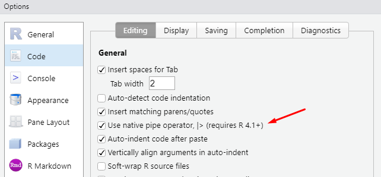
```


## Selecionando colunas com `select()`

Como definimos anteriormente, a função `select()` busca selecionar colunas de seu `data.frame`. Você já possui uma boa ideia de como realizar essa ação através da função de *subsetting* (`[`). Porém, nós podemos usufruir da flexibilidade oferecida pela função `select()`, que lhe permite realizar essa mesma operação de diversas maneiras intuitivas.

No geral, temos ao menos 5 métodos diferentes que podemos utilizar na função `select()`: 

1) simplesmente listar o nome das colunas que desejamos;

2) fornecer um vetor externo, contendo os nomes das colunas a serem extraídas;

3) selecionar um conjunto de colunas com base em seu tipo (`integer`, `double`, `character`, `logical`); 

4) selecionar um conjunto de colunas com base em padrões que aparecem nos nomes dessas colunas (nome começa por y, ou termina em z, ou contém x); 

5) selecionar um conjunto de colunas com base em seus índices numéricos (1° colunas, 2° coluna, 3° coluna, etc.).

Como exemplo inicial, vamos utilizar a tabela `billboard`, que apresenta a posição de diversas músicas na lista Billboard Top 100, ao longo do ano de 2000. Se você chamou com sucesso pelo `tidyverse`, você tem acesso a essa tabela. Perceba que a posição de cada música descrita na tabela, é apresentada de forma semanal, onde cada semana possui a sua coluna própria. Por essa razão, temos uma quantidade exorbitante de colunas na tabela.

```{r}
billboard
```

O método 5 citado acima é um dos métodos mais práticos e eficientes de se utilizar a função `select()`. Por exemplo, se desejássemos extrair todas as colunas entre a 1° e 4° colunas da tabela, poderíamos fornecer um vetor à função, contendo uma sequência de 1 a 4, que representa os índices das colunas que desejamos, como no exemplo abaixo.

```{r}
billboard_sel <- select(billboard, 1:4)

billboard_sel
```


Agora, e se você precisasse selecionar todas as colunas que representam as semanas? Nesse caso, o método 5 ainda seria uma boa alternativa, pois você precisaria apenas fornecer uma sequência que represente a posição dessas colunas na tabela (de 4 a 79 para ser mais preciso). 

Porém, todas essas colunas possuem um padrão em seus nomes. Elas se iniciam pelos caracteres `"wk"`, acrescidos de um número que representa o índice da semana que essa coluna corresponde. Portanto, em todas as ocasiões que houver algum padrão presente nos nomes das colunas que você deseja selecionar, o método 4 que citamos configura-se como uma ótima solução. Nesse método, devemos utilizar as funções de suporte `starts_with()`, `ends_with()`, `matches()`.

Como os seus próprios nomes dão a entender, as funções `starts_with()` e `ends_with()` vão selecionar qualquer coluna de sua tabela que comece (*start*) ou termine (*end*) por uma determinada cadeia de caracteres, respectivamente. Como exemplo, eu posso selecionar todas as colunas que apresentam as posições semanais na tabela `billboard`, ao encontrar todas as colunas que começam pelas letras `"wk"`, com a função `starts_with()`.

```{r}
billboard_sel <- select(billboard, starts_with("wk"))

billboard_sel
```


Já a função `matches()` se trata de um caso muito mais flexível das funções `starts_with()` e `ends_with()`, pois ela lhe permite selecionar qualquer coluna cujo o nome se encaixa em uma dada expressão regular. Expressões regulares são uma poderosa ferramenta para processamento de texto, a qual vamos discutir no capítulo 11 deste livro, especialmente na seção [Expressões regulares (ou *regex*) com `str_detect()`](#sec:stringr_regex). Outras duas referências úteis sobre o assunto, se encontram no [capítulo 14](https://r4ds.had.co.nz/strings.html) de @wickham2017, que provê uma visão mais direta, além da obra de @friedl2006 que oferece uma visão técnica e aprofundada sobre o assunto. Veja alguns exemplos abaixo:

```{r}
## Seleciona todas as semanas que são
## maiores do que 9 e menores do que 100.
## Ou seja, toda semana com dois dígitos
billboard %>% 
  select(matches("wk[0-9]{2}")) %>% print(n = 5)

## Seleciona todas as colunas cujo nome
## possua um ponto final antecedido por
## 4 letras
billboard %>% 
  select(matches("[a-z]{4}[.]")) %>% print(n = 5)
```

Essas são maneiras eficientes de selecionarmos um grande conjunto de colunas, porém, muitas vezes as nossas necessidades são pequenas e, portanto, não exigem mecanismos tão poderosos. Nessas situações, o método 1 se torna útil pois ele consiste em simplesmente listarmos o nome das colunas desejadas. Como exemplo, eu posso selecionar as colunas `artist`, `track` e `wk5` da tabela `billboard` pelo comando abaixo.

```{r}
billboard %>% select(artist, track, wk5)
```

Vale destacar que a ordem dos índices utilizados importa para a função `select()`. Logo, se no exemplo acima, eu listasse as colunas na ordem `track`, `wk5` e `artist`, o novo `data.frame` resultante de `select()`, iria conter essas colunas precisamente nessa ordem. O mesmo efeito seria produzido, caso eu utilizasse novamente o método 5, e fornecesse o vetor `c(3, 2, 4)` à função. Dessa forma, `select()` iria me retornar um novo `data.frame` contendo 3 colunas, que correspondem a 3°, 2° e 4° colunas da tabela `billboard`, exatamente nessa ordem. 

Por outro lado, não há uma maneira de variarmos a ordem dos resultados gerados nos métodos 3 e 4, especificamente. Por isso, caso você utilize um desses dois métodos, as colunas selecionadas serão apresentadas no novo `data.frame`, precisamente na ordem em que eles aparecem no `data.frame` inicial.

Visto esses pontos, ao invés de selecionar colunas, você também pode utilizar o método 1 para rapidamente eliminar algumas colunas de seu `data.frame`, ao posicionar um sinal negativo (`-`) antes do nome da coluna que você deseja retirar. Por exemplo, eu posso selecionar todas as colunas da tabela `mpg`, exceto as colunas `hwy` e `manufacturer` por meio do seguinte comando:

```{r}
mpg %>% select(-hwy, -manufacturer)
```


Em contrapartida, o método 3 busca selecionar um conjunto de colunas com base em seu tipo de dado, através da função `where()` e das funções de teste lógico `is.*()` (`is.double`, `is.character`, `is.integer`, ...). Como exemplo, nós podemos selecionar todas as colunas da tabela `billboard` que contém dados textuais, através do comando abaixo. Portanto, para utilizar esse método você precisa apenas se referir a função `is.*()` que corresponde ao tipo de dado no qual você está interessado, dentro da função `where()`.

```{r}
billboard %>% select(where(is.character))
```

Com isso, você possui não apenas uma boa variedade de métodos disponíveis na função `select()`, mas você também é capaz de misturá-los livremente dentro da função. Ou seja, se for de meu desejo, eu posso utilizar os métodos 2, 4 e 5 ao mesmo tempo, como no exemplo abaixo. Tratando especificamente do método 2, eu preciso fornecer dentro da função `all_of()`, um vetor contendo os nomes das colunas desejadas. Como exemplo, eu posso novamente extrair as colunas `artist`, `track` e `wk5` através desse método. O método 2, em particular, se torna um método interessante quando ainda não conhecemos o conjunto de colunas a serem extraídas. Talvez você precise aplicar previamente diversos testes sobre o seu `data.frame`, para identificar essas colunas. Logo, um vetor contendo os nomes das colunas desejadas seria o resultado ideal para tais testes.

```{r}
vec <- c("artist", "track", "wk5")

billboard %>% select(
  all_of(vec),  ## Método 2
  3:5,  ## Método 5
  matches("wk[0-9]{2}")  ## Método 4
)
```


## Filtrando linhas com `filter()`

Você também já possui conhecimento para realizar essa operação através da função de *subsetting* (`[`). Porém, novamente o pacote `dplyr` nos oferece uma alternativa mais intuitiva. A função `filter()` busca filtrar linhas de uma tabela de acordo com uma condição lógica que nós devemos definir. Ou seja, os operadores lógicos são primordiais para essa função. Por isso, temos na tabela 5.1, um resumo de cada um deles.

|  <!-- -->   |
| :------------ |
|  |
Table: (\#tab:label5) Lista de operadores lógicos


Portanto, ao utilizar a função `filter()` você deve construir uma condição lógica que seja capaz de identificar as linhas que você deseja filtrar. Como exemplo inicial, nós podemos retornar à tabela `mpg`, que contém dados de consumo de diversos modelos de carro. Por exemplo, nós podemos filtrar todas as linhas que dizem respeito a modelos da Toyota, através do comando abaixo. Como um paralelo, temos mais abaixo a mesma operação segundo a função de *subsetting*.

```{r}
mpg %>% filter(manufacturer == "toyota")
```
```{r, eval = F}
## -------------------------------------
## A mesma operação por subsetting:
##
clog <- mpg$manufacturer == "toyota"

mpg[clog, ]
```

Múltiplas condições lógicas podem ser construídas dentro da função `filter()`. Por exemplo, podemos ser um pouco mais específicos e selecionarmos apenas os modelos da Toyota que possuem um motor de 4 cilindradas com o comando abaixo. Repare abaixo, que ao acrescentarmos novas condições na função `filter()`, elas acabam se tornando dependentes. Ou seja, ambas as condições devem ser atendidas ao mesmo tempo em cada linha retornada pela função `filter()`.

```{r}
mpg %>% filter(manufacturer == "toyota", cyl == 4)
```
```{r, eval = F}
## -------------------------------------
## A mesma operação por subsetting:
##
clog <- mpg$manufacturer == "toyota" & mpg$cyl == 4

mpg[clog, ]
```

Nós tradicionalmente estabelecemos relações de dependência entre condições lógicas, por meio do operador `&`. Mas a função `filter()` busca ser prática e, por isso, ela automaticamente realiza esse trabalho por nós. Porém, isso implica que se as suas condições forem independentes, ajustes precisam ser feitos, através do operador `|`.

Visto esse ponto, você pode estar interessado em filtrar a sua tabela, de acordo com um conjunto de valores. Por exemplo, ao invés de selecionar apenas os modelos pertencentes à Toyota, podemos selecionar um conjunto maior de marcas. Em ocasiões como essa, o operador `%in%` se torna útil, pois você está pesquisando se o valor presente em cada linha de sua tabela, pertence ou não a um dado conjunto de valores.

```{r}
marcas <- c("volkswagen", "audi", "toyota", "honda")

mpg %>% 
  filter(manufacturer %in% marcas)
```
```{r, eval = F}
## -------------------------------------
## A mesma operação por subsetting:
##
marcas <- c("volkswagen", "audi", "toyota", "honda")
clog <- mpg$manufacturer %in% marcas

mpg[clog, ]
```


### Cuidados com o operador de igualdade

Quando você estiver filtrando as linhas de sua tabela de acordo com uma condição de igualdade, é importante que você tome alguns cuidados, especialmente se valores textuais estiverem envolvidos nessa condição. O primeiro ponto a ser abordado é o uso do operador `==`, que para além de igualdade, ele busca encontrar valores **exatamente** iguais. 

O "exatamente" é importante aqui, pois certos valores numéricos podem ser aparentemente idênticos aos nossos olhos, mas ainda assim, diferentes segundo a visão de `==`. Isso ocorre especialmente com valores numéricos do tipo `double`. Pois os nossos computadores utilizam precisão aritmética finita para guardar esse tipo de valor [@wickham2017, p 47]. Isso significa que os nossos computadores guardam apenas as casas decimais significantes de um valor `double`, e a perda de casas decimais que ocorre nesse processo, pode ser a fonte de alguma diferença em operações aritméticas. Por exemplo, se testarmos a igualdade entre $(\sqrt{2})^2 = 2$, o R vai nos indicar alguma diferença existente entre esses dois valores.

```{r}
(sqrt(2)^2) == 2
```

Por essa razão, quando você estiver testando a igualdade entre valores do tipo `double`, é interessante que você utilize a função `near()` ao invés do operador `==`. Por padrão, a função `near()` possui uma tolerância próxima de $1,49 \times 10^{-8}$, mas você pode ajustar esse valor pelo argumento `tol` da função.

```{r}
near(sqrt(2)^2, 2)
```


Para mais, você também deve estar atento ao uso do operador `==`, quando estiver testando a igualdade entre palavras, ou valores textuais. Pois uma palavra pode ser escrita de múltiplas maneiras sem que ela perca o seu sentido, e a mínima diferença presente nos caracteres utilizados pode torná-las valores completamente diferentes aos olhos do operador `==`. Logo, os valores `"Isabela"` e `"isabela"` são diferentes na visão de `==`, mesmo que na prática, esses valores muito provavelmente se referem ao mesmo indivíduo.

```{r}
"Isabela" == "isabela"
```

Se você possui em sua coluna, uma variedade maior de valores textuais, que são diferentes, mas que dizem respeito ao mesmo indivíduo (por exemplo, você possui seis variedades de "Isabela": `Isabela`; `ISABELA`; `IsAbElA`; `Ísabela`; `ísabela`; `i\@abela`), você muito provavelmente necessita de uma expressão regular. Para acessar esse mecanismo e utilizá-lo dentro da função `filter()`, você precisa de uma função que utilize essa funcionalidade para pesquisar os textos que se encaixam em sua expressão, e que retorne como resultado, um vetor de valores lógicos que indicam as linhas de sua tabela em que esses textos ocorrem. Sendo os principais indivíduos dessa categoria, a função `grepl()`, e a função `str_detect()` que pertence ao pacote `stringr`.  

Por outro lado, pode ser que você não precise ir tão longe, caso as diferenças presentes em seus textos se apresentem na forma de capitalização das letras (maiúsculo ou minúsculo). Por exemplo, suponha que a sua variedade de "Isabela" fosse: `Isabela`; `ISABELA`; `IsAbElA` e `isabela`. Para tornar esses valores iguais, você precisaria apenas de um método de pesquisa que seja capaz de ignorar a capitalização das letras. Para isso, você pode utilizar a função `grepl()` que possui o argumento `ignore.case`, no qual você pode pedir a função que ignore essas diferenças na capitalização, como no exemplo abaixo.

```{r}
set.seed(2)
df <- data.frame(
  usuario = c("Ana", "Isabela", "isabela", "Julia"),
  id = 1:4,
  valor = round(rnorm(4), 2)
)

df %>% 
  filter(grepl("Isabela", usuario, ignore.case = TRUE))
```


### Estabelecendo intervalos com a função `between()`

Para estabelecermos uma condição de intervalo no R, precisamos de duas condições lógicas que definam os limites deste intervalo. Em seguida, nós devemos tornar essas duas condições dependentes. Por exemplo, se desejássemos filtrar todas as linhas de `mpg` que possuem um valor na coluna `hwy` entre 18 e 24, precisaríamos do seguinte teste lógico:

```{r, eval = F}
mpg %>% 
  filter(hwy >= 18, hwy <= 24)

## -------------------------------------
## A mesma operação por subsetting:
##
clog <- mpg$hwy >= 18 & mpg$hwy <= 24

mpg[clog, ]
```

Porém, de uma maneira mais prática, podemos utilizar a função `between()` que consiste em um atalho para essa metodologia. A função possui três argumentos: 1) `x`, a coluna ou o vetor sobre o qual você deseja aplicar o teste de intervalo; 2) `left`, o limite "inferior" (ou "esquerdo") do intervalo; 3) `right`, o limite "superior" (ou "direito") do intervalo. Logo, se fôssemos traduzir o teste de intervalo anterior para a função `between()`, faríamos da seguinte maneira:

```{r}
mpg %>% 
  filter(between(hwy, 18, 24))
```


### Ataque terrorista {#sec:ataque_terrorista}

Vamos dar um pouco de contexto para as nossas operações. Nessa seção, vamos utilizar os dados disponíveis na tabela `transf`, que podem ser importados para o seu R através dos comandos abaixo. A tabela `transf` contém informações sobre diversas transferências bancárias realizadas por uma instituição bancária. Algumas informações presentes nessa tabela incluem: a data e o horário da transferência (`Data`); O *username* do usuário do banco responsável por realizar a transferência (`Usuario`); o país de destino da transferência (`Pais`); um código de identificação da transferência (`TransferID`); e o valor transferido (`Valor`).


```{r, include = FALSE}
github <- "https://raw.githubusercontent.com/pedropark99/"
pasta <- "Curso-R/master/Dados/"
arquivo <- "transf_reform.csv"

library(readr)

transf <- read_csv2(paste0(github, pasta, arquivo))
```

```{r, eval = FALSE}
github <- "https://raw.githubusercontent.com/pedropark99/"
pasta <- "Curso-R/master/Dados/"
arquivo <- "transf_reform.csv"

library(readr)

transf <- read_csv2(paste0(github, pasta, arquivo))
```
```{r}
transf
```

Vamos supor que no dia 24 de dezembro de 2018, tenha ocorrido um ataque terrorista na cidade de Berlim (Alemanha). Suponha também, que você faz parte do setor de *compliance* da instituição financeira responsável pelas transferências descritas na tabela `transf`. Em geral, um dos principais papéis de um setor de *compliance* é garantir que a sua instituição não esteja contribuindo com práticas ilícitas (dentre elas está o terrorismo). 

Segundo o relatório da polícia, há fortes indícios de que a munição utilizada no ato, foi comprada durante os dias 20 e 23. Além disso, a polícia também destacou que levando em conta a quantidade utilizada no ataque, somente a munição empregada custou em média mais de $15.000. 

Logo, o seu papel seria se certificar de que a instituição a qual você pertence, não realizou alguma transferência que se encaixa nessas características. Pois caso tal transferência exista, vocês teriam de abrir uma investigação em conjunto com a polícia, para apurar as fontes e os destinatários dos recursos dessa transferência.

Portanto, estamos procurando por uma transferência na tabela `transf` de valor acima de $15.000, que possua a Alemanha como país de destino, e que tenha ocorrido durante os dias 20 e 23 de dezembro de 2018. Perceba que todas essas condições, ou características da transferência devem ser atendidas ao mesmo tempo. Ou seja, essas condições lógicas são dependentes uma da outra.

Lembre-se que quando temos diversas condições lógicas dependentes, nós podemos separá-las por vírgulas na função `filter()`. Por outro lado, fora do uso da função `filter()`, nós estabelecemos uma relação de dependência entre várias condições lógicas por meio do operador `&`, e será esse o método tradicional utilizado nessa seção. Logo, quando temos diversas condições no R que devem ser atendidas ao mesmo tempo, nós devemos conectar cada uma dessas condições pelo operador `&`, como no exemplo abaixo.


```{r}
transf %>% 
  filter(
    Valor > 15000 & Pais == "Alemanha" &
    between(as.Date(Data), as.Date("2018-12-20"), as.Date("2018-12-23"))
  )
```

```{r, eval = F}
## -------------------------------------
## A mesma operação por subsetting:
##
clog <- transf$Valor > 15000 & transf$Pais == "Alemanha" &
  between(as.Date(transf$Data), as.Date("2018-12-20"), as.Date("2018-12-23"))

transf[clog, ]
```

No total, 132 linhas foram retornadas pela função, e você teria de conferir cada uma dessas transferências. Um baita trabalho! Porém, vamos supor que em um minuto de reflexão sobre as regras do banco, você se lembre que o remetente da transferência não é obrigado a apresentar uma prova de fundos ou um comprovante de endereço, caso a transferência possua um valor menor do que $200. Em casos como esse, o remetente precisa apresentar apenas a identidade (que ele pode ter falsificado).

```{r}
transf %>%
  filter(
    Valor <= 200 & Pais == "Alemanha" &
    between(as.Date(Data), as.Date("2018-12-20"), as.Date("2018-12-23"))
  )
```

Isso é interessante, pois conseguimos reduzir os nossos resultados para apenas 5 transferências. Ao conferirmos as informações da primeira transferência, os recursos estão limpos. Porém, as próximas 4 transferências levantam algumas suspeitas. Pois elas foram realizadas por clientes diferentes, mas com poucos minutos de diferença. Ao conversar com os agentes Sandra e Eduardo, que autorizaram essas transferências, você descobre que todos os diferentes clientes apresentaram transferências francesas. Será que esses clientes estavam testando as regras da instituição para com identidades desse país?

Ao procurar por todas as transferências em que identidades francesas foram apresentadas, e que foram realizadas entre os dias 20 e 23 de dezembro de 2018, e que possuíam a Alemanha como país de destino, você chega a uma estranha transferência de $20.000 efetuada poucos minutos depois das 4 transferências que encontramos anteriormente. Durante a análise das informações dessa transferência, você percebe diversas falhas presentes na prova de fundos que sustentou a decisão de autorização dessa operação. Há uma grande possibilidade de que os chefes e agentes de sua instituição que autorizaram essa operação, estejam em maus lençóis.

```{r, include = F}
github <- "https://raw.githubusercontent.com/pedropark99/"
pasta <- "Curso-R/master/Dados/"
arquivo <- "identidade.csv"

library(readr)

identidade <- read_csv2(paste0(github, pasta, arquivo))
```

```{r}
transf %>%
  inner_join(
    identidade,
    by = "TransferID"
  ) %>%
  filter(
    Pais == "Alemanha" & Identi_Nacion == "França" &
    between(as.Date(Data), as.Date("2018-12-20"), as.Date("2018-12-23"))
  )
  

```


### Condições dependentes (&) ou independentes (|) ?

Na seção anterior, as condições lógicas que guiavam o nosso filtro eram dependentes entre si. Em outras palavras, as condições deveriam ser todas atendidas ao mesmo tempo. Por essa razão, nós conectamos as condições lógicas com o operador `&`. Porém, em algumas ocasiões as suas condições serão independentes e, por isso, devemos utilizar um outro operador para conectá-las, que é a barra vertical (`|`).

Por exemplo, se eu quiser encontrar todas as transferências na tabela `transf` que ocorreram no dia 13 de novembro de 2018, **ou** que possuem um valor menor que $500, **ou** que foram autorizadas pelo agente Eduardo, eu devo construir o comando abaixo. Logo, toda linha da tabela `transf` que atenda pelo menos uma das condições que estabelecemos, é filtrada pela função `filter()`.

```{r}
transf %>% 
  filter(
    as.Date(Data) == as.Date("2018-11-13") | Valor < 500 |
    Usuario == "Eduardo"
  )
```
```{r, eval = F}
## -------------------------------------
## A mesma operação por subsetting:
##
clog <- as.Date(transf$Data) == as.Date("2018-11-13") | 
  transf$Valor < 500 | transf$Usuario == "Eduardo"

transf[clog, ]
```


## Ordenando linhas com `arrange()`

Algumas operações que realizamos dependem diretamente da forma como as linhas de nossa tabela estão ordenadas. Em outros momentos, desejamos ordenar a nossa tabela, para rapidamente identificarmos as observações que possuem os 10 maiores valores de alguma variável ao longo da base. Ou seja, a ordenação de linhas é uma operação muito comum, e o pacote `dplyr` oferece a função `arrange()` para tal ação.

O uso da função `arrange()` é bem simples. Tudo o que você precisa fazer é listar as colunas pelas quais você deseja ordenar a base. Caso a coluna seja numérica, `arrange()` vai seguir uma ordenação numérica. Mas se essa coluna for do tipo `character`, `arrange()` vai utilizar uma ordenação alfabética para organizar os valores da coluna. Por outro lado, na hipótese dessa coluna ser do tipo `factor`, `arrange()` vai seguir a ordem presente nos "níveis" (`levels`) desse `factor`, aos quais você pode acessar pela função `levels()`. 

```{r}
mpg %>% arrange(displ)
```


Você pode recorrer a várias colunas para ordenar a sua base. Nessa situação, a função `arrange()` vai ordenar as colunas na ordem em que você as definiu na função. Ou seja, no exemplo abaixo, a função `arrange()` primeiro ordena a base de acordo com a coluna `displ`, em seguida, segundo a coluna `hwy`, e por último, a coluna `trans`. 

```{r}
mpg %>% arrange(displ, hwy, trans)
```


Por padrão, a função `arrange()` utiliza uma ordenação em um sentido crescente (do menor para o maior valor; do primeiro para o último valor), qualquer que seja o tipo de dado contido na coluna que você forneceu a função. Caso você deseja utilizar uma ordenação em um sentido decrescente (do maior para o menor valor; do último para o primeiro valor) em uma dada coluna, você deve encapsular o nome dessa coluna na função `desc()`. No exemplo abaixo, `arrange()` primeiro ordena a coluna `manufacturer` em uma forma decrescente e, em seguida, ordena a coluna `hwy` de acordo com uma ordem crescente.

```{r}
mpg %>% arrange(desc(manufacturer), hwy)
```

Como estamos basicamente definindo colunas na função `arrange()`, é natural que você anseie pelos diversos métodos de seleção que aprendemos em `select()`. Por isso, em versões mais recentes do pacote `dplyr` tivemos a introdução da função `across()`, pela qual você tem novamente acesso a todos esses métodos que vimos em `select()`.

```{r, eval = F}
## Ordenar a base segundo as três primeiras colunas
mpg %>% arrange(across(1:3))

## Ordenar a base segundo o conjunto de colunas
## que possuem um nome que se inicia
## pelos caracteres "dis"
mpg %>% arrange(across(starts_with("dis")))
```


Vale destacar que a função `arrange()`, por padrão, não respeita os grupos de sua tabela e, portanto, considera toda a sua tabela no momento em que a ordenação ocorre. Ainda veremos em mais detalhes nas próximas seções, a função `group_by()`, pela qual você pode definir os grupos presentes em sua tabela. Portanto, pode ser de seu desejo que a ordenação executada por `arrange()` ocorra dentro de cada um dos grupos que você delimitou através da função `group_by()`. Para isso, você precisa configurar o argumento `.by_group` para `TRUE`.

```{r}
mpg %>% 
  group_by(manufacturer) %>% 
  arrange(hwy, .by_group = TRUE)
```


## Adicionando variáveis à sua tabela com `mutate()` {#sec:mutate_dplyr}

Frequentemente, você deseja adicionar uma nova variável em sua tabela como uma função de outras variáveis já existentes em sua tabela. Para tal fim, o pacote `dplyr` disponibiliza a função `mutate()`, que oferta um mecanismo limpo e rápido para executarmos tal ação. 

Como um exemplo inicial, vamos voltar a tabela `transf` que introduzimos na seção [Ataque terrorista](#sec:ataque_terrorista). A coluna `Data` retém a data e o horário em que cada operação foi registrada no sistema do banco. Entretanto, o horário pode se tornar irrelevante para certos passos e, por essa razão, seria interessante que possuíssemos uma coluna na tabela `transf`, contendo apenas a data de cada transferência. Com esse objetivo em mente, somos capazes de extrair a data da coluna `Data` através da função `as.Date()`, e empregar a função `mutate()` para armazenarmos o resultado desse procedimento em uma nova coluna chamada `Sem_hora`, como mostrado abaixo.


```{r}
transf %>% 
  select(-Pais, -Descricao) %>% 
  mutate(
    Sem_hora = as.Date(Data)
  )
```

Portanto, sempre que você recorrer à função `mutate()`, você deve compor essa estrutura de `<nome_coluna> = <expressao>` em cada coluna adicionada. Ou seja, como flexibilidade e eficiência são valores que as funções do pacote `dplyr` carregam, você tem a capacidade de criar múltiplas colunas em um mesmo `mutate()`. Porém, como um aviso, é ideal que você não crie mais de 7 colunas ao mesmo tempo. Na hipótese dessa recomendação ser ignorada, há uma probabilidade significativa de você enfrentar problemas de memória e mensagens de erro bastante nebulosas.

```{r, eval = FALSE}
## Estrutura básica de um mutate():
<sua_tabela> %>% 
  mutate(
    nome_coluna1 = expressao1,
    nome_coluna2 = expressao2,
    nome_coluna3 = expressao3,
    ...
  )
```

Um outro ponto muito importante, é que em um mesmo `mutate()`, você também pode empregar uma nova coluna que você acaba de criar, no cálculo de uma outra coluna a ser produzida. Por exemplo, eu posso guardar o desvio de `Valor` em relação à sua média, na coluna `Desvio`, e logo em seguida, utilizar os valores dessa coluna para produzir a coluna `Valor_norm`, como exposto abaixo.

```{r}
transf %>% 
  select(-Pais, -Descricao) %>%
  mutate(
    Desvio = Valor - mean(Valor),
    Valor_norm = Desvio / sd(Valor)
  )
```

Com isso, a parte fundamental de um `mutate()` é construirmos a expressão que produzirá os valores a serem alocados na nova coluna que estamos criando. Logo abaixo, consta uma lista de várias funções que você pode utilizar para formar a expressão que você deseja. Ademais, essa é uma lista parcial, logo, há diversas outras funções que você pode utilizar para calcular os valores dos quais você necessita.


1. **Somatórios:** soma total de uma coluna - `sum()`; somatório por linha, ao longo de algumas colunas - operador `+`; somatório por linha, ao longo de várias colunas - `rowSums()`.

1. **Operações cumulativas:** somatório acumulado de uma coluna - `cumsum()`; média acumulada de uma coluna - `cummean()`; mínimo acumulado de uma coluna - `cummin()`; máximo acumulado de uma coluna - `cummax()`.

2. **Medidas de posição:** média de uma coluna - `mean()`; mediana de uma coluna - `median()`; média por linha, ao longo de várias colunas - `rowMeans()`; média móvel - `roll_mean()`^[Essa função pertence ao pacote `RcppRoll` e, portanto, para ter acesso à função você deve possuir esse pacote instalado em sua máquina, e chamar por ele em sua sessão.].

3. **Medidas de dispersão:** desvio padrão de uma coluna - `sd()`; variância de uma coluna - `var()`; intervalo interquartil - `IQR()`; desvio absoluto da mediana - `mad()`.

4. **Operadores aritméticos:** soma (`+`); subtração (`-`); divisão (`/`); multiplicação (`*`); potência, ou elevar um número a `x` (`^`); restante da divisão (`%%`); apenas o número inteiro resultante da divisão (`%/%`); logaritmo - `log()`.

5. **Operadores lógicos:** aplique um teste lógico em cada linha, e preencha essa linha com `x` caso o teste resulte em `TRUE`, ou preencha com `y` caso o teste resulte em `FALSE` - `if_else()`; quando você quer aplicar uma operação parecida com `if_else()`, mas que há vários casos possíveis, um exemplo típico seria criar uma coluna de faixas etárias - `case_when()`; você também pode utilizar normalmente todos os operadores que vimos na seção de `filter()`, para criar um teste lógico sobre cada linha - `<, <=, >, >=, ==, !=, !, &, |`.

6. **Funções para discretizar variáveis contínuas:** calcula intervalos de forma a encaixar o mesmo número de observações em cada intervalo (comumente chamados de quantis) - `cut_number()`; calcula intervalos com o mesmo alcance - `cut_interval()`; calcula intervalos de largura definida no argumento `width` - `cut_width()`.

7. **Funções de defasagem e liderança:** quando você precisa em algum cálculo naquela linha, utilizar o valor da linha anterior - `lag()`; ou ao invés do valor da linha anterior, você precisa do valor da linha posterior - `lead()`.

Porém, é necessário ter cautela. Como a função `mutate()` busca trabalhar com `data.frame`'s, é de suma importância, que você esteja sempre consciente das propriedades que essa estrutura carrega. Em especial, a propriedade de que as suas colunas devem possuir o mesmo número de elementos. Portanto, se o seu `data.frame` possui exatamente 10 mil linhas, você precisa se certificar de que cada expressão utilizada na função `mutate()`, vai gerar 10 mil elementos como resultado. 

Na hipótese de que alguma dessas expressões produzam, por exemplo, 9.999 elementos, um erro será acionado, pois esses 9,999 mil elementos não podem ser guardados em um `data.frame` que possui 10 mil linhas. Logo, a função `mutate()` lhe provê flexibilidade e eficiência, mas ela não é capaz de quebrar regras fundamentais da linguagem R.

Um exemplo prático disso é encontrado quando tentamos calcular uma média móvel de alguma série temporal, ou de algum valor diário utilizando a função `mutate()`, como no exemplo abaixo. O erro ocorre devido a própria natureza do cálculo de uma média móvel, que gera uma "perda" de observações, e como consequência, um número menor de observações é gerado dentro do resultado. Perceba abaixo, que ao aplicarmos uma janela de cálculo de 5 observações, a função `roll_mean()` foi capaz de produzir 996 valores, consequentemente, perdemos 4 observações no processo.

```{r, eval = F}
set.seed(1)
df <- tibble(
  dia = 1:1000,
  valor = rnorm(1000)
)

library(RcppRoll)

df %>% 
  mutate(
    media_movel = roll_mean(df$valor, n = 5)
  )
```

```
Erro: Problem with `mutate()` input `media_movel`.
x Input `media_movel` can't be recycled to size 1000.
i Input `media_movel` is `roll_mean(df$valor, n = 5)`.
i Input `media_movel` must be size 1000 or 1, not 996.
Run `rlang::last_error()` to see where the error occurred.
```

Compreendendo os potenciais problemas fabricados por essa característica do cálculo de uma média móvel, a função `roll_mean()` oferece o argumento `fill`, no qual podemos pedir à função que complete as observações restantes com zeros, como no exemplo abaixo. Dessa forma, a função volta a produzir 1000 observações em seu resultado e, consequentemente, nenhum erro é acionado.

```{r, include=F}
library(RcppRoll)
set.seed(1)
df <- tibble(
  dia = 1:1000,
  valor = rnorm(1000)
)
```
```{r}
df %>% 
  mutate(
    media_movel = roll_mean(valor, n = 5, fill = 0, align = "right")
  )
```

Desse modo, estamos discutindo as possibilidades existentes de sua expressão fornecida à `mutate()`, produzir múltiplos valores. Todavia, diversas funções extremamente úteis, e que utilizamos com bastante frequência nessas expressões, resultam apenas em um único valor. Grandes exemplos são as funções `mean()` e `sum()`, que calculam a média e a soma de uma coluna, respectivamente.

Em todas as ocasiões em que a sua expressão na função `mutate()` gerar um único valor, qualquer que ele seja, a função `mutate()` irá automaticamente replicar esse mesmo valor ao longo de toda a coluna que você acaba de criar. Vemos uma demonstração disso, ao criarmos abaixo, as colunas `soma`, `prop` e `um_numero`. Com essa ideia em mente, se temos diversos valores numéricos em uma dada coluna, nós podemos eficientemente calcular uma proporção desses valores em relação ao total de sua coluna, com o uso da função `sum()`, como no exemplo abaixo. Da mesma forma, nós podemos rapidamente normalizar uma coluna numérica segundo a fórmula de uma estatística Z, por meio das funções `sd()` e `mean()`.

```{r}
df <- tibble(
  id = 1:5,
  x = c(2.5, 1.5, 3.2, 5.1, 2.2),
  y = c(1, 2, 3, 4, 5)
)

df <- df %>% 
  mutate(
    soma = sum(x),
    prop = y * 100 / sum(y),
    um_numero = 25,
    norm = (x - mean(x)) / sd(x)
  )

df
```


## Agrupando dados com `group_by()` e gerando estatísticas sumárias com `summarise()` {#sec:group_by_summarise}

Em diversas áreas, é muito comum que contenhamos variáveis qualitativas em nossa base de dados. Variáveis desse tipo, usualmente definem grupos ou estratos de uma amostra, população ou medida, como faixas etárias ou faixas de valor salarial. Se você está analisando, por exemplo, dados epidemiológicos, você em geral deseja examinar se uma dada doença está ocorrendo com maior ou menor intensidade em um determinado grupo de sua população. 

Ou seja, será que fatores como a raça, a idade, o gênero, a orientação sexual ou a localidade de um indivíduo são capazes de afetar as suas chances de ser infectado por essa doença? De outra maneira, será que essas variáveis qualitativas são capazes de gerar, por exemplo, diferenças no salário deste indivíduo? Da mesma forma, quando analisamos a performance de determinadas firmas, desejamos saber se a localidade, o setor, o tamanho, o investimento e a receita total, além do número de funcionários dessa firma são capazes de prover alguma vantagem em relação aos seus concorrentes. 

Para esse tipo de estudo, o pacote `dplyr` nos oferece a função `group_by()` que fundamentalmente altera o comportamento de funções como `mutate()` e `summarise()`, e nos permite calcular estatísticas e aplicarmos operações dentro de cada grupo presente em nossos dados. Como um exemplo inicial, vamos utilizar a tabela `minas_pop`, que contém dados de população e PIB (Produto Interno Bruto) dos 853 municípios do estado de Minas Gerais.


```{r, include = F}
github <- "https://raw.githubusercontent.com/pedropark99/"
pasta <- "Curso-R/master/Dados/"
arquivo <- "populacao.csv"

minas_pop <- read_csv2(paste0(github, pasta, arquivo))
```
```{r, eval = FALSE}
github <- "https://raw.githubusercontent.com/pedropark99/"
pasta <- "Curso-R/master/Dados/"
arquivo <- "populacao.csv"

minas_pop <- read_csv2(paste0(github, pasta, arquivo))
```
```{r, echo = F}
minas_pop
```

Como demonstramos na seção anterior, a função `sum()` serve para calcularmos o total de uma coluna inteira. Logo, se aplicássemos a função `sum()` sobre a coluna `Populacao`, teríamos a população total do estado de Minas Gerais. Porém, e se desejássemos calcular a população total de cada uma das regiões intermediárias (presentes na coluna `Intermediaria`) que compõe o estado de Minas Gerais?

Para isso, nós podemos utilizar a função `group_by()` para determinar onde em nossa tabela se encontram os grupos de nossos dados. No nosso caso, esses grupos estão na coluna `Intermediaria`. Dessa forma, após utilizarmos o `group_by()`, perceba abaixo que os totais calculados pela função `sum()`, e que estão apresentados na coluna `Pop_total`, variam ao longo da tabela de acordo com o valor presente na coluna `Intermediaria`. Logo, temos agora a população total de cada região intermediária na coluna `Pop_total`. Da mesma maneira, ao invés de possuírmos uma proporção baseada na população do estado, as proporções de cada município expostas na coluna `Prop_pop_mun` possuem como denominador, a população total da região intermediária a qual o município pertence.

```{r}
minas_pop %>% 
  select(-Ano, -PIB) %>% 
  group_by(Intermediaria) %>% 
  mutate(
    Pop_total = sum(Populacao),
    Prop_pop_mun = Populacao * 100 / Pop_total
  )
```


Para verificarmos se os grupos em uma dada tabela estão definidos, podemos observar se a descrição `Groups` se encontra logo abaixo às dimensões da tabela (`tibble: 853 x 7`). Essa descrição `Groups`, acaba nos informando a coluna (ou o conjunto de colunas) envolvidas nessa definição, além do número de grupos que estão contidos em nossa tabela. Logo, pelo resultado do exemplo acima, temos 13 grupos, ou 13 regiões intermediárias diferentes presentes na coluna `Intermediaria`.


Como um outro exemplo, dessa vez, em um contexto mais atual, podemos utilizar os dados de COVID-19 presentes na tabela abaixo, denominada `covid`. Nessa tabela, temos o acumulado do número de casos confirmados do vírus em cada estado brasileiro, durante o período de 25 de Fevereiro a 27 de Julho de 2020.

```{r, include = F}
github <- "https://raw.githubusercontent.com/pedropark99/"
pasta <- "Curso-R/master/Dados/"
arquivo <- "covid.csv"

covid <- read_csv2(paste0(github, pasta, arquivo))
```
```{r, eval = F}
github <- "https://raw.githubusercontent.com/pedropark99/"
pasta <- "Curso-R/master/Dados/"
arquivo <- "covid.csv"

covid <- read_csv2(paste0(github, pasta, arquivo))
```
```{r, echo = F}
covid
```

Durante o ano de 2020, a Fundação João Pinheiro (FJP) tem oferecido parte de seu corpo técnico para a Secretaria Estadual de Saúde, com o objetivo de dar suporte técnico à instituição no monitoramento das estatísticas de contaminação e
impacto do vírus no estado de Minas Gerais.

Portanto, uma atividade muito comum com os dados da COVID-19, seria calcularmos a variação diária no número de casos acumulados. Tal cálculo pode ser atingido, através dos valores acumulados na coluna `casos`, ao subtrairmos do valor da linha corrente, o valor da linha anterior nessa mesma coluna. Para incluirmos o valor da linha anterior em nosso cálculo, podemos usar a função `lag()`, como no código abaixo:

```{r, eval = F}
covid %>%
  mutate(
    casos_var = casos - lag(casos),
    mortes_var = mortes - lag(mortes)
  )
```

Porém, temos um problema nessa operação, que emerge do fato de que não delimitamos os grupos da tabela. Por essa razão, a função `mutate()` vai aplicar a expressão `casos - lag(casos)` sobre toda a tabela de uma vez só. O correto, seria que nós aplicássemos essa operação separadamente sobre os dados de cada estado.

Dito de outra forma, ao não dizermos que cada estado deveria ser tratado de forma separada dos demais, estamos invadindo os limites de cada estado com o cálculo pertencente a outros estados. Em outras palavras, o problema que emerge do código anterior, em que não definimos os grupos, se encontra nas linhas que definem os limites entre cada estado, ou as linhas que marcam a transição entre os dados do estado A para os dados do estado B. Logo, caso não definirmos esses grupos, estaremos utilizando no cálculo da variação presente na primeira linha referente ao estado de São Paulo, o número acumulado de casos localizado na última linha pertencente ao estado que vem antes de São Paulo na base (o estado de Sergipe). 

Por isso, ao utilizarmos a função `group_by()` sobre a tabela `covid`, faremos com que a função `mutate()` esteja consciente dos limites entre os dados de cada estado, e que, portanto, respeite esses limites durante o cálculo dessa variação.

```{r}
covid_novo <- covid %>%
  group_by(estado) %>% 
  mutate(
    casos_var = casos - lag(casos),
    mortes_var = mortes - lag(mortes)
  )

covid_novo 
```


Agora que vimos a função `group_by()`, podemos prosseguir para a função `summarise()`, que busca sumarizar, sintetizar ou reduzir múltiplos valores de seu `data.frame` em poucas linhas. Logo, se eu aplicar a função `summarise()` sobre a tabela `minas_pop`, um novo `data.frame` será gerado, e ele irá conter provavelmente uma única linha. O seu trabalho é definir os valores que vão ocupar esse espaço.

Por isso, dentro da função `summarise()`, devemos fornecer expressões, exatamente da mesma forma que fornecemos em `mutate()`. Essas expressões vão ser responsáveis por calcular os valores que vão preencher as linhas presentes no novo `data.frame` criado. Se as expressões delineadas por você gerarem um único valor ou uma única estatística sumária, o novo `data.frame` resultante de `summarise()` vai possuir uma única linha, e uma coluna para cada expressão definida. Como exemplo, podemos calcular o somatório total e a média da coluna `Populacao` da seguinte forma:

```{r}
minas_pop %>% 
  summarise(
    total_pop = sum(Populacao),
    media_pop = mean(Populacao)
  )
```

Por outro lado, caso a sua expressão produza $n$ valores como resultado, o novo `data.frame` fabricado por `summarise()` vai possuir $n$ linhas para alocar esses valores. Em outras palavras, o número de linhas presente no `data.frame` resultante, nesse caso, depende diretamente da quantidade de valores produzidos por sua expressão. Como um exemplo disso, podemos utilizar a função `quantile()` para extrairmos os limites do intervalo interquartil (percentis de número 25 e 75) da coluna `Populacao`. 

```{r}
minas_pop %>% 
  summarise(iqr = quantile(Populacao, probs = c(0.25, 0.75)))
```

Apesar dessas características, a função `summarise()` é normalmente utilizada em conjunto com a função `group_by()`. Pois ao definirmos os grupos de nossa tabela, a função `summarise()` passa a produzir uma linha para cada grupo presente em nossa tabela. Logo, o cálculo da população total e da população média anterior, que produzia uma única linha, passa a gerar 13 valores diferentes e, portanto, 13 linhas diferentes ao agruparmos os dados de acordo com a coluna `Intermediaria`. Podemos ainda aplicar a função `n()`, com o objetivo de descobrirmos quantas linhas, ou quantos municípios representam cada região intermediária do estado.

```{r}
minas_pop %>% 
  group_by(Intermediaria) %>% 
  summarise(
    total_pop = sum(Populacao),
    media_pop = mean(Populacao),
    numero_municipios = n()
  )
```

Neste momento, vale a pena comentar também, a função `count()`, que se traduz como um atalho para a junção das funções `group_by()`, `summarise()` e `n()`. Logo, ao invés de construirmos toda a estrutura de `group_by()` e `summarise()`, nós poderíamos rapidamente contabilizar o número de municípios em cada região intermediária, através da função `count()`, como no exemplo abaixo. Lembrando que cada coluna fornecida à `count()`, será repassada a `group_by()` e, portanto, será responsável por definir os grupos nos quais a contagem será aplicada. Logo, se definíssemos a função como `count(minas_pop, Intermediaria, Ano)`, estaríamos calculando o número de municípios existentes em cada região intermediária, dentro de um dado ano descrito em nossa tabela.

```{r}
minas_pop %>% count(Intermediaria)
```
```{r, eval = F}
## ----------------------------------------
## Sem o uso de pipe ( %>% ) teríamos:
count(minas_pop, Intermediaria)
```


Para além desses pontos, vale destacar que certos momentos em que você necessita de várias colunas para identificar um único grupo de sua tabela, não são incomuns. Por isso, você pode incluir mais de uma coluna dentro da função `group_by()`. Por exemplo, suponha que você possua na tabela `covid`, uma coluna que apresenta o mês ao qual cada linha se encontra. Suponha ainda, que você deseja calcular a média mensal de novos casos diários em cada estado. Para realizar essa ação, você precisa aplicar o cálculo da média não apenas dentro de cada estado, mas também, dentro de cada mês disponível na base. Logo, precisamos fornecer tanto a coluna `estado` quanto a coluna `mes` à função `group_by()`, como no exemplo abaixo.

```{r, message=FALSE}
covid_novo %>% 
  ungroup() %>% 
  mutate(mes = as.integer(format(data, "%m"))) %>% 
  group_by(estado, mes) %>% 
  summarise(
    media_novos_casos = mean(casos_var, na.rm = T)
  )
```

Perceba também acima, que utilizamos a função `ungroup()` sobre a tabela `covid_novo`, antes de aplicarmos a função `group_by()`. O motivo para tal operação, está no fato de que a tabela `covid_novo` já se encontrava agrupada desde o momento em que ela foi criada. Por isso, ao aplicarmos novamente a função `group_by()` com o uso das colunas `estado` e `mes`, para redefinirmos os grupos da tabela, precisamos remover a definição anterior desses grupos. Sendo esta a única ação executada pela função `ungroup()`.

Portanto, a partir do momento em que você "terminou" de utilizar as operações "por grupo" em sua tabela, e deseja ignorar novamente esses grupos em suas próximas etapas, você deve retirar a definição dos grupos de sua tabela, por meio da função `ungroup()`.


## A função `across()` como a grande novidade

A função `across()` foi uma das grandes novidades introduzidas em uma versão recente do pacote `dplyr` [@wickham_tidyverse2020]. Essa função lhe permite aplicar os métodos de seleção que vimos em `select()`, dentro dos demais verbos expostos (funções `mutate()`, `summarise()` e `arrange()`). Para mais, o principal objetivo dessa função está em prover uma maneira muito mais prática de empregarmos uma mesma operação ao longo de várias colunas.

Por exemplo, suponha que você desejasse calcular o logaritmo de todas as colunas numéricas da tabela `mpg`. Temos então, que aplicar a mesma operação sobre 5 colunas diferentes, mais especificamente, as colunas `displ`, `year`, `cyl`, `cty` e `hwy`. Com o que vimos até o momento, você provavelmente faria tal ação da seguinte forma:

```{r, eval = F}
mpg %>% 
  mutate(
    displ = log(displ),
    year = log(year),
    cyl = log(cyl),
    cty = log(cty),
    hwy = log(hwy)
  )
```

Porém, além de tedioso, a repetição envolvida nesse tipo de solução, incorre em uma grande chance de erro de nossa parte. Pois os nossos olhos tendem a prestar atenção no que é diferente dos demais, no que se destaca do ambiente, e não sobre blocos e blocos de comandos que são basicamente idênticos. 

Com isso, a função `across()` provê um excelente mecanismo para automatizarmos essa aplicação. Nessa função, temos dois argumentos principais a serem preenchidos: 1)`.cols`, que representa o conjunto de colunas onde a ação desejada será aplicada; 2) `.fns`, a função ou a expressão que será empregada em cada coluna (neste argumento, você pode fornecer apenas o nome da função). Com isso, poderíamos reescrever a operação anterior como:

```{r}
## Aplicar log() na terceira, quarta,
## quinta, oitava e nona coluna da tabela mpg:
mpg %>% 
  mutate(across(.cols = c(3:5, 8:9), .fns = log))
```

Portanto, em `across()` você é capaz de aplicar qualquer um dos 5 métodos que vimos em `select()`. Como um outro exemplo, podemos aplicar a função `log()` sobre qualquer coluna que se inicie pela letra "h", com o comando abaixo:

```{r}
mpg %>% 
  mutate(across(.cols = starts_with("h"), .fns = log))
```

Por outro lado, caso você necessite aplicar várias funções em cada coluna, é melhor que você crie uma nova função (a partir da palavra-chave `function`) dentro de `across()`, contendo as operações que você deseja aplicar. Pois dessa maneira, você possui um melhor controle sobre em que partes do cálculo, os valores de cada coluna serão posicionados.

Por exemplo, podemos normalizar todas as colunas numéricas da tabela `mpg`, por uma estatística Z. Perceba abaixo, que nesse caso, precisamos utilizar o valor da coluna em 3 ocasiões: duas vezes no numerador, para calcularmos o desvio de cada valor da coluna em relação a sua média; e uma vez no denominador, para calcularmos o desvio padrão. Repare também, que ao menos quatro funções são utilizadas dentro desse cálculo: as funções `mean()` e `sd()`, além dos operadores de subtração (`-`) e de divisão (`/`).

```{r}
mpg %>% 
  mutate(across(
    .cols = where(is.numeric),
    .fns = function(x) x - mean(x) / sd(x)
  ))
```

Com isso, a função `summarise()` também se torna um local extremamente útil para o emprego da função `across()`. Pois através de `across()`, nós podemos rapidamente aplicar uma função sobre cada coluna que desejamos sintetizar com `summarise()`. Por exemplo, somos capazes de extrair o valor total de todas as colunas numéricas da tabela `mpg`, por meio dos seguintes comandos:

```{r}
mpg %>% 
  group_by(cyl) %>% 
  summarise(across(
    .cols = where(is.numeric),
    .fns = sum
  ))
```


## Removendo duplicatas com `distinct()`

Às vezes, os nossos dados chegam com algum erro de registro, e usualmente, esse erro se manifesta na forma de registros duplicados. Nessa seção, veremos o uso da função `distinct()` como um mecanismo útil para eliminarmos observações duplicadas em sua tabela. Como um exemplo inicial, podemos utilizar a tabela `ponto`, criada pelos comandos abaixo:

```{r}
ponto <- tibble(
  usuario = "Ana",
  dia = c(1, 1, 1, 2, 2),
  hora = c(14, 14, 18, 8, 13),
  minuto = c(30, 30, 50, 0, 30),
  tipo = c("E", "E", "S", "E", "E"),
  mes = 3,
  ano = 2020
)

ponto
```


Inicialmente, a função `distinct()` funciona da mesma maneira que a função `unique()`. Porém, a função `unique()` pode ser aplicada em praticamente qualquer tipo de estrutura, além do tipo de estrutura adotado em seu resultado, variar em diversas aplicações. Enquanto isso, a função `distinct()` (assim como as demais funções do pacote `dplyr`) irá sempre aceitar um `data.frame` como *input* e gerar um novo `data.frame` como *output*. Logo, se aplicarmos `distinct()` sobre a tabela `ponto`, temos o seguinte resultado:

```{r}
ponto_dis <- distinct(ponto)

ponto_dis
```

Repare pelo produto acima, que a função `distinct()` eliminou a segunda linha da tabela `ponto`, pois essa era uma duplicata da primeira linha. Para mais, a função `distinct()` nos permite aplicar a função sobre colunas específicas do `data.frame` em questão. No exemplo acima, nós omitimos essa funcionalidade, e pedimos para que a função `distinct()` fosse aplicada sobre a toda a tabela. Isso significa, que ao não definirmos uma coluna ou um conjunto de colunas em particular, `distinct()` vai utilizar a combinação dos valores de todas as colunas para determinar os valores únicos presentes em sua tabela e, portanto, eliminar os valores duplicados segundo essa abordagem.

Como exemplo, podemos aplicar a função sobre as colunas `usuario` e `tipo`. Dessa forma, `distinct()` nos retorna um novo `data.frame` contendo os valores únicos presentes nessas colunas. No entanto, perceba que um efeito colateral foi gerado, pois nós perdemos todas as demais colunas da tabela `ponto` durante o processo. Isso ocorre em todas as ocasiões em que listamos uma combinação de colunas em `distinct()`. Para evitar esse comportamento, você pode definir o argumento `.keep_all` para `TRUE`, como no exemplo abaixo.

```{r}
ponto_dis <- distinct(ponto, usuario, tipo)

ponto_dis

ponto_dis <- distinct(ponto, usuario, tipo, .keep_all = TRUE)

ponto_dis
```

Com isso, se desejamos eliminar os valores duplicados em nossas tabelas, podemos rapidamente aplicar a função `distinct()` sobre toda a tabela. Contudo, haverá momentos em que combinações específicas de colunas devem ser utilizadas para determinarmos as observações únicas da tabela, ao invés de todas as colunas disponíveis. Para isso, você deve listar os nomes das colunas a serem utilizadas pela função `distinct()` neste processo. Além disso, você geralmente vai desejar utilizar a configuração `.keep_all = TRUE` durante essa situação, com o objetivo de conservar as demais colunas da tabela no resultado de `distinct()`.

Ademais, lembre-se que você pode utilizar a função `across()` para ter acesso aos mecanismos de seleção de `select()`, para definir o conjunto de colunas a ser empregado por `distinct()`. Por exemplo, eu posso encontrar todos os valores únicos criados pela combinação entre as colunas `dia` e `tipo`, por meio do seguinte comando:

```{r}
distinct(ponto, across(c(2, 5)), .keep_all = TRUE)
```


## Combinando tabelas com `bind_cols()` e `bind_rows()`

Os pacotes básicos do R oferecem as funções `rbind()` e `cbind()`, que lhe permite combinar objetos. Porém, o pacote `dplyr` oferece implementações mais rápidas e completas desse mecanismo, através das funções `bind_cols()` e `bind_rows()`. Do mesmo modo que as demais funções do pacote, `bind_cols()` e `bind_rows()` aceitam um conjunto de `data.frame`'s como *input*, e lhe retornam um novo `data.frame` como *output*.

Como exemplo inicial, suponha que você possua o conjunto de tabelas abaixo. Essas tabelas contêm dados das vendas de três lojas diferentes.

```{r}
savassi <- tibble(
  dia = as.Date(c("2020-03-01", "2020-03-02", "2020-03-03",
                  "2020-03-04")),
  produtoid = c("10241", "10241", "10032", "15280"),
  loja = "Savassi",
  unidades = c(1, 2, 1, 1),
  valor = c(15.5, 31, 12.4, 16.7)
)

prado <- tibble(
  dia = as.Date(c("2020-03-10", "2020-03-11", "2020-03-12")),
  produtoid = c("15280", "10032", "10032"),
  loja = "Prado",
  unidades = c(3, 4, 2),
  valor = c(50.1, 49.6, 24.8)
)

centro <- tibble(
  dia = as.Date(c("2020-03-07", "2020-03-10", "2020-03-12")),
  produtoid = c("15280", "15280", "15280"),
  loja = "Centro",
  unidades = c(5, 1, 1),
  valor = c(83.5, 16.7, 16.7)
)
```

Supondo que você seja um analista da empresa dona dessas lojas, e que foi delegado a você, a tarefa de analisar os dados dessas tabelas, você terá no mínimo o triplo de trabalho, caso mantenha essas tabelas separadas. Pois cada etapa de sua análise teria de ser replicar em três lugares diferentes. Por isso, a melhor opção é reunir essas tabelas em um lugar só. Pois dessa maneira, você precisa aplicar as suas operações em um único lugar.

Ou seja, a motivação para o uso das funções `bind_rows()` e `bind_cols()`, surge em geral, a partir da dificuldade que temos em aplicar a mesma função em diversos pontos de nosso trabalho, além da manutenção e monitoramento dos resultados gerados em cada um desses pontos envolvidos nesse serviço. Portanto, se você possui um grande conjunto de tabelas, que são semelhantes entre si, e você precisa aplicar os mesmos passos sobre cada uma delas, é interessante que você tente juntar essas tabelas em uma só. Dessa maneira, você pode direcionar o seu foco e as suas energias para um só local.


Como as tabelas `savassi`, `prado` e `centro` possuem as mesmas colunas, faz mais sentido unirmos as linhas de cada tabela para formarmos a nossa tabela única. Para isso, basta listarmos essas tabelas dentro da função `bind_rows()`, como demonstrado abaixo. Uma outra opção, seria provermos uma lista de `data.frame`'s à função, o que também está demonstrado abaixo:

```{r}
bind_rows(savassi, prado, centro)
```
```{r, eval = F}
## ------------------------------------------------
## Uma alternativa seria fornecermos uma lista
## contendo as tabelas a serem unidas:

lista <- list(savassi, prado, centro)

bind_rows(lista)
```

Portanto, ao unir as linhas de cada tabela, a função `bind_rows()` está de certa forma "empilhando" uma tabela em cima da outra. Mas para que este tipo de operação ocorra de maneira adequada, é **importante que as colunas de todas as tabelas estejam nomeadas igualmente**. Dito de outra forma, as tabelas envolvidas nesse cálculo, devem ser formadas pelo mesmo grupo de colunas. Essas colunas podem se encontrar em ordens diferentes ao longo das tabelas, mas elas precisam necessariamente estar nomeadas da mesma maneira. Caso alguma coluna em pelo menos uma das tabelas possua um nome diferente de seus pares, a função vai alocar os seus valores em uma coluna separada das demais, e isso geralmente não é o que você deseja.

```{r}
colnames(centro)[2:3] <- c("ProdutoID", "Loja")

bind_rows(savassi, prado, centro)
```

Por outro lado, quando estamos planejando unir tabelas a partir de suas colunas, a nossa preocupação principal deve ser com o número de linhas de cada tabela. Com isso, quando utilizar a função `bind_cols()`, é **essencial que as tabelas envolvidas possuam exatamente o mesmo número de linhas**. Ou seja, no caso da função `bind_cols()`, é primordial que as tabelas fornecidas à função, possuam o mesmo número de linhas, pois caso contrário, um erro será acionado pela função, e você não poderá prosseguir.

Tendo esse ponto em mente, você utiliza a função `bind_cols()` do mesmo modo que a função `bind_rows()`. Basta listar as tabelas a serem unidas dentro da função, ou fornecer uma lista contendo os `data.frame`'s a serem fundidos. Veja abaixo, um exemplo com as tabelas `tab1` e `tab2`.

```{r}
tab1 <- tibble(
  dia = 1:5,
  valor = round(rnorm(5), 2)
)

tab2 <- tibble(
  id = c("104", "104", "105", "106", "106"),
  nome = "Ana"
)

bind_cols(tab1, tab2)
```
```{r, eval = F}
## ------------------------------------------------
## Uma alternativa seria fornecermos uma lista
## contendo as tabelas a serem unidas:

lista <- list(tab1, tab2)

bind_cols(lista)
```


```{r, child = "Exercícios/exec_cap4.Rmd"}
```


<!--chapter:end:04-transformacao.Rmd-->


# Introdução a base de dados relacionais com `dplyr`


## Introdução e pré-requisitos


Segundo @nield2016 [, p 53], *joins* são uma das funcionalidades que definem a linguagem SQL (*Structured Query Language*). Por isso, *joins* são um tipo de operação muito relacionado à RDBMS (*Relational DataBase Management Systems*), que em sua maioria, utilizam a linguagem SQL. Logo, essa seção será muito familiar para aqueles que possuem experiência com essa linguagem. 

Para executarmos uma operação de *join*, os pacotes básicos do R oferecem a função `merge()`. Entretanto, vamos abordar o pacote `dplyr` neste capítulo, que também possui funções especializadas neste tipo de operação. Com isso, para ter acesso às funções que vamos mostrar aqui, você pode chamar tanto pelo pacote `dplyr` quanto pelo `tidyverse`.

```{r, eval=FALSE}
library(tidyverse)
library(dplyr)
```


## Dados relacionais e o conceito de *key* {#sec:relational_data_keys}

Normalmente, trabalhamos com diversas bases de dados diferentes ao mesmo tempo. Pois é muito incomum, que uma única tabela contenha todas as informações das quais necessitamos e, por isso, transportar os dados de uma tabela para outra se torna uma atividade essencial em muitas ocasiões. 

Logo, de alguma maneira, os dados presentes nessas diversas tabelas se relacionam entre si. Por exemplo, suponha que você possua uma tabela contendo o PIB dos municípios do estado de Minas Gerais, e uma outra tabela contendo dados demográficos desses mesmos municípios. Se você deseja unir essas duas tabelas em uma só, você precisa de algum mecanismo que possa conectar um valor do município X na tabela A com a linha da tabela B correspondente ao mesmo município X, e através dessa conexão, conduzir o valor da tabela A para esse local específico da tabela B, ou vice-versa. O processo que realiza esse cruzamento entre as informações, e que por fim, mescla ou funde as duas tabelas de acordo com essas conexões, é chamado de *join*.

Por isso, dizemos que os nossos dados são "relacionais". Pelo fato de que nós possuímos diversas tabelas que descrevem os mesmos indivíduos, municípios, firmas ou eventos. Mesmo que essas tabelas estejam trazendo variáveis ou informações muito diferentes desses indivíduos, elas possuem essa característica em comum e, com isso, possuem uma relação entre si, e vamos frequentemente nos aproveitar dessa relação para executarmos análises mais completas.

Porém, para transportarmos esses dados de uma tabela a outra, precisamos de alguma chave, ou de algum mecanismo que seja capaz de identificar as relações entre as duas tabelas. Em outras palavras, se temos na tabela A, um valor pertencente ao indivíduo X, e queremos transportar esse valor para a tabela B, nós precisamos de algum meio que possa identificar o local da tabela B que seja referente ao indivíduo X. O mecanismo que permite essa comparação, é o que chamamos de *key* ou de "chave".

```{r}
d <- c("1943-07-26", "1940-09-10", "1942-06-18", "1943-02-25", "1940-07-07")

info <- tibble(
  name = c("Mick", "John", "Paul", "George", "Ringo"),
  band = c("Rolling Stones", "Beatles", "Beatles", "Beatles", "Beatles"),
  born = as.Date(d),
  children = c(TRUE)
)

band_instruments <- tibble(
  name = c("John", "Paul", "Keith"),
  plays = c("guitar", "bass", "guitar")
)
```

Como exemplo inicial, vamos utilizar a tabela `info`, que descreve características pessoais de um conjunto de músicos famosos. Também temos a tabela `band_instruments`, que apenas indica qual o instrumento musical utilizado por parte dos músicos descritos na tabela `info`.

```{r}
info

band_instruments
```

Portanto, precisamos de uma *key* para detectarmos as relações entre as tabelas `info` e `band_instruments`. Uma *key* consiste em uma variável (ou um conjunto de variáveis), que é capaz de identificar unicamente cada indivíduo descrito em uma tabela, sendo que essa variável (ou esse conjunto de variáveis), deve obrigatoriamente estar presente em ambas as tabelas em que desejamos aplicar o *join*. Dessa forma, podemos através dessa variável, discernir quais indivíduos estão presentes nas duas tabelas, e quais se encontram em apenas uma delas.

Ao observar as tabelas `info` e `band_instruments`, você talvez perceba que ambas possuem uma coluna denominada `name`. No nosso caso, essa é a coluna que representa a *key* entre as tabelas `info` e `band_instruments`. Logo, ao identificar o músico que está sendo tratado em cada linha, a coluna `name` nos permite cruzar as informações existentes em ambas tabelas. Com isso, podemos observar que os músicos John e Paul, estão disponíveis em ambas as tabelas, mas os músicos Mick, George e Ringo estão descritos apenas na tabela `info`, enquanto o músico Keith se encontra apenas na tabela `band_instruments`.


```{r, echo = F, fig.cap = "Cruzamento entre as tabelas `info` e \\texttt{band\\_instruments}", out.width="100%"}
knitr::include_graphics("Figuras/keys_comparacao.png")
```


Segundo @nield2016, podemos ter dois tipos de *keys* existentes em uma tabela:

1) *Primary key*: uma variável capaz de identificar unicamente cada uma das observações presentes em sua tabela.

2) *Foreign key*: uma variável capaz de identificar unicamente cada uma das observações presentes em uma outra tabela.

Com essas características em mente, podemos afirmar que a coluna `name` existente nas tabelas `info` e `band_instruments`, se trata de uma *primary key*. Pois em ambas as tabelas, mais especificamente em cada linha dessa coluna, temos um músico diferente, ou em outras palavras, não há um músico duplicado.

Por outro lado, uma *foreign key* normalmente contém valores repetidos ao longo da base e, por essa razão, não são capazes de identificar unicamente uma observação na tabela em que se encontram. Porém, os valores de uma *foreign key* certamente fazem referência a uma *primary key* existente em uma outra tabela. Tendo isso em mente, o objetivo de uma *foreign key* não é o de identificar cada observação presente em uma tabela, mas sim, de indicar ou explicitar a relação que a sua tabela possui com a *primary key* presente em uma outra tabela. 

Por exemplo, suponha que eu tenha a tabela `children` abaixo. Essa tabela descreve os filhos de alguns músicos famosos, e a coluna `father` caracteriza-se como a *foreign key* dessa tabela. Não apenas porque os valores da coluna `father` se repetem ao longo da base, mas também, porque essa coluna pode ser claramente cruzada com a coluna `name` pertencente às tabelas `info` e `band_instruments`.

```{r}
children <- tibble(
  child = c("Stella", "Beatrice", "James", "Mary",
            "Heather", "Sean", "Julian", "Zak",
            "Lee", "Jason", "Dhani"),
  sex = c("F", "F", "M", "F", "F", "M", "M", "M", "F", "M", "M"),
  father = c(rep("Paul", times = 5), "John", "John",
             rep("Ringo", times = 3), "Harrison")
)

children
```

## Introduzindo *joins*

Tendo esses pontos em mente, o pacote `dplyr` nos oferece quatro funções voltadas para operações de *join*. Cada uma dessas funções executam um tipo de *join* diferente, que vamos comentar na próxima seção. Por agora, vamos focar apenas na função `inner_join()`, que como o seu próprio nome dá a entender, busca aplicar um *inner join*. 

Para utilizar essa função, precisamos nos preocupar com três argumentos principais. Os dois primeiros argumentos (`x` e `y`), definem os `data.frame`'s a serem fundidos pela função. Já no terceiro argumento (`by`), você deve delimitar a coluna, ou o conjunto de colunas que representam a *key* entre as tabelas fornecidas em `x` e `y`. 

Assim como em qualquer outro tipo de *join*, as duas tabelas envolvidas serão unidas, porém, em um *inner join*, apenas as linhas de indivíduos que se encontram em ambas as tabelas serão retornadas na nova tabela gerada. Perceba abaixo, que a função `inner_join()` criou uma nova tabela contendo todas as colunas presentes nas tabelas `info` e `band_instruments` como esperávamos, e que ela manteve apenas as linhas referentes aos músicos John e Paul, que são os únicos indivíduos que aparecem em ambas as tabelas.

```{r}
inner_join(info, band_instruments, by = "name")
```
```{r, eval = F}
## -----------------------------------------------
## A mesma operação com o uso do pipe ( %>% ):
info %>% 
  inner_join(band_instruments, by = "name")
```

Ao observar esse resultado, você talvez chegue à conclusão de que um processo de *join* se trata do mesmo processo executado pela função `PROCV()` do Excel. Essa é uma ótima comparação! Pois a função `PROCV()` realiza justamente um *join* parcial, ao trazer para a tabela A, uma coluna pertencente a tabela B, de acordo com uma *key* que conecta as duas tabelas. 

Por outro lado, nós não podemos afirmar que a função `PROCV()` busca construir um *join per se*. Pois um *join* consiste em um processo de união, em que estamos literalmente fundindo duas tabelas em uma só. Já a função `PROCV()`, é capaz de transportar apenas uma única coluna por tabela, logo, não é de sua filosofia, fundir as tabelas envolvidas. Por isso, se temos cinco colunas em uma tabela A, as quais desejamos levar até a tabela B, nós precisamos de cinco `PROCV()`'s diferentes no Excel, enquanto no R, precisamos de apenas um `inner_join()` para realizarmos tal ação.

Por último, vale destacar uma característica muito importante de um *join*, que é o seu processo de pareamento. Devido a essa característica, a ordem das linhas presentes em ambas as tabelas se torna irrelevante para o resultado. Por exemplo, veja na figura 6.2, um exemplo de *join*, onde a coluna `ID` representa a *key* entre as duas tabelas. Repare que as linhas na tabela à esquerda que se referem, por exemplo, aos indivíduos de ID 105, 107 e 108, se encontram em linhas diferentes na tabela à direita. Mesmo que esses indivíduos estejam em locais diferentes, a função responsável pelo *join*, vai realizar um pareamento entre as duas tabelas, antes de fundi-las. Dessa maneira, podemos nos certificar que as informações de cada indivíduo são corretamente posicionadas na tabela resultante.

```{r, echo = FALSE, fig.cap = "Representação de um join entre duas tabelas", out.width="100%"}
knitr::include_graphics("Figuras/pareamento1.png")
```


## Configurações sobre as colunas e *keys* utilizadas no *join* {#sec:config_colunas_keys}

Haverá momentos em que uma única coluna não será o bastante para identificarmos cada observação de nossa base. Por isso, teremos oportunidades em que devemos utilizar a combinação entre várias colunas, com o objetivo de formarmos uma *primary key* em nossa tabela.

Por exemplo, suponha que você trabalhe diariamente com o registro de entradas no estoque de um supermercado. Imagine que você possua a tabela `registro` abaixo, que contém dados da seção de bebidas do estoque, e que apresentam o `dia` e `mes` em que uma determinada carga chegou ao estoque da empresa, além de uma descrição de seu conteúdo (`descricao`), seu valor de compra (`valor`) e as unidades inclusas (`unidades`).

```{r}
registro <- tibble(
  dia = c(3, 18, 18, 25, 25),
  mes = c(2, 2, 2, 2, 3),
  ano = 2020,
  unidades = c(410, 325, 325, 400, 50),
  valor = c(450, 1400, 1150, 670, 2490),
  descricao = c("Fanta Laranja 350ml", 
                "Coca Cola 2L", "Mate Couro 2L",
                "Kapo Uva 200ml", "Absolut Vodka 1L")
)

registro
```

Nessa tabela, as colunas `dia`, `mes`, `ano`, `valor`, `unidades` e `descricao`, sozinhas, são insuficientes para identificarmos cada carga registrada na tabela. Mesmo que, **atualmente**, cada valor presente na coluna `descricao` seja único, essa característica provavelmente não vai resistir por muito tempo. Pois o supermercado pode muito bem receber amanhã, por exemplo, uma outra carga de refrigerantes de 2 litros da Mate Couro. 

Por outro lado, a combinação dos valores presentes nas colunas `dia`, `mes`, `ano`, `valor`, `unidades` e `descricao`, pode ser o suficiente para criarmos um código de identificação único para cada carga. Por exemplo, ao voltarmos à tabela `registro`, podemos encontrar duas cargas que chegaram no mesmo dia 18, no mesmo mês 2, no mesmo ano de 2020, e trazendo as mesmas 325 unidades. Todavia, essas duas cargas, possuem descrições diferentes: uma delas incluía garrafas preenchidas com Coca Cola, enquanto a outra, continha Mate Couro. Concluindo, ao aliarmos as informações referentes a data de entrada (18/02/2020), as quantidades inclusas nas cargas (325 unidades), e as suas descrições (Coca Cola 2L e Mate Couro 2L), podemos enfim diferenciar essas duas cargas:

1) Uma carga que entrou no dia 18/02/2020, incluía 325 unidades de 2 litros de Coca Cola.

1) Uma carga que entrou no dia 18/02/2020, incluía 325 unidades de 2 litros de Mate Couro.


Como um outro exemplo, podemos utilizar as bases `flights` e `weather`, provenientes do pacote `nycflights13`. Perceba abaixo, que a base `flights` já possui um número grande colunas. Essa tabela apresenta dados diários, referentes a diversos voos que partiram da cidade de Nova York (EUA) durante o ano de 2013. Já a tabela `weather`, contém dados meteorológicos em uma dada hora, e em diversas datas do mesmo ano, e que foram especificamente coletados nos aeroportos da mesma cidade de Nova York.

```{r, include = F}
library(nycflights13)
```

```{r, eval = F}
library(nycflights13)
```
```{r}
flights

weather
```

Ao aplicarmos um *join* entre essas tabelas, poderíamos analisar as características meteorológicas que um determinado avião enfrentou ao levantar voo. Entretanto, necessitaríamos empregar ao menos cinco colunas diferentes para formarmos uma *key* adequada entre essas tabelas. Pois cada situação meteorológica descrita na tabela `weather`, ocorre em um uma dada localidade, e em um horário específico de um determinado dia. Com isso, teríamos de utilizar as colunas: `year`, `month` e `day` para identificarmos a data correspondente a cada situação; mais a coluna `hour` para determinarmos o momento do dia em que essa situação ocorreu; além da coluna `origin`, que marca o aeroporto de onde cada voo partiu e, portanto, nos fornece uma localização no espaço geográfico para cada situação meteorológica. 

Portanto, em todos os momentos em que você precisar utilizar um conjunto de colunas para formar uma *key*, como o caso das tabelas `weather` e `flights` acima, você deve fornecer um vetor contendo o nome dessas colunas para o argumento `by` da função de *join* que está utilizando, assim como no exemplo abaixo.

```{r}
inner_join(
  flights,
  weather,
  by = c("year", "month", "day", "hour", "origin")
)
```


Porém, a tabela `flights` já possui um número muito grande colunas e, por essa razão, não conseguimos visualizar no resultado do *join*, as diversas colunas importadas da tabela `weather`. Sabemos que um *join* gera, por padrão, uma nova tabela contendo todas as colunas de ambas as tabelas utilizadas. Contudo, o exemplo acima demonstra que em certas ocasiões, o uso de muitas colunas pode sobrecarregar a sua visão e, com isso, dificultar o seu foco no que é de fato importante em sua análise. 

Tendo isso em mente, haverá instantes em que você deseja trazer apenas algumas colunas de uma das tabelas envolvidas no *join*. Mas não há como alterarmos a natureza de um *join*, logo, todas as colunas de ambas as tabelas serão sempre incluídas em seu resultado. Por isso, o ideal é que você selecione as colunas desejadas de uma das tabelas antes de empregá-las em um *join*. 

Ou seja, ao invés de fornecer a tabela completa à função, você pode utilizar ferramentas como `select()` ou *subsetting*, para extrair a parte desejada de uma das tabelas, e fornecer o resultado dessa seleção para a função `inner_join()`. Entretanto, \textbf{lembre-se sempre de incluir nessa seleção, as colunas que formam a *key* de seu *join*}. De outra forma, não se esqueça de incluir em sua seleção, as colunas que você proveu ao argumento `by`.

Por exemplo, supondo que você precisasse em seu resultado apenas das colunas `dep_time` e `dep_delay` da tabela `flights`, você poderia fornecer os comandos a seguir:

```{r}
cols_para_key <- c(
  "year", # Coluna 1 para key
  "month", # Coluna 2 para key 
  "day", # Coluna 3 para key
  "hour", # Coluna 4 para key
  "origin" # Coluna 5 para key
)

cols_desejadas <- c("dep_time", "dep_delay")

cols_c <- c(cols_para_key, cols_desejadas)

inner_join(
  flights %>% select(all_of(cols_c)),
  weather,
  by = cols_para_key
)
```

```{r, eval = F}
## ----------------------------------------
## Ou por subsetting:
inner_join(
  flights[ , cols_c],
  weather,
  by = cols_para_key
)
```

Antes de partirmos para a próxima seção, vale a pena comentar sobre um outro aspecto importante em um *join*. As colunas que formam a sua *key* **devem estar nomeadas da mesma maneira em ambas as tabelas**. Por exemplo, se nós voltarmos às tabelas `info` e `band_instruments`, e renomearmos a coluna `name` para `member` em uma das tabelas, um erro será levantado ao tentarmos aplicar novamente um *join* sobre as tabelas.

```{r, eval = F}
colnames(band_instruments)[1] <- "member"

inner_join(info, band_instruments, by = "name")
```
```
Erro: Join columns must be present in data.
x Problem with `name`.
Run `rlang::last_error()` to see where the error occurred.
```

Logo, ajustes são necessários sobre o argumento `by`, de forma a revelarmos para a função responsável pelo *join*, a existência dessa diferença existente entre os nomes dados às colunas que representam a *key* entre as tabelas. Fazendo uso dos argumentos `x` e `y` como referências, para realizar esse ajuste, você deve igualar o nome dado à coluna da tabela `x` ao nome dado à coluna correspondente na tabela `y`, dentro de um vetor - `c()`, como está demonstrado abaixo.

```{r, include = F}
colnames(band_instruments)[1] <- "member"
```
```{r}
inner_join(info, band_instruments, by = c("name" = "member"))
```
```{r, include = F}
colnames(band_instruments)[1] <- "name"
```

## Diferentes tipos de *join*

Portanto, um *join* busca construir uma união entre duas tabelas. Porém, podemos realizar essa união de diferentes formas, e até o momento, apresentei apenas uma de suas formas, o *inner join*, que é executado pela função `inner_join()`. Nesse método, o *join* mantém apenas as linhas que puderam ser encontradas em ambas as tabelas. Logo, se um indivíduo está presente na tabela A, mas não se encontra na tabela B, esse indivíduo será descartado em um *inner join* entre as tabelas A e B. Como foi destacado por @wickham2017 [, p 181], essa característica torna o *inner join* pouco apropriado para a maioria das análises, pois uma importante perda de observações pode ser facilmente gerada neste processo.

Os demais tipos de *joins* dos quais podemos nos aproveitar, são comumente chamados de *outer joins*. Tal nome se deve ao fato de que esses tipos buscam preservar as linhas de pelo menos uma das tabelas envolvidas no *join* em questão. Sendo eles:


1. `left_join()`: mantém todas as linhas da tabela definida no argumento `x`, ou a tabela à esquerda do *join*, mesmo que os indivíduos descritos nessa tabela não tenham sido encontrados em ambas as tabelas.

2. `right_join()`: mantém todas as linhas da tabela definida no argumento `y`, ou a tabela à direita do *join*, mesmo que os indivíduos descritos nessa tabela não tenham sido encontrados em ambas as tabelas.

3. `full_join()`: mantém todas as linhas de ambas as tabelas definidas nos argumentos `x` e `y`, mesmo que os indivíduos de uma dessas tabelas não tenham sido encontrados em ambas as tabelas.


Em todas as funções de *join* mostradas aqui, o primeiro argumento é chamado de `x`, e o segundo, de `y`, sendo esses os argumentos que definem as duas tabelas a serem utilizadas no *join*. Simplificadamente, a diferença entre `left_join()`, `right_join()` e `full_join()` reside apenas em quais linhas das tabelas utilizadas, são conservadas por essas funções no produto final do *join*. Como essas diferenças são simples, as descrições acima já lhe dão uma boa ideia de quais serão as linhas conservadas em cada função. Todavia, darei a seguir, uma visão mais formal desses comportamentos, com o objetivo principal de fornecer uma segunda visão que pode, principalmente, facilitar a sua memorização do que cada função faz.

Para seguir esse caminho, é interessante que você tente interpretar um *join* a partir de uma perspectiva mais visual e menos minuciosa do processo. Ao aplicarmos um *join* entre as tabelas A e B, estamos basicamente, extraindo as colunas da tabela B e as adicionando à tabela A (ou vice-versa). Com isso, temos nessa concepção, a **tabela fonte** (isto é, a tabela **de onde** as colunas são retiradas), e a **tabela destinatária** (ou seja, a tabela **para onde** essas colunas são levadas). Portanto, segundo esse ponto de vista, o *join* possui sentido e direção, assim como um vetor em um espaço tridimensional. Pois o processo sempre parte da tabela fonte em direção a tabela destinatária. Dessa forma, em um *join*, estamos resumidamente extraindo as colunas da tabela fonte e as incorporando à tabela destinatária.

Com isso, eu quero criar a perspectiva, de que a tabela fonte e a tabela destinatária, ocupam lados do *join*, como na figura 6.3. Ou seja, por esse ângulo, estamos compreendendo o *join* como uma operação que ocorre sempre da direita para esquerda, ou um processo em que estamos sempre carregando um conjunto de colunas da tabela à direita em direção a tabela à esquerda. Se mesclarmos essa visão, com as primeiras descrições dos *outer joins* que fornecemos, temos que o argumento `x` corresponde a tabela destinatária, e o argumento `y`, a tabela fonte. Dessa maneira, a tabela destinatária (ou o argumento `x`) é sempre a tabela que ocupa o lado esquerdo do *join*, enquanto a tabela fonte (ou o argumento `y`) sempre se trata da tabela que ocupa o lado direito da operação. 

```{r, echo = F, fig.cap = "As tabelas ocupam lados em um join", out.width="100%"}
knitr::include_graphics("Figuras/direita_esquerda.png")
```

Logo, a função `left_join()` busca manter as linhas da tabela destinatária (ou a tabela que você definiu no argumento `x` da função) intactas no resultado do *join*. Isso significa, que caso a função `left_join()` não encontre na tabela fonte, uma linha que corresponde a um certo indivíduo presente na tabela destinatária, essa linha será mantida no resultado final do *join*. Porém, como está demonstrado abaixo, em todas as situações em que a função não pôde encontrar esse indivíduo na tabela fonte, `left_join()` vai preencher as linhas correspondentes nas colunas que ele transferiu dessa tabela, com valores `NA`, indicando justamente que não há informações daquele respectivo indivíduo na tabela fonte. 

```{r}
left_join(info, band_instruments, by = "name")
```


Em contrapartida, a função `right_join()` realiza justamente o processo contrário, ao manter as linhas da tabela fonte (ou a tabela que você forneceu ao argumento `y`). Por isso, para todas as linhas da tabela fonte que se referem a um indivíduo não encontrado na tabela destinatária, `right_join()` acaba preenchendo os campos provenientes da tabela destinatária, com valores `NA`, indicando assim que a função não conseguiu encontrar mais dados sobre aquele indivíduo na tabela destinatária. Você pode perceber esse comportamento, pela linha referente ao músico Keith, que está disponível na tabela fonte, mas não na tabela destinatária.


```{r}
right_join(info, band_instruments, by = "name")
```

Por fim, a função `full_join()` executa o processo inverso da função `inner_join()`. Ou seja, se por um lado, a função `inner_join()` mantém as linhas de todos os indivíduos que puderam ser localizados em ambas as tabelas, por outro, a função `full_join()` sempre traz todos os indivíduos de ambas as tabelas em seu resultado. Em outras palavras, a função `full_join()` mantém todas as linhas de ambas as tabelas. De certa forma, a função `full_join()` busca encontrar sempre o maior número possível de combinações entre as tabelas, e em todas as ocasiões que `full_join()` não encontra um determinado indivíduo, por exemplo, na tabela B, a função vai preencher os campos dessa tabela B com valores `NA` para as linhas desse indivíduo. Veja o exemplo abaixo.


```{r}
full_join(info, band_instruments, by = "name")
```


Como o primeiro `data.frame` fornecido à função `*_join()`, será na maioria das situações, a sua principal tabela de trabalho, o ideal é que você adote o `left_join()` como o seu padrão de *join* [@wickham2017]. Pois dessa maneira, você evita uma possível perda de observações em sua tabela mais importante.


## Relações entre *keys*: *primary* keys são menos comuns do que você pensa

Na seção [Dados relacionais e o conceito de *key*](#sec:relational_data_keys), nós estabelecemos que variáveis com a capacidade de identificar unicamente cada observação de sua base, podem ser caracterizadas como *primary keys*. Mas para que essa característica seja verdadeira para uma dada variável, os seus valores não podem se repetir ao longo da base, e isso não acontece com tanta frequência na realidade.

Como exemplo, podemos voltar ao *join* entre as tabelas `flights` e `weather` que mostramos na seção [Configurações sobre as colunas e *keys* utilizadas no *join*](#sec:config_colunas_keys). Para realizarmos o *join* entre essas tabelas, nós utilizamos as colunas `year`, `month`, `day`, `hour` e `origin` como *key*. Porém, a forma como descrevemos essas colunas na seção passada, ficou subentendido que a combinação entre elas foi capaz de formar uma *primary key*. Bem, porque não conferimos se essas colunas assumem de fato esse atributo:

```{r}
flights %>% 
  count(year, month, day, hour, origin) %>% 
  filter(n > 1)
```

Como podemos ver acima, há diversas combinações entre as cinco colunas que se repetem ao longo da base. Com isso, podemos afirmar que a combinação entre as colunas `year`, `month`, `day`, `hour` e `origin` não formam uma *primary key*. Perceba abaixo, que o mesmo vale para a tabela `weather`:

```{r}
weather %>% 
  count(year, month, day, hour, origin) %>% 
  filter(n > 1)
```

Portanto, circunstâncias em que não há uma *primary key* definida entre duas tabelas, são comuns, inclusive em momentos que você utiliza a combinação de todas as colunas disponíveis em uma das tabelas para formar uma *key*. Com isso, eu quero destacar principalmente, que não há problema algum em utilizarmos *foreign keys* em *joins*.

Isso significa que você deve definir a *key* mais apropriada para o seu *join*, baseado no seu conhecimento sobre esses dados, ao invés de procurar por colunas de mesmo nome em ambas as tabelas [@wickham2017]. Logo, durante esse processo, nós não estamos perseguindo *primary keys* de maneira obsessiva, mas sim, pesquisando por relações verdadeiras e lógicas entre as tabelas.

Por exemplo, no caso das tabelas `flights` e `weather`, utilizamos as colunas `year`, `month`, `day`, `hour` e `origin` como *key*, pelo fato de que eventos climáticos ocorrem um dado momento (`hour`) de um dia específico (`year`, `month` e `day`), além de geralmente se restringir a uma dada região geográfica (`origin`). Curiosamente, essas colunas não foram suficientes para produzirmos uma *primary key*, mas foram suficientes para representarmos uma conexão lógica entre as tabelas `flights` e `weather`.

Assim sendo, qualquer que seja o tipo de *key* empregado, o processo de *join* irá ocorrer exatamente da mesma forma. Porém, o tipo que a *key* assume em cada tabela pode alterar as combinações geradas no resultado do *join*. Como temos duas tabelas em cada *join*, temos três possibilidades de relação entre as *keys* de cada tabela: 1) *primary key* \(\rightarrow\) *primary key*; 2) *primary key* \(\rightarrow\) *foreign key*; 3) *foreign key* \(\rightarrow\) *foreign key*. Ou seja, em cada uma das tabelas envolvidas em um *join*, as colunas a serem utilizadas como *key* podem se caracterizar como uma *primary key* ou como uma *foreign key*. 

Como exemplo, o *join* formado pelas tabelas `info` e `band_instruments`, possui uma relação de *primary key* \(\rightarrow\) *primary key*. Pois a coluna `name` é uma *primary key* em ambas as tabelas. Por outro lado, o *join* formado pelas tabelas `flights` e `weather`, possui uma relação de *foreign key* \(\rightarrow\) *foreign key*, visto que as cinco colunas utilizadas como *key* não são capazes de identificar unicamente cada observação nas duas tabelas, como comprovamos acima.

```{r, echo = F, fig.cap = "Resumo das relações possíveis entre keys, inspirado em  Wickham e Grolemund (2017)", out.width="80%"}
knitr::include_graphics("Figuras/relacoes_keys.png")
```


Com isso, temos a opção de compreendermos a relação entre as *keys*, como uma relação de quantidade de cópias, fazendo referência direta ao fato de que uma *primary key* não possui valores repetidos ao longo da base, enquanto o mesmo não pode ser dito de uma *foreign key*. Logo, uma relação *primary key* \(\rightarrow\) *primary key* pode ser identificada como uma relação de **um para um**, pois sempre vamos contar com uma única chave para cada observação em ambas as tabelas. Para mais, podemos interpretar uma relação *primary key* \(\rightarrow\) *foreign key*, como uma relação de **um para muitos**, pois para cada chave única presente em uma das tabelas, podemos encontrar múltiplas irmãs gêmeas presentes na outra tabela.

Em contrapartida, se tivermos uma relação *foreign key* \(\rightarrow\) *foreign key*, ou uma relação de **muitos para muitos**, para cada conjunto de *keys* repetidas em ambas as tabelas, todas as possibilidades de combinação serão geradas. Em outras palavras, nesse tipo de relação, o resultado do *join* será uma produto cartesiano como demonstrado pela figura 6.4. 

Relações de um para um são raras e, por essa razão, você geralmente irá lidar com relações de um para muitos e de muitos para muitos em suas tabelas. No caso de relações de um para muitos, as *primary keys* são replicadas no resultado do *join*, para cada repetição de sua *key* correspondente na outra tabela, como pode ser visto na figura 6.4.


## Portanto, *joins* podem ser uma fonte de repetições indesejadas em seus dados

Ao explicar as relações de um para muitos e de muitos para muitos entre *keys*, eu estava querendo destacar que produtos cartesianos são extremamente comuns em todos os tipos de *joins*. Quando os alunos são introduzidos pela primeira vez ao mundo dos *joins*, muitos tendem a interpretar que, por exemplo, a função `left_join()` produz exatamente o mesmo número de linhas que a tabela destinatária (ou a tabela `x`) utilizada no *join*. Ou ainda, que se as duas tabelas utilizadas no *join* possuírem o mesmo número de linhas, que a função `inner_join()` vai necessariamente retornar um número menor ou igual de linhas em seu resultado. 

Essa é uma confusão tão comum, que Hadley Wickham chegou a escrever [uma votação no Twitter](https://twitter.com/hadleywickham/status/1435952016224886784) que demonstra como um produto cartesiano pode ser gerado devido a essa relação entre *keys*. Como exemplo prático, vamos recriar exatamente a situação que Hadley estava descrevendo nesse tweet. Repare que temos duas tabelas abaixo, `df1` e `df2`. Ambas as tabelas, possuem uma coluna chamada de `x`. Porém, apenas a tabela `df1` possui uma coluna `y`, e apenas a tabela `df2` possui uma coluna `z`.

```{r}
df1 <- data.frame(x = c(1, 1), y = c(1, 2))
df2 <- data.frame(x = c(1, 1), z = c(3, 4))

print(df1)
print(df2)
```


Ao aplicarmos um `inner_join()` entre essas tabelas, quantas linhas você espera encontrar no resultado do *join*? Você provavelmente pensou em 2 linhas, mas na realidade, são retornadas 4 linhas diferentes. Vale destacar que, nessa situação, o resultado de `inner_join()` é equivalente aos resultados produzidos por `full_join()`, `left_join()` e `right_join()`. Ao observarmos atentamente as combinações entre as colunas `y` e `z`, podemos compreender melhor o que está acontecendo neste resultado.

Em ambas as tabelas, a coluna `x` não é capaz de identificar sozinha cada observação única da tabela, logo, a relação criada pela coluna `x` é uma relação de muitos para muitos entre as duas tabelas. Por essa razão, o *join* entre as tabelas `df1` e `df2` acaba gerando um produto cartesiano entre as duas observações de cada tabela, de modo que, no final, temos $2 \times 2 = 4$ linhas retornadas. Portanto, todas as combinações possíveis entre $(y, z)$ foram retornadas, sendo elas: $(1,3); (1,4); (2,3); (2,4)$.

```{r}
inner_join(df1, df2, by = "x")
```

Sendo assim, caso você esteja trabalhando sobre uma tabela A que contém exatas 1000 linhas, e você aplica diversas transformações sobre essa tabela (incluindo a aplicação de *joins*), e, no final, acaba gerando uma tabela de 1200 linhas, você pode suspeitar que os *joins* que você está aplicando e os possíveis produtos cartesianos que eles estejam gerando, sejam a fonte de tal expansão de sua tabela.

Em meu trabalho como analista, estou o tempo todo analisando como diversos usuários estão navegando por um determinado fluxo. E para tal análise estou constantemente aplicando *joins* entre tabelas, e as relações entre as *keys* dessas tabelas são parte fundamental desse trabalho. Pois caso eu não tenha cuidado com essas relações, eu posso acabar gerando repetições indesejadas de um mesmo usuário, devido ao produto cartesiano gerado no *join*, e por causa dessas repetições, eu posso acabar interpretando que 100 usuários passaram por um ponto x do fluxo, quando na verdade, apenas 77 usuários de fato passaram por este ponto.


Portanto, quando estiver trabalhando com *joins*, é importante que você sempre os interprete como uma relação entre os indivíduos ou categorias descritas em cada tabela, e não como um filtro baseado no número de linhas de cada tabela. Um *left join* não busca gerar um resultado que tem o mesmo número de linhas da tabela destinatária, mas sim, um resultado que contém os mesmos indivíduos ou categorias descritas na tabela destinatária.


## Utilizando *joins* como a base de um filtro

Durante as seções anteriores mostramos os *joins* dos tipos *inner*, *full*, *left* e *right*. Esses tipos de *joins* são conjuntamente conhecidos como *mutating joins*, pois eles adicionam novas variáveis a sua tabela (como se fossem uma cópia da função `mutate()`) baseando-se em um pareamento com as linhas de outra tabela [@wickham2017]. 

Para além desses tipos de *join*, temos o conjunto de *filtering joins*, o qual abarca os *anti joins* e os *semi joins*. Para esses dois tipos de *joins*, o pacote `dplyr` nos oferece as funções `anti_join()` e `semi_join()`. A principal diferença entre os *filtering joins* e os *mutating joins*, é que os *filtering joins* não adicionam novas variáveis à sua tabela, eles apenas filtram as linhas de sua tabela a depender se elas puderam ou não ser encontradas na outra tabela. 

Começando pelo *anti join*, se você possui uma tabela A e uma tabela B, e aplica um *anti join* sobre essas tabelas, você vai encontrar todas as linhas da tabela A que não foram encontradas na tabela B. Portanto, a função `anti_join()` é uma forma prática e eficiente de você descobrir quais indivíduos de uma tabela A não são descritos em uma tabela B. Portanto, se voltarmos às tabelas `info` e `band_instruments`, perceba abaixo, que apenas as linhas referentes à Mick, George e Ringo são retornadas em um *anti join*, pois esses músicos da tabela `info` não estão presentes na tabela `band_instruments`.

```{r}
anti_join(
  info,
  band_instruments,
  by = "name"
)
```


Por outro lado, um *semi join* representa justamente a operação contrária. Isto é, um *semi join* entre as tabelas A e B, lhe retorna todas as linhas da tabela A que foram encontradas na tabela B. Sendo assim, se aplicarmos a função `semi_join()` sobre as tabelas `info` e `band_instruments`, temos como resultado as linhas referentes aos músicos John e Paul, pelo fato destes músicos estarem presentes em ambas as tabelas.

```{r}
semi_join(
  info,
  band_instruments,
  by = "name"
)
```


```{r, child = "Exercícios/exec_cap6.Rmd"}
```


<!--chapter:end:06-dados-relacionais.Rmd-->


# *Tidy Data*: uma abordagem para organizar os seus dados com `tidyr`


```{r,include = F}
library(readxl)
library(tidyverse)
library(nycflights13)
```

## Introdução e pré-requisitos {#sec:chapter_tidy_data}

Em qualquer análise, o formato no qual os seus dados se encontram, é muito importante. O que vamos discutir neste capítulo, será como reformatar as suas tabelas, corrigir valores não disponíveis, ou "vazios" que se encontram no formato incorreto, ou então, como preencher as suas colunas que estão incompletas de acordo com um certo padrão. 

Você rapidamente descobre a importância que o formato de sua tabela carrega para o seu trabalho, na medida em que você possui pensamentos como: "Uhmm...se essa coluna estivesse na forma x, eu poderia simplesmente aplicar a função `y()` e todos os meus problemas estariam resolvidos"; ou então: "Se o Arnaldo não tivesse colocado os totais junto dos dados desagregados, eu não teria todo esse trabalho!"; ou talvez: "Qual é o sentido de colocar o nome dos países nas colunas? Assim fica muito mais difícil de acompanhar os meus dados!".

Para corrigir o formato das nossas tabelas, vamos utilizar neste capítulo as funções do pacote `tidyr` que está incluso no `tidyverse`. Pelo próprio nome do pacote (*tidy*, que significa "arrumar"), já sabemos que ele inclui diversas funções que tem como propósito, organizar os seus dados. Portanto, lembre-se de chamar pelo pacote (seja pelo *tidyr* diretamente, ou pelo *tidyverse*) antes de prosseguir:

```{r}
library(tidyverse)
## Ou
library(tidyr)
```


## O que é *tidy data*?

Em geral, nós passamos grande parte do tempo, reorganizando os nossos dados, para que eles fiquem em um formato adequado para a nossa análise. Logo, aprender técnicas que facilitem o seu trabalho nesta atividade, pode economizar uma grande parte de seu tempo.

Isso é muito importante, pois uma base de dados que está bagunçada, é em geral bagunçada em sua própria maneira. Como resultado, cada base irá exigir um conjunto de operações e técnicas diferentes das outras bases, para que ela seja arrumada. Algumas delas, vão enfrentar problemas simples de serem resolvidos, já outras, podem estar desarrumadas em um padrão não muito bem definido, e por isso, vão dar mais trabalho para você. Por essas razões, aprender técnicas voltadas para esses problemas, se torna uma atividade necessária. 

>*"Tidy datasets are all alike, but every messy dataset is messy in its own way"*. [@wickham2014, p 2]

Toda essa problemática, ocorre não apenas pelo erro humano, mas também porque podemos representar os nossos dados de diversas maneiras em uma tabela. Sendo que essas maneiras, podem tanto facilitar muito o seu trabalho, quanto tornar o trabalho de outros, num inferno. Veja por exemplo, as tabelas abaixo. Ambas, apresentam os mesmos dados, mas em estruturas diferentes.

```{r}
table2

table3
```


Antes de partirmos para a prática, vou fornecer uma base teórica que irá sustentar as suas decisões sobre como padronizar e estruturar os seus dados. Eu expliquei anteriormente, que o `tidyverse` é um conjunto de pacotes que dividem uma mesma filosofia. Isso significa, que esses pacotes possuem uma conexão forte entre si. Por exemplo, as funções desses pacotes, retornam os seus resultados em `tibble`'s, e todas as suas funções foram construídas de forma a trabalharem bem com o operador *pipe* (` %>% `). Todas essas funções também foram projetadas seguindo as melhores práticas e técnicas em análise de dados. Sendo uma dessas práticas, o que é comumente chamado na comunidade de *tidy data*.

O conceito de *tidy data* foi definido por @wickham2014, e remete a forma como você está guardando os dados em sua tabela. Eu não estou dizendo aqui que todas as funções do `tidyverse` que apresentei até aqui, trabalham apenas com *tidy data*, mas sim, que essas funções são mais eficientes com essa estrutura *tidy*. Uma base de dados que está no formato *tidy*, compartilha das três seguintes características:

1) Cada variável de sua tabela, deve possuir a sua própria coluna.

2) Cada observação de sua tabela, deve possuir a sua própria linha.

3) Cada valor de sua tabela, deve possuir a sua própria célula.


Eu posso pressupor que essas definições acima, já são claras o suficiente para que você entenda o que são dados *tidy*. Porém, deixar as coisas no ar, é com certeza uma prática tão ruim quanto incluir totais junto de seus dados desagregados. Por isso, vou passar os próximos parágrafos definindo com maior precisão cada parte que compõe essas características.

Primeiro, vou definir o que quero dizer exatamente com linhas, colunas e células de sua tabela. Abaixo temos uma representação de uma base qualquer. O interesse nessa representação, não se trata dos valores e nomes inclusos nessa tabela, mas sim as áreas sombreadas dessa tabela, que estão lhe apresentando cada um dos componentes supracitados.

```{r, echo = FALSE, out.width="90%", fig.cap="Definindo colunas, linhas e células de uma tabela"}
knitr::include_graphics("Figuras/coluna_linha_celula.png")
```


Agora, vamos definir o que são variáveis, observações e valores. Você já deve ter percebido, que toda base de dados, possui uma unidade básica que está sendo descrita ao longo dela. Ou seja, toda base lhe apresenta dados sobre um grupo específico (ou uma amostra) de algo. Esse algo pode ser um conjunto de municípios, empresas, sequências genéticas, animais, clientes, realizações de um evento estocástico, dentre outros.

Logo, se a minha base contém dados sobre os municípios do estado de Minas Gerais (MG), cada um desses municípios são uma observação de minha base. Ao dizer que cada observação deve possuir a sua própria linha, eu estou dizendo que todas as informações referentes a um município específico, devem estar em uma única linha. Em outras palavras, cada uma das 853 (total de municípios em MG) linhas da minha base, contém os dados de um município diferente do estado.

Entretanto, se a minha base descreve a evolução do PIB desses mesmos municípios nos anos de 2010 a 2020, eu não possuo mais um valor para cada município, ao longo da base. Neste momento, eu possuo 10 valores diferentes, para cada município, e mesmo que eu ainda esteja falando dos mesmos municípios, a unidade básica da minha base, se alterou. Cada um desses 10 valores, representa uma observação do PIB deste município em um ano distinto. Logo, cada um desses 10 valores para cada município, deve possuir a sua própria linha. Se o estado de Minas Gerais possui 853 municípios diferentes, isso significa que nossa base deveria ter $10 \times 853 = 8.530$ linhas. Por isso, é importante que você preste atenção em seus dados, e identifique qual é a unidade básica que está sendo tratada.

Agora, quando eu me referir as variáveis de sua base, eu geralmente estou me referindo as colunas de sua base, porque ambos os termos são sinônimos em análises de dados. Porém, alguns cuidados são necessários, pois as variáveis de sua base podem não se encontrar nas colunas de sua tabela. Como eu disse anteriormente, há diversas formas de representar os seus dados, e por isso, há diversas formas de alocar os componentes de seus dados ao longo de sua tabela. 

Uma variável de sua base de dados, não é apenas um elemento que (como o próprio nome dá a entender) varia ao longo de sua base, mas também é um elemento que lhe apresenta uma característica das suas observações. Ou seja, cada variável descreve uma característica (cor de pele, população, receita, ...) de cada observação (pessoa, município, empresa, ...) da minha base. O que é ou não, uma característica de sua unidade básica, irá depender de qual é essa unidade básica que está sendo descrita na base.

A população total, é uma característica geralmente associada a regiões geográficas (municípios, países, etc.), já a cor de pele pode ser uma característica de uma amostra de pessoas entrevistadas em uma pesquisa de campo (como a PNAD contínua), enquanto o número total de empresas é uma característica associada a setores da atividade econômica (CNAE - Classificação Nacional de Atividades Econômicas).

Por último, os valores de sua base, correspondem aos registros das características de cada observação de sua base. Como esse talvez seja o ponto mais claro e óbvio de todos, não vou me prolongar mais sobre ele. Pois as três características de *tidy data* que citamos anteriormente são interrelacionadas, de forma que você não pode satisfazer apenas duas delas. Logo, se você está satisfazendo as duas primeiras, você não precisa se preocupar com a característica que diz respeito aos valores.

```{r, out.width="90%", fig.cap="Três propriedades que caracterizam o formato *tidy data*", echo = FALSE}
knitr::include_graphics("Figuras/tidy_data.png")
```

Portanto, sempre inicie o seu trabalho, identificando a unidade básica de sua base. Em seguida, tente encontrar quais são as suas variáveis, ou as características dessa unidade básica que estão sendo descritas na base. Após isso, basta alocar cada variável em uma coluna, e reservar uma linha para cada observação diferente de sua base, que você automaticamente estará deixando uma célula para cada valor da base.


### Será que você entendeu o que é tidy data?

Nessa seção vamos fazer um teste rápido, para saber se você entendeu o que é uma tabela no formato *tidy*. Olhe por algum tempo para os exemplos abaixo, e reflita sobre qual dessas tabelas está no formato *tidy*. Tente também descobrir quais são os problemas que as tabelas "não *tidy*" apresentam, ou em outras palavras, qual das três definições que apresentamos anteriormente, que essas tabelas "não *tidy*" acabam rompendo.

```{r}
table1

table2

table3
```


Como eu disse anteriormente, a primeira coisa que você deve fazer, é identificar a unidade básica que está sendo tratada na tabela. Nos exemplos acima, essas tabelas dizem respeito à dados de três países (Brasil, China e Afeganistão) em dois anos diferentes (1999 e 2000). Logo, a nossa tabela possui $3 \times 2 = 6$ observações diferentes. Se uma das regras, impõe que todas as linhas devem possuir informações de uma única observação, a nossa tabela deveria possuir 6 linhas. Com isso, nós já sabemos que algo está errado com a tabela 2, pois ela possui o dobro de linhas.

Na verdade, o problema na tabela 2 é que ela está quebrando a regra de que cada variável na tabela deve possuir a sua própria coluna. Por causa dessa regra, a tabela 2 acaba extrapolando o número de linhas necessárias. Olhe para as colunas `type` e `count`. A coluna `count` lhe apresenta os principais valores que estamos interessados nessa tabela. Porém, a coluna `type`, está lhe apresentando duas variáveis diferentes.

Lembre-se de que variáveis, representam características da unidade básica de sua tabela. No nosso caso, essa unidade básica se trata dos dados anuais de países, logo, `cases` e `population`, são variáveis ou características diferentes desses países. Uma dessas variáveis está lhe apresentando um dado demográfico (população total), já a outra, está lhe trazendo um indicador epidemiológico (número de casos de alguma doença). Por isso, ambas variáveis deveriam possuir a sua própria coluna.

Ok, mas e as tabelas 1 e 3? Qual delas é a *tidy*? Talvez, para responder essa pergunta, você deveria primeiro procurar pela tabela "não *tidy*". Veja a tabela 3, e se pergunte: "onde se encontram os valores de população e de casos de cada país nessa tabela?". Ao se fazer essa pergunta, você provavelmente já irá descobrir qual é o problema nessa tabela.

A tabela 3, também rompe com a regra de que cada variável deve possuir a sua própria coluna. Pois o número de casos e a população total, estão guardados em uma mesma coluna! Ao separar os valores de população e de número de casos na tabela 3, em duas colunas diferentes, você chega na tabela 1, que é um exemplo de tabela *tidy*, pois agora todas as três definições estão sendo respeitadas.


### Uma breve definição de formas

Apenas para que os exemplos das próximas seções, fiquem mais claros e fáceis de se visualizar mentalmente, vou definir dois formatos gerais que a sua tabela pode assumir, que são: *long* (longa) e *wide* (larga)^[Esses são termos comuns na comunidade de R, mas estes formatos também são conhecidos, ou chamados por *indexed data* (*long*) e por *cartesian data* (*wide*).]. Ou seja, qualquer que seja a sua tabela, ela vai em geral, estar em algum desses dois formatos, de uma forma ou de outra.

Esses termos (*long* e *wide*) são bem descritivos por si só. A ideia é que se uma tabela qualquer, está no formato *long*, ela adquire um aspecto visual de longa, ou em outras palavras, visualmente ela aparenta ter muitas linhas, e poucas colunas. Já uma tabela que está no formato *wide*, adquire um aspecto visual de larga, como se essa tabela possuísse mais colunas do que o necessário, e poucas linhas. Perceba pelos exemplos apresentados na figura 7.3, que estamos apresentando exatamente os mesmos dados, eles apenas estão organizados de formas diferentes ao longo das duas tabelas.

```{r, echo = FALSE, fig.cap = "Formas gerais que a sua tabela pode adquirir", out.width="100%"}
knitr::include_graphics("Figuras/long_wide.png")
```


## Operações de pivô

As operações de pivô são as principais operações que você irá utilizar para reformatar a sua tabela. O que essas operações fazem, é basicamente alterar as dimensões de sua tabela, ou dito de outra maneira, essas operações buscam transformar colunas em linhas, ou vice-versa. Para exemplificar essas operações, vamos utilizar as tabelas que vem do próprio pacote `tidyr`. Logo, se você chamou pelo `tidyverse` através de `library()`, você tem acesso a tabela abaixo. Basta chamar no console pelo objeto `relig_income`.

```{r}
relig_income
```

Essa tabela está nos apresentando o salário médio de pessoas pertencentes a diferentes religiões. Veja que em cada coluna dessa tabela, você possui os dados de um nível (ou faixa) salarial específico. Essa é uma estrutura que pode ser fácil e intuitiva em alguns momentos, mas certamente irá trazer limites importantes para você dentro do R. Devido a especialidade que o R possui sobre operações vetorizadas, o ideal seria transformarmos essa tabela para o formato *tidy*. 

A unidade básica dessa tabela, são os grupos religiosos, e a faixa salarial representa uma característica desses grupos. Há diferentes níveis salariais na tabela, que estão sendo distribuídos ao longo de diferentes colunas. Tendo em vista isso, uma das regras não está sendo respeita, pois todos esses diferentes níveis salarias, representam uma única característica, ou em outras palavras, eles transmitem o mesmo tipo de informação, que é um nível salarial daquele grupo religioso. Por isso, todas essas características da tabela, deve estar em uma única coluna. Em uma representação visual resumida, é isso o que precisamos fazer:

```{r, echo = FALSE, fig.cap="Representação de uma operação de pivô", out.width="100%"}
knitr::include_graphics("Figuras/pivo1.png")
```


Por isso, quando você estiver em um momento como este, em que você deseja reformatar a sua tabela, ou em outras palavras, transformar as suas linhas em colunas, ou vice-versa, você está na verdade, procurando realizar uma operação de pivô. 

Nestas situações, você deve primeiro pensar como a sua tabela ficará, após a operação de pivô que você deseja aplicar. Ou seja, após essa operação, a sua tabela ficará com mais linhas/colunas? Ou menos linhas/colunas? Em outras palavras, você precisa identificar se você deseja tornar a sua tabela mais longa (aumentar o número de linhas, e reduzir o número de colunas), ou então, se você deseja torná-la mais larga (reduzir o número de linhas, e aumentar o número de colunas).


### Adicionando linhas à sua tabela com `pivot_longer()`


Atualmente, a tabela `relig_income` possui poucas linhas e muitas colunas, e por isso, ela adquire um aspecto visual de "larga". Como eu disse, seria muito interessante para você, que transformasse essa tabela, de modo a agrupar as diferentes faixas de níveis salarias em menos colunas. Logo, se estamos falando em reduzir o número de colunas, estamos querendo alongar a base, ou dito de outra forma, aumentar o número de linhas da base. Para fazermos isso, devemos utilizar a função `pivot_longer()`.

Essa função possui três argumentos principais: 1) `cols`, os nomes das colunas que você deseja transformar em linhas; 2) `names_to`, o nome da nova coluna onde serão alocados os nomes, ou os rótulos das colunas que você definiu em `cols`; 3) `values_to`, o nome da nova coluna onde serão alocados os valores da sua tabela, que se encontram nas colunas que você definiu em `cols`. Como nós queremos transformar todas as colunas da tabela `relig_income`, que contém faixas salariais, eu posso simplesmente colocar no argumento `cols`, um símbolo de menos antes do nome da coluna `religion`, que é a única coluna da tabela, que não possui esse tipo de informação. Ou seja, dessa forma, eu estou dizendo à `pivot_longer()`, para transformar todas as colunas (exceto a coluna `religion`).

```{r}
relig_income %>% 
  pivot_longer(
    cols = -religion,
    names_to = "income",
    values_to = "values"
  )
```

Vale destacar, que você pode selecionar as colunas que você deseja transformar em linhas (argumento `cols`), através dos mesmos mecanismos que utilizamos na função `select()`. Ao eliminarmos a coluna `religion` com um sinal de menos (`-`) estávamos utilizando justamente um desses métodos. Mas podemos também, por exemplo, selecionar todas as colunas, que possuem dados de tipo numérico, com a função `is.numeric()`, atingindo o mesmo resultado anterior. Ou então, poderíamos selecionar todas as colunas que possuem em seu nome, algum dígito numérico, através da expressão regular `"\\d"` (*digit*) na função `matches()`.

```{r, eval=FALSE}
relig_income %>% 
  pivot_longer(
    cols = is.numeric,
    names_to = "income",
    values_to = "values"
  )

relig_income %>% 
  pivot_longer(
    cols = matches("\\d"),
    names_to = "income",
    values_to = "values"
  )
```


Portanto, sempre que utilizar a função `pivot_longer()`, duas novas colunas serão criadas. Em uma dessas colunas (`values_to`), a função irá guardar os valores que se encontravam nas colunas que você transformou em linhas. Já na outra coluna (`names_to`), a função irá criar rótulos em cada linha, que lhe informam de qual coluna (que você transformou em linhas) veio o valor disposto na coluna anterior (`values_to`). Você sempre deve definir o nome dessas duas novas colunas, como texto, isto é, sempre forneça os nomes dessas colunas, entre aspas duplas ou simples.


Um outro exemplo, seria a tabela `billboard`, que também está disponível no pacote `tidyr`. Nessa tabela, temos a posição que diversas músicas ocuparam na lista da Billboard das 100 músicas mais populares no mundo, durante o ano de 2000. Portanto a posição que cada uma dessas músicas ocuparam nessa lista, ao longo do tempo, é a unidade básica que está sendo tratada nessa tabela. Agora, repare que a tabela possui muitas colunas (79 no total), onde em cada uma delas, temos a posição de uma música em uma dada semana desde a sua entrada na lista.

```{r}
billboard
```

Repare também, que temos nessa tabela, mais semanas do que o total de semanas contidas em um ano corrido ($365/7 \approx 52$ semanas). Pela descrição das colunas restantes, que se encontra logo abaixo da tabela, vemos que a tabela possui dados até a 76° semana (`wk76`). Isso provavelmente ocorre, porque algumas músicas que estão sendo descritas nessa tabela, entraram para a lista da Billboard no meio do ano anterior (1999), e, portanto, permaneceram na lista mesmo durante o ano de 2000, ultrapassando o período de 1 ano, e, portanto, de 52 semanas.

Agora, está claro que a forma como essa tabela está organizada, pode lhe trazer um trabalho imenso. Especialmente se você precisar aplicar uma função sobre cada uma dessas 76 colunas separadamente. Por isso, o ideal seria transformarmos todas essas 76 colunas, em novas linhas de sua tabela. 

Porém, você não vai querer digitar o nome de cada uma dessas 76 colunas, no argumento `cols` de `pivot_longer()`. Novamente, quando há um conjunto muito grande de colunas que desejamos selecionar, podemos utilizar os métodos alternativos de seleção que vimos em `select()`. Por exemplo, podemos selecionar todas essas colunas pelos seus índices. No primeiro exemplo abaixo, estamos fazendo justamente isso, ao dizer à função em `cols`, que desejamos transformar todas as colunas entre a 4° e a 79° coluna. Uma outra alternativa, seria selecionarmos todas as colunas que possuem nomes que começam por "wk", com a função `starts_with()`. Ambas alternativas, geram o mesmo resultado.

```{r}
billboard_long <- billboard %>% 
  pivot_longer(
    cols = 4:79,
    names_to = "week",
    values_to = "position"
  )

billboard_long <- billboard %>% 
  pivot_longer(
    cols = starts_with("wk"),
    names_to = "week",
    values_to = "position"
  )

billboard_long
```


Tais métodos de seleção são muito eficazes, e trazem grande otimização para o seu trabalho. Entretanto, em muitas ocasiões que utilizar essas funções de pivô, você vai precisar transformar apenas um conjunto pequeno de colunas em sua tabela. Nestes casos, talvez seja mais simples, definir diretamente os nomes das colunas que você deseja transformar, em `cols`. Veja por exemplo, a tabela `df` que eu crio logo abaixo.

```{r}
df <- tibble(
  nome = c("Ana", "Eduardo", "Paulo"),
  `2005` = c(1800, 2100, 1230),
  `2006` = c(2120, 2100, 1450),
  `2007` = c(2120, 2100, 1980),
  `2008` = c(3840, 2100, 2430)
)

df
```


Essa tabela contém os salários médios de três indivíduos hipotéticos, ao longo de quatro anos diferentes. Note que esses quatro anos, estão distribuídos ao longo de quatro colunas dessa tabela. Nesse exemplo, podemos utilizar novamente a função `pivot_longer()`, para transformarmos essas colunas em linhas. Dessa forma, temos o seguinte resultado:


```{r}
df %>% 
  pivot_longer(
    cols = c("2005", "2006", "2007", "2008"),
    names_to = "ano",
    values_to = "salario"
  )
```


### Adicionando colunas à sua tabela com `pivot_wider()`

Por outro lado, você talvez deseje realizar a operação contrária. Ou seja, se você deseja transformar linhas de sua tabela, em novas colunas, você deve utilizar a função `pivot_wider()`, que possui argumentos muito parecidos com os de `pivot_longer()`.

Vamos começar com um exemplo simples. Veja a tabela `df` que estou criando logo abaixo. Nessa tabela, temos dados como o peso, a idade e a altura de cinco pessoas diferentes. Porém, perceba que essa tabela, não está no formato *tidy*. Pois temos três informações (peso, idade e altura) que representam características diferentes da unidade básica da tabela (pessoas), que estão em uma mesma coluna (`variavel`). 


```{r}
df <- structure(list(nome = c("Ana", "Ana", "Ana", "Eduardo", "Eduardo", 
"Eduardo", "Paulo", "Paulo", "Paulo", "Henrique", "Henrique", 
"Henrique", "Letícia", "Letícia", "Letícia"), variavel = c("idade", 
"peso", "altura", "idade", "peso", "altura", "idade", "peso", 
"altura", "idade", "peso", "altura", "idade", "peso", "altura"
), valor = c(20, 61, 1.67, 18, 90, 1.89, 19, 68, 1.67, 23, 82, 
1.72, 27, 56, 1.58)), row.names = c(NA, -15L), class = c("tbl_df", 
"tbl", "data.frame"))

df
```


Portanto, tendo identificado o problema, precisamos agora, separar as três variáveis contidas na coluna `variavel`, em três novas colunas da tabela `df`. Logo, precisamos alargar a nossa base, pois estamos eliminando linhas e adicionando colunas à tabela.

Já sabemos que podemos utilizar a função `pivot_wider()` para esse trabalho, mas eu ainda não descrevi os seus argumentos, que são os seguintes: 1) `id_cols`, sendo as colunas que são suficientes para, ou capazes de, identificar uma única observação de sua base; 2) `names_from`, qual a coluna de sua tabela que contém as linhas a serem dividas, ou transformadas, em várias outras colunas; 3) `values_from`, qual a coluna, que contém os valores a serem posicionados nas novas células, que serão criadas durante o processo de "alargamento" da sua tabela.

Antes de prosseguirmos para os exemplos práticos, é provavelmente uma boa ideia, refletirmos sobre o que o argumento `id_cols` significa. Para que você identifique as colunas a serem estipuladas no argumento `id_cols`, você precisa primeiro identificar a unidade básica que está sendo tratada em sua tabela. No nosso caso, a tabela `df`, contém dados sobre características físicas ou biológicas, de cinco pessoas diferentes. Logo, a unidade básica dessa tabela, são as pessoas que estão sendo descritas nela, e por isso, a coluna `nome` é capaz de identificar cada unidade básica, pois ela nos traz justamente um código social de identificação, isto é, o nome dessas pessoas.

Porém, repare que cada pessoa descrita na tabela `df`, não possui a sua própria linha na tabela. Veja por exemplo, as informações referentes à Ana, que estão definidas ao longo das três primeiras linhas da tabela. Com isso, eu quero apenas destacar que cada unidade básica, ou cada observação de sua tabela, não necessariamente vai se encontrar em uma única linha, e que isso não deve ser uma regra (ou um guia) para selecionarmos as colunas de `id_cols`. Até porque, nós estamos utilizando uma operação de pivô sobre a nossa tabela, justamente pelo fato dela não estar no formato *tidy*. Ou seja, se uma das características que definem o formato *tidy*, não estão sendo respeitados, é muito provável, que cada observação de sua base, não se encontre em uma única linha.

Pensando em um outro exemplo, se você dispõe de uma base que descreve o PIB de cada município do estado de Minas Gerais, você precisa definir em `id_cols`, a coluna (ou o conjunto de colunas) que é capaz de identificar cada um dos 853 municípios de MG, pois esses municípios são a unidade básica da tabela. Porém, se a sua base está descrevendo o PIB desses mesmos municípios, mas agora ao longo dos anos de 2010 a 2020, a sua unidade básica passa a ter um componente temporal, e se torna a evolução desses municípios ao longo do tempo. Dessa forma, você precisaria não apenas de uma coluna que seja capaz de identificar qual o município que está sendo descrito na base, mas também de uma outra coluna que possa identificar qual o ano que a informação desse município se refere.

Tendo isso em mente, vamos partir para os próximos dois argumentos. No nosso caso, queremos pegar as três variáveis que estão ao longo da coluna `variavel`, e separá-las em três colunas diferentes. Isso é exatamente o que devemos definir em `names_from`. O que este argumento está pedindo, é o nome da coluna que contém os valores que vão servir de nome para as novas colunas que `pivot_wider()` irá criar. Ou seja, ao fornecermos a coluna `variavel` para `names_from`, `pivot_wider()` irá criar uma nova coluna para cada valor único que se encontra na coluna `variavel`. Como ao longo da coluna `variavel`, temos três valores diferentes (peso, altura e idade), `pivot_wider()` irá criar três novas colunas que possuem os nomes de `peso`, `altura` e `idade`.

Ao criar as novas colunas, você precisa preenchê-las de alguma forma, a menos que você deseja deixá-las vazias. Em outras palavras, a função `pivot_wider()` irá lhe perguntar: "Ok, eu criei as colunas que você me pediu para criar, mas eu devo preenchê-las com que valores?". Você deve responder essa pergunta, através do argumento `values_from`, onde você irá definir qual é a coluna que contém os valores que você deseja alocar ao longo dessas novas colunas (que foram criadas de acordo com os valores contidos na coluna que você definiu em `names_from`). Na nossa tabela `df`, é a coluna `valor` que contém os registros, ou os valores que cada variável (idade, altura e peso) assume nessa amostra. Logo, é essa coluna que devemos conectar à `values_from`.

```{r}
df %>% 
  pivot_wider(
    id_cols = nome,
    names_from = variavel,
    values_from = valor
  )
```


Esse foi um exemplo simples de como utilizar a função, e que vai lhe servir de base para praticamente qualquer aplicação de `pivot_wider()`. Porém, em algumas situações que você utilizar `pivot_wider()`, pode ser que a sua tabela não possua colunas o suficiente, que possam identificar unicamente cada observação de sua base, e isso, ficará mais claro com um outro exemplo.

Com o código abaixo, você é capaz de recriar a tabela `vendas`, em seu R. Lembre-se de executar a função `set.seed()` antes de criar a tabela `vendas`, pois é essa função que garante que você irá recriar exatamente a mesma tabela que a minha. Nessa tabela `vendas`, possuímos vendas hipóteticas de diversos produtos (identificados por `produtoid`), realizadas por alguns vendedores (identificados por `usuario`) que arrecadaram em cada venda os valores descritos na coluna `valor`. Perceba também, que essas vendas são diárias, pois possuímos outras três colunas (`ano`, `mes` e `dia`) que definem o dia em que a venda ocorreu.

```{r}
nomes <- c("Ana", "Eduardo", "Paulo", "Henrique", "Letícia")
produto <- c("10032", "10013", "10104", "10555", "10901")

set.seed(1)
vendas <- tibble(
    ano = sample(2010:2020, size = 10000, replace = TRUE),
    mes = sample(1:12, size = 10000, replace = TRUE),
    dia = sample(1:31, size = 10000, replace = TRUE),
    usuario = sample(nomes, size = 10000, replace = TRUE),
    valor = rnorm(10000, mean = 5000, sd = 1600),
    produtoid = sample(produto, size = 10000, replace = TRUE)
  ) %>% 
  arrange(ano, mes, dia, usuario)

vendas
```


Vou antes de mais nada, identificar os níveis (ou valores únicos) contidos nas duas colunas que vão servir de objeto de estudo, para os próximos exemplos. Caso você queira visualizar todos os valores únicos contidos em uma coluna, você pode realizar tal ação através da função `unique()`. Perceba pelos resultados abaixo, que nós temos cinco vendedores e cinco produtos diferentes que estão sendo descritos ao longo da tabela `vendas`.

```{r}
unique(vendas$usuario)

unique(vendas$produtoid)
```


Portanto, vamos para o exemplo. Já adianto, que se você tentar distribuir tanto os vendedores (`usuario`), quanto os produtos vendidos (`produtoid`), em novas colunas de nossa tabela, utilizando `pivot_wider()`, um aviso será levantado, e o resultado dessa operação (apesar de correto) será provavelmente, muito estranho para você. Primeiro, veja com os seus próprios olhos, qual é o resultado dessa aplicação, com a coluna `usuario`:


```{r}
vendas_wide <- vendas %>% 
  pivot_wider(
    id_cols = c("ano", "mes", "dia", "produtoid"),
    names_from = usuario,
    values_from = valor
  )

vendas_wide
```

Como podemos ver pelo resultado acima, uma mensagem de aviso apareceu, nos informando que os valores não podem ser unicamente identificados através das colunas que fornecemos em `id_cols` (*Values are not uniquely identified*), e que por isso, a função `pivot_wider()`, acabou transformando as novas colunas que criamos, em listas (*output will contain list-cols.*).

Ou seja, cada uma das colunas que acabamos de criar com `pivot_wider()`, estão na estrutura de um vetor recursivo (i.e. listas). Isso pode ser estranho para muitos usuários, pois na maioria das vezes, as colunas de suas tabelas serão vetores atômicos^[Apesar de serem um caso raro no R, as tabelas que possuem listas como colunas, tem se tornado cada vez mais comuns ao longo de diversas análises, e são comumente chamadas pela comunidade de *nested tables*, ou de *nested data*. Alguns pacotes tem se desenvolvido, de maneira muito forte nessa área, e por isso, essas estruturas tem se tornado de grande utilidade em diversas aplicações. Alguns desses pacotes incluem o próprio `tidyr`, além do pacote `broom`.]. Um outro motivo que provavelmente levantou bastante dúvida em sua cabeça é: "Como assim as colunas que forneci não são capazes de identificar unicamente os valores? Em que sentido elas não são capazes de realizar tal ação?". Bem, essa questão ficará mais clara, se nos questionarmos como, ou por que motivo essas colunas foram transformadas para listas.

Antes de continuarmos, vale ressaltar que as novas colunas criadas por `pivot_wider()` nunca chegaram a ser colunas comuns, formadas por vetores atômicos. Logo, desde a sua criação, elas já eram listas. Mas se partirmos do pressuposto que inicialmente, essas colunas eram vetores atômicos, tal pensamento se torna útil para identificarmos os motivos para o uso de listas. Estes motivos serão identificados a seguir.

Primeiro, precisamos transformar novamente essas colunas em vetores atômicos, para tentarmos compreender como essas colunas ficariam como simples vetores atômicos. Para isso, vou pegar um pedaço da tabela `vendas`, mais especificamente, as 10 primeiras linhas da tabela, através da função `head()`. Em seguida, vou me preocupar em transformar essas colunas novamente em vetores, através dos comandos abaixo.


```{r}
pedaco <- head(vendas_wide, 10)

for(i in 5:9){
  
  id <- vapply(pedaco[[i]], FUN = is.null, FUN.VALUE = TRUE)
  
  pedaco[[i]][id] <- NA_real_
}

pedaco <- pedaco %>% mutate(across(5:9, unlist))
```


Após executarmos as transformações acima, possuímos agora, uma tabela comum, como qualquer outra que você encontra normalmente no R. Veja o resultado abaixo, quando chamamos pelo nome da tabela no console. Dessa vez, nas células que possuíam uma lista nula `<NULL>`(uma lista vazia) temos um valor de `NA` (não disponível). Já nas células que possuíam uma lista com algum valor, vemos agora, o valor exato que estava contido nessa lista, ao invés da descrição `<dbl [1]>`.


```{r}
pedaco
```


Portanto, se observarmos a primeira linha dessa nova tabela `pedaco`, vemos que a vendedora Ana, vendeu no dia 01/01/2010, o produto de ID 10104, no valor de 3907 reais (e alguns centavos). Neste mesmo dia, o Henrique vendeu o mesmo produto, por quase 2 mil reais a mais que Ana, totalizando 6139 reais de receita. Podemos perceber também pelas outras colunas, que nenhum outro vendedor conseguiu vender uma unidade do produto de ID 10104, no dia 01/01/2010.

Neste ponto, se pergunte: "Ok, Ana vendeu uma unidade do produto 10104, no dia 01. Mas e se ela tivesse vendido duas unidades desse mesmo produto 10104, no dia 01?". Tente imaginar, como os dados dessas duas vendas ficariam na tabela. Isso não é uma questão trivial, pois temos agora dados de duas vendas diferentes...mas apenas uma célula disponível em nossa tabela, para guardar esses dados. É a partir deste choque, que podemos identificar qual foi o motivo para o uso de listas nas novas colunas.

Dito de outra forma, temos uma única célula na tabela (localizada na primeira linha, e quinta coluna da tabela), que deve conter o valor arrecadado na venda do produto 10104, realizada pela vendedora Ana no dia 01/01/2010. Você poderia pensar: "Bem, por que não somar os valores dessas duas vendas? Dessa forma, temos apenas um valor para encaixar nessa célula". Essa é uma alternativa possível, porém, ela gera perda de informação, especialmente se o valor arrecadado nas duas operações forem diferentes. Por exemplo, se a receita da primeira venda foi de 3907, e da segunda, de 4530. Com essa alternativa, nós sabemos que a soma das duas vendas ocorridas naquele dia, geraram 8437 reais de receita, mas nós não sabemos mais, qual foi o menor valor arrecadado nas duas operações. 

Isso é particularmente importante, pois podemos gerar o mesmo valor (8437 reais) de múltiplas formas. Pode ser que a Ana tenha vendido cinco unidades do produto 10104, tendo arrecadado em cada venda, o valor de 1687,4 reais. Mas ela poderia atingir o mesmo valor, ao vender dez unidades do produto 10104, dessa vez, arrecadando um valor médio bem menor, de 843,7 reais. Portanto, se utilizarmos a soma desses valores, como forma de contornarmos o problema posto anteriormente, os administradores da loja não poderão mais inferir da tabela `vendas`, se as suas vendas tem se reduzido em quantidade, ou se o valor arrecadado em cada venda, tem caído ao longo dos últimos anos.


Apesar de ser uma alternativa ruim para muitos casos, pode ser desejável agregar as informações dessas vendas em uma só para o seu caso.  Nesta situação, as versões mais recentes do pacote `tidyr`, oferecem na função `pivot_wider()` o argumento `values_fn`, onde você pode fornecer o nome de uma função a ser aplicada sobre os valores dispostos em cada célula. Logo, se quiséssemos somar os valores de vendas de cada célula criada na tabela `vendas_wide`, poderíamos realizar os comandos abaixo:

```{r}
vendas %>% 
  pivot_wider(
    id_cols = c("ano", "mes", "dia", "produtoid"),
    names_from = usuario,
    values_from = valor,
    values_fn = sum
  )
```


Recapitulando, nossa hipótese, é de que tenha ocorrido mais de uma venda de um mesmo produto, por um mesmo vendedor, em um mesmo dia na tabela `vendas`. Para comprovar se essa hipótese ocorre ou não em nossa tabela, podemos coletar o número de observações contidas em cada célula da coluna `Ana`, por exemplo, e verificarmos se há algum valor acima de 1. Vale ressaltar que as colunas criadas por `pivot_wider()` em `vendas_wide`, são agora listas, e principalmente, que desejamos coletar o número de observações contidas em cada um dos elementos da lista que representa a coluna `Ana`. Para isso, precisamos de algo como os comandos abaixo:


```{r, eval = T}
vec <- vector(mode = "double", length = nrow(vendas_wide))

for(i in seq_along(vendas_wide$Ana)){
  
  vec[i] <- length(vendas_wide$Ana[[i]])

}

vec[vec > 1]
```

Podemos ver pelo resultado acima, que sim, possuímos dias em que a vendedora Ana, vendeu mais de uma vez, o mesmo produto. É neste sentido que a função `pivot_wider()` gerou aquele aviso para nós. A função estava nos informando que ela não possuía meios de identificar cada venda realizada pela vendedora Ana desse mesmo produto, nesses dias que foram provavelmente movimentados na loja. Nós fornecemos ao argumento `id_cols`, as colunas `ano`, `mes`, `dia` e `produtoid`. Porém, essas colunas em conjunto não são capazes de diferenciar as três vendas de Ana do produto 10013 que ocorreram no dia 29/02/2010, por exemplo, nem as duas vendas de Henrique do produto 10104 no dia 18/01/2010, e muitas outras. Foi por esse motivo, que listas foram utilizadas nas novas colunas de `pivot_wider()`.


Você talvez pense: "Por que não fornecemos então todas as colunas da tabela para `id_cols`?". Primeiro, esse questionamento carrega um pressuposto que não necessariamente se confirma, que é o de que os valores das vendas realizadas por um mesmo vendedor, de um mesmo produto, e no mesmo dia, são diferentes em todas as ocasiões. Algo que é possível, mas não necessariamente ocorre ao longo de toda a base. O segundo problema, é que a coluna `valor` não está mais disponível para ser utilizada por `id_cols`, pois se você se lembrar, nós conectamos essa coluna a `values_from`. Isso significa, que essa coluna já está sendo utilizada para preencher as novas células que estão sendo criadas por `pivot_wider()`, e, portanto, ela não pode ocupar dois espaços ao mesmo tempo. Tanto que se você tentar adicionar a coluna `valor` a `id_cols`, você irá perceber que nada se altera, e o mesmo resultado é gerado.


Portanto, não há uma resposta fácil para uma situação como essa, onde mesmo fornecendo todas as colunas para `id_cols` em `pivot_wider()`, a função ainda não é capaz de identificar unicamente cada valor da coluna que você forneceu em `value_from`. Você pode utilizar uma solução que gera perda de informação, ao aplicar uma função sumária, ou seja, uma função para agregar esses valores de forma que eles se tornem únicos, dados os conjuntos de colunas que você forneceu em `id_cols`. Uma outra possibilidade, é que você esteja utilizando a operação de pivô errada. Ou seja, a melhor alternativa seria alongar (`pivot_longer()`) a sua base, ao invés de alargá-la.

Agora, uma última possibilidade mais promissora, é que você esteja realizando a operação correta, e que faz sentido manter essas colunas como listas de acordo com o que você deseja realizar com a base. Isso inclui o uso de um ferramental que está um pouco além desse capítulo. Por outro lado, lidar com *nested data*, é mais uma questão de experiência, de se acostumar com tal estrutura, e saber as funções adequadas, do que aprender algo muito diferente do que mostramos aqui. Um outro conhecimento que é de extrema importância nessas situações, é conhecer muito bem como as listas funcionam no R. Se você conhecer bem essa estrutura, você não terá dificuldades em navegar por *nested data*. Para uma visão melhor do potencial que *nested data* pode trazer para sua análise, eu recomendo que você procure por uma excelente palestra de Hadley Wickham, entitulada *"Managing many models with R"*^[https://www.youtube.com/watch?v=rz3_FDVt9eg&ab_channel=PsychologyattheUniversityofEdinburgh].


## Completando e expandindo a sua tabela

A operação que vou mostrar a seguir, serve para completar, ou inserir linhas que estão faltando em sua tabela. Em outras palavras, essa operação busca tornar os valores que estão implicitamente faltando em sua tabela, em valores não disponíveis explícitos. Você também pode enxergar esse processo, como uma forma rápida de expandir a sua tabela, a partir de combinações de valores. Um exemplo lógico do uso dessa operação, seriam datas que você gostaria que estivessem em sua tabela, mas que não se encontram nela no momento. Vamos supor por exemplo, que você possua a tabela abaixo:

```{r}
library(tidyverse)

dias <- c("2020-09-01", "2020-09-05", "2020-09-07", "2020-09-10")

set.seed(1)
vendas <- tibble(
  datas = as.Date(dias),
  nome = c("Ana", "Julia", "Joao", "Julia"),
  valor = rnorm(4, mean = 500, sd = 150)
)

vendas
```


Portanto, temos nessa tabela `vendas`, o nome de alguns vendedores e os valores de suas vendas efetuadas em alguns dias diferentes. No momento, temos vendas explicitas apenas nos dias 01, 05, 07 e 10 de setembro de 2020, mas o que ocorreu nos dias que estão entre essas datas (dias 02, 03, 04, 06, 08 e 09 de setembro de 2020)? Caso você estivesse apresentando esses dados para o seu chefe, por exemplo, essa seria uma questão que ele provavelmente faria a você. 


Bem, vamos supor que não tenham ocorrido vendas durante esses dias, e que por isso eles não estão sendo descritos na tabela `vendas`. Talvez seja de seu desejo, introduzir esses dias na tabela para que ninguém fique em dúvida a respeito desses dias. Com isso, precisamos então completar a tabela `vendas`, com linhas que estão implicitamente faltando nela. 


### Encontrando possíveis combinações com a função `expand()`

Apesar não ser exatamente o que desejamos para a tabela `vendas`, o processo em que buscamos encontrar possíveis combinações de dados que não estão presentes em nossa tabela, também envolve a procura por todas as combinações possíveis dos dados presentes nessa tabela. Nessa seção, vamos introduzir alguns métodos para encontrarmos todas as combinações possíveis de seus dados.

Para isso, podemos utilizar a função `expand()` do pacote `tidyr`. Essa função busca expandir uma tabela, de forma que ela inclua todas as possíveis combinações de certos valores. Em maiores detalhes, essa função irá criar (com base nos dados que você fornecer a ela) uma nova tabela, ou um novo `tibble`, que irá incluir todas as combinações únicas e possíveis dos valores que você definiu. Portanto, se eu fornecer a tabela `vendas` à função, e pedir a ela que encontre todas as combinações possíveis entre os valores contidos nas colunas `datas` e `nomes`, esse será o resultado:

```{r}
expand(vendas, datas, nome)
```

Portanto, `expand()` irá criar uma nova tabela, contendo todas as possíveis combinações entre os valores das colunas `datas` e `nomes` da tabela `vendas`. Incluindo aquelas combinações que não aparecem na tabela inicial. Por exemplo, as combinações `(2020-09-01, Julia)`, ou `(2020-09-05, Joao)` e `(2020-09-10, Joao)` não estão presentes na tabela `vendas`, e mesmo assim foram introduzidas no resultado de `expand()`.

Porém, `expand()` não definiu novas combinações com as datas que estão faltando na tabela `vendas` (por exemplo, os dias 02, 03, 04 e 08 de setembro de 2020). Ou seja, em nenhum momento `expand()` irá adicionar algum dado à sua tabela, seja antes ou depois de encontrar todas as combinações únicas. Em outras palavras, `expand()` irá sempre encontrar todas as combinações possíveis, se baseando nos valores que já se encontram nas variáveis que você forneceu a ela. Por isso, mesmo que a combinação `(2020-09-01, Julia)` não esteja definida na tabela `vendas`, ela é uma combinação possível, pois os valores `2020-09-01` e `Julia` estão presentes na tabela `vendas`.


Vale destacar, que você pode combinar as variáveis de sua tabela, com vetores externos. Por exemplo, eu posso utilizar `seq.Date()` para gerar todas as datas que estão entre o dia 01 e 10 de setembro de 2020. No exemplo abaixo, perceba que `expand()` pega cada um dos 3 nomes únicos definidos na coluna `nome` de `vendas`, e combina eles com cada uma das 10 datas guardadas no vetor `vec_d`, gerando assim, uma nova tabela com 30 linhas ($3$ nomes $\times 10$ datas $= 30$ combinações).

```{r}
vec_d <- seq.Date(min(vendas$datas), max(vendas$datas), by = "day")

expand(vendas, nome, vec_d)
```


Além disso, a função `expand()` conta com uma função auxiliar útil (`nesting()`), que restringe quais combinações serão válidas para `expand()`. Ao incluir variáveis dentro da função `nesting()`, você está dizendo à `expand()`, que encontre apenas as combinações únicas (entre os valores dessas variáveis) que já estão presentes em sua base. Ou seja, se eu colocar as colunas `datas` e `nome` dentro de `nesting()`, a função `expand()` irá basicamente repetir a tabela `vendas`. Pois cada uma das 4 linhas (ou 4 combinações entre `datas` e `nome`), aparecem uma única vez nessa tabela.

```{r}
expand(vendas, nesting(datas, nome))
```

Dessa maneira, o uso de `nesting()` acima, é análogo ao uso da função `unique()` que vêm dos pacotes básicos do R. Logo, poderíamos atingir exatamente o mesmo resultado, utilizando qualquer uma das duas funções. Podemos por exemplo, adicionarmos uma quinta linha à tabela `vendas`, que repete os valores contidos na quarta linha da tabela. Perceba abaixo, que ao utilizarmos `unique()` ou `nesting()`, em ambos os casos, essa quinta linha repetida desaparece. Pois ambas as funções buscam encontrar todas as combinações **únicas** que aparecem ao longo da tabela `vendas`.

```{r}
vendas[5, ] <- data.frame(as.Date("2020-09-10"), "Julia", 739.29)

vendas

# Estou aplicando unique() sobre a
# primeira e segunda coluna de vendas
unique(vendas[ , 1:2]) 

# O mesmo resultado pode ser
# atingido com o uso de nesting() em expand()
expand(vendas, nesting(datas, nome))
```

Vale destacar que você pode combinar o comportamento restrito e irrestrito de `expand()`. Ou seja, você pode restringir as combinações com o uso de `nesting()` para algumas variáveis, enquanto outras permanecem de fora dessa função, permitindo uma gama maior de combinações. No exemplo abaixo, `expand()` vai encontrar primeiro, cada combinação única entre `nome` e `valor` que está presente na tabela `vendas`, em seguida, a função irá encontrar **todas** as combinações possíveis entre as combinações anteriores (entre `nome` e `valor`) e todas as datas descritas na base. 

Em outras palavras, nós podemos encontrar no resultado abaixo, uma combinação como `(2020-09-01, Julia, 528.)`. Pois a combinação `(Julia, 528.)` existe nas colunas `nome` e `valor` da tabela `vendas`, e como deixamos a coluna `datas` de fora de `nesting()`, `expand()` irá combinar `(Julia, 528.)` com toda e qualquer data disponível na tabela `vendas`.

Porém, nós não podemos encontrar no resultado abaixo, uma combinação como `(2020-09-01, Ana, 739.)`. Pois a única combinação entre as colunas `nome` e `valor`, presente na tabela `vendas`, que possui o valor 739 na coluna `valor`, é a linha que contém a combinação `(Julia, 739.)`. Logo, se não há nas colunas `nome` e `valor` alguma combinação entre `Ana` e o valor `739.`, `expand()` não irá combinar esses valores com todas as datas disponíveis na base. Pois as combinações entre as colunas `nome` e `valor` estão sendo restringidas por `nesting()`.

```{r, include = FALSE}
set.seed(1)
vendas <- tibble(
  datas = as.Date(dias),
  nome = c("Ana", "Julia", "Joao", "Julia"),
  valor = rnorm(4, mean = 500, sd = 150)
)
```


```{r}
vendas %>% 
  expand(datas, nesting(nome, valor))
```


### A metodologia por detrás do processo

Apesar de próximo, a função `expand()` não é suficiente para produzirmos o resultado que desejamos. Lembre-se que nós temos a tabela abaixo, e que desejamos completá-la com os dados referentes aos dias 02, 03, 04, 06, 08 e 09 de setembro de 2020, que estão no momento faltando nessa tabela.

```{r}
vendas
```


Primeiro, precisamos encontrar todos valores possíveis da variável que está incompleta na tabela `vendas`. Ou seja, queremos encontrar todas as datas possíveis entre os dias 01 e 10 de setembro de 2020, pois esses dias são os limites da tabela. Dito de outra forma, a tabela `vendas` descreve dados de vendas que ocorreram do dia 01 até o dia 10 de setembro de 2020. Por isso, queremos encontrar todos os dias possíveis entre esse intervalo de tempo.

Para isso, podemos utilizar a função `seq.Date()` em conjunto com `tibble()`. Dessa forma, nos criamos uma nova tabela, que contém uma sequência de datas que vai do dia 01 até o dia 10 de setembro. O mesmo resultado, poderia ser atingido, caso utilizássemos `seq.Date()` dentro de `expand()`, já que `expand()` cria por padrão uma nova tabela com todas as combinações possíveis dos dados que você fornece a ela.

```{r}
nova_tab <- tibble(
  datas = seq.Date(min(vendas$datas), max(vendas$datas), by = "day")
)


nova_tab
```
```{r, eval = F}
# O mesmo resultado poderia ser atingido com:
nova_tab <- expand(
  datas = seq.Date(min(vendas$datas), max(vendas$datas), by = "day")
)
```


Em seguida, podemos utilizar a função `full_join()`^[Caso você não conheça a função `full_join()`, lembre-se que ela é descrita em detalhes no capítulo "Introdução a base de dados relacionais".] do pacote `dplyr`, para trazermos os dados disponíveis na tabela `vendas` para essa nova tabela `nova_tab`. Agora, nós temos uma nova tabela, que contém todos os dados que já estão definidos na tabela `vendas`, além dos dias que estavam faltando anteriormente, e que agora também estão definidos. 

```{r}
nova_tab <- nova_tab %>% 
  full_join(vendas, by = "datas")

nova_tab
```

O que resta agora, é preenchermos os campos com valores não-disponíveis (`NA`) com algum outro valor que seja mais claro, ou que indique de uma forma melhor, que não houve vendas realizadas naquele dia. Visando esse objetivo, temos a função `replace_na()` do pacote `tidyr`. Nessa função, você irá fornecer uma lista (`list()`) contendo os valores que vão substituir os valores `NA` em cada coluna de sua tabela. Essa lista precisa ser nomeada. Basta nomear cada valor substituto com o nome da coluna em que você deseja utilizar esse valor. Logo, se eu quero substituir todos os valores `NA` na coluna `valor`, por um zero, basta eu nomear esse zero com o nome dessa coluna, dentro da lista (`list()`) que eu forneci à `replace_na()`.

```{r}
nova_tab %>% 
  replace_na(
    list(nome = "Não houve vendas", valor = 0)
  )
```


### A função `complete()` como um atalho útil


A função `complete()` é um *wrapper*, ou uma função auxiliar do pacote `tidyr`, que engloba as funções `expand()`, `full_join()`, e `replace_na()`. Ou seja, a função `complete()` é um atalho para aplicarmos a metodologia que acabamos de descrever na seção anterior. A função possui três argumentos principais: 1) `data`, o nome do objeto onde a sua tabela está salva; 2) `...`, a especificação das colunas a serem completadas, ou "expandidas" por `complete()`; 3) `fill`, uma lista nomeada (como a que fornecemos em `replace_na()`), que atribui para cada variável (ou coluna) de sua tabela, um valor a ser utilizado (ao invés de `NA`) para as combinações faltantes.

Vou explicar o argumento `fill` mais a frente, por isso, vamos nos concentrar nos outros dois. A tabela que contém os nossos dados se chama `vendas`, e por isso, é esse valor que devemos atribuir ao argumento `data`. Porém, como estamos utilizando o *pipe* (` %>% `) no exemplo abaixo, ele já está realizando esse serviço para nós. Já o segundo argumento (`...`), diz respeita a lista de especificações que vão definir como a função `complete()` deve completar cada coluna da nossa tabela. 


Em outras palavras, o segundo argumento (`...`) é a parte da função `complete()` que diz respeito ao uso de `expand()`. Você deve, portanto, preencher este argumento, da mesma forma que você faria com a função `expand()`. No exemplo abaixo, o primeiro argumento (`data`), já está sendo definido pelo operador *pipe* (` %>% `). Perceba que eu preencho a função `complete()`, da mesma forma em que preenchi a função `expand()` na seção anterior. Perceba também, que `complete()` já me retorna como resultado, a tabela expandida após o uso de `full_join()`.

```{r}
vendas %>% 
  complete(
    datas = seq.Date(min(datas), max(datas), by = "day")
  )
```

O último passo que resta agora, seria o uso de `replace_na()` para preencher os valores não-disponíveis por algum outro valor mais claro. Nós ainda podemos utilizar a função `complete()` para executarmos esse passo. Basta você fornecer à `complete()` através de seu terceiro argumento (`fill`), a mesma lista que você forneceria à `replace_na()`. Dessa forma, temos:

```{r}
vendas %>% 
  complete(
    datas = seq.Date(min(datas), max(datas), by = "day"),
    fill = list(nome = "Não houve vendas", valor = 0)
  )
```


## Preenchendo valores não-disponíveis (`NA`)


### Utilizando-se de valores anteriores ou posteriores

As operações que vou mostrar a seguir, servem para preencher linhas com dados não-disponíveis (`NA`), com valores anteriores ou posteriores que estão disponíveis em sua tabela. Vamos começar com um exemplo simples através da tabela `df`, que você pode criar em seu R utilizando os comandos abaixo. Nessa tabela, temos algumas vendas anuais hipotéticas. Agora, perceba que por algum motivo, o ano em que as vendas ocorreram, só foram guardadas na primeira linha de cada ID (`id`). Isso é algo que devemos corrigir nessa tabela.

```{r}
library(tidyverse)

v <- 2001:2004

set.seed(1)
df <- tibble(
  id = rep(1:4, each = 3),
  ano = NA_real_,
  valor = rnorm(12, mean = 1000, sd = 560)
)

df[seq(1, 12, by = 3), "ano"] <- v

df
```

Portanto, o que queremos fazer, é completar as linhas de `NA`'s, com o ano correspondente a essas vendas. Pelo fato dos anos estarem separados por um número constante de linhas, ou seja, a cada 3 linhas de `NA`'s, temos um novo ano, podemos pensar em algumas soluções relativamente simples como a definida abaixo. Porém, a simplicidade do problema, depende dos intervalos entre cada valor, serem constantes. A partir do momento em que esses valores começarem a se dispersar em distâncias inconsistentes, uma solução como a definida abaixo, não servirá.

```{r}
niveis <- unique(df$ano)
niveis <- niveis[!is.na(niveis)]
repair_vec <- df$ano
repair_vec[is.na(repair_vec)] <- rep(niveis, each = 2)

df$ano <- repair_vec

df
```

```{r, include = FALSE}
set.seed(1)
df <- tibble(
  id = rep(1:4, each = 3),
  ano = NA_real_,
  valor = rnorm(12, mean = 1000, sd = 560)
)

df[seq(1, 12, by = 3), "ano"] <- v

df
```

Apesar de ser um problema simples, podemos alcançar uma solução ainda mais simples, ao utilizarmos funções que são especializadas nesses problemas. Esse é o caso da função `fill()` do pacote `tidyr`, que foi criada justamente para esse propósito. Portanto, sempre que você possuir em sua tabela, uma coluna onde você deseja substituir uma sequência de `NA`'s pelo último (ou próximo) valor disponível, você pode utilizar essa função para tal tarefa.

A função `fill()` possui três argumentos: 1) `data`, o objeto onde a tabela com que deseja trabalhar, está salva; 2) `...`, a lista de colunas em que você deseja aplicar a função; 3) `.direction`, define a direção que a função deve seguir na hora de preencher os valores.


```{r}
library(tidyverse)

df %>% fill(ano)
```


A função `fill()` trabalha a partir de uma dada direção vertical em sua tabela.
Por padrão, a função `fill()` irá preencher os valores indo para baixo, ou seja, partindo do topo da tabela, até a sua base. Logo, a função irá substituir qualquer `NA` com o último valor disponível, ou em outras palavras, com o valor disponível anterior ao `NA` em questão. A função lhe oferece o argumento `.direction`, caso você deseja alterar esse comportamento. Logo, se você deseja preencher esses valores `NA`'s com o próximo valor disponível em relação ao `NA` em questão. Isto é, preencher os valores para cima, partindo da base da tabela, e seguindo para o seu topo. Você precisa definir o argumento da seguinte maneira:

```{r}
df %>% fill(ano, .direction = "up")

# Caso prefira não utilizar o pipe ( %>% ),
# ficaria dessa forma:

# fill(df, ano, .direction = "up")
```


Portanto, se tivéssemos que colocar essas operações em uma representação visual, teríamos algo como a figura 7.5. Lembrando que a função usa por padrão, a direção *down*, logo, no primeiro caso mostrado na figura, você não precisaria definir explicitamente o argumento `.direction`.

```{r, fig.cap="Representação do processo executado pela função `fill`", echo = F, out.width="100%"}
knitr::include_graphics("Figuras/fill_1.png")
```


Apesar de serem os exemplos mais claros de aplicação, serão raras as ocasiões em que você terá esse problema posto claramente já de início em sua tabela. Com isso, eu quero dizer que serão raros os momentos em que você desde o início terá uma tabela, onde por algum motivo, os registros aparecem apenas na primeira (ou na última) linha que diz respeito aquele registro. 

Usualmente, você irá utilizar a função `fill()` quando você já estiver realizando diversas outras transformações em sua tabela, para se chegar aonde deseja. Um exemplo claro dessa ideia, seria uma tabela onde os valores são registrados no primeiro dia de cada semana (basicamente você possui dados semanais), mas você precisa calcular uma média móvel diária. Isso significa que para calcular essa média móvel, você teria que completar os dias faltantes de cada semana, e ainda utilizar o `fill()` para transportar o valor do primeiro dia, para os dias restantes da semana.


Vale ressaltar, que você pode utilizar em `fill()`, todos os mecanismos de seleção que introduzimos em `select()`, para selecionar as colunas em que você deseja aplicar a função `fill()`. Isso também significa, que com `fill()` você pode preencher várias colunas ao mesmo tempo. Agora, para relembrarmos esses mecanismos, vamos criar uma tabela inicialmente vazia, que contém o total de vendas realizadas nos 6 primeiros meses de 2020, por cada funcionário de uma loja.

```{r}
set.seed(2)
funcionarios <- tibble(
  mes = rep(1:6, times = 4),
  vendas = floor(rnorm(24, mean = 60, sd = 24)),
  nome = NA_character_,
  salario = NA_real_,
  mes_ent = NA_real_,
  ano_ent = NA_real_,
  unidade = NA_character_
)

funcionarios
```


Em seguida, vamos preencher as colunas vazias (`nome`, `salario`, `mes_ent`, ...) de forma com que as informações de cada vendedor, apareçam apenas na última linha que diz respeito aquele vendedor. Como exemplo, as informações do vendedor Henrique, aparecem apenas na sexta linha da tabela, que é a última linha da tabela que se refere a ele. 

```{r}
valores <- list(
  salario = c(1560, 2120, 1745, 1890),
  nome = c("Henrique", "Ana", "João", "Milena"),
  ano_ent = c(2000, 2001, 2010, 2015),
  mes_ent = c(2, 10, 5, 8),
  unidade = c("Afonso Pena", "Savassi", "São Paulo", "Amazonas")
)

colunas <- colnames(funcionarios)[3:7]

for(i in colunas){
  
  funcionarios[1:4 * 6, i] <- valores[[i]]
  
}


# Com isso, temos o seguinte resultado:
funcionarios %>% print(n = 12)
```


Portanto, o que precisamos é aplicar a função `fill()` usando `.direction = "up"`, em cada uma dessas colunas vazias, de forma a preencher o restante das linhas com as informações de cada vendedor. Dada a natureza dessa tabela, os dois melhores mecanismos que aprendemos em `select()`, para selecionarmos essas colunas vazias, são: 1) usar os índices dessas colunas; 2) nos basearmos nos tipos de dados contidos em cada coluna; 3) usar um vetor externo com os nomes das colunas que desejamos.

Para utilizar o método 3 que citei acima, podemos utilizar o vetor `colunas` que criamos agora a pouco ao preenchermos a tabela, e já contém os nomes das colunas que desejamos. Porém, para o exemplo abaixo do método 2, você talvez se pergunte: "Se estamos aplicando a função `fill()` sobre todas as colunas que contém ou dados de texto (`character`), ou dados numéricos (`numeric`), nós também estamos aplicando a função sobre as colunas `mes` e `vendas`, das quais não necessitam de ajuste. O que acontece?". Nada irá ocorrer com as colunas `mes` e `vendas`, caso elas já estejam corretamente preenchidas, portanto, podemos aplicar a função sobre elas sem medo.


```{r, eval=F}
# Todas as três alternativas abaixo
# geram o mesmo resultado:

funcionarios %>% 
  fill(
    3:7,
    .direction = "up"
  )

funcionarios %>% 
  fill(
    all_of(colunas),
    .direction = "up"
  )
```
```{r}
funcionarios %>% 
  fill(
    where(is.character),
    where(is.numeric),
    .direction = "up"
  )
```


## Um estudo de caso sobre médias móveis com `complete()` e `fill()`

### A metodologia de uma média móvel no R

Uma média móvel é calculada ao aplicarmos o cálculo da média aritmética, sobre uma sequência de partes (ou *subsets*) de seus dados. De certa forma, esse processo se parece com uma rolagem, como se estivéssemos "rolando" o cálculo da média ao longo dos nossos dados. Veja por exemplo, o cálculo abaixo, onde utilizamos a função `roll_mean()` do pacote `RcppRoll` para calcularmos uma média móvel que possui uma janela de 3 valores.

```{r, include=F}
library(RcppRoll)
```

```{r, eval = F}
library(RcppRoll)
```
```{r}
vec <- c(2.7, 3.0, 1.5, 3.2, 1.6, 2.5)

roll_mean(vec, n = 3)
```


A janela (ou *window*) de uma média móvel, representa o número de observações que serão utilizadas no cálculo da média a cada "transição", ou a cada "rolagem". No exemplo acima, aplicamos uma média móvel com uma janela de 3 valores. Isso significa que a cada "rolagem", são utilizados 3 valores no cálculo da média. Na primeiro rolagem, temos a média do vetor `(2.7, 3.0, 1.5)`. Já na segunda rolagem, temos a média do vetor `(3.0, 2.5, 3.2)`. E assim por diante. Portanto, em uma representação visual, o cálculo da média móvel aplicada por `roll_mean()`, é apresentado na figura 7.6.

Perceba também que o cálculo de uma média móvel implica em perda de observações. Pois no exemplo anterior, o vetor `vec` possui 6 valores, já o resultado de `roll_mean()` possui apenas 4 valores. Diversas operações estatísticas como essa, possuem o mesmo efeito. Um outro exemplo, seriam as operações de diferenciação, que são muito utilizadas em análises de séries temporais, e produzem essa mesma perda de informação. Por outro lado, no caso exposto aqui, essa perda de observações, ocorre devido ao tamanho da janela para o cálculo da média móvel.

Ou seja, pelo fato de que definimos uma janela de 3 observações para o cálculo da média móvel acima, as duas primeiras observações do vetor `vec`, não podem gerar a sua própria média móvel. Dito de outra forma, a função `roll_mean()` não pode calcular uma média nas duas primeiras rolagens sobre o vetor `vec`. Pois na primeira rolagem sobre o vetor, `roll_mean()` possui apenas uma observação (`2.7`). Já na segunda rolagem, `roll_mean()` acumula ainda duas observações (`2.7, 3.0`). Apenas a partir da terceira rolagem, que `roll_mean()` poderá calcular uma média segundo o tamanho da janela que definimos para ela, pois ela agora possui três observações (`2.7, 3.0, 1.5`) disponíveis para o cálculo. A partir daí, `roll_mean()` vai continuar rolando e calculando as médias móveis, até atingir o conjunto final de três observações do vetor `vec` (`3.2, 1.6, 2.5`). 


Logo, sendo $j$ o número de observações presentes em cada janela de cálculo de sua média móvel, e $lvec$ sendo o número de valores presentes em seu vetor inicial, sobre o qual você irá calcular a sua média móvel. O número de médias móveis resultantes de `roll_mean()` ($obs$), será equivalente a: $obs = lvec - (j - 1)$. Em outras palavras, o número de observações que você irá perder ($perda$), no cálculo de sua média móvel será equivalente a: $perda = j - 1$.

```{r, echo = F, fig.cap="Representação do cálculo de uma média móvel", out.width="100%"}

knitr::include_graphics("Figuras/media_movel.png")

```

Agora, pode ser de seu desejo, contornar essa perda de observações de alguma maneira. Especialmente se você está calculando essa média móvel com base em uma coluna de sua tabela, pois sendo este o caso, provavelmente será de seu interesse, guardar essas médias calculadas em uma nova coluna dessa tabela. Entretanto, se você criar uma tabela, alocando por exemplo o vetor `vec` em uma coluna, e tentasse adicionar uma nova coluna contendo as médias móveis de cada ponto do vetor, o R lhe retornaria o erro abaixo. Caso você se lembre das propriedades dos `data.frame`'s no R, você irá entender o porquê que está motivando esse erro. Pois todas as colunas de um `data.frame` devem possuir obrigatoriamente o mesmo número de observações. Como nós perdemos duas das seis observações de `vec`, no cálculo da média móvel, o R não permite alocarmos diretamente essas médias em nossa tabela `df`.

```{r, eval = FALSE}
df <- data.frame(x = vec)

df$media_movel <- roll_mean(df$x, n = 3)
```
```{r, highlight = F, eval = F}
Error in `$<-.data.frame`(`*tmp*`, media_movel, value = c(2.4, 
2.56666666666667, : replacement has 4 rows, data has 6.
```


A função `roll_mean()` oferece duas formas de contornar esse problema: 1) definir o alinhamento da função, para preencher as observações faltantes com valores não-disponíveis (`NA`); 2) ou preencher essas observações faltantes com um valor pré-definido, através de seu argumento `fill`. Ambas formas são válidas e possivelmente são o que você deseja. 

O primeiro método que citei, envolve o alinhamento da função, que você irá definir através dos sufixos `r` e `l` no nome da função. A diferença entre os dois tipos de alinhamento, decide em que parte (no início, ou no final) do vetor resultante de `roll_mean()`, os valores não-disponíveis (`NA`) serão posicionados. Se você deseja utilizar o alinhamento à direita (*right* - `r`), você deve utilizar a função `roll_meanr()`. Mas se você quer utilizar o alinhamento à esquerda (*left* - `l`), você deve utilizar a função `roll_meanl()`. 

Quanto ao segundo método que citei, que envolve o argumento `fill`, você pode utilizar o argumento `align`, para definir em que partes do vetor resultante, o valor que você definiu em `fill` será posicionado. Por exemplo, caso eu use o valor *center* em `align`, o valor definido em `fill` vai aparecer tanto no início quanto ao fim do vetor que resulta da função `roll_mean()`. Mas se eu utilizar o valor *right* em `align`, esse valor irá aparecer ao início do vetor resultante.

```{r}
roll_meanr(vec, n = 3)
roll_meanl(vec, n = 3)

roll_mean(vec, n = 3, fill = 0, align = "center")
roll_mean(vec, n = 3, fill = 0, align = "right")
roll_mean(vec, n = 3, fill = 0, align = "left")
```


### Os dados da Covid-19 {#sec:dados_covid}

Na próxima seção, busco dar um exemplo prático de como as funções `complete()` e `fill()` que vimos nas seções anteriores, podem ser utilizadas em conjunto em um problema real. Para isso, vamos utilizar parte dos dados sobre a Covid-19 (SARS-COV-2) no Brasil. Ao utilizar o código abaixo, lembre-se de renomear a primeira coluna da tabela para `dia`. Dessa forma, nós evitamos confusões com qualquer função que possua um argumento chamado `data` (funções como `mutate()`, `select()`, `complete()`, `lm()` e muitas outras possuem tal argumento).

```{r, include = FALSE}
github <- "https://raw.githubusercontent.com/pedropark99/"
arquivo <- "Curso-R/master/Dados/covid.csv"

covid <- read_csv2(paste0(github, arquivo))

colnames(covid)[1] <- "dia"
```


```{r, eval = FALSE}
library(tidyverse)

github <- "https://raw.githubusercontent.com/pedropark99/"
arquivo <- "Curso-R/master/Dados/covid.csv"

covid <- read_csv2(paste0(github, arquivo))

colnames(covid)[1] <- "dia"
```


A Fundação João Pinheiro (FJP-MG) tem dado apoio técnico ao governo de Minas Gerais, no acompanhamento da pandemia de COVID-19, ao gerar estatísticas e estimações epidemiológicas para o estado. Eu fiz parte desse esforço por algum tempo, e uma demanda real que havia chegado para mim na época, consistia no cálculo de uma média móvel dos novos casos diários da doença para cada estado do Brasil. Pois era de desejo da Secretaria Estadual de Saúde, comparar a curva dessa média móvel do estado de Minas Gerais, com a de outros estados brasileiros. 

Na época em que trabalhei com a base `covid`, ela possuía algumas barreiras, que superei com o uso de `complete()` e `fill()`. São essas barreiras, e suas resoluções que busco mostrar nessa seção, como um exemplo real de uso dessas funções. Porém, a base `covid` que está disponível hoje, e que você acaba de importar através dos comandos acima, é a base já corrigida e reformatada e, por isso, ela já se encontra em um formato ideal para o cálculo de uma média móvel. Portanto, antes de partirmos para a prática, vou aplicar algumas transformações, com o objetivo de "corromper" a base `covid` até o seu ponto inicial. Pois o foco nessa seção, se encontra na demonstração dos problemas de formatação da base, e em suas possíveis soluções.


O primeiro ponto a ser discutido, são as datas iniciais da pandemia em cada estado brasileiro. No Brasil, a pandemia de Covid-19 atingiu primeiramente o estado de São Paulo, e chegou posteriormente aos demais estados. Como podemos ver pelo resultado abaixo, a data inicial de cada estado, ao longo da base `covid` é difusa. Em alguns estados, os registros se iniciam a partir da data do primeiro registro de casos da doença (como os estados do Acre, Alagoas, Bahia, Amazonas e Espírito Santo). Alguns estados, registraram mais de um caso já no primeiro dia (como o Acre, que registrou três casos no dia 17 de março, e o Ceará, que reportou nove casos no dia 16 de março). Porém, outros estados (como a Paraíba) não seguem esse padrão, pois no seu primeiro dia de registro, o número de casos reportados foi igual a zero. Ou seja, a pandemia no estado da Paraíba não se iniciou oficialmente no dia 12 de março, pois não havia casos reportados até este dia.

```{r}
data_inicial <- covid %>% 
  group_by(estado) %>% 
  summarise(
    data_inicial = min(dia),
    casos_inicial = min(casos)
  )

data_inicial %>% print(n = 15)
```


Isso não representa um grande problema, mas antes das próximas transformações, devemos iniciar os dados de cada estado, no dia de primeiro registro de casos da doença. Isto é, os dados da Paraíba, por exemplo, devem se iniciar no dia em que houve pela primeira vez, um registro de casos maior do que zero. Como a coluna `casos`, representa o número acumulado de casos da doença, nós podemos realizar esse "nivelamento" entre os estados, ao eliminarmos da base, todas as linhas que possuem um número acumulado de casos igual a zero. Porém, vale a pena olharmos mais atentamente sobre essas linhas antes de eliminá-las, para termos certeza de que não estamos causando mais danos ao processo.

Perceba pelo resultado abaixo, que todos as linhas em que o número acumulado de casos se iguala a zero, pertencem ao estado da Paraíba. Todas essas seis datas, são "inúteis" para o propósito da base `covid`, pois apresentam um cenário anterior à pandemia no estado da Paraíba. Portanto, antes de prosseguirmos, vamos eliminar essas linhas, com o uso de `filter()`.

```{r}
covid %>% filter(casos == 0)

covid <- filter(covid, casos != 0)
```


A base `covid` atualmente possui os números de casos diários acumulados de cada estado brasileiro. Mas vamos supor, que a base `covid` registrasse o número de casos acumulados, somente nos dias em que esse número se alterasse. Ou seja, se o número de casos acumulados da doença em uma segunda-feira qualquer do ano, era de 300, e esse número se manteve constante ao longo da semana, até que na sexta-feira, esse número subiu para 301 casos, a base `covid` irá registrar os números de casos acumulados apenas para as datas da segunda e da sexta dessa semana. Tal resultado pode ser atingido com os comandos abaixo. Como nós filtramos anteriormente a base, de forma a retirar as linhas com valores iguais a zero na coluna `casos`, temos que reconstruir o objeto `data_inicial`, como exposto abaixo.

```{r}
data_inicial <- covid %>% 
  group_by(estado) %>% 
  summarise(
    data_inicial = min(dia),
    casos_inicial = min(casos)
  ) %>% 
  mutate(
    dia = as.Date(data_inicial - 1),
    casos = NA_real_,
    mortes = NA_real_
  )

covid <- covid %>% 
  bind_rows(
    data_inicial %>% select(dia, estado, casos, mortes)
  ) %>% 
  group_by(estado) %>% 
  arrange(
    dia,
    estado,
    .by_group = TRUE
  ) %>% 
  mutate(
    teste = lead(casos) == casos
  ) %>% 
  filter(teste == FALSE) %>% 
  ungroup() %>% 
  select(-teste)
```


Portanto, temos agora a tabela abaixo, onde podemos perceber que no dia 21 de março de 2020 não houve alteração no número de casos acumulados no estado do Acre. Pois esse dia (`2020-03-21`) não está mais presente na tabela `covid`. Dito de outra forma, o número de novos casos de Covid-19 que surgiram no dia 21 de março, foi igual a zero. O mesmo ocorre com os dias 25 e 27 de março no estado, que também não estão mais presentes na base.

```{r}
covid
```

Quando trabalhei anteriormente com a base `covid` anteriormente, ela se encontrava inicialmente em um formato muito próximo deste. Por isso, a base necessitava de ajustes para o cálculo da média móvel. O intuito da próxima seção, é demonstrar como eu fiz esses ajustes necessários, através das funções `complete()` e `fill()`.


### Buscando soluções com `complete()` e `fill()`

Considerando que você aplicou as transformações expostas na seção anterior ([Os dados da Covid-19](#sec:dados_covid)), você está apto a aplicar os comandos apresentados nessa seção. Agora, em que sentido essa nova tabela que temos, é inapropriada para o cálculo da média móvel diária de novos casos? Porque agora faltam os registros dos dias em que não houve alteração no número acumulado de casos em cada estado. Ou seja, nós retiramos na seção anterior, justamente aquilo que queremos recuperar nessa seção. Como eu disse, o intuito dessas seções, está nos exemplos de uso das funções `complete()` e `fill()`, e não no caminho que temos que percorrer para estarmos aptos para a aplicação desses exemplos.


Portanto, o problema que possuímos agora no cálculo da média móvel sobre a base `covid`, é que faltam os dias onde o número de casos acumulados permaneceu constante. Isso significa que agora temos uma quebra no cálculo da média móvel. Caso o vetor `vec` abaixo, representasse uma parte da coluna `casos` da nossa base `covid`, se aplicássemos uma média móvel, com uma janela de 3 valores, as médias dos dias 03 e 04 não poderiam ser calculadas (ou no mínimo, estariam incorretas), tendo em vista as transformações que aplicamos na seção anterior. 


Ou seja, considerando que nós eliminamos na seção anterior, todas as linhas de `covid`, onde o número acumulado de casos permaneceu constante em relação ao seu valor anterior; se aplicarmos a mesma transformação ao vetor `vec` abaixo, o valor referente ao dia 02 seria eliminado, e por isso, uma quebra ocorreria sobre o cálculo das médias móveis dos dias 03 e 04. Pois, dentre os valores dos 3 dias anteriores aos dias 03 e 04, estaria faltando o valor referente ao dia 02. 


```{r}
vec <- c("Dia 01" = 1, "Dia 02" = 1, "Dia 03" = 3, 
         "Dia 04" = 5, "Dia 05" = 7)

vec
```


São por essas razões, que devemos recuperar os dias perdidos na tabela `covid`, mesmo que o número de casos nesses dias tenham permanecido constantes. No nosso caso, não podemos utilizar diretamente as colunas da base `covid`, para expandirmos a tabela, e recuperarmos as datas que foram perdidas. Pois essas datas não se encontram mais na tabela `covid`. Lembre-se que a função `complete()` irá sempre trabalhar com as observações que estão presentes em sua base, caso você não forneça algo a mais, com a qual ela possa trabalhar. Por isso, teremos que gerar na função `complete()`, um vetor externo à base `covid`, de forma a incluirmos todas as datas que faltam.


```{r grafico monstruoso, include = F}
library(readxl)
estados_siglas <- read_excel("Dados/estados_siglas.xlsx")

set.seed(1)
n <- rnorm(nrow(covid), 1500, 500)

teste <- covid %>% 
  mutate(
    dia_quebra = if_else(n > 800, dia, as.Date(NA_real_))
  ) %>% 
  right_join(
    data_inicial[c("data_inicial", "estado")],
    by = "estado"
  ) %>% 
  mutate(
    quebra_inicial = dia <= data_inicial,
    quebra_posterior = dia > data_inicial
  ) %>% 
  filter(
    estado %in% c("SP", "MG", "RJ", "CE", "BA", "RS")
  ) 


menor_data <- min(data_inicial$data_inicial)
maior_data <- max(covid$dia)

grafico <- teste %>% 
  inner_join(
    estados_siglas[c("Sigla", "Nome")],
    by = c("estado" = "Sigla")
  ) %>% 
  ggplot() +
  geom_linerange(
    aes(xmin = data_inicial, xmax = maior_data, y = Nome, color = "Quebras atuais na série"),
    size = 1
  ) +
  geom_linerange(
    aes(xmin = menor_data, xmax = data_inicial, y = Nome, color = "Fase inicial da pandemia"),
    size = 1
  ) +
  geom_path(
    aes(x = dia_quebra, y = Nome),
    size = 1
  ) +
  labs(color = NULL) +
  theme(
    axis.title = element_blank(),
    panel.background = element_rect(fill = "white", colour = NA),
    panel.grid = element_line(colour = "grey92"), 
    panel.grid.minor = element_line(size = rel(0.5)),
    #axis.ticks = element_blank(),
    legend.position = "bottom"
  )
```


```{r, echo = FALSE, out.width="90%", warning=F, fig.cap="Representação das séries temporais da base `covid` pré e pós-transformações"}
print(grafico)
```


Antes de prosseguir, vamos compreender exatamente qual é o estado atual da base `covid`. Nós eliminamos (na seção anterior) parte dos dias da base. Mais especificamente aqueles dias em que o número acumulado de casos da doença, permaneceu constante em relação a seu valor anterior. Portanto, neste momento, as séries temporais do número de casos de cada estado apresentam quebras. Em uma representação visual, essas séries se assemelham no momento às linhas em cor preta, apresentadas no gráfico da figura 7.7. São essas quebras que nos impedem de calcularmos uma média móvel desses casos.


O primeiro passo, será expandir essas séries com a função `complete()`. Utilizando-se de um vetor (construído pela função `seq.Date()`), contendo desde o dia 1 da pandemia no país (dia dos primeiros casos no estado de São Paulo, onde a pandemia se iniciou) até o último dia da base. Com isso, a função `complete()` irá combinar cada uma dessas datas, com cada um dos 27 estados. Após essa expansão da tabela `covid`, as séries de cada estado vão incluir todas as datas possíveis, incluindo aquelas que originalmente não pertenciam aquele estado. Dessa forma, as séries de cada estado, vão ser equivalentes à junção das linhas pretas, azuis e vermelhas no gráfico da figura 7.7. Formando assim novamente uma série "sólida", ou completa.


```{r}
menor_data <- min(data_inicial$data_inicial)
maior_data <- max(covid$dia)

novo_covid <- covid %>% 
  complete(
    dia = seq.Date(menor_data, maior_data, by = "day"),
    estado
  ) %>% 
  group_by(estado) %>% 
  arrange(dia, estado, .by_group = T) %>% 
  ungroup()

novo_covid
```


O segundo passo, será "nivelar" as séries de acordo com o período inicial de cada estado. Pois, como resultado do passo anterior, as séries de todos os estados serão iguais em comprimento (ou em número de observações). Pois as séries de todos os estados, estarão incluindo desde o dia 1 da pandemia, até o último dia da pandemia. Portanto, seguindo o gráfico da figura 7.7, no segundo passo estaremos eliminando a área vermelha de cada série, de forma que as séries de cada estado vão se equivaler à junção das linhas em preto e azul. Para isso, podemos aplicar os comandos abaixo:

```{r}
novo_covid <- novo_covid %>% 
  right_join(
    data_inicial[c("estado", "data_inicial")],
    by = "estado"
  )

teste <- novo_covid$dia >= novo_covid$data_inicial

novo_covid <- novo_covid[teste, ]

novo_covid
```


O terceiro passo, envolve o uso de `fill()` para completarmos o número de casos em cada data recuperada. Lembre-se que ao expandirmos a tabela com `complete()`, a função preencheu os campos das colunas `casos` e `mortes` com valores não-disponíveis (`NA`), na linha de cada data que não estava presente anteriormente na base `covid` (ou seja, as datas que foram perdidas anteriormente). Portanto, todas as linhas que possuem um valor `NA` nessas colunas, são as linhas que correspondem aos dias em que o número acumulado de casos se manteve constante. Como esse número se manteve constante, tudo o que precisamos fazer, é utilizar `fill()` para puxar os valores disponíveis anteriores para esses campos.

```{r}
novo_covid <- novo_covid %>% 
  fill(casos, mortes, .direction = "up")

novo_covid
```


Dessa forma, temos novamente, a tabela corretamente formatada, e pronta para o cálculo de uma média móvel. O número acumulado de casos certamente tende a aumentar com o tempo, mas será que a variação desse número, segue o mesmo padrão? Para calcularmos essa variação, podemos utilizar a função `lag()` para utilizarmos o valor da linha anterior de uma coluna. Com isso, podemos subtrair o valor da linha anterior, sobre o valor da linha atual, tirando assim, a diferença ou a variação entre elas. Em seguida, basta aplicarmos a função `roll_meanr()` sobre esta variação, para adquirirmos uma média móvel do número de novos casos diários.

```{r}
library(RcppRoll)

novo_covid <- novo_covid %>% 
  group_by(estado) %>% 
  mutate(
    novos_casos = casos - lag(casos),
    media_casos = roll_meanr(novos_casos, n = 5)
  )

novo_covid
```


```{r, out.width="90%"}
t <- "Média móvel de 5 dias para os novos casos de Covid-19 nos estados
da região Sudeste"

novo_covid %>% 
  filter(estado %in% c("SP", "MG", "RJ", "ES")) %>% 
  ggplot() +
  geom_line(
    aes(x = dia, y = log(media_casos), color = estado),
    size = 1
  ) +
  theme(
    legend.position = "bottom",
    axis.title.y = element_blank(),
    plot.title = element_text(face = "bold")
  ) +
  labs(
    title = t,
    subtitle = "Escala logarítmica",
    x = "Tempo",
    color = "Unidade da Federação"
  )
```


```{r, child = "Exercícios/exec_cap7.Rmd"}

```


<!--chapter:end:07-tidy-data.Rmd-->

# (PART) Visualizando seus dados {-}


# Visualização de dados com `ggplot2`


```{r, include=FALSE}
knitr::opts_chunk$set(echo = TRUE, out.width = "60%")
```


## Introdução e pré-requisitos

Esse é o primeiro capítulo em que vamos introduzir o pacote `ggplot2`, ou simplesmente `ggplot`. O `ggplot` é um pacote voltado para a visualização de dados, ou em outras palavras, para a construção de gráficos. Para que você possa acompanhar os exemplos dessa seção, você precisa ter o pacote instalado em sua máquina. Após instalá-lo, você pode tanto chamar diretamente pelo pacote `ggplot2`, quanto pelo `tidyverse`, que também o inclui, através da função `library()`.


```{r, eval = FALSE}
library(ggplot2)
library(tidyverse)
```


## O que é o `ggplot` e a sua gramática

A linguagem R é conhecida por sua capacidade gráfica, e @murrell2006 oferece ótimos exemplos que atestam essa afirmação. Mesmo que a linguagem R ofereça "já de fábrica", o pacote `lattice`, que já é capaz de muita coisa, o `ggplot` é sem dúvidas, o pacote mais popular da linguagem no que tange a criação de gráficos, pois ele oferece algo que os outros pacotes não tem, que é a sua *flexibilidade*^[Ou seja, em relação a seus concorrentes, o `ggplot` não é necessariamente o pacote que oferece praticidade, mas sim, um leque de possibilidades muito maior em relação a seus concorrentes.].


```{r,fig.align='center',fig.cap= 'phases9032 por Thomas Lin Pedersen' ,out.width='70%', echo=FALSE}
knitr::include_graphics('Figuras/phases9032.png')
```


Flexibilidade é uma das principais características (e a principal vantagem) do `ggplot`, e é o que amplia a sua utilização para além dos gráficos sérios e frios de um jornal científico, permitindo ao usuário criar gráficos vistosos, e um tanto peculiares. Veja por exemplo, a arte criada por Thomas Lin Pedersen, mostrada na figura 8.1. O que lhe dá essa liberdade dentro do `ggplot`, é a sua gramática. 


O pacote `ggplot` (ou seu nome oficial - `ggplot2`) foi inicialmente desenvolvido por @wickham2016, e lançado pela primeira vez no ano de 2005. O pacote representa uma implementação da teoria desenvolvida por @wilkinson, chamada de *The Grammar of Graphics* (ou "a gramática dos gráficos"). Portanto, o `ggplot` busca abstrair os principais conceitos da teoria de @wilkinson, e implementá-los dentro da linguagem R. 

Segundo a teoria de @wilkinson, todo e qualquer gráfico estatístico, pode ser descrito por um conjunto de camadas, ou componentes, que estão apresentados na figura 8.2. Dessa forma, na visão de @wilkinson todos os tipos de gráfico que conhecemos (pizza, barras, dispersão, *boxplot*, etc.) fazem parte de um mesmo grupo, e a característica que os tornam diferentes entre si, se encontra na forma como as camadas abaixo estão definidas em cada gráfico.

```{r, echo = FALSE, fig.cap = "Camadas de um gráfico do ggplot, baseado em Wickham (2016)"}
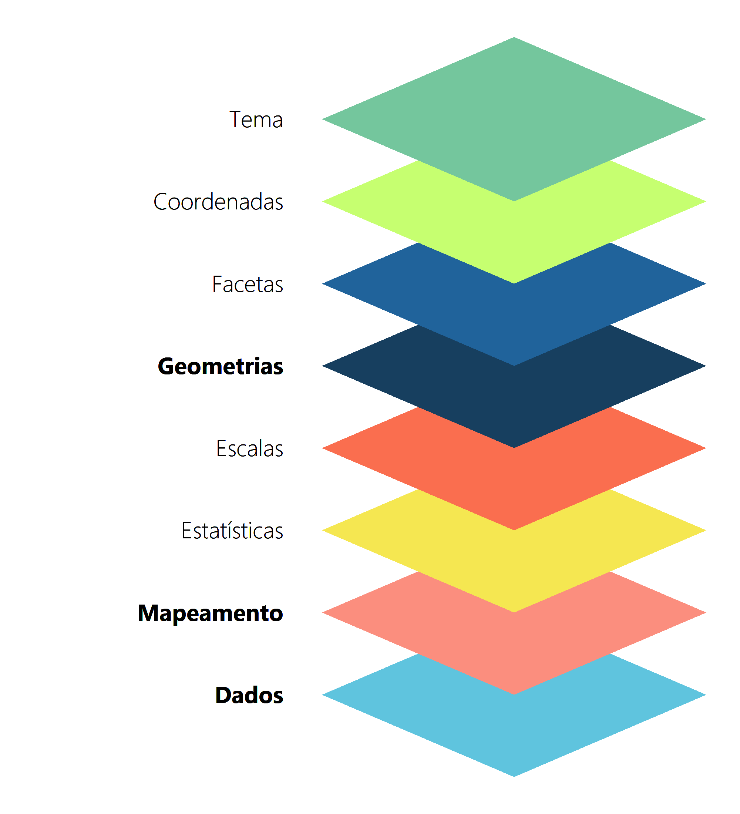
```


Tendo isso em mente, um gráfico do `ggplot` é composto por várias camadas, que em conjunto formam o gráfico desejado. A ideia por trás do pacote, portanto, é utilizar uma gramática para descrever de forma concisa, cada uma das camadas apresentadas na figura 8.2. Após definirmos essas camadas, nós podemos somá-las para construirmos o nosso gráfico final. Em outras palavras, você vai adicionando aos poucos, novas camadas ao gráfico, onde cada uma dessas camadas fica responsável por definir um componente específico do gráfico (escalas, formas geométricas, legendas, facetas, anotações, ...). Caso seja de seu desejo, você pode deixar o próprio `ggplot` responsável por definir várias das camadas apresentadas na figura 8.2. Porém, em todo gráfico do `ggplot`, você deve obrigatoriamente definir as três camadas (em negrito na figura 8.2) apresentadas a seguir, sendo portanto, as camadas **essenciais** que formam a base de todo gráfico do `ggplot`.

1. Dados: os dados que o gráfico deve expor.

2. Mapeamento estético (*aesthetic mapping*): uma descrição de como as variáveis dispostas em seus dados devem ser mapeadas para elementos visuais (ou estéticos) de seu gráfico.

3. Geometrias: são as formas geométricas do gráfico que representam os seus dados, ou seja, em um gráfico de dispersão, seus dados são representados no gráfico por *pontos*, enquanto em um gráfico de barras, seus dados são representados por *retângulos*.

A gramática do `ggplot`, representa, portanto, as regras que definem o emprego das funções necessárias, e de seus possíveis parâmetros para acessarmos e controlarmos cada uma das camadas mostradas na figura 8.2. Logo, cada uma dessas camadas, são controladas por uma função (ou por um conjunto de funções) diferente, que lhe permite o uso de diferentes mecanismos e valores em sua definição.


## Iniciando um gráfico do `ggplot`
### Dados

Primeiro, vamos definir os dados que vamos utilizar em nossos gráficos. A tabela `datasus`, contém a contagem de mortes por homicídios dolosos em 2018 no Brasil, coletados a partir dos microdados do SIM/DATASUS. Nessa mesma tabela, temos a distribuição dessas mortes, por sexo, por faixa etária, pelo estado (Unidade da Federação - UF) em que as mortes ocorreram, e pela cor de pele dos indivíduos.

```{r, include = FALSE}
library(readr)

github <- "https://raw.githubusercontent.com/pedropark99/"
pasta <- "Curso-R/master/Dados/"
arquivo <- "datasus.csv"

datasus <- read_csv2(paste0(github, pasta, arquivo))
```

```{r, eval = FALSE}
library(readr)

github <- "https://raw.githubusercontent.com/pedropark99/"
pasta <- "Curso-R/master/Dados/"
arquivo <- "datasus.csv"

datasus <- read_csv2(paste0(github, pasta, arquivo))
```

```
## Rows: 1836 Columns: 6                                                    
## -- Column specification -----------------------------------
## Delimiter: ";"
## chr (5): Faixa etaria, Genero, Cor, Nome UF, UF
## dbl (1): Contagem
##
## i Use `spec()` to retrieve the full column specification for this data.
## i Specify the column types or set `show_col_types = FALSE` to quiet
## this message.
```

```{r}
datasus
```


Vamos começar a montar o nosso gráfico. Você **sempre** inicia um gráfico de `ggplot`, pela função base do pacote - `ggplot()`. Essa função é responsável por criar o objeto base para o gráfico, e nela, possuímos dois argumentos que compõe duas das três camadas essenciais (que definimos na seção 8.2) desse gráfico, e que podem ou não ser fornecidos nessa função. Esses dois argumentos são: *data*, que é o nome da tabela onde estão os dados que serão utilizados no gráfico; e *mapping*, que é o *aesthetic mapping*, ou o mapeamento de variáveis de sua tabela, para componentes estéticos do gráfico. Ou seja, você não precisa necessariamente fornecer esses argumentos já na função `ggplot()`, pois você pode defini-los dentro das funções que formam as figuras geométricas (as funções `geom`). O importante, é que você sempre deve começar um gráfico `ggplot`, com a função `ggplot()`. 

Mas então, qual é a diferença entre eu fornecer esses argumentos na função `ggplot()` ou dentro das funções `geom`? Pense em um exemplo, no qual você busca mostrar em um mesmo gráfico, duas informações diferentes. Você pode utilizar dois `geom`'s (ou formas geométricas) diferentes para mostrar e diferenciar essas duas informações no gráfico. Por exemplo, podemos ter um gráfico que contenha barras mostrando a evolução da dívida pública, e linhas mostrando a evolução do salário médio no país. 

Caso você forneça os dois argumentos (*data* e *mapping*) na função `ggplot()`, você está dizendo ao programa, que ele deve utilizar a mesma base de dados, e o mesmo *aesthetic mapping*, em todos os formatos geométricos (`geom`) do gráfico. Enquanto, ao fornecer esses argumentos dentro de cada função `geom`, você estaria dizendo ao programa que utilize essa base de dados, e esse *aesthetic mapping*, apenas naquele formato geométrico (ou `geom`) especificamente. Tendo isso em mente, não conseguiríamos montar o gráfico descrito no parágrafo anterior, ao dar os argumentos já na função `ggplot()`. Pois o gráfico mostra duas informações diferentes (salário médio e dívida pública), ao longo dos `geom`'s do gráfico. Ou seja, os dois formatos geométricos dispostos no gráfico, utilizam dois *aesthetic mapping* diferentes. Quando chegarmos à seção 8.4 vou explicar isso em mais detalhes.

No nosso caso, os dados que vamos utilizar, estão na tabela `datasus`, por isso forneço ao argumento *data* o nome dessa tabela. Ao rodar o código logo abaixo, você vai perceber que ele gera apenas um quadro cinza vazio. Isso ocorre porque definimos apenas uma das camadas essenciais para compor o gráfico, que são os dados utilizados. Temos que definir as outras duas, para completarmos a base de um gráfico, por isso, vamos passar agora para o *aesthetic mapping*.


```{r,eval = FALSE}
ggplot(data = datasus)
```


### Mapeamento de variáveis (*Aesthetic Mapping*)

O *aesthetic mapping* representa o mapeamento, ou a conexão de variáveis em sua tabela (ou sua base de dados), com os componentes estéticos e visuais do gráfico. Nós controlamos esse mapeamento através da função `aes()`. Há diversos desses componentes visuais que compõe um gráfico, e os primeiros que vêm a sua mente, são provavelmente as cores e as formas geométricas. Mas também os próprios eixos, ou melhor dizendo, as escalas utilizadas nos eixos, são componentes visuais do gráfico. Pois essas escalas definem como as formas geométricas vão se posicionar dentro do espaço do gráfico.

Pense por exemplo, no globo terrestre. Você pode representar esse globo dentro do `ggplot`, mas para que os formatos sejam corretamente posicionados em um "globo", você precisa usar uma escala e um sistema de coordenadas diferentes do plano cartesiano. Um outro exemplo, seria o gráfico de pizza. Ao pesquisar sobre, você irá perceber que um gráfico de pizza no `ggplot`, é feito a partir do formato geométrico de barras (`geom_bar()`). Ou seja, um gráfico de barras, é o ponto de partida para gerar um gráfico de pizza no `ggplot`, e o que diferencia esses dois gráficos, é a escala usada. Em um gráfico de pizza, utilizamos uma coordenada circular, chamada de coordenada polar, ao invés do plano cartesiano.


Agora, vamos continuar montando nosso gráfico. Primeiro, vamos tentar montar um gráfico de barras, que mostre a distribuição do total de mortes ao longo das faixas etárias no país, baseado nos dados apresentados na tabela `datasus`. Tendo isso em mente, o número de mortes, deve ficar no eixo y de nosso gráfico, enquanto os grupos (faixas etárias), devem ficar no eixo x.

Essa é a base do nosso mapeamento de variáveis. Estamos definindo que o número de mortes deve ficar no eixo y, e as faixas etárias no eixo x, e nós concedemos essa descrição ao `ggplot`, dentro da função `aes()` (abreviação para *aesthetic mapping*). Dessa vez, ao rodar o código abaixo você vai perceber que um plano cartesiano foi montado, onde temos uma escala para a faixa etária no eixo x, e outra escala para o total de mortes no eixo y. Porém, esse plano cartesiano continua vazio, pois ainda não definimos a última camada essencial do gráfico, que é a forma geométrica que deve representar os nossos dados.


```{r}
ggplot(
  data = datasus,
  mapping = aes(x = `Faixa etaria`, y = Contagem)
)
```


Portanto, vamos adicionar ao nosso código, nossa primeira função `geom`. Cada função `geom`, se refere a um formato geométrico diferente. No nosso caso, queremos um gráfico de barras, que é formado pela função `geom_bar()`. O padrão dessa função (ou formato geométrico) no `ggplot`, é calcular uma contagem dos dados. Em outras palavras, o gráfico de barras no `ggplot`, se comporta inicialmente (por padrão) como um histograma. Ao invés de calcular a soma total de certa variável, ele irá contar, quantas vezes cada valor ocorre naquela variável dentro da base de dados.

Entretanto, não queremos uma contagem dos dados, pois a coluna `Contagem` já representa uma contagem em si. O que queremos é a soma total dessa contagem em cada faixa etária. Por isso, ao invés de fornecer `Contagem` ao argumento *y*, eu defino essa coluna para o argumento *weight*. Todas as funções que adicionarmos às várias camadas do nosso gráfico, devem ser conectadas por um sinal de `+`, por isso lembre-se de colocar esse sinal sempre que adicionar uma nova função ao seu gráfico.

```{r}
ggplot(
    data = datasus,
    mapping = aes(x = `Faixa etaria`, weight = Contagem)
  ) +
  geom_bar()
```


Agora que definimos as três camadas essenciais (dados, *aesthethic mapping* e `geom`), temos enfim o nosso primeiro gráfico montado. Há várias coisas que poderíamos fazer a partir daqui. Podemos por exemplo, colorir as barras de acordo com a participação do sexo no número de mortes. Ou seja, essas cores irão representar em cada barra, o número de mortes que correspondem ao sexo masculino e ao sexo feminino. Por padrão, o `geom_bar()` empilha esses agrupamentos um em cima do outro. Dessa forma, essas cores não apenas nos apresenta o número de mortes em cada sexo, mas indiretamente, elas também nos mostram o quanto que aquele grupo representa (qual a sua porcentagem) do total de mortes naquela faixa etária.

Desta maneira, estamos definindo um outro componente visual do gráfico (cores das barras) à uma outra variável de nossos dados (coluna `Genero`). Logo, estamos falando novamente do *aesthethic mapping* do gráfico, e por isso, devemos definir essa ligação dentro da função `aes()`. Há duas formas de você colorir formas geométricas no `ggplot`, que dependem da forma geométrica e do resultado que você quer atingir. Uma barra (ou retângulo), é tratada como uma forma geométrica de área, enquanto outras formas (como pontos e linhas) são tratadas de uma maneira diferente. Nesses formatos de área, você deve utilizar o argumento `fill`, para preencher o interior deste formato de uma cor. 

```{r}
ggplot(
    data = datasus,
    mapping = aes(
      x = `Faixa etaria`,
      weight = Contagem,
      fill = Genero
    )
  ) +
  geom_bar()
```


Conseguimos colorir as barras, e podemos ver que uma parte muito pequena das mortes correspondem ao sexo feminino, em todas as faixas etárias. Agora, e se mudássemos a variável de grupos (faixas etárias) do nosso gráfico? Vamos conectar uma variável diferente ao eixo x, por exemplo, a cor de pele. Perceba, que o restante do *aesthetic mapping* continua o mesmo, e portanto, o gráfico mantém essas outras "conexões" enquanto modifica a variável ligada ao eixo x.


```{r}
ggplot(
    data = datasus,
    mapping = aes(
      x = Cor,
      weight = Contagem,
      fill = Genero
    )
  ) +
  geom_bar()
```

Como disse anteriormente, há outros componentes visuais que você pode ligar às variáveis de sua tabela de dados. Você pode por exemplo, em alguns `geom`'s, conectar o *formato* desse `geom` a uma variável. Eu sei, sua cabeça provavelmente deu uma volta com esse exemplo: "Como assim? Eu posso variar o formato de uma forma geométrica ao longo do gráfico?". Na seção 8.4 dou um exemplo dessa estratégia.

### Formatos geométricos - funções `geom`

Cada função `geom` utiliza um formato geométrico e uma forma de desenho diferentes, para desenhar e representar os seus dados. No `ggplot` há vários `geom`'s distintos que você pode utilizar. Abaixo estou listando os `geom`'s mais comuns, mas basta consultar o painel de dicas do RStudio^[https://rstudio.com/wp-content/uploads/2015/03/ggplot2-cheatsheet.pdf], ou o site oficial de referências do pacote^[https://ggplot2.tidyverse.org/reference/index.html], que você ficará um pouco perdido com tantas opções. Um excelente repositório, com ótimos exemplos de gráficos dos quais você pode tirar inspirações de como e onde utilizar cada `geom`, é o *R Graph Gallery*^[https://www.r-graph-gallery.com/].

1. `geom_bar()`: desenha um gráfico de barras.

2. `geom_point()`: desenha um gráfico de pontos (ou um gráfico de dispersão).

3. `geom_line()`: desenha um gráfico de linha.

4. `geom_boxplot()`: desenha um gráfico de *boxplot*.

5. `geom_histogram()`: desenha um histograma.

6. `geom_sf()`: desenha um mapa (`geom` para dados espaciais).

7. `geom_smooth()`: desenha uma linha de média condicional (muito utilizado para desenhar linhas que representam modelos de regressão linear e de outros modelos econométricos).

8. `geom_text()`: utilizado para inserir texto.

9. `geom_label()`: utilizado para inserir rótulos, ou basicamente, textos envoltos por uma caixa.


Por exemplo, um gráfico de barras, é geralmente utilizado para apresentar estatísticas descritivas dos nossos dados. Ou seja, esse tipo de gráfico (por padrão) tenta resumir características dos seus dados em poucos números (médias, totais, contagens). Já um gráfico de dispersão (por padrão) nos apresenta diretamente os dados, de forma crua no plano cartesiano. Isto é, diferentes `geom`'s vão tratar (e principalmente, representar) os seus dados de formas distintas. Vamos por exemplo, adicionar pontos ao nosso gráfico anterior, com o `geom_point()`. 

Para facilitar a visualização, eu limitei os valores do eixo y no gráfico (para o intervalo de 0 a 1500) por meio da função `lims()`. Dessa forma, estamos dando um *zoom* em uma área específica do gráfico. Repare que cada ponto representa uma das observações encontradas na nossa base, e que vários deles estão se sobrepondo.

```{r}
ggplot(
    data = datasus,
    mapping = aes(
      x = Cor,
      weight = Contagem,
      fill = Genero
    )
  ) +
  geom_bar() +
  geom_point(aes(y = Contagem)) +
  lims(y = c(0,1500))
```

Ao substituirmos as barras por *boxplot*'s produzimos um gráfico que além de mostrar todas observações da base com o `geom_point()`, ele também mostra como a distribuição de ambos os sexos se encaixam ao longo do alcance (ou *range*) desses dados. Podemos perceber que nos indivíduos de cor parda, a maior contagem para o sexo feminino em toda a base, atinge em torno de 175 mortes, enquanto para o sexo masculino, esses valores podem atingir mais de 1000 mortes, apesar de que ambos os valores são *outliers* em suas respectivas distribuições.


```{r}
ggplot(
    data = datasus,
    mapping = aes(
      x = Cor,
      y = Contagem,
      fill = Genero
    )
  ) +
  geom_boxplot() +
  geom_point()
```

Uma outra forma de visualizarmos a diferença entre homens e mulheres nesses dados, seria utilizando `geom`'s de erro, como as linhas de alcance. Os `geom`'s de erro são muito úteis para visualizar medidas de variação ao longo dos grupos. O `geom_ribbon()` por exemplo, é utilizado em gráficos de séries temporais, para desenhar os intervalos de confiança ou desvios padrão ao redor da linha que representa a série. No nosso caso, iremos utilizar o `geom_linerange()`, para desenharmos a diferença média entre o número de mortes entre os dois gêneros.

O que o `geom_linerange()` faz é desenhar uma reta de um ponto A a um ponto B. A ideia por traz desse `geom` é desenharmos um linha que representa (pelo seu comprimento), por exemplo, o desvio padrão de uma variável, ou no nosso caso, a diferença na média de vítimas de homicídios dolosos entre dois gêneros. Isto significa que temos dois novos componentes visuais que podemos controlar no gráfico através do *aesthetic mapping*, que são as coordenadas do ponto A e do ponto B. Esses componentes (pontos A e B) representam os "limites" (máximo e mínimo) dessa linha, por isso, são controlados pelos argumentos `ymax` e `ymin` dentro da função `aes()`. Há outros `geom`'s que podem ser controlados por esses argumentos, porém, os que vimos anteriormente (`geom_point()` e `geom_bar()`) não possuem esses argumentos.

Primeiro, precisamos calcular o número médio de mortes de cada gênero e em cada cor de pele, e em seguida, modificar a estrutura da tabela, para que possamos mapear os limites (`ymin` e `ymax`) do *linerange* de acordo com o sexo. Para isso utilizo funções do pacote `dplyr`, portanto lembre-se de chamar por esse pacote com `library()`, para ter acesso a essas funções. Perceba também que eu inverti o plano cartesiano, utilizando a função `coord_flip()`.


```{r, message=FALSE}
datasus_agrup <- datasus %>% 
  group_by(Cor, Genero) %>% 
  summarise(Media = mean(Contagem)) %>% 
  pivot_wider(
    id_cols = "Cor",
    names_from = "Genero",
    values_from = "Media"
  )

ggplot(
    data = datasus_agrup,
    aes(x = Cor)
  ) +
  geom_linerange(aes(ymax = Masculino, ymin = Feminino)) +
  geom_point(aes(y = Feminino, color = "Feminino")) +
  geom_point(aes(y = Masculino, color = "Masculino")) +
  coord_flip()
```


Agora, muitas coisas estão ocorrendo neste gráfico. Primeiro, o `geom_linerange()` constrói uma linha para cada cor de pele, que vai da média de mortes no sexo feminino até a média no sexo masculino. Segundo, dois `geom_point()` são utilizados, onde cada um deles fica responsável por um dos sexos, e desenha um único ponto para cada cor de pele que indica a média de mortes para o sexo correspondente. Em seguida, eu uso `coord_flip()` para inverter o plano cartesiano. Ou seja, a variável que estava no eixo y (média de mortes) vai para o eixo x, e a variável que estava no eixo x (cor de pele) vai para o eixo y.

Certamente, esse gráfico dá um pouco mais de trabalho de construir. Porém, é uma forma mais simples de se mostrar essa diferença, e com isso, você consegue atingir um público maior. Pode ser que o seu leitor não saiba o que é um *boxplot*, e há razões razoáveis para se acreditar nisso. No Brasil, o *boxplot* não é comumente tratado no ensino básico, e sim no ensino superior, e mais especificamente, em cursos que sejam da área de exatas, ou que possuam matérias de estatística na grade curricular. Nós sabemos também que o acesso da população brasileira ao ensino superior é restrito, sendo considerado um local de "elitismo". 

Por outro lado, os alunos em geral veem as principais medidas estatísticas de posição central (média, mediana e moda) já no ensino básico, e alguns chegam a revê-las no ensino superior. Logo, as chances de seu leitor compreender a mensagem que você quer passar: "em média, os homens são as principais vítimas de homicídios dolosos, entretanto, nas populações indígenas e de cor de pele amarela, esse padrão não parece ser significativo" são maiores. Essa consideração pode ter menor peso a depender de qual seja o público que você busca atingir. Se você está publicando um artigo científico em sua área, é bem provável que os potenciais leitores deste material conheçam um *boxplot*, e portanto, saibam interpretá-lo corretamente.


## Uma outra forma de se compreender o *aesthetic mapping*

Nas seções anteriores, eu defini o *aesthetic mapping*, como a conexão entre as variáveis de sua tabela, com os componentes visuais de seu gráfico. Porém, temos uma outra forma útil de enxergarmos esse sistema. Podemos entender o *aesthetic mapping*, como um mecanismo para determinarmos quais componentes visuais vão variar, e quais vão permanecer constantes ao longo do gráfico. Ou seja, se você está definindo, por exemplo, as cores da forma geométrica (`geom`) que representa os seus dados, você pode utilizar o *aesthetic mapping* para definir se e como essas cores vão variar ao longo do gráfico.

Por exemplo, vamos voltar ao gráfico de barras que montamos na seção 8.3, que mostra o número total de mortes ao longo das diferentes cores de pele e gênero da base. Perceba, que a cor está variando dentro de cada barra (e não entre cada uma delas), de acordo com a variável `Genero`. 

```{r}
datasus %>% 
  ggplot() +
  geom_bar(
    aes(x = Cor, weight = Contagem, fill = Genero)
  )
```


Nós podemos modificar a forma como essas cores variam dentro de cada barra, ao mudarmos a variável que define essa variação. Em outras palavras, podemos alterar o comportamento das cores, ao conectar esse componente em `aes()`, a uma outra variável de nossa tabela. Como exemplo, podemos atribuir às UF's da base. Perceba que temos agora, uma variação muito maior de cores dentro de cada barra.

```{r}
datasus %>% 
  ggplot() +
  geom_bar(
    aes(x = Cor, weight = Contagem, fill = UF)
  )
```

Nós podemos ainda, atribuir a mesma variável alocada no eixo x para definir a variação dessas cores ao longo do gráfico. Dessa forma, temos um gráfico onde cada uma das barras terá a sua própria cor. Isso não é particularmente útil, mas talvez você deseja ter uma cor separada para cada barra, e caso você esteja com preguiça de pensar e definir quais cores serão essas, deixar essa tarefa nas mãos do próprio `ggplot` é uma solução e um atalho simples para atingir um bom resultado.

```{r}
datasus %>% 
  ggplot() +
  geom_bar(
    aes(x = Cor, weight = Contagem, fill = Cor)
  )
```


Portanto, ao conectarmos diferentes variáveis com o argumento (`fill`) em `aes()`, que define como as cores de cada barra são compostas, podemos modificar a forma como essas cores variam ao longo do gráfico. Mas e se nós quisermos manter uma única cor para essas barras, ou seja, e se é de seu desejo manter as cores constantes ao longo de todo o gráfico? Para isso, basta que você defina essas cores, fora de `aes()`.

Em outras palavras, a função `aes()` trabalha com **variáveis**, ou atributos de suas observações que tendem a variar ao longo de sua base. Quando você estiver trabalhando com valores constantes, ou com atributos que possuem um único valor possível ao longo de toda a sua base, a função `aes()` provavelmente não será o lugar ideal para trabalharmos com tais valores.

Por exemplo, o R possui diversas cores pré-programadas em seu sistema, e sempre que você quiser acessar essas cores ao longo do `ggplot`, você pode se referir a elas, através de seus nomes registrados. Caso queira uma lista com os nomes dessas cores pré-programadas, você pode utilizar a função `colors()`. Dentre essas diversas cores, temos uma chamada de `steelblue`. Logo, caso eu queira que todas as barras do meu gráfico estejam coloridas de acordo com essa cor, eu preciso fornecer o nome dessa cor ao argumento `fill`, de fora da função `aes()`.

```{r}
datasus %>% 
  ggplot() +
  geom_bar(
    aes(x = Cor, weight = Contagem),
    fill = "steelblue"
  )
```


Portanto, você pode aplicar essa metodologia para qualquer outro componente visual de seu gráfico que pode ser definido. Ou seja, se você deseja manter algum dos componentes visuais, definidos por um dos argumentos de `aes()` (`fill`, `color`, `size`, `fontface`, `linetype`, `shape`, etc.), constantes, você precisa apenas definir esses argumentos fora de `aes()`. Por outro lado, caso você queira controlar a forma como algum desses componentes visuais variam ao longo do gráfico, você precisa definir esses argumentos dentro de `aes()`.


Porém, você talvez se pergunte: o que ocorre se eu fornecer a cor `steelblue` dentro de `aes()`? Será que o `ggplot` reconhece que queremos aplicar essa cor sobre as formas geométricas do gráfico? A resposta curta é não, mas o resultado em geral é um pouco estranho, ou no mínimo algo inesperado. Pois em um caso como esse, a função `aes()` irá entender que você deseja colorir as barras no gráfico, de acordo com uma nova variável em sua tabela, chamada `fill`, e que possui um único valor possível ao longo da base, mais especificamente, o texto `steelblue`. 

Esse comportamento ocorre sempre que você fornece um valor em texto (um *string*) à algum argumento de `aes()`. Em uma situação como essa, o `ggplot()` parece criar uma nova variável em sua tabela chamada `fill`, e que contém o valor em texto que você forneceu a esse argumento. Isso não necessariamente é um comportamento inadequado, mas ele certamente surpreende alguns usuários, e como ele tem se mantido ao longo das últimas versões do `ggplot`, é possível que ele continue a funcionar dessa forma, por um bom tempo.

```{r}
datasus %>% 
  ggplot() +
  geom_bar(
    aes(x = Cor, weight = Contagem, fill = "steelblue")
  )
```


## Sobrepondo o *aesthetic mapping* inicial em diversas camadas

Agora, vou explicar em maiores detalhes qual é a diferença entre: preenchermos os argumentos de `data` e `mapping` já na função inicial do gráfico (`ggplot()`), e de preenchê-los nas funções `geom`.

Para isso, vamos usar outros dados. Na tabela PIB eu possuo uma série histórica mensal do índice de faturamento real da indústria (`Faturamento_indus`), da porcentagem do PIB que representa a dívida pública líquida (`Divida_liq_perc`), e a média mensal da taxa de investimento produtivo (taxa de formação bruta de capital fixo - `FBCF`) na economia brasileira, além de dados de PIB, coletados do IPEAData^[http://www.ipeadata.gov.br/Default.aspx].

```{r, include = FALSE}
PIB <- read_csv2('Dados/Serie_PIB.csv')

PIB$Data <- parse_date(PIB$Data, format = "%d/%m/%Y")
```
```{r}
PIB
```


Na seção 8.3, expliquei que ao preencher os argumentos já no `ggplot()` você estaria pedindo ao programa, que utilize a mesma base de dados e/ou o mesmo *aesthetic mapping* ao longo de todas as camadas do gráfico. Como exemplo, veja o que acontece no gráfico abaixo. 

Como o `geom_bar()` busca resumir os nossos dados em poucas estatísticas, eu coloquei dessa vez o valor *"identity"* no argumento `stat`. Isso impede que ele agrupe os dados em alguma medida estatística, fazendo com que o `geom` apenas identifique os valores que aparecem na base, da mesma forma que um `geom_point()` faria. Perceba também, que eu estou utilizando três `geom`'s diferentes no gráfico. Mas como eu não defini um *aesthetic mapping* específico em cada um deles, todos esses `geom`'s estão mostrando exatamente a mesma informação. Dito de outra forma, estes `geom`'s estão utilizando o mesmo *aesthetic mapping*, o qual definimos na função `ggplot()`.

```{r}
ggplot(
  data = PIB,
  aes(x = Data, y = Faturamento_indus)
  ) +
  geom_bar(stat = "identity", fill = "darkgray") +
  geom_line(color = "blue") +
  geom_point(color = "red")
```


Você deve estar pensando: "Ok, mas isso não faz sentido! Por que eu usaria três `geom`'s diferentes para uma mesma informação?". Bem, pode ser que você queira utilizar mais de um `geom` que mostre a mesma informação, por questões estéticas no gráfico. Um exemplo simples, seria marcar a borda de uma linha criada por `geom_line()`. Ou seja, não há uma forma direta e simples em `geom_line()` (algo que já é possível de ser feito no `geom_point()`), de pintar essas bordas de uma cor mais escura (ou clara) do que o interior da linha, dando assim uma maior ênfase para aquela linha. Portanto, a ideia seria criarmos duas camadas de `geom_line()`: uma interna, com uma linha mais estreita e de cor mais clara (ou mais escura); e uma externa, com uma linha mais larga (de forma que ela "transborde" para fora da linha interna) e de cor mais escura (ou mais clara). 

De qualquer maneira, esses `geom`'s não fazem muito sentido da forma como estão dispostos no momento, portanto, vamos mudar de estratégia. Por que não utilizamos um só `geom` para apresentar três informações diferentes?! Para isso, temos que modificar a nossa base levemente. O objetivo é pegar as três colunas com as variáveis que vamos plotar (`Faturamento_indus`, `FBCF` e `Divida_liq_perc`), e agrupá-las em duas colunas: uma com os valores dessas variáveis, e outra coluna com os nomes dessas variáveis, para identificar qual variável o valor na primeira coluna se refere. Realizamos esse trabalho pela função `pivot_longer()`.


```{r}
PIB_remodelado <- PIB %>% 
  select(Data, Faturamento_indus, FBCF, Divida_liq_perc) %>% 
  pivot_longer(
    cols = c("Faturamento_indus", "FBCF", "Divida_liq_perc"),
    names_to = "Nome_variavel",
    values_to = "Valor"
  )

ggplot(
  data = PIB_remodelado,
  aes(x = Data, y = Valor, linetype = Nome_variavel)
  ) +
  geom_line() 
```


Novamente, como não incluímos uma função `aes()`, ou definimos o argumento `data` dentro do `geom_line()`, ele irá utilizar o `data` e o *aesthetic mapping* (`aes()`) que definimos em `ggplot()`. Lembra de quando eu disse que você poderia controlar o formato de um `geom` de acordo com uma variável? O gráfico acima é um exemplo prático disso. Estamos utilizando apenas um `geom` para mostrar três informações diferentes, e o componente estético que utilizamos para diferenciar essas informações no gráfico, é o formato dessas linhas. Portanto, ao definirmos o componente `linetype` para *Nome_variavel*, estamos modificando o formato da linha (tracejada ou sólida), de acordo com os valores dessa variável. Poderíamos usar a mesma estratégia em `geom_point()`, ao definirmos o argumento `shape` para *Nome_variavel*. O resultado, seria um gráfico com pontos de três formatos diferentes (triângulos, quadrados e pontos comuns).

Entretanto, para utilizarmos essa estratégia, nós tivemos que reestruturar a nossa base de dados pela função `pivot_longer()`. E se você não quisesse modificar essa base? Infelizmente, sem essa modificação, não poderíamos mostrar as três variáveis utilizando apenas uma função `geom`, mas poderíamos realizar o mesmo trabalho com uma função `geom` para cada variável. Neste caso, teremos que utilizar um *aesthetic mapping* diferente para cada `geom`, pois cada um deles, ficará responsável por mostrar os valores de uma variável diferente.

No primeiro gráfico dessa seção, utilizamos três `geom`'s diferentes para mostrar uma mesma informação. Se você comparar o código desse primeiro gráfico, ao código do gráfico abaixo, você perceberá que eles são quase idênticos, o que mudou, é a presença da função `aes()` nos dois últimos `geom`'s.


```{r}
ggplot(
  data = PIB,
  aes(x = Data, y = Faturamento_indus)
  ) +
  geom_bar(stat = "identity", fill = "darkgray") +
  geom_line(aes(y = FBCF), color = "blue") +
  geom_line(aes(y = Divida_liq_perc), color = "red")
```


O único `geom` que não possui uma função `aes()` definida, é o `geom_bar()`, logo, esse `geom` vai seguir o *aesthetic mapping* que definimos em `ggplot()`. Já os outros dois `geom`'s, vão seguir o *aesthetic mapping* que definimos em seus respectivos `aes()`. Porém, repare que em ambos `geom`'s, eu apenas defini a variável mapeada para o eixo y, não cheguei a definir uma nova variável para o eixo x. Quando isso ocorre, a função irá novamente recorrer ao *aesthetic mapping* que você definiu em `ggplot()`. Ou seja, como não definimos uma nova variável para o eixo x, todos os `geom`'s do gráfico acabam utilizando a variável no eixo x definida em `ggplot()`.

Portanto, você pode sobrepor por completo, ou parcialmente, o *aesthetic mapping* definido em `ggplot()` em cada `geom`, basta omitir os termos dos quais você não deseja sobrepor na nova função `aes()`. Um outro detalhe, é que não chegamos a definir em nenhum momento, um novo valor para o argumento *data* em algum `geom`. Logo, apesar de estarmos utilizando diferentes *aesthetic mappings*, todos os `geom`'s estão utilizando a mesma base de dados.

### Resumo da estrutura básica de um gráfico `ggplot()`

Em resumo, todo gráfico do `ggplot()` possui três camadas essenciais, que formam a base do gráfico: 1) *data*, a base (ou bases) de dados utilizada no gráfico em questão; 2) *aesthetic mapping*, o mapeamento, ou a ligação de variáveis presentes na base de dados, para componentes estéticos e visuais do gráfico; 3) *geom*, a forma geométrica (retângulos, pontos, polígonos, linhas, etc) que irá representar os seus dados no gráfico.

Para construir um gráfico do `ggplot()`, você deve sempre definir esses componentes. Os dois primeiros (*data* e *aesthetic mapping*), podem ser definidas dentro da função `ggplot()`, já o terceiro (*geom*), você define ao utilizar uma (ou várias) das funções `geom`, em uma (ou em várias) das camadas do gráfico. Com isso, temos uma estrutura básica como a definida abaixo, para construirmos um gráfico do `ggplot`:

```{r,eval=FALSE}
ggplot(
  data = <sua base de dados>,
  aes(<aesthetic mapping>)
  ) +
  <geom_...> #uma função geom a seu gosto
```

Lembre-se que essa é apenas uma estrutura básica. Como mostramos na seção 8.4, podemos sobrepor de diversas formas essa estrutura. E podemos definir diversos outros parâmetros sobre essa estrutura como foi mostrado ao longo do capítulo.


## Uma discussão sobre os principais `geom`'s

Nas próximas seções vamos descrever rapidamente como grande parte dos principais `geom`'s se comportam, e quais são os argumentos (ou os componentes estéticos) que podemos controlar através da função `aes()`. Dessa forma, você pode rapidamente se familiarizar com esses `geom`'s, adquirindo um vocabulário das funções que os representam, e que cobrem a maior parte dos gráficos realizados no dia-a-dia.

Lembre-se que há várias funções `geom` diferentes, das quais muitas não serão descritas aqui. Muitas deles utilizam o mesmo formato geométrico (linhas, retângulos, ...), mas desenham esse formato de uma maneira diferente, além de possuírem outros componentes estéticos que podem ser controlados pelo *aesthetic mapping* do gráfico. 

Caso você não encontre aqui, o formato geométrico que está procurando, ou a função `geom` que realiza o desenho da forma como você deseja, você pode consultar a página oficial do pacote^[https://ggplot2.tidyverse.org/reference/index.html]. A página não possui uma versão em português, porém, você deve se virar razoavelmente bem com ferramentas de tradução (como o Google Tradutor) nessas situações. Se isso não for suficiente, você talvez encontre suas dúvidas em outros materiais construídos por brasileiros, como o blog *Curso R*^[https://www.curso-r.com/material/ggplot/], o material do departamento de Estatística da UFPR^[http://www.leg.ufpr.br/~walmes/cursoR/data-vis/index.html], ou dentro de alguma pergunta postada na página em português do *StackOverflow*^[https://pt.stackoverflow.com/]. O *R Graph Gallery*^[https://www.r-graph-gallery.com/] é um repositório (em inglês) que possui exemplos dos mais diversos `geom`'s, e que serve como a referência perfeita para os momentos em que você não lembra qual o `geom` que desenha o tipo de gráfico que procura.


### Gráficos de dispersão e gráficos de bolha

Gráficos de dispersão são formados por `geom_point()`. Esse `geom` (por padrão) não transforma os seus dados, ou em outras palavras, ele não busca resumi-los de alguma maneira. Cada ponto desenhado no plano cartesiano representa cada uma das linhas presentes em sua base de dados. Os `geom`s que possuem este comportamento, são comumente chamados de `geom`'s individuais. Por este padrão, você deve obrigatoriamente definir as variáveis de ambos os eixos (x e y), neste `geom`.

Nos exemplos abaixo, estou utilizando a tabela `mpg` que vêm junto do `ggplot`, e nos apresenta dados de consumo de combustível de diversos modelos de carro, para mais detalhes desses dados, execute `?mpg` no console. Os gráficos nos mostram uma relação aparentemente negativa entre volume ocupado pelos pistões no motor (`displ`), e a quilometragem por litro de gasolina (`hwy`). 

Após definir os eixos, você pode pintar os pontos de acordo com uma terceira variável, por exemplo, a classe do carro (compacto, SUV, minivan, ...), através do argumento *color*. A classe do carro é uma variável categórica, e por isso, o `ggplot()` irá buscar cores contrastantes para pintar os pontos. Mas você também pode definir uma variável contínua a este argumento, onde neste caso, o `ggplot()` irá criar um gradiente de cores para pintar os pontos. Uma outra possibilidade deste `geom`, é variar o formato dos pontos através do argumento *shape*.

A partir de `geom_point()` você também pode construir um gráfico de bolha, através do argumento *size*. Este tipo de gráfico em geral, piora o *overplotting*, ou a sobreposição dos pontos, já que alguns ficam muito grandes. Nestas situações, o argumento *alpha* é bem útil, sendo ele definido por um número de 0 a 1, indicando uma porcentagem de opacidade do `geom`. Por padrão, ele é configurado para 1 (100%), já no exemplo, eu reduzo essa opacidade para 40%.

```{r}
ggplot(data = mpg) +
  geom_point(aes(x = displ, y = hwy))
```

```{r}
ggplot(data = mpg) +
  geom_point(aes(x = displ, y = hwy, color = class))
```

```{r}
ggplot(data = mpg) +
  geom_point(aes(x = displ, y = hwy, color = class, shape = drv))
```

```{r}
ggplot(data = mpg) +
  geom_point(aes(x = displ, y = hwy, size = cyl), alpha = 0.4)
```


Você pode se aproveitar do componente *shape* para diferenciar, ou destacar as bordas dos pontos, ao escolher o *shape* 21. Este método é esteticamente atraente, e fica muito bom em conjunto com linhas. Dessa forma, você pode pintar o interior dos pontos de uma cor, utilizando *fill*, e a borda desse ponto de outra cor, utilizando *color*. Lembre-se que isso só é possível, pelo *shape* que escolhemos para estes pontos, em outras situações, você poderá colorir pontos apenas com uma cor, utilizando o *color*. No exemplo abaixo, eu deixo todos os três argumentos de fora de `aes()`, dessa forma, o `ggplot` mantém os valores que dei a cada um deles, constantes ao longo de todo o gráfico.

```{r}
ggplot(data = mpg) +
  geom_point(
    aes(x = displ, y = hwy),
    shape = 21,
    color = "black",
    fill = "steelblue"
  )
```


### Gráficos de barra

Como descrevi anteriormente, os gráficos de barras no `ggplot()` são formados pelo `geom_bar()`, e em geral, são utilizados para apresentar estatísticas que resumem os dados em poucos números (como totais, médias, medianas). Em outras palavras, os `geom`'s que tem este comportamento, buscam representar várias observações de sua base, com um único formato geométrico, e são comumente chamados de `geom`'s coletivos. Por essa razão, o argumento *stat* é importante neste `geom`, pois nele você pode conceder o valor *identity*, que evita este comportamento, e faz com que o `geom` apenas identifique os valores que você fornece a ele. 

No `ggplot`, este `geom` foi criado com o intuito de permitir que o usuário construa rapidamente gráficos de contagens e somatórios. Portanto, este `geom` possui mecanismos para calcular essas estatísticas, você não precisa calculá-las por conta própria antes de gerar o `ggplot`. Por padrão, este `geom` calcula inicialmente uma contagem dos seus dados. Logo, caso você não defina qual a estatística que deseja mostrar, ele irá contar a quantidade que cada valor aparece na base. Por exemplo, o gráfico abaixo nos mostra que dentro da tabela `mpg`, temos em torno de 80 modelos com motores de 4 ou 6 cilindradas, e menos de 10 modelos com 5 cilindradas. 


```{r,size = "footnotesize"}
  ggplot(
    data = mpg,
    aes(x = cyl)
  ) +
  geom_bar()
```


Tendo essas considerações em mente, você tem duas opções básicas ao lidar com este `geom`: 1) fornecer diretamente os dados, e pedir ao `geom` que calcule as estatísticas que você deseja mostrar (contagem ou somatório); ou 2) você primeiro calcula as estatísticas que deseja, e pede ao `geom` que apenas as identifique, sem realizar nenhuma transformação desses dados. Caso opte pela opção 2, você deve **tomar muito cuidado** com o argumento `stat = "identity"`, por razões que vou explicar abaixo.

Este `geom` não possui um mecanismo próprio para calcular médias (e muitas outras estatísticas), e portanto, se você quiser mostrá-las utilizando este `geom`, você terá de calcular separadamente essas médias, e pedir ao `geom` que apenas as identifique com `stat = "identity"`.

```{r}
medias <- mpg %>% 
  group_by(cyl) %>% 
  summarise(media = mean(hwy))

  ggplot(
    data = medias,
    aes(x = cyl, y = media)
  ) +
  geom_bar(stat = "identity")
```


Porém, caso você queira calcular o total, ou o somatório em cada grupo, você pode apenas definir a coluna com os valores a serem somados, para o argumento *weight* dentro de `aes()`.

```{r}
  ggplot(
    data = mpg,
    aes(x = cyl, weight = hwy)
  ) +
  geom_bar()
```

Agora, lembra quando eu disse que você pode pedir ao `geom` que apenas "identifique" os valores de sua base (com `stat = "identity"`) ? Com este argumento, o `geom_bar()` irá ter um comportamento diferente, caso os valores em cada grupo não sejam únicos. No exemplo anterior, em que calculei as médias de cada `cyl` em `mpg`, o `geom` apenas identificou as médias de cada `cyl`, pois há apenas **uma única** média para cada `cyl`. No exemplo abaixo, estou criando rapidamente uma tabela, e nela você pode perceber que há dois valores para o grupo `"c"`. Agora, repare o que acontece no gráfico, o `geom_bar()` acaba somando estes valores.

```{r}
tab <- data.frame(
  grupo = c("a","b","c","c","d"),
  valor = c(1,2,3,2,2)
)

ggplot(tab, aes(x = grupo, y = valor)) +
  geom_bar(stat = "identity")
```


Em outras palavras, se os seus dados estiverem **agrupados**, o `geom_bar()` com `stat = "identity"` irá de fato apenas identificar estes valores. Mas caso os seus dados estiverem desagregados, com mais de um valor por grupo, o `geom_bar()` irá somar estes valores. Isso significa, que `stat = "identity"` representa uma outra alternativa (além de *weight*), para criar gráficos de somatório. Bastaria fornecer a coluna com os valores a serem somados para o eixo y em `aes()`, e adicionar `stat = "identity"` à `geom_bar()`.


Um outro ponto importante neste `geom`, é o posicionamento das barras. Por padrão, o `geom` empilha barras que ocupam o mesmo valor no eixo x no gráfico. Isso nos permite visualizarmos a participação dos grupos de uma outra variável categórica (cor de pele, faixa etária, ...), em cada valor presente no eixo x. Por outro lado, você talvez esteja interessado na diferença entre os grupos, e não a sua participação. Logo, você talvez queira jogar essas barras uma do lado da outra, e para isso você deve utilizar o argumento *position*, dando o valor *"dodge"*. No exemplo abaixo, retorno a base de dados `datasus`, com o objetivo de mostrar a diferença em cada cor de pele, da média de vítimas para cada sexo.


```{r, message=FALSE}
medias <- datasus %>% 
  group_by(Cor, Genero) %>% 
  summarise(media = mean(Contagem))

  ggplot(
    data = medias,
    aes(x = Cor, y = media, fill = Genero)
  ) +
  geom_bar(stat = "identity", position = "dodge") 
  
```


Portanto, caso você não definisse *position* para *dodge*, o `ggplot` iria empilhar essas barras (azul e vermelho) uma em cima da outra. Em um gráfico de médias como o acima, não faria muito sentido empilhar essas barras, porém, este posicionamento faz muito sentido em gráficos de somatório, como os que fizemos na seção 8.3. Pois dessa forma você consegue visualizar o quanto que cada grupo representa do total.

Você talvez queira ir um pouco além, e observar as diferenças na participação de cada cor de pele, ao longo dos totais de vários grupos. Para isso, você pode dar o valor *fill* ao argumento *position*. Dessa forma, o `ggplot` calcula qual é a proporção de cada grupo para cada valor do eixo x, em uma escala de 0 a 1. Nesta situação, você deve definir a variável do eixo y, para o argumento *weight* em `aes()`.

```{r}
  ggplot(
    data = datasus,
    aes(x = `Faixa etaria`, weight = Contagem, fill = Cor)
  ) +
  geom_bar(position = "fill") 
```


### Gráficos de linha

Gráficos de linha são muito utilizados em séries temporais, para mostrar a evolução de algum índice ao longo do tempo. Este tipo de gráfico é criado pelo `geom_line()`, que possui um comportamento de "conector".

O `geom_line()` (diferentemente de seu irmão `geom_path()`) sempre ordena os valores da base (antes de conectá-los), segundo a variável alocada no eixo x, na ordem que seja mais lógica para essa variável. Veja o exemplo abaixo, onde dou um vetor de datas (fora de ordem) para o eixo x. Independente da ordem em que os valores estiverem em sua base, a função irá reordenar a base antes de conectar os pontos. 


```{r}
tab <- data.frame(
  dia = as.Date(c("2020-01-01","2020-01-04","2020-01-02","2020-01-03")),
  valor = c(10,27,14,23)
)

ggplot(tab, aes(dia, valor)) + geom_line()
```


Isso significa, que este `geom` funciona com qualquer variável no eixo x que possua uma ordem lógica, seja ela contínua ou categórica. Veja no exemplo abaixo, onde eu substituo a coluna `dia`, por um simples vetor de texto. Ao detectar o tipo de dado presente na coluna, a função reordena os valores de acordo com a ordem lógica para este tipo de dado (no exemplo abaixo, ordem alfabética).

```{r}
tab$dia <- c("a","c","d","b")

ggplot(tab, aes(dia, valor, group = 1)) + geom_line()
```

Conhecer essa funcionalidade é importante, ao fornecer para o `geom` dados dos quais ele não consegue reconhecer o formato e a ordem correta. Pense por exemplo, se você fornecesse um vetor de datas, mas no formato "abril/2020". Como os valores começam por um nome, ele reconhece estes valores como texto, e, portanto, ordena-os em ordem alfabética, ao invés de ordená-los como meses do ano. Nessas situações, transformar esses valores para fatores, e definir a sua ordem em seu atributo `levels`, é a melhor alternativa.

```{r}
tab$dia <- c("Janeiro/2020", "Abril/2020", "Fevereiro/2020", "Março/2020")

ordem <- c("Janeiro/2020", "Fevereiro/2020", "Março/2020", "Abril/2020")

ggplot(
    tab,
    aes(factor(dia, levels = ordem), valor, group = 1)
  ) +
  geom_line()
```

Eu costumo aumentar a grossura dessas linhas através do argumento *size*, que por padrão está configurado para 0.5. Geralmente 1 já é um bom nível para mim, mas você pode aumentar o quanto quiser. Como eu quero que a grossura, permaneça constante ao longo de toda a linha, eu mantenho o argumento *size* de fora do `aes()`. Isso significa que você poderia variar essa grossura ao longo da linha, apesar de que o resultado seria um tanto esquisito. Tente por exemplo, adicionar ao `aes()` do exemplo anterior, o valor `size = valor`, e veja o resultado.


Neste `geom`, o argumento *group* em `aes()` é muito importante. Este argumento controla como o `geom` considera os grupos da base, na hora de desenhar o formato geométrico em questão. No primeiro exemplo dessa seção, nós não utilizamos este argumento, pois a variável ligado ao eixo x (`dia`) era uma variável contínua. Entretanto, no instante em que mudamos os valores dessa coluna para texto, tivemos que adicionar um `group = 1` ao `aes()`. Logo, quando você ligar uma variável contínua ao eixo x, muito provavelmente você não precisará mexer com o *group*. Caso a variável seja categórica, é certo que algum valor deve ser dado ao argumento *group*.


Isso é apenas uma simplificação, que serve como um guia inicial, mas que nem sempre se aplica. Pois o *group* não diz respeito ao tipo de variável (contínua ou categórica), e sim se você quer separar ou não as linhas por algum agrupamento. Se você está apenas querendo mostrar uma única linha no gráfico, essa simplificação será útil. Mas com o tempo você vai se pegar utilizando o *group*, para mostrar em um mesmo gráfico a evolução de vários índices diferentes ao longo do tempo, mesmo que a variável no eixo x (datas) seja uma variável contínua. Basta relembrar o exemplo da seção 8.4, em que utilizamos *linetype* para diferenciar as curvas de três indicadores diferentes em um mesmo `geom_line()`. Você poderia replicar o mesmo gráfico utilizando *group*, ao invés do *linetype*.


Essa questão fica mais clara, ao utilizarmos uma base que possui mais de um valor por grupo. Veja por exemplo a base `Oxboys`, que vem do pacote `mlmRev`. Essa base é resultado de uma pesquisa, onde os pesquisadores acompanharam durante vários anos, o crescimento de alguns indivíduos.

```{r}
head(mlmRev::Oxboys, n = 10)
```

Portanto, a coluna `Subject` identifica qual o indivíduo os valores da linha se referem. Repare que várias linhas dizem respeito ao mesmo indivíduo. Agora, pense como o `geom_line()` trataria esses diversos valores que se encaixam no mesmo grupo (no nosso caso, no mesmo `Subject`). Neste caso, o `geom_line()` irá conectar (incorretamente) todos os valores em conjunto da base, pois ele não sabe que cada um desses valores pertence a sujeitos diferentes, o `geom` pensa que todos esses valores pertencem a um único sujeito. O resultado seria um gráfico com um aspecto de "serra".

```{r, include=FALSE}
Oxboys <- mlmRev::Oxboys
```

```{r}
ggplot(
  Oxboys,
  aes(x = age, y = height)
) +
  geom_line()
```

Para que isso fique claro, eu adicionei um `geom_point()` para que você veja cada um dos valores presentes na base. Primeiro, preste atenção nas variáveis que conectamos aos eixos do gráfico (idade e altura do indivíduo). Ambas as variáveis são contínuas, mas neste momento, não há qualquer variável no gráfico que possa identificar a qual dos indivíduos, cada um desses valores se refere. Logo, o `geom_line()` acaba conectando todos esses pontos juntos. 


```{r}
ggplot(
  Oxboys,
  aes(x = age, y = height)
) +
  geom_line() +
  geom_point()
```

Ao invés do `geom_line()` conectar todos esses pontos em conjunto, o `geom` deveria conectar todos os pontos que dizem respeito ao mesmo indivíduo, e é para isso que o argumento `group` serve. Você define neste argumento, qual a coluna que identifica qual é o grupo (ou no nosso caso, o indivíduo) que está sendo tratado em cada observação de sua base de dados.

```{r}
ggplot(
  Oxboys,
  aes(x = age, y = height, group = Subject)
) +
  geom_line() +
  geom_point()
```


Uma outra forma de definirmos esses grupos para o `geom`, é colorindo as linhas com o argumento *color*, ou então variando o formato dessas linhas com o argumento *linetype*. Basta você fornecer a estes argumentos, uma coluna que seja capaz de identificar cada um dos grupos ou indivíduos (no nosso caso, `Subject`) que estão sendo tratados no gráfico.

```{r}
ggplot(
  Oxboys,
  aes(x = age, y = height, color = Subject)
) +
  geom_line()
```

Portanto, toda vez em que utilizar este `geom` em uma base que possui mais de um valor por grupo, você muito provavelmente terá de utilizar *group*, especialmente se você precisa diferenciar as curvas de cada grupo no gráfico. 

Se você quiser mostrar uma única linha no gráfico, você vai mexer obrigatoriamente com o *group* caso a variável do eixo x seja categórica, onde neste caso, você deve dar uma constante qualquer ao argumento (eu geralmente defino para 1: `aes(group = 1)`). Isso é necessário, porque `geom_line()` entende que cada um dos valores dessa variável categórica, representa um grupo diferente. Dessa forma, cada um desses grupos irá possuir apenas um valor em toda a base. Caso você se esqueça de definir este valor para *group* nesta situação, o seguinte erro irá aparecer: 

```{r, eval = FALSE, highlight = FALSE}
# Each group consists of only one observation. Do you need to adjust the group
# aesthetic?
```


### Histogramas e outros gráficos de frequência
Histogramas e polígonos de frequência são gráficos "unidimensionais", ou dito de outra forma, apresentam informações sobre apenas uma variável, mais especificamente uma variável contínua. Por essa razão, você precisa definir apenas um dos eixos do gráfico, geralmente, o eixo x. Estes gráficos são criados por `geom_histogram()` e `geom_freqpoly()`.

```{r}
ggplot(mpg, aes(hwy)) + geom_histogram()

ggplot(mpg, aes(hwy)) + geom_freqpoly()
```


Ambos os gráficos funcionam da mesma forma, apenas a forma geométrica utilizada é diferente. Eles pegam a distribuição da variável ligada ao eixo x, e dividem essa distribuição em vários intervalos (chamados de *bin*'s), e contam quantos valores se encaixam em cada um destes intervalos. Neste `geom`, é importante que você teste diferentes larguras para estes intervalos, através do argumento *binwidth*. Por padrão, o `geom` tenta dividir a distribuição em 30 intervalos diferentes.

Você pode separar as distribuições por alguma variável categórica, dando essa variável ao argumento *group*. Porém, essas distribuições estarão sobrepostas no gráfico, sendo impossível diferenciá-las. Logo, é necessário que você mostre essas distribuições separadas em diferentes facetas do gráfico (através da função `facet_wrap()`). 

```{r}
ggplot(mpg, aes(hwy, group = cyl)) +
  geom_histogram() +
  facet_wrap(~class)
```


O `geom_freqpoly()` não sofre seriamente deste problema, pois a sua forma geométrica é "oca". Mas é interessante de qualquer forma, que você ou separe essas distribuições em diferentes facetas do gráfico, ou então, que colora as distribuições de acordo com a variável categórica utilizada.

```{r}
ggplot(mpg, aes(hwy, color = class)) +
  geom_freqpoly() 

ggplot(mpg, aes(hwy, fill = class)) +
  geom_histogram() +
  facet_wrap(~class)
```

Uma alternativa a estes `geom`'s, é o `geom_density()` que calcula uma função de densidade para a variável escolhida. Caso esteja interessado em separar essa distribuição de acordo com uma variável categórica, eu recomendo que dê uma olhada no pacote `ggridges`. Este pacote fornece novos `geom`'s, que posicionam essas distribuições separadas de uma forma esteticamente atraente, sem a necessidade de construir diferentes facetas do mesmo gráfico, além de fornecer mecanismos para marcar os percentis da distribuição no gráfico. É mais fácil ver com seus próprios olhos ^[Veja a página oficial do pacote: https://cran.r-project.org/web/packages/ggridges/vignettes/introduction.html], do que eu explicar.

Caso você prefira permanecer com o `geom` padrão do `ggplot` e ainda separar a distribuição por uma variável categórica, você pode utilizar o argumento *alpha* para reduzir a opacidade dessas distribuições, como um meio de combater a sobreposição. Mas o ideal, é que você as separe em diferentes facetas, utilizando `facet_wrap()` da mesma forma que fizemos para os histogramas.

```{r}
ggplot(mpg, aes(hwy, fill = class)) + geom_density(alpha = 0.4)
```


### Adicionando textos ao gráfico

Você pode adicionar rótulos ao seu gráfico com `geom_label()`, ou adicionar textos simples com `geom_text()`. Estes `geom`'s funcionam exatamente como o `geom_point()`, porém, ao invés de desenharem pontos, eles desenham textos. Em outras palavras, eles são `geom`'s individuais, em que desenham um texto, ou um rótulo, para cada uma das observações de sua base de dados.

Dessa vez, você deve definir a coluna que contém os rótulos/textos que deseja mostrar no gráfico, no argumento *label* em `aes()`. Os rótulos serão posicionados no plano cartesiano de acordo com os valores definidos pelas variáveis ligadas aos eixos x e y. 

```{r}
ggplot(mpg, aes(x = displ, y = hwy, label = model)) +
  geom_text()

ggplot(mpg, aes(x = displ, y = hwy, label = model)) +
  geom_label()
```


Ao colocar textos em um gráfico, você dificilmente não enfrentará algum nível de sobreposição. O `ggplot` oferece algumas ferramentas que em muitas ocasiões não resolvem o problema, mas que em outras podem ser suficientes. Ambos os `geom`'s descritos aqui, possuem o argumento *check_overlap*. Caso ele seja configurado para `TRUE`, o `ggplot` irá criar os rótulos na ordem em que eles aparecem na sua base, e eliminar todos os rótulos consecutivos que sobreporem os anteriores. O código ficaria dessa forma: 

```{r, eval = FALSE}
ggplot(mpg, aes(x = displ, y = hwy, label = model)) +
  geom_text(check_overlap = TRUE)
```

Apesar de uma solução, ela pode muito bem eliminar justamente os rótulos que queremos destacar no gráfico, e por isso é pouco desejada. Você poderia também reduzir o tamanho da fonte através de *size*. Um detalhe é que este argumento trabalha por padrão com valores em milímetros (mm), mas como é um pouco confuso trabalhar com tamanho de fontes nesta unidade, eu geralmente transformo os valores para pontos (pt). No exemplo abaixo, estou reduzindo o tamanho das fontes para 7 pt. O problema dessa opção, é que ela representa um *trade-off* entre a sobreposição de pontos, e a legibilidade dos rótulos, cabe a você definir o equilíbrio entre essas opções.

```{r}
ggplot(mpg, aes(x = displ, y = hwy, label = model)) +
  geom_text(size = 7/.pt)
```


A melhor solução possível, seria ajustarmos a posição de cada um dos pontos individualmente. Entretanto, se você tem vários textos que exigem desvios diferentes, essa solução facilmente se torna muito trabalhosa. A ideia, seria criarmos duas novas colunas em nosso `data.frame`, onde em cada uma você define um valor de desvio vertical (`y_desvio`), e na outra o valor de desvio horizontal (`x_desvio`) para o rótulo definido naquela linha. Em seguida, você conecta essas colunas aos argumentos de posição responsáveis por realizar estes deslocamentos de textos (*nudge_y* e *nudge_x*) em seu *aesthetic mapping* (`aes()`). Veja o código abaixo.

```{r, eval = FALSE}
ggplot(
  mpg,
  aes(
    x = displ,
    y = hwy,
    label = model,
    nudge_x = x_desvio,
    nudge_y = y_desvio
  )) +
  geom_text()
```


Vamos separar uma seção para descrevermos outras soluções mais eficazes para esse problema. Também vamos separar, uma seção para descrevermos quais são as estratégias possíveis para você trocar a fonte dos textos mostrados no gráfico, algo que ainda é difícil de ser realizado, especialmente se você trabalha no Windows. Agora vou explicar o que os argumentos de posição (*nudge_x* e *nudge_y*), e os de justificação (*hjust* e *vjust*) fazem.

Durante muito tempo, eu sofri de uma leve confusão entre esses argumentos. Como você muito provavelmente vai querer ajustar o posicionamento desses textos, vou tentar explicar a diferença entre os dois da forma mais clara possível, para que você não sofra do mesmo efeito. 

Vamos começar pelos argumentos de justificação, que são *hjust* (justificação  horizontal) e *vjust* (justificação vertical). Estes argumentos, servem para alterar a justificação, ou o alinhamento da cadeia de texto em relação ao seu ponto de referência (ou de coordenadas).

```{r}
df <- data.frame(
  x = c(1, 1, 2, 2, 1.5),
  y = c(1, 2, 1, 2, 1.5),
  text = c(
    "bottom-left", "bottom-right",
    "top-left", "top-right", "center"
  )
)

ggplot(df, aes(x, y)) +
  geom_point(color = "darkgray", size = 7) +
  geom_text(aes(label = text))

```

Por padrão, *hjust* é configurado para *center*, e *vjust* para *middle*. Logo, todos os rótulos são centralizados (tanto verticalmente, quanto horizontalmente) no ponto que define a sua localização. Para mudar o alinhamento de todos os rótulos de uma vez, você pode configurar estes argumentos, por fora do `aes()`, fornecendo um dos valores pré-definidos. 

No caso de *hjust*, há outros quatro valores pré-definidos possíveis (*left, right, inward, outward*). Caso você coloque *left* ou *right* neste argumento, todos os rótulos serão alinhados à esquerda, ou à direita dos pontos. Porém, caso você coloque *inward* ou *outward*, os textos serão alinhados (horizontalmente em relação aos pontos de sua localização) em um sentido para o para o centro do gráfico, ou se afastando do centro do gráfico. Dito de outra forma, os textos serão alinhados à esquerda, ou à direita do ponto de referência, a depender da sua localização em relação ao centro do plano cartesiano e do sentido escolhido (*inward* ou *outward*).

Para *vjust*, há também quatro outros valores pré-definidos (*bottom, top, inward, outward*). Os valores *bottom* e *top* alinham os textos na base ou no topo do ponto de referência do texto. Enquanto os valores *inward* e *outward* funcionam no mesmo sentido que em *hjust*, porém eles controlam o alinhamento vertical dos textos.


```{r}
ggplot(df, aes(x, y)) +
  geom_point(color = "gray", size = 7) +
  geom_text(aes(label = text), vjust = "inward", hjust = "inward")
```

Para deixar claro o que estes argumentos fazem, trago um novo exemplo abaixo que contém cadeias de texto de duas linhas. Caso você queira variar a justificação destes textos, ao longo do gráfico, significa que você deve conectar uma coluna de seu `data.frame` a estes argumentos em `aes()`. Porém, estes argumentos não aceitam os valores pré-definidos ao estarem dentro de `aes()`. Nestas situações, você deve fornecer um número: 0 (justificado à esquerda); 0.5 (centralizado); ou 1 (justificado à direita). 


```{r}
tab <- data.frame(
  y = rep(1:3, times = 3),
  x = rep(1:3, each = 3),
  texto = rep(c("Um texto alinhado\nà esquerda",
            "Um texto\ncentralizado",
            "Um texto alinhado\nà direita"),
            each = 3
          ),
  hjust = rep(c(0, 0.5, 1), each = 3),
  vjust = rep(c(0, 0.5, 1), times = 3)
)

ggplot(tab, aes(x, y)) +
  geom_point(size = 7, color = "darkgray") +
  geom_text(aes(
    label = texto,
    hjust = hjust,
    vjust = vjust
  ))
```


Eu acredito que é justamente essa opção numérica, que gera toda a confusão sobre a função verdadeira destes argumentos. Pois o `ggplot` não gera nenhum erro caso você dê valores diferentes, e se você aumentar progressivamente estes valores, você irá perceber que o deslocamento dos textos também aumenta. Muitos que se deparam com este comportamento, podem acreditar que estes argumentos servem para deslocar os textos, e não para alinhá-los em relação ao ponto de suas coordenadas. Por isso eu recomendo nestes argumentos, que você utilize um dos valores pré-definidos que citei anteriormente, e utilize essa escala numérica, apenas em situações em que você precisa dessa variação utilizando `aes()`.

Uma outra razão pela qual estes argumentos não são apropriados, caso você queira deslocar os textos em um sentido, é que eles não trabalham em sintonia com as escalas dos eixos. No exemplo abaixo, eu configuro o valor de *vjust* para -4. Porém, o `ggplot` não deslocou verticalmente os textos em 4 unidades. O texto de valor *center*, por exemplo, não foi deslocado para as coordenadas (x = 1.5, y = 5.5), e se você quiser que ele chegue nessa coordenada? O que você faz? Triplica? Quadruplica o valor anterior? Tudo isso, significa que não há como você prever o quanto o texto irá deslocar, e por isso, você pode perder muito tempo testando diversos valores em um argumento inadequado para o resultado que deseja.


```{r}
ggplot(df, aes(x, y)) +
  geom_point(color = "gray", size = 7) +
  geom_text(aes(label = text), vjust = -4)
```


Agora, vou explicar como os argumentos de posição funcionam. Como o próprio sufixo deles dá a entender, o *nudge_y* irá deslocar verticalmente os textos, e *nudge_x*, vai deslocá-los horizontalmente. O verbo *nudge* em inglês se refere ao ato de "cutucar", ou empurrar gentilmente alguém, logo, estes argumentos servem para "empurrar" os textos de suas posições originais no plano cartesiano. Para demonstrarmos a sua aplicação, vamos tentar rotular um gráfico de barras, que apresente um somatório da quilometragem em cada cilindro.

Como descrevi anteriormente, o `geom_bar()` é um `geom` coletivo, enquanto os `geom`'s de texto são `geom`'s individuais. Por isso, caso você adicionar diretamente um `geom_text()` ao `geom_bar()`, sem levar em conta essa diferença, ele irá rotular cada uma das observações da base resumidas em cada barra, e não o total que ela representa.

Para rotular corretamente essas barras, você tem duas opções: 1) calcular o somatório em um objeto separado, e em seguida fornecer este objeto ao argumento *data*, e ajustar o *aesthetic mapping* de acordo com este objeto, em `geom_text()`; ou 2) usar as transformações estatísticas que o `ggplot` já disponibiliza para esse trabalho. No exemplo abaixo, estou demonstrando a opção 1, mas darei um exemplo da opção 2 quando chegarmos à seção de transformações estatísticas do `ggplot`.

```{r}
somatorios <- mpg %>% 
  group_by(cyl) %>% 
  summarise(soma = sum(hwy))

ggplot() +
  geom_bar(
    mapping = aes(x = cyl, weight = hwy),
    data = mpg
  ) +
  geom_text(
    mapping = aes(x = cyl, y = soma, label = soma),
    data = somatorios
  )
```


Portanto, neste exemplo as duas camadas de `geom` utilizam não apenas *aesthetic mapping*'s, mas também fontes de dados, diferentes. Como você pode reparar acima, os rótulos estão sobre o topo da barra. Por isso, eu posso utilizar o *nudge_y* para adicionar um pequeno desvio vertical nestes rótulos, dando assim um maior espaço entre ele e a barra.

Diferentemente dos argumentos de alinhamento, os argumentos de posição (*nudge_y* e *nudge_x*) funcionam em sintonia com a escala dos eixos. Como a escala do eixo y termina em aproximadamente 2500, um desvio de 100 é provavelmente suficiente. Isso significa que caso o limite dessa escala fosse 1 décimo disso (250), por exemplo, um desvio de 100 em *nudge_y* iria gerar um deslocamento considerável nestes rótulos.

```{r}
ggplot() +
  geom_bar(
    mapping = aes(x = cyl, weight = hwy),
    data = mpg
  ) +
  geom_text(
    mapping = aes(x = cyl, y = soma, label = soma),
    data = somatorios, 
    nudge_y = 100
  )
```

Além dessas opções, caso você insira textos de 2 ou mais linhas no gráfico, você pode se interessar em reduzir ou aumentar o espaço entrelinhas destes textos. Neste caso, você pode controlar este espaço pelo argumento *lineheight* que define a proporção em relação à altura das letras. Um outro ponto possível de customização, é o ângulo dos textos, que é definido pelo argumento *angle*. Neste argumento, basta fornecer um número (de 0 a 360) que represente o ângulo desejado.


```{r}
ggplot() +
  geom_bar(
    mapping = aes(x = cyl, weight = hwy),
    data = mpg
  ) +
  geom_text(
    mapping = aes(x = cyl, y = soma, label = soma),
    data = somatorios, 
    nudge_y = 100,
    angle = 45
  )
```


## Exportando os seus gráficos do `ggplot` {#sec:devices_graficos}

Após gerar os seus gráficos com o `ggplot`, você provavelmente vai querer exportá-los para algum arquivo de imagem, para que você possa inseri-los em seu artigo em Word (`.docx`), ou em seu PowerPoint (`.pptx`) que você deve apresentar ao seu chefe no dia seguinte. Para realizarmos essa tarefa, precisamos utilizar funções que possam construir esses arquivos de imagem, nos quais podemos guardar os nossos gráficos. Com isso, temos duas alternativas mais comuns no R, que são:

1) através da função `ggsave()`, que é exposta por \citeonline[Seção 8.5]{wickham2016}.

2) utilizando o método tradicional de se exportar gráficos no R, descrita por \citeonline[Cáp. 1]{murrell2006}.

Uma outra referência que também descreve ambas alternativas, se encontra em \citeonline[Cáp. 14]{chang2012}. A primeira alternativa citada, seria uma forma mais prática de se exportar os seus gráficos no R, através da função `ggsave()` (que vem do próprio pacote `ggplot`). Entretanto, essa função nada mais é, do que um *wrapper* sobre as funções do pacote `grDevices`, que são utilizadas na segunda alternativa citada acima. Ou seja, a função `ggsave()` é apenas um atalho para o método descrito por @murrell2006.

Em mais detalhes, o pacote `grDevices` (que está incluso nos pacotes básicos da linguagem) oferece um conjunto de funções capazes de acessar diversos *devices* gráficos. Cada *device* gráfico, representa uma *engine* diferente que vai ser responsável por construir o arquivo onde o seu gráfico será guardado. Portanto, cada uma dessas *engines*, vão gerar um tipo arquivo diferente, ou em outras palavras, arquivos de extensões diferentes. Você já utiliza muitos desses *devices* gráficos, praticamente o tempo todo em sua rotina. Você apenas não sabia, que esse era o nome técnico dado às *engines*, que normalmente constroem esses tipos de arquivos. Sendo os exemplos mais famosos, os arquivos: JPEG/JPG (`.jpeg`, `.jpg`), PNG (`.png`), SVG (`.svg`) e PDF (`.pdf`).


### Tipos de representação geométrica em *devices* gráficos

Ao longo das últimas décadas, a área da computação gráfica desenvolveu diversos modelos computacionais que fossem capazes de representar visualmente e virtualmente, o nosso mundo real [@hughes2014]. Com isso, eu quero destacar que nós possuímos hoje, formas diferentes de se representar uma mesma imagem em nosso computador.

Isso significa, que cada um dos *devices* gráficos disponíveis, que podemos utilizar para guardar os nossos gráficos no R, utilizam um modelo ou método de representação geométrica diferente para representar a sua imagem. Cada um desses modelos, possuem características diferentes, e com isso, incorrem em erros distintos na representação virtual de sua imagem. Logo, conhecer, mesmo que de maneira sutil, esses modelos de representação, as suas vantagens e características, se torna importante para fundamentarmos as nossas decisões sobre como vamos salvar os nossos gráficos no R.

Nós temos atualmente, dois modelos principais de representação geométrica que são utilizados para representar imagens, ao longo de toda a indústria da computação gráfica, sendo elas:

1) Vetorial.

2) Matricial.


A representação vetorial (figura 8.3), como o próprio nome dá a entender, busca conectar um conjunto de vetores (ou de linhas) para formar cada forma geométrica presente em sua imagem. Um arquivo de imagem que utiliza essa representação, possui uma descrição matemática dos elementos geométricos que compõe a sua imagem [@murray1996]. Essa descrição matemática possui informações como a direção, o comprimento e as coordenadas dos vetores (ou linhas) que formam cada forma geométrica de sua imagem. 

Em outras palavras, a representação vetorial funciona como aqueles desenhos infantis de "conecte os pontos". Nesse sistema, qualquer forma presente em nosso gráfico, seja ela um quadrado, um círculo, uma letra, ou uma garrafa, é formada por um conjunto de linhas que conectam os "vértices" de cada forma.


```{r, echo = F, fig.cap="Diferenças entre as representações vetorial e matricial"}
knitr::include_graphics("Figuras/vetorial_matricial.png")
```


Por outro lado, imagens que se encontram em representação matricial (figura 8.3), são popularmente conhecidas por *raster image*, ou *bitmap image*, e utilizam-se de uma malha quadricular (ou de um *grid*), no qual cada célula é preenchida, a fim de representar cada parte de sua imagem. Uma forma típica de identificarmos esse tipo de representação, está no efeito "escada", ou no efeito pixelado (ou quadriculado) que adquirimos ao darmos um *zoom* nesse tipo de imagem.

Os principais *devices* gráficos disponíveis no R, que utilizam a representação vetorial, são os que constroem arquivos PDF (`.pdf`) e SVG (`.svg`). Além desses, temos alguns outros *devices* menos comuns, como os arquivos *encapsulated PostScript* (`.eps`) que são mais utilizados em programas da Adobe, como o PhotoShop. Imagens produzidas através de representações vetoriais, são em geral, mais bem definidas do que imagens produzidas por representações matriciais, e, mesmo que o usuário dê um *zoom* grande sobre a imagem, elas são capazes de manter essa definição. 

Logo, como foi destacado por @wickham2016 [, p 185], imagens que utilizam uma representação vetorial parecem mais atraentes em um número maior de lugares. Especialmente pelo fato, de que o sistema vetorial consegue representar formas geométricas (principalmente polígonos), de maneira mais precisa, do que o sistema matricial.

Apesar dessa vantagem, não são todos os programas que suportam o uso de imagens provenientes de representações vetoriais (por exemplo, o Word aceita o uso de arquivos SVG, mas não aceita o uso de PDF's para inserção de imagens). Em contrapartida, arquivos de *raster image* (ou *bitmap image*), são aceitos na grande maioria dos programas, e portanto, representam uma forma mais portátil de transportar os seus gráficos ao longo de diversos programas e sistemas. Os *devices* gráficos mais conhecidos, que usam a representação matricial, são os arquivos PNG (`.png`), JPEG/JPG (`.jpeg`) e TIFF (`.tiff`).

Logo, ao escolher o *device* gráfico que irá gerar o seu arquivo de imagem, você deve refletir sobre qual o formato que mais se adequa as suas necessidades. Mesmo que você possa produzir imagens mais fiéis através de uma representação vetorial, isso não se configura na maioria das ocasiões, como uma grande vantagem. Pois, você pode se aproveitar da maior flexibilidade dos *devices* de representação matricial, e ainda assim, produzir imagens muito bem definidas e de alta resolução. Sobretudo com o uso de um arquivo PNG (`.png`) ou TIFF (`.tiff`), que produzem em geral, resultados melhores do que um arquivo JPEG/JPG (`.jpeg`). 

Em resumo, caso o uso de um arquivo PDF (`.pdf`), ou SVG (`.svg`), não represente uma limitação para o seu trabalho, você geralmente vai preferi-los em detrimento de outros *devices* gráficos. Entretanto, caso você precise de uma maior portabilidade de seu gráfico, você ainda pode atingir ótimos resultados com um *device* gráfico de representação matricial, como um arquivo PNG (`.png`) ou TIFF (`.tiff`). Basta que você utilize uma resolução alta, e aplique um *anti-aliasing* sobre o arquivo em que você irá salvar o gráfico. Um bom nível de resolução para esses tipos de arquivos, se encontra na casa dos 300 dpi, sendo essa a resolução mínima requisitada pela maioria dos jornais e revistas científicas.


### A função `ggsave()`

A função `ggsave()` pertence ao pacote `ggplot`, e representa um atalho útil para o método descrito por @murrell2006. Por padrão, essa função vai sempre salvar o último gráfico gerado em sua sessão. Ou seja, para utilizar essa função, você deve primeiro gerar o seu gráfico, ou melhor dizendo, o seu gráfico deve estar aparecendo na área direita e inferior do seu RStudio, na seção de `Plots`. Pois é a partir do *cache* dessa seção, que `ggsave()` irá coletar o seu gráfico, e, portanto, salvá-lo em algum local de seu computador. 

Dessa forma, o código necessário para utilizar essa função é semelhante ao código abaixo. Você primeiro gera o gráfico, e, em seguida, executa a função `ggsave()` para salvá-lo. 

```{r, eval = FALSE}
ggplot(mpg, aes(displ, cty)) + geom_point()
ggsave("output.pdf")
```


Por outro lado, se você deseja salvar qualquer outro gráfico que não seja o último gerado em sua sessão, você pode primeiro salvar esse gráfico em um objeto, e, em seguida, fornecer esse objeto ao argumento `plot` da função, como exposto no exemplo abaixo:

```{r, eval = FALSE}
grafico <- mpg %>% 
  ggplot() +
  geom_point(aes(displ, cty))

ggsave("output.pdf", plot = grafico)
```


O primeiro argumento (`filename`) da função `ggsave()`, corresponde ao nome que você deseja dar ao arquivo onde seu gráfico será salvo. Já no segundo argumento (`device`), você pode selecionar o *device* gráfico desejado. Vale ressaltar, que você não precisa definir esse segundo argumento. Pois você pode escolher esse *device* de forma implícita, através da extensão que você define no nome do arquivo - no primeiro argumento (`filename`). 

Ou seja, se no primeiro argumento, eu colocar o nome do arquivo como `output.pdf`, devido a extensão `.pdf` ao final do nome, a função `ggsave()` vai automaticamente gerar um arquivo PDF para você. Por outro lado, caso o nome do arquivo seja `output.png`, `ggsave()` vai construir um arquivo PNG. E assim por diante. Em resumo, todas as extensões abaixo estão disponíveis através da função `ggsave()`, e em todos os sistemas operacionais:


1) `.eps` - *encripted PostScript*.

2) `.ps` - *PostScript*.

3) `.tex` - PicTex.

4) `.pdf` - *Portable Document Format* (PDF).

5) `.jpeg` - *Joint Photographic Experts Group* (JPEG).

6) `.tiff` - *Tag Image File Format* (TIFF).

7) `.png` - *Portable Network Graphics* (PNG).

8) `.bmp` - *Bitmap Image File* (BMP).

9) `.svg` - *Scalable Vector Graphics* (SVG).


Por padrão, `ggsave()` vai sempre salvar o arquivo resultante em seu diretório de trabalho atual do R. Entretanto, se você deseja salvar esse arquivo em um diretório diferente, você pode utilizar o argumento `path` para selecionar a pasta desejada, ao fornecer um caminho absoluto até ela. Por exemplo, caso eu queira salvar o arquivo em minha pasta de Gráficos, localizada em minha pasta de Pesquisa, eu posso utilizar os seguintes comandos:

```{r, eval = FALSE}
grafico <- mpg %>% 
  ggplot() +
  geom_point(aes(displ, cty))

ggsave(
  "output.pdf", plot = grafico,
  path = "C:/Users/Pedro/Pesquisa/Gráficos"
)
```


Outros argumentos a serem utilizados, são os argumentos `width`, `height` e `dpi`, que definem a largura, a altura e a resolução do arquivo resultante, respectivamente. É importante frisar que os argumentos `width` e `height` de `ggsave()`, trabalham por padrão com a unidade de polegadas (`inches` - `in`). Como uma dica, você pode primeiro planejar a largura e altura de sua imagem, em *pixels*, e, em seguida, converter esses *pixels* para polegadas (1 polegada equivale a 60 *pixels*), encontrando assim, o valor que você deseja fornecer aos argumentos supracitados. 

Esses argumentos (`width` e `height`) são muito importantes, pois eles afetam diretamente a escala (ou o *aspect ratio*) da imagem. Dito de outra forma, esses argumentos acabam afetando a disposição dos elementos do gráfico, ao longo do espaço da imagem resultante. Logo, o uso desses argumentos envolve encontrar um certo equilíbrio, ou uma relação entre a altura e a largura da imagem, que melhor represente o seu gráfico. 

Por exemplo, o código abaixo vai criar dois arquivos PNG contendo o exato mesmo gráfico, e vão utilizar a mesma resolução de 300 dpi. Porém, a única diferença entre os dois arquivos, se encontra nos valores de altura e largura utilizados em cada imagem.

```{r, eval = FALSE}
grafico <- mpg %>% 
  ggplot() +
  geom_point(aes(displ, cty))

ggsave("imagem_grande.png", plot = grafico,
       dpi = 300, width = 20, height = 15)

ggsave("imagem_pequena.png", plot = grafico,
       dpi = 300, width = 8, height = 5)
```


Ao comparar os arquivos `imagem_grande.png` e `imagem_pequena.png`, você vai perceber que ao aumentarmos a altura e a largura da imagem, o gráfico resultante tende a ser mais "disperso", e os seus elementos, menores. Essa característica é relevante, pois nós geralmente desejamos evitar um gráfico muito "disperso", e com elementos muito pequenos. 

Isso se deve à função que um gráfico usualmente cumpre em uma análise. Nós frequentemente utilizamos gráficos, para nos comunicar com o nosso leitor, ao mostrarmos de forma visual, informações que são relevantes e que trazem novas perspectivas e questões sobre uma determinada análise. 

Se essas informações ficam menores e muito "dispersas" ao longo do espaço do nosso gráfico, o nosso leitor tem maior dificuldade de enxergar o padrão geral (ou a informação principal) do nosso gráfico. Não apenas porque a sua visão precisa cobrir um espaço mais amplo da tela, mas também porque as formas geométricas que representam os nossos dados, podem ficar muito pequenas, e com isso, mais difíceis de se identificar. 

Portanto, fique atento a essa relação. Tente evitar valores muito grandes para a largura e altura de seu gráfico, a menos que você compense esses valores com uma resolução muito alta, através do argumento `dpi`. Vale destacar que, este argumento `dpi` funciona somente para *devices* gráficos que utilizam representações matriciais (e.g. PNG, TIFF e JPEG/JPG). 

Em resumo, a resolução de uma imagem representa as dimensões da matriz, ou da malha quadricular que será utilizada para representar a imagem em questão. Resoluções maiores, vão utilizar matrizes de maiores dimensões (ou em outras palavras, uma matriz com maior número de células) para representar o seu gráfico. Como resultado, a imagem resultante será mais precisa, e irá sofrer menos com o efeito "pixelado" produzido por representações matriciais.

Como exemplo prático, execute o código abaixo, e perceba a grande diferença entre as imagens `alta_resolucao.png` e `baixa_resolucao.png`.

```{r, eval = FALSE}
grafico <- mpg %>% 
  ggplot() + 
  geom_point(aes(displ, cty))


ggsave("alta_resolucao.png", plot = grafico, dpi = 450, width = 9, height = 6)
ggsave("baixa_resolucao.png", plot = grafico, dpi = 72, width = 9, height = 6)
```


### A forma tradicional de se exportar gráficos no R

Apesar da função `ggsave()` ser um atalho útil, eu costumo utilizar diretamente as funções do pacote `grDevices`, sempre que desejo exportar algum gráfico produzido no R. Grande parte dessa preferência, reside no fato de que a função `ggsave()` não oferece até o momento, suporte para a função `cairo_pdf()`, que se torna essencial quando desejamos exportar gráficos que utilizam fontes personalizadas ou instaladas em seu sistema. Vale lembrar, que o pacote `grDevices` já está incluso nos pacotes básicos do R, e, por essa razão, ele é carregado automaticamente em toda sessão do R que você inicia.


Como é descrito por \citeonline[Seção 1.3]{murrell2006}, o processo tradicional de exportação de gráficos no R, é bem simples, e envolve três passos diferentes: 1) abrir um arquivo construído por algum *device* gráfico; 2) gerar o seu gráfico; 3) fechar o arquivo produzido pelo *device* gráfico. 


Portanto, no primeiro passo, vamos criar um novo arquivo de imagem (vazio) em nosso computador, de acordo com um *device* gráfico de nossa preferência. Dessa forma, o arquivo fica em aberto, à espera de algum *input* gráfico a ser armazenado. Em seguida, nós podemos gerar o nosso gráfico. A partir do momento em que abrimos um arquivo de imagem (como fizemos no passo 1), qualquer gráfico gerado no R não será mostrado no painel de `Plots` do RStudio. Pois esse gráfico é diretamente enviado para esse arquivo que abrimos. Por último, podemos fechar o arquivo que abrimos no primeiro passo, encerrando dessa forma, o processo de exportação.


Para abrirmos um novo arquivo de imagem em nosso computador, temos as funções disponíveis abaixo. Perceba que a lista de arquivos abaixo, é praticamente idêntica à lista que mostramos na seção anterior. Pois como já destacamos anteriormente, a função `ggsave()` vai utilizar "por trás dos bastidores", todas essas funções abaixo (exceto a função `svg()`^[No caso de arquivos do tipo SVG, a função `ggsave()` utiliza a função `svglite()`, que vem do pacote `svglite`.]) para construir os seus arquivos de imagem.

1) `postscript()` - *encripted PostScript* e *PostScript*.

3) `pictex()` - PicTex.

4) `pdf()` e `cairo_pdf()` - *Portable Document Format* (PDF).

5) `jpeg()` - *Joint Photographic Experts Group* (JPEG).

6) `tiff()` - *Tag Image File Format* (TIFF).

7) `png()` - *Portable Network Graphics* (PNG).

8) `bmp()` - *Bitmap Image File* (BMP).

9) `svg()` - *Scalable Vector Graphics* (SVG).


Independente de qual seja o *device* gráfico, ou a função que você escolher para abrir um arquivo em seu computador, você irá sempre fechar esse arquivo (terceiro passo), por meio da função `dev.off()`. Dessa forma, o código necessário para gerarmos, por exemplo, um arquivo PNG, através desse método de exportação, é semelhante aos comandos abaixo. De certa forma, neste método de exportação, você utiliza as funções do pacote `grDevices` de modo que elas "contornem", ou "envolvam" os comandos que geram o seu gráfico.

```{r, eval=FALSE}
# Abra um arquivo de imagem
# com algum device gráfico
png("output.png")

# Construa algum gráfico
ggplot(mpg, aes(displ, cty)) + geom_point()

# Feche o arquivo que você criou
# com dev.off()
dev.off()
```


Assim como na função `ggsave()`, o primeiro argumento (`filename` ou `file`) de todas as funções do pacote `grDevices`, é responsável por definir o nome do arquivo onde o seu gráfico será salvo. Porém, as semelhanças com a função `ggsave()` acabam por aqui.

Diferentemente da função `ggsave()`, você precisa ficar mais atento ao definir as dimensões de sua imagem nas funções do pacote `grDevices`, pois as unidades utilizadas nos argumentos `height` e `width` ao longo dessas funções, variam. Uma boa forma de guardar essas unidades, é categorizar as funções de acordo com a representação geométrica que elas utilizam. As funções que utilizam representações vetoriais (PDF, SVG e EPS) usam a unidade de polegadas (*inches*), para definir as dimensões de sua imagem. Já as funções que utilizam representações matriciais (PNG, JPEG/JPG, TIFF, BMP) usam a unidade de *pixels*^[Lembre-se que 1 polegada equivale a 60 *pixels*.].

Uma outra diferença presente nas funções do pacote `grDevices`, é que o argumento responsável por definir a resolução da imagem, se chama `res` (abreviação para *resolution*), ao invés de `dpi` como ocorre em `ggsave()`. Mas a unidade utilizada no argumento `res`, permanece a mesma, em relação ao argumento `dpi`. 

#### Arquivos PNG, JPEG/JPG, TIFF e BMP

Para os exemplos dessa seção, vou utilizar a função `png()`, com o objetivo de expor um "formato padrão" para configurar esse conjunto de funções, que se referem a *devices* gráficos de representação matricial. Ou seja, você pode replicar normalmente os argumentos da função `png()`, para as demais funções desse conjunto (que funcionam de maneira idêntica), basta trocar a função `png()` por uma dessas funções: `jpeg()`, `tiff()` e `bmp()`.

Em todas as ocasiões que você utilizar uma dessas funções, você possui ao menos 5 argumentos que você provavelmente irá definir. O primeiro argumento (`file` ou `filename`) de todas essas funções, é onde você irá definir o nome do arquivo, em que você está salvando o seu gráfico. Além dele, temos também os dois argumentos que definem a largura (`width`) e a altura (`height`) do arquivo resultante (lembre-se que esses argumentos trabalham com a unidade de *pixels*). Em seguida, temos o argumento `res`, que é responsável por definir a resolução do arquivo de imagem. Por último, mas não menos importante, temos o argumento `type`, que é responsável por definir se o R irá utilizar o *device* gráfico nativo do sistema, ou a *engine* do Cairo Graphics para construir a sua imagem.

Tendo esses argumentos em mente, temos logo abaixo um código modelo, sobre como poderíamos configurar essa função. Ao utilizar esses *devices* gráficos, é sempre uma boa ideia configurar o argumento `type` para `"cairo"`. Pois com isso, a imagem gerada vai incluir o recurso de *anti-alising*, o qual é sempre bem vindo.

```{r,eval = FALSE}
png(
  filename = "um_nome_qualquer.png", 
  width = 2800,
  height = 1800,
  res = 300,
  type = "cairo"
)

ggplot(mpg, aes(displ, cty)) + geom_point()

dev.off()
```

Lembre-se que, ao configurar a altura e largura de sua imagem, você enfrenta efeitos semelhantes aos que discutimos na função `ggsave()`. Isto é, quando você utiliza valores muito altos para esses argumentos, você deve compensar os seus efeitos ao aumentar a resolução de sua imagem (através do argumento `res`). Caso contrário, você terá um gráfico com elementos muito pequenos e dispersos entre si.


#### Arquivos PDF e SVG {#sec:cairo_pdf}

Nessa seção, vamos discutir três funções utilizadas para construirmos dois tipos de arquivos de imagem, que utilizam representações vetoriais, mais especificamente PDF (`pdf()` e `cairo_pdf()`) e SVG (`svg()`). 

Você pode configurar as funções `pdf()`, `cairo_pdf()` e `svg()`, de maneira muito parecida com a função `ggsave()`. Temos três argumentos principais a serem tratados nessas funções. O argumento `file`, para dar um nome ao arquivo que você está criando. E os argumentos `height` e `width` para definir a altura e a largura da imagem. Lembre-se que para as funções de *drives* gráficos que utilizam representação vetorial, as dimensões da imagem são definidas em polegadas (*inches*), e não em *pixels*. Abaixo temos um exemplo de uso dessas funções.

```{r, eval = FALSE}
pdf("output.pdf", width = 8, height = 5)
ggplot(mpg) + geom_point(aes(x = displ, y = hwy))
dev.off()

cairo_pdf("output.pdf", width = 8, height = 5)
ggplot(mpg) + geom_point(aes(x = displ, y = hwy))
dev.off()

svg("output.svg", width = 8, height = 5)
ggplot(mpg) + geom_point(aes(x = displ, y = hwy))
dev.off()
```

Curiosamente, se você está exportando um arquivo PDF, você pode salvar múltiplos gráficos em um mesmo arquivo, de modo que cada gráfico terá a sua própria página [@chang2012, p 324]. Para fazer isso, nenhuma nova configuração é necessária sobre a função `pdf()`. Logo, independentemente de quantos gráficos você esteja planejando guardar nesse arquivo, você não precisa alterar nenhum argumento, em relação aos comandos anteriores. Tudo o que você precisa fazer, é abrir um novo arquivo com a função, e criar quantos gráficos você desejar antes de fechar o arquivo.

```{r, eval = FALSE}
pdf("output.pdf", width = 8, height = 5)

# Gráfico 1
ggplot(mpg) + geom_point(aes(x = displ, y = hwy))
# Gráfico 2
ggplot(mpg) + geom_bar(aes(x = cyl))
# Gráfico 3
ggplot(mpg) + geom_histogram(aes(x = hwy), color = "black")

dev.off()
```

Porém, para atingir esse mesmo resultado com a função `cairo_pdf()`, você precisa ainda adicionar um novo argumento, chamado `onefile`. Tudo o que você deve fazer, é configurar esse argumento para verdadeiro (`TRUE`), como no exemplo abaixo. Dessa forma, todos os gráficos gerados por você, serão guardados em um mesmo arquivo.

```{r, eval = FALSE}
cairo_pdf("output.pdf", width = 8, height = 5, onefile = TRUE)

# Gráfico 1
ggplot(mpg) + geom_point(aes(x = displ, y = hwy))
# Gráfico 2
ggplot(mpg) + geom_bar(aes(x = cyl))
# Gráfico 3
ggplot(mpg) + geom_histogram(aes(x = hwy), color = "black")

dev.off()
```


Como o próprio nome da função `cairo_pdf()` dá a entender, essa função utiliza a *engine* gráfica do Cairo Graphics para construir o seu arquivo PDF. Em resumo, você só vai precisar da função `cairo_pdf()`, caso você tenha utilizado em seu gráfico, fontes personalizadas, ou que estão instaladas em seu sistema. Vamos discutir em mais detalhes esse assunto no próximo capítulo.


### Pontos importantes sobre *anti-alising* {#sec:anti_aliasing}

Infelizmente, os usuários do Windows enfrentam alguns problemas quanto ao uso de *devices* gráficos. Nessa seção, vamos abordar um desses problemas, que se trata do uso de *anti-alising*. Por padrão, o R vai sempre utilizar o *device* gráfico nativo do sistema, e, como foi pontuado por @chase2019, esse *device* padrão não é muito bom no Windows. Uma de suas principais fraquezas, é que ele não possui um mecanismo próprio de *anti-aliasing*. 

O *anti-aliasing* é um método de suavização de imagens produzidas por representações matriciais, onde o computador tenta preencher certas áreas ao redor dos limites de cada forma geométrica representada na imagem, de modo que os contornos fiquem mais suaves e precisos, eliminando grande parte do efeito pixelado (ou quadriculado) presente em imagens desse tipo. 

Um grande exemplo de uso desse recurso se encontra nos *videogames*, que quase sempre possuem uma opção de *anti-alising* em suas configurações gráficas, que lhe permite aplicar esse recurso sobre o gráfico do *game*. Para além desse exemplo, é sempre uma boa ideia utilizar esse recurso em todo tipo de gráfico que você produz, pois as suas imagens ficam mais bem definidas e, os seus gráficos, mais agradáveis de se observar.

Portanto, se você trabalha no Windows, todas as imagens (produzidas por *devices* gráficos que usam representação matricial) que você exportar no R, não vão incluir, por padrão, o uso de um *anti-aliasing*. Apesar desse problema, os usuários de Windows possuem, hoje, duas soluções simples para esse problema. 

A primeira é descrita por @chase2019, que conciste em utilizar as *engines* gráficas produzidas por Cairo Graphics, que estão normalmente disponíveis em todo sistema Windows e oferecem, por padrão, um recurso de *anti-aliasing*. Já a segunda solução, conciste em utilizar os *devices* gráficos disponíveis no pacote `ragg`, que também incluem esse recurso.

Para utilizar a primeira solução, você precisa apenas configurar o argumento `type` para `"cairo"` nas funções do pacote `grDevices`. Desse modo, o R vai utilizar as *engines* gráficas do Cairo para produzir o seu arquivo e, consequentemente, o *anti-alising* será aplicado:

```{r, eval = FALSE}
png(
  "output.png", width = 2200, height = 1500,
  res = 300, type = "cairo"
)

ggplot(mpg) + geom_point(aes(hwy, displ))

dev.off()
```


Por outro lado, as versões mais recentes da função `ggsave()` vão sempre tentar utilizar os *devices* gráficos disponíveis no pacote `ragg`. Portanto, se esse pacote estiver instalado em sua máquina, ao utilizar a função `ggsave()`, você provavelmente não terá nenhuma dificuldade a mais para aplicar um *anti-alising* sobre as suas imagens.

```{r, eval = FALSE}
ggplot(mpg, aes(displ, cty)) + geom_point()

# ggsave() vai automaticamente procurar pelo
# pacote ragg em sua máquina, caso ele encontre
# esse pacote, ele vai automaticamente utilizar
# os devices disponíveis nesse pacote.
ggsave(filename = "output.png", width = 7, height = 5)
```


Além disso, você também tem a opção de utilizar diretamente as funções do pacote `ragg`, caso você queira garantir que você está utilizando o *device* gráfico correto.

```{r, eval = FALSE}
ragg::agg_png(
  "output.png", width = 2200, height = 1500,
  res = 300
)

ggplot(mpg) + geom_point(aes(hwy, displ))

dev.off()
```


```{r, child = "Exercícios/exec_cap8.Rmd"}

```


<!--chapter:end:08-ggplot.Rmd-->


# Configurando componentes estéticos do gráfico no `ggplot2`


## Introdução e pré-requisitos

No primeiro capítulo sobre o `ggplot`, vimos quatro das várias camadas que compõe um gráfico estatístico segundo a abordagem de @wilkinson. Mais especificamente, vimos as três camadas essenciais que estão presentes em qualquer gráfico: os dados utilizados (`data`), o mapeamento (*aesthetic mapping*) de variáveis de sua tabela para atributos estéticos do gráfico, e as formas geométricas (`geom`'s) que representam os seus dados no gráfico. Além dessas camadas essenciais, também explicamos como você pode criar diferentes facetas de um mesmo gráfico.

Neste capítulo, estaremos focando nas outras camadas, mais especificamente, aquelas que controlam aspectos visuais e estéticos do gráfico. Estaremos utilizando novamente neste capítulo, o mesmo gráfico (`plot_exemplo`) como base para os nossos exemplos.

```{r, eval = F}
install.packages("palmerpenguins")
library(palmerpenguins)
```


```{r, include = F}
library(palmerpenguins)
```


## Tema (*theme*) do gráfico

O tema do gráfico, diz respeito a todos os elementos e configurações estéticos que não afetam, ou que não estão conectadas aos dados dispostos no gráfico. Ou seja, os temas não alteram as propriedades perceptíveis do gráfico, mas ajuda você a torná-lo esteticamente agradável [@wickham2016, p 169]. Em outras palavras, o tema lhe dá controle sobre as fontes utilizadas, o alinhamento do texto, a grossura do *grid* e das marcações, a cor do plano de fundo do gráfico, etc.


Todos os aspectos temáticos do gráfico são configurados pela função `theme()`, que possui vários argumentos. Cada argumento dessa função, lhe permite configurar um elemento de seu gráfico. Onde cada um destes elementos, são associados a um tipo de elemento diferente. Por exemplo, o título do gráfico, é um texto, logo, ele é associado ao elemento do tipo texto - `element_text()`, já as retas dos eixos são associadas ao elemento do tipo linha - `element_line()`.

Os tipos de elemento são apenas uma convenção, para que você saiba qual função `element_*()` é a apropriada para configurar o elemento desejado. Por exemplo, se o título do gráfico, é um elemento associado ao tipo "texto", você deve usar a função `element_text()` para modificar este elemento. Porém, se você quer configurar o *background* do gráfico, você deve utilizar a função `element_rect()`, pois este elemento está associado ao tipo "retângulo". Os diversos tipos de elemento são:

1) Texto: `element_text()`.

2) Retângulo: `element_rect()`.

3) Linha: `element_line()`.

4) Branco ou vazio: `element_blank()`.


Você provavelmente está se perguntando o porquê da existência de um tipo de elemento "vazio". O jornalista americano William Chase, apresentou um ditado na última conferência internacional do RStudio, que representa bem o papel que este tipo de elemento tem a cumprir no `ggplot`. O ditado diz o seguinte:

>"O espaço em branco no gráfico é como o alho que tempera a sua comida. Pegue o tanto que você acha necessário, e então triplique essa quantidade". William Chase, *The Glamour of Graphics*, rstudio::conf, 2020.


A noção de espaço, é muito importante no seu gráfico, seja porque você tem itens que estão tomando muito espaço das formas geométricas que estão representando os seus dados no gráfico, ou então, porque você quer tornar a visão de seu gráfico mais leve (ou mais "dispersa") para o leitor. Por isso, o elemento do tipo "vazio" serve para eliminar elementos que são desnecessários em seu gráfico, dando assim, maior espaço para aqueles elementos que são de fato importantes.


Ao longo dessa seção, estarei utilizando um mesmo gráfico, para exemplificar algumas das principais configurações possíveis em `theme()`. Para não repetir o código que gera o gráfico, toda vez que alterarmos algo nele, eu vou guardar este gráfico em um objeto que dou o nome de `plot_exemplo`. Dessa forma, toda vez que quiser alterar algum elemento do gráfico, basta que eu adicione a função `theme()` a este objeto, onde o gráfico está guardado.

```{r, eval = FALSE}
plot_exemplo <- ggplot(data = penguins) +
  geom_point(
    aes(
      x = flipper_length_mm,
      y = body_mass_g,
      color = species
    )
  ) +
  labs(
    title = "Relação entre peso e comprimento da nadadeira 
    em diferentes\nespécies de pinguim",
    x = "Comprimento da nadadeira",
    y = "Peso corporal",
    color = "Espécie"
  )

print(plot_exemplo)
```


```{r, echo = FALSE, warning=FALSE}
plot_exemplo <- ggplot(data = penguins) +
  geom_point(
    aes(
      x = flipper_length_mm,
      y = body_mass_g,
      color = species
    )
  ) +
  labs(
    title = "Relação entre peso e comprimento da nadadeira em diferentes\nespécies de pinguim",
    x = "Comprimento da nadadeira",
    y = "Peso corporal",
    color = "Espécie"
  )

print(plot_exemplo)
```


## Eliminando elementos do gráfico

Como eu disse, você muitas vezes vai querer eliminar elementos desnecessários e que estão tomando muito espaço de seu gráfico. Para esta tarefa, basta utilizar `element_blank()` sobre o argumento de `theme()` que controla este elemento em questão. No exemplo abaixo, estou eliminando o título da legenda, que é controlada por `legend.title`, e também estou eliminando o título do eixo y com `axis.title.y`.

```{r, warning=FALSE}
plot_exemplo +
  theme(
    legend.title = element_blank(),
    axis.title.y = element_blank()
  )
```


## Alterando a temática de textos


Você possui diversos elementos textuais em seu gráfico, logo abaixo, na figura 9.1, estou relacionando cada elemento textual ao seu respectivo argumento em `theme()`. Vale ressaltar, que há outros elementos textuais, como o subtítulo do gráfico, que não está presente em nosso `plot_exemplo`. Portanto, até os próprios valores do eixo são tratados como textos do gráfico. Como mencionei antes, você precisa da função `element_text()` para configurar este tipo de elemento. 


```{r, echo=FALSE, fig.align='center', out.width="80%", fig.cap = "Principais elementos textuais do gráfico e seus respectivos argumentos na função `theme()`"}
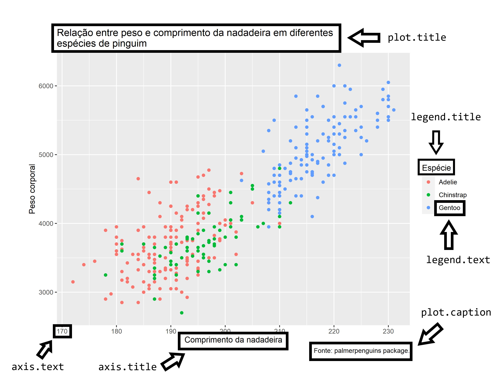
```


Vamos pensar primeiro no título, que é uma parte importante de seu gráfico e que deve possuir algum tipo de destaque. Por enquanto, o único fator que destaca o título do gráfico dos outros elementos textuais, é o tamanho da fonte usada. Porém, e se quiséssemos adicionar outros fatores de destaque? Como por exemplo, utilizar uma fonte em itálico, ou em negrito.

O argumento de `theme()` responsável por controlar o título do gráfico, é o `plot.title`, e portanto, utilizo a função `element_text()` sobre este argumento, para acrescentarmos novos destaques a este título. O argumento de `element_text()` que afeta o estilo da fonte (negrito, itálico, etc.) é o `face`. No exemplo abaixo, eu dou o valor `"italic"` indicando a função que use o estilo itálico sobre o título:

```{r, warning=FALSE}
plot_exemplo +
  theme(
    plot.title = element_text(face = "italic")
  )
```


Eu posso também destacar outras áreas do gráfico, como o título da legenda, que é controlado pelo argumento `legend.title`. Eu costumo reduzir o tamanho deste título, e colocá-lo em negrito, e para isso, utilizo os argumentos `size` e `face`. Para colocar algum texto em negrito, você deve utilizar o valor `"bold"`, em `face`. Eu poderia inclusive, colocar este texto em itálico e negrito (para isso, você deve utilizar o valor `"bold.italic"`).

Vale também destacar, que o argumento `size`, trabalha por padrão com a unidade milímetros (mm). Porém, como é um pouco contraintuitivo trabalhar com tamanho de fontes nesta unidade, eu costumo transformá-la para pontos (pt). Para isso, o `ggplot` oferece uma variável (`.pt`) que já contém o valor necessário para essa transformação. Assim, o que você precisa fazer é colocar o valor em pontos (pt) desejado, e dividi-lo por essa variável (`.pt`), que contém o valor necessário para a conversão. No exemplo abaixo, estou reduzindo o título da legenda ao tamanho 26 pt.


```{r, warning=FALSE}
plot_exemplo +
  theme(
    plot.title = element_text(face = "italic"),
    legend.title = element_text(face = "bold", size = 26/.pt)
  )
```

Além destas modificações, você talvez queira mudar o alinhamento do título do gráfico. Atualmente, você pode reparar que este título está alinhado à esquerda do gráfico, ou em outras palavras, está alinhado em relação a borda esquerda do gráfico.

Neste caso, estou me referindo ao alinhamento horizontal do título, e por isso, utilizo o argumento `hjust`. Este argumento funciona da mesma forma em que o vimos anteriormente, ele pega um número de 0 a 1. Sendo que o valor 0 representa o alinhamento totalmente à esquerda, o valor 0.5 centraliza o texto, e o valor 1 representa o alinhamento totalmente à direita. No exemplo abaixo, estou centralizando o título do gráfico.

```{r, warning=FALSE}
plot_exemplo +
  theme(
    plot.title = element_text(face = "italic", hjust = 0.5),
    legend.title = element_text(face = "bold", size = 26/.pt)
  )
```


Um outro ponto, que talvez seja de seu interesse, é alterar o espaço entre os elementos do gráfico. Você pode controlar este fator, através da função `margin()`, sobre o argumento `margin` de `element_text()`. Dentro da função `margin()`, temos 4 argumentos que se referem as bordas do seu texto. Dito de outra forma, esses argumentos definem a borda do texto, na qual você deseja acrescentar o espaço: `t` (*top*) se refere ao topo do texto; `r` (*right*) se refere à direita do texto; `l` (*left*) se refere à esquerda do texto; e `b` (*bottom*) se refere à base (ou a borda inferior) do texto.

Por exemplo, podemos dar mais destaque ao título do gráfico, ao adicionar um pouco mais de espaço entre ele e a borda do gráfico. Neste caso, o gráfico está abaixo do título, logo, estamos querendo adicionar espaço na borda inferior (argumento `b`) do título do gráfico. Em seguida, basta que eu defina no argumento, quanto de espaço eu desejo adicionar.


```{r, warning=FALSE}
plot_exemplo +
  theme(
    plot.title = element_text(
      face = "italic",
      hjust = 0.5,
      margin = margin(b = 20)
    ),
    legend.title = element_text(face = "bold", size = 26/.pt)
  )
```


## Plano de fundo (*background*) e *grid*

O tema padrão do `ggplot` pode ser muito esquisito, ou simplesmente "feio" para muita gente. Um de seus elementos que mais recebem críticas, é o plano de fundo do gráfico, que por padrão é colorido de cinza claro. Todos os argumentos de `theme()`, que controlam os elementos que se encontram no plano de fundo, começam por `panel.*`. Você pode, por exemplo, alterar as configurações gerais do plano de fundo pelo argumento `panel.background`, que é associado ao tipo "retângulo" - `element_rect()`.

No exemplo abaixo, estou alterando a cor deste plano de fundo, para uma cor levemente "amarelada". Lembra quando eu defini que o `ggplot` trata de forma distinta as formas geométricas de área, onde se você quisesse preencher esta forma com uma cor, você deveria utilizar o argumento `fill`, ao invés de `color`? Aqui a mesma coisa ocorre, pois o plano de fundo do gráfico é associado a um formato de área (retângulo).

Por isso, se utilizar o `color`, você irá colorir apenas as bordas do gráfico, e não preencher o plano de fundo com uma cor. Em ambos argumentos, você pode fornecer um dos nomes de cor que o R consegue reconhecer (por exemplo, `"white", "black"`)^[Você pode ver a lista completa de nomes, ao rodar a função `colors()` no console.], ou então, você pode fornecer um código HTML dessa cor.

```{r, warning=FALSE}
plot_exemplo +
  theme(
    panel.background = element_rect(fill = "#fffab3")
  )
```

Se antes você não gostava do cinza, você provavelmente está gostando menos ainda dessa cor amarelada. Bem, neste caso podemos ficar então mudar para um branco padrão. Vale destacar que, as linhas do *grid* já estão na cor branca, por isso, podemos colorir também essas linhas para uma cor diferente, de modo a mantê-las visíveis.

```{r, warning=FALSE}
plot_exemplo +
  theme(
    panel.background = element_rect(fill = "white"),
    panel.grid = element_line(color = "#d4d4d4")
  )
```

Apesar do gráfico estar agora em um tema mais "padrão", você talvez você ache estranho a forma como as linhas do *grid* estão no momento. Pois elas estão sem um "limite", ou aparentam estar "invadindo" o espaço de outros elementos do gráfico. Talvez o que você precise, seja marcar a borda do gráfico, para construir uma caixa, e definir estes limites do *grid*. Tudo que você precisa fazer, é usar o `color` em `panel.background`, para colorir essas bordas.

```{r, warning=FALSE}
plot_exemplo +
  theme(
    panel.background = element_rect(
      fill = "white",
      color = "#222222"
    ),
    panel.grid = element_line(color = "#d4d4d4")
  )
```

Um outro componente que faz parte do gráfico, é o plano de fundo de toda a área do gráfico. Ou seja, toda a área de sua tela que engloba os títulos, os valores, as legendas e o espaço do gráfico. Essa área é controlada pelo argumento `plot.background`. Não sei por que você faria isso, mas com esse argumento, você pode por exemplo, pintar toda a área do gráfico de azul claro.


```{r,  warning=FALSE}
plot_exemplo +
  theme(
    panel.background = element_rect(
      fill = "white",
      color = "#222222"
    ),
    panel.grid = element_line(color = "#d4d4d4"),
    plot.background = element_rect(fill = "#abb3ff")
  )
```


## Eixos do gráfico

Todos os elementos que se encontram nos eixos do gráfico, são controlados pelos argumentos de `theme()` que se iniciam por `axis.*`. Você pode ver os argumentos que controlam cada um dos componentes do eixo, pela figura abaixo. 


```{r, echo=FALSE, fig.align='center', out.width="60%", fig.cap = "Elementos que compõe um eixo do gráfico"}
knitr::include_graphics("Figuras/axis_theme.png")
```


No tema padrão do `ggplot`, a linha do eixo (`axis.line`) já não aparece. Portanto, se você quiser eliminar completamente um eixo do seu gráfico, você precisa apagar apenas os outros três componentes. Sendo este, um outro motivo de estranhamento de várias pessoas sobre o tema padrão do `ggplot`. Por isso, talvez seja interessante para você incluir no seu gráfico, as linhas do eixo, e para esse fim, basta redefinir o seu argumento (`axis.line`) com `element_line()`.

Um detalhe muito importante, é que a função `theme()` possui tanto o argumento geral do componente do eixo (e.g. `axis.line`), que afeta ambos os eixos (x e y) ao mesmo tempo, quanto o argumento que afeta os eixos individualmente (e.g. `axis.line.x` e `axis.line.y`). Isso vale para todos os outros três componentes do eixo, e, portanto, caso você queira que a modificação afete apenas um dos eixos, você deve utilizar os argumentos que possuem o eixo no nome, ao invés dos argumentos gerais.

Uma configuração que aplico com bastante frequência em meus gráficos, é escurecer os valores do eixo (`axis.text`). Por padrão, os valores vem em um cinza claro, e por causa disso, a leitura desses valores pode ficar muito prejudicada ao exportar esse gráfico, e incluí-lo em um artigo, informativo ou relatório que estou escrevendo. Desse modo, no exemplo abaixo, além de reposicionar as linhas dos eixos, eu também utilizo o argumento `color` em `axis.text`, para colorir esses valores com uma cor mais escura.

Além dessas modificações, para garantir que o meu leitor consiga ler esses números, eu ainda aumento levemente o tamanho dos valores do eixo, pelo argumento `size`. Como eu disse anteriormente, esse argumento trabalha, por padrão, com milímetros. Você pode novamente utilizar a variável `.pt` para transformar esse valor para pontos (pt).

```{r, warning=FALSE}
plot_exemplo +
  theme(
    axis.line = element_line(size = 0.8, color = "#222222"),
    axis.text = element_text(size = 11, color = "#222222")
  )
```


## Configurações temáticas em uma legenda

A legenda de seu gráfico, é um guia que lhe mostra como os elementos visuais percebidos em seu gráfico, se traduzem de volta aos valores observados em sua base de dados. Em outras palavras, é a legenda que mapeia as cores, formas e tamanhos dos elementos de seu gráfico, de volta aos valores apresentados em sua base de dados \cite{wilkinson, wickham2016}. Sem a legenda, nós não sabemos qual o valor que a cor vermelha em nosso gráfico se refere, nem quanto o tamanho de um objeto, representa em nível de uma variável numérica.


```{r, echo = FALSE, fig.cap = "Itens que compõe uma legenda", out.width="80%"}
knitr::include_graphics("Figuras/legendas_theme.png")
```


Temos na figura 9.3, os componentes de uma legenda em um gráfico do `ggplot`, e os seus respectivos argumentos em `theme()`. Há outros argumentos relacionados em `theme()`, como `legend.text.align`, `legend.margin` e `legend.position`, que não afetam a temática de algum componente específico da legenda, mas sim, o alinhamento de certos componentes, ou a margem da legenda em relação ao gráfico, ou a posição geral da legenda.

Como exemplo, podemos preencher o plano de fundo da legenda com alguma cor específica em `legend.background` (argumento `fill`), assim como podemos contornar as bordas dessa legenda com alguma outra cor (argumento `color`). Podemos alterar o alinhamento do texto da legenda, ou mais especificamente, os rótulos de cada item da legenda, através de `legend.text.align`, ao fornecermos um número entre 0 (alinhado totalmente à esquerda) e 1 (alinhado totalmente à direita). Também podemos utilizar a função `element_text()` em `legend.title`, para alterarmos a fonte (argumento `family`), o tamanho (argumento `size`) o estilo da fonte (argumento `face`: `bold` - negrito, `italic` - itálico, `bold.italic` - negrito e itálico), e inclusive a cor (argumento `color`) utilizada no título dessa legenda.

Além dessas configurações, possuímos um bom controle sobre a posição da legenda ao longo da área do gráfico, através do argumento `legend.position`. Por padrão, toda legenda gerada pelo `ggplot`, será posicionada à direita do gráfico, entretanto, esse padrão tende a ocupar muito espaço do gráfico, por isso eu particularmente prefiro posicionar as minhas legendas, na parte inferior do gráfico. Para isso podemos fornecer o valor `bottom` ao argumento. O argumento `legend.position`, aceita outros quatro valores pré-definidos: `top` (topo do gráfico); `left` (esquerda do gráfico); `right` (direita do gráfico); `none` (nenhum local do gráfico). 

Você pode utilizar o valor pré-definido `none` em `legend.position`, para eliminar completamente a legenda do gráfico. Isso é uma boa forma de aumentar o espaço do gráfico, porém, você elimina uma fonte importante de informação, portanto, considere com cuidado se as informações dispostas em sua legenda, são irrelevantes para o seu gráfico. Para além das posições pré-definidas, podemos inclusive posicionar a nossa legenda, para dentro do gráfico, através de `legend.position`. Para isso, você precisa fornecer dentro de um vetor, a posição (x, y) no plano cartesiano em que você deseja centralizar a sua legenda, de acordo com um valor entre 0 e 1. Você pode interpretar esse sistema, como percentis da distribuição dos valores presentes no eixo. Ou seja, se você fornecer o vetor `c(0.1, 0.9)`, a legenda será posicionada no 10° percentil da escala do eixo x, e no 90° percentil da escala do eixo y.

```{r}
plot_exemplo + theme(
  legend.background = element_rect(fill = "#cffff0", color = "black"),
  legend.text.align = 0.5,
  legend.title = element_text(face = "bold", color = "#008059"),
)
```

\newpage

```{r}
plot_exemplo + theme(
  legend.position = "bottom"
)
```


```{r}
plot_exemplo + theme(
  legend.position = "none"
)
```

\newpage

```{r}
plot_exemplo + theme(
    legend.position = c(0.1, 0.8)
)
```

Para mais, temos algumas outras configurações possíveis sobre a margem da legenda em relação à área gráfico, através do argumento `legend.margin` e da função `margin()`. Ou seja, nós podemos afastar a legenda da área do gráfico, ou da base do gráfico. Em outras palavras, nós podemos adicionar espaço na base (`b`), no topo (`t`), à direita (`r`), ou à esquerda (`l`) da legenda, através da função `margin()`.

```{r}
plot_exemplo + theme(
  legend.margin = margin(l = 90, b = 70)
)
```

Por último, nós também podemos configurar os itens da legenda, através do argumento `legend.key`. Neste argumento, você possui todas as opções de customização oferecidas pela função `element_rect()`. Além de preencher o plano de fundo dos itens (argumento `fill`), ou de criar uma borda (argumento `color`), também temos a opção de alterar o tamanho desses itens (argumento `size`).

```{r}
plot_exemplo + theme(
  legend.key = element_rect(fill = "#c4e2ff", color = "black")
)
```


## Alterando a temática em facetas

Quando você adiciona facetas a um gráfico, você possui novos elementos que talvez sejam de seu interesse configurá-los. Por exemplo, o título de cada faceta, ou o plano de fundo desse título. Todos os argumentos de `theme()` que controlam elementos das facetas do gráfico, começam por `strip.*`. No exemplo abaixo, eu estou redefinindo as cores do interior e das bordas do plano de fundo da faceta, além da cor do título da faceta.


```{r, warning=FALSE}
plot_exemplo +
  facet_wrap(~island, nrow = 3) +
  theme(
    strip.background = element_rect(color = "#222222", fill = "#d1fff4"),
    strip.text = element_text(color = "black")
  )
```


## Alterando as fontes do seu gráfico

Este é provavelmente o tópico de maior interesse para você ao customizar os seus gráficos, pois a tipografia traz, em geral, um grande impacto sobre o visual de uma imagem. A não muito tempo atrás, incluir diferentes fontes de seu sistema (ou fontes customizadas) em seus gráficos, era uma tarefa árdua e que podia gerar uma grande dor de cabeça.

Essa dificuldade ocorre em qualquer programa^[Caso você queira entrar em mais detalhes, um bom início é o artigo intitulado *"Text Rendering Hates You"*, de Alexis Beingessner: https://gankra.github.io/blah/text-hates-you/], linguagem ou sistema que trabalha com diversos *device*'s gráficos, como é o caso do R. 

Porém, tal situação mudou nos anos mais recentes. Hoje, incluir diferentes fontes em seus gráficos não é mais uma dor de cabeça tão grande, graças às melhorias feitas pelo time interno do R (*The R Core Team*) além de toda a comunidade internacional de R, que tem contribuído com pacotes como `ragg` e `showtext`.

Antes de explicarmos quais são as soluções necessárias para que você possa utilizar qualquer fonte que esteja em sua máquina, em seus gráficos do `ggplot`, vou mostrar quais são as três opções de fonte, que são garantidas de funcionar no `ggplot` em qualquer máquina. Essas três opções são:

1) `sans`: Fonte Arial.

2) `serif`: Fonte Times New Roman.

3) `mono`: Fonte Courier New.


Portanto, em qualquer máquina que você estiver, você pode utilizar um desses três nomes (`sans`, `serif` e `mono`) para se referir a uma dessas três fontes acima, em seu gráfico do `ggplot`. 

Neste momento, vale a pena refletir se você deseja variar as fontes utilizadas ao longo do gráfico, ou se você deseja utilizar sempre a mesma fonte em todos os textos dispostos no gráfico. Caso você queira variar a fonte, você deve criar uma nova coluna em sua tabela, contendo o nome da fonte que você deseja utilizar para cada observação. Em seguida, você deve conectar essa variável ao argumento `family`, dentro de `aes()`. Contudo, se você quer manter essa fonte fixa, basta fornecer o nome dessa fonte ao argumento `family`, porém, dessa vez, fora da função `aes()`.

```{r}
set.seed(1)
tab <- data.frame(
  x = rnorm(100),
  y = runif(100),
  fonte = sample(
    c("sans", "serif", "mono"),
    size = 100,
    replace = TRUE
  )
)

### Variar a fonte utilizada ao longo do gráfico
ggplot(tab) +
  geom_text(
    aes(x = x, y = y, family = fonte, label = fonte)
  )


### Ou mater a fonte fixa ao longo de todo o gráfico
ggplot(tab) +
  geom_text(
    aes(x = x, y = y, label = fonte),
    family = "serif"
  )
```


Portanto, nós definimos a fonte utilizada nas funções `geom` através do argumento `family`, ao fornecer o nome da fonte que desejamos utilizar. Por outro lado, para alterarmos a fonte em elementos temáticos (elementos que não dizem respeito, ou que não estão diretamente conectados com os seus dados) do gráfico, essas configurações devem ser realizadas dentro da função `theme`. Basta utilizarmos novamente o argumento `family` presente em `element_text()`, e definirmos o nome da fonte que desejamos empregar.

Um atalho útil, caso você deseja utilizar a mesma fonte em todos os elementos temáticos do gráfico, se trata do argumento `text` (que se refere a todos os elementos temáticos do tipo "texto") na função `theme()`, e definir com a função `element_text()` a fonte utilizada:


```{r}
ggplot(tab) +
  geom_point(aes(x = x, y = y)) +
  labs(
    title = "Um título interessante",
    subtitle = "Um subtítulo também interessante"
  ) +
  theme(
    text = element_text(family = "sans")
  )
```


Porém, caso você deseja utilizar uma fonte diferente em cada componente temático do gráfico, você obrigatoriamente deve definir separadamente a fonte a ser utilizada, em cada argumento de `theme()` que corresponde a esses componentes estéticos.

```{r}
ggplot(tab) +
  geom_point(aes(x = x, y = y)) +
  labs(
    title = "Um título interessante",
    subtitle = "Um subtítulo também interessante"
  ) +
  theme(
    plot.title = element_text(family = "serif"),
    plot.subtitle = element_text(family = "mono"),
    axis.text = element_text(family = "serif")
  )
```


### Utilizando novas fontes em seus gráficos {#sec:ggplot_theme_novas_fontes}


> "At its core text and fonts are just very messy, with differences between operating systems and font file formats to name some of the challenges". [@pedersen2020].

Portanto, o `ggplot` oferece (de "fábrica") 3 fontes diferentes. Mas e se você precisa utilizar uma outra fonte que não está entre essas 3 opções? Em resumo, para que você possa utilizar qualquer outra fonte em seus gráficos, o R precisa saber onde está essa fonte em seu sistema. 

Para que o R passe a "enxergar" uma fonte qualquer em seu sistema, precisamos de certa forma "importar" essa fonte para dentro do R. Em edições passadas desta obra, mostramos como realizar esse processo através do pacote `extrafont`. Porém, esse é um pacote já bem antigo do R e que depende de um outro programa ainda mais antigo. Pela falta de manutenção, o pacote `extrafont` deixou de funcionar tão bem em versões mais recentes do R, especialmente após a versão 4.1.

Por esse motivo, vamos apresentar a seguir, as soluções mais recentes e modernas para esse problema. Hoje, temos três soluções principais, que são: 1) os *devices* gráficos do pacote `ragg`; 2) os *devices* gráficos produzidos por Cairo Graphics; 3) as funções do pacote `showtext`. Nessa seção vamos demostrar as duas primeiras soluções citadas.


#### O pacote `ragg`

O pacote `ragg` é um pacote do R que provê um conjunto de *devices* gráficos que são baseados na biblioteca AGG (*Anti-Grain Geometry Library*), desenvolvida por Maxim Shemanarev. Graças aos esforços de Thomas Lin Pedersen, e de muitos outros colegas, esse pacote trouxe uma certa "revolução" ao mundo dos gráficos do R. 

```{r, eval=FALSE}
install.packages("ragg")
```

Pois esse pacote oferece não apenas *devices* gráficos que são mais rápidos e que produzem imagens de maior qualidade do que os *devices* nativos do R, que pertencem ao pacote `grDevices`; mas também, `ragg` é o primeiro pacote que conseguiu efetivamente resolver todos os problemas do uso de fontes em gráficos do R, ao trazer um suporte incrível para praticamente todas as operações e configurações sobre textos que você pode imaginar. 

Sempre que você faz uma referência a uma fonte "não-padrão" do R (por exemplo, a fonte Calibri), os *devices* do pacote `ragg` iniciam automaticamente um processo de busca atrás dessa fonte. Veja o exemplo abaixo, em que utilizo três fontes diferentes. Todas essas fontes geralmente já vem instaladas de "fábrica" em qualquer sistema Windows, logo, você deve ser capaz de executar o código abaixo sem problemas.


```{r, eval = FALSE}
grafico <- ggplot(mpg) +
  geom_point(
    aes(hwy, displ)
  ) +
  labs(
    title = "Relação entre quilometragem e a largura do pistão",
    subtitle = "Baseado em uma amostra de 234 veículos"
  ) +
  theme(
    text = element_text(family = "Segoe UI"),
    plot.title = element_text(family = "Comic Sans MS"),
    plot.subtitle = element_text(family = "Calibri")
  )


ragg::agg_png(
  "output.png", width = 2000, height = 1400,
  res = 300
)

print(grafico)

dev.off()
```

O gráfico que foi armazenado neste arquivo `output.png` está exposto logo abaixo. Perceba que todas as três fontes foram encontradas pelo *device* `agg_png()` e, consequentemente, foram corretamente incluídas no gráfico.

```{r, echo = FALSE, fig.cap="Gráfico salvo no arquivo `output.png`"}
knitr::include_graphics("Figuras/grafico_agg.png")
```

Portanto, desde que a fonte que você deseja utilizar esteja instalada em seu sistema operacional, você pode tranquilamente utilizar essa fonte em seus gráficos do `ggplot`, ao salvá-lo em um arquivo utilizando um dos *devices* gráficos disponíveis no pacote `ragg`.

Além disso, em versões mais recentes do RStudio, você pode utilizar os *devices* gráficos do pacote `ragg` para visualizar os seus gráficos dentro do painel de `Plots`. Basta acessar o painel de configurações globais da ferramenta, através de `Tools` $\rightarrow$ `Global options...`, em seguida, selecionar a aba de `Graphics` dentro da seção `General`, depois, selecionar a opção `AGG` em `Backend`, como mostrado na figura abaixo:

```{r, echo = FALSE, out.width = "80%", fig.cap = "Utilizando o pacote `ragg` no painel de `Plots` do RStudio"}
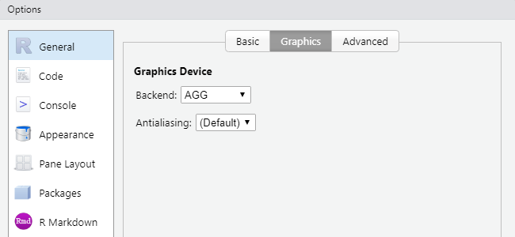
```


#### Arquivos de representação vetorial (PDF, SVG e PS)

Você provavelmente percebeu na seção anterior que, o pacote `ragg` oferece apenas *devices* gráficos que utilizam representações matriciais (como PNG, JPEG e TIFF). Porém, e se você quisesse salvar o seu gráfico em um arquivo PDF? ou SVG? Como você faria para incluir as fontes que você deseja utilizar?

A resposta para essa pergunta reside nas funções `cairo_pdf()`, `svg()` e `cairo_ps()`. Todas essas funções pertencem ao pacote `grDevices` (logo, são funções nativas do R). Porém, essas funções constroem os seus arquivos utilizando-se das *engines* produzidas por Cairo Graphics. 

Portanto, se desejamos salvar o exato mesmo gráfico que mostramos na seção anterior (o qual inclui três fontes diferentes), porém, dessa vez em um arquivo PDF por exemplo, precisamos apenas criar o arquivo PDF com a função `cairo_pdf()`, como demonstrado abaixo:

```{r, eval = FALSE}
grafico <- ggplot(mpg) +
  geom_point(
    aes(displ, hwy)
  ) +
  labs(
    title = "Relação entre quilometragem e a largura do pistão",
    subtitle = "Baseado em uma amostra de 234 veículos"
  ) +
  theme(
    text = element_text(family = "Segoe UI"),
    plot.title = element_text(family = "Cambria", face = "bold"),
    plot.subtitle = element_text(family = "Calibri")
  )


cairo_pdf("output.pdf", width = 8, height = 5)

print(grafico)

dev.off()
```

Sendo assim, se o seu gráfico inclui alguma fonte não-padrão, mas que está instalada em seu computador, e você deseja salvá-lo em um arquivo PDF, SVG ou EPS, utilize as funções `cairo_pdf()`, `svg()` e `cairo_ps()`. Pois as *engines* produzidas por Cairo Graphics conseguem incluir um intervalo muito maior de fontes em seu arquivo.


```{r, child = "Exercícios/exec_cap9.Rmd"}

```


<!--chapter:end:09-theme-ggplot.Rmd-->


# (PART) Ferramentas para tipos específicos de dados {-}


# Manipulação e transformação de *strings* com `stringr` 

```{r, include=FALSE}
knitr::opts_chunk$set(echo = TRUE, out.width = "100%")
```


## Introdução e pré-requisitos {#sec:stringr_capitulo}

Neste capítulo, vamos aprender mais sobre operações especializadas em dados textuais (dados do tipo `character`), ou como são mais comumente denominados em programação, *strings*. Esse capítulo também oferece uma introdução a um dos principais e mais importantes tópicos em processamento de texto, as expressões regulares (*regular expression*), ou *regex* como é mais conhecida. Para aplicarmos as diversas operações expostas, vamos utilizar as funções disponíveis no pacote `stringr`. Esse pacote está incluso no `tidyverse`, logo, para ter acesso às funções apresentadas, você pode chamar pelo `tidyverse` ou pacote `stringr` diretamente, por meio do comando `library()`.

```{r, eval = FALSE}
library(stringr)
library(tidyverse)
```

```{r, include = FALSE}
library(stringr)
library(tidyverse)
```


## Algumas noções básicas

Textos ou *strings* no R, são criados ao contornarmos um determinado texto por aspas (duplas - `"`, ou simples - `'`), e cada letra, espaço, símbolo ou número que compõe esse texto, é comumente denominado de caractere. Caso você se esqueça de fechar o par de aspas que contorna o seu texto, o R vai esperar até que você complete a expressão. Ou seja, em seu console, estaria acontecendo algo parecido com o que está abaixo. Lembre-se que você pode apertar a tecla `Esc`, para abortar a operação, caso você não consiga completá-la.

```{r, eval = F, highlight = F}
> x <- "Olá eu sou Pedro!
+ 
+ 
```


Como as aspas são responsáveis por delimitar esse tipo de dado, para que você possa incluir esse caractere em alguma cadeia de texto, você tem duas alternativas: 1) se você está contornando o texto com aspas duplas, utilize aspas simples, ou vice-versa; 2) contornar o comportamento especial das aspas, ao posicionar uma barra inclinada a esquerda antes de cada aspa (`\"` ou `\'`).

```{r}
"Olá! Esse é um texto qualquer"
"Para incluir aspas ('') em uma string"
"Será que \"alienígenas\" existem de fato?"
```

Além disso, textos podem incluir diversos outros caracteres especiais. Sendo os principais exemplos, os caracteres de tabulação (`\t`), e de quebra de linha (`\n`). Entretanto, uma quantidade muito grande desses caracteres especiais, podem dificultar a nossa compreensão do conteúdo presente em um texto. Logo, há vários momentos em que desejamos visualizar o texto representado em uma *string* de maneira "crua". Para isso, podemos aplicar a função `writeLines()` sobre o texto em questão.

```{r}
texto <- "Receita:\n\t\t2 ovos\n\t\t3 copos e meio de farinha
\t\t2 copos de achocolatado\n\t\t1 copo de açúcar\n\t\tMeio copo de óleo
\t\t1 colher (de sopa) de fermento
\t\t1 colher (de café) de bicabornato de sódio\n\t\t..."
writeLines(texto)
texto <- "Será que \"alienígenas\" existem de fato?"
writeLines(texto)
```

Outro exemplo clássico de caracteres especiais, que são muito encontrados em páginas da internet (e.g. dados coletados em operações de *web scrapping*), são os códigos hexadecimais ou *code points* correspondentes a uma determinada letra presente no sistema Unicode. Descrevemos brevemente na seção [Um pouco sobre fontes, encoding e tipografia](#sec:fontes_encoding_tipografia), a importância do Unicode para a universalização dos sistemas de *encoding*, e consequentemente, para a internacionalização de conteúdo.

Cada caractere no sistema Unicode, é representado por um *unicode code point* [@haralambous2007]. Em resumo, um *code point* é um número inteiro que pode identificar unicamente um caractere presente no sistema Unicode. Porém, caracteres que são codificados nesse sistema, são normalmente representados pelo código hexadecimal que equivale ao seu respectivo *code point*. Logo, ao invés de um número específico, você normalmente irá encontrar em *strings*, códigos que se iniciam por `\u`, ou `\U`, ou ainda `U+`, seguidos por uma combinação específica de letras e números. Como exemplo, os códigos hexadecimais abaixo equivalem aos *code points* que formam a palavra "Arigatōgozaimashita", ou "Muito obrigado" em japonês.

```{r}
x <- "\u3042\u308a\u304c\u3068\u3046\u3054\u3056\u3044\u307e\u3057\u305f"
```


Um outro ponto muito importante em *strings* está no uso de barras inclinadas à esquerda. Nós já vimos na seção [Definindo endereços do disco rígido no R](#sec:enderecos_disco_rigido), que para representarmos uma barra inclinada à esquerda em uma *string* do R, precisarmos duplicar essa barra. Logo, em *strings*, a sequência `\\` significa para o R `\`. Existem alguns comandos e caracteres especiais que não requerem essa prática, como o comando que forma um *Unicode code point* (como demonstrado acima), que sempre se inicia por uma letra "u" antecedida por uma barra inclinada à esquerda (ex: `\u3042`). Um outro exemplo são os comandos para tabulações e quebra de linha que acabamos de mostrar (`\t` e `\n`). Entretanto, essas exceções são a minoria. Portanto, tenha esse cuidado ao utilizar barras inclinadas à esquerda em suas *strings*.


## Concatenando ou combinando *strings* com `paste()` e `str_c()`

Concatenar, significa unir diferentes valores. Porém, essa união pode ocorrer de diferentes maneiras, e como ela ocorre, tende a depender das funções que você utiliza, como você as configura, e com quais tipos de estruturas você está trabalhando. Com isso, eu quero destacar, que o termo concatenar, pode se referir a muitas coisas (ou operações) diferentes. Na linguagem R, uma das principais operações de concatenação está presente na formação de vetores atômicos, mais especificamente, no uso da função `c()` (abreviação para *combine*), que introduzimos na seção de [Vetores](#sec:vetores_estrutura). 

O papel da função `c()` é criar uma sequência a partir de um conjunto de valores. Essa sequência de valores, é o que forma um vetor, e é o que estabelece uma relação de dependência ou de união entre esses valores, pois os torna parte de uma mesma estrutura. Cada um deles possuem uma ordem, ou uma posição dentro dessa sequência, mas nenhum deles é capaz de gerar essa sequência sozinho.

Entretanto, ao concatenarmos textos, nós geralmente estamos nos referindo a uma operação um pouco diferente. Tradicionalmente, ao concatenarmos um conjunto de textos, nós já possuímos um vetor (ou mais vetores) em nossas mãos, e desejamos unir cada elemento, ou cada texto contido nesse vetor, de alguma forma lógica. Dentre os pacotes básicos do R, a principal função que realiza esse tipo de operação, é a função `paste()`. Um detalhe importante sobre essa função, é que ela converte, por padrão, qualquer tipo de *input* que você fornecer a ela, para o tipo `character`. Logo, você pode incluir dados numéricos ou de qualquer outro tipo nos *input*'s dessa função.

A forma como a função `paste()` realiza essa união entre os textos, depende diretamente de como você configura os argumentos da função, `sep` e `collapse`, e de quais *input*'s você fornece à função. Se você está fornecendo um único *input* à função, é certo que você está preocupado apenas com o argumento `collapse` (em outras palavras, `sep` é irrelevante nesse caso). Em resumo, o argumento `collapse` define qual o texto que irá separar os diferentes elementos do *input* que você forneceu a função. Em outras palavras, se o *input* que fornecemos é, por exemplo, um vetor de textos, ao definirmos o argumento `collapse`, estamos pedindo à `paste()` que junte todos os diferentes elementos do vetor, dentro de um único texto, separando-os pelo texto que você definiu no argumento `collapse`. 

Por exemplo, se eu possuo o vetor `vec` abaixo, e utilizo a função `paste()` sobre ele, veja o que ocorre ao definirmos o argumento `collapse`. Perceba no exemplo abaixo, que todos os elementos do vetor `vec`, foram unidos dentro de um mesmo texto, onde cada um desses elementos são separados pelo texto `" : "` que definimos no argumento `collapse`.

```{r}
vec <- c("a", "b", "c", "d", "e")

conc_vec <- paste(vec, collapse = " : ")

conc_vec

## --------------------------
## Um outro exemplo:
nomes <- c("Ana", "Fabrício", "Eduardo", "Mônica")

mensagem <- paste(nomes, collapse = " e ")

mensagem
```

Portanto, o texto que você define em `collapse`, será o texto que vai separar cada um dos elementos do vetor que você fornece como *input* à função `paste()`. Por padrão, o argumento `collapse` é setado para nulo (`NULL`). Isso significa, que se você não definir algum texto para o argumento `collapse`, nada acontece ao aplicarmos a função `paste()` sobre o vetor. Como o argumento `sep` é irrelevante para um único *input*, se você não está interessado nesta operação que ocorre ao definirmos `collapse`, a função `paste()` não é o que você está procurando.


Por outro lado, se você está fornecendo dois ou mais *inputs* à função `paste()`, é provável que você esteja interessado em definir apenas o argumento `sep`, apesar de que o argumento `collapse` pode também ser útil para o seu caso. Ao fornecermos dois ou mais vetores como *inputs*, a função `paste()`, por padrão, tenta unir os elementos desses vetores, de forma a produzir um novo vetor de texto. Por exemplo, se eu forneço dois vetores à função `paste()`, como os vetores `vec` e `id` abaixo, o primeiro elemento do vetor resultante de `paste()` vai possuir os textos presentes no primeiro elemento de ambos os vetores.

```{r}
id <- 1:5
vec <- c("a", "b", "c", "d", "e")

conc_vec <- paste(id, vec)

conc_vec
```


O argumento `sep` é responsável por definir o texto que vai separar os valores de diferentes *input*'s da função `paste()`. Perceba no exemplo acima, os valores dos vetores `id` e `vec`, estão todos separados por um espaço em branco. Isso significa, que por padrão, o argumento `sep` é configurado como um espaço em branco (`" "`), e, portanto, você não precisa definir o argumento `sep`, caso você deseja separar esses valores por um espaço. Mas se há interesse em um texto diferente, para separar esses valores, você deve defini-lo através do argumento `sep`. Por exemplo, você talvez deseja que não haja espaço algum entre esses valores, como exemplo abaixo.

```{r}
id <- 1:5
vec <- c("a", "b", "c", "d", "e")

conc_vec <- paste(id, vec, sep = "")

conc_vec
```

Assim sendo, em uma representação visual, podemos identificar os papéis dos argumentos `sep` e `collapse` da forma apresentada na figura 10.1.

```{r, echo = F, fig.cap = "Resumo dos papéis desempenhados pelos argumentos `sep` e `collapse` em `paste()`", out.width="100%"}
knitr::include_graphics("Figuras/sep_collapse.png")
```


Porém, na maioria das aplicações práticas dessa função, pelo menos um dos *input*'s fornecidos será constante. Por exemplo, uma situação muito comum de uso dessa função, é a construção de caminhos (ou *paths*) para diferentes arquivos. Essa é exatamente a aplicação que utilizamos na seção [Um estudo de caso: uma demanda real sobre a distribuição de ICMS](#sec:demanda_dist_ICMS). 

Nessa seção, em uma das primeiras etapas descritas, precisamos ler ao todo, 12 planilhas diferentes, e como descrevemos no capítulo 4, para importarmos qualquer arquivo, nós precisamos fornecer o caminho até esse arquivo para o R. Com isso, teríamos a tarefa tediosa de construirmos 12 caminhos diferentes (imagine se fossem 36, ou 320 planilhas diferentes a serem lidas). Porém, como todas essas planilhas se encontram dentro do mesmo diretório de meu computador, eu me aproveito dessa regularidade, para fabricar esses caminhos de uma maneira prática, através da função `paste()`.

Inicialmente, temos apenas os nomes dessas planilhas contidos no objeto `planilhas` (que está replicado abaixo). 

```{r, include = F}
planilhas <- list.files("C:/Users/Pedro/Documents/Projeto curso R/Livro_R/planilhas/")
```
```{r, eval = F}
planilhas <- list.files("planilhas/")

planilhas
```
```{r, echo = F}
planilhas
```

Para criarmos o endereço até cada uma dessas planilhas, precisamos juntar o caminho até o diretório em que elas se encontram (`"planilhas/"`), ao seus nomes. Com isso, podemos utilizar a função `paste()` da seguinte maneira. Perceba que dois *input*'s foram fornecidos a função: o primeiro, conciste apenas no texto `"planilhas/"`; o segundo, são os nomes das planilhas contidos no objeto `planilhas`. Além disso, repare que pelo fato de que o texto `"planilhas/"` ser "constante", `paste()` acaba replicando-o para todos os 12 nomes presentes no objeto `planilhas`.

```{r}
caminhos <- paste("planilhas/", planilhas, sep = "")

caminhos
```

Você talvez tenha percebido, especialmente durante o capítulo 4, que temos uma variante da função `paste()`, chamada `paste0()`. Essa irmã, nada mais é do que um atalho para a função `paste()`, que utiliza por padrão, a configuração \texttt{sep = ""}. Ou seja, em todas as ocasiões em que você estiver concatenando textos de diferentes *input*'s com a função `paste()`, e deseja utilizar nenhum espaço como separador entre os valores de cada *input*, você pode rapidamente executar essa ação por meio da função `paste0()`.

```{r}
caminhos <- paste0("planilhas/", planilhas)

caminhos
```


### A função `str_c()` como uma alternativa para concatenação de *strings*

Por ser uma operação muito comum e útil, o pacote `stringr` nos oferece a função `str_c()`, como uma alternativa à função `paste()`. Suas diferenças se restringem a dois pontos. Primeiro, a função `str_c()` foi escrita em C++, e consegue hoje, atingir uma maior eficiência se comparada a função `paste()`, como demonstrado abaixo. Logo, `str_c()` pode oferecer uma vantagem considerável, caso você esteja trabalhando com um grande conjunto de textos.

```{r, eval = FALSE}
library(stringr)
library(microbenchmark)
texto <- sample(letters, size = 1e6, replace = TRUE)

microbenchmark(
  paste(texto, collapse = ""),
  str_c(texto, collapse = "")
)
```
```
Unit: milliseconds
                        expr      min       lq      mean
 paste(texto, collapse = "") 104.7202 107.8384 124.43956
 str_c(texto, collapse = "")  26.3803  26.9155  28.33062
   median        uq      max neval
 115.8264 129.90345 277.5362   100
  27.1933  29.02705  33.3686   100
```


Segundo, temos também uma diferença importante sobre as configurações nativas utilizadas por essas funções. Pois a função `str_c()` adota \texttt{sep = \textquotedbl\textquotedbl} como a sua configuração padrão para o argumento `sep` (se igualando assim, à função `paste0()`), ao invés de `sep = " "`, que é o padrão adotado por `paste()`. Veja um exemplo abaixo.

```{r}
str_c("Dia", 1:7)

str_c("Dia", 1:7, sep = " ")

str_c("Dia", 1:7, collapse = "-")
```

Apesar dessas diferenças, a função `str_c()` se comporta exatamente da mesma maneira que a função `paste()`. Por isso, pode ser interessante que você adote essa função como o seu padrão para concatenação de textos, especialmente levando-se em conta, a sua maior eficiência.


## Vantagens do pacote `stringr`

Os pacotes básicos da linguagem R oferecem algumas ferramentas para trabalharmos com *strings*, como a função `paste()` e a família `grep()`. Porém, essas ferramentas são em grande parte, inconsistentes em seus nomes e formas e, por isso, são mais difíceis de se lembrar. Mesmo com essa consideração, eu decidi mostrar a função `paste()` na seção anterior, pelo fato de que ela continua sendo uma função extremamente popular, e que você irá encontrar em todo lugar. 

De qualquer forma, a partir de agora, vamos focar apenas nas funções do pacote `stringr`. As funções desse pacote, são em geral, mais rápidas do que as funções ofertadas pelos pacotes básicos. Além disso, os nomes de todas as funções do pacote `stringr` começam pela sequência `str_*()`, o que facilita muito a sua memorização de cada função.


## Comprimento de *strings* com `str_length()`

A função `str_length()` lhe permite contabilizar o número de caracteres presentes em uma *string*. Essa função é extremamente útil, quando desejamos aplicar operações que se baseiam em uma determinada posição de uma *string*, como extrair uma seção específica dessa *string*. Perceba abaixo, que ao se deparar com valores `NA`, a função nos retorna um valor `NA` correspondente. Repare também, pelo resultado do quarto elemento, referente a palavra "Partindo", que espaços em branco também são contabilizados como caracteres, portanto, fique atento a este detalhe.

```{r}
vec <- c(
  "Fui ao Paraná, e encontrei o Varadá",
  "Abril", 
  "!",
  "Partindo ",
  NA
)

str_length(vec)
```


## Lidando com capitalização e espaços em branco

Diversas empresas que utilizam formulários, ou outros sistemas de registro, precisam estar constantemente corrigindo *input*'s fornecidos por seus usuários. Talvez, os erros mais comumente gerados, sejam no uso da capitalização e de espaços em branco. Por exemplo, ao preenchermos formulários, é muito comum que: 1) esqueçamos a tecla `Caps Lock` ligada; 2) ou simplesmente ignoramos o uso de capitalização por simplesmente estarmos com pressa para finalizar o formulário; 3) acrescentar espaços desnecessários ao final ou no meio do *input*.

Como exemplo, suponha que você possua a tabela `usuarios`. Repare que os valores da coluna `cidade`, variam bastante quanto ao uso da capitalização. Repare também, que em alguns valores na coluna `nome`, temos para além de problemas com a capitalização, espaços em branco desnecessários, que as vezes se encontram a direita, ou a esquerda, ou em ambos os lados do nome.

```{r}
usuarios <- tibble(
  nome = c("Ana", " Eduardo", " Cláudio   ", "VerÔNiCA ",
           "  hugo    ", "JULIANA", "  Vitor de paula   "),
  cidade = c("BELÉM", "goiânia", "são paulo", "São paulo", "SÃO pAULO",
             "rIO DE janeiro", "rio de janeiro"),
  profissao = c("Bióloga", "Biólogo", "Químico", "Socióloga",
                "Administrador", "Administradora", "Economista")
)

usuarios
```

No Excel, você normalmente utilizaria a função `ARRUMAR()` para resolver os excessos de espaços, e as funções `MAIÚSCULA()`, `MINÚSCULA()` e `PRI.MAIÚSCULA()` para alterar a capitalização de todas as letras de cada nome. Sendo as funções `str_trim()`, `str_to_upper()`, `str_to_lower()` e `str_to_title()`, os seus equivalentes no pacote `stringr`, respectivamente.

Como os próprios nomes das funções `str_to_upper()` e `str_to_lower()` dão a entender, elas convertem todos as letras contidas em um vetor do tipo `character`, para letras maiúsculas (*upper*) e minúsculas (*lower*). Por exemplo, ao aplicarmos essas funções sobre a coluna `cidade`, temos o seguinte resultado:

```{r}
usuarios %>% 
  mutate(cidade = str_to_upper(cidade))

usuarios %>% 
  mutate(cidade = str_to_lower(cidade))
```

Por outro lado, a função `str_to_title()` representa a alternativa do meio, ao converter a primeira letra de cada palavra, para maiúsculo, e as letras restantes, para minúsculo, como demonstrado abaixo:

```{r}
usuarios %>% 
  mutate(cidade = str_to_title(cidade))
```


Quanto ao excedente de espaços na coluna `nome`, podemos aplicar a função `str_trim()`. Por padrão, essa função retira qualquer espaço remanescente em ambos os lados de sua *string*. Mas caso seja de seu desejo, você pode especificar um lado específico para retirar espaços, por meio do argumento `side`, que aceita os valores `"both"`, `"left"` ou `"right"`. 

```{r}
usuarios <- usuarios %>% 
  mutate(nome = str_trim(nome))

usuarios
```


Vale destacar também, que `str_trim()` é capaz apenas de remover excessos de espaços que se encontram ao redor de seu texto. Logo, a forma mais direta de resolvermos esse tipo de excesso, seria utilizarmos o método mais "abrangente" da função `str_trim()`, aplicado pela função `str_squish()`. Além de remover os espaços ao redor da palavra, a função `str_squish()` também é capaz de remover espaços repetidos que se encontram entre palavras. Veja abaixo, o exemplo do texto `"  São Carlos de   Santana   "`.

```{r}
str_trim("  São Carlos de   Santana   ")

str_squish("  São Carlos de   Santana   ")
```


## Extraindo partes ou *subsets* de uma *string* com `str_sub()`

Para extrairmos partes de uma *string*, podemos utilizar a função `str_sub()`, que se baseia na posição dos caracteres que delimitam o intervalo que você deseja capturar. Ou seja, nessa função, precisamos definir as posições dos caracteres que iniciam e terminam o intervalo que estamos extraindo. Como exemplo, eu posso extrair do primeiro ao quarto caractere de cada texto presente na coluna `nome`, da seguinte maneira:

```{r}
usuarios %>% 
  mutate(parte = str_sub(nome, start = 1, end = 4))
```

De forma semelhante, podemos extrair do terceiro ao quinto caractere dessa mesma coluna, de acordo com o seguinte comando:

```{r}
usuarios %>% 
  mutate(parte = str_sub(nome, start = 3, end = 5))
```

Além desses pontos, vale esclarecer que os textos inclusos em seu vetor, não precisam obrigatoriamente se encaixar no intervalo de caracteres que você delimitou. Por exemplo, veja abaixo que eu forneci um vetor contendo dois nomes (Ana e Eduardo), um possui 3 caracteres, enquanto o outro, possui 7. Logo, ao pedir à `str_sub()`, que retire do primeiro ao sexto caractere de cada texto contido no vetor, a função vai tentar extrair o máximo de caracteres possíveis que se encaixam nesse intervalo. Mesmo que algum desses textos não encaixe por completo nesse intervalo. 

```{r}
str_sub(c("Ana", "Eduardo"), start = 1, end = 6)
```

### Aliando `str_sub()` com `str_length()` para extrair partes de tamanho variável {#sec:str_sub_e_str_length}

Na seção [Um estudo de caso: uma demanda real sobre a distribuição de ICMS](#sec:demanda_dist_ICMS) oferecemos um caso de uso das funções `str_sub()` e `str_length`. Nessa seção, temos um sistema que coleta o nome de cada planilha que importamos para o R. Por que precisamos dessa informação? Porque o nome de cada planilha especifica o mês e o ano a que os seus dados se referem. Logo, os dados presentes na planilha `Abril_2019.xlsx` diziam respeito ao mês de abril do ano de 2019.

Portanto, ao final da coleta desses nomes, inserimos esses nomes em uma coluna de nosso `data.frame`, tendo como resultado algo parecido com a coluna `origem`, que se encontra na tabela `periodo`, e que pode ser recriada através dos comandos abaixo.


```{r}
meses <- c("Janeiro", "Fevereiro", "Março", "Abril",
           "Maio", "Junho", "Julho", "Agosto",
           "Setembro", "Outubro", "Novembro", "Dezembro")
meses <- rep(meses, times = 6)
anos <- rep(2015:2020, each = 12)

periodo <- tibble(
  origem = str_c(str_c(meses, anos, sep = "_"), ".xslx")
)

periodo
```

Com essa informação, podemos facilmente rastrear a origem de cada linha de nossa tabela. Entretanto, mesmo com essa informação, ainda não somos capazes de ordenar a tabela de maneira útil. Pois da forma como as informações são apresentadas na coluna `origem`, uma ordenação alfabética seria empregada sobre a coluna. Logo, valores como `Abril_2018.xlsx` e `Abril_2017.xlsx`, viriam a aparecer antes de valores como `Março_2019.xlsx`.

Por isso, ainda temos a necessidade de extrair o mês e o ano desses nomes, e em seguida, alocar essas informações em colunas separadas. Com esse objetivo, utilizamos a função `str_sub()` para extrairmos a parte, ou a seção de cada nome, que corresponde ao mês que ele se refere. Porém, como você pode ver acima, o número de caracteres presentes em cada mês, ou em cada nome, varia de maneira drástica.

Em momentos como esse, você pode tentar identificar se a parte final ou a parte inicial dos textos inclusos em sua coluna, são de alguma maneira, constantes. Ou seja, mesmo que o número de caracteres varie muito ao longo da coluna, talvez exista uma parte específica desses textos que sempre possui a mesma **quantidade de caracteres**. 

No caso da coluna `origem`, temos três partes que são sempre constantes, que são a parte dos anos (mesmo que os anos variem, eles sempre são formados por 4 números, ou 4 caracteres), a parte da extensão do arquivo (`.xlsx`), e o *underscore* (`_`), que sempre separa as duas partes anteriores do mês em cada nome. Somando os caracteres dessas três partes, temos sempre 10 caracteres ao final do nome do arquivo, ao qual podemos eliminar para chegarmos à seção do texto que contém o nome do mês. Com isso, podemos utilizar a função `str_length()` para calcular o número total de caracteres de cada texto, e subtrair 10 desse valor, para chegarmos ao caractere que delimita o fim do mês em cada texto.


Podemos empregar a mesma linha de raciocínio, para chegarmos aos limites do intervalo que contém o ano em cada texto. Contudo, tanto o limite inicial quanto o limite final desse intervalo, variam. Logo, temos que utilizar o resultado de `str_length()` para descobrirmos os dois limites dessa seção. Como estamos empregando os valores produzidos por `str_length()` em três locais diferentes, eu guardo o resultado dessa função em uma coluna denominada `num`, para não ter o trabalho de digitar repetidamente a função `str_length()`.

```{r}
periodo %>% 
  mutate(
    num = str_length(origem),
    mes = str_sub(origem, start = 1, end = num - 10),
    ano = str_sub(origem, start = num - 8, end = num - 5) %>% as.integer()
  )
```


## Expressões regulares (ou *regex*) com `str_detect()` {#sec:stringr_regex}

Expressões regulares (*regular expressions*), ou simplesmente *regex*, são uma ferramenta extremamente poderosa para processamento de texto. Por essa característica, praticamente toda linguagem de programação possui em algum nível, uma implementação dessa funcionalidade. Você talvez não saiba ainda, mas expressões regulares estão em todo lugar. Como exemplo, quando você pesquisa por uma palavra em um PDF, você está aplicando uma expressão regular ao longo do arquivo.

Em síntese, expressões regulares são como uma mini linguagem que lhe permite descrever de maneira concisa, um pedaço de texto [@friedl2006]. Para utilizar uma expressão regular, você precisa utilizar uma função que possa aplicar esse tipo de mecanismo. Nos pacotes básicos do R, essa funcionalidade está disponível através das funções da família `grep()` (sendo `grep()`, `grepl()` e `gsub()`, as principais funções dessa família). 

Por outro lado, o pacote `stringr` oferece uma família um pouco maior de funções que são capazes de aplicar tal mecanismo. Sendo as funções `str_which()`, `str_detect()`, `str_replace()` e `str_split()`, as principais representantes dessa família.

Em grande parte desse capítulo, estaremos utilizando a função `str_detect()` como a nossa ponte de acesso ao mundo das expressões regulares. Assim como todas as funções `str_*()` que citamos no parágrafo anterior, a função `str_detect()` aceita um vetor contendo os textos a serem pesquisados como primeiro argumento (`string`), e uma expressão regular como seu segundo argumento (`pattern`). 

A função `str_which()` é praticamente idêntica à `str_detect()`. Pois ambas as funções vão pesquisar pelos textos que são descritos pela expressão regular que você forneceu, e ambas as funções vão gerar um vetor contendo índices, que definem quais foram os textos encontrados. Entretanto, as funções se divergem no tipo de resultado gerado. A função `str_which()` nos retorna um vetor contendo índices numéricos. Em contrapartida, a função `str_detect()` gera um vetor de valores lógicos. Portanto, você pode utilizar o resultado de ambas as funções dentro da função de *subsetting* (`[`) para filtrar os textos encontrados, sendo a única diferença, o tipo de índice empregado no filtro.


### A expressão regular mais simples de todas

A maneira mais simples de utilizarmos uma expressão regular, seria pesquisarmos por uma sequência específica de letras. Por exemplo, suponha que eu possua o conjunto de palavras presentes em `vec`, e desejasse encontrar a palavra "emissão".

```{r}
vec <- c("permissão", "demissão", "emissão", "penitência",
         "jurisdição", "ordenação", "concluio", "vantagem",
         "natação", "satisfação", "conclusão", "ilusão")
```

Com o conhecimento que você já possui, você provavelmente tentaria algo como o comando abaixo para encontrar essa palavra.

```{r}
vec[vec == "emissão"]
```

Porém, você também poderia encontrar essa palavra inclusa no vetor `vec`, ao fornecer uma expressão regular que seja capaz de descrever o texto "emissão". Em seu primeiro instinto, você provavelmente aplicaria o simples texto `"emissão"`, todavia, como vemos abaixo, esse não é exatamente o resultado que desejamos.

```{r}
teste <- str_detect(vec, "emissão")
vec[teste]
```

O erro acima, está no fato de que estamos interpretando a **expressão regular** `"emissão"`, como a palavra "emissão". Você rapidamente irá descobrir, que expressões regulares não possuem qualquer noção do que é uma palavra, muito menos de onde uma começa ou termina. Ou seja, quando estiver utilizando expressões regulares, a menos que você defina explicitamente os limites físicos da pesquisa, o mecanismo estará procurando por uma sequência específica de caracteres, independentemente do local em que essa sequência seja detectada.


Por isso, é importante que você comece a interpretar qualquer expressão regular, como uma descrição de uma sequência específica de caracteres, ao invés de uma palavra. Logo, quando fornecemos o texto `"emissão"` à `str_detect()` acima, estamos na verdade, buscando qualquer texto que contenha os caracteres "e-m-i-s-s-ã-o", precisamente nessa ordem. Com isso, a palavra "demissão" foi incluída no resultado acima, pelo fato de possuir tal sequência de caracteres, mesmo que essa sequência esteja acompanhada por um "d", o qual não faz parte da expressão regular definida.


Como um outro exemplo, suponha que eu utilize a expressão `"is"`. Lembre-se que nós não estamos procurando pela palavra *is*, mas sim, por qualquer texto que contenha um "i" imediatamente seguido por um "s". Marcando de negrito, apenas as partes dos textos abaixo, que foram de fato encontradas pela expressão `"is"`, temos: sat**is**fação, dem**is**são, perm**is**são, em**is**são, jur**is**dição.

```{r}
teste <- str_detect(vec, "is")
vec[teste]
```

Porém, a partir do momento em que acrescento um segundo "s" à expressão, as palavras "jurisdição" e "satisfação" não mais se encaixam na descrição fornecida pela expressão. Pois nenhuma dessas duas palavras possuem, **em algum lugar**, um "i" imediatamente seguido por duas letras "s". Com isso, temos que as partes localizadas pela expressão são: perm**iss**ão, dem**iss**ão, em**iss**ão.

```{r}
teste <- str_detect(vec, "iss")
vec[teste]
```


Apenas para que os pontos abordados fiquem claros, a figura exposta abaixo, lhe permite visualizar as correspondências (marcadas em cinza) encontradas por cada uma das expressões regulares mostradas anteriormente. 

```{r, echo = F, fig.cap = "Correspondências encontradas por cada expressão regular, além de suas respectivas descrições.", out.width="90%"}
knitr::include_graphics("Figuras/regex_simples.png")
```


### Conhecendo a função `str_view()`

Nas próximas seções, irei descrever os padrões mais importantes de expressão regulares. Porém, mesmo que eu explique em detalhes, a prática pode ser um pouco difícil no início. Muitas vezes, você imagina que a sua expressão regular representa um texto x, quando na realidade, ela representa um texto y. Como resultado, você pode acabar encontrando textos que você não queria encontrar, ou ainda, não encontrar nenhum texto sequer.

Sempre que eu me vejo nessa situação, em que não sei exatamente o que está errado em minha expressão regular, eu costumo utilizar as funções `str_view()` e `str_view_all()` para visualizar em mais detalhes, o texto encontrado (ou que deixou de ser encontrado) por essa expressão regular. 

Em resumo, as funções `str_view()` e `str_view_all()` aceitam um vetor do tipo `character` e uma expressão regular como *inputs*. Como *output*, essas funções retornam um arquivo HTML que expõe as partes exatas dos textos contidos no vetor de *input*, que foram encontradas pela expressão regular que você forneceu. Como diferença, `str_view()` mostra apenas a primeira correspondência encontrada pela expressão regular em cada texto, enquanto `str_view_all()` mostra todas as correspondências encontradas em cada texto.

Como exemplo, o comando `str_view("banana", "an")` retorna a visualização abaixo como resultado. Segundo essa visualização, a expressão regular `"an"` consegue encontrar o texto b**an**ana.

```{r, eval = FALSE}
str_view("banana", "an")
```

```{r, out.width="50%", echo = FALSE}
knitr::include_graphics("Figuras/regex_view1.png")
```

Caso eu utilize a função `str_view_all()`, podemos perceber que mais partes da palavra "banana" podem ser encontrados pela mesma expressão.

```{r, eval = FALSE}
str_view_all("banana", "an")
```

```{r, out.width="30%", echo = FALSE, fig.pos="h"}
knitr::include_graphics("Figuras/regex_view2.png")
```

Apesar dos exemplos acima serem bastante simples, o real valor dessas funções se mostra quando estamos tentando construir uma expressão regular razoavelmente longa e complexa. Por exemplo, durante a construção e manutenção deste livro, eu utilizo algumas expressões regulares para transformar citações do formato Latex para o formato universal de citações do Rmarkdown. Logo abaixo, temos um exemplo dessas expressões regulares.

```{r}
expre <- "\\\\citeonline\\[([p. ]+)([0-9]+)\\{([a-zA-Z0-9_]+)\\}"
```

Para testarmos essa expressão regular, construí abaixo, um objeto contendo alguns exemplos de citações em formato Latex. Logo, é esperado que essa expressão regular encontre (ou cubra) todos os exemplos de citação abaixo.

```{r}
exemplos <- c(
  "Segundo \\citeonline[p. 45]{wickham2017}, algo importante",
  "\\citeonline[p. 3]{alvaro_2011} refutou tal modelo",
  "Apresentado por \\citeonline[p. 842]{silva21}"
)
```

Entretanto, quando fornecemos o objeto de exemplos, e a expressão regular à `str_view()`, vemos que nenhum texto é encontrado nos três exemplos.

```{r, eval = FALSE}
str_view(exemplos, expre)
```

```{r, out.width="60%", echo = FALSE}
knitr::include_graphics("Figuras/regex_view3.png")
```

O que tem de errado com essa expressão? Primeiro, precisamos descobrir **onde** está o problema. Será que é uma parte específica da expressão que está quebrando a busca? Ou será que toda essa expressão é inválida, e não serve de nada para o nosso objetivo?

A melhor maneira de respondermos a essas questões é testar cada parte dessa expressão de forma separada. Se uma parte específica da expressão consegue encontrar o texto que nós esperávamos que essa parte encontrasse, temos um sinal de que o problema está em um outro lugar da expressão. 

Como exemplo, vamos testar primeiro a parte `\\\\citeonline` da expressão. Repare abaixo, que a expressão consegue localizar todos os exemplos de `\citeonline`. 

```{r, eval = FALSE}
str_view(exemplos, "\\\\citeonline")
```

```{r, out.width="60%", fig.pos = "h", echo = FALSE}
knitr::include_graphics("Figuras/regex_view4.png")
```

Agora, vamos adicionar as partes `\\[`, `([p. ]+)` e `([0-9]+)` da expressão. Perceba novamente abaixo, que ainda não conseguimos encontrar o problema, pois as partes que nós esperávamos encontrar foram de fato encontradas.

```{r, eval = FALSE}
expre <- "\\\\citeonline\\[([p. ]+)([0-9]+)"
str_view(exemplos, expre)
```

```{r, out.width="60%", fig.pos = "h", echo = FALSE}
knitr::include_graphics("Figuras/regex_view5.png")
```

Porém, perceba agora, que, ao inserirmos a próxima parte da expressão (`\\{`), nenhum texto é encontrado. Por esse efeito, podemos inferir que há algo de errado nessa parte da expressão.


```{r, eval = FALSE}
expre <- "\\\\citeonline\\[([p. ]+)([0-9]+)\\{"
str_view(exemplos, expre)
```

```{r, out.width="60%", fig.pos = "h", echo = FALSE}
knitr::include_graphics("Figuras/regex_view3.png")
```

Após analisarmos por um tempo esse problema, podemos identificar que está faltando uma parte `\\]` antes de `\\{`. Pois o colchete aberto (identificado por `\\[`) precisa ser fechado (identificado por `\\]`). Ao adicionarmos essa parte à expressão, todo o problema é solucionado, e a expressão passa a encontrar corretamente todas as citações.

```{r, eval = FALSE}
expre <- "\\\\citeonline\\[([p. ]+)([0-9]+)\\]"
expre <- str_c(expre, "\\{([a-zA-Z0-9_]+)\\}")
str_view(exemplos, expre)
```

```{r, out.width="60%", fig.pos = "h", echo = FALSE}
knitr::include_graphics("Figuras/regex_view6.png")
```

Portanto, sempre que você enfrentar alguma dificuldade com as suas expressões regulares, tente utilizar as funções `str_view()` e `str_view_all()` para identificar onde o problema está ocorrendo. Essas funções também podem ser muito úteis, quando você ainda não sabe exatamente como construir a expressão que você necessita. Nesse caso, você pode utilizar essas funções para testar várias possibilidades diferentes, atrás da primeira que funcione.

### Caracteres literais e *metacharacters*

Expressões regulares são uma linguagem formada por duas categorias de caracteres [@friedl2006]: 1) Caracteres literais, ou simples letras e números pelos quais pesquisamos; e 2) *metacharacters*, que são um conjunto de caracteres especiais que delimitam o escopo de sua pesquisa, ou a maneira como ela será executada.

Até o momento, utilizamos apenas caracteres literais, ao pesquisarmos pelas sequências `"emissão"` ou `"is"`. Ou seja, qualquer número ou letra que formam uma sequência de caracteres são considerados caracteres literais. Alguns símbolos também são considerados caracteres literais, pois não possuem nenhum comportamento especial que altere o comportamento da pesquisa. Como exemplo, a expressão `"A1_z-4!D8"` é formada apenas por caracteres literais, mesmo que ela descreva uma sequência bem esquisita (e provavelmente inútil) de caracteres. 

Qualquer expressão que utilize apenas caracteres literais, busca efetuar uma simples pesquisa por uma sequência particular de caracteres. Consequentemente, a expressão `"1"` é capaz de detectar o texto "Álvaro chegou em **1**° lugar!", assim como "O aluguel chegou a R$3250,**1**0 nesse mês". Como um outro exemplo, ao empregarmos a expressão `"regi"`, ela é capaz de encontrar os textos "**regi**ão" e "**regi**stro", mas não é capaz de detectar o nome "Reginaldo", pelo simples fato de que a primeira letra do nome é um "r" maiúsculo, ao invés de um "r" minúsculo.

Em síntese, expressões regulares já são uma ferramenta útil apenas com o uso de caracteres literais. Contudo, elas se tornam bastante limitadas sem o uso de *metacharacters*, que ampliam em muito as suas funcionalidades, e mudam drasticamente a forma como a pesquisa ocorre. Neste ponto, também reside uma importante dificuldade no domínio de expressões regulares. Pois são muitos *metacharacters* disponíveis e, por isso, memorizar o que cada um deles fazem, e quais são as suas aplicações mais úteis, não se trata de uma tarefa simples.


Apesar disso, haverá momentos em que você deseja encontrar ou incluir em sua expressão regular o caractere literal que um certo *metacharacter* representa. Em outras palavras, há ocasiões em que você deseja que certos *metacharacters* se comportem como caracteres literais. Por exemplo, um dos *metacharacters* que vamos mostrar nas próximas seções é `?` (ponto de interrogação). Portanto, o caractere `?` possui um comportamento especial em expressões regulares, mas se quisermos encontrar o caractere `?` em si, ao longo do texto, nós precisamos contornar o comportamento especial desse *metacharacter*. Para isso, basta anteceder esse caractere por uma barra inclinada à esquerda (`\?`). 

Porém, lembre-se que para escrevermos uma barra inclinada à esquerda, nós temos que digitar duas barras inclinadas à esquerda! Logo, para escrever em sua expressão regular, o termo `\?`, você deve na verdade, digitar o termo `\\?`. Isso funciona para praticamente qualquer *metacharacter*. Logo, sempre que você precisar utilizar um certo *metacharacter* como um caractere literal, tente antecedê-lo por duas barras inclinadas à esquerda.


### Âncoras (*anchors*) {#sec:regex_ancoras}

O primeiro tipo de *metacharacters* que vou apresentar, são os do tipo "âncora". Esse conjunto é composto pelos caracteres `^` e `$`, que são responsáveis por delimitar o início e o fim de uma linha, respectivamente.

Logo, ao utilizar a expressão `"^emissão$"`, eu estou pedindo à `str_detect()` que localize um texto que contém: o início de uma linha imediatamente seguido pela sequência "e-m-i-s-s-ã-o" de caracteres, que por sua vez, deve ser imediatamente seguido pelo fim dessa mesma linha. Com essa expressão, somos capazes de encontrar apenas a palavra "emissão" que está entre os valores do vetor `vec`.

```{r}
teste <- str_detect(vec, "^emissão$")
vec[teste]
```

É importante destacar, que os caracteres `^` e `$` são capazes de encontrar os limites de uma linha, e não de uma palavra. Por isso, a partir do momento em que a sequência "e-m-i-s-s-ã-o" não estiver encostando em pelo menos um dos limites da linha, `str_detect()` não será mais capaz de encontrar tal conjunto de caracteres. Como exemplo, perceba abaixo, que apenas o primeiro elemento de `text` pôde corresponder à expressão empregada em `str_detect()`. Ou seja, mesmo que o quarto, quinto e sexto elementos de `text` possuam a palavra "emissão", eles não puderam ser encontrados pela expressão `"^emissão$"`, devido ao fato de não estarem localizados em pelo menos um dos limites da linha.

```{r}
text <- c(
  "emissão",
  "A Ford Brasil executou recentemente uma demissão em massa",
  "remissão",
  "Para mais, a emissão de CO2 cresceu no Brasil",
  "emissão de S02 faz parte do processo",
  "A firma foi processada por tal emissão"
)

teste <- str_detect(text, "^emissão$")
text[teste]
```


Vale destacar que você não precisa necessariamente utilizar os dois *metacharacters* ao mesmo tempo. Logo, temos a opção de construir uma expressão que possa encontrar uma certa sequência de caracteres ao final ou no início de uma linha. Por exemplo, a expressão abaixo, busca encontrar a sequência "e-m-i-s-s-ã-o" de caracteres quando ela é imediatamente seguida pelo final da linha.

```{r}
teste <- str_detect(text, "emissão$")
text[teste]
```

Alguns outros exemplos de expressões regulares que empregam *metacharacters* do tipo âncora, além de uma rápida reflexão sobre os caracteres `^` e `$`, são oferecidos na figura 10.3. Repare que todas as partes do texto que foram detectadas pela expressão regular, foram novamente marcadas de cinza. Perceba também, que cada seta presente na figura, busca conectar cada uma das partes detectadas do texto, ao componente específico da expressão regular que foi responsável por detectá-la.

```{r, echo = F, out.width="100%", fig.cap = "Exemplos e uma reflexão sobre as correspondências encontradas por metacharacters do tipo âncora."}
knitr::include_graphics("Figuras/ancoras.png")
```


### Classes de caracteres (*character classes*)

Uma estrutura muito importante em expressões regulares são as classes de caracteres, ou *character classes*. Sendo construída a partir de um par de colchetes (`[]`), essa estrutura lhe permite listar os possíveis caracteres que você deseja encontrar em um ponto da sequência descrita por sua expressão regular. 

Por exemplo, suponha que você esteja lendo um livro-texto sobre a linguagem R, e que você queira encontrar todas as instâncias do livro que se referem ao termo *regex*. Você sabe que as regiões que descrevem o assunto no qual você está interessado, vão conter o termo *regex*, mas você não sabe como o termo *regex* está citado no texto. Digo, será que o autor está colocando a primeira letra em maiúsculo (Regex)? Ou será que todo o termo está em maiúsculo (REGEX)? 

Tendo essa dúvida em mente, você pode criar uma expressão regular, que permita certas variações da palavra *regex*, ao listar todas as possibilidades em uma dada posição do termo. Primeiro, vamos imaginar que você deseja permitir que a primeira letra do termo seja tanto maiúscula quanto minúscula. No exemplo abaixo, ao incluirmos as letras "r" e "R" dentro da classe de caracteres (`[]`), estamos estabelecendo que no primeiro caractere da sequência, podemos ter uma letra "r" ou uma letra "R".

```{r}
texto <- c(
  "Cada letra, número, ou símbolo presente no texto é um caractere.",
  "Textos são criados ao contornados por aspas (duplas ou simples).",
  "O termo regex é uma abreviação para regular expressions.",
  "Regex é um termo comum no mundo da computação.",
  "Metacharacters alteram consideravelmente o comportamento de um REGEX.",
  "ReGEx? Ou reGex? Talvez RegEX?."
)

teste <- str_detect(texto, "[Rr]egex")
texto[teste]
```

Ou seja, uma classe de caracteres busca descrever os caracteres possíveis para uma única e particular posição da sequência. Logo, a expressão `"[Rr]egex"` não está descrevendo a sequência "[-R-r-]-e-g-e-x", mas está afirmando que "r-e-g-e-x" e "R-e-g-e-x" são duas sequências de caracteres que queremos encontrar em nossa pesquisa. Com isso, se tivéssemos de permitir todas as possibilidades de capitalização em cada letra do termo, poderíamos fornecer a seguinte expressão à `str_detect()`:

```{r}
teste <- str_detect(texto, "[Rr][Ee][Gg][Ee][Xx]")
texto[teste]
```

Dessa maneira, estamos permitindo que `str_detect()` encontre todas as possibilidades do termo *regex*, quanto ao uso de capitalização (regex, Regex, REGEX, rEgex, reGex, regEx, regeX, ...). 

As classes de caracteres também são muito utilizadas para criar um intervalo de caracteres possíveis em um determinado ponto. Esses intervalos são rapidamente formados pelo *metacharacter* - (sinal de menos). Como exemplo, podemos utilizar o atalho `[0-9]` para listarmos todos os números de 0 a 9 dentro da classe. Esse atalho é extremamente útil quando desejamos encontrar alguma parte numérica em nosso texto, mas nós não sabemos previamente quais números em particular vão estar presentes nesse item. 

Por exemplo, suponha que uma comissão nacional tenha divulgado as colocações de diversos participantes em um torneio de xadrez. Você deseja analisar os participantes e suas respectivas colocações, entretanto, a comissão divulgou os dados como um texto simples em sua página da internet, ao invés de guardar esses dados em uma tabela, ou em alguma outra estrutura que fosse de fácil transposição para o R. 

Com isso, você precisa utilizar uma expressão regular que possa encontrar essas colocações ao longo do texto. Uma possibilidade, seria tentarmos localizar as ocorrências de um número seguido do símbolo de grau (°), ao longo do texto. No exemplo abaixo, as colocações variam de 1 a 6 e, por isso, precisamos listar todos os números neste intervalo dentro de uma classe, e acrescentar o símbolo de grau, formando assim, a expressão `"[123456]°"`. Porém, ao invés de listarmos número por número, podemos aplicar o atalho `[1-6]` para criarmos uma lista contendo todos os números de 1 a 6.

```{r}
colocacoes <- c(
  "1°: Álvaro",
  "2°: Melissa",
  "3°: Ana",
  "4°: Eduardo",
  "5°: Daniela",
  "6°: Matheus",
  "Não é uma colocação",
  "Também não é uma colocação",
  "31°C",
  "24°F"
)

teste <- str_detect(colocacoes, "[1-6]°")
colocacoes[teste]
```

Como podemos ver acima, conseguimos localizar todas as colocações. No entanto, perceba que a expressão `"[1-6]°"` também pôde encontrar informações que se referem a temperaturas (celsius e fahrenheit). Portanto, a expressão `"[1-6]°"` é muito abrangente para o nosso caso e, em função disso, precisamos descrever em mais detalhes o texto que desejamos. Tudo o que precisamos fazer para corrigir o resultado acima, é incluir uma expressão que encontre um número seguido por um símbolo de grau, **exceto** quando as letras C ou F estão logo após o símbolo de grau.

Para essa tarefa, podemos utilizar o comportamento negativo de uma classe. Em outras palavras, além de listar os caracteres aceitos em uma certa posição, nós também temos a capacidade de utilizar uma classe de caracteres para listar todos os caracteres que **não podem** estar situados em uma determinada posição da sequência. 

Para definir os caracteres não desejados em uma posição, você deve iniciar a sua classe, por um acento circunflexo, logo antes de listar os caracteres em questão (`[^...]`). Com isso, se desejamos evitar as letras C e F (independente de sua capitalização) precisaríamos da sub expressão `[^CcFf]` logo após o símbolo de grau, formando assim, a expressão regular abaixo:

```{r}
teste <- str_detect(colocacoes, "[1-6]°[^CcFf]")
colocacoes[teste]
```

Portanto, sempre que você encontrar uma classe que contém um acento circunflexo como seu primeiro item, você sabe que essa classe está negando os caracteres listados dentro dela (exemplo: `"[^1-6_!]"`, não são permitidos nessa posição qualquer número entre 1 e 6, o símbolo *underscore* ou um ponto de exclamação). Logo, na posição que essa classe representa, não devem ser encontrados os caracteres que estão listados dentro dela. Mas se essa classe não possui tal acento, ou se esse acento circunflexo se encontra a partir do segundo caractere listado, a classe em análise está utilizando seu comportamento positivo (ou afirmativo), de modo que os caracteres listados em seu interior, podem sim estar naquela posição.

Como um outro exemplo, veja abaixo, as correspondências geradas pela expressão `"[0-9][^Ffh]"`, que utiliza ambos os modos de classe (negativa e positiva). Essa expressão, busca encontrar um número entre 0 e 9, que é imediatamente seguido por um caractere qualquer (que não seja as letras "F", "f"e "h"). Repare no caso do texto `"A5"`, no qual a expressão não é capaz de localizá-lo pelo simples fato de que o texto acaba no dígito 5. Lembre-se que cada classe de caracteres representa um caractere a ser encontrado em uma determinada posição da sequência. Logo, mesmo que a parte `[^Ffh]` esteje listando os caracteres que não podem ser encontrados, ela está automaticamente definindo que **algum caractere deve ser encontrado na segunda posição da sequência**.

```{r, echo = F, out.width="100%", fig.cap = "Um exemplo de expressão regular que emprega ambos os modos de classes de caractere (positiva e negativa)"}
knitr::include_graphics("Figuras/classes_caractere.png")
```


Além desses pontos, repare acima, que o *metacharacter* `^` (acento circunflexo) tem um papel completamente diferente dentro de uma classe de caracteres, se comparado ao papel que ele exerce fora dela. Em resumo, o caractere `^` fora de uma classe, é um *metacharacter* do tipo âncora, sendo capaz de definir o início de uma linha; mas dentro de uma classe, ele está determinando o comportamento adotado pela classe em questão, de forma que os caracteres listados nessa classe não devem ser encontrados na posição que essa classe simboliza. 

Logo, é muito importante destacar o fato de que diversos caracteres possuem um comportamento profundamente diferente, quando inseridos em uma classe de caracteres. Fique atento a isso! Se algum *metacharacter* estiver se comportando de maneira inesperada, é possível que essa diferença entre os mundos de dentro e de fora de uma classe seja a fonte de sua surpresa. De certo modo, você pode compreender essa situação, como se as classes possuíssem a sua própria mini linguagem, com o seu próprio conjunto de *metacharacters*, separados da realidade de fora delas [@friedl2006].

Por outro lado, e se você desejasse incluir os *metacharacters* `-` e `^` como possíveis caracteres para uma determinada posição? Como o caractere `-` cria uma sequência, você precisa listá-lo logo no início de sua classe (ex: `"[-1-6]"`, que permite um número entre 1 e 6, além de um sinal de menos). Em contrapartida, o caractere `^` exerce o seu comportamento especial quando é posicionado como o primeiro item de uma classe. Por essa razão, você precisaria listá-lo em uma outra posição qualquer da classe, para que ele se comportasse como um simples acento circunflexo (ex: `"[ABC^]"`, que permite as letras A, B e C, além de um acento circunflexo).

```{r}
a <- c("A-B", "CDE-F", "12^54", "R$1230,2", "BRA")
teste <- str_detect(a, "[-^]")
a[teste]
```


Até o momento, mostramos apenas o atalho para listar uma sequência numérica (ex: `"[0-9]"`). Mas também temos um outro atalho para listarmos um intervalo específico (ou todas as letras) do alfabeto. Para isso, podemos utilizar o atalho `[a-z]` para letras minúsculas, e `[A-Z]` para letras maiúsculas. Por exemplo, suponha que você possua o conjunto de códigos mostrados no objeto `codes`. Suponha também, que os códigos que contém letras de "A" a "F", correspondem a unidades manufaturadas em Belo Horizonte, enquanto os códigos que contém letras de "G" a "Z" dizem respeito a unidades fabricadas na região de São Paulo. 

Com isso em mente, para reunirmos todos os códigos de produtos construídos em Belo Horizonte, precisaríamos apenas encontrar os códigos que contém qualquer letra dentro do intervalo de "A" e "F". Todavia, repare que a capitalização das letras presentes nos códigos, varia. Por isso, precisamos combinar o mesmo intervalo de letras em ambos os estilos de capitalização. Dessa maneira, geramos a expressão abaixo, que contém ambos os intervalos (`"[a-fA-F]"`). 


```{r}
codes <- c("AeF15", "CCd31", "17GHJ", "Lmm96", "ee3f8", "BA45B",
           "EccF2", "675Cc", "hkJ78", "q401Q", "iop67", "DCa98")
teste <- str_detect(codes, "[a-fA-F]")
codes[teste]
```


#### Conclusão e algumas dicas extras


Portanto, uma classe de caracteres busca listar os caracteres que podem ou não ser encontrados na posição da sequência que essa classe representa. Em síntese, podemos interpretar o seu uso da seguinte maneira:

- `[abc]`: encontre `a` ou `b` ou `c`.

- `[^abc]`: encontre qualquer caractere, exceto `a`, `b` ou `c`.

Além disso, uma classe de caracteres lhe permite criar *ranges*, ou intervalos de caracteres possíveis, como:

- `[0-9]`: encontre qualquer número entre 0 e 9.

- `[a-z]`: encontre qualquer letra (minúscula) entre `a` e `z`.

- `[A-Z]`: encontre qualquer letra (maiúscula) entre `A` e `Z`.

Porém, para além dos usos apresentados até aqui, o R nos oferece alguns atalhos para essas construções, sendo os principais:

- `\d`: encontre um dígito (atalho para `[0-9]`).

- `\s`: encontre qualquer espaço em branco (atalho para `[ \t\n]`).

- `\w`: encontre um caractere alfanumérico ou um *underline* (atalho para `[a-zA-Z0-9_]`)

Lembre-se que, no R, para inserirmos uma barra inclinada à esquerda em uma *string*, nós precisamos escrever duas barras inclinadas à esquerda. Logo, para inserirmos, por exemplo, o atalho `\d` em alguma de nossas expressões regulares, somos obrigados a digitar `\\d`.


### Representando qualquer caractere com um ponto

Você pode representar qualquer caractere em uma expressão regular, por meio do *metacharacter* `.` (ponto final). Ou seja, um ponto final em uma expressão regular é capaz de encontrar qualquer caractere (seja ele um número, um símbolo ou uma letra) na posição que ele representa. Logo, a expressão `"B.3"` significa na prática: uma letra "B", imediatamente seguida por um caractere qualquer, que por sua vez, é imediatamente seguido por um número 3.

Por exemplo, suponha que você queira encontrar a data "20/02/2019", mas você sabe que essa data pode se encontrar em diferentes formatos, como 20.02.2019, ou 20-02-2019. Tendo isso em mente, você provavelmente tentaria uma expressão como `"20[-/.]02[-/.]2019"`. Por outro lado, poderíamos atingir o mesmo resultado ao substituirmos as classes de caracteres por pontos finais, gerando assim, a expressão `"20.02.2019"`. 

```{r}
vec <- c("20.02.2019", "20-02-2019", "20/02/2019",
         "A senha é 2060212019", "20$02#2019")

teste <- str_detect(vec, "20.02.2019")
vec[teste]
```


Porém, é importante que você tenha cuidado ao utilizar esse *metacharacter*. Pois como podemos ver acima, a expressão `"20.02.2019"` também é capaz de encontrar o texto "**20$02#2019**", assim como o texto "A senha é **2060212019**". Portanto, as chances de você encontrar o que você não deseja, podem aumentar a depender da maneira em que você aplica esse *metacharacter* em sua expressão.


### Criando alternativas (*alternation*)

Há certos momentos, em que não conseguimos expor todos os nossos desejos com uma única expressão. Por essa razão, temos o *metacharacter* `|` (barra vertical) que nos permite combinar diferentes sub expressões em uma só. Dessa maneira, a função responsável pela pesquisa, irá procurar por qualquer texto que atenda a pelo menos uma dessas sub expressões. Sendo este efeito, comumente denominado de alternação (ou *alternation*).


Como exemplo, na seção anterior estávamos tentando encontrar o termo *regex*, ao longo de várias sentenças, que estão reproduzidas logo abaixo, no vetor `texto`.  Na primeira instância, fizemos uso de uma classe de caracter para permitirmos uma letra "r" tanto minúscula quanto maiúscula, no primeiro caractere da sequência de nossa expressão (`"[Rr]egex"`). 

Porém, temos a capacidade de atingir o mesmo resultado, com o uso de alternação. Basta separarmos os dois casos que estamos tentando representar, pelo *metacharacter* `|`, formando assim, a expressão abaixo (`"Regex|regex"`):

```{r}
texto <- c(
  "Cada letra, número, ou símbolo presente no texto é um caractere.",
  "Textos são criados ao contornados por aspas (duplas ou simples).",
  "O termo regex é uma abreviação para regular expressions.",
  "Regex é um termo comum no mundo da computação.",
  "Metacharacters alteram consideravelmente o comportamento de um REGEX.",
  "ReGEx? Ou reGex? Talvez RegEX?."
)

teste <- str_detect(texto, "Regex|regex")
texto[teste]
```


Lembre-se que a realidade dentro de uma classe de caracteres é completamente diferente de seu exterior. Logo, dentro de uma classe de caracteres, o caractere `|` é simplesmente um caractere literal, assim como as letras "x" e "r". Por isso, uma expressão como `"Rege[x|r]egex"`, estaria na verdade procurando por sequências como "R-e-g-e-x-e-g-e-x", "R-e-g-e-|-e-g-e-x" e "R-e-g-e-r-e-g-e-x". 

Para mais, é importante que você entenda que cada sub expressão conectada pelo *metacharacter* `|`, representa uma expressão regular diferente das demais.

Veja como exemplo, a expressão abaixo. A primeira sub expressão (`"[3-6]°"`) seleciona um texto que contenha um número entre 3 e 6 imediatamente seguido de um símbolo de grau. A segunda sub expressão (`"is[ao]"`) seleciona um texto que contenha a sequência "i-s-a" ou "i-s-o" de caracteres. Já a terceira sub expressão (`R\\$[0-9]+(,[0-9][0-9])?`), que é bem mais elaborada do que as outras duas, busca selecionar um texto que contenha um valor monetário. Com isso, qualquer texto que se encaixe em alguma dessas condições, será selecionado pela função.

```{r}
vec <- c("1230", "Tenho consulta no dia 25", "R$12,45", 
         "Essa máquina custa R$320,21", "Márcia", "Isotônico",
         "Álcool isopropílico", "Hoje fez 30°", "4° é muito frio!")
teste <- str_detect(vec, "[3-6]°|is[ao]|R\\$[0-9]+(,[0-9][0-9])?")
vec[teste]
```

Um outro detalhe importante, é que você pode limitar o alcance das alternativas, ao contorná-las com parênteses. Em outras palavras, ao invés de fornecer várias sub expressões, você pode fornecer diferentes sub expressões **dentro** de uma expressão "geral".

Por exemplo, vamos voltar à expressão `"Regex|regex"`. Se nós isolarmos a seção `"ex|re"`, temos um resultado completamente diferente do que vimos anteriormente, pois as sub expressões passam a ser "e-x" e "r-e", e não "r-e-g-e-x" e "R-e-g-e-x" como anteriormente. Dessa maneira, estamos na verdade procurando por textos que contenham a sequência "R-e-g-e-x-g-e-x" ou a sequência "R-e-g-r-e-g-e-x".

```{r}
vec <- c("regex", "Regex", "ISORegex-18930", "Regexgexgexgexgex")
teste <- str_detect(vec, "Reg(ex|re)gex")
vec[teste]
```


Dessa vez, importando um exemplo diretamente da obra de @friedl2006, suponha que você possua um arquivo de texto, contendo uma lista de todos os e-mails de sua caixa de entrada. Com esse arquivo, poderíamos utilizar a expressão `"^(From|Subject|Date):"` para extraírmos apenas as linhas do arquivo que contém a referência do remetente (`From:`), do assunto (`Subject:`) e da data de envio (`Date:`) de cada e-mail. Perceba também, que a expressão `"^(From|Subject|Date):"` é equivalente à expressão `"^From:|^Subject:|^Date:"`.


```{r, eval = F}
email <- readr::read_lines("
From: elena_campaio@gmail.com Jun 15 2019 07:05
Received: from elena_campaio@gmail.com
To: pedropark99@gmail.com
Date: Thu, Jun 15 2019 07:05
Message-Id: <20190322145154232.elena_campaio@gmail.com>
Subject: Nova reunião
X-Mailer: by mailbox (Version 8.5.1) BellM Company, Copyright 2005-2019

Bom dia Pedro, poderíamos nos encontrar às 10hrs?


From: pedropark99@gmail.com Jun 15 2019 08:10 
Received: from elena_campaio@gmail.com
To: elena_campaio@gmail.com
Date: Thu, Jun 15 2019 08:10
Message-Id: <20190322145155198.elena_campaio@gmail.com>
Subject: Re: Nova reunião
Reply-To: elena_campaio@gmail.com <20190322145154232.elena_campaio@gmail>
X-Mailer: by mailbox (Version 8.5.1) BellM Company, Copyright 2005-2019

Ok Elena! Podemos nos encontrar esse horário.")


teste <- str_detect(email, "^(From|Subject|Date):")
email[teste]
```

```
## [1] "From: elena_campaio@gmail.com Jun 15 2019 07:05"
## [2] "Date: Thu, Jun 15 2019 07:05"
## [3] "Subject: Nova reunião"
## [4] "From: pedropark99@gmail.com Jun 15 2019 08:10 "
## [5] "Date: Thu, Jun 15 2019 08:10"
## [6] "Subject: Re: Nova reunião"
```


### Quantificadores (*quantifiers*) ou definindo repetições

Há certos momentos em que precisamos permitir que um certo conjunto de caracteres sejam encontrados múltiplas vezes em uma mesma sequência de caracteres. Um bom exemplo disso, é a expressão que utilizamos na seção anterior `"R\\$[0-9]+(,[0-9][0-9])?"` para encontrarmos um valor monetário. Temos três partes principais nessa expressão, sendo elas: 1) `R\\$`; 2) `[0-9]+`; e 3) `(,[0-9][0-9])?`. 

Primeiro, o que seria um valor monetário? Certamente seria um valor numérico. Porém, um número pode significar qualquer coisa! Talvez uma medida de peso (Kg), idade (anos), volume (L) ou qualquer outra variável contínua que você imaginar. Logo, precisamos de algum item que possa identificar esse número como uma medida de valor, e esse item se trata do símbolo da moeda brasileira (R\$). Qualquer valor numérico presente em seu texto que estiver acompanhado desse símbolo é um valor monetário. 

Com isso, teríamos a expressão `"R\\$[0-9]"` como uma tentativa inicial. Perceba que eu tive de contornar o comportamento especial do *metacharacter* `$`, ao antecedê-lo por duas barras inclinadas. Dessa maneira, a expressão `"\\$"` significa de fato o caractere `$` (cifrão), e não o fim de uma linha como definimos na seção [Âncoras (*anchors*)](#sec:regex_ancoras).

```{r}
vec <- c("Eu peso em torno de 65Kg", "Tenho consulta no dia 25",
         "R$1630,45", "Eu possuo uma conta de R$74,85 a pagar", 
         "R$400", "R21", "Hoje, R$30 equivale a $5,77 dólares")
teste <- str_detect(vec, "R\\$[0-9]")
vec[teste]
```


Entretanto, não há um limite específico para o número que um valor monetário pode atingir. Em outras palavras, podemos estar nos referindo a míseros centavos ou a milhões de reais. Traduzindo essa afirmação na prática, podemos ter uma quantidade variável de dígitos em nosso valor monetário. O valor R\$5 possui apenas 1 dígito, enquanto o valor R\$1245 possui 4 dígitos.

A princípio, essa questão não é tão importante, já que fomos capazes de encontrar todos os textos que contém algum valor monetário, com apenas a expressão `"R\\$[0-9]"`. Ou seja, mesmo que alguns desses valores possuam 3, 4 ou 6 dígitos, precisamos apenas detectar o seu primeiro dígito antecedido pelo símbolo R\$.

Todavia, essa questão passa a ser crucial, na hipótese de aplicarmos alguma transformação sobre os valores monetários encontrados. Ou seja, se vamos, por exemplo, extrair os valores encontrados; ou substituí-los por algum outro texto; ou utilizá-los como pontos de quebra do texto que os contém; ou empregá-los em algum cálculo, é de extrema importância que possamos detectar todo o valor com a nossa expressão. Apenas para que fique claro, veja a representação abaixo, que mostra os resultados de ambas as expressões mostradas até aqui sobre o valor R$6530,58.

```{r, echo = F, out.width="90%", fig.cap="Expressões regulares sobre valores monetários"}
knitr::include_graphics("Figuras/regex_1.png")
```


Tendo como início, a expressão `"R\\$[0-9]"`, precisamos permitir uma quantidade variável de dígitos, mais especificamente na parte `"[0-9]"`. Em ocasiões como essa, nós podemos utilizar os *metacharacters* do tipo quantificadores, que incluem os caracteres `?` (ponto de interrogação), `+` (sinal de mais), `*` (asterisco) e `{}` (par de chaves). Como o próprio nome do tipo dá a entender, esses *metacharacters* buscam delimitar a quantidade de vezes que podemos encontrar um certo caractere em nossa sequência. Em outras palavras, esses *metacharacters* definem o número mínimo e máximo de ocorrências possíveis para um caractere específico de nossa expressão. 

Primeiro, o *metacharacter* `*` representa 0 ocorrências como mínimo e infinitas ocorrências como máximo. Com isso, podemos dizer que o *metacharacter* `*` significa: "tente encontrar esse caractere, o maior número de vezes possíveis, contudo, está tudo bem se não conseguirmos encontrá-lo em algum lugar". Logo, a expressão `"A6*"` nos permite encontrar uma letra "A", quando acompanhada, por exemplo, pelo "número do diabo" ("**A666**"), ou por qualquer outra quantidade do número 6, como o texto "**A6**", ou "**A6666666**". Porém, o *metacharacter* `*` também nos dá a possibilidade de não encontrarmos o número 6. Por isso, a expressão `"A6*"` também é capaz de encontrar o texto "**A**na Luísa", mesmo que ele não possua um número 6.

Segundo, o *metacharacter* `+` representa 1 ocorrência como mínimo e infinitas ocorrências como máximo. Por consequência, o *metacharacter* `+` expressa: "tente encontrar esse caractere pelo menos uma vez!". Como exemplo, a expressão `"Isa+"` é capaz de encontrar os textos "**Isa**dora", "**Isaa**c Newton" e "**Isaaaaaa**3210". Mas não é capaz de encontrar o texto "Isótopo", pois esse texto não possui pelo menos um "a" logo após os caracteres "Is".


Terceiro, o *metacharacter* `?` representa 0 repetições como mínimo e 1 repetição como máximo. Isto é, o *metacharacter* `?` busca tornar um caractere completamente opcional. Em outras palavras, ao conectarmos um caractere ou uma sub expressão ao *metacharacter* `?` estamos dizendo algo como: "se esse caractere for encontrado, ótimo! Se não, sem problemas!". Como exemplo, a expressão `"dr?a"` busca encontrar uma letra "d" imediatamente seguida pelos caracteres "ra". Mas pelo fato de termos incluído o *metacharacter* `?` logo à frente da letra "r", tornamos essa letra opcional. Por isso, a expressão `"dr?a"` é capaz de encontrar textos como "engen**dra**r", "**dra**gão" ou "**dra**min", assim como os textos "A**da**ga" e "reciproci**da**de".


Quarto, o *metacharacter* `{}` representa a forma geral de um quantificador. Pois ele nos permite especificar exatamente quais as quantidades mínima e máxima que desejamos para um determinado caractere. Basta preencher o par de chaves com essas duas quantidades, separadas por uma vírgula (`{min, max}`). Por exemplo, a expressão `"31[0-9]{4,5}"` é capaz de encontrar um código do IBGE referente a um município do estado de Minas Gerais (os dígitos `31` representam o código do estado de MG). Esses códigos do IBGE possuem uma versão curta, que pode variar de 2 a 4 dígitos, entretanto, suas versões mais comumente utilizadas são as de 6 e de 7 dígitos. Como exemplo, os códigos 310620 e 3106200
se referem ao município de Belo Horizonte. Com isso, ao estabelecermos 4 e 5 dígitos como os limites do intervalo representado pela sub expressão `[0-9]{4,5}`, somos capazes de detectar códigos como **310620** e **3106200**, e ao mesmo tempo, descartar códigos como 31062, que possui menos de 4 dígitos após os dígitos 31.


Além disso, vale destacar que o objetivo de qualquer *metacharacter* do tipo quantificador, não é o de determinar o número de vezes que um caractere pode aparecer ao **longo do texto**, mas sim, o número de vezes que um caractere pode ocorrer **em sequência**. Por exemplo, a expressão `"(25){2,3}"` busca detectar um número arbitrário de 25's. Assim sendo, essa expressão é capaz de detectar valores como **25**, **25**2, e **2525**, da mesma maneira que o texto "Estive na **25** de Março no último dia 25". 

Porém, muitas pessoas interpretam que os dois 25's presentes no texto "Estive na 25 de Março no último dia 25" são detectados pela expressão `"(25){2,3}"`, quando na verdade, apenas o primeiro 25 é localizado. Pois o segundo 25 no texto, se encontra a mais de 20 caracteres a frente do primeiro 25. Logo, ao utilizarmos um *metacharacter* do tipo quantificador, estamos geralmente preocupados com a possibilidade de o mesmo caractere aparecer múltiplas vezes em sequência (um atrás do outro). 


Voltando à expressão `"R\\$[0-9]"`, com tudo o que descrevi nos parágrafos anteriores, nós podemos adicionar um `+` logo após `[0-9]`. Dessa maneira, estamos desejando encontrar **pelo menos** um número qualquer entre 0 e 9, logo após o símbolo monetário R\$. Com isso, temos a expressão `"R\\$[0-9]+"`, que é capaz de encontrar tanto "R\$3" quanto "R\$3050". 

No entanto, ainda temos a possibilidade de encontrarmos um valor monetário que inclui centavos. Ou seja, podemos encontrar um número que seja seguido por uma vírgula e dois outros dígitos que definem os centavos. Por isso, podemos ainda acrescentar a parte `",[0-9][0-9]"` para captar essa possível parte de nosso valor monetário. 

```{r}
vec <- c("8730", "R$21", "R$3120,50", "R$43026", "R$45,10")
teste <- str_detect(vec, "R\\$[0-9]+,[0-9][0-9]")
vec[teste]
```

Porém, repare ainda, que ao adicionarmos a seção `",[0-9][0-9]"`, a nossa expressão regular não é mais capaz de detectar valores que não possuem uma parte para os centavos, como R\$21 e R\$43026. É por essa razão, que eu contorno essa seção por parênteses, e adiciono o *metacharacter* `?` logo em seguida. Pois dessa forma, essa seção passa a ser opcional. Ou seja, a parte dos centavos deixa de ser obrigatória.

```{r}
vec <- c("8730", "R$21", "R$3120,50", "R$43026", "R$45,10")
teste <- str_detect(vec, "R\\$[0-9]+(,[0-9][0-9])?")
vec[teste]
```


#### Conclusão e algumas dicas extras


Recapitulando o que vimos até aqui, temos que os números de ocorrências representados por cada *metacharacter* do tipo "quantificador" são:

- `?`: 0 ou 1 ocorrência.

- `+`: 1 ou mais ocorrências.

- `*`: 0 ou mais ocorrências.

- `{min, max}`: entre `min` e `max` ocorrências.

Para além do que ainda não foi comentado nessa seção, você pode utilizar novamente o *metacharacter* `{}`, para especificar um número específico de ocorrências que você deseja para um caractere, ou então, definir apenas o número mínimo ou o número máximo de repetições. Com isso, temos que:

- `{n}`: exatamente `n` ocorrências.

- `{min,}`: pelo menos `min` ocorrências.

- `{,max}`: até `max` ocorrências.


### Determinando os limites de uma palavra

Como estabelecemos anteriormente, expressões regulares não tem a capacidade de diferenciar palavras, e muito menos, de identificar os seus limites. Por essa razão, para termos garantia de que vamos encontrar uma palavra específica no resultado de uma expressão regular, precisamos estabelecer limites para a pesquisa.

Na seção sobre [Âncoras (*anchors*)](#sec:regex_ancoras), utilizamos os *metacharacters* do tipo âncora (`^` e `$`) para estipularmos os limites da palavra a ser pesquisada. Porém, esses *metacharacters* **não foram criados para esse objetivo**. Essa afirmação fica clara, ao retornarmos ao exemplo utilizado na seção supracitada. 

Naquela ocasião, estávamos tentando encontrar todos os textos contidos no vetor `text`, que possuíssem a palavra "emissão". Entretanto, ao utilizarmos a expressão `"^emissão$"`, fomos capazes de encontrar apenas o primeiro elemento de `text`. Sendo que, de acordo com o nosso objetivo, também desejamos localizar o quarto, quinto e sexto elementos de `text`. Pois eles também possuem a palavra "emissão" em alguma instância.

```{r}
text <- c(
  "emissão",
  "A Ford Brasil executou recentemente uma demissão em massa",
  "remissão",
  "Para mais, a emissão de CO2 cresceu no Brasil",
  "emissão de S02 faz parte do processo",
  "A firma foi processada por tal emissão"
)

teste <- str_detect(text, "^emissão$")
text[teste]
```

Por isso, precisamos de uma nova estratégia para estipularmos esses limites. Lembre-se que uma expressão regular, nada mais é, do que uma descrição concisa de uma sequência específica de caracteres. Logo, precisamos encontrar alguma forma de descrevermos os caracteres que podem representar os limites de uma palavra. 

Todavia, para isso, nós precisamos primeiro identificar o que é o limite de uma palavra. Ou redefinindo a questão, o que exatamente separa uma palavra das demais? Com algum tempo de reflexão, você talvez chegue a conclusão de que o que separa uma palavra da outra, são espaços em branco, ou então, símbolos de pontuação, como um ponto final, ou uma vírgula. 

Portanto, precisamos incluir em ambos os lados da palavra "emissão" alguma expressão que possa descrever especificamente esses caracteres, como a expressão `"(\\s|[!.,?])"`. Repare que o par de parênteses nessa expressão, busca apenas limitar o alcance do *metacharacter* `|`, que está separando duas alternativas, ou duas sub expressões (`\\s` e `[!.,?]`) que podem descrever os caracteres de nosso interesse. Lembre-se que o termo `\\s` representa o comando `\s`, que é um atalho para uma classe de caracteres que busca localizar qualquer tipo de espaço em branco.

```{r}
teste <- str_detect(text, "(\\s|[!.,?])emissão(\\s|[!.,?])")
text[teste]
```

Contudo, perceba acima, que o resultado de nossa pesquisa continua incorreta. Há algum outro detalhe que estamos esquecendo de incluir em nossa expressão. Pois dessa vez, apenas o quarto elemento de `text` foi retornado. Isso ocorre, porque estamos ignorando a possibilidade da palavra de nosso interesse, ser a responsável por iniciar ou terminar uma linha do texto. Logo, precisamos acrescentar os *metacharacters* `^` e `$`, em nossa descrição dos limites de uma palavra. Com isso, temos as expressões `(^|\\s|[!.,?])` e `($|\\s|[!.,?])`.

```{r}
teste <- str_detect(text, "(^|\\s|[!.,?])emissão($|\\s|[!.,?])")
text[teste]
```

Agora sim, fomos capazes de encontrar todos os textos presentes em `text` que possuem a palavra "emissão".

#### Conclusão e algumas dicas extras

Para pesquisarmos por palavras específicas em uma expressão regular, nós precisamos incluir uma descrição dos caracteres que podem representar os limites físicos de uma palavra. Os limites de uma palavra geralmente assumem no formato de:

- Um espaço em branco (descrito por `[ ]` ou por `\\s`).

- Pontuações (vírgulas, ponto final, etc.; descrito por `[!.,?]`).

- Início ou o fim de uma linha (descrito por `^` e `$`).

Vale ainda destacar, o fato de que o R nos oferece um atalho para indicarmos o limite de uma palavra, que se trata do comando `\b`, ou como deve ser escrito no R, `\\b`. Consequentemente, se você desejasse encontrar, por exemplo, a palavra "camisa", você poderia utilizar a expressão `"\\bcamisa\\b"`.


### Agrupamentos e *backreferencing*

Em vários estilos de expressões regulares, parênteses são capazes de "lembrar" o texto encontrado pela sub expressão que eles encapsulam [@friedl2006, p 21]. Em expressões regulares, esse mecanismo é comumente denominado de *backreferencing*.

Em resumo, ao contornarmos uma sub expressão com um par de parênteses, nós estamos formando um "grupo", e qualquer que seja o pedaço de texto encontrado especificamente por esse grupo, nós somos capazes de reutilizar esse texto dentro da mesma expressão que o localizou, por meio de suas referências numéricas, como `\\1`, `\\2`, `\\3`, e assim por diante. Entenda que essas referências numéricas, nada mais são do que índices de cada par de parênteses, ou de cada grupo presente em sua expressão regular. Logo, o índice `\\1` se refere ao texto localizado pela sub expressão do primeiro par de parênteses. Já o índice `\\2`, se refere ao texto descrito pela sub expressão do segundo par de parênteses. E assim segue.

O exemplo clássico desse tipo de operação, está na localização de letras ou palavras repetidas, em uma determinada cadeia de texto. Por exemplo, a expressão abaixo (`"(..)\\1"`), citada por @wickham2017 [, p 206], busca encontrar dentro do vetor `fruit`, alguma palavra que possua um par de letras repetido em sequência. Por isso, palavras como "b**anan**a" e "**coco**nut" são encontradas por essa expressão.

```{r}
teste <- str_detect(fruit, "(..)\\1")
fruit[teste]
```

Portanto, dentro da expressão `"(..)\\1"`, o índice `\\1` está fazendo alusão ao par de caracteres encontrados pela sub expressão `"(..)"`. Entretanto, é importante que você tenha cuidado aqui. Pois o índice `\\1` **não corresponde** à expressão regular `"(..)"`. Ou seja, a expressão `"(..)\\1"` **não é equivalente** à expressão `"(..)(..)"`. Perceba que caso essas expressões fossem iguais, estaríamos simplesmente pesquisando por uma sequência de 4 caracteres quaisquer. Logo, não apenas a correspondência detectada pela expressão seria "**bana**na", mas também, palavras como "**rasp**berry" e "**pome**granate" estariam inclusas no resultado (o que não ocorre acima).

```{r, echo = F, out.width="70%", fig.cap = "Como o mecanismo de pesquisa funciona quando utilizamos *backreferencing*"}
knitr::include_graphics("Figuras/backreferencing1.png")
```


Por isso, utilizamos o índice `\\1` quando desejamos encontrar o mesmo pedaço de texto, ou a mesma sequência de caracteres encontrada pelo grupo a que se refere. Com isso, *backreferencing* se torna um mecanismo útil quando ainda não conhecemos o texto repetido a ser encontrado, ou quando sabemos que esse texto pode variar violentamente ao longo do texto. Por exemplo, suponha que exista em nosso texto, três casos de palavras repetidas ("que que", "da da" e "ele ele"). Para encontrar esses casos, você talvez tentaria a expressão `"\\bque que\\b|\\bda da\\b|\\bele ele\\b"`. Porém, seria muito desgastante escrever uma alternativa para cada variação. 

Por esse motivo, poderíamos resumir esses casos com o uso de *backreferencing*. Um exemplo de expressão seria `"\\b(.+) \\1\\b"`. Dessa forma, a expressão `"(.+)"` busca encontrar uma sequência qualquer de caracteres, e o índice `\\1` tenta encontrar essa mesma sequência de caracteres logo após um espaço em branco.


Além desses pontos, repare que utilizamos o atalho `\\b` (que apresentamos ao final da seção anterior) para definirmos os limites de palavras, ao longo de várias dessas expressões. Se você está querendo descobrir palavras repetidas em seus textos, você com certeza deseja definir esses limites de palavras. Pois caso você não o faça, as repetições de uma sequência específica de caracteres, pelas quais você estaria pesquisando, poderiam ocorrer em qualquer lugar e invadir o espaço de outras palavras. 

```{r, echo = F, out.width="100%", fig.cap = "A importância de se incluir os limites de palavras em pesquisas que utilizam *backreferencing*"}
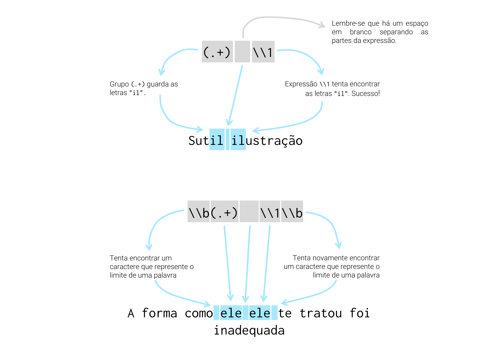
```


Isso significa, que a expressão `"(que) \\1"` seria capaz de encontrar o texto "A imagem de Naka**que que**ima em meu corpo", ou o texto "É claro **que que**ro!". Ampliando esse exemplo para uma expressão mais geral, poderíamos rapidamente realizar que a expressão `"(.+) \\1"` seria capaz de encontrar textos como "Sut**il il**ustração", assim como "fez-s**e e**ngendrado". Dessa forma, o atalho `\\b` impõe limites a nossa pesquisa, que evitam esse tipo de inconveniência.


### Mais sobre padrões

Mesmo estando presente em diversos programas e linguagens, as expressões regulares possuem certa variabilidade, ou apresentam diferentes "gostos" ou "estilos" em cada uma dessas plataformas. 

Dito de outra forma, as linguagens JavaScript, Python e R, oferecem um mecanismo próprio de expressões regulares, porém, a forma como esse mecanismo é implementado e quais são as funcionalidades que ele oferece em cada linguagem, pode variar. 

Portanto, existem alguns padrões diferentes estabelecidos de expressões regulares. Apesar disso, a maior parte dos programas e linguagens de programação utilizam o padrão mais popular e completo de todos, que é o padrão criado pela linguagem Perl. Todas as linguagens acima oferecem pacotes e módulos que te permitem utilizar esse padrão.

Contudo, por padrão, as funções da família `grep()` adotam um padrão diferente de expressões regulares estendidas (*extended regular expressions*), chamado de POSIX 1003.2, o qual é equivalente ao estilo oferecido pelo programa `egrep`. Entretanto, essas funções também permitem o uso de expressões regulares no estilo adotado pela linguagem Perl. Basta configurar o seu argumento `perl` para `TRUE`.

Por outro lado, as funções do pacote `stringr` utilizam as bibliotecas em C do projeto *ICU* (*International Components for Unicode*), que oferecem um estilo de expressões regulares muito próximo do padrão da linguagem Perl. Para mais detalhes sobre essa biblioteca, além de uma lista bem útil de todos os *metacharacters* disponíveis, você pode consultar o [site do projeto](https://unicode-org.github.io/icu/userguide/strings/regexp.html).


## Substituindo partes de um texto com `str_replace()`


A função `str_replace()` e sua variante `str_replace_all()`, lhe permite aplicar uma expressão regular sobre o seu texto, e substituir a área encontrada (ou áreas encontradas) por um novo valor de seu interesse. Por exemplo, se eu possuo o conjunto de palavras abaixo, e desejo substituir qualquer vogal por um *underline*, eu precisaria do seguinte comando. 

```{r}
palavras <- c("arquivo", "estante", "livro", "estiagem",
              "dinheiro", "paz")

palavras <- str_replace(palavras, "[aeiou]", "_")

palavras
```

Entretanto, perceba acima, que apenas a primeira vogal é alterada. Isso não apenas é um comportamento natural da função `str_replace()`, mas também é um padrão adotado por muitos dos sistemas de expressão regular. Como foi colocado por @friedl2006 [, p 148]: *"any match that begins earlier (leftmost) in the string is always preferred over any plausible match that begins later"*. Com isso, o autor quis destacar que o ato de parar a pesquisa na primeira correspondência encontrada, faz parte dos princípios de muitas expressões regulares. 

Porém, em muitos momentos, haverá a necessidade de sobrepor esse comportamento, de forma que a sua expressão possa encontrar todas as correspondências presentes em uma *string*. Por esse motivo, o pacote `stringr` oferece diversas funções variantes que terminam com o padrão `*_all()`. Essas funções buscam justamente solucionar esse problema e, por isso, aplicam a expressão regular sobre todo o texto, com o objetivo de encontrar o maior número possível de correspondências.

Portanto, ao empregarmos a variante `str_replace_all()`, desejamos substituir todas as correspondências encontradas por uma expressão regular em cada *string*, por um novo valor textual. Veja que o exemplo abaixo é praticamente idêntico ao anterior, apenas a função `str_replace()` foi alterada para `str_replace_all()`.

```{r}
palavras <- str_replace_all(palavras, "[aeiou]", "_")

palavras
```

Como um outro exemplo, poderíamos simular o trabalho executado pela função `str_trim()`, com as funções `str_replace()` e `str_replace_all()`. O comando `str_replace(vec, "^( )+", "")` estaria procurando por qualquer linha que se inicia por uma quantidade $y$ (sendo $y > 0$) de espaços em branco, e substituindo esses espaços por nada (\texttt{\textquotedbl\textquotedbl}). Dessa maneira, este comando equivale à `str_trim(vec, side = "left)`. Já o comando `str_replace_all(vec, "^( )+|( )+$", "")`, buscaria qualquer linha que se inicia ou termina por uma quantidade x de espaços em branco, e em seguida, substituiria esses espaços por nada. Sendo assim, esse comando equivale à `str_trim(vec, side = "both")`.

```{r}
vec <- c(
  "  Russo é a língua oficial da Rússia   ",
  "   Japão se encontra na Ásia",
  "Português nunca foi tão difícil!   ",
  "  224,90 "
)

str_replace(vec, "^( )+", "")

str_replace_all(vec, "^( )+|( )+$", "")
```


Para mais, *backreferencing* se torna uma ferramenta extremamente útil em conjunto com `str_replace()`. Por exemplo, suponha que você tenha se esquecido de adicionar o símbolo da moeda brasileira em cada valor numérico. Com a expressão regular `"([0-9]+(,[0-9]+)?)"` podemos encontrar esses valores numéricos. Repare que toda a expressão está contornada por parênteses, logo, todo o número é salvo para o índice `\\1`. Dessa maneira, basta antecedermos esse índice pelo símbolo que desejamos inserir (`"R$\\1"`).


```{r}
vec <- c("O litro de leite custa 3,50", "O ingresso foi caro. Mais de 500 reais!", 
         "230015")

str_replace(vec, "([0-9]+(,[0-9]+)?)", "R$\\1")
```


## Dividindo *strings* com `str_split()`

Você também pode utilizar uma expressão regular para detectar "pontos de quebra" em uma cadeia de texto e, em seguida, quebrar essa cadeia nesses pontos determinados. Repare no exemplo abaixo, que a função `str_split()` nos retorna como resultado, uma lista de vetores, onde cada elemento dessa lista, contém os "pedaços" de cada elemento do vetor original (`vec`). Logo, se você está aplicando `str_split()` sobre um vetor com 34 elementos, você terá uma lista com 34 elementos em seu produto final.


```{r}
vec <- c(
  "1 : 2 : 3 : 4 : 5 : 6 : 7",
  "Faria, Pedro Duarte : 1290321_1",
  "Objeto não localizado : 10_0x341167",
  "A732 : B3 : 24 : C1 : 90 : 89 : QUA : ABD : AQZ29 : C11 : 01ER"
)

str_split(vec, " : ")
```

Contudo, a depender do que você planeja fazer em seguida, pode ser difícil trabalhar com uma lista. Por isso, a função `str_split()` nos oferece o argumento `simplify`, no qual podemos requisitar a função que simplifique o resultado para uma matriz. 

```{r}
str_split(vec, " : ", simplify = TRUE)
```


## Extraindo apenas a correspondência de sua expressão regular com `str_extract()`

Assim como substituir suas correspondências por novos valores, você também tem a capacidade de extrair essas correspondências isoladamente, por meio da função `str_extract()`. Essa funcionalidade se torna extremamente importante quando não apenas a estrutura de cada elemento de seu vetor difere, mas também, quando a posição de seu alvo ao longo da cadeia de texto varia. Essas características tornam impossível a extração de nosso alvo com a função `str_sub()` (que apresentamos anteriormente), que se baseia diretamente na posição dos caracteres ao longo do texto. 

Por isso, a melhor alternativa para superarmos esse empecilho, é empregar uma expressão regular que possa detectar os nossos alvos e, com isso, extraí-los por meio da função `str_extract()`. Como exemplo, podemos extrair todos os anos presentes em cada elemento do vetor `per`, através do seguinte comando:

```{r}
per <- c("Janeiro_2020", "Visitei Pará de Minas em Fevereiro de 2019",
         "2020 foi um ano terrível", "O Brasil era a 11° economia do mundo em 2005")

str_extract(per, "\\d{4}")
```

Ou melhor, podemos colocar o texto original e a parte extraída em uma tabela:

```{r}
tibble(
  text = per,
  ano = str_extract(per, "\\d{4}")
)
```


Assim como `str_replace()`, `str_extract()` é capaz de extrair apenas a primeira correspondência encontrada por sua expressão regular. Por esse motivo, você irá precisar de sua variante, `str_extract_all()`, em todas as ocasiões em que você tiver mais de um alvo a ser extraído em cada texto. Por exemplo, podemos extrair o valor de cada medida presente em `medidas`, por meio da expressão `"([0-9]+)([.][0-9]+)?"`.

```{r}
### Largura X Altura X Profundidade (Peso, Classe)
medidas <- c(
  "8.15 m X 2.23 m X 4.5 m (240 Kg, B)",
  "1.14 m X 3.1 m X 0.9 m (15 Kg, A)",
  "4.98 m X 9.2 m X 5.25 m (120 Kg, A)",
  "3.14 m X 3.89 m X 3.41 m (86 Kg, C)"
)

tab <- str_extract_all(
  medidas,
  "([0-9]+)([.][0-9]+)?",
  simplify = TRUE
)

colnames(tab) <- c(
  "Largura", "Altura", "Profundidade", "Peso"
)

tab
```


```{r, child = "Exercícios/exec_cap10.Rmd"}

```


<!--chapter:end:10-strings.Rmd-->


# Introduzindo fatores (`factor`'s) com `forcats`


## Introdução e pré-requisitos

No capítulo de [Fundamentos da Linguagem R](#sec:fundamentos_R), introduzimos os 4 tipos básicos de dados disponíveis no R, sendo eles: `integer`; `double`; `character`; e `logical`. Entretanto, também destacamos que outros tipos de dados "mais complexos" estão presentes na linguagem R, e, que eles serão tão importantes quanto os tipos básicos em suas análises.

Os exemplos mais importantes desses tipos são os fatores (`factor`) e as variáveis de tempo, isto é, datas e horários (`Date` ou `POSIXct`). Neste capítulo, vamos focar a discussão no tipo `factor`, e, no próximo capítulo, discutiremos os tipos referentes às variáveis de tempo.

Parte dos exemplos deste capítulo, envolvem o uso de funções do pacote `forcats`, portanto, não se esqueça de instalar esse pacote (com o comando `install.packages()`), e, logo depois, chamar pelo pacote para a sua sessão (com o comando `library()`). O pacote `forcats` está incluso no pacote `tidyverse`, e, por isso, o `tidyverse` representa um caminho alternativo para você acessar as funções deste pacote.

```{r, eval = F}
library(forcats)
## Ou
library(tidyverse)
```


## O que são fatores ?


Um fator (ou `factor`) é um tipo de dado do R desenvolvido para o trabalho com **variáveis categóricas**, ou **variáveis qualitativas**. Ou seja, o tipo de dado `factor` lhe permite armazenar características e qualidades que um indivíduo carrega, ou de outra forma, qual a "categoria" ou grupo em que cada indivíduo de sua tabela se encaixa. 

O sexo e a cor de pele são dois exemplos clássicos de variáveis qualitativas, pois elas identificam uma característica física do indivíduo. Características essas que determinam se o indivíduo pertence ou não a um grupo específico de pessoas (mulheres pardas, homens brancos, etc.). A faixa etária é um outro exemplo muito comum, sendo uma variável que busca separar indivíduos em vários grupos de acordo com as suas idades.


Entretanto, para além de características e categorias, também podemos identificar uma variável categórica, ao percebermos se essa variável pode (ou deve) assumir um conjunto muito específico e muito bem definido de valores [@Rlanguage, p 8]. Por exemplo, uma variável que apresente o sexo de uma pessoa pode assumir apenas dois valores diferentes (Homem ou Mulher; Masculino ou Feminino; H ou M; ou alguma outra variação desses valores). Pode haver ainda, a necessidade de incluir um terceiro valor para casos especiais, como "Indefinido", mas em geral, o sexo assume apenas os dois valores supracitados^[Pode haver certa confusão entre sexo e gênero aqui. O sexo se refere às características físicas e biológicas do corpo, e essas características podem identificar uma pessoa como Homem ou Mulher. Já o gênero, está muito mais relacionado à cultura e a forma como um indivíduo se identifica como ser. Logo, se nossa variável identificasse o gênero de uma pessoa, haveria muito mais possibilidades do que a simples divisão entre Homem e Mulher.]. Como um outro exemplo, uma variável que guarda o mês do ano ao qual os dados de sua tabela se referem pode assumir apenas doze valores diferentes (janeiro, fevereiro, março, ..., novembro, dezembro), logo, essa também é uma variável categórica sob essa perspectiva.


## Como construir um fator

Suponha que você tenha questionado o sexo de várias pessoas, e anotado as suas respostas no vetor abaixo (`entrevista`):

```{r}
entrevista <- c("Mulher", "Homem", "Homem", "Mulher", "Mum")
```

Se você deseja transformar esse vetor acima (que no momento é um vetor do tipo `character`) em um vetor do tipo `factor`, você deve primeiro pensar sobre o atributo `levels` que será utilizado neste vetor. Ou seja, **todo objeto do tipo `factor` no R possui um atributo chamado `levels`**, que representa o conjunto de valores que a variável em questão pode assumir. Como estamos anotando o sexo de algumas pessoas entrevistadas, sabemos que essa variável pode assumir apenas dois valores diferentes. Eu crio o vetor abaixo (`niveis_sexo`) com o objetivo de guardar essas informações.

```{r}
niveis_sexo <- c("Homem", "Mulher")
```


Agora que temos o vetor com a informação original (`entrevista`) e um vetor com os níveis, ou, os valores permitidos para essa variável (`niveis_sexo`), podemos criar o nosso fator através da função `factor()`.

```{r}
vec_fator <- factor(entrevista, levels = niveis_sexo)
vec_fator
```

Perceba acima, que ao chamarmos pelo novo fator criado, os níveis da variável (atributo `levels`) são mostrados logo abaixo dos valores armazenados. Repare também, que todos os valores presentes no vetor original (`entrevista`) e que estejam fora dos níveis da variável (`niveis_sexo`) são silenciosamente convertidos para valores `NA`. Isto é, qualquer valor que esteja minimamente divergente dos valores presentes em `levels`, ou que contenha algum erro ortográfico, será convertido para um valor `NA`.

Você sempre pode acessar os níveis (isto é, o atributo `levels`) de um fator por meio da função `levels()`. Basta aplicá-la diretamente sobre o fator, que um vetor contendo esses níveis será retornado para você.

```{r}
levels(vec_fator)
```


Vale destacar, que para o R, um vetor do tipo `factor`, é na verdade, um vetor do tipo `integer` que carrega uma classe `factor`, e que possui um atributo chamado `levels`. Esse é um dos principais motivos pelos quais os tipos `factor`, `Date` e `POSIXct` são caracterizados como tipos "mais complexos" da linguagem R. Pois esses tipos são construídos a partir dos quatro tipos básicos, mas eles também acumulam novas características ou propriedades que não estão presentes nesses tipos básicos. 


No caso do tipo `factor`, ele é construído a partir do tipo `integer` devido a forma como o R guarda os valores presentes em um vetor do tipo `factor` [@Rlanguage, p 8]. Por exemplo, os valores "Homem" e "Mulher" do vetor `vec_fator` acima, são guardados pelo R como valores 1 e 2, e são posteriormente traduzidos como valores "Homem" e "Mulher" quando chamamos pelo vetor `vec_fator`. Tudo isso ocorre, devido às propriedades e atributos que um vetor do tipo `factor` carrega, e que o diferenciam de um vetor do tipo `integer`.

```{r}
typeof(vec_fator)
class(vec_fator)
attributes(vec_fator)
```


## Porque utilizar fatores se eu posso armazenar como texto ?

Você provavelmente está se perguntando qual a necessidade verdadeira dos fatores, levando em conta que você pode utilizar o tipo `character` para armazenar os dados de um variável qualitativa. @wickham2017 [, p 224] nos concede um ótimo exemplo de como um fator pode fazer toda a diferença. 

Por exemplo, suponha que você possua o vetor abaixo contendo alguns meses do ano. Em geral, há dois problemas no uso de um vetor do tipo `character` para guardar essas informações.

```{r}
vec <- c("Mar", "Fev", "Jan", "Set", "Out", "Abr")
```

Primeiro, você não está prevenido contra possíveis erros ortográficos. Isso pode ser um problema de pouca importância caso esses dados estejam sendo gerados por uma máquina ou programa, mas ele se torna um problema sério caso você esteja anotando esses valores na mão, ou esteja constantemente corrigindo-os de alguma maneira que seja suscetível ao erro. Logo, se algum mês for incorretamente gravado, nenhum erro ou medida cautelar será acionada pelo R para corrigir esse problema.

Segundo, quando essas informações estão sendo guardadas pelo tipo `character`, o sistema de ordenação utilizado pelo R (ordenação alfabética) é de pouca utilidade. Como você pode ver abaixo, o R acabou colocando o mês de abril antes dos meses de fevereiro e janeiro.

```{r}
sort(vec)
```

O uso do tipo `factor` consegue resolver ambos desses problemas. Pois você já sabe que qualquer valor disposto em `vec`, que possua algum erro ortográfico em comparação com os meses dispostos no atributo `levels` do fator será automaticamente convertido para um valor `NA`. Além disso, **ao ordenar um objeto do tipo `factor`, o R sempre vai utilizar como referência, a ordem na qual os valores estão apresentados no atributo `levels`.**

Como o vetor `vec` guarda alguns meses do ano, o vetor `meses` abaixo, representa o atributo `levels` do fator a ser criado a partir de `vec`. Lembre-se que, a ordem na qual os meses estão dispostos no atributo `levels`, afeta diretamente a maneira como o R ordena o fator. Logo, a ordem em que você fornece os valores em `meses`, será a ordem utilizada pelo R ao ordenar os valores de `vec_fator`.

```{r}
meses <- c("Jan", "Fev", "Mar", "Abr", "Mai", "Jun",
           "Jul", "Ago", "Set", "Out", "Nov", "Dez")

vec_fator <- factor(vec, levels = meses)
vec_fator
sort(vec_fator)
```


## Não construir o atributo `levels` é contraintuitivo

Apesar de ser o ideal, você não precisa obrigatoriamente construir o atributo `levels` ao formar um fator. Pois você tem a opção de delegar esse trabalho para a própria função `factor()`, ao aplicá-la diretamente sobre o seu vetor de interesse. 

Porém, ao escolher esse caminho, `factor()` vai extrair todos os valores únicos de seu vetor, e posicioná-los em ordem alfabética no atributo `levels`. Ou seja, supondo que o seu vetor de interesse se chame `x`, é como se o atributo `levels` de seu fator, equivalesse ao resultado dos comandos: `unique(x) %>% sort()`; ou de outra forma: `sort(unique(x))`. Veja o exemplo abaixo:

```{r}
v_letras <- c("e", "a", "b", "c", "a", "b", "d")
f <- factor(v_letras)
f
sort(f)
```

Perceba acima, que tal comportamento de `factor()` torna o uso de fatores, algo inútil ou desnecessário. Pois a ordenação de seu fator será idêntica à ordenação alfabética utilizada sobre um vetor do tipo `character`. Lembre-se que para a ordenação de um fator, é utilizada a ordem na qual os valores são apresentados em `levels()`. Tal ponto pode ser inferido pelo exemplo abaixo, em que a ordenação produzida sobre os valores de `v_letras` é a mesma (em comparação com o resultado acima) quando ela se encontra no tipo `character`.

```{r}
v_letras <- c("e", "a", "b", "c", "a", "b", "d")
typeof(v_letras)
sort(v_letras)
```


## Alterando a ordem dos níveis de um fator

Portanto, o sistema de ordenação é um dos principais recursos do tipo `factor` no R, e tal sistema está diretamente conectado com o seu atributo `levels`. Por isso, uma das principais atividades com fatores está na reordenação e do atributo `levels`, ou em sua reatribuição. 


### A maneira mais simples e direta

A forma mais "simples" de alterarmos esse atributo é redefinindo-o por completo através da função `levels()`. Repare no exemplo abaixo, que apenas a letra "a" foi reposicionada no atributo.

```{r}
levels(f) <- c("b", "c", "d", "e", "a")
sort(f)
```


Tal operação poderia ser realizada de diversas formas. Por exemplo, caso o seu fator possua um número muito grande de níveis, ao invés de reescrevê-los na mão, talvez seja mais rápido utilizar técnicas de *subsetting* para reordenar os níveis da maneira desejada. 


```{r}
## Criando um fator com muitos níveis
f <- c("a", "b", "c", "d", "e")
levels(f) <- c(
  "a", "b", "c", "d", "e", "f", "g",
  "h", "i", "j", "k", "l", "m", "n",
  "o", "p", "q", "r", "s", "t", "u",
  "v", "w", "x", "y", "z"
)

## Selecionando os níveis atuais
## e reordenando-os com subsetting
niveis_atuais <- levels(f)
n_niveis <- length(niveis_atuais)
novos_niveis <- niveis_atuais[c(4:2, 5:n_niveis, 1)]

## Redefinindo os níveis do fator
levels(f) <- novos_niveis
f
```


### Maneiras alternativas que podem fazer a diferença

O pacote `forcats` oferece várias funções voltadas especificamente para o trabalho com fatores no R. Dentre essas funções, temos a `fct_infreq()`, que lhe permite reordenar o atributo `levels` de acordo com a frequência em que cada nível aparece no vetor (do nível mais frequente para o menos frequente).

```{r}
v_letras <- c("e", "d", "d", "c", "a", "a", "a", "c",
              "b", "d", "d", "e", "d", "a", "d", "c")
f <- factor(v_letras)
fct_infreq(f)
```

Além disso, você também pode estar interessado em ordenar os níveis de um fator, de acordo com a ordem da primeira aparição de cada nível. Para isso, nós podemos utilizar a função `fct_inorder()`. Perceba pelo resultado do exemplo abaixo, que as letras "e", "d" e "c" antecedem as letras "a" e "b" no atributo `levels` do fator gerado, pois essas letras aparecem primeiro no vetor original.

```{r}
fct_inorder(f)
```


Para mais, haverá momentos em que você deseja ordenar os níveis de seu fator, de acordo com uma segunda variável. Essa situação ocorre principalmente quando o seu fator está incluso em um `data.frame`, junto de várias outras variáveis de seu interesse. Para tal ação, temos a função `fct_reorder()`, que lhe permite fornecer uma segunda variável na qual a ordenação do atributo `levels` será baseada.

Como exemplo, suponha que você possua a seguinte tabela contendo receitas mensais de algumas lojas:

```{r}
unidades <- c("Savassi", "Centro", "Gameleira", "Pampulha")
set.seed(3)
tab <- tibble(
  ano = 2021,
  mes = rep(1:12, each = 4),
  unidade = rep(unidades, times = 12),
  receita = rnorm(48, 17000, 4800)
)
tab <- arrange(tab, mes, unidade)
tab
```

No exemplo abaixo, ao transformarmos a variável `unidade` em um fator, os níveis da variável são organizados em ordem alfabética, como era esperado.

```{r}
tab$unidade <- factor(tab$unidade)
tab$unidade
```

A função `fct_reorder()` vai sempre ordenar o seu fator de acordo com um sumário, ou alguma estatística descritiva da segunda variável. Por isso, você deve se perguntar qual estatística descritiva você deseja utilizar sobre a segunda variável em questão. Como exemplo, você talvez queira ordenar os níveis de `unidade`, de acordo com a receita média mensal de cada loja. 

Logo, desejamos aplicar uma função de média sobre a variável `receita` ao longo de cada nível do fator `unidade`. Por isso, eu forneço a função `mean()` ao argumento `.fun` de `fct_reorder()`. Como podemos ver abaixo, as unidades do Centro e da Savassi possuem receitas médias menores do que unidades da Pampulha e da Gameleira, pois essas unidades se encontram nas primeiras posições do atributo `levels` do fator resultante de `fct_reorder()`. Ou seja, a função `fct_reorder()` utiliza, por padrão, uma ordem crescente no atributo `levels`. Caso você deseje inverter esse comportamento, basta configurar o argumento `.desc` da função para `TRUE`.

```{r}
## Utilize: fct_reorder(unidade, receita, .fun = mean, .desc = TRUE)
## para utilizar uma ordenação crescente no atributo levels
tab <- tab %>% 
  mutate(
    unidade = fct_reorder(unidade, receita, .fun = mean)
  )

tab$unidade
```


## Reordenando fatores em gráficos

A ordem na qual apresentamos certas informações pode mudar drasticamente não apenas as características físicas e visuais de seu gráfico, mas também, pode afetar e muito a clareza ou a ênfase em certas informações que são cruciais em nosso gráfico. Por essa razão, reordenar variáveis categóricas em seu gráfico pode ser fundamental. Veja o primeiro exemplo abaixo, dado por @wickham2017 [, p 228].

Dentre as funções que mostramos na seção passada, a função `fct_reorder()` é talvez a mais útil delas em gráficos. Por exemplo, no gráfico abaixo, temos certa dificuldade em comparar e, principalmente, classificar os vários tempos médios gastos dentro de cada grupo religioso. 

```{r, out.width="65%"}
relig <- gss_cat %>%
  group_by(relig) %>%
  summarize(
    age = mean(age, na.rm = TRUE),
    tvhours = mean(tvhours, na.rm = TRUE),
    n = n()
  )

relig %>% 
  ggplot() + 
  geom_point(aes(tvhours, relig))
```

Tal problema, pode ser rapidamente resolvido ao aplicarmos a função `fct_reorder()` sobre a variável no eixo y, para que ela seja reordenada de acordo com os valores da variável do eixo x do gráfico. Perceba abaixo, que agora temos uma facilidade muito maior em comparar e classificar os vários tempos médios gastos em cada grupo religioso. Com essa nova ordenação, podemos rapidamente identificar que as pessoas que não sabem (*"Don't know"*) a sua religião (ou que são ateus), são aquelas que mais gastam seu tempo em frente a uma televisão.

```{r, out.width="65%"}
relig %>% 
  ggplot() + 
  geom_point(
    aes(tvhours, fct_reorder(relig, tvhours))
  )
```


Como um outro exemplo, pode haver certas variáveis que não necessitam de uma reordenação acentuada. Além disso, tais variáveis podem possuir uma ordem própria, que não depende de uma segunda variável. Ou seja, essas variáveis podem possuir uma "ordem natural". Essa característica, torna o uso de `fct_reorder()` inadequado (lembre-se que `fct_reorder()` busca reordenar um fator de acordo com os valores de uma segunda variável).

Por exemplo, se você olhar para o gráfico abaixo, você poderá perceber que temos uma variável de faixa etária no eixo y, e que apenas a faixa de "Menos de 10" está incorretamente posicionada no eixo. Pelo fato das faixas etárias possuírem uma "ordem natural", isto é, as faixas "mais altas" são aquelas referentes às idades mais elevadas, enquanto as faixas "mais baixas" são aquelas referentes às idades "mais baixas", não faz sentido reordenarmos essa variável de acordo com os valores de uma segunda variável.

```{r, include = F}
github <- "https://raw.githubusercontent.com/pedropark99/"
arquivo <- "Curso-R/master/Dados/datasus.csv"
datasus <- read_csv2(paste0(github, arquivo))

totais <- datasus %>% 
  group_by(`Faixa etaria`) %>% 
  summarise(
    Total = sum(Contagem)
  )
```

```{r, out.width="65%", eval = F}
github <- "https://raw.githubusercontent.com/pedropark99/"
arquivo <- "Curso-R/master/Dados/datasus.csv"
datasus <- read_csv2(paste0(github, arquivo))

totais <- datasus %>% 
  group_by(`Faixa etaria`) %>% 
  summarise(
    Total = sum(Contagem)
  )
```
```{r, out.width="65%"}
totais %>% 
  ggplot() +
  geom_col(
    aes(y = `Faixa etaria`, x = Total)
  )
```


Portanto, a faixa de "Menos de 10" é a única faixa a ser reposicionada, e podemos realizar tal ação com a função `fct_relevel()`. Repare no exemplo abaixo, que após o ajuste, a faixa "Menos de 10" foi realocada para a posição mais inferior do eixo.

```{r, out.width="65%"}
totais %>% 
  mutate(
    `Faixa etaria` = fct_relevel(`Faixa etaria`, "Menos de 10")
  ) %>% 
  ggplot() +
  geom_col(
    aes(y = `Faixa etaria`, x = Total)
  )
```


Além dessas opções, a função `fct_infreq()` é muito útil para gráficos de barras do `ggplot`, que incluem por padrão um cálculo de frequência. Em outras palavras, ao lembrarmos que `fct_infreq()` busca reordenar um fator de acordo com a frequência em que os seus níveis aparecem em seus dados, se torna muito natural aliarmos essa função a um gráfico de barras do `ggplot`. 

Por exemplo, se gerarmos um gráfico de barras a partir de cada cor de pele presente em nossa tabela `datasus`, temos o seguinte resultado:

```{r, out.width="65%"}
datasus %>% 
  ggplot() +
  geom_bar(
    aes(x = Cor)
  )
```

Agora, com o uso de `fct_infreq()` podemos reposicionar essas barras em um sentido mais lógico, como está demonstrado abaixo:

```{r, out.width="65%"}
datasus %>% 
  ggplot() +
  geom_bar(
    aes(x = fct_infreq(Cor))
  )
```


## Modificando os níveis de um fator

Até o momento, demos bastante foco sobre a ordenação dos valores presentes no atributo `levels`. Justamente pelo fato de que essa característica define uma das principais vantagens do tipo `factor` no R, que é a de modificar a forma como a linguagem ordena os valores presentes em um vetor. Porém, ainda não discutimos o que ocorre quando nós deliberadamente alteramos um dos valores presentes no atributo `levels`. 

Por exemplo, suponha que eu possua o fator abaixo. Nesse caso, o fator `f` possui quatro níveis, sendo eles: `a`, `b`, `c`, e `d`.

```{r}
vec <- c("a", "c", "c", "d", "b", "a", "b")
f <- factor(vec, levels = c("a", "b", "c", "d"))
f
```

Agora, o que ocorre se eu tentar modificar o primeiro nível (`a`) desse fator? De maneira elegante e surpreendente, o R irá substituir todos os valores `a` presentes no fator, pelo novo valor definido, como está demonstrado abaixo:

```{r}
levels(f) <- c("m", "b", "c", "d")
f
```

Assim como nas seções anteriores, o pacote `forcats` também oferece algumas funções muito úteis para esse procedimento. Veja o exemplo abaixo, em que eu utilizo a função `fct_recode()` para reconfigurar todos os níveis (ou valores) presentes coluna `Cor` em nossa tabela `datasus`.

```{r}
datasus %>% 
  mutate(
    Cor = fct_recode(
      Cor,
      "Carmim" = "Parda",
      "Azul" = "Amarela",
      "Bronze" = "Branca",
      "Roxo" = "Indígena"
    )
  )
```


Caso você precise unir diversos níveis em um só, ou, em outras palavras, se você precisa agregar vários níveis, a função `fct_collapse()` é uma melhor escolha. Pois ela lhe permite fornecer um vetor contendo todos os níveis antigos a serem agregados em um só. Veja o exemplo abaixo, em que eu agrego diversas faixas etárias, gerando assim, uma descrição etária menos detalhada:

```{r}
datasus %>% 
  mutate(
    `Faixa etaria` = fct_collapse(
      `Faixa etaria`,
      "Menos de 19 anos" = c("Menos de 10", "10 a 14", "15 a 19"),
      "Entre 20 e 64 anos" = c("20 a 24", "25 a 29", "30 a 34",
                               "35 a 39", "40 a 44", "45 a 49",
                               "50 a 54", "55 a 59", "60 a 64"),
      "Acima de 64 anos" = c("65 a 69", "Mais de 70")
    )
  )
```


<!--chapter:end:11-factors.Rmd-->


# Introdução à variáveis de tempo com `lubridate`


## Introdução e pré-requisitos {#sec:lubridate_var_tempo}

Variáveis de tempo são aquelas que guardam **informações que se encontram em alguma unidade de tempo**. Exemplos são: datas (i.e. 20 de março de 2020), ou horários - que preferencialmente são acompanhados por uma data (i.e. 11:45 da manhã do dia 12 de fevereiro de 2001; ou, 12/02/2001 11:45:00), ou ainda, a duração (ou o tempo) de algum evento (12 segundos, 12 dias, 2 semanas, 1 mês e meio, etc.).

Tais variáveis podem ser interpretadas no R por meio de quatro tipos de dados diferentes, sendo eles: `Date`, `POSIXlt`, `POSIXct` e `difftime`. Logo, neste capítulo, vamos focar nesses quatro tipos de dados, e, introduzir várias ferramentas e operações comumente aplicadas sobre eles. Parte dessas ferramentas advém do pacote `lubridate` e, portanto, para acompanhar os exemplos deste capítulo, você deve (após instalar esse pacote em sua máquina) chamar por esse pacote em sua sessão, através do comando `library()`.

```{r, eval = F}
library(lubridate)
```

## O pacote `lubridate`

Como é bem descrito por @rnews2001 e @rnews2004, desde sua versão 1.9, o R oferece "de fábrica" um excelente suporte para variáveis de tempo. Suas funções são capazes de lidar muito bem com diferenças entre fusos horários, além de incluírem anos bissextos e horários de verão. Porém, mesmo com esse potencial, essas funções (`as.Date()`, `as.POSIXct()`, `strptime()`, dentre outras) tendem a aplicar definições muito formais, tornando-as assim, pouca intuitivas para muitos usuários.

Por esse motivo, o pacote `lubridate` tem tido muito sucesso ao longo da comunidade, ao prover funções que realizam grande parte do trabalho irritante com essas funções. Ou seja, no fundo, várias das funções do pacote `lubridate` são apenas *wrappers*, isto é, são construídas a partir das funções do pacote básico do R. Significa que o pacote `lubridate` foi criado, em grande parte, com o intuito de facilitar o nosso trabalho com as ferramentas que o R já oferece, ao invés de remodelá-las por completo.

Portanto, ao longo deste capítulo, você irá aprender primeiro sobre as funções do pacote `lubridate`, e, em seguida, as funções básicas do R são apresentadas para aqueles que desejam conhecer mais a fundo tal sistema. Dessa forma, nós estaremos apresentando primeiro, o atalho, e, em seguida, o caminho completo.


## Datas com o tipo `Date`

No R, datas são normalmente interpretadas através do tipo de dado `Date`. Temos 3 métodos principais de se criar uma data no R (existem outros métodos menos intuitivos^[Em resumo, datas podem ser criadas a partir de todos os outros tipos que vimos até o momento (`character`, `double`, `integer`, `logical`, e `factor`). Para mais detalhes, consulte `?as.Date` e `?Date`.]), os quais estão resumidos na figura 12.1 abaixo, e que são apresentados a seguir: 1) a partir de *strings* (um vetor do tipo `character`); 2) a partir de cada componente da data (dia, mês e ano); e 3) a partir de números. 

```{r, echo = FALSE, fig.cap = "Principais métodos para se criar datas no R"}
knitr::include_graphics("Figuras/layout_horizontal_dates.png")
```


Dentre as funções dos pacotes básicos do R, a função `as.Date()` é a principal função responsável por criar vetores do tipo `Date`. Todavia, ao longo dessa seção, estaremos focados nas funções do pacote `lubridate`, em especial, a função `as_date()`. De qualquer forma, saiba que, no fim das contas, as funções desse pacote vão utilizar a função `as.Date()` para criar o vetor contendo as suas datas. As funções `as_date()` e `as.Date()` são muito semelhantes entre si, logo, grande parte do conhecimento mostrado em `as_date()`, pode ser diretamente aplicado em `as.Date()`.

Ao longo das próximas seções, você pode rapidamente perceber que a formação de dados do tipo `Date` (assim como dos tipos `POSIXct` e `POSIXlt`) no R, envolve o ato de coerção de vetores que se encontram em outros tipos (como `character` ou `double`) para o tipo `Date`. Em outras palavras, não é possível criarmos diretamente um vetor do tipo `Date`. O motivo para tal prática, pode ser atribuído às diversas maneiras em que uma mesma data (além das outras variáveis de tempo) pode ser escrita, ou representada. Por essa diversidade, o R busca oferecer flexibilidade aos seus usuários, através de diferentes métodos de coerção. A figura 12.1, resume os principais métodos que vamos aprender ao longo dessa seção, além de algumas características importantes que envolvem o tipo `Date`.


### A partir de *strings*

Como exemplo inicial, podemos fornecer à função `as_date()` (do pacote `lubridate`), a data 01 de abril de 2020 como um *string*. Repare abaixo, que o resultado final da operação é um vetor do tipo `Date` (e não do tipo `character`).

```{r}
d <- as_date("2020-04-01")
d
class(d)
```


Entretanto, você talvez tenha achado estranho o formato em que a data foi escrita na função `as_date()`. Pois no Brasil, datas são normalmente escritas no padrão "dia/mês/ano" (ex: 01/04/2020), e não "ano-mês-dia". Este é o formato estipulado pelo padrão internacional ISO-8601, que é o padrão adotado pelo R. Ou seja, no R, datas são manipuladas, estocadas, fornecidas e apresentadas no formato "ano-mês-dia". 

Você irá rapidamente perceber que, muitos países podem escrever uma mesma data de maneiras muito diferentes. Por exemplo, nos EUA, datas são usualmente escritas no formato "mês-dia-ano" (ex: 02-18-2021), mas também aparecem muitas vezes em sua forma extensa (ex: February 18, 2021). Em algumas regiões da Espanha, datas são escritas no formato "ano/dia/mês" (ex: 2020/15/08). Também não é incomum encontrarmos em países nórdicos (Suécia, Finlândia, Dinamarca), datas escritas com o uso de pontos separando cada componente (ex: 2020.08.15).

Toda essa variedade só torna o nosso trabalho mais complicado, especialmente se nós não sabemos qual a origem, ou, o padrão adotado por essas datas. E não há nada que você possa fazer a respeito, a não ser, identificar por conta própria o padrão adotado e ajustar a função empregada de acordo com esse padrão.


### O que devo fazer se minhas datas se encontram em um formato diferente? {#sec:formato_diferente_date}

Portanto, caso você possua um conjunto de datas como *strings* (ou seja, em um vetor do tipo `character`), e, essas datas estejam em um formato diferente do estipulado pela ISO-8601, você tem 2 opções rápidas para transportar corretamente essas datas para o tipo `Date`.

Primeiro, todas as funções no R que lidam com variáveis de tempo, geralmente oferecem um argumento `format`, no qual você pode definir o formato, ou o padrão adotado por suas datas. Logo, você precisa apenas definir o argumento `format` em `as_date()`, ou em qualquer outra função que você esteja utilizando para essa coerção.

Segundo, você também pode utilizar as funções rápidas do pacote `lubridate`, `ymd()`, `dmy()`, `dym()` e `mdy()`, que já possuem uma ordem implícita, ou um `format` padrão. Dessa maneira, você economiza certo tempo, ao não ter que se preocupar com o argumento `format` nessas funções.

Por exemplo, suponha que você possua um conjunto de datas escritas no Brasil, guardadas no vetor `datas`, e que você deseja converter esse vetor (que se encontra no momento, no tipo `character`) para o tipo `Date`. Como os componentes da data estão na ordem "dia $\rightarrow$ mês $\rightarrow$ ano", eu utilizo a função `dmy()` para ler essas datas.

```{r}
datas <- c("15/03/2020", "16/03/2020", "18/03/2020", "24/03/2020")
dmy(datas)
```

Isso significa que, **a ordem na qual as letras "d", "m" e "y" aparecem no nome da função, representa a ordem adotada pelo argumento `format` dessa função**. Em outras palavras, a letra "d" simboliza o "dia"; a letra "m" por sua vez, o "mês"; e a letra "y", o "ano", ou, em inglês, *"year"*. Ou seja, a função `dmy()` espera como *input*, datas cujos componentes estejam na ordem "dia $\rightarrow$ mês $\rightarrow$ ano" (ou "`d` $\rightarrow$ `m` $\rightarrow$ `y`"). Já a função `ymd()`, tem como expectativa, datas cujos componentes estejam na ordem "ano $\rightarrow$ mês $\rightarrow$ dia" (ou "`y` $\rightarrow$ `m` $\rightarrow$ `d`").

Portanto, as funções rápidas `dmy()`, `ymd()` e suas irmãs, possuem implicitamente uma ordem esperada para os componentes de suas datas. Para mais, essas funções identificam automaticamente qualquer caractere que não seja um dígito, e os trata como os delimitadores que separam cada componente da data. Logo, não importa se cada componente está sendo separado por um hífen (`-`), ponto (`.`), cifrão (`$`) ou barra inclinada (`/`), essas funções serão capazes de detectar esses caracteres e ignorá-los durante a conversão.


Como já foi descrito acima, a segunda alternativa seria definirmos explicitamente o argumento `format` em `as_date()`. Neste argumento, você deve fornecer uma pequena definição^[A [Universidade da California - Berkeley](https://www.stat.berkeley.edu/~s133/dates.html) possui uma excelente página sobre como definir esses formatos, e que vale a pena conferir.] que descreve o padrão no qual a sua data se encontra. Para construir tal definição, você irá utilizar um conjunto de códigos, que são formados pelo símbolo de porcentagem acompanhado de uma letra específica. Cada um desses códigos, podem representar um dos três componentes de uma data (dia, mês e ano). A tabela 12.1 apresenta um resumo desses códigos. 


```{r, eval = FALSE, echo = FALSE, fig.align='center'}
tab <- tibble(
  "Código" = c("%d","%m","%b","%B","%y","%Y"),
  "Significado" = c("Dia do mês (número)", "Mês (número)", "Mês (nome abreviado do mês)", "Mês (nome completo do mês)", "Ano (2 dígitos)", "Ano (4 dígitos)"),
  "Exemplo" = c("24", "12", "Jan", "January", "05", "2005")
)

kableExtra::kable(tab, format = "latex", caption = "Códigos que representam cada componente de uma data")
```

|  <!-- -->   |
| :------------ |
|  |
Table: (\#tab:label6) Códigos que representam cada componente de uma data


Tendo os códigos acima, se uma data no Brasil é escrita no formato "dia/mês/ano", uma descrição que representa tal padrão é `"%d/%m/%Y"`. Como um outro exemplo, se temos as datas `"2021, 30-12"` e `"97,10,January"`, podemos utilizar respectivamente os valores `"%Y, %d-%m"` e `"%y,%d,%B"` para descrever os padrões adotados por cada uma. Veja os exemplos abaixo:

```{r}
datas <- c("15/03/2020", "16/03/2020", "18/03/2020", "24/03/2020")
as_date(datas, format = "%d/%m/%Y")
as_date("2021, 30-12", format = "%Y, %d-%m")
as_date("97,10,January", format = "%y,%d,%B")
as_date("12-30-1997", format = "%m-%d-%Y")
```

Um detalhe importante é que os códigos `%b` e `%B` são capazes de representar apenas os nomes dos meses em inglês (ex: *april*, *december*, *october*). Por isso, se as suas datas possuem os nomes dos meses, em qualquer outra língua que não seja o inglês, você terá que, obrigatoriamente, traduzir esses nomes para o inglês, ou convertê-los para sua versão numérica (março = 03; abril = 04; maio = 05; e assim por diante).

### A partir de cada componente

Também é muito comum, termos cada um dos componentes separados em uma coluna específica de nossa tabela. Como exemplo, temos abaixo a tabela `registros`, onde o ano, mês e dia estão separados em uma determinada coluna da tabela.

Para unirmos esses componentes em uma data, nós podemos utilizar a função `make_date()`. Por meio dessa função, você precisa apenas conectar os argumentos `year`, `month` e `day`, aos nomes das colunas que contém o ano, mês e dia (respectivamente), de cada observação da tabela, como demonstrado abaixo.

```{r}
registros <- tibble(
  valor = c(5.50, 4.25, 1.32, 24.10, 12.50),
  dia = c(5, 6, 8, 12, 15),
  mes = c(4, 4, 4, 4, 4),
  ano = c(2021, 2021, 2021, 2021, 2021)
)

registros <- mutate(
  registros,
  data = make_date(year = ano, month = mes, day = dia)
)

registros
```


Além disso, é importante frisar que, os seus componentes não precisam necessariamente estar dentro de um `data.frame`. Dito de outra forma, você também pode fornecer cada componente de sua data como um vetor. Veja o exemplo abaixo:

```{r}
dias <- c(1, 4, 12, 15, 7)
mes <- c(1, 1, 2, 2, 2)
ano <- c(2020, 2020, 2020, 2020, 2021)

make_date(year = ano, month = mes, day = dias)
```


### A partir de números

Para mais, o R também nos permite criar uma data a partir de um número. Por exemplo, eu posso criar a data `"2020-04-01"` (01 de abril de 2020) através do número 18353. Repare abaixo, que ao invés de um vetor do tipo `double` contendo o número inicial (18353), a operação me retorna um vetor do tipo `Date`, contendo a data supracitada. 

```{r}
d <- as_date(18353)
d
class(d)
```

Quando você fornece um vetor numérico à função `as_date()`, todos os números contidos neste vetor são tratados como o número de dias desde a data `"1970-01-01"`, ou, 01 de janeiro de 1970. Em outras palavras, o R utiliza uma "escala de dias", e a data `"1970-01-01"` representa a origem, ou o ponto zero dessa escala (para representar dias anteriores a essa data, utilizamos números negativos). Nós denominamos essa data, como a **data de origem**. 

Portanto, o número 18353 nos retorna a data `"2020-04-01"`, pelo fato de que este dia está a 18353 dias de distância da data `"1970-01-01"`. Caso você ainda sinta certa confusão, visite a seção [Como as variáveis de tempo são interpretadas pelo R ?](#sec:interp_var_tempo), que busca prover uma descrição mais formal e mais detalhada dos conceitos de data de origem e escala de tempo.


### Fique atento aos tipos de dados empregados!

Vale a pena destacar que, apesar de serem apresentadas a você como *strings*, dados do tipo `Date` são guardados e interpretados de uma maneira completamente diferente dos dados do tipo `character`. Ou seja, quando valores do tipo `Date` aparecem em seu console, eles sempre aparecem contornados por aspas duplas, como se fossem dados do tipo `character`. **E não há qualquer informação aparente no console, que te indique qual dos dois tipos (`Date` ou `character`) está sendo empregado sobre esses valores.**

Por isso, é muito importante que você esteja atento à forma como o R está interpretando os seus dados. Use e abuse de funções e de testes lógicos que possam lhe assegurar que os seus dados estão sendo interpretados da maneira esperada! Tendo essas considerações em mente, a forma mais rápida de identificarmos se um vetor é do tipo `character`, ou do tipo `Date`, é descobrirmos a sua classe, por meio da função `class()`. Repare no exemplo abaixo, que o primeiro valor pertence ao tipo `character`, enquanto o segundo, está sendo interpretado pelo tipo `Date`.

```{r}
texto <- "2020-08-01"
data <- as.Date("2020-08-01")
class(texto)
class(data)

### Um teste lógico para o tipo Date
class(texto) == "Date"
class(data) == "Date"
```


Por outro lado, caso as suas datas estejam dentro de um `tibble`, tal problemática perde um pouco de sua importância. Pois como descrevemos na seção [`tibble`'s como uma alternativa moderna aos `data.frame`'s](#sec:fundamentos_tibble), quando um `tibble` aparece em seu console, ele sempre disponibiliza uma pequena descrição logo abaixo do nome de cada coluna, indicando o tipo de dado contido nela. Portanto, no exemplo abaixo, podemos rapidamente identificar pela descrição `<date>`, que os dados presentes na coluna `data` pertencem ao tipo de dado `Date`.

```{r}
library(tibble)

tibble(
  data = dmy(c("20/05/2020", "21/05/2020", "22/05/2020", "23/05/2020"))
)
```


## Datas, horários e fusos horários com os tipos `POSIXct` e `POSIXlt`

Em várias ocasiões, empresas, agentes e governos, precisam registrar o instante de ocorrência de algum episódio com um alto nível de precisão. Com isso, eu quero dizer que em certas situações, precisamos não apenas da data, mas também do horário e do fuso horário em que certo evento ocorre. Para isso, o R nos oferece os tipos `POSIXct` e `POSIXlt`, que são capazes de guardar não apenas datas, mas também horários além de fusos horários. 


```{r, echo = FALSE, out.width="85%", fig.cap = "Como um ponto no tempo é definido nos tipos `POSIXct` e `POSIXlt`"}
knitr::include_graphics("Figuras/date_time.png")
```


No fundo, o R utiliza as funções `as.POSIXct()` e `as.POSIXlt()` para criar um objeto dos tipos `POSIXct` e `POSIXlt`, respectivamente. Portanto, mesmo que as ferramentas apresentadas nessa seção pertençam (em sua maioria) ao pacote `lubridate`, saiba que no fundo, as funções `as.POSIXct()` e `as.POSIXlt()` são empregadas para criar o seu vetor do tipo `POSIXct` e `POSIXlt`.

Dentro da comunidade de R, vários usuários costumam se referir aos tipos `POSIXct` e `POSIXlt`, em uma forma mais intuitiva. Sendo o termo `date-time`, o mais utilizado para tal referência. Portanto, `date-time` é um sinônimo (ou uma gíria) utilizado para se referir à "espécie" de dado (isto é, uma data acompanhada de um horário e de um fuso horário) armazenado pelos tipos `POSIXct` e `POSIXlt`. 

Por isso, ao longo dessa seção, quando estivermos descrevendo características gerais que se aplicam a ambos os tipos, vamos utilizar o termo `date-time` como um sinônimo aos tipos `POSIXct` e `POSIXlt`. Por outro lado, quando estivermos descrevendo características específicas de cada um, vamos utilizar o nome do tipo correspondente.


### Criando vetores do tipo `date-time`

Para criarmos um vetor contendo dados do tipo `date-time`, podemos utilizar exatamente os mesmos métodos empregados no tipo `Date`, com pequenas modificações. Isto é, podemos criar um vetor dos tipos `POSIXct` e `POSIXlt`: 1) a partir de *strings*; 2) a partir de números; e 3) a partir de cada componente deste `date-time`. Um resumo de tais métodos, além de algumas observações quanto ao tipo `date-time`, são apresentados na figura 12.3. 

Para realizar cada um desses métodos, o pacote `lubridate` nos oferece a função `as_datetime()`. Todavia, vale apontar que essa função sempre gera um vetor do tipo `POSIXct` como resultado. Por isso, se você deseja converter o seu objeto para o tipo `POSIXlt`, aplique a função `as.POSIXlt()` sobre o resultado de `as_datetime()`.

```{r, echo = FALSE, fig.cap = "Principais métodos para se criar dados do tipo `date-time` no R"}
knitr::include_graphics("Figuras/layout_horizontal_dates-times.png")
```


### A partir de *strings*

Assim como descrevemos durante as seções do tipo `Date`, o R segue as regras definidas no padrão internacional ISO-8601 para armazenar e interpretar suas variáveis de tempo. Esse padrão delimita que, dados do tipo `date-time` devem ser escritos no formato "ano-mês-dia hora:minuto:segundo". A figura 12.4, provê uma representação visual de tal formato.

```{r, out.width="60%", fig.cap = "Formato padrão no R para dados do tipo `date-time`", echo = F}
knitr::include_graphics("Figuras/formato_datetime.png")
```


Mais abaixo, temos um exemplo em que um objeto chamado `dt` é criado, com o objetivo de guardar o seguinte ponto no tempo: 10 horas, 40 minutos e 35 segundos do dia 01 de janeiro de 2020. Repare nesse exemplo, que nós não incluímos na *string* inicial qualquer informação a respeito do fuso horário utilizado. Mesmo assim, a função `as_datetime()` automaticamente configurou o horário com o fuso UTC, que corresponde à *Coordinated Universal Time*. Portanto, sempre que você não definir explicitamente um fuso horário, a função `as_datetime()` vai utilizar o fuso horário UTC.

Para mais, isso demonstra que **não é necessário incluirmos o fuso horário utilizado, diretamente na *string* a ser fornecido**. Pois tal informação é definida separadamente no argumento `tz` da função.


```{r}
dt <- as_datetime("2020-01-01 10:40:35")
dt
```

**Isso não significa que, as *strings* não devem ou não podem conter qualquer informação a respeito do fuso horário**. Mas significa que essas informações serão, por padrão, ignoradas pela função, que vai utilizar o fuso UTC para qualquer *input*. Veja o exemplo abaixo, em que dois fusos horários diferentes são testados, e o mesmo resultado é gerado em ambos.

```{r}
as_datetime("2020-01-01 10:40:35 Portugal")
as_datetime("2020-01-01 10:40:35 America/Sao_Paulo")
```

Portanto, a maneira correta de definir o fuso horário a ser empregado, é por meio do argumento `tz`, como demonstrado abaixo:

```{r}
as_datetime("2020-01-01 10:40:35", tz = "Portugal")
as_datetime("2020-01-01 10:40:35", tz = "America/Sao_Paulo")
```

Fusos horários são usualmente fornecidos ao argumento `tz` por meio de um código (e.g. `"WET"`, `"UTC"`, `"ROK"`, `"CET"`, etc.), ou por meio de uma referência de região ou cidade específica (e.g. `"Europe/Paris"`, `"Pacific/Auckland"`, `"America/Toronto"`, etc.). Para consultar a lista completa de valores reconhecidos pelo R, execute a função `OlsonNames()` em seu console.

Dito de outra forma, valores como `"ROK"` (abreviação para *Republic of Korea*), `"CET"` (*Central European Time*), `"America/Sao_Paulo"` (cidade de São Paulo) e `"Pacific/Auckland"` (cidade de Auckland), são aceitos pelo argumento `tz`, porque eles estão inclusos no resultado da função `OlsonNames()`. Em contraste, valores como `"São Paulo"`, `"WST"`, e `"+11"`, não são aceitos pelo argumento `tz`, pois não estão presentes em `OlsonNames()`.


```{r}
as_datetime("2020-01-01 10:34:12", tz = "CET")
as_datetime("2020-01-01 10:34:12", tz = "ROK")
as_datetime("2020-01-01 10:34:12", tz = "Pacific/Auckland")
```

```{r, eval = F}
### Quando incluímos um fuso horário desconhecido
### pelo R, a seguinte mensagem de erro aparece:
as_datetime("2020-01-01 10:34:12", tz = "WST")
```
```{r, eval = FALSE, highlight=FALSE}
Error in C_force_tz(time, tz = tzone, roll) : 
  CCTZ: Unrecognized output timezone: "WST"
```


### O que devo fazer se meus dados se encontram em um formato diferente? {#sec:date_time_formato_diferente}

Da mesma maneira que uma mesma data pode ser escrita de várias formas, horários também podem assumir formatos diferentes. Sendo que, diferentemente das datas, algumas partes de um horário (hora, minuto e segundo) podem ser ignoradas, a depender da precisão de tempo necessária. De qualquer modo, em casos como este, as soluções a serem empregadas são exatamente as mesmas que descrevemos na seção [O que devo fazer se minhas datas se encontram em um formato diferente?](#sec:formato_diferente_date), que são:

1) Utilizar os códigos oferecidos pelo R no argumento `format` da função.

2) Ou utilizar as funções rápidas do pacote `lubridate` (`dmy_h()`, `dmy_hm()`, `dmy_hms()`, etc.) que possuem uma ordem implícita para cada componente.


A tabela 12.2 apresenta os principais códigos oferecidos pelo R para cada componente de um dado do tipo `date-time`. Porém, há vários outros códigos, os quais são menos comuns e, que por isso, foram omitidos dessa tabela. Você pode encontrar uma lista completa desses códigos, ao consultar a documentação interna da função `strptime()`, com o comando `?strptime`.


|  <!-- -->   |
| :------------ |
|  |
Table: (\#tab:label7) Códigos que podem representar cada componente de um dado do tipo `date-time`


Pelas informações dispostas na tabela 12.2, sabemos que o formato delineado pelo padrão ISO-8601, isto é, "ano-mês-dia hora:minuto:segundo", pode ser descrito pelo padrão `"%Y-%m-%d %H:%M:%S"`, ou, de forma mais sucinta, `"%F %T"`. Como exemplo, repare abaixo que ambas as descrições geram os mesmos resultados, quando aplicadas sobre os valores presentes no vetor `pontos`:

```{r}
pontos <- c("2018-06-15 08:11:05", "2018-07-22 21:09:05")
as_datetime(pontos, format = "%Y-%m-%d %H:%M:%S")

### Ou de forma análoga
as_datetime(pontos, format = "%F %T")
```

No caso do Brasil, valores do tipo `date-time` costumam se apresentar no formato "dia/mês/ano hora:minuto:segundo". Logo, uma descrição capaz de representar tal formato é `"%d/%m/%Y %H:%M:%S"`, ou então, uma alternativa mais curta é `"%d/%m/%Y %T"`.

```{r}
pontos_br <- c("15/06/2018 08:11:05", "22/07/2018 21:09:05")
as_datetime(pontos_br, format = "%d/%m/%Y %H:%M:%S")

### Ou de forma análoga
as_datetime(pontos_br, format = "%d/%m/%Y %T")
```


Vale ressaltar que, em todos os exemplos mostrados até agora, todos os componentes de um `date-time` foram fornecidos nas *strings* utilizadas como *input*. Dito de outra forma, em nenhum exemplo mostrado até o momento, os segundos, os minutos ou as horas estavam ausentes das *strings* utilizadas como *input*. Esse cenário perfeito nem sempre ocorre, e isso não necessariamente é um problema sério. Pois, em alguns processos, a empresa nem sempre precisa de uma precisão muito alta em seus registros de tempo.

Por exemplo, uma indústria de aço não recebe matérias primas a cada segundo. Muitas vezes, a firma encomenda um grande estoque de materiais, combustíveis e minérios ao final de cada mês. Por esse motivo, a firma talvez precise registrar apenas as horas e minutos do dia, em que cada entrega (ou carregamento de matéria-prima) chegou a sua sede, em um determinado mês.

Tendo isso em mente, se eu possuo a *string* abaixo, contendo o valor `"2020-04-15 10:30"`, eu poderia utilizar a descrição `"%F %H:%M"` para descrever o formato em que esse valor se encontra. Contudo, uma alternativa eficiente e intuitiva, é utilizar a função `ymd_hm()`. Perceba pelo resultado abaixo, que ao não possuirmos um determinado componente de um dado do tipo `date-time`, esse componente faltante é preenchido por zeros.

```{r}
dt <- "2020-04-15 10:30"
as_datetime(dt, format = "%F %H:%M")
ymd_hm(dt)
```

Do mesmo modo que descrevemos anteriormente, funções rápidas como `ymd_hm()` possuem uma ordem para cada componente que está implícita no nome dessa função. A novidade em relação às funções `ymd()`, `dmy()` e suas irmãs, é que essas funções focadas em dados do tipo `date-time`, incluem três novas letras que se referem a hora (`h`), minuto (`m`) e segundo (`s`). Portanto, sabemos pelo nome da função, que `ymd_hm()` espera um *input* onde os componentes se apresentam na ordem "ano $\rightarrow$ mês $\rightarrow$ dia $\rightarrow$ hora $\rightarrow$ minuto". 

Por isso, a função `dmy_hms()` é uma alternativa ideal para ler dados do tipo `date-time` que foram escritos segundo o padrão brasileiro. Pois essa função espera como *input*, um dado em que os componentes seguem a ordem "dia $\rightarrow$ mês $\rightarrow$ ano $\rightarrow$ hora $\rightarrow$ minuto $\rightarrow$ segundo". Veja o exemplo abaixo:

```{r}
dts <- c("12/10/1998 19:19:32", "12/10/1998 22:15:09")
sem_segundo <- c("12/10/1998 19:19", "12/10/1998 22:15")
sem_minuto_e_segundo <- c("12/10/1998 19", "12/10/1998 22")

dmy_hms(dts)
dmy_hm(sem_segundo)
dmy_h(sem_minuto_e_segundo)
```


Para além dos códigos mais tradicionais, a parte inferior da tabela 12.2 descreve alguns códigos menos comuns, como o código `%z`. Esse código em específico, é capaz de identificar um ajuste (em horas e minutos) presente na *string* de *input*, e adicioná-lo ao fuso horário aplicado sobre o resultado da função. Porém, como veremos mais à frente, lidar com fusos horários não é algo muito simples, e para piorar, o cálculo aritmético por trás da adição de um ajuste com o código `%z`, é no mínimo, peculiar. 

Portanto, o uso de ajustes representados pelo código `%z`, é algo mais complicado do que uma simples adição^[Se é algo não muito comum, e ainda, complicado de se entender, então porque falar sobre o código `%z`? Pelo simples fato de que ele demonstra de forma eficiente, como o uso de fusos horários podem contribuir para a confusão de muitos usuários.]. Sendo que, o cálculo aritmético aplicado por tal código, está demonstrado em detalhes na seção [Quando fusos horários diferentes geram uma grande confusão](#sec:datetime_confusoes_cod_z). Por esses motivos, o código `%z` é algo difícil de se trabalhar, especialmente levando-se em conta que: **em certas situações, o código `%z` gera resultados diferentes entre as funções `as_datetime()` e `as.POSIXct()`**.


Tal diferença, se baseia puramente no fato de que a função `as_datetime()` escolhe, por padrão, o fuso horário UTC, enquanto a função `as.POSIXct()`, tende a escolher o fuso horário padrão de seu sistema operacional (o qual não necessariamente é o fuso horário UTC). Como exemplo, temos abaixo um vetor chamado `dt`, que contém o instante: 8 horas do dia 01 de janeiro de 2020. Ademais, podemos identificar um ajuste negativo (ou "para trás") de 3 horas (`-0300`), ao final da *string*. Perceba abaixo, que ambas as funções nos retornam horários diferentes. Esse problema vale certa reflexão sua, porque essa diferença existe? Como ela ocorre? Vamos dar as respostas para essas perguntas mais a frente. Até lá, pense um pouco sobre esses resultados. 

```{r}
dt <- "2020-01-01 08:00:00 -0300"
strptime(dt, format = "%F %T %z")
as_datetime(dt, format = "%F %T %z")
```

Como uma dica, repare como os resultados mudam quando adicionamos uma hora ao ajuste, gerando assim, um desvio negativo de 2 horas (`-0200`).

```{r}
dt <- "2020-01-01 08:00:00 -0200"
strptime(dt, format = "%F %T %z")
as_datetime(dt, format = "%F %T %z")
```


### A partir de cada componente

Caso você possua, separadamente, cada um dos itens que compõe um dado do tipo `date-time` (dia, mês, ano, hora, minuto e segundo), você pode utilizar a função `make_datetime()` para uni-los em um único vetor do tipo `date-time`. Por exemplo, suponha que você possua um `data.frame` parecido com a tabela `tab` abaixo.

```{r}
tab <- tibble(
  ano = 2020,
  mês = 5,
  dia = c(15, 16, 16, 18, 19),
  hora = c(9, 11, 12, 8, 14),
  minuto = c(7, 23, 19, 15, 30),
  segundo = c(34, 11, 5, 17, 49)
)

tab 
```


Em relação à função `make_date()`, a função `make_datetime()` introduz três novos argumentos, sendo eles: `hour`, `min` e `sec`, que se referem às horas, os minutos e os segundos, respectivamente.


```{r}
tab <- mutate(
  tab,
  date_time = make_datetime(
    year = ano, month = mês, day = dia,
    hour = hora, min = minuto, sec = segundo
  )
)

tab
```


### A partir de números

Assim como ocorre no tipo `Date`, dados do tipo `date-time` também podem ser criados a partir de números. O mecanismo de conversão é muito semelhante ao que mostramos com o tipo `Date`. Porém, ao invés de representar o número de dias desde uma data de origem, ao ser convertido para os tipos `POSIXct` e `POSIXlt`, o número que estamos tentando converter, será interpretado como o número de segundos desde a meia-noite de 01 de janeiro de 1970 (de outra forma, `1970-01-01 00:00:00`).


Por isso, podemos chegar ao instante "08 horas do dia 01 de janeiro de 2005", ao convertermos o número 1.104.566.400 (que representa aproximadamente 1,104 bilhões de segundos) para o tipo `date-time`. Em outras palavras, 08 horas do dia 01 de janeiro de 2005 está a 1.104.566.400 segundos de distância da meia-noite do dia 01 de janeiro de 1970.

```{r}
as_datetime(1104566400)
```

Para mais detalhes sobre os conceitos de ponto de origem e escala temporal (que são essenciais para se compreender corretamente essa conversão entre números e instantes no tempo), consulte a seção [Como as variáveis de tempo são interpretadas pelo R ?](#sec:interp_var_tempo).


### Novamente, fique atento aos tipos empregados!

Assim como ocorre com o tipo `Date`, dados do tipo `POSIXct` e `POSIXlt` também aparecem em seu console, contornados por aspas duplas e, novamente, não há qualquer informação aparente, que nos informe se os dados em questão se encontram no tipo `character` ou em algum dos tipos `date-time`. Da mesma forma que descrevemos no tipo `Date`, uma maneira simples e prática de identificar se um objeto pertence ao tipo `POSIXct` ou `POSIXlt`, é olhar para a classe desse objeto, com a função `class()`. Entretanto, de maneira diferente do tipo `Date`, que continha apenas um valor para a sua classe, repare abaixo que, objetos dos tipos `POSIXct` e `POSIXlt` sempre possuem um segundo valor para a sua classe (`POSIXt`).

```{r}
v_POSIXct <- as.POSIXct("2020-01-01 10:40:35")
v_POSIXlt <- as.POSIXlt("2020-01-01 10:40:35")

class(v_POSIXct)
class(v_POSIXlt)
```

Por esse detalhe, quando você estiver criando o seu teste lógico, utilize o operador `%in%`, ao invés do operador `==`.

```{r}
### Para identificar se o objeto é do
### tipo POSIXct, utilize:
"POSIXct" %in% class(v_POSIXct)

### Já para o tipo POSIXlt, utilize:
"POSIXlt" %in% class(v_POSIXlt)
```


Um outro método útil de identificarmos se um objeto pertence aos tipos `POSIXct` e `POSIXlt`, é através da função `inherits()`, como está demonstrado abaixo:

```{r}
inherits(v_POSIXct, "POSIXct")
inherits(v_POSIXlt, "POSIXlt")
```


## Diferenças entre `POSIXct` e `POSIXlt`

Até o momento, nós não descrevemos quais são as características que diferem os tipos `POSIXct` e `POSIXlt` um do outro. Em resumo, os valores do tipo `POSIXct` são guardados dentro de em um vetor e, os valores do tipo `POSIXlt`, em uma lista nomeada contendo vários vetores que guardam cada componente desses valores. 

Em mais detalhes, quando utilizamos o tipo `POSIXct`, o R vai apenas construir um vetor contendo os nossos dados do tipo `date-time`. Apesar desses valores serem apresentados a nós, no formato "ano-mês-dia hora:minuto:segundo", em uma camada mais profunda, o R vai armazená-los como o número de segundos desde o instante `1970-01-01 00:00:00` (meia-noite de 01 de janeiro de 1970). Por outro lado, quando empregamos o tipo `POSIXlt`, o R vai construir uma lista nomeada contendo vários vetores, onde cada um desses vetores possui um componente específico (dia, mês, ano, hora, etc.) de seu dado do tipo `date-time`. A figura 12.5, fornece uma representação visual dessa diferença.

```{r, echo = FALSE, fig.cap = "Representação visual das estruturas formadas pelos tipos `POSIXct` e `POSIXlt`", out.width="85%"}
knitr::include_graphics("Figuras/posixct_posixlt.png")
```


Para mais detalhes, você pode conferir a documentação interna desses tipos, com `?POSIXct` ou `?POSIXlt`. Para mais, vale destacar que, dados que se encontram em qualquer um desses dois tipos, são apresentados da mesma maneira a nós. Em outras palavras, quando aparecem em seu console do R, os dados do tipo `POSIXct` e `POSIXlt` sempre aparecem como um vetor cotendo valores no formato "ano-mês-dia hora:minuto:segundo". 

```{r}
v_POSIXct <- as.POSIXct("2020-01-01 10:40:35")
v_POSIXlt <- as.POSIXlt("2020-01-01 10:40:35")

print(v_POSIXct)
print(v_POSIXlt)
```

Porém, como eu descrevi acima, a forma como esses dados estão estruturados dentro do objeto é completamente diferente. Por exemplo, eu posso extrair os segundos (35) do valor (ou valores) em questão, ao acessar o item de nome `sec` da lista que compõe o objeto `v_POSIXlt`. Da mesma forma, caso eu precise extrair o dia (01) de cada data presente no objeto `v_POSIXlt`, basta acessar o item de nome `mday` dessa lista.

```{r}
v_POSIXlt$sec
v_POSIXlt$mday
```

Na hipótese de, realizarmos a mesma tarefa com um valor do tipo `POSIXct`, sem que ele seja convertido para o tipo `POSIXlt`, a nossa melhor opção seria implantarmos um *string subsetting*, com as funções que já vimos no capítulo [Manipulação e transformação de *strings* com `stringr`](#sec:stringr_capitulo).

```{r}
library(stringr)
como_texto <- as.character(v_POSIXct)

### Por exemplo, para extrair os segundos faríamos:
as.integer(str_sub(como_texto, 18, 19))

### Para extrair o dia:
as.integer(str_sub(como_texto, 9, 10))

### Para extrair o ano:
as.integer(str_sub(como_texto, 1, 4))
```


Portanto, podemos dizer que o tipo `POSIXlt` provê um formato mais próximo da maneira como nós, seres humanos, pensamos sobre um valor do tipo `date-time`. Ou seja, diversos componentes (dia, mês, ano, hora, etc.) que, em conjunto, formam um dado do tipo `date-time`, mas que ainda representam unidades ou informações diferentes. Todavia, o tipo `POSIXct` fornece uma estrutura muito mais ideal para o uso em `data.frame`'s e, em geral, operações e cálculos aritméticos. Dito de outra forma, seja em uma coluna de um `data.frame` ou em qualquer outra estrutura, é mais fácil trabalhar no R com dados do tipo `date-time`, quando eles se encontram no tipo `POSIXct`.

Você também pode encarar a escolha entre esses dois tipos da seguinte maneira: se você deseja extrair um componente específico de cada data (dia, mês, ano, hora, etc.), você pode transformar os seus valores para o tipo `POSIXlt`, com a função `as.POSIXlt()` e, em seguida, extrair o item da lista resultante que contém o componente desejado; caso você não tenha pretensões de extrair algum componente, sempre utilize o tipo `POSIXct`. Pois esse tipo provê um formato mais natural para diversas operações e cálculos aritméticos que você venha a realizar sobre os seus valores.


## Extraindo os componentes de uma variável de tempo

Você já sabe que, nós podemos extrair cada componente de maneira simples e intuitiva, ao transformarmos os dados em questão para o tipo `POSIXlt`, e utilizar os itens da lista resultante para chegarmos ao componente desejado. Porém, também vamos mostrar nessa seção, algumas funções rápidas presentes no pacote `lubridate`, que tornam esse processo de extração ainda mais simples.


Primeiro, essas funções rápidas e as partes extraídas por cada uma delas, são:

- `day()`, dia do mês (1-31).
- `month()`, mês do ano (1-12).
- `year()`, ano (número de 4 dígitos).
- `hour()`, hora do dia (0-23).
- `minute()`, minutos (0-59).
- `second()`, segundos (0-61).

Tendo essas funções em mente, se nós desejamos extrair apenas as horas de cada valor presente no vetor `dt` abaixo, nós podemos simplesmente aplicar a função `hour()` sobre este vetor. De modo análogo, se desejamos calcular o dia do mês correspondente a cada valor, nós podemos utilizar a função `day()`:

```{r}
dt <- c("21/02/2020 10:22:53", "01/11/2019 20:13:01", "19/07/2018 15:24:20")
dt <- dmy_hms(dt)

hour(dt)
minute(dt)
day(dt)
```

Essas funções rápidas são particularmente úteis, quando desejamos extrair os componentes de alguma coluna de um `data.frame`'s. Como exemplo, podemos visitar novamente a tabela `transf` que vimos ao longo do capítulo 4, e extrair os componentes de cada valor presente em sua coluna `Data`.

```{r, include = FALSE}
github <- "https://raw.githubusercontent.com/pedropark99/"
pasta <- "Curso-R/master/Dados/"
arquivo <- "transf_reform.csv"

library(readr)
transf <- read_csv2(paste0(github, pasta, arquivo))

transf <- transf %>% 
  select(-Descricao) %>% 
  mutate(
    hora = hour(Data),
    minuto = minute(Data),
    segundo = second(Data)
  )
```


```{r, eval = FALSE}
github <- "https://raw.githubusercontent.com/pedropark99/"
pasta <- "Curso-R/master/Dados/"
arquivo <- "transf_reform.csv"

library(readr)
transf <- read_csv2(paste0(github, pasta, arquivo))

transf <- transf %>% 
  select(-Descricao) %>% 
  mutate(
    hora = hour(Data),
    minuto = minute(Data),
    segundo = second(Data)
  )
```

```{r}
transf
```


Para mais, o vetor `dt`, assim como a coluna `Data` da tabela `transf`, que utilizamos nos exemplos anteriores, são vetores do tipo `POSIXct`. Contudo, as funções mostradas acima, funcionam exatamente da mesma forma com valores do tipo `Date`. Ou seja, o processo é o mesmo, basta aplicar a função que extrai o componente no qual você está interessado sobre o seu vetor do tipo `Date`.

```{r}
v_Date <- c("21/02/2020", "01/11/2019", "19/07/2018")
v_Date <- dmy(v_Date)

day(v_Date)
month(v_Date)
year(v_Date)
```

Em outras palavras, isso é a mesma coisa que dizer: "um vetor do tipo `Date` pode ser convertido diretamente para o tipo `POSIXlt` e, com isso, podemos extrair os componentes que compõe cada data presente nesse vetor". Tal fato está exposto no exemplo abaixo:

```{r}
v_Date <- c("21/02/2020", "01/11/2019", "19/07/2018")
v_Date <- as.POSIXlt(dmy(v_Date))

v_Date$mday
```


Como definimos na seção anterior, um objeto do tipo `POSIXlt` é na realidade, uma lista nomeada, e, você pode descobrir quais são os nomes de cada item dessa lista, ao acessar o atributo `names` desse objeto, com a função `attr()`, como demonstrado abaixo. Dessa maneira, o nome `"hour"` me indica que há um item chamado `hour` nessa lista, e, ao acessar esse item com o comando `v_POSIXlt$hour`, eu posso identificar o que se encontra dentro desse item. Você pode encontrar mais detalhes sobre cada item dessa lista, ao ler a documentação interna do tipo `POSIXlt`, com o comando `?POSIXlt`.

```{r}
attr(v_POSIXlt, "names")
```


## Fusos horários

### Como identificar o fuso horário associado a um valor do tipo `date-time` 

É importante destacar que, todo dado do tipo `POSIXct` ou `POSIXlt` estará sempre ligado a algum fuso-horário de referência, mesmo que esse fuso não esteja evidente à primeira vista. Há duas maneiras principais de se identificar o fuso utilizado: primeiro, veja se alguma informação aparece ao lado do horário presente em seu valor do tipo `date-time`; segundo, veja a informação armazenada no atributo `tzone` de seu objeto. A partir desses métodos de conferência, existem três possibilidades para a identificação desse fuso, as quais estão resumidas na figura 12.6. 

```{r, echo = FALSE, out.width="100%", fig.cap= "Métodos para se identificar o fuso horário empregado em dados do tipo `POSIXct` e `POSIXlt`"}
knitr::include_graphics("Figuras/como_fusos_se_apresentam.png")
```

Portanto, busque primeiro, reconhecer se alguma informação aparece à direita do horário. Se não há alguma informação nesse local, verifique o atributo `tzone` desse objeto. Quando utilizamos as funções dos pacotes básicos do R para criar o nosso objeto, e não definimos algum fuso horário específico no argumento `tz`, o atributo `tzone` do objeto resultante estará quase sempre vazio. Em casos como esse, o R vai automaticamente utilizar o fuso horário de seu sistema operacional, que pode ser identificado pelo resultado da função `Sys.timezone()`. Perceba abaixo, que o sistema operacional do meu computador, utiliza o horário de São Paulo, que é equivalente ao fuso horário de Brasília.

```{r}
Sys.timezone()
```

Esse fuso horário (de Brasília) se encontra a 3 desvios negativos do fuso horário UTC (vamos explicar mais a frente o que isso significa). Por esse motivo que, no exemplo abaixo, um `-03` aparece ao final do valor de `vec`. Em outras palavras, essa informação (`-03`) está nos dizendo que o fuso horário empregado sobre o valor de `vec`, é o fuso horário que se encontra a 3 desvios negativos do fuso horário UTC, que pelos motivos apresentados acima, é o fuso horário de Brasília, ou, o fuso horário padrão do sistema operacional de meu computador. 

```{r}
vec <- as.POSIXct("2020-01-01 10:34:12")
attr(vec, "tzone")
vec
```

Em outras situações, o fuso horário presente à direita do horário será informado em seu código padrão. Veja o exemplo abaixo, em que utilizamos o fuso horário de Paris (França). Como resultado, o atributo `tzone` é preenchido pelo valor `"Europe/Paris"`. Mas quando o valor de `vec` é desenhado em nosso console, o código CET é posicionado à direita do horário. Esse código se refere à *Central European Time* (ou "Tempo da Europa Central"), que é o fuso horário usufruído por diversos países europeus, incluindo a França.

```{r}
vec <- as_datetime("2020-01-01 10:34:12", tz = "Europe/Paris")
attr(vec, "tzone")
vec
```

Sendo assim, você pode aplicar dois métodos diferentes sobre um valor do tipo `POSIXct` ou `POSIXlt`, para se identificar o fuso horário de referência. Para mais, compreenda que ao longo desses métodos, o fuso horário aplicado pode se apresentar em 3 formatos diferentes: por meio de um código (como `CET`, para *Central European Time*, ou `UTC`, para *Coordinated Universal Time*); por meio de uma região, ou uma cidade específica (como `America/Sao_Paulo`, ou `Europe/Paris`); ou então, por um desvio positivo ou negativo em relação ao fuso horário UTC (como `-03`, `+05`, ou `+11`).


### Zonas horárias e o *Coordinated Universal Time* (UTC) como horário internacional


O planeta Terra é divido em 24 zonas horárias, que são apresentadas na figura abaixo. No centro, se encontra a zona horária de número 0, que é a zona em que se encontra o famoso Meridiano de Greenwhich, que por convenção, é o meridiano que divide a terra ao meio, ou, em outras palavras, que separa formalmente o oriente do ocidente. Cada zona horária, representa um fuso horário diferente, e, por isso, podemos dizer que há 24 fusos horários diferentes ao redor do mundo. 

```{r, echo = F, out.width="100%", fig.cap = "As diferentes zonas horárias presentes no planeta Terra"}
knitr::include_graphics("Figuras/World_Time_Zones_Map.png")
```


Mesmo que cada zona horária seja determinada geograficamente, cada país ou cada nação tem o direito político de decidir qual a zona horária a qual ele pertence. Por esse motivo, mesmo que países como Argélia, Espanha e França estejam geograficamente sobre a zona horária de número 0, por decisão política própria, tais países foram inclusos na zona horária de número +1.


A zona horária de número 0, é a zona horária em que é calculado e utilizado o horário internacional, que é comumente denominado de *Coordinated Universal Time* (UTC), ou, Tempo Universal Coordenado. Sendo que **todos os fusos horários utilizados ao redor do mundo, são calculados a partir do horário UTC**. Dito de outra forma, UTC é o nome do fuso horário utilizado na zona horária de número 0, (isto é, a zona em que se encontra o Meridiano de Greenwhich) e tal horário, é a base para determinarmos todos os outros horários empregados no mundo.


Sendo assim, o UTC é oficialmente o horário universal ou internacional utilizado no mundo. No passado, o sistema UTC era formalmente chamado de Tempo Médio de Greenwhich, ou, *Greenwhich Mean Time* (GMT), o qual sofreu alterações metodológicas importantes, que o transformaram no sistema UTC que conhecemos e utilizamos hoje. Por isso, caso você encontre algum horário acompanhado da sigla GMT, saiba que ele está se referindo ao "antigo UTC".


### Fusos horários como desvios do horário UTC

É muito importante destacar que, **o UTC é o horário internacional, não no sentido de que ele é o horário utilizado fora dos limites de qualquer país, mas sim, no sentido de que todos os outros fusos horários utilizados no planeta, são calculados a partir dele**.


Em resumo, o fuso horário aplicado em uma determinada zona horária, apresenta 1 hora de diferença em relação aos fusos horários empregados em suas zonas vizinhas. Tal efeito é de certa forma, uma consequência do fato da Terra levar aproximadamente 24 horas para dar a volta completa em torno de seu próprio eixo (esse movimento é chamado de rotação da Terra). Por esse motivo, cada uma das 24 zonas horárias possui 15 graus de longitude (ou de "largura"). Pois a cada 15 graus que a Terra rotaciona, 1 hora se passa em nosso horário.

Essa afirmação pode ser posta matematicamente. Ao partirmos do princípio de que a Terra é uma esfera perfeita, sabemos que o planeta possui 360 graus de circunferência. Levando-se em conta que o planeta demora 24 horas para rotacionar-se em torno de seu próprio eixo, temos que $360 / 24 = 15$ graus por hora. Por essa razão que, cada zona horária, ou, cada fuso horário apresenta 1 hora de diferença em relação aos seus vizinhos. 

Com isso, podemos interpretar fusos horários como desvios de $x$ horas em relação ao horário UTC (ou a zona horária de número 0). Ao analisarmos um determinado fuso horário, é muito importante identificarmos o lado do Meridiano de Greenwhich (à esquerda ou à direita) no qual esse fuso se encontra, pois, tal informação determinará se o desvio de $x$ horas (em relação ao horário UTC) é negativo (à esquerda) ou positivo (à direita). Se o desvio for negativo, significa que o desvio deve ser subtraído do horário internacional (ou seja, o horário do país em questão, está atrasado em relação ao horário UTC). Por outro lado, se o desvio for positivo, significa que esse desvio deve ser acrescido ao horário internacional (o país está com horário adiantado).

Portanto, um fuso horário é calculado a partir de um desvio de $x$ horas em relação ao horário UTC. Para sabermos o número $x$ de horas a serem descontadas (ou adicionadas) do horário UTC, temos que saber a distância da zona horária em análise da zona horária de número 0. Por exemplo, ao voltarmos para a figura 12.7, podemos identificar que a Finlândia está inclusa na zona horária de número +2 e, por estar a duas zonas horárias de distância da zona horária de número 0, sabemos que o horário empregado na Finlândia possui um desvio positivo de 2 horas em relação ao horário UTC. Isso significa que a Finlândia está 2 horas adiantada em relação ao horário internacional.


Como um outro exemplo, o Brasil participa de 4 zonas horárias diferentes (de números -2, -3, -4 e -5). Logo, o Brasil possui 4 fusos horários diferentes ao longo de suas regiões, sendo o fuso horário de Brasília o mais comum dentre eles. A zona horária que representa o fuso horário de Brasília, é a zona de número -3. Isso significa que o horário de Brasília está a 3 desvios negativos do horário UTC, ou, dito de outra forma, o horário de Brasília é equivalente ao horário internacional subtraído de 3 horas (ou atrasado em 3 horas). Tal relação está exposta pela figura 12.8.  


```{r, include = F}
### Possível tweet para citar
### https://twitter.com/dvaughan32/status/1315681783472623617
```

```{r, echo = F, message=FALSE, out.width="100%", fig.cap = "O Brasil possui quatro fusos horários diferentes"}
knitr::include_graphics("Figuras/test_tz.png")
```


### Quando fusos horários diferentes geram uma grande confusão {#sec:datetime_confusoes_cod_z}

Uma das principais características do pacote `lubridate` é a de que suas funções tentam utilizar o fuso horário UTC em todo lugar. Por isso, em todas as ocasiões em que não definirmos explicitamente um fuso horário a ser empregado no argumento `tz` de `as_datetime()`, ou de `dmy_hms()`, o valor resultante dessas funções vai utilizar o fuso UTC.

No entanto, as funções dos pacotes básicos do R adotam um protocolo diferente. Ao não definirmos um fuso horário no argumento `tz` das funções `as.POSIXct()` e `strptime()`, o fuso horário padrão do sistema operacional será automaticamente empregado sobre o resultado. No caso do Brasil, enfrentamos 4 fusos horários diferentes. Logo, a depender de onde você se encontra no país, você talvez tenha resultados diferentes dos que são apresentados a seguir. Mas o raciocínio permanece o mesmo, independentemente de onde você se encontra no planeta.

Na prática, essa diferença entre padrões só impacta em seus resultados, caso você esteja trabalhando com diversos fusos horários ao mesmo tempo, ou, se você deseja aplicar alguma operação que lida diretamente com o fuso horário de um dado do tipo `date-time`. Um exemplo de operação que lida diretamente com o fuso de referência dos dados e, que, portanto, possui diferentes resultados entre `as_datetime()` e `as.POSIXct()`, é o uso do código `%z` em `format`, para incluir um desvio (em horas e minutos) sobre o fuso horário a ser aplicado sobre o resultado final.
 
Na seção [O que devo fazer se meus dados se encontram em um formato diferente?](#sec:date_time_formato_diferente), demos um exemplo prático que demonstra esse efeito, que nasce da diferença entre os fusos horários padrões adotados pelas funções. Nesse exemplo possuíamos um vetor chamado `dt`, contendo o instante: 8 horas do dia 01 de janeiro de 2020. O objetivo principal desse exemplo era demonstrar que, se não definirmos algum fuso horário no argumento `tz`, as funções `as_datetime()` e `as.POSIXct()` nos trazem resultados diferentes, quando aplicadas sobre os mesmos valores do tipo `date-time`. Tal exemplo está reproduzido abaixo:

```{r}
dt <- "2020-01-01 08:00:00 -0300"
as.POSIXct(dt, format = "%F %T %z")
as_datetime(dt, format = "%F %T %z")
```

Lembre-se que o valor `-0300` presente ao final da *string* armazenada em `dt`, representa um desvio negativo de 3 horas que será interpretado pelo código `%z`. Para mais, lembre-se que o valor `-03` presente ao final do resultado de `as.POSIXct()` representa apenas o fuso horário empregado nesse resultado e, portanto, não possui qualquer relação com o desvio de `-0300` do código `%z`. 

Primeiro, ao observarmos o resultado de `as.POSIXct()`, percebemos que o desvio de 3 horas (`-0300`) não gerou alterações no horário (8 horas em ponto) contido em `dt`. Entretanto, nós também podemos observar abaixo, que a função `as_datetime()` "adicionou" esse desvio ao valor presente em `dt`, gerando assim, um horário adiantado em 3 horas. A lógica por trás desses resultados, começa a ficar mais clara, a medida em que alteramos o valor do desvio, como demonstrado abaixo.

```{r}
dt <- "2020-01-01 08:00:00 -0200"
as.POSIXct(dt, format = "%F %T %z")
as_datetime(dt, format = "%F %T %z")
```

Como um outro exemplo, podemos alterar o sinal do desvio. Porém, ao contrário do que você provavelmente está pensando, mesmo um desvio positivo acaba sendo subtraído do horário. Dessa vez, `as.POSIXct()` subtraiu 5 horas do horário original de `dt`, enquanto em `as_datetime()`, a redução foi de apenas 2 horas. 

```{r}
dt <- "2020-01-01 08:00:00 +0200"
as.POSIXct(dt, format = "%F %T %z")
as_datetime(dt, format = "%F %T %z")
```


A medida em que testamos diferentes valores para esse desvio, podemos perceber que a adição do desvio representado pelo código `%z` segue a fórmula:

<center>
$H = h - [(d \times -1) + z]$
</center>

Sendo que, as variáveis presentes nessa equação são:

- $H$: hora presente no resultado final da função.
- $h$: hora inicial, ou, em outras palavras, a hora que está presente na *string* de *input*.
- $d$: número de desvios (em relação ao fuso UTC) que representa o fuso horário empregado no resultado final da função. 
- $z$: o valor do desvio presente na *string* de *input*, e que é representado pelo código `%z`.

Desse modo, ao olharmos para a *string* armazenado em `dt`, identificamos que o valor de $h$ nessa equação, corresponde a 8 horas. Como nós não alteramos o horário presente nessa *string* em nenhum dos exemplos anteriores, o valor de $h$ esteve sempre fixo. O que estava variando de um exemplo para o outro, era o valor de $z$ e o valor de $d$. 

A valor da variável $d$ depende apenas de qual o fuso horário adotado pela função que estamos utilizando. Quando utilizamos a função `as_datetime()`, o valor de $d$ será igual a zero, pois essa função sempre tenta adotar o fuso horário UTC em seus resultados. Contudo, quando utilizamos as funções dos pacotes básicos do R, o valor de $d$ vai depender de qual é o fuso horário padrão de seu sistema operacional. No meu caso, o valor de $d$ em meu computador (quando a função `as.POSIXct()` ou `strptime()` é empregada) é igual a -3 (que é o desvio que representa o fuso horário de Brasília).

Tendo essas informações em mente, podemos concluir que a diferença entre os resultados das funções `as.POSIXct()` e `as_datetime()` se deve apenas à divergência entre os fusos horários adotados por cada função, o que impacta diretamente no valor da variável $d$ para cada função. Em outras palavras, se $H_{lubr}$ e $H_{base}$ são as horas calculadas por `as_datetime()` e `as.POSIXct()`, e, se $d_{lubr}$ e $d_{base}$ são os desvios que representam os fusos horários adotados por cada função, respectivamente, podemos expor essa diferença de forma matemática:


<center>
$H_{lubr} = 8 - [(d_{lubr} \times -1) + z] = 8+d_{lubr}-z$

$H_{base} = 8 - [(d_{base} \times -1) + z] = 8+d_{base}-z$


$H_{base} - H_{lubr} = 8+d_{base}-z - (8+d_{lubr}-z)$

$H_{base} - H_{lubr} = d_{base} - d_{lubr}$
</center>


Com essas equações, podemos rapidamente identificar que se ambas as funções aplicarem o mesmo fuso horário, as variáveis $d_{lubr}$ e $d_{base}$ serão iguais e, consequentemente, essa diferença entre $H_{base}$ e $H_{lubr}$ desaparece. Como exemplo, perceba abaixo que ambas as funções retornam o mesmo resultado, ao escolhermos um fuso horário específico no argumento `tz` de cada função, como por exemplo, o horário de Toronto (Canadá).

```{r}
dt <- "2020-01-01 08:00:00 +0200"
### Quando ambas as funções utilizam o mesmo fuso horário
### a inserção do código %z gera o mesmo resultado
as.POSIXct(dt, format = "%F %T %z", tz = "America/Toronto")
as_datetime(dt, format = "%F %T %z", tz = "America/Toronto")
```

Portanto, fique atento a possíveis diferenças entre os horários que resultam de funções que, em tese, deveriam ser "equivalentes" e, que portanto, deveriam gerar os mesmos resultados. Essa seção, buscou demonstrar que tal diferença pode nascer da divergência entre os fusos horários adotados por cada função. Caso você encontre uma diferença dessa natureza, busque pela documentação interna de cada função, e procure entender como essas funções trabalham com o fuso horário.


### Interpretando um mesmo ponto no tempo em diferentes fusos horários

Vamos construir mentalmente duas pessoas. Cláudio mora e trabalha no Rio de Janeiro, e tem feito alguns projetos internacionais na área de marketing. Um de seus principais parceiros é Ryuichi, um grande empresário do Japão. Suponha que Cláudio e Ryuichi tenham marcado uma reunião entre eles, às 9hrs da manhã no horário do Japão (isto é, no horário local para o Ryuichi). Qual será o horário da reunião no Brasil? Ou seja, que horas Cláudio deve ligar o seu computador e acessar a sala de reunião para conversar com Ryuichi?

Podemos rapidamente responder a essa questão, com a função `with_tz()`. Precisamos primeiro, criar um objeto que guarde o horário de 9hrs segundo o fuso horário do Japão e, em seguida, pedimos à função, que nos mostre esse mesmo instante segundo o horário de São Paulo. Como você pode ver abaixo, Cláudio teria que entrar na reunião às 21hrs do dia anterior ao dia marcado por Ryuichi.

```{r}
horario_japao <- ymd_hm("2020-01-01 09:00", tz = "Japan")
with_tz(horario_japao, "America/Sao_Paulo")
```

Portanto, o horário do Japão está 12 horas adiantado em relação ao horário utilizado por Cláudio. Isso significa que, poderíamos chegar ao mesmo resultado mostrado pela função `with_tz()`, ao subtrairmos 12 horas do valor presente `horario_japao`. Lembre-se que, valores do tipo `POSIXct` são armazenados em segundos, logo, para subtrairmos as 12 horas, precisamos multiplicar essas 12 horas com os 60 minutos (de cada hora) e com os 60 segundos (de cada minuto).

```{r}
horario_japao - (12 * 60 * 60)
```

No entanto, ao invés de adicionar ou subtrair segundos, no fundo, o que a função `with_tz()` faz, é retornar o mesmo objeto contendo um atributo `tzone` diferente. Em outras palavras, podemos ainda chegar ao mesmo resultado de `with_tz()`, ao alterarmos o valor do atributo `tzone` em `horario_japao` para o fuso horário de Cláudio, como demonstrado abaixo.

```{r}
horario_brasil <- horario_japao
attr(horario_brasil, "tzone") <- "America/Sao_Paulo"
horario_brasil
```

Por isso, fique atento aos seus dados do tipo `POSIXct` e `POSIXlt`. Na hipótese desses dados se alterarem repentinamente, sem alguma explicação clara, pode ser que alguma operação que você realizou tenha alterado o valor conectado ao atributo `tzone` desses dados e, com isso, provocado esse efeito. 


## Calculando intervalos com o tipo `difftime`

O R oferece de forma nativa, um outro tipo de variável de tempo que é útil para calcularmos intervalos ou diferenças entre dois pontos no tempo. Esse tipo é comumente chamado de `difftime`, e é representado principalmente pela função `difftime()`.

O tipo `difftime` é na verdade, um tipo de dado muito simples. Em resumo, um dado do tipo `difftime` é um dado do tipo `double`, acompanhado de um atributo chamado `units`, que guarda a unidade na qual o valor `double` se encontra. Porém, o papel que esse tipo busca cumprir não é nada simples.

Por exemplo, vamos supor dois horários em um mesmo dia, como 09 horas e 16 horas. A diferença entre esses dois pontos é de 7 horas. Tudo que o tipo `difftime` faz é, armazenar a unidade "horas" no atributo `units` que está conectado ao número 7. Dito de outra forma, um dos papéis que o tipo `difftime` cumpre é manter o controle das unidades de tempo empregadas em valores que representam um intervalo de tempo (ou a duração de algum evento).

```{r}
dt1 <- ymd_h("2020-01-01 09")
dt2 <- ymd_h("2020-01-01 16")

difftime(dt2, dt1)
```

Devido a esse controle, o tipo `difftime` é capaz de eficientemente calcular o intervalo de tempo, entre valores que se encontram em unidades de tempo diferentes. Por exemplo, qual a diferença entre 14 horas e 14000 segundos? Ao convertermos esses números para valores do tipo `difftime`, o R se torna capaz de identificar as unidades de cada um. Dessa forma, o R pode reconhecer qual a maneira ideal de converter ambos os valores para a mesma unidade, e com isso, calcular corretamente a diferença entre os dois.

```{r}
horas <- as.difftime(14, units = "hours")
segundos <- as.difftime(14000, units = "secs")

horas - segundos
```

Além disso, a função `difftime()` lhe permite escolher a unidade que você deseja para o resultado. Logo, se você deseja saber quantas semanas estão entre as datas 14 de março de 2020 e 01 de janeiro de 2020, você pode rapidamente calcular esse valor da seguinte maneira:

```{r}
janeiro <- ymd("2020-01-01")
marco <- ymd("2020-03-14")

difftime(marco, janeiro, units = "weeks")
```

Caso você não precise de um nível de precisão muito elevado, você aplicar funções como `round()`, `ceiling()` e `floor()` sobre o resultado de `difftime()`. Por exemplo, a parte decimal do valor que calculamos acima (10,42857 semanas) é de pouco valor para nós. Digo, quanto é 0,42857 ou 42,857% de uma semana? Por essa questão, seria interessante aplicarmos a função `floor()` sobre este resultado, para sabermos qual o número de semanas completas que existem entre as datas de `marco` e `janeiro`.

```{r}
floor(difftime(marco, janeiro, units = "weeks"))
```


## Como as variáveis de tempo são interpretadas pelo R ? {#sec:interp_var_tempo}

Em resumo, qualquer informação que represente uma data (ex: 20/12/2020) é geralmente interpretada pelo R por meio do tipo `Date`; já datas que são acompanhadas de algum horário (ex: 20/12/2020 10:32:41) são assimiladas pelo R através dos tipos `POSIXlt` e `POSIXct` [@peng2015]; e, por último, quando temos a duração de algum evento, ou principalmente, a diferença de tempo entre duas datas (ex: a diferença entre 12 de março e 15 de março é de três dias, ou, 72 horas, ou, 4.320 minutos, ou, 259.200 segundos), temos a opção de empregarmos o tipo `difftime` sobre essas informações (mas nem sempre isso é necessário).

**No fundo, qualquer dado que for interpretado pelos tipos `Date`, `POSIXlt`, `POSIXct`, ou `difftime`, é armazenado pelo R como um número real, isto é, um dado do tipo `double`**. Ou seja, da mesma forma em que descrevemos (no capítulo anterior) o tipo `factor` como um "parente" do tipo básico `integer`, os tipos `Date`, `POSIXlt`, `POSIXct` e `difftime` são na realidade, parentes do tipo básico `double`, ou, dito de outra forma, são construídos a partir dele. E o que diferencia esses tipos do tipo básico `double`, são as suas classes e atributos. 

Assim sendo, em termos técnicos, podemos dizer que um dado que se encontra no tipo `Date`, `POSIXlt`, `POSIXct`, ou `difftime`, é na verdade, um dado do tipo `double` que possui classe `Date`, `POSIXlt`, `POSIXct`, ou `difftime`, respectivamente. Para mais,  um objeto que se encontra no tipo `POSIXlt` ou `POSIXct`, inclui um atributo chamado `tzone`. Já um objeto do tipo `difftime`, possui um atributo chamado `units`. Dito de outra forma, os tipos `Date`, `POSIXlt`, `POSIXct` e `difftime` são armazenados por meio do tipo `double`, mas apresentam diferentes classes e atributos que os diferenciam uns dos outros.

Isso significa que, por exemplo, para testarmos corretamente se um objeto do R se encontra no tipo `Date`, nós devemos aplicar um teste lógico parecido com o teste abaixo. Ambos os vetores (`double_vec` e `date_vec`) conseguem passar (isto é, adquirem um valor `TRUE`) na primeira parte do teste (`is.double(x)`), pois ambos os vetores são do tipo `double`. Entretanto, apenas o vetor `date_vec` é capaz de passar também na segunda parte do teste (`class(x) == "Date"`), pois apenas `date_vec` possui classe `Date`.

```{r}
double_vec <- c(0.5, 1.2, 1.5, 2.4)
date_vec <- as.Date(c("2020-09-10", "2020-09-11", "2020-09-12"))

is.double(double_vec) & class(double_vec) == "Date"
is.double(date_vec) & class(date_vec) == "Date"
```

Uma segunda forma mais direta de realizarmos esse teste é através da função `inherits()`, que é capaz de identificar se um objeto específico do R "herda", ou apresenta as características específicas de um tipo em questão.

```{r}
inherits(double_vec, "Date")
inherits(date_vec, "Date")
```


### Escala de tempo e o conceito de data de origem

Para que essa característica fique clara, veja o exemplo abaixo. Primeiro, eu guardo a data 10 de março de 2020 no objeto `d`. Ao questionarmos o R sobre o tipo de dado e classe utilizados pelo objeto `d`, vemos que ele é um vetor do tipo `double` com classe `Date`. Em seguida, eu aplico a função `unclass()` sobre o objeto `d`, para que o R me mostre exatamente como essa data está sendo armazenada. 

Repare abaixo, que o R está guardando a data `2020-03-10` (quer dizer, 10 de março de 2020) como o número 18331. Agora, você provavelmente está se questionando: o que esse número 18331 significa? Como ele é traduzido para a data 10 de março de 2020? Essas questões são respondidas pelo conceito de **data de origem**.

```{r}
## O objeto d guarda a data
## 10 de março de 2020
d <- as.Date("2020-03-10")
typeof(d)
class(d)
unclass(d)
```

Este número, pelo qual o R guarda a data `2020-03-10`, representa o número de dias decorridos desde a data de origem até a data `2020-03-10`. Digo, 18331 dias se passaram desde a data de origem até atingirmos o dia 10 de março de 2020. Portanto, a **data de origem representa o "marco zero", ou o ponto zero da escala de tempo**, e podemos descobrir qual é essa "data de origem" utilizada pelo R, ao subtrairmos da data armazenada o número que a representa. 

Por exemplo, se o número 18331 representa a data `2020-03-10`, ao subtrairmos esse número dessa data, o R acaba nos retornando a data `1970-01-01`. Portanto, o "dia zero" segundo a perspectiva do R, é o dia 01 de janeiro de 1970. Isso significa que, todos os seus dados no R que estiverem sendo interpretadas pelo tipo `Date`, vão ser (obrigatoriamente) armazenados pelo R como o número de dias entre a data de origem do R (o dia 01 de janeiro de 1970) e as suas datas em questão.

```{r}
as.Date("2020-03-10") - 18331
```


Essa característica é muito importante, e não é particular ao R. Diversas linguagens de programação, e programas comuns (como o Excel) implementam variáveis de tempo desta mesma maneira^[Portanto, diversos programas e linguagens utilizam números para representar pontos em uma "escala de tempo". Porém, o que tende a divergir e muito entre esses diversos sistemas é a data de origem utilizada [@rnews2004]. O Excel por exemplo, utiliza o dia 01 de janeiro de 1900 como o ponto zero de sua escala de tempo, enquanto o SPSS, utiliza o dia de início do calendário gregoriano (14 de outubro de 1582).]. Logo, no R, qualquer informação que descreva um ponto específico do tempo é armazenada como um número, e, tal número representa (de certa maneira) uma "medida de distância" entre o ponto zero da escala de tempo e o ponto do tempo com o qual você está trabalhando. 

Tendo isso em mente, qual é o número que representa a data 10 de janeiro de 1970 no R? Se você compreendeu os conceitos apresentados nessa seção, você certamente respondeu que esse valor é o número 9. Pois partindo do dia 01 de janeiro de 1970 até o dia 10 de janeiro, temos 9 dias de diferença.

```{r}
d <- as.Date("1970-01-10")
unclass(d)
```

Mas e as datas anteriores ao dia 01 de janeiro de 1970? Como o R representa essas datas? Mesmo nessa situação, o R não muda o seu comportamento. Contudo, como essas datas se encontram atrás do "ponto zero" na escala do tempo utilizada, o R vai representar essas datas com números negativos. Por exemplo, o dia 30 de dezembro de 1969 é representado por meio do número -2. Pois essa data se encontra a 2 dias atrás do dia 01 de janeiro de 1970.

```{r}
d <- as.Date("1969-12-30")
unclass(d)
```


Portanto, quanto você aplica uma ordenação sobre um vetor do tipo `Date`, `POSIXlt`, `POSIXct` ou `difftime`, ao invés de o R comparar o dia, mês e ano de cada data, ele vai utilizar os números que representam cada ponto no tempo presente nesse vetor para calcular essa ordenação. Em outras palavras, esses valores são ordenados de acordo com as suas distâncias em relação à data de origem utilizada pelo R.


### A unidade ou a escala de tempo muda com o tipo de dado

Nós sabemos que o tipo `Date` é armazenado como o número de dias em relação à data de origem. Porém, um choque ocorre quando tentamos transportar isso para os tipos `POSIXlt` e `POSIXct`. Pois qualquer dado que for interpretado por algum desses dois tipos, vai ser armazenado como os segundos em relação ao ponto de origem. 

Ou seja, a teoria continua a mesma; a sua informação continua sendo armazenada como um número, que representa uma "medida de distância" até o "ponto zero" da escala de tempo. Entretanto, a unidade utilizada nessa escala de tempo muda de acordo com o tipo de dado que você emprega. Logo, quando estamos discutindo o tipo `Date`, o R recorre à uma escala de tempo **em dias**. Mas quando estamos nos referindo aos tipos `POSIXlt` e `POSIXct`, essa mesma escala de tempo é interpretada **em segundos**.

```{r, echo = F, out.width="90%", fig.cap = "Representação visual da escala de tempo utilizada por cada tipo de dado"}
knitr::include_graphics("Figuras/escala_tempo_posix.png")
```


Para mais, a data de origem é a mesma em ambas as escalas (01 de janeiro de 1970). Todavia, como os tipos `POSIXlt` e `POSIXct` são capazes de guardar horários, esses tipos vão utilizar um ponto específico dessa data de origem como referência. Isto é, ao invés de utilizar o dia 01 de janeiro de 1970 como um todo, os tipos `POSIXlt` e `POSIXct` empregam **um ponto, ou, um horário específico** desse dia como o ponto zero de sua escala de tempo. E esse horário é, de certa forma, o ponto zero desse dia, ou, de outra forma, a meia noite desse dia no fuso horário UTC. Logo, o **ponto de origem** na escala da qual os tipos `POSIXlt` e `POSIXct` usufruem é o horário 00:00:00 do dia 01 de janeiro de 1970,  especificamente no fuso horário UTC.


Com isso, se o dia `2020-03-10` está a 18331 dias de distância do dia `1970-01-01`, a quantos segundos o horário 14:30 desse mesmo dia (`2020-03-10 14:30:00`) está de distância do ponto zero da escala (`1970-01-01 00:00:00`)? Para descobrirmos a resposta, podemos aplicar o mesmo método que utilizamos com o tipo `Date`, por meio da função `unclass()`. Vemos abaixo, que tal horário é interpretado pelo R como o segundo 1583850600. Em outras palavras, esse horário está aproximadamente a 1,583 bilhão de segundos de distância do ponto zero da escala.

```{r}
hr <- as.POSIXct("2020-03-10 14:30:00", tz = "UTC")
unclass(hr)
```


```{r, child = "Exercícios/exec_cap12.Rmd"}

```


<!--chapter:end:12-variaveis-tempo.Rmd-->

# (PART) Funções e *Loops*: construindo os seus próprios programas e automatizando tarefas {-}

# Controle condicional de fluxo


## Introdução

Haverá momentos em que você precisa tomar decisões em seu programa. A estrutura no R que te permite construir essas decisões, são os controles condicionais de fluxo. Nesse capítulo vamos rapidamente descrever o que são controles de fluxo, e focar logo em seguida, nos controles condicionais de fluxo. Apesar deles serem mais conhecidos por outros nomes, basicamente todas as linguagens de programação existentes oferecem tais controles e, por isso, eles fazem parte da base de praticamente todos os programas em uso no mundo.


## O que são controles de fluxo ?

Em ciência da computação, controle de fluxo (ou *control flow*) é a ordem na qual expressões (ou comandos) são avaliados em uma dada linguagem ou programa. Mas esse termo também é utilizado para se referir à estruturas que são capazes de alterar essa "ordem de avaliação" dos comandos executados por uma dada linguagem/programa. Nesse capítulo vamos descrever uma dessas estruturas que estão disponíveis na linguagem R.

No R, expressões são avaliadas de maneira sequencial (um comando atrás do outro). Mas a linguagem também nos oferece algumas estruturas que alteram a forma como essas expressões podem ser avaliadas. Tais estruturas são chamadas de "elementos de controle de fluxo" nos manuais internos da linguagem [@Rlanguage], porém, elas são mais conhecidas dentro da comunidade de R (e da comunidade de programação em geral) por um conjunto de termos (*loops*, `if/else` *statements*, *exception handling*, dentre outros).

Estes "elementos de controle de fluxo" são estruturas especiais criadas a partir de palavras-chave (funções também se encaixam nessa categoria), e que utilizam um par de chaves (`{}`) para delimitar o conjunto de comandos sobre o qual essa estrutura vai atuar. Ao contornarmos esses comandos com um par de chaves, formamos o "corpo" (ou o *body*) dessa estrutura. Logo abaixo, temos uma lista dos "elementos de controle de fluxo" presentes no R. Para além dos elementos listados abaixo, temos algumas outras palavras-chave que ocorrem dentro dessas estruturas, e que também alteram a forma como o fluxo de comandos ocorre, como as palavras-chave `next` e `break`, as quais podem ser utilizadas dentro de algum *loop*.


```{r, eval = FALSE}
### if statement
if ( cond ) {
  expr
}

### if else statement
if ( cond ) {
  expr1
} else {
  expr2
}

### while loop
while ( cond ) {
  expr
}

### repeat loop
repeat {
  expr
}

### for loop
for ( var in list ) {
  expr
}
```


Muitas linguagens de programação oferecem ao menos 3 categorias principais de controles de fluxo, sendo elas: 1) controles condicionais, ou, controles de escolha (`if/else` *statements*); 2) controles de iteração (*loops*); 3) controles de exceções (*exception handling*). No R, todas essas categorias estão presentes. Entretanto, os controles de exceções estão disponíveis através de funções (como `try()` e `tryCatch()`), enquanto os demais tipos de controles são empregados através das estruturas especiais que mencionamos, que são formadas por palavras-chave (como `if`, `for`, `while`, etc.). O foco deste capítulo são os controles de escolha. Por isso, os controles de iteração e de exceções serão descritos em capítulos posteriores.


## O que são controles condicionais de fluxo ?

Um controle condicional de fluxo (ou controle de escolha) lhe permite executar ou ignorar um determinado bloco de comandos com base em uma condição lógica. Dito de outra forma, um controle de escolha vai utilizar o resultado de um teste lógico, para decidir sobre executar ou não um determinado bloco de comandos. Muitos programadores e profissionais da ciência da computação em geral, conhecem os controles condicionais de fluxo pelo termo *"branching"*.

Nós utilizamos esse tipo de controle de fluxo, toda vez que encontramos uma bifurcação em nosso programa, e precisamos decidir sobre qual dos dois caminhos seguir. Por exemplo, suponha que eu tenha uma variável `x` em minha sessão, e que eu gostaria que o R me mostrasse no console, uma mensagem para o caso do valor dessa variável ser maior que 10, e, uma outra mensagem para o caso desse valor ser menor que 10. Tal mecanismo de mensagens poderia ser implementado da seguinte forma:

```{r}
x <- 5

if (x > 10) {
  print("x é maior que 10!")
} else {
  print("x é menor que 10!")
}
```

Um controle de escolha é sempre iniciado pela palavra-chave `if`, e pode ou não incluir uma palavra-chave `else` em seguida. Sendo assim, após a palavra `if`, devemos abrir um par de parênteses, e incluir dentro deles, algum teste lógico (ou um objeto que contenha um valor lógico). Depois, abrimos um par de chaves, e incluímos dentro delas, os comandos a serem executados caso o resultado do teste lógico seja `TRUE` (no exemplo acima, esse comando é `print("x é maior que 10!")`). Se você deseja que um outro conjunto de comandos sejam executados, para a hipótese do teste lógico retornar o valor `FALSE`, basta adicionar a palavra-chave `else` e abrir um novo par de chaves e incluir esse outro conjunto de comandos (no exemplo acima, esse outro comando é `print("x é menor que 10!")`) dentro delas.

Tendo isso em mente, e observando o resultado dos comandos acima, podemos concluir que o resultado do teste lógico `x > 10` foi igual a `FALSE`, e que por isso, o R ignorou completamente o comando armazenado no primeiro par de chaves, e executou o comando definido no segundo par de chaves que está conectada pela palavra-chave `else`. 

Portanto, olhando agora para o *template* abaixo, quando o R encontrar em seu *script* esse tipo de estrutura iniciada pela palavra `if`, ele vai primeiro, avaliar o resultado da condição lógica descrita em `condicao`. Caso o resultado desse teste seja `TRUE`, o R vai executar os comandos presentes no primeiro par de chaves. Mas caso o resultado desse teste seja `FALSE`, o R vai ignorar os comandos presentes no primeiro par de chaves, e também, vai verificar se você adicionou uma palavra `else` após esse primeiro par de chaves. Caso você tenha adicionado essa palavra, o R vai executar os comandos inseridos no par de chaves que está logo após essa palavra `else`. Vale destacar que, o resultado de `condicao` deve ser um único valor lógico (`TRUE` ou `FALSE`). Caso o resultado de `condicao` seja um vetor de valores lógicos, `if` vai utilizar apenas o primeiro valor desse vetor para realizar suas escolhas [@grolemund2014].

```{r, eval = FALSE}
if(condicao){
  # se `condicao` for verdadeira
  # execute esses comandos
} else {
  # se `condicao` não for verdadeira
  # execute esses comandos
}
```


Descrevendo ainda de outra maneira, e utilizando o *template* abaixo, se o resultado de `condicao` for `TRUE`, o R vai executar os comandos descritos na área `comandos1`, e vai ignorar completamente os comandos descritos na área `comandos2`. Por outro lado, se o resultado de `condicao` for `FALSE`, o contrário ocorre, logo, o R ignora os comandos descritos em `comandos1` e executa os comandos descritos em `comandos2`. Dessa forma, um `if` *statement* é uma maneira de dizermos para o R realizar uma tarefa específica para um caso específico. Em português, um `if` *statement* pode ser traduzido como "Caso isso seja verdadeiro, faça isso, caso contrário, faça aquilo" [@grolemund2014].


```{r, eval = FALSE}
if(condicao){
  # comandos1
} else {
  # comandos2
}
```

Você pode incluir em cada área (`comandos1` e `comandos2`) quantas linhas de comandos forem necessárias. Porém, pelo fato de um teste lógico produzir apenas dois valores possíveis (`TRUE` e `FALSE`), com 1 combinação de `if` e `else`, você é capaz de construir apenas dois blocos de comandos, ou duas possibilidades de execução. Caso você queira adicionar mais blocos possíveis de serem executados, formando uma espécie de "árvore de possibilidades", você precisa adicionar um novo `if` após o `else`, como no exemplo abaixo:

```{r}
y <- 4

if(y == 1){
  print("y é igual a 1")
} else if(y == 2){
  print("y é igual a 2")
} else if(y == 3){
  print("y é igual a 3")
} else if(y == 4){
  print("y é igual a 4")
} else {
  print("Não sei o que y é")
}

y <- "a"

if(y == 1){
  print("y é igual a 1")
} else if(y == 2){
  print("y é igual a 2")
} else if(y == 3){
  print("y é igual a 3")
} else if(y == 4){
  print("y é igual a 4")
} else {
  print("Não sei o que y é")
}
```

Contudo, quando você possui mais de duas possibilidades, como no exemplo acima, o seu código geralmente fica mais organizado e legível, quando você utiliza vários `if`'s individuais para cada caso, como demonstrado abaixo:

```{r}
y <- "a"

if(y == 1){
  print("y é igual a 1")
} 

if(y == 2){
  print("y é igual a 2")
} 

if(y == 3){
  print("y é igual a 3")
} 

if(y == 4){
  print("y é igual a 4")
} 
```

Perceba que, quando você não utiliza a palavra-chave `else`, o R vai executar uma ação se, e somente se o resultado do teste lógico descrito em `if` for `TRUE`. Pois sem a palavra-chave `else`, você basicamente não deu ao R, nenhuma ação a ser executada para o caso do teste lógico resultar em `FALSE`. Por isso que no exemplo acima, nenhuma das mensagens com `print()` foram executadas. Pois os testes lógicos de todos os `if`'s acima, resultaram em `FALSE`.


## A função `switch()` como uma alternativa interessante

No R, temos uma função que executa um controle de fluxo semelhante ao realizado por `if` e `else`, que é a função `switch()`. Porém, ao invés de utilizar o resultado de um teste lógico, essa função utiliza uma *string* ou um índice numérico para selecionar e executar um dos blocos de comandos listados.

Por exemplo, logo abaixo, eu forneço à função `switch()` o objeto `y`, o qual contém a *string* `"fruit"`. Ao receber esse valor, `switch()` começa a procurar por alguma opção listada cujo o nome seja igual a essa *string*. Ao se deparar com `fruit = "banana"`, `switch()` pega a expressão guardada nessa opção (nesse caso, a *string* `"banana"`) e a executa. Já no segundo bloco, o objeto `y` agora guarda a *string* `"meat"`, e assim, a função `switch()` procura novamente por uma opção listada que possua esse nome. Porém, ela não encontra nenhuma opção com o nome `meat`, e, por isso, ela acaba executando a expressão "geral" (a qual não está conectada a nenhum "nome" específico).

```{r}
y <- "fruit"
switch(y, fruit = "banana", vegetable = "broccoli", "Neither")

y <- "meat"
switch(y, fruit = "banana", vegetable = "broccoli", "Neither")
```

Portanto, quando fornecemos uma *string* à `switch()`, a função procura por uma opção listada que possua um nome igual a essa *string*. Caso `switch()` encontre essa opção, a função vai executar a expressão que foi dada a essa opção. Vale destacar que essa expressão pode ser qualquer coisa, uma constante, uma função ou uma expressão que cria um novo objeto (`nome_objeto <- valor`).

```{r}
y <- "média"
switch(y, média = mean(1:10), soma = sum(1:10), "Não encontrei a função")

y <- "soma"
switch(y, média = mean(1:10), soma = sum(1:10), "Não encontrei a função")

y <- "divisão"
switch(y, média = mean(1:10), soma = sum(1:10), "Não encontrei a função")
```

Uma outra forma de selecionar a expressão a ser executada em `switch()` é fonecer o índice númerico que representa essa expressão. Ou seja, se eu quero executar a primeira expressão listada, eu forneço o número 1, se eu quero executar a segunda expressão listada, eu forneço o número 2, e assim por diante.

```{r}
y <- 2
switch(y, mean(1:10), sum(1:10), "Não encontrei a função")
```


## Em certas ocasiões, é melhor evitar uma árvore de `if`'s através de *subsetting*

Nós utilizamos um controle de escolha para escolher que caminho perseguir em uma determinada parte de nosso programa. Entretanto, muitos usuários podem acabar utilizando `if` *statements* de uma forma não produtiva, ou ineficiente. Tenha atenção com isso. Se você está utilizando vários `if`/`else` em seu código, você provavelmente consegue refatorar esses comandos, em um formato mais claro e eficiente.

Isso se torna um ponto ainda mais crítico quando você está tentando lidar com várias possibilidades diferentes. Pois, apesar dos controles de escolha do R serem bastante rápidos, quando temos uma árvore muito grande de `if`'s, várias verificações lógicas precisam ser avaliadas e, com isso, ineficiências podem surgir em seu programa de maneira desnecessária. Uma das conclusões fundamentais de @grolemund2014 na Parte 3 de sua obra, é que podemos quase sempre evitar esse efeito danoso, ao substituirmos nossa árvore de `if`'s por um sistema que utiliza *subsetting* sobre algum objeto de consulta que contém todas as possibilidades.

Por exemplo, suponha que você esteja construindo um programa que simula uma máquina caça-níquel. Quando você aciona a máquina, três símbolos são sorteados, dentre as opções "D" (diamante), "C" (cereja), "B" (banana), "G" (ouro). Caso os três símbolos seja iguais entre si, você ganha um prêmio, com base em que símbolos são esses. Suponha que 3 diamantes geram R\$1000 de prêmio, enquanto 3 cerejas, 3 bananas e 3 ouros levam a prêmios de R\$200, R\$100 e R\$600, respectivamente.

Portanto, nesse programa, temos um comando que sorteia o `resultado` da máquina caça-níquel, e uma outra parte, que decide qual o valor do `premio` com base nesse `resultado` sorteado. Esse é provavelmente o caso mais típico de uso indevido de um `if`/`else` *statements*, em que você está tentando determinar o valor correto de uma variável (no caso abaixo, `premio`) que pode assumir diferentes valores a depender de uma ou de várias condições lógicas.

```{r}
### Sorteando os símbolos:
resultado <- paste(sample(c("D", "C", "B", "G"), 3), collapse = "")
resultado

premio <- 0

if(resultado == "DDD"){
  premio <- 1000
}

if(resultado == "CCC"){
  premio <- 200
}

if(resultado == "BBB"){
  premio <- 100
}

if(resultado == "GGG"){
  premio <- 600
}

### Vendo qual foi o prêmio da rodada:
print(premio)
```


Um método muito mais eficiente de se resolver um problema como esse, seria criarmos um vetor de consulta (ou *lookup vector*) com os valores de cada prêmio. Para criar um vetor como esse, nós armazenamos os prêmios em um vetor comum, e utilizamos a função `names()` para nomearmos cada um desses valores com o respectivo resultado que o representa. Dessa forma, ao sortearmos o resultado do caça-níquel, utilizamos esse resultado como uma *key* dentro da função de *subsetting* (`[`). No exemplo abaixo, estamos fazendo isso com o comando `premios[resultado]`. Assim, o R vai procurar por um prêmio dentro do vetor `premios` que contém o mesmo nome que essa *key*.


```{r}
premios <- c(1000, 200, 100, 600)
names(premios) <- c("DDD", "CCC", "BBB", "GGG")
print(premios)

### Sorteando o resultado
resultado <- paste(sample(c("D", "C", "B", "G"), 3), collapse = "")
print(resultado)

### Calculando o prêmio
premio <- sum(0, premios[resultado], na.rm = TRUE)
print(premio)
```


Assim como em que qualquer outra linguagem, você pode reescrever uma sentença de várias formas diferentes, sem afetar o seu significado. Porém, quando estamos tratando de linguagens de programação, certos padrões de escrita tendem a ser mais claros e eficientes do que outros. O padrão de escrita mostrado acima, em que estamos tentando determinar o valor correto de uma variável, pode ser quase sempre resumido por essa estratégia em que criamos um objeto de consulta contendo todas as possibilidades, e utilizamos a função de *subsetting* (`[`) para selecionarmos a possibilidade correta.


Entenda que, esse "valor correto" pode ser qualquer coisa (um `character`, um `double`, uma função, o nome de um arquivo, etc.) que o R te permite definir. Como exemplo, suponha que você receba múltiplos valores numéricos individuais, e que esses valores numéricos são acompanhados de um rótulo. Esse rótulo faz referência a um indicador específico. 

Vamos supor que temos apenas 3 indicadores diferentes: nota média de atendimento (identificado pelo rótulo `"nma"`), tempo médio de atendimento (identificado pelo rótulo `"tma"`) e índice de conclusão de tickets (identificado pelo rótulo `"ict"`). Cada um desses 3 indicadores utilizam uma unidade diferente, ou, em outras palavras, eles são apresentados em formatos diferentes. Por exemplo, o indicador `tma` é um indicador de tempo, logo, ele pode ser apresentado no formato `HH:MM:SS`. Por outro lado, o indicador `ict` é uma proporção de quantos tickets foram concluídos, logo, ele seria apresentado como uma porcentagem `VV,VV%`. 

Portanto, a depender do rótulo associado ao valor numérico que eu recebo, eu preciso formatar esse valor numérico de uma determinada maneira. Poderíamos organizar essas diferentes maneiras de se apresentar um determinado indicador em diferentes funções de "formatos". Tais funções estão representadas abaixo. Todas elas esperam receber como *input*, um valor numérico qualquer, e elas produzem como *output*, uma representação em texto desse valor numérico no formato ideal para o indicador a que esse valor se refere.


```{r}
format_percent <- function(x){
  rn <- round(as.double(x) * 100, 2)
  rn <- format(rn, decimal.mark = ",", big.mark = ".")
  paste0(rn, "%", collapse = "")
}

format_double <- function(x){
  rn <- as.double(x)
  rn <- round(rn, 2)
  rn <- format(rn, decimal.mark = ",", big.mark = ".")
  return(rn)
}

format_hour <- function(x){
  n <- as.double(x)
  H <- as.integer( abs(n) / 3600 )
  M <- as.integer( (abs(n) / 60) - (H * 60) )
  S <- as.integer( abs(n) - (M * 60) - (H * 3600) )
  H <- ifelse(H < 10, paste0("0", as.character(H), collapse = ""), as.character(H))
  M <- ifelse(M < 10, paste0("0", as.character(M), collapse = ""), as.character(M))
  S <- ifelse(S < 10, paste0("0", as.character(S), collapse = ""), as.character(S))
  hour <- paste0(H, ':', M, ':', S, collapse = "")
  return(hour)
}
```


Com essas funções em mãos, você poderia construir uma árvore de `if`'s que decidiria qual dessas funções aplicar sobre um determinado valor a depender do rótulo que o acompanha. Logo abaixo, temos um exemplo deste raciocínio:

```{r}
valor <- 560.258812
names(valor) <- "tma"

if(names(valor) == "ict"){
  format_percent(valor)
} else 
if(names(valor) == "tma"){
  format_hour(valor)
} else
if(names(valor) == "nma"){
  format_double(valor)
}
```

Entretanto, podemos facilmente refatorar esses comandos utilizando *subsetting*. Dessa forma, podemos armazenar as diferentes funções de formato dentro de uma lista e, em seguida, utilizarmos o rótulo que acompanha o valor em questão como uma *key* para acessarmos a função de formato correta dentro da lista de consulta (`funcoes_formato`), como está demonstrado abaixo:


```{r}
funcoes_formato <- list(
  "nma" = format_double,
  "ict" = format_percent,
  "tma" = format_hour
)

valor <- 560.258812
names(valor) <- "tma"

format_fun <- funcoes_formato[[names(valor)]]

format_fun(valor)
```

Uma outra alternativa, seria utilizarmos a função `switch()` para reorganizarmos esse código:

```{r}
valor <- 560.258812
names(valor) <- "tma"

ind <- names(valor)

format_fun <- switch(
  ind,
  "nma" = format_double,
  "ict" = format_percent,
  "tma" = format_hour
)

format_fun(valor)
```


<!-- ## O que seria um uso adequado de controles condicionais de fluxo? -->

<!-- ### *Exit early as possible* -->

<!-- Um programa (ou *script*) do R é, em geral, construído a partir de um conjunto de funções. Essas funções coletam e utilizam vários *inputs* para produzirem um *output*. Contudo, para que toda função execute a sua tarefa para a qual ela foi desenvolvida, e da maneira adequada, essa função precisa muitas vezes que certas condições sejam satisfeitas. -->

<!-- Com a frase *exit early as possible* (ou, "saia o mais rápido possível") estou destacando a importância de conferirmos se essas condições são satisfeitas, e, caso seja necessário, pararmos o mais rápido possível a execução de uma função. Com isso em mente, essa frase poderia ser comparada com "primeiro de tudo, confirme que suas condições foram satisfeitas", ou ainda, "se algo estiver errado, pare imediatamente!". -->

<!-- Portanto, em qualquer função que você venha a desenvolver no R, é sempre uma boa ideia iniciar essa função com um conjunto de conferências sobre os seus *inputs*. Se os *inputs* fornecidos à essa função, tiverem todas as características e atributos que você espera que eles tenham, você tem maior certeza de que a sua função vai funcionar da maneira correta. Porém, se algum desses *inputs* não satisfezerem alguma dessas condições, a sua função pode não ser capaz de lidar com esse *input* da forma esperada. Por essa razão, talvez seja melhor pararmos a execução, e avisarmos ao usuário de que o *input* que ele forneceu não é adequado para essa função. -->

<!-- Algumas funções que apresentamos até aqui, seguem esse princípio. Um exemplo é a função `readxl::read_excel()`. Como descrevemos no capítulo [Importando e exportando dados com `readr`, `readxl` e `haven`](#sec:importando_dados), essa função serve para lermos planilhas do Excel (`.xlsx` ou `.xls`).  -->

<!-- Logo abaixo, temos o *body* dessa função, ou em outras palavras, os comandos que ela executa. Perceba abaixo que, a primeira coisa que essa função `read_excel()` faz é executar duas outras funções (`check_format()` e `check_file()`).  -->

<!-- ```{r} -->
<!-- body(readxl::read_excel) -->
<!-- ``` -->


<!-- Essas duas funções são responsáveis pelas conferências necessárias sobre o principal *input* da função (que é o argumento `path`). Ao observarmos o *body* de `check_file()`, podemos perceber que a função realiza duas conferências principais: 1) primeiro, ela se certifica que o caminho fornecido à `read_excel()` é uma string (com a função `readxl:::is_string()`), ou, em outras palavras, um valor do tipo `character`; 2) segundo, a função se certifica que o caminho fornecido à `read_excel()` é válido, isto é, se o arquivo descrito nesse caminho existe de fato em meu computador (com a função `file.exists()`).  -->

<!-- ```{r} -->
<!-- body(readxl:::check_file) -->
<!-- ``` -->

<!-- Por que essas conferências são necessárias? Primeiro, porque caminhos até arquivos e diretórios devem ser fornecidos como *strings* no R, assim como em diversas outras linguagens de programação. Segundo, porque eu posso muito bem entregar à função, um caminho imaginário, ou seja, um caminho que não existe em meu computador. O que `read_excel()` deveria fazer nesse caso? Se o caminho não existe, será que ela deveria sequer tentar encontrar e ler o arquivo descrito nesse caminho? Provavelmente, o melhor a se fazer nesse caso seria simplesmente interrompermos a execução de `read_excel()`, e avisarmos ao usuário que o caminho dado não existe no computador em questão.  -->

<!-- Este é exatamente o papel que a função `readxl:::check_file()` cumpre. Perceba acima que essa função utiliza um `if` *statement* para executar a função `stop()`, a depender do resultado de `!file.exists(path)`. Dessa forma, se a expressão `!file_exists(path)` retornar `FALSE`, significa que o arquivo descrito no *input* `path` existe em meu computador e, por isso, a função ignora completamente o comando `stop()` que está dentro do `if` *statement*. Porém, se a expressão `!file.exists(path)` retornar `TRUE`, o `if` *statement* vai executar o comando `stop()`, e toda a execução de `read_excel()` é interrompida com uma mensagem de erro, a qual avisa o usuário que o arquivo descrito em `path` não existe. -->


<!-- A função `readxl:::check_format()` realiza um trabalho parecido. Em resumo, essa função utiliza `readxl:::excel_format()` para determinar se o arquivo descrito em `path` é de fato uma planilha do Excel, isto é, se o arquivo possui extensão `.xslx` ou `.xls`. Em seguida, a função confere com a expressão `is.na(format)`, se a função `readxl:::excel_format()` conseguiu determinar o formato do arquivo. Caso não tenha, é muito provável que o arquivo descrito em `path` não seja uma planilha do Excel e, por esse motivo, a função executa o comando `stop()` que está dentro do `if` *statement*. -->

<!-- ```{r} -->
<!-- body(readxl:::check_format) -->
<!-- ``` -->


<!-- Portanto, sempre que você estiver desenvolvendo uma função (ou o seu *script* como um todo), reflita se há alguma condição que precisa ser aceita para que a sua função (ou o seu *script*) funcione de maneira adequada. Por exemplo, vamos supor que você possui em seu *script*, uma simples soma entre duas variáveis (como `x` e `y`).  -->

<!-- ```{r} -->
<!-- x <- 15 -->
<!-- y <- 5 -->

<!-- x + y -->
<!-- ``` -->

<!-- Existe alguma condição que precisa ser satisfeita, para que essa soma ocorra como esperado? Você pode rapidamente chegar à conclusão de que ambas as variáveis (`x` e `y`) devem conter valores numéricos. Logo, seria interessante incluírmos um `if` *statement* que nos avise caso essa condição não se sustente, como está demonstrado abaixo. -->


<!-- ```{r, eval = FALSE} -->
<!-- x <- 15 -->
<!-- y <- "5" -->

<!-- if(!is.numeric(x) | !is.numeric(y)){ -->
<!--   stop("Uma das variáveis (`x` ou `y`) não contém valores numéricos!") -->
<!-- }  -->

<!-- x + y -->
<!-- ``` -->

<!-- ``` -->
<!-- Error: Uma das variáveis (`x` ou `y`) não contém valores numéricos! -->
<!-- ``` -->


<!-- ### As vezes o seu código fica mais claro com uma árvore de `if`'s -->

<!-- ```{r} -->
<!-- fun <- getAnywhere(mutate.data.frame)[["objs"]][[1]] -->
<!-- body(fun) -->
<!-- ``` -->


<!--chapter:end:13-controle-fluxo.Rmd-->


# Funções

## Introdução {#sec:functions_chapter}

Cada pessoa possui necessidades diferentes em seu trabalho, e a grande vantagem de se utilizar uma linguagem de programação para executar esse trabalho, é que ela lhe fornece as ferramentas para que você mesmo possa expandi-la para satisfazer os seus próprios objetivos. E a base para tal expansão está na construção de funções. 

No início, você pode ter bastante dificuldade de construir a função que você deseja. Há vários pontos que tornam esse processo difícil. Usuários que ainda não absorveram as principais características da linguagem apresentadas no capítulo de [Fundamentos da Linguagem R](#sec:fundamentos_R), podem ter muita dificuldade em identificar a origem de erros comuns em suas funções. Para mais, quando você executa uma determinada função, ela processa todas as suas tarefas em um ambiente diferente do seu. Isto significa que você não vê na maior parte do tempo, quais são os resultados que essa função está gerando, ou que objetos ela está criando, e tal situação nebulosa pode confundir muitos usuários.


Apesar dessas dificuldades, a capacidade de construir as suas próprias funções, amplia e muito os seus horizontes, ao permitir que você se aproprie da linguagem. Isto é, através de funções você é capaz de personalizar a linguagem R para que ela resolva especificamente os seus problemas, da maneira exata que você deseja que eles sejam resolvidos. Em outras palavras, apesar da linguagem R já lhe fornecer as principais ferramentas, ela também permite que você construa as suas próprias ferramentas para resolver problemas mais complexos ou mais específicos. 

De certa forma, todos que realizam algum trabalho sério com o R, estão muito provavelmente expandindo a linguagem o tempo todo [@chambers2016, p 3]. Por isso, neste capítulo, vamos mostrar os primeiros passos para que você possa começar a montar as suas próprias funções. Vamos fornecer algumas dicas de como enfrentar erros, além de descrever as melhores formas de se organizar essas funções, para que você não se perca no meio do processo. 


## Em que momento você deve construir uma função ?

Um bom guia é: se você copiar e colar um mesmo conjunto de comandos mais de 2 vezes, construa uma função para esses comandos! [@wickham2017]. Muitos usuários e programadores em geral conhecem essa regra como o princípio DRY - *do not repeat yourself!* ("não repita você mesmo!"). Portanto, se você utiliza constantemente um mesmo conjunto de comandos em vários contextos diferentes, talvez esta seja a hora de você construir uma função no R que executa esses comandos. 

Como exemplo, suponha que eu tenho um `data.frame` chamado `tab`. Dentro dele, encontramos 4 colunas numéricas (`v1`, `v2`, `v3` e `v4`). Perceba que, após criar essa tabela com a função `data.frame()`, eu tenho um bloco de 4 linhas de comandos. Com um pouco de atenção, você talvez perceba que esses comandos estão apenas normalizando cada uma dessas 4 colunas, segundo um índice $Z$ de uma distribuição normal. 

Entretanto, talvez a primeira coisa que você de fato reparou nesse bloco de comandos, é que eles são um pouco difíceis de se ler. Agora, se você realmente prestar atenção neles, você provavelmente pode identificar um erro de digitação, mais especificamente, na linha de comandos que está normalizando a coluna `v3`. Perceba que eu me esqueci de ajustar a coluna dentro da função `mean()`, para a coluna `v3`. Por causa desse erro, os valores da coluna `v3` serão normalizados segundo a média dos valores da coluna `v2`. 

```{r}
tab <- data.frame(
  v1 = runif(10),
  v2 = runif(10),
  v3 = runif(10),
  v4 = runif(10)
)


tab$v1 <- (tab$v1 - mean(tab$v1, na.rm = TRUE)) / sd(tab$v1, na.rm = TRUE)
tab$v2 <- (tab$v2 - mean(tab$v2, na.rm = TRUE)) / sd(tab$v2, na.rm = TRUE)
tab$v3 <- (tab$v3 - mean(tab$v2, na.rm = TRUE)) / sd(tab$v3, na.rm = TRUE)
tab$v4 <- (tab$v4 - mean(tab$v4, na.rm = TRUE)) / sd(tab$v4, na.rm = TRUE)
```

Isso é um erro extremamente comum quando começamos a copiar e colar muito um mesmo pedaço de código. Tal erro, ocorre principalmente porque os nossos olhos tendem a focar muito de sua atenção no que é muito diferente do que está ao redor, e não no que é muito parecido entre si. Consequentemente, quando temos muita repetição em um determinado bloco de comandos, ler e compreender esses comandos se torna uma atividade mais difícil e que exige muito mais de sua atenção.

Ao criarmos uma função que justamente executa esses comandos, evitamos esses erros de digitação que são extremamente comuns e que podem ser extremamente danosos. Imagine se alguma pessoa dependesse diretamente dos valores dessa coluna `v3` para executar o seu trabalho. Por exemplo, se algum gerente faz suas decisões de negócio com base nessa coluna `v3`, ele estaria baseando suas decisões em valores errados! Caso você não detectasse esse erro a tempo, antes de enviar os dados para esse gerente, você poderia muito bem perder o seu emprego!

Para mais, perceba que no exemplo acima, eu repeti o mesmo conjunto de comandos 4 vezes, e por causa disso, se eu precisasse alterar alguma coisa nesses comandos (e.g. para utilizar colunas diferentes, ou normalizar as colunas segundo uma fórmula de cálculo diferente, etc.), eu teria que fazer alterações em 4 lugares diferentes. 

Por outro lado, quando você guarda esses comandos dentro de uma função, você precisa aplicar essas modificações em um único local. Pois ao alterarmos a definição da função, as mudanças são automaticamente refletidas sobre todos os locais onde você emprega essa função. Consequentemente, agrupar os seus comandos em funções, torna a manutenção de seu *script* mais simples e fácil.


### Um exemplo inicial de função {#sec:exemplo_inicial_funcao}

Como exemplo inicial, vamos criar uma função para o bloco de comandos mostrados na seção anterior. Primeiro, vamos analisar os comandos que estão sendo utilizados, para saber o que essa função vai executar, e que argumentos ela vai precisar. Reproduzi logo abaixo uma parte dos comandos utilizados. Agora, pergunte-se que argumentos essa função precisaria para executar esses comandos abaixo? Ou em outras palavras, quais *inputs* essa função vai utilizar? 

```{r, eval = FALSE}
(tab$v1 - mean(tab$v1, na.rm = TRUE)) / sd(tab$v1, na.rm = TRUE)
```

Para definir os *inputs* de uma função, é muito útil observarmos as várias repetições dos comandos que queremos incluir nessa função, e identificarmos o que está mudando entre cada repetição. Se você voltar às 4 repetições desses comandos que mostramos na seção passada, você pode perceber que a única coisa que está mudando entre cada linha de código, são as colunas utilizadas (`v1`, `v2`, `v3` ou `v4`). Portanto, podemos concluir que nossa função precisa de 1 único argumento, que seria a coluna a ser normalizada.

Tendo isso em mente, poderíamos reescrever a expressão acima com o argumento `x` de nossa função. Por escolha própria, determinei que o nome desse argumento seria `x`. Mas a realidade, é que você pode dar o nome que quiser para os argumentos de sua função (poderíamos muito bem dar a ele o nome de `coluna` por exemplo). Pois esses argumentos são apenas "apelidos" que damos aos *inputs* de uma função. 

```{r, eval = FALSE}
(x - mean(x, na.rm = TRUE)) / sd(x, na.rm = TRUE)
```

Agora, contornamos essa expressão por um par de chaves`{}`, e posicionamos antes desse par de chaves, a palavra-chave `function`, seguida de nosso argumento `x` dentro de um par de parênteses. Com isso, temos a definição completa de nossa função.

```{r, eval = FALSE}
function(x){
  (x - mean(x, na.rm = TRUE)) / sd(x, na.rm = TRUE)
}
```

Porém, nós precisamos salvar essa definição em algum lugar. Portanto, salve o resultado dessa estrutura em um novo objeto. Dessa forma, temos agora uma nova função chamada `normalizar()`, que executa a expressão que definimos acima.

```{r}
normalizar <- function(x){
  (x - mean(x, na.rm = TRUE)) / sd(x, na.rm = TRUE)
}
```


Com essa nova função, podemos reescrever o bloco de comandos que mostramos na seção passada, da maneira apresentada abaixo. Ainda temos certa repetição nos comandos, mas agora, temos um bloco muito mais simples e fácil de se compreender. Para eliminar completamente a repetição envolvida nesses comandos, poderíamos adicionar um *loop* com a função `normalizar()`, ou, utilizar uma das funções disponíveis no pacote `purrr`. Porém, veremos essas técnicas mais à frente, por enquanto, continuaremos focando nos poderes e características que emergem das funções.

```{r}
tab$v1 <- normalizar(tab$v1)
tab$v2 <- normalizar(tab$v2)
tab$v3 <- normalizar(tab$v3)
tab$v4 <- normalizar(tab$v4)
```


## O que uma função faz ? {#sec:o_que_uma_funcao_faz}

O que uma função faz não é algo muito distante do que você já normalmente faz em sua sessão do R, enviando manualmente cada um de seus comandos do R para dentro do console. Porém, quando você armazena os seus comandos dentro de funções, replicar esses comandos para outras áreas, amostras e indivíduos, se torna algo muito mais fácil e prático. É essa capacidade de expandir o seu trabalho com facilidade, que torna uma função algo muito poderoso.

> *"Writing functions in R is not separate from issuing commands interactively, but grows from using, and reusing, such commands"* [@chambers2008, p 37].

Em resumo, uma função lhe permite reutilizar um certo conjunto de comandos, além de parametrizar a sua execução. Por exemplo, se você possui um bloco de comandos de, digamos, 20 linhas, ao inserir esse bloco de comandos dentro de uma função, você se torna capaz de executar essas 20 linhas de código através de 1 único comando. Por consequência, você não tem mais o trabalho de enviar individualmente cada uma das 20 linhas para o console.

Para mais, uma função lhe permite que você defina argumentos (ou parâmetros, ou *inputs*). Através desses argumentos, você é capaz de modificar a forma como essas 20 linhas de código operam e, consequentemente, alterar o resultado que elas produzem. 

Tendo esses pontos em mente, você geralmente utiliza uma função, quando você deseja aplicar os mesmos comandos (ou a mesma "funcionalidade") sobre vários *inputs* diferentes. Essa característica se torna extremamente importante a partir do momento em que você precisa expandir o seu trabalho para um número maior de locais. 

Por exemplo, suponha que você aplique hoje, os comandos x, y e z sobre 1 única tabela para calcular um determinado indicador. Agora, suponha que amanhã você tenha que calcular o mesmo indicador, só que para um conjunto de 1000 tabelas diferentes. Como você enfrentaria esse desafio? Você copiaria 1000 vezes os comandos x, y e z em seu *script* para cada uma dessas 1000 tabelas? Uma solução muito mais eficiente para esse problema, seria criarmos uma função que aplica os comandos x, y e z sobre um determinado *input*, e pedirmos ao R que aplique essa função sobre essas 1000 tabelas por nós.


## Os passos e componentes necessários para se criar uma função

Segundo @wickham2017, a criação de uma nova função no R envolve a realização de 3 passos:

1) escolha um nome para a sua nova função.
2) defina os argumentos que essa nova função vai precisar, e quais deles são obrigatórios ou opcionais.
3) insira dentro do corpo da função, todos os comandos que você deseja que ela execute.

Estes 3 passos refletem exatamente a estrutura de uma função no R, a qual é formada por 3 componentes diferentes, que são: 1) o nome da função; 2) os argumentos da função; e 3) o corpo, ou o `body` da função. Para uma compreensão mais visual de cada um desses 3 componentes, eu delimitei cada um deles na figura 14.1. Nessa figura, utilizo como exemplo, uma função chamada `somar`, que simplesmente soma os dois argumentos fornecidos a ela, e nos retorna o resultado dessa soma.

```{r, echo = FALSE, fig.cap = "Os componentes de uma função", out.width="100%"}
knitr::include_graphics("Figuras/funcao1.png")
```

Portanto, toda função que você cria no R deve possuir esses três componentes. Para criarmos a definição de uma função no R (que representa a área verde escura na figura 14.1), nós sempre iniciamos pela palavra-chave `function`. Ou seja, quando você digita essa palavra-chave, o R entende que você está prestes a construir a definição de uma função, ao descrever os seus argumentos e o seu corpo. 


### Um exemplo: identificando anos bissextos

Vamos supor que, você possua uma necessidade bem específica, que é a de identificar se um determinado ano é um ano bissexto. Você estudou a definição de um ano bissexto, tentou aplicar essa definição dentro do R, e conseguiu construir o teste lógico abaixo, que realiza os testes necessários. Lembre-se que um ano bissexto é um ano que: 1) é múltiplo de 4; e 2) não é múltiplo de 100, a menos que ele seja múltiplo de 400. Repare que, estamos utilizando abaixo o operador `%%`, o qual nos retorna o resto da divisão. Portanto, se o resto da divisão entre um determinado ano e um número `x` for igual a zero, sabemos que esse ano é múltiplo de `x`. Caso esse resto seja diferente de zero, sabemos que esse ano não é múltiplo de `x`.

```{r}
## Testando se o ano de 2008 é bissexto ou não
(2008 %% 4 == 0) & ((2008 %% 100 != 0) | (2008 %% 400 == 0))
```

Portanto, se você precisa identificar múltiplos anos como anos bissextos ou não bissextos, você talvez comece a copiar e colar o código que você criou acima para cada ano que você deseja testar, formando algo como:

```{r}
# Para o ano de 2009
(2009 %% 4 == 0) & ((2009 %% 100 != 0) | (2009 %% 400 == 0))
# Para o ano de 2010
(2010 %% 4 == 0) & ((2010 %% 100 != 0) | (2010 %% 400 == 0))
# Para o ano de 2011
(2011 %% 4 == 0) & ((2011 %% 100 != 0) | (2011 %% 400 == 0))
# Para o ano de 2012
(2012 %% 4 == 0) & ((2012 %% 100 != 0) | (2012 %% 400 == 0))
```

Se você for esperto o suficiente, vai acabar percebendo que o teste lógico que você criou acima é capaz de lidar com um vetor de anos a serem testados.

```{r}
anos <- 2008:2016

resultado <- (anos %% 4 == 0) & ((anos %% 100 != 0) | (anos %% 400 == 0))
names(resultado) <- anos

print(resultado)
```
Nada mal, mas porque não incorporamos esse teste dentro de uma função? Primeiro, precisamos escolher um nome para essa função. Para o nosso exemplo, algo como `é_ano_bissexto` é suficiente. Ou se preferir, em inglês, `is_leap_year`. Porém, se você puder, é sempre interessante retirar os acentos de nomes de seus objetos e funções, para evitar possíveis problemas de *encoding*. Dessa forma, `e_ano_bissexto` é um nome melhor.

Agora que definimos o nome da função, começamos a construir a sua definição. Lembre-se que a definição de uma função sempre se inicia pela palavra-chave `function`, seguida por um par de parênteses (onde serão definidos os argumentos) e por um par de chaves (onde será definido o corpo).

```{r}
e_ano_bissexto <- function(){
  # Corpo da função
}
```

A segunda etapa do processo, é definir quais os *inputs* que essa função precisa. Como essa é uma função que busca identificar se um determinado ano é bissexto ou não, essa função precisa receber um ano sobre o qual ela possa aplicar os seus testes. Esse ano é certamente um *input* obrigatório, pois caso essa função não receba esse ano, ela vai aplicar os seus testes sobre o quê especificamente? 

Portanto, determinamos que essa função precisa ter 1 argumento obrigatório, que é o ano a ser testado. Por minha escolha, dei o nome de `ano` a esse argumento, mas ele poderia se chamar `x`, `y`, ou qualquer outro nome de sua preferência. Lembre-se que argumentos são como apelidos, eles apenas determinam em que parte do corpo da função será empregado os valores que você fornece a estes argumentos.

```{r}
e_ano_bissexto <- function(ano){
  # Corpo da função
}
```

No estado atual da nossa função `e_ano_bissexto`, ela possui um argumento chamado `ano`, mas essa função não calcula absolutamente nada, ela nem sequer chega a aplicar algum cálculo sobre o valor que fornecemos a esse argumento `ano`. Essa é a situação atual, pois o corpo (ou o `body`) dessa função está vazio. Desse modo, o comando abaixo realiza sim uma chamada à função `e_ano_bissexto` com o valor de 2020 para o argumento `ano`, porém, a função em si, simplesmente não realiza cálculo nenhum ou nos retorna algum resultado. 

```{r}
e_ano_bissexto(2020)
```

Sendo assim, é hora de preenchermos o corpo dessa função. Lembre-se que, o corpo de uma função deve conter os comandos que você deseja que essa função execute por você. Nós sabemos que a função `e_ano_bissexto()` deve testar se um ano é bissexto, logo, devemos incluir nesse corpo, os comandos necessários para aplicar esse teste lógico, considerando o argumento `ano` que definimos na etapa anterior.

```{r}
e_ano_bissexto <- function(ano){
  (ano %% 4 == 0) & ((ano %% 100 != 0) | (ano %% 400 == 0))
}
```

Enfim, temos a nossa função `e_ano_bissexto()` funcionando da forma como desejamos:

```{r}
e_ano_bissexto(2100) # FALSE pois é múltiplo de 100 mas não de 400
e_ano_bissexto(2020) # TRUE pois é múltiplo de 4
e_ano_bissexto(2012:2016) # TRUE para 2012 e 2016
```


## Funções são para humanos e para computadores

O título dessa seção foi retirado diretamente da obra de @wickham2017. Com essa frase, @wickham2017 buscam destacar a importância do grau de legibilidade e da documentação de uma função. Ou seja, sempre que você cria uma função, é fundamental que você escolha nomes claros para cada parte dessa função e que você documente o máximo de detalhes sobre ela.

Dessa forma, quando você voltar a essa função um ano depois desde a data em que você a criou, você terá muito mais facilidade de ler, compreender e relembrar o que essa função faz e o quais são os aspectos mais importantes sobre ela. Essa questão se torna ainda mais importante quando você está colaborando com outras pessoas, pois elas precisam ler e compreender o seu código, para que elas possam discutir e trazer as suas contribuições ao trabalho que vocês estão realizando.

Vamos começar pelo nome de sua função. Diferentes estilos de nomes são utilizados hoje no mundo da programação. O importante não é qual desses estilos você adota, mas sim, que você adote um e que você permaneça com ele. Ou seja, veja qual estilo te agrada mais e seja feliz com ele. O objetivo disso é tornar o seu código consistente, de forma que ele sempre esteja utilizando o mesmo estilo. Pois caso contrário, se o seu código utiliza muitos estilos diferentes ao mesmo tempo, sempre que você estiver lendo o seu código, você precisa trocar o tempo todo o seu modo de leitura, e isso exige certo esforço e concentração.

Como um guia, os principais estilos utilizados hoje no R são: 1) o `UpperCamel`; 2) o `camelCase` ; 3) o `snake_case`; e 4) o `dot.case`, que é o padrão utilizado pelo próprio R na maioria de suas funções de seus pacotes básicos. Exemplos de funções que utilizam o padrão `dot.case` são `data.frame()`, `list.files()` e `is.na()`.


<!-- ```{r, echo = FALSE, fig.cap = "Os principais estilos de nomes utilizados na programação", out.width="500%"} -->
<!-- knitr::include_graphics("Figuras/coding_cases.png") -->
<!-- ``` -->

Pode ser particularmente difícil de se definir um nome curto, e que ainda assim, traga significado para a sua função. De qualquer forma, não é pecado nenhum utilizar nomes grandes em suas funções, desde que eles entreguem o objetivo da função de forma clara. Como um guia, os nomes de funções geralmente devem ser verbos (por exemplo, `bind_rows()` ou "unir linhas"), e os nomes de seus argumentos, um substantivo [@wickham2017]. Entretando, há ocasiões em que é melhor utilizar um substantivo para nomear uma função, especialmente se ela está computando um valor que é muito conhecido por algum substantivo específico (por exemplo, a média - `mean()`, ou os coeficientes de uma regressão - `coef()`).

A medida em que você vai construindo múltiplas funções em um mesmo *script*, é útil dividirmos esse *script* em seções, e adicionar comentários à função que explicam como cada parte dela funciona. Nós já vimos essa funcionalidade anteriormente, na seção [Scripts](#sec:scripts), mas é útil relembrarmos aqui. 


Para além de descrever como a função funciona, também é importante que você utilize os comentários para descrever o que os *inputs* de sua função devem ser (e.g. "o argumento `df` aceita um `data.frame` que contenha uma coluna chamada `valor`"), ou, o que eles definitivamente não podem ser (e.g. "os argumentos A e B não podem ser vetores de comprimentos diferentes!"). Como exemplo, a função `normalizar()` funciona apenas para vetores de comprimento maior do que 1.

```{r}
## A função normalizar() busca "normalizar" um determinado vetor
## ou coluna, segundo o índice Z de uma distribuição normal.
## OBS: argumento x deve ser um vetor de comprimento maior que 1.

normalizar <- function(x){
  (x - mean(x, na.rm = TRUE)) / sd(x, na.rm = TRUE)
}
```


## Construindo argumentos e resultados de uma função


### Podemos ter argumentos obrigatórios e/ou opcionais

Quando você define um argumento de uma função, você pode torná-lo um argumento obrigatório ou opcional. Se uma função possui um argumento obrigatório, você não consegue executar essa função sem definir algum valor para esse argumento. Por exemplo, vamos voltar à função `somar()` que mostramos na figura 14.1. Essa função possui dois argumentos (`x` e `y`). Caso eu defina um valor para o argumento `x`, mas não defina um valor para o argumento `y`, um erro será retornado.

```{r}
somar <- function(x, y){
  resultado <- x + y
  return(resultado)
}
```

Tal erro ocorre, pois o argumento `y` (assim como o argumento `x`) é um argumento obrigatório da função `somar()`. Um argumento se torna obrigatório, na medida em que você não estabelece um valor padrão (ou *"default"*) para ele, na definição de sua função.

```{r, eval = FALSE}
somar(x = 56)
```

```
Error in somar(x = 56) : argument "y" is missing, with no default
```


Para estabelecer um valor padrão para um argumento de uma função, basta que você iguale esse argumento a este valor padrão na definição dessa função (mais especificamente, dentro dos parênteses onde são definidos os argumentos da função). Como exemplo, se eu quisesse que o argumento `y` da função `somar()` tivesse o valor padrão de 10, eu deveria recriar a função da seguinte forma:

```{r}
somar <- function(x, y = 10){
  resultado <- x + y
  return(resultado)
}
```

Dessa forma, eu posso chamar novamente a função definindo apenas o argumento `x`, e dessa vez, nenhum erro aparece. Pois agora, o argumento `y` se tornou um argumento opcional, dado que ele já possui um valor padrão. Por causa disso, toda vez que eu executar essa função, ela sempre vai realizar os seus cálculos considerando o valor de 10 para o argumento `y`. 

```{r}
somar(x = 56)
somar(x = 32)
```

Agora, não é porque um certo argumento possui um valor padrão, que você não pode sobrescrever esse valor durante uma chamada. Como exemplo, se eu quisesse somar os números 56 e 43, ao invés de 56 e 10 (o valor padrão do argumento `y`), eu poderia executar o seguinte comando:

```{r}
somar(x = 56, y = 43)
```


Isso quer dizer que, você pode estabelecer um valor padrão para um determinado argumento, mas você não é capaz de determinar um valor único, obrigatório e irreversível para esse argumento na lista de argumentos da função. A única possibilidade de você limitar o valor de um determinado argumento, é você criar validações e bloqueios dentro do corpo de sua função que obrigam o usuário a fornecer um valor específico a este argumento.

Por exemplo, se quiséssemos limitar o argumento `y` ao valor 10, poderíamos fazer isso da forma mostrada abaixo. Tal método utiliza a função `stop()` dentro de um controle condicional de fluxo, construído pela palavra-chave `if`.

```{r, eval = FALSE}
somar <- function(x, y = 10){
  if(y != 10){
    stop("O valor do argumento y precisa ser igual a 10.")
  }
  resultado <- x + y
  return(resultado)
}


somar(x = 56, y = 43)
```

```
Error in somar(x = 56, y = 43) : O valor do argumento y precisa ser igual a 10.
```

Por outro lado, um outro método bastante simples de limitarmos o valor de `y`, seria simplesmente retirarmos ele da lista de argumentos, de modo que ele seja definido dentro do corpo da função. Dessa forma, estamos retirando a possibilidade do usuário definir um valor para a variável `y`. Agora, toda vez que executarmos a função `somar`, ela sempre vai criar um novo objeto chamado `y` contendo o valor 10.

```{r}
somar <- function(x){
  y <- 10
  resultado <- x + y
  return(resultado)
}

somar(x = 56)
```


Vale ressaltar que, o valor padrão de um determinado argumento pode ser qualquer coisa que a linguagem R te permite definir. Pode ser, por exemplo, uma constante (e.g., `y = 10`), uma lista (e.g., `y = list("add", "remove", "mult")`), uma outra função (e.g., `y = sum` ou `y = mean`), ou um vetor (e.g., `y = c(0.25, 0.5, 0.75)`).

Comparado à linguagem Python, a linguagem R te dá total liberdade para posicionar os seus argumentos dentro da lista de argumentos de sua função. Em outras palavras, os argumentos opcionais de sua função podem estar em qualquer posição da lista de argumentos. Por causa disso, podemos definir um valor padrão para o argumento `x` e, ainda assim, mantê-lo como o primeiro argumento da função.

```{r}
somar <- function(x = 10, y){
  resultado <- x + y
  return(resultado)
}

somar(y = 20)
```

Isso não é possível de ser feito na linguagem Python, pois ela te obriga a posicionar os seus argumentos opcionais como os últimos argumentos de sua função. Consequentemente, se tentássemos reproduzir a versão acima de `somar()`, em Python, teríamos o seguinte resultado:

```{python}
def somar(y, x = 10):
  resultado = x + y
  return resultado

somar(y = 20)
```


### Algumas dicas sobre *argument matching*

Quando um argumento de sua função possui um conjunto pequeno e bem definido de valores possíveis, pode ser interessante empregar um *argument matching* sobre este argumento. Essa técnica é utilizada principalmente em argumentos que podem assumir um valor em texto (uma *string*), como `"center"`, `"secs"` ou `"auto"`, e se baseia na função `match.arg()` que pertence aos pacotes básicos do R, ou ainda, na função `arg_match()` que advém do pacote `rlang` e que realiza exatamente o mesmo trabalho^[A principal diferença entre `match.arg()` e `rlang::arg_match()`, é que `rlang::arg_match()` não permite *matches* parciais. Ou seja, se dentre os valores possíveis de um argumento `x` temos o valor `"center"`, e eu forneço o valor `"cent"` a este argumento durante a chamada da função, `rlang::arg_match()` vai me retornar um erro, enquanto `match.arg()` vai tentar encontrar um texto parecido com `"cent"` dentre as possibilidades.].

Um exemplo de função que utiliza essa técnica é a função `format()`, ou, de maneira mais precisa, o seu argumento `justify`. Em resumo, o argumento `justify` de `format()` pode assumir apenas 4 valores: `"left"`, `"right"`, `"centre"` ou `"none"`. A função `match.arg()` é responsável por conferir se o usuário selecionou um desses 4 valores neste argumento `justify`. Caso você forneça qualquer valor que não esteja dentre esses 4 valores, a função vai levantar um erro, obrigando você a corrigir o seu *input*.

```{r, eval = FALSE}
texto <- "Hoje, fui acampar.
Mas tive que voltar para casa."

format(texto, justify = "mx")
```

```
Error in match.arg(justify) : 'arg' deve ser um dentre "left", "right", "centre", "none"
```

Como exemplo, suponha que você tenha desenvolvido uma função que constrói um pequeno resumo pessoal (uma espécie de cartão de visita) para qualquer pessoa que trabalhe em sua empresa. Suponha também que, existem apenas 4 tipos de cargo possíveis nessa empresa: estagiário, analista, gerente e CEO. Agora, como você pode limitar o argumento `cargo` da função abaixo para essas 4 possibilidades?

```{r}
construir_perfil <- function(nome, cargo, 
                             telefone,endereco,
                             empresa = "Take Blip"){
  
  prof <- paste(cargo, empresa, sep = " em ")
  top <- paste(nome, telefone, sep = " | ")
  perfil <- paste(top, endereco, prof, sep = "\n")
  
  writeLines(perfil)
}

construir_perfil(
  "Pedro Duarte", "Analista",
  "+55 31 98888-8888",
  "Belo Horizonte - MG"
)
```

Primeiro, você deve igualar o argumento `cargo` a um vetor contendo essas 4 possibilidades e, em seguida, incluir a função `match.arg()` dentro do corpo da função. Dito de outra forma, você deve igualar o seu argumento a um vetor contendo o conjunto de possibilidades, de modo que este vetor se torna o valor padrão desse argumento, e, depois, dentro do corpo de sua função, você aplica a função `match.arg()` sobre este argumento, e salva o seu resultado em algum objeto.

```{r, eval = FALSE}
construir_perfil <- function(nome, 
                             cargo = c("Estagiário", "Analista", "Gerente", "CEO"), 
                             telefone, endereco,
                             empresa = "Take Blip"){
  
  sel_cargo <- match.arg(cargo)
  prof <- paste(sel_cargo, empresa, sep = " em ")
  top <- paste(nome, telefone, sep = " | ")
  perfil <- paste(top, endereco, prof, sep = "\n")
  
  writeLines(perfil)
}

construir_perfil(
  "Pedro Duarte", "Vendedor",
  "+55 31 98888-8888",
  "Belo Horizonte - MG"
)
```

```
Error in match.arg(cargo) : 'arg' deve ser um dentre "Estagiário", "Analista",
"Gerente", "CEO"
```


### Dot-dot-dot (`...`), o argumento mágico 

No R, temos um tipo especial de argumento, representado por três pontos (`...`). Esse argumento é comumente chamado por *dot-dot-dot* dentro da comunidade \cite{Rlanguage, wickham2017}, e ele funciona de forma semelhante ao `*args` e `**kwargs` do Python. Diversas funções utilizam esse argumento especial, como por exemplo, todas as funções do pacote `dplyr` que vimos no capítulo 4, como `mutate()`, `summarise()`, `select()`, `arrange()`, `bind_rows()`, `across()`, etc.

```{r}
dplyr::mutate
dplyr::arrange
```

Este argumento permite que a sua função aceite um número arbitrário de argumentos. Em outras palavras, nós geralmente utilizamos esse argumento especial em uma função, quando nós não sabemos de antemão, todos os *inputs* dessa função. Por exemplo, o primeiro argumento da função `sum()` é o `dot-dot-dot`. Por causa disso, essa função é capaz de receber 2, 10, 100, ou 1000 *inputs* diferentes.

```{r}
sum
sum(3, 5)
sum(
  1, 2, 3, 4, 5,
  6, 7, 8, 9, 10
)
```

Um exemplo de uso bastante comum deste argumento especial, é o transporte de argumentos para outras funções. Por exemplo, eu posso criar uma função chamada `apply_agg()`, que busca aplicar alguma função agregadora sobre um vetor numérico. Perceba abaixo, que a cada execução da função `apply_agg()` eu estou modificando a função agregadora utilizada (`mean()`, `table()` e `quantile()`). 

Por serem funções diferentes, elas possuem argumentos diferentes, e isso cria um problema sério caso eu queira definir um de seus argumentos durante a chamada à função `apply_agg()`. A solução para isso, está no uso do *dot-dot-dot*. Com ele, a função `apply_agg()` passa a aceitar um número qualquer de argumentos. Dessa forma, eu posso repassar à `apply_agg()` todos os argumentos que desejo utilizar na função agregadora. Em outras palavras, `apply_agg()` vai repassar todos esses argumentos arbitrários à função que eu conectei ao argumento `fun`.

```{r}
apply_agg <- function(x, fun, ...){
  fun(x, ...)
}

vec <- c(1.25, 1.25, 7.8, 5.3, 9.1, NA)

apply_agg(vec, mean, na.rm = TRUE)
apply_agg(vec, table, useNA = "no")
apply_agg(
  vec, 
  quantile,
  probs = c(0.25, 0.75),
  na.rm = TRUE,
  names = FALSE
)
```

Quando você utiliza o argumento *dot-dot-dot* em sua função, todo valor que você fornecer a essa função durante a sua chamada, e que não estiver conectado a algum argumento formal, será conectado ao argumento *dot-dot-dot* [@Rlanguage]. De forma mais clara, se a função `mean()` só possui um argumento formal (isto é, um argumento que possui um nome definido), apenas o primeiro argumento é conectado a esse argumento formal, enquanto todos os outros argumentos que eu fornecer à função vão ser associados ao argumento *dot-dot-dot*. No exemplo abaixo, apenas `vec` é conectado à um argumento formal (`x`), enquanto os valores `na.rm = TRUE` e `trim = 0.1` são associados ao argumento *dot-dot-dot* (`...`).

```{r}
mean
mean(vec, na.rm = TRUE, trim = 0.1)
```


### Como definir o resultado de sua função

Geralmente é de nosso desejo que uma função retorne algum resultado. Para que isso aconteça, é importante que você defina dentro do corpo de sua função o que ela deve retornar. Há duas maneiras principais de se definir esse resultado: 1) utilizando a palavra-chave `return()`; ou 2) ao final de sua função, executar algum comando que retorne por padrão algum resultado.

A palavra-chave `return()` é uma função especial que deve ser utilizada somente dentro do corpo de funções, ou dentro do corpo de outras construções parecidas como controles de fluxo (`if/else` *statements* e *loops*). Tudo que a função `return()` faz é retornar uma cópia do objeto sobre o qual ela foi aplicada e, em seguida, parar a execução da função que a executou.

Como exemplo, o último comando executado pela função `somar()` é `return(resultado)`. Sendo assim, quando `somar()` executar esse comando, `return()` nos retorna o objeto `resultado`, e automaticamente encerra a execução da função que a executou (nesse caso, a função `somar()`). Como essa função `return()` sempre finaliza a execução da função que chamou por ela, você geralmente inclui essa função `return()` ao final do corpo de sua função.

```{r}
somar <- function(x, y){
  resultado <- x + y
  return(resultado)
}
```


Mas existem funções que utilizam a função `return()` em diversos pontos de seu corpo. Como um exemplo mais extremo, observe a função `fizz_buzz()` abaixo, que possui 4 comandos `return()` diferentes em seu corpo. Essa função é uma representação do jogo popular "FizzBuzz", o qual é muito comum em países de língua inglesa. A ideia do jogo, são duas pessoas contando de 1 até algum número limite, de maneira alternada. Porém, se a pessoa está prestes a contar um número múltiplo de 3, ao invés de dizer o número em si, ela deve dizer a palavra "Fizz", caso seja um número múltiplo de 5, ela deve dizer a palavra "Buzz", e se esse número for múltiplo de ambos (de 3 e de 5), ela deve falar "FizzBuzz". Portanto, se fôssemos seguir o jogo, e contar de 1 até 16, a contagem seria: "1, 2, Fizz, 4, Buzz, Fizz, 7, 8, Fizz, Buzz, 11, Fizz, 13, 14, FizzBuzz, 16".

Da maneira como ela está desenvolvida abaixo, a função `fizz_buzz()` aceita um número qualquer em seu argumento `x`. Primeiro, a função vai conferir se esse número é múltiplo de 3 e de 5. Caso o número seja múltiplo de 3 e de 5, ela vai executar o comando `return("FizzBuzz")`. Isso significa que `return()` vai terminar a execução de `fizz_buzz()` e retornar o texto `"FizzBuzz"` como resultado. Porém, se o número não for múltiplo de 3 e de 5, a função vai ignorar o comando `return("FizzBuzz")`, e prosseguir com sua execução. Depois, a função confere se `x` é múltiplo de 3, e caso seja, o comando `return("Fizz")` é executado, caso não, a função novamente ignora esse comando, e prossegue com sua execução. Depois, a função confere se `x` é múltiplo de 5, caso seja, ela avalia o comando `return("Buzz")`, caso contrário, ela novamente prossegue com sua execução. Por último, a função executa o comando `return(as.character(x))`, encerrando enfim, sua execução.

```{r}
fizz_buzz <- function(x){
  if(x %% 3 == 0 & x %% 5 == 0){
    return("FizzBuzz")
  }
  
  if(x %% 3 == 0){
    return("Fizz")
  }
  
  if(x %% 5 == 0){
    return("Buzz")
  }
  
  return(as.character(x))
}


fizz_buzz(2)
fizz_buzz(3)
fizz_buzz(5)
fizz_buzz(11)
fizz_buzz(15)
```

Por outro lado, quando nós não incluímos algum `return()` dentro do corpo da função, ela sempre nos retorna o resultado da última expressão que ela executou. Por exemplo, eu poderia reescrever a função `somar()` da forma apresentada abaixo. Dessa maneira, quando executarmos essa função, ela vai nos retornar o resultado da última e única expressão avaliada por ela (`x + y`).

```{r}
somar <- function(x, y){
  x + y
}

somar(5, 10)
```


Um outro exemplo seria a função `construir_perfil()` que apresentamos na seção passada. Perceba que o corpo da função termina com o comando `writeLines(perfil)`. Consequentemente, o resultado apresentado pela função `construir_perfil()` é o resultado dessa expressão `writeLines(perfil)`.

Uma outra forma comum de se retornar um resultado em uma função, é escrever o nome do objeto que você deseja retornar ao final do corpo da função. Com essa noção em mente, poderíamos reescrever novamente a função `somar()` da maneira abaixo. Como o último comando executado pela função `somar()` é uma chamada ao objeto `soma`, a função vai nos retornar o conteúdo desse objeto como resultado.

```{r}
somar <- function(x, y){
  soma <- x + y
  soma
}

somar(5, 10)
```


Todavia, um tipo de expressão que foge desse escopo, são expressões que criam novos objetos (`nome_objeto <- valor`). Em outras palavras, se o corpo de sua função terminar em uma expressão desse tipo, nada será retornado. Veja o exemplo abaixo:


```{r, eval = FALSE}
somar <- function(x, y){
  soma <- x + y
}

somar(5, 10)
```


### Uma função não precisa necessariamente retornar algum resultado

Caso você não defina explicitamente o que a sua função deve retornar, ela nunca vai retornar algum resultado para você. Vale ressaltar que, uma função não precisa necessariamente ter algum retorno, para que ela possa funcionar e executar os comandos descritos em seu corpo. 

Algumas funções foram especificamente desenvolvidas de forma a não retornarem algum resultado visível para o seu usuário. Ao invés de calcularem um "resultado", funções desse tipo, geralmente são funções que foram desenvolvidas com o intuito de produzir "efeitos colaterais" em sua sessão, ou, de outra maneira, são funções que buscam afetar outros objetos, *environments* e/ou configurações de sua sessão. 

Diversas funções do pacote `knitr` funcionam dessa maneira. Um exemplo é a função `render_latex()` que está reproduzida abaixo. Perceba abaixo, que a função não possui ao final, algum `return()` ou o nome de algum objeto. Na realidade, o último comando executado no corpo de `render_latex()` é uma chamada a uma outra função chamada `set()`, que está armazenada em um objeto chamado `knit_hooks`.

```{r}
render_latex <- function() {
  opts_chunk$set(out.width = '\\maxwidth', dev = 'pdf')
  opts_knit$set(out.format = 'latex')
  h <- opts_knit$get('header')
  if (!nzchar(h['framed'])) set_header(framed = .header.framed)
  if (!nzchar(h['highlight'])) set_header(highlight = .header.hi.tex)
  knit_hooks$set(hooks_latex())
}
```

Ao observamos mais atentamente o que essa função `set()` faz, podemos perceber que ao final, essa função executa o comando `invisible(NULL)`. A função `invisible()` é parecida com a função `return()`, no sentido de que ela simplesmente retorna para o usuário, uma cópia do objeto sobre o qual ela foi aplicada. No caso abaixo, `invisible()` está retornando uma cópia do valor `NULL`. Entretanto, essa cópia é na verdade uma cópia "invisível" do objeto. Dessa maneira, a função de fato retorna essa cópia como resultado, mas não mostra ele de forma visível para o seu usuário.

```{r}
knitr::knit_hooks$set
```


Por essas características, se eu executar essa função em meu console, nada acontece, ou melhor, nada **aparentemente** acontece, pois a função está sim executando os comandos descritos em seu corpo, ela só não está retornando algo visível para nós.

```{r, eval = FALSE}
library(knitr)
render_latex()
```


### Como retornar múltiplos resultados

Por padrão, uma função sempre retorna o resultado da última expressão executada por ela. Mas e se você precisasse que essa função retornasse os resultados de múltiplas expressões calculadas por ela de uma vez só? Dito de outra forma, suponha que você tenha vários objetos definidos dentro do corpo de sua função, e que você deseja acessar o conteúdo desses objetos em sua sessão. Como você faria isso? 

Como exemplo, vamos supor que você possua uma função parecida com a função `aggs()` abaixo. Essa função aceita dois números como *input*, e calcula a soma, a divisão, o produto e a potência entre eles. Como faríamos para acessar os resultados de todas essas operações de uma vez só?

O método mais simples e direto de retornarmos todos esses resultados, seria, armazenarmos esses diferentes resultados em uma lista e, em seguida, pedir à função que nos retorne essa lista como resultado. Lembre-se que, você pode guardar o que você quiser dentro de uma lista. Repare no exemplo abaixo, que eu salvo os resultados de todas as operações individualmente e, depois, eu guardo todos esses resultados em uma lista e, por último, peço que a função me retorne essa lista com a função `return()`.


```{r}
aggs <- function(x, y){
  soma <- x + y
  div <- x / y
  prod <- x * y
  pot <- x ^ y
  
  lista <- list(soma, div, prod, pot)
  names(lista) <- c(
    "soma", "divisão",
    "produto", "potência"
  )
  return(lista)
}


aggs(15, 5)
```


## Implementando verificações e bloqueios em sua função


### *Exit early as possible*

Um programa (ou *script*) do R é, em geral, construído a partir de um conjunto de funções. Essas funções coletam e utilizam vários *inputs* para produzirem um *output*. Contudo, para que uma função execute a tarefa para a qual ela foi desenvolvida, e da maneira correta, essa função precisa muitas vezes que certas condições sejam satisfeitas.

Com a frase *exit early as possible* (ou, "saia o mais rápido possível") estou destacando a importância de conferirmos se essas condições são satisfeitas, e, caso seja necessário, pararmos o mais rápido possível a execução de uma função. Com isso em mente, essa frase poderia ser comparada com "primeiro de tudo, confirme que suas condições foram satisfeitas", ou ainda, "se algo estiver errado, pare imediatamente!".

Portanto, em qualquer função que você venha a desenvolver no R, é sempre uma boa ideia iniciar essa função com um conjunto de conferências sobre os seus *inputs*. Se os *inputs* fornecidos à essa função, tiverem todas as características e atributos que você espera que eles tenham, você possui uma maior confiança de que a sua função vai funcionar da maneira correta. Porém, se algum desses *inputs* não satisfizerem alguma dessas condições, a sua função pode não ser capaz de lidar com esse *input* da forma esperada. Por essa razão, talvez seja melhor pararmos a execução, e avisarmos ao usuário de que o *input* que ele forneceu não é adequado para essa função.

Algumas funções que apresentamos até aqui, seguem esse princípio. Um exemplo é a função `readxl::read_excel()`. Como descrevemos no capítulo [Importando e exportando dados com `readr`, `readxl` e `haven`](#sec:importando_dados), utilizamos essa função para ler planilhas do Excel (`.xlsx` ou `.xls`).

Logo abaixo, temos o *body* dessa função, ou em outras palavras, todos os comandos que ela executa. Perceba abaixo que, a primeira coisa que essa função `read_excel()` faz é executar duas outras funções (`check_format()` e `check_file()`).

```{r}
body(readxl::read_excel)
```


Essas duas funções são responsáveis pelas conferências necessárias sobre o principal *input* da função (que é o argumento `path`). Ao observarmos o *body* de `check_file()`, podemos perceber que a função realiza duas conferências principais: 1) primeiro, ela se certifica que o caminho fornecido à `read_excel()` é uma string (com a função `readxl:::is_string()`), ou, em outras palavras, um valor do tipo `character`; 2) segundo, a função se certifica que o caminho fornecido à `read_excel()` é válido, isto é, se o arquivo descrito nesse caminho existe de fato em meu computador (com a função `file.exists()`).

```{r}
body(readxl:::check_file)
```

Por que essas conferências são necessárias? Primeiro, porque caminhos até arquivos e diretórios devem ser fornecidos como *strings* no R, assim como em diversas outras linguagens de programação. Segundo, porque eu posso muito bem entregar à função, um caminho imaginário, ou seja, um caminho que não existe em meu computador. O que `read_excel()` deveria fazer nesse caso? Se o caminho não existe, será que ela deveria sequer tentar encontrar e ler o arquivo descrito nesse caminho? Provavelmente, o melhor a se fazer nesse caso seria simplesmente interrompermos a execução de `read_excel()`, e avisarmos ao usuário que o caminho dado não existe no computador em questão.

Este é exatamente o papel que a função `readxl:::check_file()` cumpre. Perceba acima que essa função utiliza um `if` *statement* para executar a função `stop()`, a depender do resultado de `!file.exists(path)`. Dessa forma, se a expressão `!file_exists(path)` retornar `FALSE`, significa que o arquivo descrito no *input* `path` existe em meu computador e, por isso, a função ignora completamente o comando `stop()` que está dentro do `if` *statement*. Porém, se a expressão `!file.exists(path)` retornar `TRUE`, o `if` *statement* vai executar o comando `stop()`, e toda a execução de `read_excel()` é interrompida com uma mensagem de erro, a qual avisa o usuário que o arquivo descrito em `path` não existe.


A função `readxl:::check_format()` realiza um trabalho parecido. Em resumo, essa função utiliza `readxl:::excel_format()` para determinar se o arquivo descrito em `path` é de fato uma planilha do Excel, isto é, se o arquivo possui extensão `.xslx` ou `.xls`. Para isso, a função confere com a expressão `is.na(format)`, se a função `readxl:::excel_format()` conseguiu determinar o formato do arquivo. Caso não tenha, é muito provável que o arquivo descrito em `path` não é uma planilha do Excel e, por esse motivo, a função executa o comando `stop()` que está dentro do `if` *statement*.

```{r}
body(readxl:::check_format)
```


Portanto, sempre que você estiver desenvolvendo uma função (ou o seu *script* como um todo), reflita se há alguma condição que precisa ser satisfeita para que a sua função (ou o seu *script*) funcione de maneira adequada. Por exemplo, vamos voltar novamente à função `somar()`. Existe alguma condição que precisa ser satisfeita, para que essa função funcione como esperado? Como essa função busca somar dois *números*, você pode rapidamente chegar à conclusão de que ambos os *inputs* da função (`x` e `y`) devem ser valores numéricos. Logo, seria interessante incluirmos dentro dela um sistema de bloqueio que nos avise caso essa condição não se sustente, como está demonstrado abaixo:


```{r, eval = FALSE}
somar <- function(x, y){
  
  if(!is.numeric(x) | !is.numeric(y)){
    stop("Um dos inputs (`x` ou `y`) não é um valor numérico!")
  }
  
  resultado <- x + y
  return(resultado)
}

somar(5, "15")
```

```
Error in somar(5, "15"): Um dos inputs (`x` ou `y`) não é um valor numérico!
```


### A função `stop()`

Quando queremos criar um sistema de bloqueio em nossa função, nós quase sempre recorremos à função `stop()` dentro de algum `if` *statement*. Como o próprio nome da função dá a entender, `stop()` encerra a execução da função que a executa, e retorna uma mensagem de erro. Você geralmente define essa mensagem de erro, através de uma *string* contendo a mensagem desejada. 

```{r, eval = FALSE}
stop("Teste")
```

```
Error: Teste
```

É importante que você seja claro e objetivo nesta mensagem de erro, pois ela deve explicar brevemente (ou fornecer uma dica) para o usuário, sobre o que ele fez de errado com sua função. Muitas vezes, é útil explicar nessa mensagem, o porquê de sua função ter decidido executar o `stop()`. No exemplo abaixo, o `if` *statement* vai executar o `stop()` somente se o objeto `x` não for um valor numérico, logo, é natural que o `stop()` nos retorne uma mensagem dizendo explicitamente que o objeto `x` deveria ser um valor numérico.

```{r, eval = FALSE}
x <- "5"

if(!is.numeric(x)){
  stop("O objeto `x` não é um valor numérico!")
}
```

```
Error: O objeto `x` não é um valor numérico!
```


## Algumas dicas sobre como construir a sua função

### Construa sua função aos poucos

Não se apresse! Muitas vezes, você precisa inserir vários comandos dentro do corpo de sua função, para que ela cumpra o papel desejado. Cada um desses comandos pode ser uma fonte de erros ou de *bugs*. Por isso, o ideal é que você construa a sua função de forma incremental. Ou seja, adicione um comando, e teste a função. Se tudo der certo como planejado, adicione o próximo comando, e teste novamente a função. E assim por diante, até que você tenha adicionado todos os comandos necessários.

Por exemplo, suponha que seu objetivo fosse construir uma função que fosse capaz de reordenar as colunas de um `data.frame` qualquer, segundo uma ordenação alfabética (`reordenar_colunas()`). Qual seria o primeiro passo que essa função precisa cumprir? Primeiro, para aplicarmos uma ordenação alfabética precisamos saber os nomes das colunas do `data.frame` em questão. Podemos fazer isso com a função `colnames()`:

```{r}
df_teste <- data.frame(
  Produto = c("Leite", "Leite", "Arroz", "Feijão"),
  Preço = c(3.15, 3.15, 18.25, 6.92),
  ID = c(1200, 1200, 1655, 1987),
  Estoque = c(500, 500, 1250, 900)
)

reordenar_colunas <- function(df){
  cols <- colnames(df)
  return(cols)
}

reordenar_colunas(df_teste)
```


Em seguida, podemos reordenar os nomes dessas colunas segundo uma ordenação alfabética. Podemos realizar esse passo, ao aplicarmos a função `sort()` sobre os nomes dessas colunas. Adiciono um novo comando ao corpo da função, e aplico ela novamente para conferir se está tudo funcionando:

```{r}
reordenar_colunas <- function(df){
  cols <- colnames(df)
  cols <- sort(cols)
  return(cols)
}

reordenar_colunas(df_teste)
```

Por último, podemos utilizar esse vetor com os nomes das colunas já ordenados, para reordenarmos o `data.frame` em questão, através de *subsetting*:

```{r}
reordenar_colunas <- function(df){
  cols <- colnames(df)
  cols <- sort(cols)
  df_reordenado <- df[cols]
  
  return(df_reordenado)
}

reordenar_colunas(df_teste)
```

Com um primeiro protótipo da função funcionando, podemos pensar em melhorias para essa função. Por exemplo, podemos dar maior flexibilidade à função, ao permitir que `reordenar_colunas()` reordene as colunas segundo uma ordem crescente ou decrescente. Para isso, podemos adicionar um argumento `crescente` à função, e utilizar esse argumento para determinar se uma ordem crescente ou decrescente será aplicada por `sort()`.


```{r}
reordenar_colunas <- function(df, crescente = TRUE){
  cols <- colnames(df)
  cols <- sort(cols, decreasing = !crescente)
  df_reordenado <- df[cols]
  
  return(df_reordenado)
}

reordenar_colunas(df_teste, crescente = FALSE)
```


### Comece por um caso pequeno

Se o seu objetivo é, por exemplo, aplicar um modelo sobre 1000 bases de dados diferentes, comece tentando criar uma função que aplique esse modelo para apenas 1 dessas 1000 bases. Em outras palavras, é melhor ter primeiro uma barraca de pé e estável, do que tentar construir um castelo logo de cara!

Tentar lidar ao mesmo tempo com todas as dimensões do problema, como as especificações do modelo, o manuseio das bases, e a questão da expansão (ou de como aplicar o modelo) para as demais 999 tabelas, é um tiro no pé. O melhor que você pode fazer, é lidar com uma dimensão de cada vez. Ao isolarmos uma dessas 1000 bases, e utilizarmos ela como uma massa de teste, podemos nos concentrar em uma das dimensões, e adiarmos as demais até que elas precisem de fato ser resolvidas. 

### Se você possui um grande objetivo, divida ele em pequenos passos

Se você deseja construir uma função que cumpre um grande objetivo, é essencial que você quebre esse grande objetivo em vários pequenos passos. Ao dividir o seu grande objetivo em pequenos passos, você terá mais facilidade de implementar funções que cumprem cada um desses pequenos passos. Aos poucos, você vai construindo várias funções, que juntas, completam o seu grande objetivo.


### Quando puder, aproveite e suba no ombro de gigantes!

Em certas ocasiões, o melhor conselho que nós podemos dar sobre como construir a sua função é: "não construa sua função!", ou "não perca o seu tempo tentando reinventar a roda". Antes de construir qualquer função, é interessante que você faça uma rápida busca pelo Google, atrás de alguma função que já cumpra o trabalho que você deseja realizar. Por exemplo, e se você precisasse ler uma planilha de Excel? Porque eu deveria criar, do zero, uma nova função que lê esse tipo de arquivo, se eu posso me aproveitar de uma função já existente (`readxl::read_excel()`) ?

Portanto, a lição é: sempre que puder, se aproveite de funções já prontas! Suba nos ombros de quem já fez o trabalho duro por você! Se essa função já possui tudo o que você precisa, você economiza muito de seu tempo e avança mais rapidamente para o seu objetivo principal. Não há pecado nenhum em nos aproveitarmos de coisas já prontas para economizarmos muito de nosso tempo e esforço.

Contudo, existem duas situações em que, pode ser necessário que você crie uma função do zero, mesmo que já existam algumas alternativas prontas. Uma dessas situações, é quando você enfrenta um problema de performance. Ou seja, a alternativa já existente no R é muito lenta, e você conhece formas mais rápidas e eficientes de se realizar o mesmo cálculo. A outra situação, é quando a alternativa existente aplica um metodologia que apresenta algum conflito com o objetivo que você deseja atingir. Por exemplo, se uma função já existente estima uma regressão linear através do método OLS (*Ordinary Least Squares*), mas você precisa que essa regressão seja estimada pelo método ML (*Maximum Likelihood*).


## Funções anônimas

Lembre-se que, nós normalmente acessamos e aplicamos uma função no R, através do nome do objeto onde armazenamos a sua definição. Porém, você não precisa necessariamente salvar a sua definição em um objeto, para que você seja capaz de utilizar uma função. Tendo apenas a definição dessa função em mãos, o que na figura 14.1 representa toda a área verde escura, você já possui todos os métodos que descrevem como essa função funciona e de quais *inputs* ela precisa.

Entretanto, justamente pelo fato de você possuir apenas a definição dessa função, você é incapaz de utilizá-la através do modo tradicional, pois você não consegue se referir a essa definição através de um nome. Por esse motivo, quando temos apenas a definição de uma função, nós normalmente a denominamos de "função anônima", ou *"anonymous function"*. Ou seja, ela se torna uma função sem "nome".

Criar funções anônimas é uma prática muito comum no R quando estamos utilizando um certo conjunto de funções. Principalmente pela economia de digitação, pois não temos mais o trabalho de criarmos um objeto para armazenarmos essa definição. Normalmente, utilizamos essas funções anônimas em argumentos de outras funções, e existem uma infinidade de funções no R que aceitam outras funções em seus argumentos. Ou seja, muitas funções utilizam como *input*, uma outra função. Exemplos desses tipos de funções são `do.call()`, `lapply()` e `purrr::map()`. 


Por conseguinte, se você possui apenas a definição de uma função (e não um objeto que contenha essa definição), e deseja aplicar essa definição sobre um conjunto de *inputs*, você precisa fornecer essa função anônima a uma outra função que possa aplicar essa definição por você. Como um exemplo, eu poderia rapidamente criar uma função anônima equivalente à `somar` mostrada na figura 14.1, e aplicá-la sobre um conjunto de *inputs* através da função `do.call()`, como demonstrado abaixo:


```{r}
do.call(
  function(x, y) x + y,
  list(x = 15, y = 88)
)
```


## O que é uma função no R ? {#sec:oque_e_uma_funcao_R}

Para responder essa pergunta, quero destacar dois princípios fundamentais sobre a linguagem R apresentados na obra de @chambers2016:

1. Tudo que existe no R, são objetos.

2. Tudo que acontece no R, são chamadas a funções.


Nós já comentamos sobre o primeiro princípio no capítulo de [Fundamentos da Linguagem R](#sec:fundamentos_R), mas vale a pena destacá-lo mais uma vez. Portanto, assim como os demais objetos que você cria em sua sessão, todas as funções existentes no R também são objetos. Você talvez tenha percebido isso, ao criarmos a função `normalizar()` na seção anterior.

Portanto, nós criamos funções no R ao salvarmos sua definição em um objeto através do operador de *assignment* (`<-`), e acessamos posteriormente suas funcionalidades ao utilizar o objeto no qual essa função foi salva. O nome da função corresponde ao nome do objeto no qual está salvo a definição dessa função. Assim como os demais objetos disponíveis na linguagem, toda função possui uma classe e um tipo associados a ela. Por padrão, funções pertencem ao tipo `closure` e possuem a classe `function`. Tais características estão demonstradas abaixo, em que estou utilizando a função `rnorm()` como exemplo. 

```{r}
typeof(rnorm)
class(rnorm)
```

Contudo, de maneira oposta a diversos tipos de objetos no R, os operadores de *subsetting* (`[` e `[[`) não funcionam sobre funções. Tal fato está diretamente relacionado ao erro `"object of type 'closure' is not subsettable"`, o qual é um erro bem comum, tão comum que foi o título principal de uma palestra de Jenny Bryan na `rstudio::conf2020`^[https://www.youtube.com/watch?v=vgYS-F8opgE&ab_channel=RStudio]. Você pode facilmente reproduzir esse erro, ao aplicar um operador de *subsetting* sobre um objeto do tipo `closure`, isto é, sobre uma função qualquer.

```{r, eval = FALSE}
rnorm[1]
```

```
Error in rnorm[1] : object of type 'closure' is not subsettable
```


Na visão do R, toda função possui 3 componentes principais, sendo eles: 1) os argumentos (`arguments`), ou os *inputs* da função; 2) o seu `body`, ou o corpo da função; 3) e o *environment* dessa função \cite{Rlanguage, wickham2015_advanced}. Vamos explicar em mais detalhes o que é um *environment*, por enquanto, apenas saiba que toda função possui um *environment* associado a ela. Você pode acessar os argumentos, o corpo e o *environment* associados a uma determinada função, através das funções `formals()`, `body()` e `environment()` respectivamente. Por padrão, a função `formals()` nos retorna uma lista, onde cada elemento dessa lista corresponde a um argumento da função. Os argumentos que já possuem um valor padrão, já vem preenchidos nessa lista com este valor padrão. Já os argumentos que não possuem um valor padrão, aparecem nesta lista preenchidos com um valor `NULL`.

```{r}
## Os arguemntos da função rnorm():
formals(rnorm)

## O corpo da função rnorm():
body(rnorm)

## O environment associado à função rnorm():
environment(rnorm)
```

Enquanto os argumentos e corpo de uma função são especificados de maneira explícita quando você cria essa função, o *environment* associado à função é determinado de forma implícita, com base em **onde você define essa função** [@wickham2015_advanced]. Para além dessas características, você pode visualizar a definição completa de uma função, ao chamar pelo objeto onde essa função foi salva. Como exemplo, para visualizarmos todos os 3 componentes (argumentos, `body` e `environment`) da função `rnorm()`, basta chamarmos no console pelo objeto `rnorm`:

```{r}
rnorm
```


Porém, temos um tipo de função especial que representa a única exceção a essa regra de que toda função no R possui 3 componentes. Esse tipo são as funções primitivas (`Primitive`), as quais são as funções que não possuem nenhum código em R escrito dentro delas. Essas funções, utilizam dentro delas a função `.Primitive()` para acessar rotinas escritas na linguagem C. Grande parte dessas funções primitivas são encontradas dentro do pacote `base` da linguagem, sendo um exemplo de função primitiva, a função `sum()`. Perceba abaixo que, dentro de `sum()`, temos apenas uma chamada à função `.Primitive()`, que procura por uma função chamada `sum` definida dentro das rotinas escritas em C.

```{r}
sum
formals(sum)
body(sum)
environment(sum)
```

Tais funções primitivas inclusive possuem um tipo associado a elas diferente das demais (`builtin`), apesar de ainda possuírem a classe `function`.

```{r}
typeof(sum)
class(sum)
```


Prosseguindo, de acordo com o segundo princípio apresentado por @chambers2016, em qualquer operação que você realiza no R, por mais simples que ela pareça, você está realizando por trás múltiplas chamadas à várias funções diferentes. Com este princípio, @chambers2016 busca principalmente destacar a característica "funcional" da linguagem R. Logo, apesar de ser uma linguagem baseada em objetos (isto é, uma linguagem que utiliza o paradigma OOP - *object-oriented programming*), o R também herdou algumas características do paradigma FP - *functional programming*. E por essa característica, autores como @chambers2016 preferem caracterizar a linguagem R como uma *"Functional, object-based language"* (ou uma "linguagem funcional baseada em objetos").


Em resumo, três características principais de *functional programming* estão presentes no R. Primeiro, toda expressão escrita no R pode ser reescrita em sua forma "funcional". Por exemplo, quando escrevemos expressões como `(1 + 2)`, ou, `z[1] <- x[1] + y[1]`, estamos indiretamente utilizando as funções `<-`, `[<-`, `(`, `[` e `+`. Como resultado, podemos reescrever essas expressões de uma forma mais *functional-based*, como se estivéssemos aplicando funções sobre os objetos envolvidos nessas expressões, como está apresentado abaixo. Portanto, mesmo que uma expressão no R não possua ou apresente de uma forma explícita alguma função, você certamente está executando alguma função nessa expressão, mesmo que de forma indireta.

```{r, eval = FALSE}
# Reescrevendo a expressão: z <- 10
`<-`(z, 10)
# Reescrevendo a expressão: 1 + 2
`+`(1, 2)
# Reescrevendo a expressão: z + (y * (x ^ 0.5))
`+`( z, `(`( `*`(y, `(`( `^`(x, 0.5) ))))
# Reescrevendo a expressão: z[1] <- x[1] + y[1]
`<-`(z, `[<-`(z, 1, x[1] + y[1]))
# Ou ainda:
`<-`(z, `[<-`(z, 1, `+`( `[`(x, 1), `[`(y, 1) )))
```

Segundo, todo código no R pode ser representado através de uma árvore de chamadas a funções (ou *tree of function calls*). Na figura 14.2, temos essa representação para a expressão `x <- y + 2`. Perceba que, inicialmente é realizado uma chamada à função `<-` contendo dois argumentos. O primeiro argumento corresponde ao objeto `x`, e o segundo, a uma nova chamada à uma função. Nessa segunda chamada, é executada a função `+` com dois outros argumentos, sendo eles o objeto `y` e a constante `2`. 


```{r, echo = FALSE, out.width="90%", fig.cap = "Representando uma expressão do R em uma árvore de chamadas a funções - Exemplo 1"}
knitr::include_graphics("Figuras/call_tree.png")
```


Portanto, todo comando no R é executado como uma sequência de *function calls*, e pode ser representado através dessa relação sequencial. Como um outro exemplo, poderíamos desenhar novamente essa árvore de *function calls* de forma a representar a expressão `x - mean(x) / sd(x)`. Como temos um número maior de funções envolvidas nessa expressão, a árvore que a representa é mais profunda, mas o raciocínio permanece o mesmo.


```{r, echo = FALSE, out.width="90%", fig.cap = "Representando uma expressão do R em uma árvore de chamadas a funções - Exemplo 2"}
knitr::include_graphics("Figuras/call_tree2.png")
```

Terceiro, toda função executa as suas tarefas em um *environment* diferente do seu, ou, em outras palavras, em um contexto separado dos demais. Isto significa que, quando chamamos por uma função do R, é criado um novo contexto (ou um novo *envirnoment*) em sua sessão, e essa função executa as suas tarefas dentro desse contexto separado, onde um objeto é criado para cada um dos argumentos da função, e os valores desses objetos correspondem aos valores que fornecemos aos argumentos na chamada à função. O resultado final da execução dessa função, é o valor gerado ao executarmos os comandos que formam o corpo (ou o `body`) da função, neste *environment* separado [@chambers2016, p 52].

Isso garante maior confiança e reprodutibilidade dos resultados gerados por essa função, pois eles podem ser gerados de forma independente dos demais contextos [@chambers2016]. Portanto, mesmo que eu esteja redefinindo um objeto chamado `x` dentro de minha função, e que eu já possua um objeto chamado `x` salvo em minha sessão (ou em meu *global environment*), quando eu executar essa função, ela vai criar um objeto `x` em um ambiente separado do meu, e, por isso, a função não vai afetar de forma alguma os objetos salvos em minha sessão.

```{r}
x <- 1
print(x)

f <- function(){
  x <- 1000
}

# Executei a função:
f()

# O resultado abaixo continua sendo 1, ao invés de 1000
print(x)
```

Logo, esta terceira característica do R, representa uma concepção mais flexível do paradigma FP. Pois normalmente, a execução de uma função no R não afeta de forma alguma os objetos salvos em meu ambiente principal de trabalho, mas se eu quiser, eu posso permitir que os objetos salvos em meu ambiente afetem o resultado gerado por uma função, principalmente se eu utilizo um de meus objetos dentro do `body` dessa função. Como um exemplo, suponha que eu tenha a função `dobrar()` abaixo. Repare abaixo que, essa função não possui nenhum argumento (ou nenhum *input*) definido. 

Portanto, como essa função está gerando o resultado abaixo de 200 ? Assim como em qualquer outra função, o R vai começar a executar os comandos descritos no `body` dessa função. Ao analisar a expressão `x * 2`, o R percebe que ele precisa de um objeto chamado `x` para executar essa expressão. Consequentemente, o R inicia um processo de busca, em que ele procura por um objeto chamado `x` ao longo de todos os contextos ativos em minha sessão. Assim que ele chega ao meu ambiente, ele percebe que eu defini logo antes da função, um objeto chamado `x` e, por isso, ele utiliza o valor armazenado neste objeto no `body` da função `dobrar()`.


```{r}
x <- 100

dobrar <- function(){
  x * 2
}

dobrar()
```


Caso eu elimine, ou altere esse objeto `x` salvo em minha sessão de alguma maneira, eu posso alterar diretamente o resultado gerado pela função `dobrar()`.

```{r}
# Alterando o objeto x salvo em meu ambiente
x <- 500

dobrar()
```


Outras linguagens que adotam o paradigma FP de maneira mais fiel, em geral, abraçam esse conceito de independência de contextos de forma mais rígida. Por isso, o R nos traz o que tem de melhor do paradigma FP (que é a maior confiança e reprodutibilidade dos resultados), mas ao mesmo tempo, não tenta ser muito restritivo sobre o que um usuário é capaz de fazer com os contextos que ele cria dentro da linguagem.


Concluindo, funções no R são objetos e, por isso, nós criamos uma nova função ao salvarmos sua definição em um novo objeto, e utilizamos essa função, através do nome do objeto no qual a sua definição foi armazenada. Para além disso, funções representam a base de como a linguagem R funciona, pois, a forma como essas funções se comportam e realizam as suas tarefas, determina diretamente os resultados que a linguagem gera.


```{r, child = "Exercícios/exec_cap14.Rmd"}
```


<!--chapter:end:05-funcoes-loops.Rmd-->

# *Loops*


## Introdução

Os *loop*'s são uma outra categoria de controles de fluxo que praticamente toda linguagem de programação oferece. Portanto, eles impactam a ordem em que certos comandos são avaliados pelo R. Sendo mais preciso, um *loop* te permite executar múltiplas vezes um mesmo conjunto de comandos, criando assim, um "espaço de repetição" no fluxo de execução de seu programa.

*Loop*'s são particularmente úteis, quando desejamos replicar uma mesma função (ou um mesmo conjunto de comandos) sobre vários *inputs* diferentes. *Loop*'s também são parte essencial quando desejamos trabalhar com listas (`list`), seja caminhando por ela (isto é, visitando cada um de seus elementos), ou modificando-a de uma forma simples e automatizada.


## O que são *loops* ?

Um *loop* te permite executar repetidas vezes um mesmo conjunto de comandos, e, assim como ocorre em outras linguagens, nós temos diferentes "tipos" de loops no R. Mais especificamente, a linguagem oferece três tipos explícitos de *loop* que são: 1) `for` *loop*; 2) `while` *loop*; 3) `repeat` *loop*. Além disso, a linguagem também oferece as palavras-chave `next` e `break`, que oferecem maior controle sobre a execução de loops [@Rlanguage]. Também temos tipos implícitos de *loop* oferecidos pela família de funções `apply` (`apply()`, `tapply()`, `sapply()`, `vapply()`, e `lapply()`). Entretanto, vamos focar por enquanto neste capítulo nos tipos explícitos de loop.


A diferença entre cada tipo de loop, está apenas em como eles determinam o número de repetições que eles vão executar, ou em como eles decidem parar essa repetição. O tipo mais simples de todos é provavelmente o `while` *loop*, que em resumo, vai repetir um certo conjunto de comandos, enquanto uma certa condição lógica resultar em `TRUE`. Por outro lado, o tipo mais genérico de todos é o `for` *loop*, que vai repetir os comandos de acordo com um "índice de repetição". E o tipo menos comum de todos é o `repeat` *loop*, que vai repetir o conjunto de comandos indefinidamente, até que uma condição de `break` seja executada.

O exemplo mais simples de um loop, provavelmente seria um `for` *loop* que simplesmente nos mostra o valor que o seu iterador assume a cada repetição. Tal exemplo está reproduzido abaixo. Perceba que a cada repetição do `for` *loop*, ele está executando o comando `print(i)`. Descrevendo de outra forma, a cada repetição do `for` *loop*, a função `print()` é executada, a qual procura por um objeto chamado `i`, e nos retorna como resultado, o conteúdo desse objeto. No exemplo abaixo, esse objeto `i` é o "iterador" do `for` *loop*. Esse iterador é um objeto que guarda o índice de repetição do loop.

```{r}
for(i in 1:5){
  print(i)
}
```


## Descrevendo um `for` *loop*

Um `for` *loop* é sempre iniciado pela palavra-chave `for`, seguido por um par de parênteses, onde é feita a "definição do loop", e, depois, por um par de chaves, onde é incluído o "corpo do loop", ou o conjunto de comandos que vão ser executados em cada repetição. Portanto, todo `for` *loop* possui esses dois componentes: definição e corpo. Todo `while` *loop* também possui essas duas partes, contudo, um `repeat` *loop* possui apenas o corpo. Para uma noção mais clara, eu delimitei cada componente na figura 15.1.

```{r, echo = FALSE, fig.cap = "Componentes de um `for` *loop*", out.width="90%"}
knitr::include_graphics("Figuras/loop1.png")
```

### Definição

A definição de um `for` *loop* é formada dentro de um par de parênteses, logo após a palavra-chave `for`. Dentro desse par de parênteses, temos três itens diferentes: 1) um iterador, ou, um "índice de iteração"; 2) a palavra-chave `in`; e 3) um objeto qualquer (geralmente um vetor). Essa definição deve sempre conter esses três itens.

Um iterador é um objeto (ou uma variável) que será reservado para conter o índice do loop. Em outras palavras, o iterador é um objeto criado pelo `for` *loop*, que será responsável por armazenar o índice de repetição do loop. A cada repetição, o iterador de um `for` *loop* vai assumir um valor diferente. Mais especificamente, ele vai armazenar um elemento diferente do objeto que você forneceu após a palavra-chave `in`. 

Ou seja, esse objeto (ou o "terceiro item" da definição) que você forneceu determina o conjunto de valores que o iterador vai assumir ao longo da execução do `for` *loop*. Por exemplo, se eu forneço o vetor `1:5`, significa que o iterador vai assumir os valores 1, 2, 3, 4 e 5 ao longo da execução do loop. Mas se eu forneço o vetor `c("Ana", "Eduardo", "Márcia")`, então esse iterador vai assumir os valores `"Ana"`, `"Eduardo"` e `"Márcia"` a medida em que o *loop* realiza suas repetições.

Portanto, na 1° repetição do loop, o iterador vai conter o 1° elemento do objeto que você forneceu após a palavra-chave `in`, já na 2° repetição, o iterador vai conter o 2° elemento, e assim por diante. O que será cada um desses elementos, vai depender do objeto que você forneceu e da estrutura de dados que ele utiliza. Perceba no exemplo abaixo, que o iterador `i` assume o valor `"a"` na 1° repetição do loop, depois, o valor `"b"` na 2° repetição, e depois, o valor `"c"` na 3° e última repetição do loop.

```{r}
letras <- c("a", "b", "c")

for(i in letras){
  print(i)
}
```

Repare também pelo exemplo acima, que o tamanho (ou o número de elementos) do objeto que você forneceu, determina o número de repetições que o `for` *loop* vai executar. Desse modo, se um `while` *loop* utiliza uma condição lógica para determinar o número de iterações a serem executadas, um `for` *loop* se baseia apenas no número de elementos presentes no objeto que você estabeleceu na definição do loop. Logo, se você utiliza, por exemplo, um `data.frame` de 5 colunas, o `for` *loop* vai repetir os comandos 5 vezes, mas se você utiliza uma lista de 30 elementos, então o `for` *loop* vai iterar 30 vezes sobre os comandos definidos em seu corpo.

Ainda observando o exemplo acima, ao invés de fornecermos um vetor de `character`'s, é mais comum fornecermos um vetor contendo uma sequência de `integer`'s, utilizando o operador `:` (como `1:10`) ou funções de sequência como `seq_along()` e `seq_len()`. Dessa forma, o iterador se comporta como um índice numérico, que representa o número da repetição em que o *loop* se encontra. Dito de outra forma, se o meu *loop* está na 1° repetição, o iterador vai conter o valor 1, se o *loop* está na 2° repetição, o iterador passa a conter o valor 2, e assim por diante.

Portanto, eu poderia muito bem reescrever o *loop* anterior, utilizando dessa vez um índice numérico para acessar os elementos do vetor `letras`. Repare abaixo, que estou utilizando o índice numérico do iterador em conjunto com *subsetting*, para acessar cada elemento do vetor `letras`. 

```{r}
for(i in seq_along(letras)){
  print(letras[i])
}
```

Perceba também no exemplo acima, que estou aplicando a função `seq_along()` sobre o vetor `letras`. Tudo que essa função faz, é me retornar uma sequência de 1 até o número de elementos contidos no objeto em que apliquei ela. Logo, o resultado de `seq_along()` no caso acima, é um vetor contendo uma sequência de 1 a 3. Isso também significa que, eu poderia muito bem substituir essa expressão `seq_along(letras)` por `1:3`, ou, `c(1, 2, 3)`, ou, `1:length(letras)`.

A função `seq_len()` é irmã de `seq_along()`. Essa função gera uma sequência de 1 até o número que você oferecer à função. Ou seja, a expressão `seq_len(3)` é equivalente a `1:3`, e `seq_len(100)`, à `1:100`, e assim por diante. Tendo isso em mente, poderíamos reescrever o *loop* acima da seguinte maneira:

```{r}
for(i in seq_len(length(letras))){
  print(letras[i])
}
```


Caso o resultado da expressão `length(letras)` fosse igual a zero, as funções `seq_along()` e `seq_len()` nos retornaria um vetor do tipo `integer` de comprimento zero. Dessa forma, o `for` *loop* não é executado pelo R. Ou seja, como o vetor em questão estaria vazio, o iterador do `for` *loop* não teria nenhum elemento para iterar sobre.

Uma expressão como `1:length(x)` funciona perfeitamente bem quando o vetor `x` possui comprimento maior que 1. Todavia, quando esse vetor possui comprimento zero, a expressão `1:length(x)` acaba nos retornando `1:0` (isto é, o vetor `c(1, 0)`) como resultado, ao invés de um vetor vazio. Um detalhe como esse, pode causar erros no mínimo medonhos e de difícil rastreabilidade quando utilizamos esse vetor em um `for` *loop*. Ao evidenciar essa diferença, quero destacar que as funções `seq_along()` e `seq_len()` são métodos mais seguros e apropriados de se criar essas sequências a serem utilizadas pelo iterador de um `for` *loop*.

Para mais, vale destacar que, o objeto definido após a palavra-chave `in` pode ser qualquer coisa que a linguagem te permite definir. Geralmente esse objeto é um vetor de índices numéricos, como nos exemplos acima, mas ele poderia muito bem ser uma lista ou um `data.frame`, ou algo mais de sua preferência. Qualquer que seja a sua escolha, o `for` *loop* vai caminhar ao longo desse objeto que você forneceu, elemento por elemento.

Por uma convenção, programadores em geral, quase sempre utilizam a letra `i` para representar esse iterador. Especialmente se se esse iterador contém um índice numérico. Mas você tem a liberdade de dar o nome que quiser para o seu iterador. Como exemplo, eu poderia muito bem criar um iterador chamado `fruta`.

```{r}
frutas <- c(
  "Banana", "Maçã", "Pêra",
  "Pêssego", "Laranja"
)

for(fruta in frutas){
  print(fruta)
}
```

O iterador é parte essencial de um `for` *loop*, pois em geral, utilizamos esse iterador para acessarmos um elemento diferente de algum objeto, ou, para gerarmos um resultado diferente a cada repetição do loop. Veja no exemplo abaixo, que a cada iteração o `for` *loop* está somando 10 a um elemento diferente do vetor `valores`. Consequentemente, o valor armazenado no objeto `soma` muda a cada repetição do `for` *loop*. 

```{r}
valores <- c(15, 20, 25, 30)

for(i in valores){
  soma <- i + 10
  print(soma)
}
```

Portanto, geralmente utilizamos o iterador para aplicarmos uma função sobre um *input* diferente e, com isso, gerar um resultado distinto a cada repetição. Esse *input* pode ser o próprio índice numérico do iterador (como nos exemplos em que aplicamos a função `print()` sobre o iterador), ou, então, um elemento (ou parte) de algum objeto (como no exemplo acima, do vetor `valores`). 

Contudo, temos também a opção de não utilizamos o iterador ao longo do corpo do loop. Dessa forma, o *loop* vai sempre executar os mesmos comandos, que por sua vez, vão utilizar sempre os mesmos *inputs* e, consequentemente, vão gerar sempre o mesmo resultado a cada repetição.

```{r}
for(i in 1:5){
  soma <- 10 + 15
  msg <- paste0("Essa soma é igual a: ", soma)
  print(msg)
}
```


### Corpo

O corpo de um `for` *loop* (assim como de qualquer outro tipo de loop) contém o conjunto de comandos que serão executados a cada repetição. Dessa maneira, você deve inserir dentro desse corpo, todos os comandos que você deseja que esse `for` *loop* execute por você. Nesse sentido, o corpo de um *loop* funciona de uma maneira muito parecida com o corpo de uma função.

Como exemplo, eu posso utilizar um `for` *loop* para realizar 5 jogadas de um dado tradicional. Dessa forma, em cada uma das 5 repetições, o `for` *loop* executa a função `sample()` para sortear um número de 1 a 6, e, em seguida, me mostra qual foi o número sorteado através da função `print()`.

```{r}
dado <- 1:6

for(i in 1:5){
  print(sample(dado, 1))  
}
```


## Armazenando os resultados de um *loop*.

O que acontece dentro de um *loop* (seja ele um `for`, `while` ou `repeat` *loop*) permanece dentro desse *loop* [@grolemund2014]. Isso significa que os resultados gerados ao longo da execução de um *loop* não são salvos, a menos que você peça explicitamente por isso. 

Imagine por exemplo, que você deseja simular 20 jogadas do dado, utilizando um *loop* como o da seção anterior. Porém você deseja ter os números sorteados em cada jogada, salvos em algum objeto, para que você possa fazer cálculos sobre esses resultados após a execução do loop. Para isso, você precisa utilizar uma expressão de *assignment* para salvar (em algum objeto) um resultado gerado dentro de seu loop. 

No exemplo abaixo, eu estou criando um vetor do tipo `integer` com 20 elementos chamado `jogadas`. Em seguida, dentro do loop, eu estou usando o operador de *assignment* (`<-`) para salvar o resultado de cada jogada em um dos elementos do vetor `jogadas`. Como resultado, se quisermos utilizar os números sorteados ao longo do *loop* em algum cálculo posterior, basta utilizarmos o objeto `jogadas`.


```{r}
jogadas <- vector("integer", length = 20)
for(i in 1:20){
  jogadas[i] <- sample(dado, 1)  
}

jogadas
```


Perceba no exemplo acima, que eu reservei o espaço para cada resultado **antes** do `for` *loop*. É muito importante que você crie previamente, um objeto que possa guardar os resultados de seu *loop* \cite{grolemund2014, wickham2017}. Logo, esse objeto precisa ter espaço suficiente para comportar todos os resultados gerados pelo seu *loop*.

Por exemplo, se eu possuo um `data.frame` contendo 4 colunas numéricas, e desejo calcular a média de cada coluna, eu preciso criar algum objeto que possa receber as 4 médias que serão geradas pelo loop. No exemplo abaixo, eu utilizo a função `vector()` para criar um novo vetor atômico chamado `media`. Este vetor é do tipo `double`, e possui 4 elementos. Sendo assim, dentro do corpo do loop, eu salvo os resultados da função `mean()` dentro de cada elemento do vetor `media`.


```{r}
df <- data.frame(
  a = rnorm(20),
  b = rnorm(20),
  c = rnorm(20),
  d = rnorm(20)
)

media <- vector(mode = "double", length = 4)
for(i in 1:4){
  media[i] <- mean(df[[i]])
}

media
```


Por que é muito importante que você reserve o espaço para cada resultado **antes** do loop? Pois caso contrário, o nosso *loop* pode ficar muito lento, dado que, para cada resultado gerado, o R precisa reservar um tempo durante a execução, para expandir o objeto em que você está salvando esses resultados [@grolemund2014].

Em mais detalhes, se você possui um vetor `x` de 5 elementos, e adiciona um 6° elemento a ele, para que o vetor "cresça", o R é obrigado a criar um novo vetor de 6 elementos em um outro endereço de sua memória RAM, e copiar todos os 5 elementos do vetor `x` para esse novo endereço, e, por fim, adicionar o 6° elemento a este novo vetor criado. Obviamente esse processo é feito de maneira automática, mas com certeza é um processo altamente custoso.

Dentro da comunidade do R, esse problema é mais conhecido pelo termo *growing vector problem* (ou "problema do vetor crescente"). Caso estivéssemos usando um *loop* de 2 mil repetições, o R precisaria executar 2 mil vezes o processo descrito no parágrafo anterior, para aumentar um elemento a mais em meu vetor, com o objetivo de guardar o novo resultado gerado em cada uma dessas 2 mil repetições. Por outro lado, se eu já reservo previamente um vetor com 2 mil elementos, o R não precisaria mais executar esse processo, e pode se dedicar apenas na execução do loop.

Como exemplo, eu realizei um pequeno teste em minha máquina. Em ambos os exemplos abaixo estou realizando o mesmo *loop* de 10 milhões de repetições. A cada repetição, esse *loop* salva o valor do iterador em um vetor chamado `vec`. A diferença entre os dois exemplos, é que no primeiro eu expando o vetor `vec` a cada repetição e, no segundo, o vetor `vec` já possui 10 milhões de elementos antes do *loop* começar. Repare abaixo, que a minha máquina demorou em torno de 3,92 segundos para executar o primeiro exemplo, mas apenas 0,43 segundos para executar o segundo.

```{r, eval = FALSE}
system.time({
  vec <- 0
  for(i in 1:10000000){
    vec[i] <- i
  }
})
```

```
## usuário   sistema decorrido 
##    3.47      0.41      3.92
```


```{r, eval = FALSE}
system.time({
  vec <- vector("integer", length = 10000000)
  for(i in 1:10000000){
    vec[i] <- i
  }
})
```

```
## usuário   sistema decorrido 
##    0.40      0.02      0.43
```


Além disso, é muito importante que você crie um vetor associado ao mesmo tipo de dado que o resultado gerado em seu loop. Logo, se o seu *loop* gera um valor do tipo `double` em cada repetição, é importante que você crie um vetor do tipo `double` para armazenar esses resultados. Também é essencial que você saiba o tamanho que esse resultado pode assumir em cada repetição. Em outras palavras, será que a cada repetição de seu loop, um único número é gerado (por exemplo, uma média)? Ou um novo vetor de 5 elementos? Ou um `data.frame` de tamanho variável?

A partir do momento que você sabe qual o tipo de resultado que será gerado pelo seu loop, você pode identificar com mais facilidade, qual a melhor estrutura de dado para guardar esses valores. Pergunte-se: será que um vetor atômico consegue guardar esses resultados? Ou uma lista é mais adequada? Lembre-se que vetores atômicos só podem guardar dentro de si, valores que pertencem ao mesmo tipo de dado (`double`, `integer`, `logical`, `character`, etc.). Além disso, nós não podemos guardar um novo vetor ou um novo `data.frame`, dentro de cada elemento de um vetor atômico. Logo, se a cada repetição do *loop* você está gerando um vetor, uma lista ou um `data.frame`, é melhor que você utilize uma lista para armazenar cada um desses resultados (ao invés de um vetor atômico). 

Para criar uma nova lista de $n$ elementos, você pode utilizar novamente a função `vector()`. Basta que você configure o argumento `mode` da função para o valor `"list"`. Lembre-se que, para acessar um elemento de uma lista, você precisa utilizar 2 pares de colchetes ao invés de 1 par. No exemplo abaixo, estou utilizando um `for` *loop* para realizar um trabalho semelhante à função `split()`, que é o de dividir (ou separar) as linhas de um `data.frame` em diferentes elementos de uma lista, de acordo com os valores de uma determinada coluna. 

```{r, eval = FALSE}
library(dplyr)
```
```{r}
tab <- data.frame(
  setor = c("B", "C", "C", "A"),
  ID = c("1154", "678", "9812", "2500"),
  valor = round(rnorm(4), 2)
)

setores <- c("A", "B", "C")
lista_vazia <- vector("list", length = 3)
names(lista_vazia) <- setores

for(setor_id in setores){
  lista_vazia[[setor_id]] <- filter(tab, setor == setor_id)
}

lista_vazia
```


### Alguns outros padrões de loops

Loops são ferramenta fundamental para trabalharmos com listas no R. Pois a linguagem não trata as listas da mesma forma que os vetores atômicos. Logo, operações muito simples e corriqueiras, como aplicar uma determinada operação sobre todos os elementos de um vetor, não possuem a mesma solução direta quando lidamos com uma lista. Por exemplo, se eu tentasse multiplicar cada elemento de uma lista por 2, da mesma forma que eu faria para um vetor atômico, um erro é retornado:

```{r, eval = FALSE}
list(1, 2, 3) * 2
```
```
## Error in list(1, 2, 3) * 2 : argumento não-numérico para operador binário
```


Aplicar uma determinada operação/função sobre cada elemento de uma lista é uma atividade bastante comum no R. Porém, para realizarmos esse trabalho, temos que utilizar um *loop* para navegar sobre cada elemento dessa lista, aplicando a operação/função que desejamos aplicar. Nesse aspecto, uma lista da linguagem R se aproxima muito à uma lista da linguagem Python, que também exige o uso de loops para trabalharmos com cada elemento.

Como exemplo, para multiplicarmos cada elemento de uma lista por 2, teríamos que construir um *loop* parecido com este. Nesse exemplo, estou utilizando o iterador do loop para acessar cada elemento da lista, através do comando `lista[[i]]` e, em seguida, estou multiplicando esse elemento por 2 e, por último, salvo o resultado nesse mesmo elemento da lista.

```{r}
lista <- list(1, 2, 3)
for(i in seq_along(lista)){
  lista[[i]] <- lista[[i]] * 2 
}

lista
```

Além disso, até o momento, focamos bastante em loops que utilizam vetores contendo uma sequência numérica. Contudo, também é muito comum iterarmos sobre vetores contendo nomes (ou rótulos), com o objetivo de extrairmos ou modificarmos elementos específicos de uma lista, ou, colunas específicas de um `data.frame`. Por exemplo, imagine que você possua um `data.frame` parecido com o objeto `tab` abaixo.

```{r}
tab <- data.frame(
  ID = c("A", "A", "B", "C"),
  c1 = rnorm(4),
  c2 = rnorm(4),
  c3 = rnorm(4)
)
```

Agora, suponha que você desejasse calcular a média de todas as colunas numéricas dessa tabela. Para isso, você poderia utilizar um código parecido com esse:

```{r}
medias <- list(
  c1 = mean(tab$c1),
  c2 = mean(tab$c2),
  c3 = mean(tab$c3)
)
```

Entretanto, essa solução se torna rapidamente inviável a medida em que o número de colunas numéricas em seu `data.frame` aumenta. Logo, uma solução mais interessante, seria primeiro, coletarmos o nome das colunas que são numéricas e, em seguida, utilizar um *loop* para iterarmos ao longo dessas colunas, calculando a média de cada uma.

Para coletarmos os nomes das colunas numéricas, poderíamos construir um *loop* como o demonstrado abaixo. Dessa forma, estamos empregando a função `is.numeric()` sobre cada coluna de `tab`, e armazenando o resultado no vetor `vec`. Ao final do loop, o vetor `vec` guarda um valor do tipo `logical` para cada coluna de `tab`, indicando se essa coluna é numérica ou não. Com isso, podemos utilizar esse vetor `vec` com *subsetting* sobre o resultado da função `names()`, para descobrirmos os nomes das colunas numéricas de `tab`.

```{r}
vec <- vector("logical", length = ncol(tab))
for(i in seq_along(tab)){
  vec[i] <- is.numeric(tab[[i]])
}

colunas_numericas <- names(tab)[vec]
colunas_numericas
```

Com esses nomes guardados, podemos construir um novo *loop* que utiliza esses nomes para acessar cada uma dessas colunas numéricas de `tab`, e aplicar a função `mean()` sobre cada uma delas. Como resultado, temos um novo vetor chamado `medias` que contém as médias de cada coluna numérica de `tab`.

```{r}
medias <- vector("double", length = length(colunas_numericas))
for(i in seq_along(colunas_numericas)){
  coluna <- colunas_numericas[i]
  medias[i] <- mean(tab[[coluna]])
}

names(medias) <- colunas_numericas
medias
```

Portanto, no exemplo acima, a coluna `ID` do objeto `tab` não foi acessada em momento algum pelo `for` *loop*. Pois o nome dessa coluna não está presente no vetor `colunas_numericas`. Sendo assim, quando estamos trabalhando com estruturas nomeadas (como listas e `data.frame`'s), podemos utilizar um `for` *loop* em conjunto com o nome atribuído a cada elemento dessa estrutura para acessar e modificar elementos específicos do objeto, sem afetarmos os demais elementos do mesmo.


### Cuidado com o nome de seu iterador

O iterador é uma variável criada automaticamente pelo `for` *loop*. Porém, tome muito cuidado, pois a depender do ambiente em que o `for` *loop* for executado, essa variável pode ser criada em seu ambiente global (*global environment*). Isso significa que, o iterador criado pelo `for` *loop* pode acabar sobrescrevendo um objeto que você criou anteriormente em seu ambiente. 

Por isso, mesmo que você tenha liberdade para definir o nome que desejar para o seu iterador, é importante que você tome cuidado para não sobrescrever algum objeto importante durante o seu programa. Apenas para que esse problema fique claro, veja no exemplo abaixo, que eu crio antes do loop, um objeto `i` que guarda o texto `"Uma anotação importante"`. Após o loop, eu verifico o que está armazenado nesse objeto `i`, e o número 3 é retornado (ao invés da anotação importante).

```{r}
i <- "Uma anotação importante"

for(i in 1:3){
  soma <- 15 + 3
}

print(i)
```

No exemplo acima, como o iterador do *loop* se chamava `i`, o `for` *loop* cria um novo objeto chamado `i`, o qual sobrescreve o objeto `i` anterior que guardava a *string*. Após a execução do loop, este objeto `i` guarda o número 3, que é o valor que esse iterador assumiu na última repetição do `for` *loop*.

Portanto, o iterador de um `for` *loop*, é um objeto criado no ambiente (ou *environment*) em que esse `for` *loop* é chamado. Uma solução inteligente para esse problema gerado pelo `for` *loop*, seria executarmos esse *loop* através de uma função. Pois, como discutimos no capítulo anterior, as funções são executadas em ambientes separados do seu ambiente global. Dessa forma, o iterador do `for` *loop* é criado no ambiente em que essa função é executada. Perceba abaixo, que dessa vez, mesmo após executarmos a função contendo o loop, o objeto `i` ainda contém a anotação importante.

```{r}
i <- "Uma anotação importante"

f <- function(){
  for(i in 1:3){
    soma <- 15 + 3
  }
}

### Executei a função
f()

### O valor do objeto i continua o mesmo
print(i)
```


## Descrevendo um `while` *loop*

Um `while` *loop* é criado a partir da palavra-chave `while`. Assim como um `for` *loop*, um `while` *loop* também possui uma definição e um corpo. Sendo que o seu corpo funciona exatamente da mesma forma que em um `for` *loop*. Logo, você inclui dentro do corpo de um `while` *loop*, os comandos a serem executados em cada iteração.

Porém, a definição de um `while` *loop* é construída de uma forma diferente. Essa definição também é construída dentro de um par de parênteses, logo após a palavra-chave `while`, contudo, ela possui 1 único item dentro dela, que é a condição lógica responsável por reger (ou coordenar) o loop. No exemplo abaixo, essa condição lógica é `i < 5`.

Repare também, que eu crio o objeto `i` **antes** do `while` *loop* ocorrer. Logo, ao contrário de um `for` *loop*, um `while` *loop* não utiliza um iterador, ou, em outras palavras, um `while` *loop* não cria um objeto durante sua execução, ele apenas confere o resultado da condição lógica `i < 5` a cada repetição. 


```{r}
i <- 1
while(i < 5){
  print(i)
  i <- i + 1
}
```

Portanto, a cada repetição, o `while` *loop* confere se o resultado de `i < 5` é igual a `TRUE`, caso seja, os comandos definidos no corpo desse *loop* são executados. Perceba que, no exemplo acima, o *loop* nos mostra o conteúdo do objeto `i` com `print()` e, em seguida, acrescenta 1 ao valor do objeto `i` com `i <- i + 1`. Como esse incremento é executado em toda repetição do loop, em algum momento, o valor de `i` será maior ou igual a 5 e, consequentemente, o resultado da condição lógica `i < 5` não será mais `TRUE`. No instante em que essa condição retornar `FALSE`, o `while` *loop* vai encerrar sua execução. Esse fluxo de execução está desenhado na figura 15.2 abaixo.

```{r, fig.cap = "Fluxo de execução de um `while` loop", out.width="90%", echo = FALSE}
knitr::include_graphics("Figuras/while1.png")
```

Tendo isso em mente, um `while` *loop* repete um mesmo conjunto de comandos **enquanto uma condição lógica for verdadeira** [@grolemund2014]. Agora, tenha cuidado com um `while` *loop*, pois se a condição que rege o *loop* nunca resultar em `FALSE`, o *loop* nunca vai encerrar a sua execução. Ou seja, podemos criar um *loop* infinito.

Se você decidiu utilizar um `while` *loop* (ao invés de um `for` *loop*), é razoável pressupormos que os comandos inseridos no corpo deste *loop* vão decidir se essa condição vai continuar resultando em `TRUE` ou não. Logo, se o código presente no corpo de seu `while` *loop* não possui qualquer relação com a condição lógica que você forneceu na definição do loop, esse *loop* nunca vai parar de repetir os comandos descritos em seu corpo [@grolemund2014].

No exemplo anterior, o comando `i <- i + 1` presente no corpo do loop, gerava um "crescimento" do objeto `i` a cada iteração e, por causa disso, garantia que em algum momento, a condição `i < 5` resultaria em `FALSE`. Mas o que seria um caso de `while` *loop* infinito ? Um exemplo seria um *loop* que utiliza uma condição formada por constantes, como `1 < 5`. Pois 1 sempre será menor que 5, logo, essa condição sempre resultará em `TRUE`. Um outro exemplo seria o *loop* abaixo, que utiliza uma condição lógica em torno do objeto `x`, mas que não possui nenhum comando presente em seu corpo, que altere esse objeto `x` de alguma forma que possa tornar a condição lógica `x == 10` igual a `FALSE`.

```{r, eval = FALSE}
x <- 10
contagem <- 1
### Esse loop é infinito:
while(x == 10){
  print(contagem)
  contagem <- contagem + 1
}
```

Entenda que, a definição de um `while` *loop* pode conter qualquer tipo de condição lógica que você quiser. Você pode inclusive fornecer diretamente um valor do tipo `logical` a essa definição (apesar de que isso criaria um *loop* infinito - `TRUE`, ou, um *loop* que jamais executaria os comandos de seu corpo - `FALSE`). De qualquer forma, a condição lógica que você fornecer à definição de um `while` *loop*, deve resultar em 1 único valor do tipo `logical`. Caso essa condição resulte em um vetor de valores do tipo `logical`, `while` vai utilizar apenas o primeiro elemento deste vetor para determinar se o *loop* prossegue ou não com a sua iteração. 

## Descrevendo um `repeat` *loop*

Um `repeat` *loop* é um *loop* infinito por definição. Logo, você precisa ter um cuidado em dobro com este tipo de loop. Sendo assim, um `repeat` *loop* vai repetir indefinidamente o conjunto de comandos descritos no corpo do loop. Por esse motivo, quando utilizamos um `repeat` *loop*, nós geralmente criamos uma condição de `break` em seu corpo. 

Em resumo, o comando `break` cria uma ordem que interrompe o *loop* que o executou. Portanto, `break` é uma palavra-chave que deve ser utilizada dentro do corpo de qualquer tipo de loop. Com essa palavra-chave, podemos transformar um *loop* infinito, em um *loop* finito. Como exemplo, podemos recriar o exemplo básico de *loop* com um `repeat` *loop* dessa forma:

```{r}
i <- 1
repeat{
  if(i >= 5){
    break
  }
  print(i)
  i <- i + 1
}
```

Perceba acima, que um `repeat` *loop* não possui uma definição, apenas o corpo. Em um `for` *loop* ou `while` *loop*, a definição determina o momento em que a iteração do *loop* deve ser finalizada. Como um `repeat` *loop* é um *loop* infinito, não faz sentido criarmos uma definição para ele.

Em vista disso, assim como ocorre em um `while` *loop*, você também precisa incluir dentro do corpo de um `repeat` *loop*, comandos que possam decidir quando é o momento de parar o loop, dessa vez, utilizando um comando `break`. No exemplo acima, utilizo um `if` *statement* dentro do corpo do *loop* para fazer essa decisão.


## Pulando repetições com `next`

Enquanto `break` para a execução de um loop, `next` faz com que o *loop* vá direto para a próxima iteração. Dito de outra forma, a palavra-chave `next` no R é equivalente à palavra-chave `continue` nas linguagens C e Python.

Como exemplo, o *loop* abaixo utiliza um `if` *statement* com o teste lógico `i %% 2 == 0` para verificar se o valor do objeto `i` é um número par, caso seja, o *loop* vai executar um comando `next` para pular os comandos restantes do corpo do loop, e ir direto para a próxima iteração. Em outras palavras, quando o iterador `i` assume valores pares, como 2 e 4, o *loop* não chega a executar o comando `print(i)`, pois o comando `next` já moveu o *loop* para a próxima repetição.

```{r}
for(i in 1:5){
  if(i %% 2 == 0){
    next
  }
  
  print(i)
}
```


## Um estudo de caso: exportando múltiplas planilhas de Excel {#sec:loop_exportando_planilhas_excel}

O pacote `readxl` (que introduzimos no capítulo 4) nos oferece a função `read_excel()`, com a qual podemos ler (ou importar) planilhas do Excel no R. Porém, o pacote não nos oferece uma função capaz de escrever (ou exportar) um `data.frame` do R para um arquivo de Excel. 

<!-- Isso é uma atividade muito comum. Muitas vezes desejamos exportar os nossos resultados para fora do R, seja para compartilhá-los com outros colegas, ou, para inserí-los dentro de uma apresentação, etc. E muitas vezes, queremos exportar esses resultados para um tipo de arquivo que todo mundo conheça e que seja simples de se compartilhar. Uma planilha de Excel é um excelente exemplo disso. -->

Apesar do R não oferecer de fábrica uma solução, existem vários outros pacotes disponíveis que trabalham com planilhas de Excel, e que oferecem funções capazes de escrever tal formato de arquivo. Sendo os principais: `openxlsx`, `xlsx` e `writexl`. 

O pacote `writexl` é o mais recente e simples de todos dessa lista, dado que ele oferece uma única função, chamada `write_xlsx()`. Entretanto, isso também significa que ele é a opção mais limitada, e não oferece várias funcionalidades importantes (por exemplo, a adição de abas, ou *sheets*, ao arquivo). Este pacote é uma interface para a biblioteca `libxlsxwriter` (escrita em C). Por causa disso, `writexl` é, em geral, o pacote que escreve os menores arquivos (em tamanho) e no menor tempo possível. Tendo isso em mente, se você precisa de uma solução simples e performática, `writexl` é uma boa escolha.

Por outro lado, o pacote `xlsx` já é um pacote antigo, tendo sido uma das primeiras alternativas a surgirem dentro da comunidade de R. Apesar de ser um pacote bastante completo, ele depende de uma biblioteca escrita em Java, e, por causa dessa dependência, é importante que você tenha o Java devidamente instalado e configurado em seu computador, para que você consiga aproveitar de suas funcionalidades. Infelizmente, alguns usuários enfrentam problemas que surgem dessa dependência^[<https://www.r-bloggers.com/2021/09/error-java_home-cannot-be-determined-from-the-registry/#:~:text=Approach%201%3A%20error%3A%20JAVA_HOME%20cannot%20be%20determined%20from%20the%20Registry&text=This%20is%20frequently%20due%20to,t%20install%20Java%20at%20all.>. 

Por último, o pacote `openxlsx` é, em geral, a solução que oferece um equilíbrio entre os dois mundos: é performática, fácil de se utilizar e não possui dependências externas ao pacote. Por esse motivo, vamos utilizar as funções de `openxlsx` ao longo dos exemplos mostrados neste estudo de caso.

### Descrevendo um contexto comum

É frequente termos vários `data.frame`'s diferentes que desejamos salvar em arquivos de nosso computador. Até o momento, mostramos no capítulo 4 como podemos salvar esses objetos em arquivos CSV, através de funções como `readr::write_delim()` e `readr::write_csv2()`. Mas nessa seção, vamos exportar esses `data.frame`'s para arquivos de Excel.

Como exemplo, vamos utilizar novamente a tabela `datasus` que introduzimos anteriormente no capítulo 8. Lembrando que você pode importar rapidamente essa tabela para a sua sessão com os comandos abaixo. Ou seja, copie e cole os comandos abaixo em seu console, que você já terá acesso a essa tabela.

```{r, include = FALSE}
library(openxlsx)
library(readr)

github <- "https://raw.githubusercontent.com/pedropark99/"
pasta <- "Curso-R/master/Dados/"
arquivo <- "datasus.csv"
datasus <- read_csv2(paste0(github, pasta, arquivo))
```


```{r, eval = FALSE}
library(readr)

github <- "https://raw.githubusercontent.com/pedropark99/"
pasta <- "Curso-R/master/Dados/"
arquivo <- "datasus.csv"
datasus <- read_csv2(paste0(github, pasta, arquivo))
```
```{r}
print(datasus)
```

### Como exportar uma tabela para um arquivo de Excel

Para escrevermos uma planilha de Excel (`.xlsx`) com o pacote `openxlsx`, temos que seguir basicamente quatro passos: 1) criar um workbook vazio com a função `createWorkbook()`; 2) adicionar uma nova página a esse workbook, com a função `addWorksheet()`; 3) escrever os dados do `data.frame` em questão nessa nova página adicionada ao workbook, com a função `writeData()`; 3) por último, exportar esse workbook (ou essa planilha) com a função `saveWorkbook()`. 

Em resumo, todas as planilhas de Excel criadas pelo pacote `openxlsx` são representadas no R através de um *"workbook"* (em termos mais técnicos, isto é um objeto de classe `"Workbook"`). Portanto, sempre que estamos trabalhando com as funções do pacote `openxlsx`, seja adicionando dados a essa planilha, ou alterando suas configurações, estamos na realidade, aplicando essas funções sobre o workbook que representa essa planilha de Excel no R.

Tendo isso em mente, você vai acabar percebendo que a grande maioria das funções do pacote `openxlsx` recebem em seu primeiro argumento, o workbook que armazena a sua planilha. Nos exemplos dessa seção, eu vou sempre armazenar esse workbook em um objeto chamado `wb`. Para criarmos um workbook, podemos utilizar a função `createWorkbook()`, como demonstrado abaixo:

```{r}
library(openxlsx)

## Criando um workbook vazio:
wb <- createWorkbook()
```

Porém, essa função `createWorkbook()` cria a representação de uma planilha completamente vazia. Por isso, precisamos adicionar um novo sheet à essa planilha. Em outras palavras, é como se estivéssemos adicionando à essa planilha, uma nova folha de papel, onde podemos escrever os nossos dados. Para adicionarmos essa nova página (ou sheet), podemos utilizar a função `addWorksheet()`. Após executarmos essa função no exemplo abaixo, o workbook armazenado no objeto `wb` passa a conter uma nova página chamada "Dados DATASUS".


```{r}
## Adicionando uma nova página (ou sheet) nesse workbook:
addWorksheet(wb, "Dados DATASUS")
```

Após adicionarmos essa nova página, podemos escrever os nossos dados nela, com a função `writeData()`. Para utilizar essa função, você fornece o seu workbook no primeiro argumento, o nome da página na qual você deseja escrever esses dados (nesse caso, a página "Dados DATASUS") no segundo argumento, e os dados em questão a serem escritos no terceiro argumento.

```{r}
## Escrevendo os dados da tabela datasus
## nessa nova página:
writeData(wb, "Dados DATASUS", datasus)
```

Sendo assim, o nosso workbook `wb` já contém os dados da tabela `datasus` escritos em uma página chamada "Dados DATASUS". Por último, precisamos apenas exportar esse workbook para um arquivo de Excel (`.xslx`). Para isso, podemos utilizar a função `saveWorkbook()`. Após executar o comando abaixo, um novo arquivo `.xlsx` chamado `"dados-datasus"` é criado em meu diretório de trabalho, contendo os dados da tabela `datasus`.

```{r, eval = FALSE}
## Por último exportando os dados:
saveWorkbook(wb, "dados-datasus.xlsx")
```


### Como salvar múltiplas planilhas de Excel

Agora que sabemos quais são os passos necessários para salvar uma única planilha, podemos pensar em como podemos salvar múltiplas planilhas diferentes. Como exemplo, vamos dividir a tabela `datasus`, em várias tabelas menores. Mais especificamente, vamos dividir essa tabela por cada UF (Unidade da Federação). Para isso, podemos utilizar a função `split()`:

```{r}
por_uf <- split(datasus, ~UF)
```

Agora, o objeto `por_uf` é uma lista de 27 elementos. Cada elemento, contém um `data.frame` com os dados de uma UF específica. Por exemplo, com o comando abaixo, podemos acessar os dados de Minas Gerais (MG).

```{r}
por_uf[["MG"]]
```

Como podemos exportar uma planilha para cada UF? Para isso, podemos utilizar um for loop sobre o objeto `por_uf`. O for loop abaixo, vai (a cada repetição) criar um novo objeto `wb` contendo uma planilha vazia, em seguida, adicionar uma página chamada "Página 1" a essa planilha, depois, escrever os dados de uma UF específica nessa página, e, por último, exportar esses dados para uma planilha com o nome da UF. 

A cada repetição do loop, os dados da UF são selecionados através do comando `dados_uf <- por_uf[[uf]]`. Após executar o for loop abaixo, você deve ter 27 novas planilhas em seu diretório de trabalho.

```{r, eval = FALSE}
ufs <- names(por_uf)

for(uf in ufs){
  ## Selecionando os dados da UF
  dados_uf <- por_uf[[uf]]
  ## Criando o workbook vazio
  wb <- createWorkbook()
  ## Adicionando uma página padrão:
  addWorksheet(wb, "Página 1")
  ## Escrevendo os dados da UF na nova página
  writeData(wb, "Página 1", dados_uf)
  ## Salvando o workbook em uma planilha
  saveWorkbook(wb, paste(uf, ".xlsx", collapse = ""))
}
```


### Salvando os dados em diferentes páginas de uma mesma planilha

Portanto, já vimos como podemos salvar uma única planilha, e, também, várias planilhas de uma vez só com um for loop. Porém, podemos ainda salvar os dados de cada UF em páginas separadas de uma mesma planilha do Excel. Ou seja, podemos criar um único arquivo de Excel, contendo 27 páginas. Cada página, contém os dados de uma UF específica.

Perceba que o problema continua o mesmo: queremos exportar os dados de cada UF para locais separados. Todavia, a forma como estamos separando esses dados se modificou, pois agora, estamos separando por páginas de uma planilha, ao invés de separarmos por planilha. Para executarmos essa tarefa, podemos novamente aplicar um for loop sobre o objeto `por_uf`. 

Perceba abaixo, que o corpo do loop é quase idêntico ao do exemplo anterior, contendo algumas poucas alterações. Dessa vez, o workbook `wb` é criado fora do loop, pois queremos salvar todos os dados no mesmo workbook (ou na mesma planilha). Ou seja, nós não queremos redefinir esse workbook a cada repetição do loop, mas sim, adicionar mais conteúdo a ele. Repare também, que a função `addWorksheet()` também cumpre um papel importante dessa vez, dado que ela é responsável por criar as páginas na planilha para cada UF.

Logo, a cada repetição do loop abaixo, estamos adicionando uma nova página ao workbook `wb` com o nome de uma UF, e escrevendo nessa nova página adicionada, os dados da UF correspondente. Após a execução do loop, o workbook `wb` já contém todas as 27 páginas com os dados de cada UF. Tudo o que precisamos fazer ao final é exportar esse workbook para uma planilha chamada `"dados-datasus"`, com a função `saveWorkbook()`.

```{r, eval = FALSE}
ufs <- names(por_uf)
wb <- createWorkbook()

for(uf in ufs){
  ## Selecionando os dados da UF:
  dados_uf <- por_uf[[uf]]
  ## Adicionando uma nova página ao workbook:
  addWorksheet(wb, uf)
  ## Escrevendo os dados da UF nessa página:
  writeData(wb, uf, dados_uf)
}

saveWorkbook(wb, "dados-datasus.xlsx")
```


## Sobre código vetorizado (*vectorized code*)

Na comunidade do R, os *loop*'s não são particularmente incentivados como em outras linguagens de programação. Programas escritos em linguagens como C, C++ e Python quase sempre utilizam *loop*'s de forma massiva, algo que nem sempre ocorre em programas escritos em R. 

Tal diferença ocorre por dois motivos: 1) R é uma linguagem funcional, logo, quando precisamos utilizar um *loop*, ao invés de defini-lo explicitamente, nós geralmente aplicamos uma função que constrói esse *loop* por nós [@wickham2017]; 2) para mais, o R é uma linguagem focada em cálculos vetorizados [@grolemund2014]. Isto significa que a linguagem R prefere trabalhar em seus cálculos, com todo o vetor (ou todo o objeto) de uma vez só, ao invés de trabalhar sequencialmente com cada um dos elementos desse objeto de forma individual. 

Por essa característica, programas em R, usualmente se aproveitam de três características: testes lógicos, *subsetting* e cálculos por elemento, ou *element-wise execution* [@grolemund2014]. Pois essas características são o que o R faz de melhor. 

Uma soma entre dois vetores, é um bom exemplo que demonstra como essa noção de *element-wise execution* está enraizada na forma como o R realiza os seus cálculos. Para somarmos dois vetores no R, precisamos apenas conectar esses dois vetores pelo operador `+`. Perceba que isso é algo muito simples e direto.

```{r}
vetor1 <- 1:5
vetor2 <- c(10, 20, 30, 40, 50)

vetor1 + vetor2
```

Contudo, para realizarmos esse mesmo trabalho em outras linguagens, temos um trabalho maior, pois essas outras linguagens operam de uma forma completamente diferente do R. Perceba que nos dois exemplos abaixo, ambas as soluções apresentadas dependem de um `for` *loop*. Como um primeiro exemplo, eu poderia reproduzir em C, a soma entre os objetos `vetor1` e `vetor2` da seguinte forma:

```{c, eval = FALSE}
int vetor1[5] = {
  1,2,3,4,5
};

int vetor2[5] = {
  10,20,30,40,50
};

int soma[5];

for (int i = 0; i < 5; i++) {
  soma[i] = vetor1[i] + vetor2[i];
  printf("%d  ", soma[i]);
}
```

```
## 11  22  33  44  55
```

Como um segundo exemplo, eu poderia reproduzir essa mesma soma em Python da seguinte maneira:

```{python}
vetor1 = [1, 2, 3, 4, 5]
vetor2 = [10, 20, 30, 40, 50]

soma = []
for i in range(len(vetor1)):
  soma.append(vetor1[i] + vetor2[i])
  
print(soma)
```


Portanto, enquanto linguagens como Python e C executam seus cálculos em uma perspectiva mais "incremental" (uma operação de cada vez), o R prefere realizar esses mesmos cálculos em uma perspectiva mais "vetorizada", lidando com todo o objeto de uma vez só. A figura 15.3 abaixo, apresenta tal diferença de maneira gráfica.

```{r, echo = FALSE, fig.cap = "Como a soma entre dois vetores é executada em diferentes linguagens de programação"}
knitr::include_graphics("Figuras/vetorizacao.png")
```


@grolemund2014 é provavelmente o autor que melhor destacou essa diferença entre o R e outras linguagens. Como exemplo, @grolemund2014 mostrou a diferença entre duas funções (`abs_loop()` e `abs_vec()`) que aceitam um vetor numérico como *input*, e que retornam um novo vetor contendo os valores absolutos dos números contidos no vetor de *input*. 

Em outras palavras, ambas as funções são equivalentes à função `abs()` dos pacotes básicos do R. Porém, elas realizam os seus cálculos de maneiras bastante distintas. A função `abs_loop()` utiliza um `for` *loop* para visitar individualmente cada elemento do vetor de *input*, e multiplica esse elemento por -1 caso ele seja menor que 0. Logo, `abs_loop()` adota uma perspectiva semelhante às linguagens C e Python. Por outro lado, `abs_vec()` se aproveita das características fortes do R, pois ele primeiro utiliza um teste lógico para detectar todos os elementos do vetor que precisam ser ajustados, e, em seguida, multiplica todos esses elementos por -1 de uma vez só.

```{r}
abs_loop <- function(vec){
  for(i in seq_along(vec)){
    if(vec[i] < 0){
      vec[i] <- vec[i] * -1
    }
  }
  
  return(vec)
}


abs_vec <- function(vec){
  negative <- vec < 0
  vec[negative] <- vec[negative] * -1
  return(vec)
}
```


Realizei um teste rápido em meu computador, aplicando ambas as funções sobre um vetor de 100 milhões de elementos. Os resultados da função `abs_loop()` são de certa forma impressionantes, pois eles mostram claramente uma grande evolução da linguagem nos últimos anos.

Na época, @grolemund2014 realizou este mesmo teste com um vetor de 5 milhões de observações, e a função `abs_loop()` demorou em torno de 16 segundos para sua execução. Porém, hoje, em 2021, utilizando uma instalação do R no Windows, em sua versão 4.1.0, adquirimos praticamente os mesmos 16 segundos sobre um vetor 20 vezes maior que o vetor utilizado por @grolemund2014. Isso mostra uma grande melhoria de performance dos *loops* construídos pela linguagem nos últimos anos.

```{r, eval = FALSE}
system.time({
  abs_loop(rnorm(100000000))
})
```

```
##  usuário   sistema decorrido 
##    15.99      0.29     16.34
```

```{r, eval = FALSE}
system.time({
  abs_vec(rnorm(100000000))
})
```

```
##  usuário   sistema decorrido 
##     9.05      0.45      9.58
```


Obviamente, parte dessa melhoria se deve ao hardware atual, que provavelmente é mais rápido e moderno que o hardware utilizado na época de @grolemund2014. Mesmo assim, um ganho de performance de 20 vezes não pode ser atribuído apenas ao hardware de um notebook de entrada como o meu, que inclui 8GB de RAM e um processador lançado ao mercado no início de 2017. Parte desses resultados se devem à otimizações da própria linguagem, que foi se aprimorando ao longo dos anos.

Para fins de comparação, mesmo que eu reproduza exatamente o mesmo teste realizado por @grolemund2014, podemos perceber não apenas o grande ganho de `abs_loop()`, mas também, de `abs_vec()`. Nos testes de @grolemund2014, as funções `abs_loop()` e `abs_vec()` demoraram 16,018 e 0,52 segundos, respectivamente. Por outro lado, perceba pelos resultados dos testes abaixo (realizados no meu computador), que essas mesmas funções levaram apenas 0,77 e 0,11 segundos. O que realmente impressiona nesses resultados, é como a função `abs_loop()` se aproximou bastante da performance apresentada por `abs_vec()`.


```{r, eval = FALSE}
long <- rep(c(-1, 1), 5000000)

system.time({
  abs_loop(long)
})
```

```
##  usuário   sistema decorrido 
##     0.76      0.00      0.77
```


```{r, eval = FALSE}
system.time({
  abs_vec(long)
})
```

```
##  usuário   sistema decorrido 
##     0.09      0.02      0.11 
```

Este tipo de resultado, demonstra que os *loops* no R são muito mais rápidos do que a maior parte dos usuários imagina. Essa é uma polêmica antiga na comunidade internacional de R, onde a ideia de que *loops* no R são lentos e ineficientes acabou sendo difundida em massa. Parte da culpa não reside apenas nos usuários, dado que o próprio manual interno e introdutório da linguagem desincentiva o uso de *loops*:

>> Warning: `for()` *loops* are used in R code much less often than in compiled languages.
Code that takes a ‘whole object’ view is likely to be both clearer and faster in R. [@Rintroduction, p 41]

Uma outra parte da fonte que incentivou o surgimento dessa polêmica, foi o simples fato de que o R é uma linguagem funcional. Portanto, loops explícitos no R são mais incomuns do que em outras linguagens. Por esse motivo, muitos usuários acabaram pressupondo que loops explícitos fossem algo ruim no R. 

O que muitos não percebem, é que mesmo com esses pressupostos, nós ainda utilizamos loops em diversas situações no R. Porém, quando essas situações ocorrem, esse *loop* geralmente está "escondido" atrás de uma função. Ou seja, ao invés de construirmos um *loop* explícito, nós utilizamos uma função que constrói, por nós, esse *loop* de forma implícita. Exemplos disso são as funções `lapply()` e `purrr::map()`.

Concluindo, os resultados acima demonstram que a linguagem R oferece sim, *loops* rápidos e eficientes, que podem produzir uma boa performance. Entretanto, ainda assim, as soluções vetorizadas continuam sendo as mais performáticas, e mesmo com o bom desempenho apresentado, os *loops* do R não se escalam tão bem quanto os *loops* de outras linguagens como C e C++.

Por esse motivo, muitos usuários do R, quando enfrentam um problema mais complexo que exige o uso intensivo de *loops*, utilizam interfaces (como a API fornecida pelo pacote `Rcpp`) para reescrever os seus *loops* em linguagens mais performáticas como C++. O artigo de introdução^[<https://cran.r-project.org/web/packages/Rcpp/vignettes/Rcpp-introduction.pdf>] do pacote `Rcpp` oferece bons exemplos onde isso ocorre, mostrando também como você pode acessar, através do R, funções escritas em C++.

Na prática, isso significa que, se você deseja adquirir a melhor performance possível no R, tente escrever um código sob uma perspectiva "vetorizada", que se aproveita das 3 características principais do R (*subsetting*, testes lógicos e *element-wise execution*). Entretanto, não tenha medo ou receio de utilizar *loops* em seu código, pois eles também conseguem entregar uma boa performance.

Contudo, se os loops do R não são rápidos o suficiente para o seu problema, tente utilizar alguma interface para reescrever esses *loops* em linguagens mais performáticas, como C e C++. O R oferece de fábrica uma API para a linguagem C, que está descrita no capítulo 5 do manual Writing R Extensions^[<https://cran.r-project.org/doc/manuals/r-release/R-exts.html#System-and-foreign-language-interfaces>]. Mas você também pode utilizar o pacote `Rcpp` para acessar funções escritas em C++.


```{r, child = "Exercícios/exec_cap15.Rmd"}
```


<!--chapter:end:17-loops.Rmd-->

# *Functional programming* com `purrr`


## Introdução

Neste capítulo, vamos introduzir um outro pacote do `tidyverse`, chamado de `purrr`. Esse pacote provê um conjunto de ferramentas que ampliam as funcionalidades de *functional programming* do R. Para ter acesso às funções desse pacote, você pode chamar tanto pelo `tidyverse` quanto pelo `purrr` diretamente.

```{r, eval = FALSE}
library(tidyverse)
library(purrr)
```


## *Loops* implícitos com a família `map`

A principal fraqueza de um `for` *loop* é que ele foca demasiada atenção sobre os objetos envolvidos na iteração. Isso por um lado é bom, pois você consegue identificar todas as "dependências" de um `for` *loop*, mas, por um outro lado, é ruim. Pois na maioria das vezes, é muito mais importante identificarmos a ação, a transformação ou a funcionalidade que está sendo aplicada sobre esses objetos em cada iteração.

Por exemplo, abaixo temos dois `for` *loops* diferentes que aplicam uma determinada operação sobre o objeto `tab`. O que cada `for` *loop* abaixo está fazendo? Qual a diferença entre eles? Após observá-los por um tempo você vai acabar percebendo que a única diferença entre esses dois `for` *loops* está na função que está sendo aplicada sobre cada coluna de `tab`.

```{r}
tab <- data.frame(
  x1 = rnorm(10),
  x2 = rnorm(10),
  x3 = rnorm(10),
  x4 = rnorm(10)
)

vec1 <- vector("double", length = ncol(tab))
for(i in seq_along(tab)){
  vec1[i] <- mean(tab[[i]], na.rm = TRUE)
}


vec2 <- vector("double", length = ncol(tab))
for(i in seq_along(tab)){
  vec2[i] <- median(tab[[i]], na.rm = TRUE)
}

print(vec1)
print(vec2)
```


É esse o problema que a família de funções `map` busca solucionar, ao nos fornecer um meio de construirmos *loops* em um formato mais funcional, destacando assim, as transformações e funções que estamos aplicando em cada repetição, ao invés dos objetos envolvidos na iteração. Como exemplo, podemos replicar o mesmo exemplo de `for` *loops* acima, utilizando a família de funções `map`, da seguinte forma:

```{r, eval = TRUE}
library(purrr)
vec1 <- map_dbl(tab, mean, na.rm = TRUE)
vec2 <- map_dbl(tab, median, na.rm = TRUE)

print(vec1)
print(vec2)
```

Perceba acima, o quão simples e sucinto é para expressarmos uma operação com a família `map`. Vamos explicar daqui a pouco, em detalhes como essas funções funcionam. Por enquanto, quero apenas destacar que agora com a função `map_dbl()`, está muito fácil de identificarmos a diferença entre os dois *loops* acima. Pois a única coisa que está de fato mudando entre uma linha e outra, é a função aplicada sobre cada coluna de `tab`, que são as funções `mean()` e `median()`. Dessa forma, você pode rapidamente entender que o primeiro *loop* está calculando a média de cada coluna, enquanto o segundo *loop*, está calculando a mediana.

### A família de funções `map()`

Portanto, o pacote `purrr` nos oferece a família de funções `map`, a qual possui 7 membros diferentes, sendo eles:

- `map()`: retorna uma lista.
- `map_dbl()`: retorna um vetor atômico do tipo `double`.
- `map_chr()`: retorna um vetor atômico do tipo `character`.
- `map_int()`: retorna um vetor atômico do tipo `integer`.
- `map_lgl()`: retorna um vetor atômico do tipo `logical`.
- `map_dfr()` e `map_dfc()`: retornam um `data.frame`.

Todas essas 7 funções possuem os mesmos argumentos e realizam exatamente o mesmo trabalho. A única diferença entre elas, está na estrutura de dado em que o resultado é retornado. Tal estrutura é identificada pelo sufixo presente no nome de cada função. Portanto, todas essas funções `map` aceitam um objeto como *input*, e retornam como *output*, um novo objeto de mesmo comprimento que o objeto de *input*, e na estrutura identificada pelo sufixo no nome da função [@wickham2017].

Toda função `map` possui 3 argumentos principais, sendo eles: 1) `.x`, que é o objeto sobre o qual `map` vai iterar, ou, sobre o qual ela vai aplicar o *loop*; 2) `.f`, que é a função a ser aplicada sobre cada elemento de `.x`; e 3) `...`, que é a lista de argumentos a serem repassados para a função definida em `.f`. 

Em resumo, todas as funções `map` buscam aplicar a função definida em `.f` sobre cada elemento do objeto `.x`. Consequentemente, o resultado de toda função `map` é um novo objeto contendo os resultados da função definida em `.f` aplicada sobre cada elemento do objeto definido em `.x`. Tal ação, está representada na figura 16.1.

```{r, echo = FALSE, fig.cap = "Representação simples da tarefa executada por \\texttt{map\\_dbl()}", out.width="70%"}
knitr::include_graphics("Figuras/map_simple.png")
```


Portanto, no exemplo anterior, em que aplicamos a função `map_dbl()` sobre o objeto `tab`, o que `map_dbl()` fez, foi criar um *loop* para aplicar as funções `mean()` e `median()` sobre cada elemento de `tab`. Como `tab` é um `data.frame`, cada elemento desse objeto corresponde a uma coluna do `data.frame`. A medida em que as funções `mean()` e `median()` foram sendo aplicadas sobre cada coluna de `tab`, a função `map_dbl()` foi coletando e armazenando os seus resultados em um vetor atômico do tipo `double`. Por fim, a função `map_dbl()` nos retorna como *output*, este vetor atômico contendo todos os resultados gerados. A figura 16.2 abaixo, apresenta esse processo de forma mais detalhada.

```{r, echo = FALSE, fig.cap = "Representação mais detalhada da tarefa executada por \\texttt{map\\_dbl()}", out.width="100%"}
knitr::include_graphics("Figuras/map.png")
```

### No fundo, estamos utilizando um `for` *loop*

No fim das contas, todas as funções `map` utilizam em algum momento um `for` *loop* para aplicar a função `.f` sobre cada elemento do objeto `.x`. Um detalhe é que essas funções constroem esse `for` *loop* em C, com o objetivo de gerar máxima performance. A título de ilustração, poderíamos reproduzir em R a definição da função `map()`, da seguinte forma:

```{r}
map <- function(.x, .f, ...){
  resultados <- vector("list", length = length(.x))
  for(i in seq_along(.x)){
    resultados[[i]] <- .f(.x[[i]], ...)
  }
  
  return(resultados)
}

map(tab, mean, na.rm = TRUE)
```

```{r, include=FALSE}
rm(map)
```


Com essa definição em mente, você também pode rapidamente atribuir as diferenças entre as funções `map()`, `map_dbl()`, e todas as demais funções `map`, à primeira linha dessa definição com a função `vector()`. Ou seja, a diferença principal entre as funções `map()` e `map_dbl()` (ou qualquer outra das funções `map`) é o tipo de vetor criado pela função `vector()`. Tal diferença está marcada na figura 16.3.

```{r, echo = FALSE, fig.cap = "Diferenças entre as definições das funções `map`", out.width="100%"}
knitr::include_graphics("Figuras/dif_map.png")
```

Sendo assim, todas as funções `map` ainda dependem de um `for` *loop* para realizar o seu trabalho. Porém, essas funções assumem o trabalho duro de criar esse `for` *loop* por você. Como resultado, você economiza parte de seu tempo, e deixa a intenção de seu código mais clara. 


### Se não existe uma solução pronta no R, crie a sua própria

Um dos grandes poderes das funções `map`, é que elas te ajudam a aplicar as suas ações sobre múltiplos *inputs* diferentes. Por "suas ações", quero destacar que, se você não possui uma função já pronta no R que execute a ação que você deseja aplicar sobre cada elemento de seu objeto, você pode muito bem criar uma função personalizada, que aplique exatamente essa ação da forma como você deseja. Replicar depois essa função personalizada para os demais *inputs* se torna um passo muito simples com as funções `map`.

Por exemplo, imagine que você tenha uma lista como o objeto `l` abaixo, onde cada elemento é uma nova lista que pode conter um número variável de elementos. Agora, imagine que você queira identificar quais elementos dessa lista possuem `NA`'s. Nesse caso, você pode criar uma função como a `tem_na()` abaixo, que aceita uma lista como *input*, e utiliza as funções `is.na()` e `any()` para descobrir se algum dos elementos dessa lista contém um valor `NA`. Em seguida, podemos simplesmente replicar essa função para cada elemento da lista `l` com a função `map_lgl()`.

```{r}
tem_na <- function(x){
  teste <- is.na(x)
  resultado <- any(teste)
  return(resultado)
}

l <- list(
  list(1, 2, 3, NA),
  list(24, 12),
  list(21, NA, 4),
  list(56, 19, 20, 43)
)

vec <- map_lgl(l, tem_na)
vec
```


### Alguns atalhos úteis das funções `map`

Existem alguns atalhos úteis que você pode utilizar ao definir o argumento `.f` nas funções `map`. Por exemplo, suponha que você possua uma lista com várias informações referentes a um determinado aluno. Caso você precise coletar as idades de cada aluno em um vetor atômico por exemplo, você poderia fornecer à função `map_dbl()`, uma função anônima responsável por extrair o item `idade` de uma lista de *input*, como demonstrado abaixo.

```{r}
alunos <- list(
  Ana = list(idade = 15, altura = 1.67),
  Bruno = list(idade = 17, altura = 1.75),
  Amanda = list(idade = 21, altura = 1.88),
  Eduardo = list(idade = 14, altura = 1.62)
)

alunos %>% 
  map_dbl(function(x) x$idade)
```

Apesar de bem prático escrevermos uma função anônima dessa forma, podemos utilizar uma notação ainda mais simples. Tal notação consiste em utilizar um til (`~`) como uma abreviação para a declaração da função anônima, e um ponto final (`.`) para determinar onde o argumento será posicionado no corpo dessa função anônima. Tendo isso em mente, poderíamos reproduzir o exemplo acima, da seguinte forma:

```{r}
alunos %>% 
  map_dbl(~.$idade)
```

Portanto, o til substitui de certa forma a palavra-chave `function`, e o ponto final representa o argumento da função, ou, o elemento sobre o qual a função será aplicada. Contudo, como esse processo de extrair informações específicas de uma lista é algo muito comum, as funções `map` também oferecem um outro atalho, que seria o uso de uma *string*. Logo, se você deseja extrair um item de uma lista presente em cada elemento de um objeto, você pode simplesmente fornecer o nome desse item em uma *string* à função `map`.

```{r}
alunos %>% 
  map_dbl("idade")
```


## Um estudo de caso: aplicando um modelo econométrico sobre diferentes países

Nessa seção, vamos reproduzir o famoso exemplo dado por Hadley Wickham em sua palestra *"Managing many models with R"*. Pois esse exemplo demonstra bem, como as funções `map` ampliam as nossas capacidades com a linguagem R. Tal exemplo, começa pelo dataset `gapminder`, disponível através do pacote `gapminder`. Esse dataset contém dados de expectativa de vida (`lifeExp`), população (`pop`) e PIB per capita (`gdpPercap`) de diversos países do mundo (`country`), ao longo de vários anos (`year`).

```{r, include=FALSE}
library(gapminder)
```
```{r, eval = FALSE}
library(gapminder)
```
```{r}
gapminder
```

Repare abaixo, que esse dataset contém dados de 142 países diferentes, ao longo de 5 continentes do mundo. Dentre esses vários países, temos uma expectativa de vida estimada que varia de 23,59 até 82,60 anos, e um PIB per capita de 241 até 113.523 dólares.

```{r}
dplyr::n_distinct(gapminder$country)
dplyr::n_distinct(gapminder$continent)
range(gapminder$lifeExp)
range(gapminder$gdpPercap)
```

Com esses dados em mãos, podemos utilizar um modelo econométrico para tentar explicar a expectativa de vida da população de cada país com base no seu PIB per capita. Essa é uma hipótese clássica da literatura econômica, que se baseia na ideia de que um povo vive melhor e por mais tempo, quando ele possui uma maior capacidade de adquirir bens e serviços. Tal modelo econométrico está apresentado abaixo, onde $lifeExp_j$ representa a expectativa de vida estimada para o país $j$, e $gdpPercap_j$, o PIB per capita observado para o mesmo país $j$.


\[lifeExp_j= \beta_{0} + \beta_{1} \times gdpPercap_j\]


Caso você nunca tenha visto ou estudado sobre econometria (também conhecida como "análise de regressão linear"), não se preocupe em entender exatamente como o modelo é calculado, ou o que a equação acima representa. Se preocupe apenas em entender os seguintes pontos: 1) a função `lm()` é uma função presente nos pacotes básicos do R, que é capaz de calcular esse tipo de modelo; 2) precisamos aplicar essa função `lm()` sobre os dados de cada país, para obtermos os resultados do modelo separados para cada país.

Como um primeiro exemplo, para aplicarmos esse modelo econométrico sobre os dados de um país em específico, como o Brasil, poderíamos fazer o seguinte: 

```{r}
library(tidyverse)

br <- gapminder %>% 
  filter(country == "Brazil")

modelo <- lm(lifeExp ~ gdpPercap, data = br)
summary(modelo)
```

Portanto, no exemplo acima, o objeto `modelo` contém os resultados do modelo para o Brasil. Pois aplicamos a função `lm()` especificamente sobre os dados do Brasil. Todavia, caso aplicássemos a função `lm()` diretamente sobre a tabela `gapminder` inteira, teríamos na verdade, os resultados do modelo para todo o mundo (sem distinção de países). Pois estamos utilizando os dados de todos os países ao mesmo tempo para calcular o modelo.

```{r}
### Abaixo temos os resultados do modelo para
### todo o mundo. Pois aplicamos a função lm() sobre
### os dados de todos os países de uma vez só.
modelo <- lm(lifeExp ~ gdpPercap, data = gapminder)
summary(modelo)
```

Agora, como poderíamos calcular os resultados desse modelo separados para cada um dos 142 países descritos em `gapminder`? Com a ajuda das funções `map`, replicar esse modelo para os 142 países, se torna uma tarefa extremamente simples de ser feita. 

Pelo fato da função `map()` aplicar uma determinada função sobre cada elemento de um objeto, podemos utilizar `map()` para aplicarmos `lm()` sobre os dados de cada país. Sendo assim, cada elemento do objeto utilizado por `map()`, deve conter os dados de um país específico. Logo, cada elemento deste objeto seria muito provavelmente um `data.frame` contendo os dados de um país. 

Dito de outra forma, vamos aplicar a função `map()` sobre uma lista de `data.frame`'s. Por esse motivo, a função que `map()` vai aplicar sobre cada elemento dessa lista, deve aceitar como *input*, um `data.frame` contendo os dados de um país específico, e gerar como *output*, os resultados do modelo aplicado sobre esses dados de *input*. Como primeiro passo, vamos criar essa função.


### A função que calcula o modelo econométrico

Portanto, precisamos criar uma função que aceita um `data.frame` como *input*, e que calcula o modelo econométrico sobre os dados desse *input*. A função `aplicar_modelo()` abaixo, cumpre justamente esse papel. Tudo que essa função faz é aplicar a função `lm()` sobre o `data.frame` de *input* (argumento `x`). Perceba também que, independente de qual for o `data.frame` que fornecermos a essa função, ela vai sempre calcular o mesmo modelo, pois a equação na função `lm()` sempre será `lifeExp ~ gdpPercap`.

```{r}
aplicar_modelo <- function(x){
  lm(lifeExp ~ gdpPercap, data = x)
}
```


### Criando uma lista de `data.frame`'s

Podemos criar a lista de `data.frame`'s, contendo os dados de cada país, de diversas formas. Em sua palestra, Hadley Wickham utilizou a função `nest()`, proveniente do pacote `tidyr`, para criar essa lista de `data.frame`'s dentro de uma coluna do `data.frame` original. Ou seja, Wickham utilizou `nest()` para criar uma espécie de `data.frame` de `data.frame`'s, pois ele queria demonstrar esta poderosa ideia de um *nested* `data.frame`. Porém, como uma solução ainda mais simples, também poderíamos utilizar a função `split()` para dividirmos a tabela `gapminder` em uma lista, onde cada elemento dessa lista conteria um `data.frame` com os dados de um país diferente. Ambas as soluções são perfeitamente válidas.


### Com a função `split()`

Precisamos separar em diferentes elementos, os dados de cada país descrito na tabela `gapminder`. Para isso, podemos utilizar a função `split()`. Em resumo, essa função aceita um vetor ou `data.frame` como *input*, e divide esse objeto de *input* em diferentes elementos de uma lista, com base em algum vetor de grupos. 

Logo, podemos pedir à `split()` que divida a tabela `gapminder` de acordo com os valores da coluna `country`. Veja o resultado abaixo:

```{r}
dados_por_pais <- gapminder %>% split(~country)
dados_por_pais[[1]]
```

Portanto, o objeto `dados_por_pais` é uma lista, onde cada elemento dessa lista, contém um `data.frame` com os dados de um país específico. Agora, podemos utilizar a função `map()` para simplesmente aplicarmos a função `aplicar_modelo()` sobre cada elemento dessa lista, ou, sobre os dados de cada país. Como resultado, teremos uma nova lista, onde cada elemento dessa lista, contém os resultados do modelo para um determinado país. No exemplo abaixo, estou mostrando os resultados do modelo para o Afeganistão. Curiosamente, o coeficiente estimado pelo modelo foi negativo (-0,00224), indicando assim, que para o Afeganistão, aumentos no PIB per capita reduzem a expectativa de vida estimada da população. Um resultado que contradiz a nossa hipótese inicial.

```{r}
modelos <- map(dados_por_pais, aplicar_modelo)
summary(modelos[[1]])
```

Com a lista `modelos`, podemos continuar utilizando a função `map()` para extrair informações específicas desses modelos. Por exemplo, os comandos abaixo utilizam a função `glance()` do pacote `broom` para extrair o $R^2$ (coeficiente de determinação) estimado por cada modelo. No exemplo abaixo, estou mostrando os coeficientes dos 10 primeiros países.

```{r}
r2s <- modelos %>%
  map(broom::glance) %>%
  map_dbl("r.squared")

r2s[1:10]
```


### Com a função `nest()`

Apesar da função `split()` já nos oferecer uma ótima solução, também podemos muito bem adotar a solução mostrada por Wickham, que utiliza a função `nest()` para criar um "`data.frame` de `data.frame`'s". 

No momento, cada linha da tabela `gapminder` descreve os dados de um país em um determinado ano. Entretanto, a nossa intenção com essa solução, é transformar a tabela `gapminder`, de modo que cada linha da tabela contenha todos os dados de um determinado país para todos os anos. Podemos realizar essa transformação, ao agruparmos à tabela pela coluna `country` (com a função `group_by()`) e, em seguida, aplicarmos a função `nest()` do pacote `tidyr`, como demonstrado abaixo:


```{r, eval = FALSE}
library(tidyr)
library(magrittr)
library(dplyr)
```
```{r}
dados_por_pais <- gapminder %>%
  group_by(country, continent) %>% 
  nest()

dados_por_pais
```

Dessa vez, o objeto `dados_por_pais` é um `data.frame` que contém três colunas (`country`, `continent` e `data`). A coluna `data` é uma lista, e cada elemento dessa lista contém um novo `data.frame`, que por sua vez, contém todos os dados referentes ao país identificado na coluna `country` da tabela. 

Ou seja, ainda estamos utilizando uma lista de `data.frame`'s, onde cada `data.frame` dessa lista contém os dados de um país específico. A diferença agora, é que essa lista está inserida em uma coluna de um `data.frame`, ao invés de estar em um objeto separado.

Portanto, a figura 16.4 abaixo apresenta de forma gráfica a transformação executada por `nest()`. Repare também, que o pacote `tidyr` nos oferece a função `unnest()`, com a qual podemos reverter a transformação executada por `nest()`. 

```{r, echo = FALSE, out.width = "100%", fig.cap = "Transformação executada por `nest()`"}
knitr::include_graphics("Figuras/nest.png")
```


Como exemplo, os dados do Brasil estão na 15° linha da tabela `dados_por_pais`. Logo, eu posso adquirir todos os dados do Brasil, ao acessar o 15° elemento da coluna `data`. Perceba abaixo, que um novo `data.frame` é retornado, que contém todos os dados referentes ao Brasil.

```{r}
dados_por_pais$data[[15]]
```

Agora, precisamos apenas aplicar a função `aplicar_modelo()` sobre cada elemento da coluna `data`. Para isso, podemos utilizar novamente a função `map()`, dessa vez, dentro da função `mutate()` que introduzimos no capítulo 4. Dessa maneira, `map()` vai executar a função `aplicar_modelo()` para cada elemento da coluna `data`, e retornar uma lista com os resultados, e a função `mutate()` vai adicionar essa lista como uma nova coluna do `data.frame`.

```{r}
modelos <- dados_por_pais %>% 
  mutate(
    resultados = data %>% map(aplicar_modelo)
  )

modelos
```

Agora, cada elemento da coluna `resultados` contém todos os resultados do modelo para cada país da tabela `gapminder`. A partir daqui, podemos utilizar novamente as funções `map` para extrairmos as informações específicas dos modelos. Por exemplo, podemos extrair o beta estimado ($\beta_1$) e o coeficiente de determinação de cada país, e adicioná-los como novas colunas da tabela modelos.

```{r}
modelos <- modelos %>% 
  mutate(
    glance = resultados %>% map(broom::glance),
    tidy = resultados %>% map(broom::tidy),
    beta_estimado = tidy %>% map_dbl(~.[["estimate"]][2]),
    r2 = glance %>% map_dbl("r.squared")
  ) %>% 
  select(-glance, -tidy)

modelos
```

Com esses resultados em mãos, podemos criar visualizações muito interessantes. Como o gráfico de dispersão abaixo, que apresenta a relação entre o beta estimado e o coeficiente de determinação do modelo. Repare nesse gráfico, que os países da Europa, em geral, possuem um beta estimado baixo, indicando assim, que aumentos no PIB per capita tem baixos impactos na expectativa de vida. Isso provavelmente ocorre, porque esses países já possuem expectativas de vida relativamente altas. 

Por outro lado, perceba também que os países africanos parecem se concentrar nos dois extremos do gráfico, com os maiores e menores betas estimados. Os maiores betas, indicam que aumentos no PIB per capita trazem fortes impactos positivos sobre as expectativas de vida nesses países. Isso provavelmente se deve à vida precária e a baixa expectativa de vida que a população desses países enfrenta, de modo que, uma melhoria mínima pode trazer grandes impactos positivos nas condições de vida dessas populações.

Para mais, repare que os países africanos que possuem betas estimados negativos também possuem coeficientes de determinação baixos, indicando assim, um baixo poder explicativo do modelo. Isso é um sinal de que o nosso modelo não consegue explicar muito dos dados desses países, e provavelmente, esse baixo poder explicativo gerou um beta estimado negativo, que é algo inesperado para essa relação entre expectativa de vida e renda per capita. 

Talvez, esses países tem características importantes que os outros países não possuem, e que afetam essa relação econômica. Por exemplo, muitos países africanos enfrentam guerras civis recorrentes. Guerras desse tipo geram impactos negativos na expectativa de vida, e as mortes podem gerar quedas na população total do país, o que resultaria em um aumento do PIB per capita (*ceteris paribus*). 

```{r, out.width="60%"}
modelos %>% 
  ggplot() +
  geom_point(
    aes(x = r2, y = beta_estimado, color = continent)
  )
```


## Comparando a família `map` à família `apply`

Os pacotes básicos do R, nos oferecem a família `apply` de funções, a qual desenvolve um papel muito similar às funções `map`. Os membros dessa família estão listados abaixo:

- `apply` (*generic apply*): retorna diferentes tipos de estrutura a depender de um conjunto de condições.
- `lapply` (*list apply*): retorna uma lista.
- `sapply` (*simple apply*): tenta simplificar o resultado para uma estrutura mais "simples", a depender do comprimento de cada resultado gerado por `FUN`.
- `vapply` (*vector apply*): retorna um vetor de mesmo tipo de dado que o vetor definido no argumento `FUN.VALUE`.


Tendo isso em mente, todas essas funções aceitam um objeto (`X`) e uma função (`FUN`) em seus dois primeiros argumentos. Essas funções `apply` vão aplicar a função `FUN` sobre cada elemento do objeto `X` fornecido, e retornar como resultado, um novo objeto contendo todos os resultados gerados pela função `FUN` aplicada sobre cada elemento do objeto `X`.


Um dos principais motivos pelos quais a família `apply` tem perdido espaço para a família `map`, é pelo fato dessas funções serem menos consistentes, especialmente quanto à estrutura do resultado retornado. Por exemplo, `apply()` pode retornar um vetor, um `array` ou uma lista como resultado. Para mais, as condições que determinam qual dessas estruturas é retornada por `apply()` são levemente confusas. Se estiver curioso, leia a seção `Value` da documentação interna (`?apply`).

A função `sapply()` também é um outro caso de incosistência, pois essa função altera a estrutura de dados retornada, a depender do comprimento de cada um dos resultados gerados pela função `FUN`. Isso significa que, a estrutura de dados retornada por `sapply()` é determinada por um conjunto de resultados aos quais nós não temos acesso enquanto a função não completar a sua execução. Ou seja, nós não somos capazes de prever com antecedência, qual será a estrutura retornada por `sapply()`. Isso é um problema grave, dado que ele pode gerar bugs em seu script com muita facilidade, caso você não esteja preparado para lidar com literalmente qualquer tipo de resultado possível de `sapply()`.

São inconsistências desse tipo, que tornaram as funções `map` o padrão utilizado pela comunidade na construção de muitos pacotes e funções. Pois as funções `map` são extremamente consistentes em seus resultados. Por esse mesmo motivo, que as funções `lapply()` e `vapply()` são exemplos de funções `apply` que ainda são muito utilizadas em diversos pacotes e funções existentes na atualidade. 

Pois diferente de `apply()` e `sapply()`, essas funções são consistentes em seus resultados. A função `lapply()` é equivalente à função `map()`, pois ela sempre lhe retorna uma lista como resultado. Já a função `vapply()` vai sempre retornar um vetor de mesmo tipo de dado que o vetor fornecido ao seu argumento `FUN.VALUE`. Ou seja, poderíamos reproduzir a função `map_dbl()` com `vapply()`, ao fornecermos um vetor do tipo `double` ao seu argumento `FUN.VALUE`.


```{r}
numeros <- list(
  c(1.5, 2.5, 3),
  c(9.8, 1.2),
  c(1.2, 1.3, 1.5, 1.1)
)


somas <- vapply(numeros, FUN = sum, FUN.VALUE = double(1))
print(somas)
```

Na verdade, a função `vapply()` também é capaz de retornar matrizes e arrays. Tudo depende de como você organiza o objeto fornecido ao argumento `FUN.VALUE`. Isso é um diferencial importante, que nenhuma das funções `map` são capazes de fazer até o momento. 

```{r}
### Retorna uma matriz
vapply(numeros, FUN = range, FUN.VALUE = double(2))

### Retorna um array
vapply(numeros, FUN = range, FUN.VALUE = array(double(1), dim = c(1,2,1)))
```


## Identificando erros nas funções `map`

A cada iteração do loop criado por `map`, estamos executando a função definida no argumento `.f`. Isso significa que, em um loop de 10 mil iterações, essa função será chamada 10 mil vezes. Isso é um detalhe importante, pois um erro pode surgir em cada uma dessas 10 mil chamadas. E caso esse erro ocorra, como você faria para identificar a sua fonte? É esse tema que vamos abordar nessa seção.


Vamos utilizar os comandos abaixo como exemplo. Perceba que um erro foi levantado.

```{r, include = FALSE}
valores <- list(
  2.5, 5.1, 6.7, 8.9, "9.1", 0.2,
  "4.4", "5.1", "7.4", 3.6, 3.8,
  4.2, 8.7, 8.8
)
```


```{r, eval = FALSE}
valores <- list(
  2.5, 5.1, 6.7, 8.9, "9.1", 0.2,
  "4.4", "5.1", "7.4", 3.6, 3.8,
  4.2, 8.7, 8.8
)


logaritmos <- valores %>% map_dbl(log)
```

```
Error in .Primitive("log")(x, base) :
  non-numeric argument to mathematical function
```

A principal dificuldade que temos é identificar **onde** o erro ocorreu. Isto é, em qual das iterações esse erro ocorreu? Será que ele ocorre logo na primeira iteração do loop? Ou, talvez na última iteração? Ou ainda, ao longo de várias iterações diferentes do loop?

Para identificar tais pontos, poderíamos ter acesso aos resultados que foram gerados com sucesso, e aos resultados que fracassaram. Para isso, o pacote `purrr` nos provê a função `safely()`. 

Você deve aplicar essa função `safely()` sobre a função `.f` que você deseja utilizar dentro de `map()`. Como resultado, `safely()` gera uma nova versão da função `.f`, que é capaz de coletar os todos os resultados gerados, mesmo que eles levantem algum erro durante sua execução.

```{r}
safe_log <- safely(log)
safe_log
```

O que essa nova versão da função faz, é sempre gerar uma lista com dois elementos (`result` e `error`) para cada *input*. O elemento `result` vai estar preenchido com o resultado da função caso ele tenha sido gerado com sucesso, enquanto o elemento `error`, estará vazio. Entretanto, caso algum erro ocorra e o resultado da função não possa ser gerado, o contrário ocorre. Ou seja, o elemento `result` estará vazio, enquanto o elemento `error` irá conter o erro que interrompeu a execução.

No primeiro exemplo abaixo, o elemento `result` gerado por `safe_log()` contém o valor `2.302585`, que corresponde ao resultado de `log(10)`. Isso significa que o valor da expressão `log(10)` pôde ser calculado com sucesso, sem nenhum erro encontrado. Porém, no segundo exemplo abaixo, o elemento `result` está vazio, enquanto o elemento `error` contém a mensagem de erro gerada. Logo, o resultado da expressão `log("a")` não pôde ser calculada com sucesso, pois o erro contido no elemento `error` foi levantado durante a execução.

```{r}
safe_log(10) %>% str()
safe_log("a") %>% str()
```

Agora, podemos simplesmente fornecer para `map()` a nova função criada. Repare que dessa vez, eu estou utilizando a função `map()` ao invés da função `map_dbl()` para coletar os resultados gerados por `safe_log()`. Pois a função `log()` gera um único valor do tipo `double` para cada *input*, já a função `safe_log()`, gera uma lista com dois elementos (`result` e `error`) para cada *input*. Como exemplo, mostro abaixo os resultados para os 3 primeiros elementos. Perceba que nenhum desses elementos levantou algum erro, dado que o elemento `error` está vazio para todos eles.

```{r}
logaritmos <- valores %>% map(safe_log)
logaritmos[1:3] %>% 
  str()
```

Sendo assim, para identificarmos quais elementos de `valores` são os responsáveis por levantar o erro que vimos anteriormente, podemos navegar por cada elemento de `logaritmos`, e descobrir em quais deles, o elemento `error` não está vazio.

```{r}
erros <- logaritmos %>% map("error")
erro_nao_vazio <- erros %>% map_lgl(~!is.null(.))

valores[erro_nao_vazio] %>% 
  str()
```


Repare acima, que antes de aplicar o teste lógico para saber quais erros estavam vazios, eu precisei extrair primeiro o elemento `error` de todos os elementos de `logaritmos`. Como uma alternativa, podemos reorganizar os elementos de `logaritmos` em duas listas diferentes, uma contendo todos os resultados gerados (`result`), e outra, contendo todos os erros gerados (`error`). 

Para isso, basta aplicarmos a função `transpose()` sobre o objeto `logaritmos`. Agora, o objeto `logaritmos` contém dentro dele, uma lista de resultados (`result`) e uma lista de erros (`error`).

```{r}
logaritmos <- transpose(logaritmos)
logaritmos$result[1:3]
logaritmos$error[1:3]
```

Com essa estrutura, podemos reproduzir o teste anterior com:

```{r}
erro_nao_vazio <- map_lgl(logaritmos$error, ~!is.null(.))

valores[erro_nao_vazio] %>% 
  str()
```


Portanto, sabemos agora que os elementos `"9.1"`, `"4.4"`, `"5.1"` e `"7.4"` do objeto `valores` estão levantando erros quando aplicamos a função `log()` sobre eles. Com isso, podemos reproduzir o erro ao aplicar a função `log()` sobre um desses elementos. Dessa forma, podemos analisar caso a caso de forma mais concentrada, e entender o que está gerando o erro. 

```{r, eval = FALSE}
log("9.1")
```
```
Error in log("9.1") : non-numeric argument to mathematical function
```

De qualquer forma, você provavelmente já entendeu qual é o problema. Esses elementos estão sendo interpretados pelo tipo `character`, ao invés de um tipo numérico como o tipo `double`. Em outras palavras, a função `log()` não sabe como calcular o logaritmo de um valor textual (ou uma *string*), como `"9.1"`.

Tendo isso em mente, poderíamos aplicar a função `as.double()` sobre esses elementos para resolvermos esse problema. Perceba que após realizarmos essa correção, o comando com `map_dbl()` executa normalmente sem nenhum erro.

```{r}
valores[erro_nao_vazio] <- valores[erro_nao_vazio] %>% 
  map(as.double)

### Agora, os comandos abaixo funcionam normalmente
### sem nenhum erro.
logaritmos <- valores %>% map_dbl(log)
logaritmos 
```


Portanto, a função `safely()` te oferece um conjunto de informações mais completas sobre cada execução, pois ela te traz exatamente qual foi a mensagem de erro retornada. Porém, em algumas ocasiões, você só quer coletar os resultados gerados. 

Para isso, temos uma outra função irmã mais simplificada, que é a função `possibly()`. Assim como ocorre com `safely()`, essa função `possibly()` recebe uma outra função como *input*, e retorna como *output*, uma nova versão da função de *input*. Assim como ocorre com `safely()`, a função criada por `possibly()` vai sempre executar com sucesso, mesmo que um erro seja levantado pela função principal `.f`.

Para mais, a função `possibly()` te permite definir um valor padrão de retorno, caso a execução da função principal `.f` retorne um erro. Por exemplo, com os comandos abaixo, estou definindo que se a função `log()` levantar algum erro para um determinado *input*, ela deve retornar como *output* o valor `NA_real_`.

```{r}
valores <- list(
  3.2, 4.4, 5.1, 8.6,
  "A", "B", "C"
)

valores %>% 
  map_dbl(possibly(log, NA_real_))
```

Apesar de duas opções bastante úteis, você pode ainda estar interessado em coletar outras informações sobre a execução de cada iteração. Como exemplo, a função `quietly()` exerce um papel semelhante à `safely()`, mas, ao invés de coletar erros, essa função busca coletar os resultados, mensagens e avisos gerados em cada iteração, além dos possíveis *outputs* que são mostrados na tela.

Perceba no exemplo abaixo, que assim como ocorre com `safely()` e `possibly()`, `quietly()` também nos retorna uma nova versão da função `print()`. Quando eu aplico essa nova função sobre algum *input* qualquer, é retornado uma lista com 4 elementos. Como os elementos `warnings` e `messages` abaixo estão vazios, isso significa que não houveram avisos ou mensagens acionadas durante a execução da expressão `print(8)`. Para mais, podemos ver através dos itens `result` e `output`, o resultado da expressão e, também, qual é o texto apresentado em nosso console quando a expressão `print(8)` é executada.

```{r}
quiet_print <- quietly(print)
quiet_print(8)
```


Sendo assim, podemos utilizar a função `quietly()` em conjunto com `map()` para coletarmos essas informações sobre a execução de uma função qualquer sobre vários *inputs* diferentes. Veja no exemplo abaixo, que o segundo *input* da lista `x` (`-10`) gerou um aviso, pois o elemento `warnings` da segunda lista no resultado não está vazio.

```{r}
x <- list(5, -10, 15)
x %>%
  map(quietly(log)) %>% 
  str()
```


## Compreendendo as funções `map_dfr()` e `map_dfc()`

Novamente, as funções `map_dfc()` e `map_dfr()` realizam exatamente o mesmo trabalho e possuem os mesmos argumentos das demais funções `map`. Contudo, como você já deve ter pressuposto pelo sufixo `df`, as funções `map_dfc()` e `map_dfr()` retornam como resultado, um `data.frame`. Porém, essas duas funções constroem esse novo `data.frame` de maneiras distintas. 

Em primeiro lugar, você pode utilizar as funções `map_dfr()` e `map_dfc()`, sempre que um `data.frame` é gerado a cada iteração do *loop* criado pela função `map`. Ou seja, quando aplicamos a função `.f` sobre um elemento de `.x`, um `data.frame` é gerado como resultado. Dito ainda de uma outra forma, a função `.f` recebe um elemento de `.x` como *input*, e gera um novo `data.frame` como *output*. 


```{r, echo = FALSE, out.width="80%", fig.cap = "\\texttt{map\\_dfr()} une os `data.frame`'s gerados, por linha"}
knitr::include_graphics("Figuras/map_dfr.png")
```


```{r, echo = FALSE, out.width="100%", fig.cap = "\\texttt{map\\_dfc()} une os `data.frame`'s gerados, por coluna"}
knitr::include_graphics("Figuras/map_dfc.png")
```

Portanto, se você utiliza a função `map_df*()` sobre um objeto de 50 elementos, é esperado que 50 `data.frame`'s sejam gerados durante a execução de `map_df*()`. Após gerar todos esses 50 `data.frame`'s, a função `map_df*()` em questão, vai tentar uni-los em um único `data.frame`. Por fim, a função vai retornar como resultado, esse `data.frame` único, que contém os resultados de todos os 50 `data.frame`'s gerados.

Por isso, a única diferença essencial entre as funções `map_dfr()` e `map_dfc()`, está na forma como essas funções vão unir esses 50 `data.frame`'s gerados. Como você pode observar nas figuras 16.5 e 16.6, `map_dfr()` une os `data.frame`'s por linha, enquanto `map_dfc()`, une por coluna.

Tendo esses pontos em mente, as funções `map_dfr()` e `map_dfc()` são particularmente úteis, quando desejamos aplicar uma função sobre cada elemento de um objeto, e armazenar todos os resultados em um `data.frame` único. 


## Um estudo de caso: uma demanda real sobre a distribuição de ICMS {#sec:demanda_dist_ICMS}

Nessa seção, vou apresentar um exemplo prático, sobre uma demanda real que chegou até mim em 2020. Na época, eu trabalhava como estagiário na Diretoria de Estatística e Informações da Fundação João Pinheiro (FJP-MG), mais especificamente com uma lei estadual que é tradicionalmente chamada de Lei Robin Hood (Lei 18.030 de 2009 - MG). Essa lei rege a distribuição do ICMS total de Minas Gerais, ao longo dos municípios do estado. 

Em resumo, o Governo de Minas Gerais, coleta o ICMS (imposto sobre operações relativas à circulação de mercadorias e sobre prestações de serviços de transporte interestadual, intermunicipal e de comunicação) gerado em todo o estado, e ao final de um período, ele redistribui esse valor para os 853 municípios do estado. Cada município, possui um índice de participação, que corresponde à porcentagem do ICMS total ao qual o respectivo município tem direito. Em outras palavras, se o ICMS total gerado no estado em um período foi de 8,5 bilhões de reais, e o município de Belo Horizonte possui um índice de participação equivalente a 0,009, isso significa que ao final do período, 0,9% do ICMS total, ou 76,5 milhões de reais serão transferidos para a prefeitura do município de Belo Horizonte.

Diversos critérios descritos na lei regem o cálculo deste índice de participação de cada município, sendo alguns deles: Turismo, Esporte, Patrimônio Cultural, População e Receita Própria. Em suma, o índice de participação de cada município, é uma média ponderada dos índices de cada um desses diversos critérios da lei. Você pode encontrar uma descrição completa desses critérios e do cálculo dos índices de participação, no texto original da lei^[https://www.almg.gov.br/consulte/legislacao/completa/completa-nova-min.html?tipo=LEI&num=18030&comp=&ano=2009&texto=original].

### A demanda em si

A demanda é muito simples, porém, ela é trabalhosa e envolve um volume excessivo de repetição se você optar por utilizar programas como Excel para resolvê-la. Dentre os vários critérios da lei, temos o critério de Meio Ambiente, e o órgão responsável pelo cálculo do índice referente a esse critério, é a SEMAD-MG (Secretaria de Estado de Meio Ambiente e Desenvolvimento Sustentável). Um dia, a SEMAD chegou até nós da Fundação João Pinheiro (FJP), pedindo por todos os valores de ICMS transferidos para cada município, ao longo dos anos de 2018 e 2019, de acordo com o critério do Meio Ambiente da Lei Robin Hood.

Os funcionários da FJP, calculam e publicam todo mês, os valores transferidos de ICMS separados por cada critério da lei, e para cada município. Ou seja, para o ano de 2019, pense por exemplo, em uma lista de arquivos de Excel parecida com a lista abaixo, onde cada planilha corresponde aos valores de ICMS transferidos em um mês específico do ano. 

```{r, echo = F, out.width="80%", fig.cap = "Lista de arquivos do Excel"}
knitr::include_graphics("Figuras/planilhas1.png")
```

Dando uma olhada mais de perto, cada uma dessas planilhas do Excel, assumem a estrutura abaixo. Onde cada linha da tabela, representa um município do estado de Minas Gerais, e cada coluna (ou pelo menos, grande parte dessas colunas), representa os valores de ICMS transferidos segundo os índices de um critério específico da lei. Ou seja, a coluna `Educação`, nos apresenta os valores de ICMS transferidos para cada município do estado, considerando-se o índice que cada um desses municípios adquiriram no critério de Educação, e também, considerando-se a parcela que o critério de Educação representa do total de ICMS distribuído. 

```{r}
library(readxl)
Abril_2019 <- read_excel("planilhas/Abril_2019.xlsx")
Abril_2019
```


Porém, temos dois problemas aqui: 1) A SEMAD precisa apenas dos valores de ICMS transferidos de acordo com o critério de Meio Ambiente, e nada mais; 2) A SEMAD precisa dos valores de ICMS transferidos ao longo de todos os meses dos anos de 2018 e 2019, e se nós temos 12 planilhas por ano, temos que reunir informações de 24 planilhas diferentes para a secretaria. 

Portanto, temos aqui uma típica tarefa extremamente repetitiva e monótona, que ninguém gosta de fazer. Imagine você abrindo na mão, cada uma das 24 planilhas, procurando pela coluna do Meio Ambiente, copiando e colando ela em um novo arquivo contendo apenas os dados de Meio Ambiente, preenchendo colunas de ano e mês para manter a rastreabilidade dos registros, etc. Aqueles com mais experiência no Excel, poderiam argumentar que uma solução mais segura, seria utilizar a plataforma de *queries* do programa para carregar os dados das 24 planilhas em uma planilha única. Porém, apenas pelo tempo que você levaria para importar cada arquivo e configurar cada *querie*, seria muito mais rápido se você simplesmente adotasse a estratégia de `Crtl+C` e `Ctrl+V`, para transferir todos os dados para uma planilha única.

Além disso, tarefas muito repetitivas são, não apenas muito cansativas, mas também, muito *error-prone* (ou seja, elas elevam muito as suas chances de erros). Esses são dois fatores que podem ser facilmente evitados através do uso de funções e de *loop*'s no R. Ao construir uma função que define as ações que você deseja aplicar, e um *loop* que replique essa função para todas as x planilhas, você permite que o seu computador realize o trabalho duro e cansativo por você. Com isso, as suas chances de erro se reduzem muito, e você realiza o mesmo trabalho em menor tempo. Pois os nossos computadores são extremamente rápidos e precisos para realizar todo tipo de cálculo. Afinal, é para isso que eles foram feitos.


### Planejando os passos

Como exemplo prático, para formatar os arquivos segundo as necessidades da SEMAD-MG, vou demonstrar as seguintes etapas: 1) importar essas planilhas para o R; 2) adicionar colunas de referência para cada planilha (ano e mês a que os dados se referem); 3) unir todas as planilhas em uma tabela única; 4) selecionar apenas as colunas relevantes para a SEMAD; 5) exportar o resultado para fora do R.

### Importando as planilhas

Tendo isso em mente, o primeiro passo seria importarmos essas planilhas. Mas, para isso precisamos dos *path*'s, ou, dos caminhos até esses arquivos. Podemos coletar essa informação, através da função `list.files()`, a qual pertence aos pacotes básicos do R. Como o próprio nome dá a entender, essa função busca listar os nomes de todos os arquivos contidos em determinada uma pasta. Caso você não defina alguma pasta específica na função (diferente do que fizemos abaixo), `list.files()` vai listar todos os arquivos presentes no seu diretório de trabalho atual do R. 

Neste exemplo, todas as 12 planilhas já estão separadas dentro de uma pasta de meu computador chamada `"planilhas"`. Por isso, forneço abaixo o nome dessa pasta à função `list.files()`. Como resultado, o objeto `caminhos` contém o caminho até todas essas planilhas que desejamos importar para dentro do R.

```{r}
caminhos <- list.files("planilhas/", full.names = TRUE)
caminhos
```

Agora que temos os caminhos até todas essas planilhas, importá-las para dentro do R se torna algo extremamente simples. Podemos simplesmente utilizar a função `map()` para aplicar uma função (que seja capaz de ler esses arquivos) sobre cada um desses caminhos. Lembre-se que, podemos importar planilhas do Excel para dentro do R, através da função `readxl::read_excel()` que introduzimos no capítulo 4.

```{r}
library(readxl)
library(purrr)

planilhas <- map(caminhos, read_excel)
planilhas[[1]]
```

Agora, o objeto `planilhas` é uma lista de 12 elementos. Cada elemento dessa lista, contém um `data.frame` que corresponde aos dados de uma das 12 planilhas.


### Conferindo a estrutura dos arquivos

Vamos aproveitar que já importamos as 12 planilhas, para fazermos algumas conferências sobre esses arquivos. Será que todas as planilhas possuem a mesma estrutura (o mesmo número de linhas, as mesmas colunas, os mesmos tipos de dados, etc.) ? Logo abaixo, estamos utilizando a função `nrow()` para coletarmos os números de linhas de cada tabela, `ncol()` para o número de colunas, e `colnames()` para os nomes das colunas. Perceba abaixo, que todas as planilhas possuem o mesmo número de linhas e colunas.


```{r}
n_linhas <- map_int(planilhas, nrow)
print(n_linhas)

n_colunas <- map_int(planilhas, ncol)
print(n_colunas)
```

Para conferirmos os nomes das colunas temos um pouco mais de trabalho, mas nada que seja muito distante do que foi mostrado até o momento.

```{r}
nomes_colunas <- map(planilhas, colnames)
referencia <- nomes_colunas[[1]]

igual_a_referencia <- vector("logical", length = 12)
for(i in seq_along(nomes_colunas)){
  igual_a_referencia[i] <- all(nomes_colunas[[i]] == referencia)
}

names(igual_a_referencia) <- caminhos
print(igual_a_referencia)
```

Perceba pelo resultado acima, que os arquivos `Dezembro_2019.xlsx` e `Novembro_2019.xlsx` possuem alguma divergência no nome de suas colunas. Podemos rapidamente descobrir que colunas são essas com um simples teste lógico e *subsetting*:

```{r}
## Coluna diferente no arquivo Dezembro_2019.xlsx
nomes_colunas[[3]][ !referencia == nomes_colunas[[3]] ]

## Coluna diferente no arquivo Novembro_2019.xlsx
nomes_colunas[[10]][ !referencia == nomes_colunas[[10]] ]
```

Pelos resultados acima, podemos observar que as duas planilhas possuem uma coluna chamada `cota minima`, a qual não está presente nas demais planilhas. Essa mesma coluna está nomeada como `Cota Mínima`, nas demais planilhas. Como resultado, caso você estivesse aplicando um *loop* sobre cada uma das 12 planilhas, e estivesse procurando por uma coluna chamada `Cota Mínima` em cada uma delas, o R não seria capaz de encontrar essa coluna nos arquivos `Dezembro_2019.xlsx` e `Novembro_2019.xlsx`.

Pelo fato de estarmos preocupados com a coluna de `Meio Ambiente`, essa diferença se torna um pouco irrelevante para nós. Entretanto, caso estivéssemos trabalhando com essa coluna de `Cota Mínima` em cada planilha, teríamos um grande problema a ser resolvido.


### Adicionando colunas de referência

Apesar de já termos importado todas as 12 planilhas, temos um grande problema a ser solucionado. Os dados de cada planilha não possuem qualquer coluna ou metadado de referência que indique o período ao qual os dados se referem. 

Dito de outra forma, ao olharmos para os dados da primeira planilha, podemos ver os valores monetários de cada município para cada critério. Porém, a que mês esses valores monetários se referem? Dezembro? Janeiro? Março? E de que ano? 2019? ou 2020?  


```{r}
planilhas[[1]]
```

Sabemos que os dados dessa primeira planilha se referem ao mês de abril de 2019, pois essa informação está incrustada no nome da primeira planilha descrita no objeto `caminhos`, o qual utilizamos para importar todas as 12 planilhas. Porém, qualquer pessoa que não tenha acesso ao objeto `caminhos`, não será capaz de identificar tal informação. 

Por isso, seria muito importante adicionarmos colunas de mês e ano em cada uma das 12 planilhas. Para isso, podemos aplicar os comandos abaixo. Pelo fato do mês e do ano de cada planilha estarem definidos nos próprios nomes dos arquivos, os primeiros comandos buscam extrair essas informações a partir do objeto `caminhos`. Depois disso, utilizamos um `for` *loop* para adicionar essas informações a cada uma 12 tabelas.

```{r}
nomes_arquivos <- basename(caminhos)

meses <- stringr::str_replace(
  nomes_arquivos, "(.*)_(.*)[.]xlsx", "\\1"
)

anos <- stringr::str_replace(
  nomes_arquivos, "(.*)_(.*)[.]xlsx", "\\2"
)

anos <- as.integer(anos)

### Um for loop para visitar cada uma das
### 12 planilhas e adicionar as colunas Ano e Mes:
for(i in seq_along(planilhas)){
  planilhas[[i]] <- planilhas[[i]] %>% 
    mutate(
      Ano = anos[i],
      Mes = meses[i]
    )
}

### Os dados de Abril de 2019:
planilhas[[1]] %>% select(Ano, Mes)

### Os dados de Dezembro de 2019:
planilhas[[3]] %>% select(Ano, Mes)
```


### Selecionando apenas as colunas relevantes

Agora que adicionamos as colunas de referência a cada uma das 12 planilhas, podemos nos preocupar em selecionar apenas as colunas relevantes para a SEMAD de cada planilha. Para isso, podemos simplesmente aplicar a função `select()` que vimos no capítulo 4, sobre cada planilha.

Aqui, podemos nos aproveitar do argumento especial `...` da função `map()`. Lembre-se que `map()` utiliza esse argumento especial para coletar os argumentos que serão repassados para a função (`.f`) que estamos aplicando.

```{r,echo = FALSE, fig.cap = "Relembrando os argumentos de `map()`", out.width="90%"}
knitr::include_graphics("Figuras/map2.png")
```


Lembre-se também, que os argumentos repassados serão constantes ao longo de todo o *loop*. Em outras palavras, esses argumentos serão sempre os mesmos em cada chamada da função `.f`. Logo, quando você digita um comando como `map(x, mean, na.rm = TRUE)`, a função `map()` vai sempre repassar o argumento `na.rm` com o valor `TRUE` em cada chamada à função `mean()`.


<!-- ```{r, echo = FALSE, fig.cap = "Argumentos repassados à `...` são reutilizados em cada chamada à função `.f`", out.width="70%"} -->
<!-- knitr::include_graphics("Figuras/map3.png") -->
<!-- ``` -->


Para compreender como você pode se aproveitar desse argumento, pense em como você aplicaria a função `select()` sobre apenas 1 das 12 planilhas. Perceba abaixo, que estamos repassando os argumentos `Ano`, `Mes`, `IBGE1`, `Municípios` e `Meio Ambiente` à função.

```{r}
planilhas[[1]] %>% 
  select(Ano, Mes, IBGE1, Municípios, `Meio Ambiente`)
```

Essas são as colunas que estamos interessados em extrair de cada planilha. Ou seja, queremos sempre repassar esses 5 argumentos à função `select()`, pois desejamos selecionar sempre essas mesmas colunas de cada planilha. Tendo isso em mente, podemos aplicar o seguinte comando:

```{r}
planilhas <- map(
  planilhas, select,
  ## Argumentos repassados para select():
  Ano, Mes, IBGE1, Municípios, `Meio Ambiente`
)
```


### Unindo as 12 planilhas em uma só

Temos agora, uma lista contendo todas as 12 planilhas com apenas as colunas que a SEMAD necessita. Porém, lembre-se que cada planilha, está atualmente separada em um elemento diferente da lista. Nós estabelecemos anteriormente, que o ideal seria reunirmos todas essas 12 tabelas, em uma só. 

Para executarmos esse passo, nós podemos simplesmente aplicar a função `bind_rows()` (que introduzimos no capítulo 4) sobre a lista `planilhas`. Se nós temos 12 planilhas diferentes, onde, cada linha de cada planilha representa um dos 853 municípios de Minas Gerais, ao unirmos todas essas tabelas, devemos ter como resultado, uma única tabela contendo 10.236 linhas ($853 \times 12 = 10.236$).

```{r}
resultado <- bind_rows(planilhas)
resultado
```

Contudo, se você relembrar da função `map_dfr()` que expomos anteriormente, você pode chegar à conclusão de que poderíamos ter eliminado esse passo, ao utilizarmos essa função `map_dfr()` para aplicarmos a função `select()` sobre cada planilha. Pois, como destacamos, a função `map_dfr()` vai aplicar a função `.f` sobre cada elemento de `.x` e, em seguida, vai tentar unir todos os resultados em um único `data.frame`.

```{r}
## Todos os resultados já são armazenados
## em um único data.frame:
resultado <- map_dfr(
  planilhas, select,
  ## Argumentos repassados para select():
  Ano, Mes, IBGE1, Municípios, `Meio Ambiente`
)
```


### Conclusão

Portanto, uma tarefa que inicialmente seria trabalhosa e extremamente repetitiva em muitos programas comuns (como o Excel), pode ser resolvida no R de maneira fácil e rápida, através do uso das funções `map()`. 

Tínhamos como objetivo, reunir os dados presentes em 12 planilhas em uma única tabela, e em seguida, selecionar apenas aquelas colunas que eram de interesse da SEMAD. Se reunirmos todos os comandos que utilizamos no R, temos um *script* com mais ou menos 30 linhas. Ou seja, com apenas 30 linhas, somos capazes de economizar um tempo e esforço enormes em nosso trabalho.

A partir daqui, com a tabela única em nossas mãos, nós precisamos apenas exportar essa tabela para fora do R. Algo que pode ser rapidamente realizado através de uma função como a `write_csv2()`, que introduzimos na seção [Exportando dados em arquivos de texto com readr](#sec:exportando_readr).

```{r, eval = FALSE}
caminhos <- list.files("planilhas/")
planilhas <- map(caminhos, planilhas)

nomes_arquivos <- basename(caminhos)

meses <- stringr::str_replace(
  nomes_arquivos, "(.*)_(.*)[.]xlsx", "\\1"
)

anos <- stringr::str_replace(
  nomes_arquivos, "(.*)_(.*)[.]xlsx", "\\2"
)

anos <- as.integer(anos)

for(i in seq_along(planilhas)){
  planilhas[[i]] <- planilhas[[i]] %>% 
    mutate(
      Ano = anos[i],
      Mes = meses[i]
    )
}

resultado <- map_dfr(
  planilhas, select,
  Ano, Mes, IBGE1, Municípios, `Meio Ambiente`
)

### Para exportar o resultado:
readr::write_csv2(
  resultado, "tabela_para_SEMAD.csv"
)
```


## Iterando sobre vários *input*'s simultaneamente

A medida em que você vai ganhando familiaridade com a família `map` de funções, você vai sentir a necessidade de expandir ainda mais as suas funcionalidades. Parte dessa expansão, reside em aplicar o *loop* implícito sobre um número maior de *input*'s. Por esse motivo, o pacote `purrr` também nos oferece as famílias `map2` e `pmap` de funções.

### Utilizando dois *input*'s

Como o próprio nome dá a entender, a única diferença entre as famílias `map` e `map2`, é que as funções `map2` recebem 2 objetos (`.x` e `.y`) diferentes de *input*. Ou seja, as funções `map2` buscam aplicar a função `.f` sobre cada elemento de `.x` e de `.y` de forma simultânea. Em mais detalhes, cada elemento de `.x` é repassado como primeiro argumento de `.f`, enquanto cada elemento de `.y` é posicionado no segundo argumento de `.f`.

Vale destacar que o *loop* (criado pela função `map2` em questão) é aplicado de forma paralela sobre os objetos `.x` e `.y`. Ou seja, na primeira iteração, serão utilizados os elementos `.x[[1]]` e `.y[[1]]`, na segunda iteração, os elementos `.x[[2]]` e `.y[[2]]`, e assim por diante. A figura 16.9 abaixo, apresenta tal *loop* de maneira gráfica:

```{r, echo = FALSE, out.width="80%", fig.cap = "Representação da tarefa executada pela função \\texttt{map\\_dbl()}"}
knitr::include_graphics("Figuras/map2_simple.png")
```

Além disso, a família `map2` também tem um membro para cada estrutura de dado que você deseja retornar. Logo, a função `map2()` retorna uma lista, `map2_chr()`, um vetor do tipo `character`, `map2_dfr()`, um `data.frame`, e assim por diante.


Como exemplo, suponha que você tivesse os dois vetores (`x` e `y`) abaixo. Agora, suponha também que você desejasse compilar os menores números possíveis entre esses dois vetores. Ou seja, você deseja encontrar o menor número entre cada elemento de `x` e `y`. Você poderia realizar esse trabalho, através das funções `map2_int()` e `min()`, como demonstrado abaixo:

```{r}
x <- c(2L, 6L, 9L)
y <- c(1L, 7L, 4L)

map2_int(x, y, min)
```

É importante frisar, que os objetos `.x` e `.y` precisam necessariamente ter o mesmo comprimento. Caso você não respeite essa regra, um erro será levantado pela função `map2` que você está utilizando.

```{r, eval = FALSE}
map2(1:2, 1:3, sum)
```

```
# Error: Mapped vectors must have consistent lengths:
# * `.x` has length 2
# * `.y` has length 3
```


### Utilizando $n$ *input*'s

Se é possível utilizarmos 1 ou 2 *input*'s diferentes em uma função `map`, porque não permitirmos também um número arbitrário de *input*'s ? Esse é exatamente o objetivo que a família `pmap` de funções busca cumprir. 

Assim como as demais famílias apresentadas até o momento, a família `pmap` também contém um membro para cada tipo de estrutura de dado que você deseja retornar. Sendo assim, `pmap_int()` retorna um vetor do tipo `integer`, enquanto `pmap()` retorna uma lista, e assim por diante.

Todavia, enquanto as funções `map` e `map2` podem receber um objeto qualquer em seus primeiros argumentos, uma função `pmap` recebe necessariamente uma lista (`.l`) em seu primeiro argumento. Essa lista deve conter todos os *input*'s sobre os quais você deseja aplicar o *loop*. Dito de outra forma, cada elemento dessa lista `.l` corresponde a um *input* diferente que será utilizado na função `.f`.

Isso significa que você deve armazenar todos os *input*'s (sobre os quais você deseja aplicar a função `.f`) dentro de uma lista, e, fornecer essa lista à função `pmap`. Apesar desse detalhe, uma função `pmap` aplica o *loop* de forma simultânea sobre todos os *input*'s (da mesma forma como ocorre com as funções `map` e `map2`). 

Como resultado, se você fornece uma lista como `list(x, y, z)` à função `pmap`, na primeira iteração serão utilizados os elementos `x[[1]]`, `y[[1]]` e `z[[1]]`, já na segunda iteração, os elementos `x[[2]]`, `y[[2]]` e `z[[2]]`, e assim por diante. Esse processo está apresentado na figura 16.10 abaixo:

```{r, echo = FALSE, out.width="100%", fig.cap = "Representação da tarefa executada pela função \\texttt{pmap\\_dbl()}"}
knitr::include_graphics("Figuras/pmap_simple.png")
```

Perceba também pela figura 16.10, que os elementos da lista `.l` são fornecidos como argumentos para a função `.f`, de acordo com a posição que eles ocupam na lista. Sendo assim, o primeiro elemento da lista `.l` é fornecido como primeiro argumento de `.f`, enquanto o segundo elemento, como segundo argumento de `.f`, e assim por diante.

A função `pmap` realiza essa correspondência por posição sempre que você não dá um nome específico para cada elemento da lista. Como exemplo, a função `rnorm()` possui 3 argumentos (`n`, `mean` e `sd`). Caso eu nomeie os elementos da lista `.l` de acordo com esses 3 argumentos, eu posso reorganizar esses *input*'s dentro da lista `.l` da maneira que eu bem entender. Pois nesse caso, a função `pmap` em questão, vai conectar cada argumento da função aos nomes dos elementos da lista `.l`.

Como exemplo, repare abaixo, que o primeiro elemento da lista `args` foi corretamente associado ao argumento `mean`, mesmo que esse argumento não seja o primeiro argumento da função `rnorm()`.

```{r}
set.seed(1)
args <- list(
  mean = c(15, 50, 500), n = c(2, 3, 5), sd = c(1, 1, 5)
)

pmap(args, rnorm)
```


Pelo fato de um `data.frame` ser essencialmente, uma lista nomeada que contém elementos de mesmo comprimento, podemos armazenar tranquilamente os nossos *input*'s em um `data.frame`, e fornecê-lo à função `pmap`.

```{r}
set.seed(1)
args <- data.frame(
  mean = c(15, 50, 500), 
  n = c(2, 3, 5),
  sd = c(1, 1, 5)
)

pmap(args, rnorm)
```

Um outro detalhe, é que assim como todas as funções `map` e `map2` que vimos até o momento, `pmap` também possui o argumento especial `...` para repassar argumentos específicos para a função `.f`. Logo, todo argumento que você fornecer após o (ou à direita do) argumento `.f`, são argumentos que serão sempre repassados à função `.f` em cada iteração do *loop*. No exemplo abaixo, estamos repassando os argumentos `na.rm = TRUE` e `names = TRUE` em todas as chamadas à função `quantile()`.

```{r}
args <- data.frame(
  probs = c(0.25, 0.5, 0.75)
)

dists <- list(
  c(NA, 2.5, 8.1, 3.9),
  c(42.2, NA, 93.2, 35.1),
  c(0.9, 27.1, 5.3, NA)
)

args$x <- dists


pmap(args, quantile, na.rm = TRUE, names = TRUE)
```


## A família `walk()`

O pacote `purrr`, também nos oferece a família `walk` de funções, a qual é composta por apenas três membros: `walk()`, `walk2()` e `pwalk()`. Em resumo, as funções `walk` funcionam da mesma maneira que as funções `map`, contudo, elas não retornam, por padrão, algum resultado para o usuário. 

Em mais detalhes, as funções `walk` constroem o *loop* implícito e aplicam a função `.f` sobre cada elemento dos objetos de *input*. Porém, essas funções não coletam os resultados gerados pela função `.f` a cada iteração, até porque, uma função `walk` tem como pressuposto, que a função `.f` não retorna nenhum resultado.

Por esse motivo, você geralmente utiliza a família `walk`, quando você deseja aplicar o mesmo *loop* implícito da família `map`, mas não está preocupado em coletar os resultados gerados. Ou ainda, quando a função `.f` que você deseja aplicar, não retorna um resultado por padrão, e sim, imprime alguma informação em seu console, ou altera objetos, configurações e *environments* presentes em sua sessão. No exemplo abaixo, estou aplicando a função `print()` sobre cada elemento de `l`.

```{r}
l <- list(1, 2, 3, 4)

walk(l, print)
```

Como você já deve ter inferido, a função `walk()` aceita um objeto (`.x`) de *input* e uma função `.f`, enquanto a função `walk2()` aceita dois objetos (`.x` e `.y`) de *input* e uma função `.f`. Já a função `pwalk()` aceita uma lista (`.l`) contendo $n$ objetos de *input*, além de uma função `.f`. Assim como as demais funções que vimos ao longo desse capítulo, essas três funções também possuem o argumento especial `...`, com o qual podemos repassar argumentos para a função `.f` em todas as chamadas executadas.


## Agregando resultados com `reduce()`

Em algumas ocasiões, você tem uma lista complexa que você deseja reduzir para uma lista mais simples [@wickham2017]. É em momentos como esse, que as funções `Reduce()` e `purrr::reduce()` se tornam extremamente úteis. Ambas as funções realizam exatamente o mesmo trabalho. A diferença entre elas, é que a função `Reduce()` pertence aos pacotes básicos do R, enquanto `reduce()` advém do pacote `purrr`.

Você possivelmente já conhece o termo *reduce*, especialmente se você já trabalhou com alguma outra linguagem de programação focada no paradigma FP. Mas esse termo também é muito associado ao modelo *MapReduce* que é comumente utilizado em ferramentas para processamento de *BigData*.

Em resumo, `reduce()` busca combinar todos os elementos de um objeto em um único valor. Ou seja, de certa forma, essa função `reduce()` calcula uma "agregação" dos elementos de um objeto. Esse processo combinatório de `reduce()` é uma operação bastante comum em diversos tipos de computação. Por isso, várias linguagens de programação oferecem uma função parecida com `reduce()`. Um exemplo é o método `functools.reduce()` da linguagem Python.

A forma como `reduce()` conduz essa combinação é na realidade, bastante simples. Considerando um objeto que possua 4 elementos como exemplo, `reduce()` vai primeiro, aplicar a função `.f` sobre os elementos 1 e 2, produzindo o resultado `r1`; em seguida, ela aplica novamente a função `.f` sobre o resultado anterior (`r1`) e o elemento 3, produzindo assim, o resultado `r2`; em seguida, ela aplica a função `.f` sobre o resultado anterior (`r2`), e o elemento 4, produzindo assim, o resultado final `r3`, que contém dentro de si, um resumo de todos os 4 elementos do objeto. Descrevendo de outra forma, o resultado de uma expressão como `reduce(1:4, f)` seria `f(f(f(1, 2), 3), 4)`. Tal processo de combinação está apresentado de maneira gráfica na figura 16.11 abaixo:


```{r, echo =FALSE, out.width="90%", fig.cap = "Representação da combinação executada por `reduce()`"}
knitr::include_graphics("Figuras/reduce.png")
```

Um dos exemplos mais clássicos de uso da função `reduce()` ao longo de várias linguagens de programação, seria o cálculo de uma soma vetorizada. Ou seja, através da função `reduce()` conseguimos reproduzir a mesma funcionalidade da função `sum()`. No exemplo abaixo, a função `reduce()` está calculando o valor da expressão `(((1+2)+3)+4)+5`, que é basicamente o mesmo cálculo de `sum(1:5)`.

```{r}
reduce(1:5, `+`)
## O mesmo cálculo:
sum(1:5)
```

Com esse exemplo em mente, podemos expandi-lo com facilidade para as demais operações aritméticas, como multiplicação, potência e divisão:

```{r}
## Multiplicação:
reduce(1:5, `*`)
## Divisão:
reduce(1:5, `/`)
## Potência:
reduce(1:5, `^`)
```

Um outro exemplo em que `reduce()` se torna extremamente útil, seria quando desejamos unir vários `data.frame`'s através de *join*'s (os quais apresentamos no capítulo 6). Fica meio chato, escrevermos vários *join*'s separados para unirmos todas essas tabelas, e a função `reduce()` oferece uma maneira elegante e eficiente de resumirmos essa operação.

```{r}
dias <- data.frame(
  dia = seq.Date(as.Date("2021-12-01"), as.Date("2021-12-10"), by = "1 day")
)

savassi <- data.frame(
  dia = c(as.Date("2021-12-01"), as.Date("2021-12-03"), as.Date("2021-12-05")),
  vendas_savassi = c(1200, 4500, 3400)
)


centro <- data.frame(
  dia = c(
    as.Date("2021-12-02"), as.Date("2021-12-03"), as.Date("2021-12-04"),
    as.Date("2021-12-05"), as.Date("2021-12-07"), as.Date("2021-12-10")
  ),
  vendas_centro = c(2400, 3600, 3100, 1400, 1500, 2700)
)


barreiro <- data.frame(
  dia = c(
    as.Date("2021-12-07"), as.Date("2021-12-08"), as.Date("2021-12-09")
  ),
  vendas_barreiro = c(5400, 4500, 8700)
)

### Unindo todas essas tabelas através de um FULL JOIN:
reduce(list(dias, savassi, centro, barreiro), full_join, by = "dia")
```


Apesar da praticidade de `reduce()`, é importante que você conheça muito bem a operação que você está aplicando sobre os elementos. Pois a depender da forma como essa operação é realizada, a direção do processo combinatório realizado por `reduce()` pode te levar a diferentes resultados. 

Como um primeiro exemplo, quando aplicamos o operador de potenciação (`^`) sobre o vetor `1:4`, o resultado gerado por `reduce()` é de 1. Pois a função calculou o valor da expressão `(((1^2)^3)^4)`. Ou seja, estamos elevando repetidamente 1 a um determinado número, e 1 elevado a qualquer coisa é sempre igual a 1. 

```{r}
reduce(1:4, `^`)
```

Se invertermos a ordem da combinação (através do argumento `.dir`), o mesmo resultado é retornado. Pois dessa forma, `reduce()` está calculando o valor da expressão `(1^(2^(3^4)))`. Ou seja, no fim das contas, ainda estamos elevando 1 a um número gigantesco.

```{r}
reduce(1:4, `^`, .dir = "backward")
```
Entretanto, não se engane por esse caso especial, ou por essa exceção à regra. Pois o resultado da operação de potenciação depende sim da ordem em que os elementos são combinados. Podemos enxergar isso, ao retirarmos o número 1 dessa expressão. Portanto, as expressões `((2^3)^4)` e `(2^(3^4))`, calculadas abaixo por `reduce()`, geram resultados diferentes, pois elas resultam em $8^4$ e $2^{81}$ (respectivamente).

```{r}
reduce(2:4, `^`)
reduce(2:4, `^`, .dir = "backward")
```

Como um segundo exemplo, perceba que a estrutura das listas `a` e `b` abaixo são diferentes, mesmo que ambas tenham sido construídas com base no mesmo objeto (`1:4`) e função (`list`).

```{r}
a <- reduce(1:4, list)
b <- reduce(1:4, list, .dir = "backward")

str(a)
str(b)
```

Sendo assim, a depender da função que você está aplicando através de `reduce()`, você terá que inverter a ordem da combinação através do argumento `.dir`, para chegar ao resultado que você deseja.


```{r testes de print de árvore para listas, include = FALSE, eval = FALSE}
a <- reduce(1:4, list)

get_deep_indexes <- function(list, .env = env){
  for(i in seq_along(list)){
    current_element <- list[[i]]
    
    if(length(current_element) > 1){
      assign("deep_i", get("deep_i", envir = .env) + 1, envir = .env)
      get_deep_indexes(current_element)
    } else {
      deep_indexes[[i]] <<- get("deep_i", envir = .env)
    }
  }
}

print_list <- function(list){
  deep_i <- 1
  env <- environment()
  nodes <- vector("list", length = length(list))
  deep_indexes <- vector("list", length = length(list))
  
  for(i in seq_along(list)){
    nodes[[i]] <- reduce(list, ~.[[i]]) %>%
      as_vector()
  }
  
  get_deep_indexes(list, .env = env)
  
  return(deep_indexes)
}

print_list(a)

reduce(a, ~.[[1]])

```


## Acumulando resultados com `accumulate()`

Se podemos combinar os diversos resultados gerados para produzir um único valor, também podemos "acumular" esses resultados, através da função `accumulate()`. Esse processo é um pouco diferente, pois, ao invés de produzir um único valor, ele acaba produzindo um novo objeto de mesmo comprimento que o objeto de *input*. Contudo, esse processo ainda herda parte da metodologia combinatória empregada por `reduce()`.

Como exemplo, quando utilizamos `accumulate()` para aplicar o operador de soma (`+`) sobre o vetor `1:4`, o resultado é a soma acumulada do vetor. Ou seja, a expressão abaixo é equivalente à expressão `cumsum(1:4)`.

```{r}
accumulate(1:4, `+`)
```

Com esse exemplo, podemos entender um pouco melhor o que `accumulate()` faz. Em resumo, `accumulate()` aplica o mesmo processo combinatório de `reduce()`, porém, ele armazena cada resultado gerado ao longo do processo. A figura 16.12 abaixo, traz uma representação do processo executado por `accumulate()`. 

Perceba nessa figura, que para retornar um novo objeto de mesmo comprimento que o objeto de *input*, `accumulate()` precisa gerar um resultado para cada elemento deste objeto. Devido a essa regra, na primeira iteração, `accumulate()` precisa aplicar a função `.f` somente sobre o primeiro elemento do objeto de *input*, para nas próximas iterações, aplicar a função `.f` em pares.

```{r, echo = FALSE, out.width="100%", fig.cap = "Representação da tarefa executada por `accumulate()`"}
knitr::include_graphics("Figuras/accumulate.png")
```

Caso `accumulate()` não fizesse esse passo na primeira iteração, a função nos retornaria um novo objeto de $n-1$ elementos, para um objeto de *input* de $n$ elementos. O que desrespeitaria a regra de mesmo comprimento entre o *input* e *output* da função.

Descrevendo ainda de uma outra forma, a expressão `accumulate(1:4, f)` resulta em um vetor de 4 elementos, onde o primeiro elemento contém o resultado de `f(1)`; o segundo elemento, de `f(f(1),2)`; o terceiro elemento, de `f(f(f(1),2),3)`; e o quarto elemento, de `f(f(f(f(1),2),3),4)`.

Assim como ocorre em `reduce()`, `accumulate()` também possui um argumento `.dir` que define a direção do processo combinatório. Ao invertermos a ordem desse processo, os 4 elementos do vetor resultante da expressão `accumulate(1:4, f)` conteriam os resultados das expressões `f(f(f(f(4),3),2),1)`, `f(f(f(4),3),2)`, `f(f(4),3)` e `f(4)`, respectivamente.

```{r}
accumulate(1:4, `+`, .dir = "backward")
```


```{r, child = "Exercícios/exec_cap16.Rmd"}
```


<!--chapter:end:18-purrr.Rmd-->


# *Debugging* - Resolvendo *bugs* em suas funções


## Introduzindo *debugging*

Em nosso dia-a-dia, desenvolvemos vários *scripts* e funções no R, com o objetivo de formar um programa que executa uma tarefa específica. Temos uma sensação de conquista quando conseguimos desenvolver esse programa, e estamos ansiosos para testá-lo pela primeira vez. Criamos a expectativa de que o programa funcione perfeitamente bem, gerando todos os resultados esperados. Porém, no mundo real, quando executamos pela primeira vez o nosso programa, o que ocorre na maioria das vezes são vários erros distintos.

Essa é uma situação extremamente comum, que ocorre em qualquer linguagem de programação, e que atinge desde os mais novatos até os mais experientes programadores. Quanto mais experiência você possui em uma determinada linguagem, menor tendem a ser as suas taxas de erros. Contudo, essas taxas nunca chegam efetivamente a zero. 

Pois é sempre muito fácil de se esquecer de uma vírgula aqui ou ali, de fechar um parêntese ou chave, ou ainda, de se certificar que os seus objetos estejam corretamente definidos. Além desses fatos, computadores são extremamente precisos, e, por esse motivo, conseguem perceber facilmente quando algo está fora do lugar.

Sendo assim, um erro é a forma que seu computador tem de te indicar que há algo de errado em seu programa. Logo, em alguma parte desse programa, você pode não ter sido claro o suficiente com suas intenções, ou ainda, você pode ter tentado fazer algo que não é possível de ser feito.

O termo *debugging* se refere ao ato de analisar, identificar e corrigir as fontes desses erros em nossos programas. Já o termo *bug* é o nome dado à um erro qualquer em seu programa. Logo, o seu programa pode ter um ou vários *bugs* (ou erros) diferentes. O seu trabalho é analisar cada um desses *bugs* e corrigi-los. Nas próximas seções vamos descrever algumas estratégias de *debugging*.

É comum certos *bugs* estarem relacionados entre si, de modo que, quando você identifica e corrige um deles, todos os demais *bugs* são automaticamente solucionados. Porém, uma parte considerável dos *bugs* podem ser independentes entre si. Nessa situação, você é obrigado a identificar e corrigir individualmente cada um deles.


## Tente sempre melhorar a organização de seu programa

*Bugs* são sempre muito difíceis de se evitar. Especialmente quando estamos construindo um programa relativamente grande e complexo. Mesmo assim, temos sempre a oportunidade de adotarmos pequenas ações que nos ajudam a identificar e resolver esses *bugs* no futuro.

Uma dessas ações é sempre se preocupar com a organização de seu programa. Um programa (ou um *script*) é melhor organizado quando ele é repartido em várias funções pequenas. Cada função pequena executa uma única tarefa e, tenta incluir apenas os comandos mínimos para executar essa tarefa. 

Dessa forma, você tem uma chance muito maior de compreender por completo, como o seu programa funciona e, mais importante ainda, você tem uma facilidade muito maior de identificar onde os erros de seu programa estão localizados.

Vamos para um exemplo prático. David Brahm e Greg Snow construíram um pacote no R, chamado `sudoku`, o qual é capaz de resolver jogos de sudoku. A função `playSudoku()` é a principal função desse pacote. Você fornece a ela uma matriz contendo os valores iniciais de seu jogo e, como resultado, a função vai resolver esse jogo para você. 

Porém, perceba no exemplo abaixo, que um erro foi retornado ao fornecer o meu jogo à função. 

```{r, eval = FALSE}
library(sudoku)

playSudoku(
  z = matrix(sample(0:9, size = 9, replace = TRUE))
)
```

```
Solving...Error in z[i, j] : subscript out of bounds
```

Ao pesquisar pelo erro no Google, você pode chegar a um artigo útil do StackOverflow^[https://stackoverflow.com/questions/15031338/subscript-out-of-bounds-general-definition-and-solution]. Esse artigo descreve que o erro *subscript out of bounds* ocorre sempre que tentamos acessar um elemento que está fora dos limites de um objeto (em outras palavras, um elemento que não existe nesse objeto). Por exemplo, quando tentamos acessar o 5° elemento de um vetor que possui apenas 4 elementos, ou a 5° coluna de um `data.frame` que possui apenas 3 colunas, e assim por diante.


Apesar dessa informação ser útil, ainda temos uma questão fundamental para identificar e corrigir esse erro, que é **onde ele ocorre**. Onde? Em que função? Em que parte específica da função estamos tentando acessar um elemento que está fora dos limites?

Como primeiro instinto, você talvez tente compreender o código-fonte da função `playSudoku()` com o comando `sudoku::playSudoku`. Porém, você vai rapidamente perceber o quão grande é essa função `playSudoku()`. Temos uma quantidade enorme de comandos sendo executados dentro dela, e, cada um desses vários comandos podem ser a fonte de nosso erro.

Ao traçar o *traceback* que levou ao erro, como demonstrado abaixo, você pode identificar que o erro na verdade surgiu dentro da função `solveSudoku()`, que é executada pela função `playSudoku()`.

```{r, eval = FALSE}
traceback()
```

```
## 2: solveSudoku(z, print.it = FALSE)
## 1: sudoku::playSudoku(z = matrix(sample(0:9, size = 9, replace = TRUE)))
```

Apesar de útil, essa nova informação também não é de grande ajuda. Pois ao observar o código-fonte da função `solveSudoku()` com o comando `sudoku::solveSudoku`, você percebe que essa função também é muito grande! Temos novamente várias possibilidades para a fonte de nosso erro.

Você já sabe que o nosso erro geralmente ocorre quando estamos tentando acessar um elemento de um objeto, ou seja, quando estamos utilizando *subsetting* sobre um objeto. Tendo isso em mente, você talvez pense em procurar no código-fonte de `solveSudoku()`, por todas as partes em que as funções de *subsetting* (`[` e `[[`) são utilizadas. Pois essas partes são as potenciais fontes do erro. 

Contudo, temos uma nova frustração. Pois existem em torno de 35 chamadas diferentes à essas funções no código-fonte de `solveSudoku()`. Em qual dessas 35 chamadas, o nosso erro ocorre?

Concluindo, o problema principal destacado aqui, é que as funções `playSudoku()` e `solveSudoku()` são muito grandes. Elas tentam abarcar sozinhas uma parte substancial do programa, e, como consequência disso, temos uma dificuldade muito maior de identificarmos as origens de nossos erros. O ideal, seria que cada etapa fosse quebrada em múltiplas funções pequenas. 

Pois se um erro surgir dentro de uma função pequena, você tem um conjunto muito menor de comandos para analisar. Em outras palavras, você tem menos possibilidades para a fonte de seu erro.

Por outro lado, quando os seus erros surgem dentro de uma função muito grande, cada um dos vários e vários comandos que essa função executa são candidatos para a origem do seu erro. Logo, você tem o trabalho de analisar um conjunto muito maior de possibilidades.


## Uma boa estratégia de debugging

Segundo @wickham2015_advanced, encontrar a causa raiz de um *bug* é sempre um processo desafiador. Por isso, ter uma boa estratégia de *debugging* é sempre uma boa ajuda nesse processo. O autor dita 4 passos essenciais nessa estratégia, que são:

- **Google:** sempre que encontrar um erro, tente primeiro pesquisar por ele no Google. Pois outras pessoas podem ter enfrentado esse mesmo erro anteriormente, e, publicado a solução na internet;

- **Monte um exemplo reprodutível do erro:** para analisar e compreender esse erro, você terá que executar várias vezes o mesmo código que gera esse erro. Para que esse processo seja o mais rápido possível, vale a pena investir um tempo organizando um exemplo mínimo e simples que reproduza esse erro.

- **Descubra de onde esse erro está surgindo:** compreender e analisar um determinado erro, se torna uma atividade muito mais fácil quando você sabe de onde exatamente esse erro está surgindo;

- **Conserte o erro e realize testes para confirmar que ele foi solucionado:** depois de compreender como o erro acontece, e, aplicar uma solução para esse erro, é importante que você teste novamente o seu código, para se certificar que o erro foi de fato solucionado;


## Compreendendo *tracebacks*

Um *traceback* representa a sequência de funções executadas que geraram um determinado erro. Sendo assim, um *traceback* nos mostra justamente quais foram as funções executadas antes do erro surgir. Essa informação é extremamente útil quando desejamos localizar onde exatamente o erro ocorre.

Como exemplo, a função `infos_compras()` exposta abaixo executa dentro dela outras 2 funções chamadas `buscar_compras()` e `extrair_cpfs()`. Perceba também que, ao executarmos essa função, um erro é retornado pela expressão `compras$info`.

```{r, eval = FALSE}
library(readr)
library(dplyr)
buscar_compras <- function(){
  github <- "https://raw.githubusercontent.com/"
  pasta <- "pedropark99/Curso-R/master/Dados/"
  arquivo <- "compras.txt"
  
  texto <- readr::read_file(paste0(github, pasta, arquivo))
  texto <- unlist(stringr::str_split(texto, "\n"))
  return(texto)
}

extrair_cpfs <- function(texto){
  pcpf <- "([0-9]{3}[.][0-9]{3}[.][0-9]{3}[-][0-9]{2})"
  cpfs <- gsub(paste0("(.*)", pcpf, "(.*)"), "\\2", texto)
  return(cpfs)
}


infos_compras <- function(){
  compras <- buscar_compras()
  compras$cpfs <- extrair_cpfs(compras$info)
  
  return(compras)
}


infos_compras()
```

```
## Error in compras$info : $ operator is invalid for atomic vectors 
```


Para identificarmos qual a função onde essa expressão `compras$info` foi executada, podemos olhar para o *traceback* desse erro. Para acessarmos esse *traceback*, precisamos apenas executar a função `traceback()` como demonstrado abaixo.

```{r, eval = FALSE}
traceback()
```

```
## 4: is.factor(x)
## 3: gsub(paste0("(.*)", pcpf, "(.*)"), "\\2", texto) at #3
## 2: extrair_cpfs(compras$info) at #3
## 1: infos_compras()
```

Como você pode ver acima, a expressão que levantou o erro (`compras$info`) foi executada dentro da função `is.factor()`, que por sua vez, foi executada dentro da função `gsub()`, e, assim por diante. Portanto, a ordem (ou a sequência) de funções executadas antes que o erro fosse levantado foi `infos_compras()` $\rightarrow$ `extrair_cpfs()` $\rightarrow$ `gsub()` $\rightarrow$ `is.factor()`.

Se você está trabalhando dentro do RStudio, você também pode acessar o *traceback* de um erro, ao apertar o botão *"Show Traceback"*, que aparece à direita de todo erro que surge no console. Esse botão está destacado na figura 17.1.

```{r, echo = FALSE, out.width="80%", fig.cap = "Botão de Traceback do RStudio"}
knitr::include_graphics("Figuras/traceback1.png")
```


## O método `print()` ou *print debugging*

Uma das grandes dificuldades que emergem das funções, é que elas executam as suas tarefas em um ambiente separado do seu. Por causa disso, você não consegue visualizar com facilidade todos os resultados e objetos que estão sendo gerados dentro dessa função. Como consequência, a sua investigação de erros fica comprometida. 

Para solucionar esse problema, vários programadores costumam recorrer ao método `print()`, ou, como é mais conhecido dentro da comunidade de programação, *print debugging*.

Com o *traceback* que mostramos na seção anterior, nós já descobrimos que o erro surge a partir da função `infos_compras()`, pois a sequência de funções executadas começa por essa função. Tendo isso em mente, um bom próximo passo seria analisarmos se todas as nossas condições ou pressupostos estão sendo respeitados dentro dessa função. Pois se um erro surgiu dessa função, é provável que ela não soube lidar com algo que está fora dessas condições e pressupostos.

Uma das formas mais simples e eficazes de se realizar essa análise, é imprimir ou mostrar informações em seu console que confirmam que esses pressupostos foram respeitados. Para isso, podemos utilizar funções como `print()` ou `cat()`.

Portanto, a técnica *print debugging* consiste em inserir expressões de `print()` em partes chaves de seu código. Especialmente dentro de funções e *loops*, que são as partes em que você possui menor visibilidade. Dessa forma, vamos nos certificando aos poucos, que todos os objetos importantes estão sendo criados, e que eles são interpretados pelos tipos de dados corretos (ou esperados).

Vários tipos de erros surgem porque uma condição lógica não está funcionando da forma como você esperava, ou, porque um objeto importante não foi definido, ou ainda, porque um valor `NA` surge em uma parte inesperada de seu programa, ou mais, porque você esperava que um objeto fosse associado ao tipo de dado A, quando na verdade, ele acaba sendo associado ao tipo de dado B.

Dois objetos principais (`compras` e `cpfs`) são criados dentro da função `infos_compras()`. Geralmente, estamos sempre interessados em identificar duas informações principais sobre um determinado objeto, que é a sua estrutura e o tipo de dado associado a ele. 

Com o comando `print(str(objeto))` podemos identificar essas duas informações de uma vez só. Porém, o resultado de `str()` pode ser muito grande a depender do objeto, por isso, para visualizar rapidamente a estrutura do objeto, eu costumo olhar apenas os 5 primeiros elementos do objeto, com `print(objeto[1:5])`, já, para o tipo de dado, eu busco o resultado da função `typeof()`, com `print(typeof(objeto))`.

Como exemplo inicial, vamos inserir esses dois comandos de *print* dentro do corpo da função `infos_compras()` para analisarmos o objeto `compras` mais de perto. Perceba que estou redefinindo (ou recriando) a função `infos_compras()` para adicionar esses comandos de *print* dentro dela. Em seguida, executo novamente a função para visualizarmos as novas informações.

```{r, eval = FALSE}
infos_compras <- function(){
  compras <- buscar_compras()
  cat("Primeiros elementos:\n")
  print(compras[1:5])
  cat("Tipo de dado:\n")
  print(typeof(compras))
  compras$cpfs <- extrair_cpfs(compras$info)
  
  return(compras)
}

dados <- infos_compras()
```

```
## Primeiros elementos:
## [1] "\"Márcio390.287.917-210akqzS2tk$URMcLOk5Q\""    
## [2] "\"Igor944.236.416-254tLo8&S9WtXg05fsdU\""       
## [3] "\"Márcio395.304.955-57pfwji9Z4Q6dZxSWZV7#7Z$J\""
## [4] "\"Isabela322.900.842-74K5D6b$xAnY&QJ1$XQzE2f\"" 
## [5] "\"Álvaro475.767.740-583WWonElfbisKD1GiIVS\""    
## Tipo de dado:
## [1] "character"
## Error in compras$info : $ operator is invalid for atomic vectors
```


O erro permanece, mas agora, mostramos algumas informações relevantes sobre o objeto `compras`. Perceba que este objeto é um vetor do tipo `character`. Ao extrair essa informação, você é capaz de compreender o porquê do erro estar acontecendo. Pois o objeto `compras` é um vetor atômico, e, a mensagem de erro fala bem claramente que o operador `$` é invalido para este tipo de objeto.

Tendo identificado **o porquê** do erro, temos agora a capacidade de solucionar esse erro. Podemos por exemplo, transformar o objeto `compras` em um `data.frame`, e incluir o resultado de `buscar_compras()` em uma coluna chamada `info`. Pois o operador `$` é válido para `data.frame`'s. Repare abaixo que, após essas alterações, a função `infos_compras()` foi executada sem erros.

```{r, eval = FALSE}
infos_compras <- function(){
  compras <- data.frame(
    info = buscar_compras()
  )
  compras$cpfs <- extrair_cpfs(compras$info)
  
  return(compras)
}

dados <- infos_compras()
head(dados)
```

```
##                                            info           cpfs
## 1     "Márcio390.287.917-210akqzS2tk$URMcLOk5Q" 390.287.917-21
## 2        "Igor944.236.416-254tLo8&S9WtXg05fsdU" 944.236.416-25
## 3 "Márcio395.304.955-57pfwji9Z4Q6dZxSWZV7#7Z$J" 395.304.955-57
## 4  "Isabela322.900.842-74K5D6b$xAnY&QJ1$XQzE2f" 322.900.842-74
## 5     "Álvaro475.767.740-583WWonElfbisKD1GiIVS" 475.767.740-58
## 6    "Rafael031.357.966-89bOzZ7#2JBcsd!sWzaeNY" 031.357.966-89
```


## Modo *debug* do R

Na seção anterior, mostramos algumas informações essenciais sobre os objetos que estavam sendo criados dentro da função `infos_compras()`, e, com essas informações pudemos identificar e corrigir a fonte do nosso erro. Portanto, *debugging* é uma atividade puramente de coleta de informações sobre o nosso programa. Quando temos um erro, nós buscamos informações para compreendê-lo, pois só assim vamos saber como corrigi-lo.

Na seção anterior, utilizamos a função `print()` para coletarmos essas informações. Mas o próprio R possui um modo especial de execução chamado *debug*. Neste modo, temos um ambiente onde podemos coletar essas informações de maneira interativa e prática. Com isso, não temos o trabalho de redefinir múltiplas vezes as nossas funções.

Como exemplo, vamos voltar à nossa função `infos_compras()`. Repare abaixo que estou redefinindo a função para o seu estado inicial. Portanto, quando eu executo novamente essa função, o erro anterior volta a aparecer.

```{r, eval = FALSE}
infos_compras <- function(){
  compras <- buscar_compras()
  compras$cpfs <- extrair_cpfs(compras$info)
  
  return(compras)
}

infos_compras()
```

```
## Error in compras$info : $ operator is invalid for atomic vectors 
```


### Inserindo *breakpoints* em suas funções

Para utilizar este modo *debug* do R, você precisa inserir um *breakpoint* em seu código. Um *breakpoint* representa o ponto (ou a linha) em seu *script*, que você deseja parar a execução, e, analisar o estado atual de seu programa. Isto é, o R não possui um botão de "Pare agora!", por isso, você precisa dizer antes ao R, **quando** ele deve pausar a execução de seu código.

Para adicionar um *breakpoint* você tem três alternativas principais (existem outras menos comuns). Todas elas giram em torno da função `browser()`. Apesar dos resultados serem basicamente os mesmos, uma dessas alternativas oferece vantagens mais importantes que as outras.

Essas alternativas são: 1) inserir manualmente a função `browser()` dentro do *body* de sua função de interesse; ou 2) utilizar a função `debug()` para inserir essa chamada à função `browser()`; ou 3) permitir que o próprio RStudio faça esse trabalho por você.

A primeira alternativa, consiste em inserir uma chamada à função `browser()` dentro do *body* da função que você está investigando. A função `browser()` advém dos pacotes básicos do R. Tudo que ela faz é criar um *breakpoint* e acionar o modo *debug* do R no instante em que ela é avaliada. 


<!-- Como um primeiro exemplo, observe a função `normalizar()` abaixo. Essa função deveria normalizar um conjunto de valores numéricos, segundo o indíce de uma distribuição normal. Apesar dessa função funcionar normalmente, quando aplicada sobre o vetor `c(8, 4, 5, 2)`, algo de errado ocorre quando aplicamos ela sobre um valor único como 5. -->

<!-- ```{r} -->
<!-- normalizar <- function(x){ -->
<!--   media <- mean(x, na.rm = TRUE) -->
<!--   desvio <- sd(x, na.rm = TRUE) -->
<!--   resultado <- (x - media) / desvio -->
<!--   return(resultado) -->
<!-- } -->

<!-- normalizar(c(8, 4, 5, 2)) -->

<!-- normalizar(5) -->
<!-- ``` -->


A questão fundamental aqui é: onde inserir esse *breakpoint*? Para responder a essa pergunta, você precisa localizar a linha de seu *script* onde você deseja parar a execução e investigar o estado atual.

Por exemplo, utilizando a primeira alternativa citada, queremos investigar a função `infos_compras()`, pois sabemos que o erro surge a partir dessa função. Por isso, vou redefinir essa função, incluindo um comando `browser()` logo na primeira linha do *body* da função. Sendo assim, a execução será interrompida logo no início de `infos_compras()`.

```{r}
infos_compras <- function(){
  browser()
  compras <- buscar_compras()
  compras$cpfs <- extrair_cpfs(compras$info)
  
  return(compras)
}
```


Já a segunda alternativa, consiste em aplicar a função `debug()` sobre a função que você deseja investigar. Ou seja, ao aplicar a função `debug()` sobre uma outra função, uma chamada à `browser()` será incluída na primeira linha do *body* dessa outra função.

Tendo isso em mente, como desejamos parar a execução na função `infos_compras()`, poderíamos executar o comando `debug(infos_compras)`. Após esse comando, se você executar a função `infos_compras()`, o modo *debug* será automaticamente acionado, logo na primeira linha da função^[Após aplicar `debug()` sobre a sua função de interesse, se você deseja retornar para o seu estado inicial de sua função, você pode aplicar `undebug()` sobre essa função.].

```{r, eval = FALSE}
infos_compras <- function(){
  compras <- buscar_compras()
  compras$cpfs <- extrair_cpfs(compras$info)
  
  return(compras)
}

debug(infos_compras)

### Ao executar a função, você entrará automaticamente
### em modo debug
infos_compras()

### Para retornar ao estado inicial da função
### utilize undebug()
undebug(infos_compras)
```

Em contrapartida, a terceira alternativa, consiste em permitir que o próprio RStudio insira esse comando `browser()` dentro de sua função com apenas um clique em seu *script*. Obviamente, para utilizar essa terceira alternativa, você precisa estar trabalhando com o R através do RStudio.

Em resumo, essa terceira alternativa citada consiste em clicar (com o botão esquerdo do mouse) à esquerda do número da linha em que você deseja inserir o *breakpoint*.

Portanto, eu procuro pela definição dessa função `infos_compras()` em meu *script* aberto no RStudio e, identifico que a primeira linha do *body* dessa função, está na linha 21 de meu *script* (como demonstrado na figura 17.2 abaixo). Logo, eu clico à esquerda do número 21, e, como resultado, uma bola vermelha aparece ao lado desse número, indicando assim, que um novo *breakpoint* foi adicionado àquela linha.

```{r, echo = FALSE, fig.cap = "Adicionando *breakpoints* ao seu *script* - Parte 1", out.width="60%"}
knitr::include_graphics("Figuras/debug2.png")
```

Essa mesma bola vermelha também aparece em sua janela de *Environment* do RStudio, logo ao lado do nome da função onde esse *breakpoint* foi inserido. 

```{r, echo = FALSE, fig.cap = "Adicionando *breakpoints* ao seu *script* - Parte 2", out.width="60%"}

knitr::include_graphics("Figuras/debug3.png")
```

Você também pode adicionar esse mesmo *breakpoint*, ao acionar o atalho `Shift + F9`, quando o cursor de seu mouse estiver na linha desejada.

Contudo, caso o objeto da função em questão, ainda não tenha sido criado em sua sessão, o RStudio vai levantar um aviso, dizendo que o *breakpoint* será adicionado assim que o seu *script* for executado. Esse aviso está apresentado na figura 17.4 abaixo. Perceba que, quando este tipo de situação acontece, a bola vermelha presente em seu *script* fica oca.

```{r, echo = FALSE, fig.cap = "Breakpoint é adicionado assim que o objeto da função é criado", out.width="60%"}
knitr::include_graphics("Figuras/debug6.png")
```


Após esse processo, ao observamos a definição da função `infos_compras()`, podemos perceber que essa função é agora um objeto de classe `"functionWithTrace"`. Apesar da classe ter sido modificada, no fundo, tudo o que o RStudio fez foi inserir um comando `browser()` dentro do corpo de `infos_compras()`, mesmo que esse comando não esteja visível à primeira vista.

```{r, eval = FALSE}
infos_compras
```
```
## Object with tracing code, class "functionWithTrace"
## Original definition: 
## function(){
##   compras <- buscar_compras()
##   compras$cpfs <- extrair_cpfs(compras$info)
##  
##   return(compras)
## }
##
## ## (to see the tracing code, look at *body*(object))
```

O resultado entre as três alternativas é basicamente o mesmo. Porém, configurar esses *breakpoints* pelas ferramentas que o RStudio oferece é preferível a utilizar a função `debug()`, ou, inserir manualmente comandos `browser()`. Pois é mais simples de se configurar, e, você não corre o risco de se esquecer de retirar os comandos `browser()` de suas funções, após resolver todos os *bugs* [@wickham2015_advanced].


### Entrando em modo debug

Você consegue identificar se o seu R está em modo *debug* ou não, ao observar o indicador de seu console. Caso ele esteja no formato `Browse[n]>`, você está no modo *debug*. Porém, se ele estiver no formato tradicional com o símbolo de "maior que" (`>`), você está no modo "normal" do R.


Perceba na figura 17.5 abaixo, que, assim que eu executo a função `infos_compras()`, o indicador de meu console passa do formato `>` para `Browse[n]>`, indicando assim, que eu entrei no modo *debug*. Além disso, perceba também que um conjunto de botões (`Next`, `Continue`, `Stop`, dentre outros) aparece no canto superior do console do RStudio. Esses botões são uma outra forma de você identificar que o seu R está no modo *debug*.

```{r, echo = FALSE, fig.cap = "Modo *debug* do R - Parte 1", out.width="70%"}
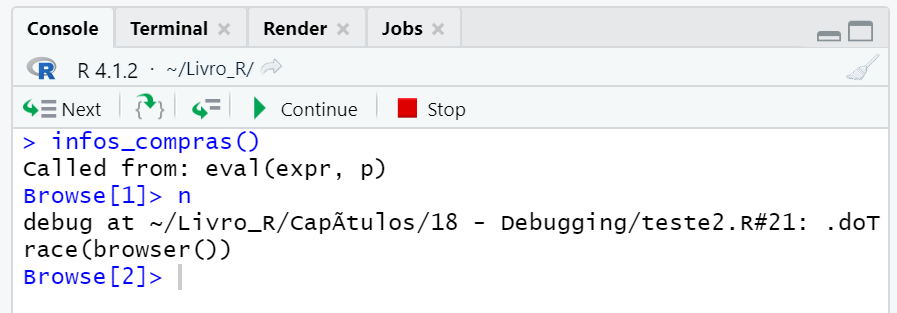
```

Portanto, quando executamos a função `infos_compras()`, o R entra automaticamente em modo *debug*, pelo simples fato de que essa função contém um *breakpoint* dentro dela. Este modo *debug* é ligado assim que o R encontra um *breakpoint*, isto é, no instante em que a função `browser()` é executada. 

Tendo isso em mente, o R realiza a chamada à função `infos_compras()`. Entretanto, ele paralisa a execução logo na primeira linha descrita no *body* dessa função. Pois é justo nessa linha que inserimos o *breakpoint*.

Caso você esteja dentro do RStudio, se você retornar ao *script* onde está a definição dessa função, você vai reparar que o RStudio marcou em amarelo essa linha, e adicionou uma seta verde à esquerda. Com isso, o RStudio está te avisando que o seu R está parado especificamente naquela linha, aguardando novas instruções para prosseguir com a execução.

```{r, echo = FALSE, fig.cap = "Modo *debug* do RStudio - Parte 2", out.width="60%"}
knitr::include_graphics("Figuras/debug5.png")
```

É muito importante destacar que, **se o R está parado em uma linha específica, isso significa que ele ainda não executou essa linha**. Em outras palavras, a função `buscar_compras()` ainda não foi executada, consequentemente, o objeto `compras` ainda não foi criado. 

Podemos verificar essa afirmativa, ao procurar pelo objeto `compras` dentro do modo *debug* do RStudio. Perceba abaixo, que um erro é retornado, indicando que esse objeto ainda não foi definido.

```{r, eval=FALSE}
Browse[2]> compras
```
```
## Error: object 'compras' not found
```


Recapitulando, para entrarmos no modo *debug* do R, precisamos executar uma função que contenha um *breakpoint* dentro dela. No nosso exemplo, essa função é `infos_compras()`.

Ao avaliarmos essa função `infos_compras()`, o R paralisa a execução logo na primeira linha do *body* dessa função. Contudo, mesmo em modo *debug*, o R continua disponível para executar novos comandos. Ou seja, você consegue criar novos objetos, executar outras funções e imprimir informações no console, da mesma forma que você normalmente faria no modo "normal" do R. 

Sendo assim, em modo *debug*, o R paralisa a execução da função (ou do *loop*) que contém o *breakpoint*. Mas o R não fica indisponível, ou, ele não paralisa toda e qualquer outra execução. Dito de outra forma, o modo *debug* te permite paralisar a execução de uma função e, investigar de forma interativa o seu estado, atrás de algum problema que revele a fonte de seu erro.

Portanto, o modo *debug* do R te ajuda a realizar os seguintes passos, que são essenciais em qualquer ato de *debugging*:

1. Você começa a executar o seu script;
2. Paralisa a execução no ponto em que você suspeita estar a fonte de seu erro;
3. Começa a investigar os objetos que estão sendo criados e as ações que estão sendo realizadas nesse ponto;
4. Descobre o problema que está ocorrendo naquele ponto;


### Navegando pelo modo debug

Para navegar pelo modo *debug*, você pode utilizar os botões que aparecem no canto superior de seu console no RStudio, ou, utilizar um dos comandos curtos de texto que estão descritos abaixo:

- `n`: executar a próxima linha (ou a próxima etapa) da função. Caso você possua um objeto definido chamado `n`, quando estiver em modo *debug*, você precisa utilizar o comando `print(n)` para visualizar o conteúdo desse objeto.

- `s`: funciona de forma parecida com o comando `n`, porém, caso a próxima linha da função que você está investigando, contenha uma outra função, o modo *debug* vai entrar dentro dessa outra função, para que você possa investigar o estado dessa outra função também.

- `f`: encerra a execução do *loop* ou função atual.

- `c`: sai momentaneamente do modo interativo do *debug*, e, executa todos os próximos passos da função, até que um novo *breakpoint* seja encontrado. Esse comando é útil, caso você tenha adicionado uma correção para o seu erro, e, deseja confirmar que o problema foi de fato resolvido.

- `Q`: finaliza o modo *debug*, encerra a execução da função, e, retorna o R para o seu modo "normal" de execução. Utilize esse comando quando você deseja sair do modo *debug* do R.

- `where`: mostra a árvore atual de chamadas. Esse comando é, basicamente, o equivalente à função `traceback()` para o modo *debug*.


Como destacamos na seção passada, você pode acessar esses mesmos comandos através dos botões que aparecem (quando você entra em modo *debug*) no canto superior de seu console do RStudio. A figura 17.7 abaixo apresenta justamente a correspondência entre esses comandos em texto e os botões desse painel:

```{r, out.width="80%", fig.cap = "Relação entre os comandos em texto e os botões do painel de *debug* do RStudio", echo = FALSE}
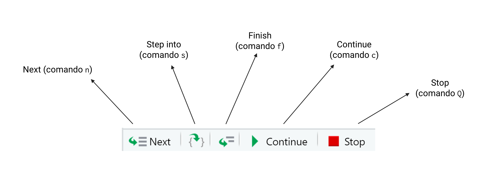
```

Como um primeiro exemplo, vamos observar a função `f()` descrita abaixo. Perceba que essa função executa um *loop* dentro dela, e, dentro desse *loop*, temos uma chamada à função `browser()`.

```{r}
f <- function(){
  for(i in 1:10){
    browser()
  }
}
```


Devido ao fato de `browser()` ser a única função presente no *body* de `f()`, os comandos `c` e `n` do modo *debug* são aproximadamente equivalentes. Pois com o comando `n`, o R vai executar a próxima linha do *body* da função `f()`. Porém, como essa próxima etapa é a próxima iteração do *loop*, a função `browser()` será executada novamente e, consequentemente, o R entrará novamente em modo *debug*.

Já o comando `c`, vai fazer com que o R saia do modo *debug* e execute todas as etapas restantes do *body* da função `f()`. Todavia, como essas próximas etapas correspondem às próximas iterações do *loop*, o R vai executar novamente a função `browser()` e, consequentemente, entrar novamente em modo *debug*.

Contudo, se inserirmos um novo comando após `browser()`, os comandos `n` e `c` deixam de ser equivalentes. Perceba abaixo, que inserimos a expressão `print(i * 10)` após a função `browser()`.

```{r}
f <- function(){
  for(i in 1:10){
    browser()
    print(i * 10)
  }
}
```

Com essa nova definição de `f()`, quando utilizamos o comando `c`, a expressão `print(i * 10)`, assim como a próxima iteração do *loop*, e, consequentemente, o próximo `browser()`, são todos executados de uma vez só. Perceba na figura 17.8 abaixo, pela expressão `Called from: f()`, que um novo comando `browser()` é executado a cada novo comando `c`.

```{r, echo = FALSE, out.width="70%", fig.cap = "Comando `Continue`"}
knitr::include_graphics("Figuras/debug_continue.png")
```

Por outro lado, quando utilizamos o comando `n`, o R se move para a próxima linha do *body*, que é expressão `print(i * 10)`. No segundo comando `n`, o R executa a expressão `print(i * 10)` e, se move para a próxima linha, que corresponde ao próximo `browser()`. Logo, para executarmos o próximo `browser()`, temos que utilizar três comandos `n`, como apresentado na figura 17.9 abaixo.

```{r, echo = FALSE, out.width="60%", fig.cap = "Comando `Next`"}
knitr::include_graphics("Figuras/debug_next.png")
```


### Investigando o estado de sua função

Portanto, o modo *debug* do R te permite investigar o ambiente (ou o *environment*) de sua função, de forma interativa. Em outras palavras, ele te permite analisar os resultados gerados dentro de sua função. Este modo também te permite entrar dentro do ambiente de outras funções que são executadas dentro de sua função (com o botão *Step Into*, ou, o comando `s`). Dessa maneira, você também pode investigar os objetos criados e os processos executados dentro dessas funções "secundárias".

Eu poderia utilizar este modo *debug* para coletar as mesmas informações que extraímos (sobre o objeto `compras`) na seção sobre *print debugging*. Por exemplo, após adicionar um *breakpoint* à função `infos_compras()`, eu executo ela para entrar em modo *debug*. Perceba abaixo (pela expressão `debug at`), que o R está parado na linha em que o objeto `compras` é criado.

```{r, eval = FALSE}
infos_compras()
```

```
## Called from: eval(expr, p)
## Browse[1]> n
## *debug* at #21: compras <- buscar_compras()
```

Lembre-se que, se o R está parado nessa linha, quer dizer que ele ainda não avaliou essa linha. Por isso, eu utilizo o comando `n` para executar essa linha, para que o objeto `compras` seja criado.

```{r, eval = FALSE}
Browse[2]> n
```

```
## *debug* at #22: cpfs <- extrair_cpfs(compras$info)
```

Em seguida, começo a investigar o objeto `compras`, visualizando parte de seu conteúdo, e, investigando sua estrutura.

```{r, eval = FALSE}
Browse[2]> compras[1:5]
```

```
## [1] "\"Márcio390.287.917-210akqzS2tk$URMcLOk5Q\""    
## [2] "\"Igor944.236.416-254tLo8&S9WtXg05fsdU\""       
## [3] "\"Márcio395.304.955-57pfwji9Z4Q6dZxSWZV7#7Z$J\""
## [4] "\"Isabela322.900.842-74K5D6b$xAnY&QJ1$XQzE2f\"" 
## [5] "\"Álvaro475.767.740-583WWonElfbisKD1GiIVS\"" 
```

```{r, eval = FALSE}
Browse[2]> str(compras)
```

```
## chr [1:1150] "\"Márcio390.287.917-210akqzS2tk$URMcLOk5Q\"" ...
```


Após coletar todas as informações que preciso para compreender e corrigir o erro, eu posso sair do modo *debug*, com o comando `Q`.

```{r, eval = FALSE}
Browse[2]> Q
### O R retorna para o seu modo "normal" de execução
```


## Sempre teste o seu código

Após compreender e corrigir os erros em suas funções, é importante que você teste novamente todo o seu código. Pois, ao corrigir uma parte de seu código, você pode acidentalmente quebrar uma outra parte dele.

Apesar dessa importância, você pode se perguntar "quando especificamente você deve realizar esses testes". Temos três respostas corretas para essa pergunta:

- Sempre!
- O mais cedo possível!
- Com frequência!

Programadores ou desenvolvedores de software geralmente dividem testes em duas categorias: *unity tests* e *integration tests*. Um teste unitário (ou *unity test*) consiste em testar se uma função isolada funciona da forma esperada. Já um teste integrado (ou *integration test*) consiste em testar se todas as funções de seu programa funcionam em conjunto, da forma correta.

Existem métodos formais de se realizar tais tipos de testes no R, especialmente a partir do pacote `testthat`. Porém, como esse pacote é focado especialmente no público que busca desenvolver novos pacotes para o R, ele está fora do escopo deste livro. Por esse motivo, se você deseja aprender mais sobre esse pacote, a obra de @wickham2015_packages é uma boa referência.

<!-- Portanto, vou descrever aqui, métodos "informais" de testes unitários e integrados. Mesmo assim, são métodos válidos e que vão te ajudar a produzir um código correto e com um maior grau de reprodutibilidade.  -->

Após aplicar as correções necessárias em sua função, execute novamente essa função. Dessa forma, você estará realizando um teste unitário sobre essa função. Confira se essa função retorna o resultado ou erro esperados. Caso tudo ocorra como você previa, é uma boa ideia realizar um teste integrado de seu programa logo em seguida. 

Uma forma prática e segura de se realizar esse tipo de teste é reiniciar o seu R (com o atalho `Ctrl + Shift + F10`) e, em seguida, executar todo o seu *script* (com o atalho `Ctrl + Shift + S`). Ao executar todo o seu *script*, se todas as funções forem executadas normalmente, sem erros, e, todos os objetos esperados forem gerados, isso é um forte sinal de que você possui um programa correto e com bom grau de reprodutibilidade.


<!--chapter:end:15-debugging.Rmd-->


# *Environments* ou ambientes no R


## Introdução

Todo objeto existente no R está armazenado em um *environment* (ou ambiente) específico. Como é destacado por @wickham2015_advanced os *environments* são a estrutura de dados que sustenta o processo de *scoping* do R, isto é, as regras de "busca" por objetos da linguagem R.

Compreender o que é um *environment* é algo bastante simples. Porém, entender como os vários *environments* ativos em sua sessão funcionam em conjunto, representa um outro nível de dificuldade. Mesmo assim, *environments* são estruturas muito importantes para a linguagem R, e que sustentam grande parte das operações realizadas pelos pacotes `dplyr` e `ggplot2`.

Além disso, *environments* são parte fundamental da reprodutibilidade dos programas criados pela linguagem R. Pois eles são as estruturas responsáveis por garantir que os diferentes componentes de seu programa sejam únicos e independentes entre si.

Ao longo deste capítulo vamos utilizar algumas funções do pacote `rlang`. Sendo assim, para que você possa acompanhar alguns dos exemplos a seguir, é necessário que esse pacote esteja instalado em sua máquina.

```{r, eval = FALSE}
library(rlang)
```

```{r, include = FALSE}
library(rlang)
library(dplyr)
```


## Noções básicas de *environments* {#sec:environments}

Para além de uma linguagem que trabalha com objetos, o R é também uma linguagem que trabalha com objetos que estão contidos (ou guardados) em certos *environments*. Um *environment* (ou ambiente) no R, é muito parecido com uma lista nomeada. Cada nome presente nessa lista, corresponde ao nome de um objeto que está armazenado nesse respectivo *environment*. 

Segundo @wickham2015_advanced, todo *environment* carrega algumas propriedades:

- Todos os nomes em um *environment* são únicos (isso garante que dois ou mais objetos de mesmo nome não existam dentro de um mesmo environment);

- Os nomes presentes em um *environment* não são ordenados;

- Todo *environment* possui um *environment* "pai";

- Um *environment* é modificado *in place* (ou seja, ele não é copiado quando ele é modificado).


Quando estamos trabalhando com um determinado objeto, geralmente nos referimos a este objeto através de seu nome, contudo, o nome é apenas parte desta referência, **pois objetos existem dentro de um determinado contexto, ou escopo**. Portanto, no R, uma referência completa a um determinado objeto, é na verdade, a combinação entre o nome deste objeto e o *environment* no qual ele está inserido [@chambers2016].


## Descobrindo o *environment* atual

Independentemente de onde você esteja dentro do R, você sempre é capaz de identificar qual é o *environment* atual através da função `environment()`. Basta executar essa função, e, o endereço do *environment* no qual você está será retornado como resultado.

Perceba abaixo que, ao executar essa função em minha sessão atual do R, o endereço `R_GlobalEnv` é retornado. Normalmente, *environments* são identificados através do endereço da memória RAM no qual eles estão localizados. Contudo, esse valor `R_GlobalEnv` representa um apelido para um *environment* especial do R, chamado de *global environment*. Vamos discutir esse *environment* na próxima seção.

```{r, eval = FALSE}
environment()
```

```
## <environment: R_GlobalEnv>
```

Em termos mais técnicos, o que a função `environment()` faz é retornar o endereço do *environment* no qual ela é executada. Portanto, o resultado dessa função depende diretamente de **onde** você a executa. 

Logo, se o comando `environment()` está sendo executado dentro do *body* de uma função chamada `f`, o resultado será o *environment* de execução dessa função `f`. Mas, se você executar esse comando diretamente no seu console do R, o resultado será diferente.


## O *environment* global

Normalmente, quando digitamos o nome de um determinado objeto, nós não estamos preocupados com o *environment* no qual este objeto está guardado. Pois o próprio R realiza o trabalho duro de procurar por este objeto ao longo de todos os *environments* ativos em sua sessão, atrás de um objeto que possua o mesmo nome que você digitou. Tal mecanismo de procura é denominado de *scoping* ou de *lexical scoping* [@wickham2015_advanced], e ele geralmente se inicia pelo seu *global environment*.

Toda vez que você inicia a sua sessão no R, você está trabalhando com um *environment* especial que chamamos de *global environment*, ou ambiente global. Logo, todos os objetos que você normalmente cria em sua sessão, são guardados dentro deste *global environment*. 

Você pode se referir a esse *environment* através da função `globalenv()`. Como exemplo, eu posso usar a função `ls()` para listar os nomes de todos os objetos que estão disponíveis especificamente neste *global environment*. Como vimos na seção passada, o endereço desse *environment* é referenciado como `R_GlobalEnv`.

```{r}
globalenv()
```


```{r, eval = FALSE}
# Iniciei uma nova sessão no R

# Criei alguns objetos
a <- 1
b <- 2

# ls() lista todos os objetos criados
# em meu global environment
ls(envir = globalenv())
```
```
## [1] "a" "b"
```


Portanto, um *environment* é uma espécie de caixa ou um espaço reservado para guardar um certo conjunto de objetos. O seu *global environment* é um desses *environments*, onde ficam todos os seus objetos que você normalmente cria em sua sessão. Todavia, sempre existem vários outros *environments* ativos em sua sessão, e você também pode criar objetos dentro desses outros *environments* (caso seja de seu desejo). 


## O *environment* de execução de uma função {#sec:environment_exec}

Toda função no R, possui o que nós chamamos de *function environment*, que corresponde ao *environment* no qual elas foram criadas. No exemplo abaixo, estamos identificando quais são esses *environments* para as funções `filter()` do pacote `dplyr`, e `seq()` do pacote `base`. 

```{r}
rlang::fn_env(dplyr::filter)

rlang::fn_env(seq)
```

Como um outro exemplo, caso eu crie uma nova função em minha sessão, perceba que o *environment* a qual ela pertence, se trata justamente do *global environment* (`R_GlobalEnv`).

```{r, eval = FALSE}
soma <- function(x, y){
  return(x + y)
}

rlang::fn_env(soma)
```

```
## <environment: R_GlobalEnv>
```


Por outro lado, se eu quiser, por exemplo, criar uma função chamada `g` dentro de uma outra função chamada `h`, o *function environment* de `g()` será o *environment* de execução de `h()`. Pois a função `g()` foi criada dentro deste *environment* de `h()`.

```{r}
h <- function(){
  g <- function(){
    print(5)
  }
  
  g_env <- rlang::fn_env(g)
  return(g_env)
}

h()
```


Portanto, as funções também possuem o que chamamos de *environment* de execução, que se trata do *environment* no qual os seus cálculos são executados. Ou seja, sempre que você executa uma função, os cálculos realizados por essa função são feitos em um *environment* separado de seu *global environment*. 

Como expomos ao final do capítulo de [Funções](#sec:functions_chapter), quando uma função é executada, um novo *environment* vazio é criado. Em seguida, um objeto para cada argumento fornecido à função é criado dentro desse novo *environment*. Por último, todos os comandos presentes no body dessa função são executados dentro desse novo *environment* [@chambers2016, p 52].

Por esse motivo, você não consegue visualizar com facilidade, os resultados que são gerados por essa função, pois os seus cálculos estão sendo realizados em um *environment* diferente do *environment* no qual você se encontra (*global environment*). 

Em contrapartida, essa característica garante que uma função não afete os objetos de seu *global environment*. Isso também permite que uma função do R seja *self-contained*, de modo que, os seus resultados dependam apenas dos valores de seus argumentos, e não dos objetos de outros *environments* presentes em sua sessão [@chambers2016].

Para demonstrar esse conceito de *environment* de execução, estou criando abaixo uma função chamada `f_env`, que nos retorna justamente o endereço do *environment* no qual essa função executou a soma entre 4 e 5. Perceba que a cada momento em que eu executo essa função, ela me retorna um endereço diferente. 

Logo, esses *environments* de execução são temporários (ou efêmeros se preferir), e utilizados uma única vez pela função. Por causa disso, no R, cada execução de uma função é independente uma da outra. A função não sabe absolutamente nada sobre o que aconteceu na última vez em que ela foi avaliada. 

```{r}
f_env <- function(){
  
  soma <- 4 + 5
  
  env <- environment()
  
  return(env)
}

f_env()

f_env()
```

<!-- Contudo, só porque esses *environments* são temporários, isso não significa que eles são deletados, ou, que os objetos criados durante a execução da função, são eliminados após a sua finalização. Perceba no exemplo abaixo, que eu consigo acessar normalmente o objeto `soma`, após a execução da função `f()`. Porém, para encontrar esse objeto, eu preciso obrigatoriamente do endereço do *environment* de execução, o qual foi salvo no objeto `x`. -->

<!-- ```{r} -->
<!-- f <- function(){ -->
<!--   soma <- 4 + 5 -->
<!--   env <- environment() -->
<!--   return(env) -->
<!-- } -->

<!-- x <- f() -->
<!-- get("soma", envir = x) -->
<!-- ``` -->


O exemplo abaixo, demonstra essa ideia de que os *environments* de execução asseguram que toda função não altere os nossos objetos salvos em nosso *global environment*. Dentro da função `f()` mostrada abaixo, estou criando um objeto chamado `y` com o valor de 100. Porém, mesmo após executar essa função, o objeto `y` que está salvo em meu *global environment* continua armazenando o valor 1.

```{r}
### Crie um objeto y em meu global environment
y <- 1

f <- function(){
  y <- 100
}

### Executo a função f()
f()

### O valor de y continua igual a 1
print(y)
```


### Os *environments* de pacotes

Portanto, o trabalho de um *environment* no R, é o de vincular, ou de associar um conjunto de nomes (os nomes dos objetos), a seus respectivos conjuntos de valores \cite[Cáp. 7]{wickham2015_advanced}. Ou seja, um dos principais papéis que um *environment* desempenha no R, é o de organizar um conjunto de objetos, de forma que o R seja capaz de diferenciar dois ou mais objetos com o mesmo nome.

Um bom exemplo disso, é a função `filter()` do pacote `dplyr`, que vimos no capítulo 4. Pois nós temos dentre os pacotes básicos do R, mais especificamente no pacote `stats`, uma outra função também chamada `filter()`. Por isso, sempre que chamamos pelo pacote `dplyr` através de `library()`, a seguinte mensagem aparece, nos informando que há um choque entre as duas funções.

```{r, eval = FALSE}
library(dplyr)
```
```{r, eval = FALSE, highlight=FALSE}
Attaching package: ‘dplyr’

The following objects are masked from ‘package:stats’:

    filter, lag
```

Essa mensagem está nos informando, que o pacote `dplyr` possui funções com os mesmos nomes das funções `filter()` e `lag()` do pacote `stats`, e, que por esse motivo, essas funções seriam "escondidas" de forma a evitar conflitos. 

Portanto, após carregarmos o pacote `dplyr` com `library()`, as funções `filter()` e `lag()` do pacote `stats` são "escondidas". Como resultado, se nós chamarmos pela função `filter()` no console, estaremos utilizando a função do pacote `dplyr`, e não a função do pacote `stats`.

```{r, echo = F, fig.cap="Ambientes de pacotes no R", out.width="80%"}
knitr::include_graphics("Figuras/environments.png")
```


Portanto, essas duas funções `filter()`, são funções diferentes, que servem para propósitos diferentes. O único fator que permite ao R, diferenciar essas funções uma da outra, é o fato de que elas pertencem a ambientes, ou *environments* diferentes, como demonstrado na figura 18.1. Lembre-se que todas as funções estão associadas a um *environment* específico. Por isso, nós podemos diferenciar as funções `filter()` e `lag()` de ambos os pacotes (`dplyr` e `stats`), através do nome do *environment* ao qual essas funções pertencem.

Pacotes do R são um caso especial, pois eles contêm dois *environments* diferentes que se relacionam entre si. Um é o *environment* propriamente dito do pacote, que contém os seus respectivos objetos, e um outro comumente chamado de *namespace*. Essa diferenciação só será útil na prática, quando você estiver desenvolvendo um novo pacote para o R. 

Ou seja, não se preocupe em entender agora a diferença entre esses dois espaços. Apenas entenda que, pacotes no R, vão além de simples *environments*. Também entenda que, os objetos e funções de todo pacote do R estão sempre armazenados no *environment* deste pacote, o qual é um *environment* separado de seu *global environment*.


Tendo isso em mente, quando desejamos utilizar uma função que está em conflito com uma outra função de um outro pacote, nós devemos definir de alguma forma, o *environment* do pacote no qual o R deve procurar pela função que você está chamando. 

No caso de pacotes, podemos acessar funções definidas em seus respectivos *environments*, ao fornecer o nome do pacote que contém essa função, seguido do operador `::`, e do nome da função que desejamos utilizar. Veja o exemplo abaixo, em que estamos utilizando a função `filter()` do pacote `stats`.

```{r}
x <- ts(rnorm(100), start = c(1, 1990), end = c(4, 1998), frequency = 12)

stats::filter(x, filter = c(0.5, 0.8, 0.2))
```


## Acessando outros environments

Já mostramos que você pode acessar o *environment* atual através da função `environment()`. Também mostramos que você pode acessar o seu *global environment* por meio da função `globalenv()`. Agora, a questão que fica é: como podemos acessar outros *environments* que estão presentes no caminho de pesquisa do R?

Por exemplo, como podemos acessar o *environment* do pacote `dplyr`? Para isso podemos utilizar as funções `as.environment()` e `rlang::as_environment()`. Ambas as funções desempenham basicamente o mesmo trabalho. Utilizando essas funções, podemos acessar o *environment* do pacote `dplyr` ao fornecer o nome de seu *environment*, como demonstrado abaixo.

Perceba que, se você utilizar a função `as.environment()` (dos pacotes básicos do R), você precisa fornecer o nome completo do *environment*. Por se tratar do *environment* de um pacote, o nome deste pacote precisa ser antecedido por `package:`. Por outro lado, a função `rlang::as_environment()` é inteligente o suficiente para pesquisar por um pacote com o nome que você digitou.

```{r}
as.environment("package:dplyr")
rlang::as_environment("dplyr")
```


Como um outro exemplo, vamos refletir sobre o objeto `LETTERS`. Esse objeto está sempre disponível em sua sessão no R. Pois ele pertence ao *environment* do pacote `base` (o qual faz parte dos pacotes básicos da linguagem, e, portanto, é **sempre** carregado para a sua sessão). 

Vamos supor que eu crie um novo objeto chamado `LETTERS` em meu *global environment*. Como resultado, se eu procurar por este objeto no console do R, o objeto encontrado será este novo objeto salvo em meu *global environment*. Pois o processo de busca do R geralmente se inicia pelo *global environment*.

```{r, eval = FALSE}
### Este é o objeto LETTERS salvo no
### *environment* do pacote `base`
LETTERS
```

```{r, echo = FALSE}
get("LETTERS", envir = as.environment("package:base"))
```


```{r}
### Estou criando um novo objeto LETTERS em
### meu global environment
LETTERS <- "a"

### Agora, se eu procurar por um objeto
### LETTERS, o R vai encontrar primeiro o objeto 
### salvo em meu global environment
LETTERS
```

Vale destacar que, o objeto `LETTERS` original, ainda existe dentro do *environment* do pacote `base`. A única diferença é que, antes de chegar ao *environment* do pacote `base`, o R está encontrando primeiro o objeto `LETTERS` salvo em meu global *environment*. Logo, ele retorna esse objeto contendo o valor `"a"`, ao invés do objeto original.

Pelo fato de termos dois objetos `LETTERS` diferentes em nossa sessão, para acessarmos o objeto `LETTERS` original, precisamos definir o *environment* no qual o R deve pesquisar por este objeto. Como este objeto `LETTERS` pertence a um pacote do R, podemos utilizar a mesma estrutura que utilizamos para acessar a função `filter()` do pacote `stats`, como demonstrado abaixo.

```{r}
base::LETTERS
```

Contudo, como uma outra alternativa, também podemos utilizar a função `get()` para especificarmos melhor, qual dos dois objetos desejamos acessar. Pois essa função possui um argumento (`envir`) onde podemos definir o *environment* em que o objeto deve ser pesquisado.

Como exemplo, para acessarmos o objeto `LETTERS` original, precisamos pesquisar por ele dentro do *environment* do pacote `base`. Por isso, eu forneço abaixo, o *environment* deste pacote ao argumento `envir`.

```{r}
get("LETTERS", envir = as.environment("package:base"))
```


Portanto, mesmo que eu crie um objeto em minha sessão, ou em outras palavras, um objeto em meu *global environment* chamado `LETTERS`, o R ainda é capaz de diferenciar os dois objetos denominados `LETTERS`, através do *environment* ao qual eles estão associados. Esta ideia está apresentada de forma visual na figura 18.2.

```{r, out.width="90%", echo = FALSE, fig.cap="Representação de environments"}
knitr::include_graphics("Figuras/environments2.png")
```

Após criarmos um novo objeto `LETTERS`, se eu chamar por este objeto no console, o resultado será o valor contido no objeto `LETTERS` do meu *global environment*. Isso ocorre, pois o R irá geralmente procura por um objeto primeiro em seu *global environment*. Depois ele vai procurar por este objeto ao qual você requisitou em outros *environments*. 

Esse caminho de *environments* pelo qual o R percorre durante sua procura, é comumente chamado por *search path* (ou "caminho de busca"). Como vimos acima, podemos utilizar a função `get()` sempre que desejamos contornar esse caminho padrão seguido pelo R, e, pesquisar por nosso objeto em um *environment* específico.

Concluindo, nós geralmente desejamos acessar um *environment* específico, quando temos dois objetos existentes em nossa sessão que possuem o mesmo nome, porém, são diferentes entre si. Nesse caso, precisamos unir o nome deste objeto, e o *environment* ao qual ele pertence, para acessarmos o objeto correto.

Caso esse objeto em questão, pertença a um pacote do R específico, podemos utilizar a estrutura `pacote::objeto` para acessarmos esse objeto. No entanto, se esse objeto pertence a um outro tipo de *environment*, podemos utilizar a função `get()` e seu argumento `envir`, para definirmos em que *environment* específico, o objeto deve ser pesquisado.


## O sistema de *scoping* do R

Sempre que você digita o nome de um objeto, o R inicia um processo de busca ao longo de todos os *environments* ativos em sua sessão, atrás de um objeto que possua o mesmo nome do que você digitou. Esse processo de busca é chamado de *scoping*, ou, *lexical scoping*.

Antes de explicar como esse mecanismo de busca funciona, precisamos descrever o que é um *parent environment*. Pois eles determinam qual o caminho que o R vai perseguir durante a sua pesquisa.

### Compreendendo *parent environments*

Todo *environment* possui um *environment* "pai". Dentro da comunidade, esse tipo de *environment* é chamado de *parent environment*. Como exemplo, vamos supor que você crie um novo *environment* a partir de seu global *environment*. 

Para criar um novo *environment*, você pode utilizar as funções `rlang::env()` e `new.env()`. Perceba abaixo, que eu não apenas crio esse novo *environment* chamado `env1`, mas eu também já adiciono dois novos objetos (`a` e `b`) a esse *environment*. Esses objetos `a` e `b` guardam os valores 1 e 2, respectivamente.

```{r}
env1 <- rlang::env(a = 1, b = 2)
```


Como eu não defini explicitamente dentro da função `rlang::env()`, um *parent environment* para esse novo *environment*, a função vai, por padrão, criar esse novo *environment* a partir do *environment* atual, isto é, o *environment* no qual essa função foi chamada. No exemplo acima, esse *environment* atual é o global *environment*, porque eu estou executando a função diretamente em meu console do R.

Por esse motivo, o *parent environment* de `env1` é o meu global *environment*. Eu posso representar essa relação de maneira visual, como na figura 18.3. Cada retângulo nessa figura é um *environment* específico. Em todas as figuras a seguir, o *environment* filho vai estar sempre apontando para o *environment* pai com uma seta azul.

```{r, echo = FALSE, out.width="80%", fig.cap = "Apresentando *parent environments* - Parte 1"}
knitr::include_graphics("Figuras/parent1.png")
```

Como um outro exemplo, eu posso criar um outro enviroment chamado `env2`. Porém, dessa vez, esse *environment* é criado a partir de `env1`. Ou seja, `env1` se torna o *parent environment* de `env2`. Repare que eu crio 3 novos objetos (`e`, `d` e `c`) dentro desse novo *environment*.


```{r}
env2 <- rlang::env(env1, c = 3, d = 4, e = 5)
```

Para descobrir o *parent environment* de um *environment* qualquer, você pode utilizar a função `parent.env()`. Veja no exemplo abaixo que, o resultado do comando `parent.env(env2)` é justamente o endereço de `env1`.

```{r}
parent.env(env2)
env1
```

Caso eu aplique essa função sobre `env1`, podemos confirmar que o meu global *environment* é de fato o pai desse *environment*.

```{r, eval = FALSE}
parent.env(env1)
```

```
## <environment: R_GlobalEnv>
```


Sendo assim, podemos atualizar a nossa representação visual da seguinte maneira:

```{r, echo = FALSE, out.width="100%", fig.cap = "Apresentando *parent environments* - Parte 2"}
knitr::include_graphics("Figuras/parent2.png")
```

Vale destacar que, a figura 18.4 acima não mostra um *parent environment* para o meu global *environment*, mas isso não significa que esse *environment* não existe. Eu apenas o omiti acima, para manter a figura simples. 

Lembre-se sempre que, todo *environment* possui um *parent environment*. Como exemplo, perceba abaixo que, o *parent environment* de meu global *environment* é (neste momento) o *environment* do pacote `dplyr`, que foi o último pacote que eu carreguei para a minha sessão.

```{r , eval = FALSE}
parent.env(globalenv())
```

```
## <environment: package:dplyr>
## attr(,"name")
## [1] "package:dplyr"
## attr(,"path")
## [1] "C:/Users/Pedro/Documents/R/win-library/4.1/dplyr"
```

Nos manuais internos do R, o *parent environment* é muitas vezes chamado de *enclosing environment*, isto é, o ambiente que "envolve" ou que "contém" os demais *environments* [@Rlanguage]. Ou seja, de certa forma, o *environment* `env1` envolve ou contém `env2` dentro dele, e, o meu global *environment* contém `env1`.


### O *environment* vazio ou *empty environment*

Eventualmente, toda sequência de *environments* termina em um *environment* vazio (ou *empty environment*). Em outras palavras, se você começar a subir pela árvore genealógica de seus *environments*, seguindo *parent environment* atrás de *parent environment*, você vai eventualmente chegar a um empty *environment*. Que é um tipo especial de *environment*, pois ele é a exceção à regra de que todo *environment* possui um pai.

Portanto, um empty *environment* é identificado pelo apelido `R_EmptyEnv` e, ele não possui um *parent environment*. Você pode acessar esse *environment* através da função `emptyenv()`. 

```{r}
emptyenv()
```

Você pode comprovar a afirmação do parágrafo acima, ao tentar aplicar a função `parent.env()` sobre esse *environment*. Perceba abaixo que um erro é retornado, avisando que esse *environment* não possui um *environment* "pai".

```{r, eval = FALSE}
parent.env(emptyenv())
```
```
## Error in parent.env(emptyenv()) : the empty *environment* has no parent
```


Tendo isso em mente, esse *environment* vazio representa o final de toda sequência de *environments*. De certa maneira, esse *environment* é o último *parent environment* de todos. Assim que o R atinge esse *environment*, ele encerra o seu processo de pesquisa, pois ele não tem mais para onde ir. 

Se você refletir sobre isso, você pode chegar a conclusão de que, se o R chegar a esse *environment* vazio durante o seu processo de pesquisa, isso significa que o R não pôde encontrar o objeto que você requisitou. Pois ao chegar a esse *environment* vazio, o R já vai ter visitado todos os outros *environments* ativos em sua sessão.


### O caminho de busca ou *search path* do R

Para encontrar o objeto pelo qual você requisitou, o R visita *environment* por *environment*, em busca desse objeto, até atingir um empty *environment*. A lista de *environments* que o R visita durante esse processo de pesquisa, é chamada de *search path* (ou, o caminho de pesquisa). Você pode descobrir qual é esse *search path*, através da função `search()`. 

Basta executar essa função, que um vetor contendo os nomes de todos esses *environments* será retornado como resultado. Vale destacar que, os nomes desses *environments* vão estar precisamente na ordem em que eles são visitados, durante este processo de pesquisa. 

Perceba abaixo que, o *environment* `.GlobalEnv` (que é um outro apelido para o *global environment*) é o primeiro da lista. Logo, o seu *global environment* é o primeiro *environment* visitado pelo R. Por outro lado, o *environment* do pacote `base` é o último *environment* visitado.

```{r, eval = FALSE}
search()
```

```
## [1]  ".GlobalEnv"        "tools:rstudio"     "package:stats"
## [4]  "package:graphics"  "package:grDevices" "package:utils"
## [7]  "package:datasets"  "package:methods"   "Autoloads"
## [10] "package:base"
```


Portanto, o *search path* do R sempre segue essa mesma estrutura. Ele sempre se inicia pelo seu *global environment*, seguido dos *environments* dos pacotes que estão carregados em sua sessão, que por sua vez, são seguidos pelo *environment* `Autoloads` e pelo *environment* do pacote `base`. 

O *environment* Autoloads é basicamente responsável por carregar algumas bases de dados padrão do R. Porém, tais bases são carregadas de maneira *lazy* (preguiçosa), isto é, essas bases são carregadas para a memória RAM apenas no momento em que você efetivamente requisita por elas.

Já o *environment* do pacote `base` é sempre o último *environment* dessa lista. Isso significa que, após esse *environment*, temos um *environment* vazio que encerra o mecanismo de pesquisa do R, como está demonstrado abaixo. 

```{r}
parent.env(as.environment("package:base"))
```

Podemos representar este caminho de maneira gráfica, como apresentado na figura 18.5. Perceba que, pelo fato do *environment* do pacote `base` ser o último da lista resultante de `search()`, o seu *parent environment* é justamente um *environment* vazio.

```{r, echo = FALSE, out.width="100%", fig.cap = "Representação do *search path* do R"}
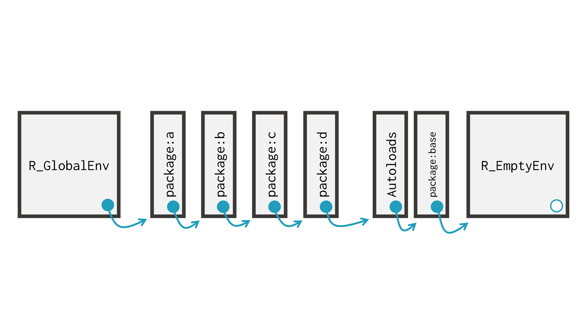
```


<!-- Portanto, o R sempre inicia o processo de busca pelo seu *global environment*. Ou seja, o *global environment* é o primeiro *environment* que o R visita em busca do objeto que você digitou. Para mais, o pacote `base` é sempre o último *environment* pesquisado. Logo, esse pacote sempre é o último elemento do vetor resultante de `search()` [@peng2015]. -->


<!-- ### O sentido de busca do R -->

<!-- Para compreender o caminho percorrido pelo R durante o *scoping*, é importante que você entenda o sentido que o R utiliza ao percorrer pela árvore (ou sequência) de *environments*. Em resumo, o R percorre os vários *environments*, **subindo** a árvore genealógica.  -->

<!-- Ou seja, se o R não encontrar o seu objeto em um *environment* `x`, ele parte para o *parent environment* desse *environment* `x`, em seguida, caso ele não encontre o objeto neste outro *environment*, então, ele parte novamente para o próximo *parent environment*, e assim segue, até ele encontrar o seu objeto (ou até atingir um *environment* vazio).  -->

<!-- Portanto, quando você precisa compreender o caminho que o R está percorrendo durante um processo de pesquisa, é importante que você identifique quais são os *parent environments* do *environment* inicial. Se você souber qual é o primeiro *environment* pesquisado, e quais são os seus *parent environments*, você pode desenhar aos poucos esse caminho em sua mente.  -->

<!-- Se utilizarmos como referência, o *search path* mostrado na figura x, o R tenta primeiro encontrar o objeto em seu *global environment*. Caso ele não encontre este objeto, o R parte então para o *parent environment* de seu global *environment*, que é sempre o *environment* do último pacote que você carregou para a sua sessão. E assim vai, seguindo os *environments* de todos os pacotes que você carregou para a sua sessão. Por último, o R ainda tenta encontrar esse objeto em `Autoloads` e no *environment* do pacote `base` (respectivamente) antes de atingir o *environment* vazio e encerrar o seu processo de busca. -->


### Descrevendo o *lexical scoping*

<!-- A obra de @wickham2015_advanced fornece uma descrição bastante clara, completa e precisa de *environments* e, por isso, representa uma importante referência sobre o tema. Porém, da forma como o capítulo de *Environments* está escrito, o leitor pode chegar a conclusão de que o processo de busca do R sempre se inicia pelo *global environment*. Porém, isso não representa a realidade. -->

<!-- Infelizmente, a obra de @wickham2015_advanced não discute esse ponto de forma clara ao longo de seu capítulo de [*Environments*](https://adv-r.hadley.nz/environments.html). Os autores chegam a demonstrar esse ponto de forma implícita em seus exemplos da seção 6.4 de [*Lexical Scoping*](https://adv-r.hadley.nz/functions.html#lexical-scoping). Porém, não apontar esse conhecimento de forma clara dentro do capítulo de *Environments*, pode ter causado certa confusão em muitos leitores. -->

Como descrevemos anteriormente, a linguagem R utiliza um conjunto de regras (chamadas de *lexical scoping*) para encontrar o valor de seus objetos. Nessa seção, vamos explicar em mais detalhes que regras são essas.

Primeiro, o R **sempre** inicia o seu processo de busca pelo *environment* em que você chamou por esse objeto. Por exemplo, se você está chamando por esse objeto, diretamente no console do R, então, você está chamando esse objeto a partir de seu *global environment*, logo, o R começa a sua pesquisa por este *environment*. Contudo, se você está chamando por esse objeto, dentro do body de uma função, então, o R vai procurar primeiro dentro do *environment* de execução dessa função.

Segundo, se o R não encontra o objeto em questão no primeiro *environment* pesquisado, ele começa a subir pela árvore genealógica de *environments*, até atingir o seu *global environment*. Ou seja, o R começa a procurar pelo objeto dentro do pai do primeiro *environment* pesquisado, depois, no pai do pai, e assim por diante.

Explicando ainda esse mesmo ponto, de uma outra forma: se o R não encontrar o seu objeto em um *environment* `x`, ele parte para o *parent environment* desse *environment* `x`, caso ele não encontre o objeto neste outro *environment*, então, ele parte novamente para o próximo *parent environment*, e assim segue, até ele chegar em seu *global environment* \cite[seções 3.5.2 e 4.3.4]{Rlanguage}. 

Terceiro, a partir do momento em que o R atinge o seu *global environment*, o R começa a navegar pelo seu *search path* \cite[seção 3.5.2]{Rlanguage}. Ou seja, o R começa a subir pela sequência de *environments* descrita pela função `search()`. Então ele visita primeiro o seu *global environment*, depois, parte para os *environments* dos pacotes carregados em sua sessão, depois, para o *environment* `Autoloads` e o *environment* do pacote `base`.

Quarto, ao subir pelo seu *search path*, se o R atingir o empty *environment* (que é o pai do *environment* do pacote `base`), o processo de busca é encerrado, e o R retorna um erro, lhe avisando que o objeto não pôde ser encontrado.


Vamos para alguns exemplos práticos. Suponha que você possua a função `f()` apresentada abaixo salva em seu *global environment*. Perceba que dentro do body dessa função, temos dois objetos (`x` e `y`) que o R precisa encontrar, no momento em que executar essa função. 

Quando essa função é avaliada, o R procura primeiro dentro do *environment* de execução dessa função. Pois é dentro desse *environment* que os objetos estão sendo chamados.  

Dentro desse *environment* de execução, o R encontra o objeto `y` (que é igual a 10), porém, ele não consegue encontrar o objeto `x`. Consequentemente, o R parte para o pai do *environment* de execução da função, que no exemplo abaixo se trata do *global environment*. Ao chegar no *global environment*, o R encontra o vetor `x` e, por isso, tal vetor é utilizado pela função `f()`.

```{r}
x <- c(2, 5, 6, 1)

f <- function(){
  y <- 10
  return(x + y)
}

f()
```


Agora, vamos partir para um exemplo mais profundo. Observe o exemplo abaixo, e tente responder a seguinte pergunta: porque o resultado do comando `h(3)` mostrado abaixo é 13, e não 25?. Para responder a essa pergunta, vamos recapitular ou esclarecer alguns pontos a seguir.

```{r}
y <- 15

f <- function() {
  y <- 10
  g <- function(x) x + y
  return(g)
}

h <- f()
h(3)
```


Primeiro, vamos expor o caminho de *environments* que você (leitor) provavelmente achou que o R iria seguir durante o cálculo de `h()` (painel A), e, o caminho que ele efetivamente seguiu (painel B). Tais caminhos de *environments* estão expostos na figura 18.6.

```{r, out.width="100%", fig.cap = "Certos *parent environments* podem te surpreender", echo = FALSE}
knitr::include_graphics("Figuras/exemplo_path1.png")
```

Pelo fato da função `h()` ter sido criada dentro do *global environment*, você provavelmente pressupôs que `R_GlobalEnv` fosse o *parent environment* do *environment* de execução dessa função. Porém, o *parent environment* de `h()` é na verdade o *environment* de execução da função `f()`. 

Pois o valor do objeto `h` (que está salvo no *global environment*) é a definição da função `g()`. Essa função `g()` foi criada dentro do *environment* de execução da função `f()`. Portanto, o *parent environment* da função que está armazenada dentro do objeto `h` é o *environment* de execução da função `f()`.

Tendo isso em mente, lembre-se que toda função do R possui o que chamamos de *function environment*. Esse é o *environment* no qual essa função foi criada. Para mais, o *function environment* é sempre o pai do *environment* de execução dessa função.

Esse exemplo mostra que as conexões de todos os objetos envolvidos em uma expressão, são definidos no instante em que aquela expressão é criada. Os manuais internos da linguagem, destacam essa característica como um dos princípios fundamentais de *lexical scope*:

>> "R adheres to a set of rules that are called lexical scope. This means the variable bindings in effect at the time the expression was created are used to provide values for any unbound symbols in the expression." \cite[seção 4.3.4]{Rlanguage}

Isso significa que essas conexões não são calculadas pelo R, no momento em que executamos essa expressão, e, sim, no momento em que definimos ou criamos essa expressão. Em outras palavras, o *parent environment* da função `h()` foi determinado no momento em que a função `g()` foi criada, e não, no momento em que executamos a função `h()`.


Concluindo, as regras que regem o *lexical scoping* no R são:

1. O R sempre inicia o seu processo de busca pelo *environment* no qual você requisitou pelo objeto;

2. Se ele não encontra o objeto no primeiro *environment* pesquisado, ele começa a percorrer os *parent environments*, até atingir o global environment;

3. Ao atingir o global *environment*, o R percorre o *search path*;

4. Ao atingir um empty *environment*, a procura é interrompida, e um erro é levantado indicando que o objeto não foi encontrado;


## Criando objetos em outros *environments*.

Quando utilizamos o operador de assignment `<-` para criar um objeto, este objeto é sempre criado dentro do *environment* no qual você executou tal operador. Veja o exemplo abaixo. 

Repare que dois objetos numéricos (`x` e `y`) estão sendo criados. Contudo, esses dois objetos estão sendo criados em *environments* diferentes. Mais especificamente, o objeto `x` é criado dentro do meu global *environment*, enquanto o objeto y é criado dentro do *environment* de execução da função `f()`.

```{r}
x <- 10

f <- function(){
  y <- 100
}
```

Portanto, você pode utilizar o body de uma função, para criar objetos em *environments* diferentes de seu *global environments*. Além disso, você já viu que a função `rlang::env()` te permite fornecer novos objetos para serem armazenados dentro do novo *environment* criado pela função. No exemplo abaixo, estou criando dois objetos (`nome` e `ano`) dentro do *environment* `env1`.

```{r}
env1 <- rlang::env(nome = "Pedro", ano = 2022)
```


Como uma outra alternativa, você pode também utilizar a função `assign()` quando desejar ser mais específico quanto ao *environment* em que o objeto deve ser criado. Em resumo, essa função executa o mesmo trabalho do operador de `assignment` (`<-`), todavia, essa função nos oferece o argumento `envir`, no qual podemos definir o *environment* no qual o objeto será criado.

Como exemplo, estou criando abaixo dois *environments* separados, `env1` e `env2`. Repare que `env1` é o *parent environment* de `env2`. A princípio, esses dois *environments* estão vazios.

```{r}
env1 <- rlang::env()
env2 <- rlang::env(env1)
```

Se eu desejasse criar um objeto dentro do *environment* `env2`, eu poderia utilizar a função `assign()` como exposto abaixo. Perceba que nesse exemplo, estou criando um objeto chamado `x` que contém o valor 10.

```{r}
assign("x", 10, envir = env2)
```

Depois de executar a função, podemos acessar o objeto `x` com o operador `$`, ou ainda, com a função `get()` que vimos em seções anteriores.

```{r}
env2$x
get("x", envir = env2)
```

Para além dessas opções, você pode utilizar o operador de super-assignment (`<<-`) para redefinir um objeto presente no *parent environment* do *environment* atual. Como exemplo, vamos estudar as funções `f()` e `g()` abaixo. 

Perceba que a função `g()` é criada dentro da função `f()`, logo, o *parent environment* da função `g()` é o *environment* de execução da função `f()`. Repare também que, dentro da função `f()` é criado um objeto chamado `y`, contendo inicialmente o valor 20.

Entretanto, a partir do momento em que a função `g()` é executada dentro da função `f()`, o valor do objeto `y` se torna igual a 1. Isso ocorre, pelo fato da função `g()` executar dentro dela, uma expressão de *super-assignment*, mais especificamente, a expressão `y <<- 1`.

```{r}
f <- function(){
  y <- 20
  ### Primeiro print()
  print(y)
  g <- function(){
    y <<- 1
  }
  
  g()
  ### Segundo print()
  print(y)
}


f()
```

Em mais detalhes, quando utilizamos o operador `<<-`, ao invés do R criar o objeto dentro do *environment* onde a expressão foi executada, ele inicia uma busca dentro do *parent environment*, atrás de um objeto que possua o mesmo nome do objeto contido nessa expressão.

Ou seja, ao executar a expressão `y <<- 1`, o R começou a procurar dentro do *parent environment* de `g()` (que no exemplo acima, é o *environment* de execução de `f()`), por um objeto chamado `y`. Ao encontrar o objeto `y` que guarda o valor de 20, o R redefine o seu valor para 1.

Portanto, em uma operação de *super-assignment* (`<<-`), o R procura pelo objeto envolvido na operação dentro do *parent environment*. Caso o R encontre esse objeto, ele vai redefinir o seu valor. Entretanto, se o R não encontrar esse objeto dentro do *parent environment*, então, ele vai criar (ou redefinir) esse objeto dentro de seu global *environment*.

Por exemplo, observe as funções `f()` e `g()` abaixo. O *parent environment* de `g()` continua sendo o *environment* de execução de `f()`. Porém, perceba que dessa vez, não existe um objeto `y` sendo definido dentro de `f()`. Para mais, repare que antes de eu executar a função `f()`, não existe nenhum objeto `y` salvo em meu global *environment*.

Em contrapartida, no instante em que eu executo a função `f()`, um novo objeto `y` contendo o valor 1 surge em meu global *environment*. Perceba que eu utilizo a função `get()` em conjunto com `globalenv()` para demonstrar que tal objeto foi encontrado dentro de meu global *environment*, e não em algum outro *environment*.

```{r, eval = FALSE}
### Perceba que ainda não existe nenhum
### objeto chamado `y` em meu global environment
print(y)
```
```
## Error in print(y) : object 'y' not found
```


```{r}
f <- function(){
  g <- function(){
    y <<- 1
  }
  
  g()
}


f()

### Agora, como num passe de mágica
### surge um objeto chamado `y` em
### meu global environment
get("y", envir = globalenv())
```


Portanto, dessa vez, o R não conseguiu encontrar um objeto chamado `y` dentro do *environment* de `f()` e, por isso, ele acabou criando este objeto `y` dentro de meu global *environment*.


```{r, child = "Exercícios/exec_cap18.Rmd"}
```


<!--chapter:end:16-environments.Rmd-->

# (PART) Respostas dos exercícios de cada capítulo {-}

# Respostas {-}


## Capítulo 1 - Noções Básicas do R {.unlisted .unnumbered}

<center>

*Exercício  1*
</center>


**1.1.A)** Quando temos um conjunto pequeno de valores a serem somados, podemos utilizar o operador `+`:


```r
32397 + 55405
```

```
## [1] 87802
```

```r
### Ou de forma análoga:
n1 <- 32397
n2 <- 55405

n1 + n2
```

```
## [1] 87802
```


**1.1.B)** Lembre-se que a função `sum()` lhe permite calcular a soma total de um conjunto de valores, de maneira rápida e eficiente. Lembre-se também de criar o objeto `conj` em seu console, antes de calcular a soma. Pois se não você estaria pedindo à função `sum()`, que calculasse a soma de um objeto que **não existe em seu computador**.


```r
### Lembre-se de criar o objeto conj
conj <- c(290, 34, 512, 54, 89)

resposta <- sum(conj)
print(resposta)
```

```
## [1] 979
```

```r
### Ou de uma maneira bem menos eficiente:

conj[1] + conj[2] + conj[3] + conj[4] + conj[5]
```

```
## [1] 979
```


**1.1.C)** Considerando $y = 3x^3 - 12x^2 + \frac{1}{15}x+ 25$, e $x = 5$, temos que:


```r
x <- 5
y_resposta <- 3 * (x^3) - 12 * (x^2) + (1/15) * x + 25
print(y_resposta)
```

```
## [1] 100.3333
```


<center>

*Exercício  2*
</center>


**1.2.A)** Qualquer erro do tipo "objeto 'x' não encontrado", significa que o objeto pelo qual você requisitou não existe atualmente em sua seção do R. Portanto, o erro na questão que diz respeito a um objeto chamado `logica`, está lhe dizendo que você não criou ainda nenhum objeto chamado `logica` em sua sessão. A partir do momento em que você define um valor para o nome `logica`, esse erro passa a não ocorrer mais. Lembre-se que esse erro pode surgir **em qualquer lugar** (dentro de qualquer função, ou de qualquer operação), pois sem esse objeto (que não existe em seu computador) o R não é capaz de completar a operação pela qual você requisitou.


```r
### Suponha que o erro tenha surgido a partir do comando abaixo
### com a função sum()

sum(logica)
```

```r
### A partir do momento em que defino um valor para logica
### o comando volta a funcionar

logica <- 1:3
sum(logica)
```

```
## [1] 6
```


**1.2.B)** A função `bind_rows()` (assim como a função `mutate()`) pertence ao pacote `dplyr`, que está fora dos pacotes básicos do R. Ou seja, sempre que você inicia uma nova sessão no R, a função `bind_rows()` não é automaticamente carregada para essa seção, pois ela pertence a um pacote (`dplyr`) que está fora do conjunto de pacotes básicos do R. 

Logo, o erro disposto na questão surge quando tentamos acessar a função `bind_rows()`, quando ela ainda não foi carregada para a nossa seção do R. Como comentamos ao longo da seção [Pacotes](#sec:pacotes), para acessarmos as funções disponíveis dentro de um pacote, é necessário carregarmos esse pacote para a nossa seção (através da função `library()`). E para carregarmos um pacote para a nossa seção, é necessário que esse pacote esteja instalado em nosso computador.


```r
dt1 <- data.frame(1:3)
dt2 <- data.frame(1:5)
### Não consigo acessar a função bind_rows()
bind_rows(dt1, dt2)
```


```r
library(dplyr)
### Agora eu consigo acessar a função bind_rows()
bind_rows(dt1, dt2)
```

```
##   X1.3 X1.5
## 1    1   NA
## 2    2   NA
## 3    3   NA
## 4   NA    1
## 5   NA    2
## 6   NA    3
## 7   NA    4
## 8   NA    5
```


**1.2.C)** Como comentamos ao longo da seção [Pacotes](#sec:pacotes), para utilizarmos as funções disponíveis em um pacote, precisamos carregar esse pacote para a nossa seção do R. E para carregarmos esse pacote para a nossa seção, ele precisa estar instalá-do em nosso computador. Logo, o erro da questão (que se refere ao pacote `dplyr`) está nos dizendo que o R não foi capaz de encontrar um pacote instalado em sua máquina, que tenha o nome de `dplyr`. Por esse motivo, para utilizar o pacote `dplyr` com o comando `library()`, você precisa primeiro instalar esse pacote em sua máquina, com o comando `install.packages()`


```r
install.packages("dplyr")
```


<center>

*Exercício  3*
</center>


**1.3.A)** Lembre-se que a fórmula do índice $Z$ de uma distribuição normal, usualmente assume a forma:

$$Z = \frac{X - \bar{X}}{\sigma}$$

Sendo que, as variáveis nessa equação são:

- $X$: a variável em questão.
- $\bar{X}$: média da variável $X$.
- $\sigma$: desvio padrão da variável $X$.
  
Logo, os comandos necessários para o cálculo são:


```r
### Lembre-se que você precisa criar 
### o objeto vec (com o comando abaixo)
### antes que você possa utilizá-lo em operações
### no R
vec <- c(0.5, 1.2, 2.5, 1.3, 2.2, 3.7)

desvio_padrao <- sd(vec)
media <- mean(vec)

resposta <- (media - vec) / desvio_padrao
print(resposta)
```

```
## [1]  1.2278812  0.6139406 -0.5262348  0.5262348 -0.2631174 -1.5787044
```


**1.3.B)** Lembre-se que o desvio médio de uma variável é simplesmente uma média dos desvios de seus valores em relação a sua média. Em outras palavras, a fórmula de cálculo do desvio médio ($DM$) de uma variável chamada $x$, seria:

$$DM = \frac{1}{n}\displaystyle\sum_{i=1}^{n}|x - \bar{x}|$$

Sendo que, as variáveis nessa equação são:

- $n$: número de observações (ou de valores) que a variável contém.
- $\bar{x}$: média da variável $x$.
- $x$: o valor da variável $x$.


```r
### Lembre-se que você precisa criar 
### o objeto vec (com o comando abaixo)
### antes que você possa utilizá-lo em operações
### no R
vec <- c(0.5, 1.2, 2.5, 1.3, 2.2, 3.7)

desvios <- vec - mean(vec)
total_desvio <- sum(abs(desvios))

resposta <- (1 / length(vec)) * total_desvio
print(resposta)
```

```
## [1] 0.9
```


## Capítulo 2 - Fundamentos da Linguagem R {.unlisted .unnumbered}


<center>

*Exercício  1*
</center>


**2.1.A)** Uma lista contendo um vetor em seu primeiro (e único) elemento.


```r
list(1:15)
```

```
## [[1]]
##  [1]  1  2  3  4  5  6  7  8  9 10 11 12 13 14 15
```


**2.1.B)** Um vetor atômico contendo a sequência de 1 a 10.


```r
1:10
```

```
##  [1]  1  2  3  4  5  6  7  8  9 10
```


**2.1.C)** Uma matriz $5\times5$ (5 linhas e 5 colunas) contendo valores do tipo `character`.


```r
set.seed(1)
a <- sample(
  c("MG", "SP", "DF", "MS"),
  size = 25, replace = TRUE
)
dim(a) <- c(5,5)
print(a)
```

```
##      [,1] [,2] [,3] [,4] [,5]
## [1,] "MG" "MG" "DF" "SP" "MG"
## [2,] "MS" "DF" "DF" "SP" "DF"
## [3,] "DF" "DF" "MG" "SP" "MG"
## [4,] "MG" "SP" "MG" "SP" "MG"
## [5,] "SP" "SP" "MG" "DF" "MG"
```


**2.1.D)** Um `data.frame` que possui 10 linhas e 2 colunas.


```r
data.frame(
  id = 1:10,
  valor = round(rnorm(10), 2)
)
```

```
##    id valor
## 1   1 -0.29
## 2   2 -0.30
## 3   3 -0.41
## 4   4  0.25
## 5   5 -0.89
## 6   6  0.44
## 7   7 -1.24
## 8   8 -0.22
## 9   9  0.38
## 10 10  0.13
```


**2.1.E)** Uma lista contendo 4 itens (ou 4 elementos).


```
## $estado
## [1] "MG"
## 
## $cidade
## [1] "Belo Horizonte"
## 
## $n_municipios
## [1] 853
## 
## $regiao
## [1] "Sudeste"
```


**2.1.F)** Um vetor atômico preenchido por 20 `NA`'s.


```
##  [1] NA NA NA NA NA NA NA NA NA NA NA NA NA NA NA NA NA NA NA NA
```


<center>

*Exercício  2*
</center>


**2.2.A)** Essa é uma espécie de pegadinha, não porque ela seja maldosa, mas porque demonstra certos cuidados necessários. Provavelmente, o seu primeiro instinto nessa questão foi utilizar a função `is.vector()`, o que é um bom começo, pois ela é capaz de identificar os objetos `v_rep` e `v_seq` como vetores atômicos. Ao mesmo tempo, essa função também consegue caracterizar os objetos `dt` e `mt` como estruturas diferentes de um vetor atômico. 

Entretanto, a função `is.vector()` acaba considerando o objeto `lst` como um vetor também! Lembre-se que, **uma lista é no fundo, um vetor,** onde cada elemento desse vetor pode ser de tipo e estrutura diferentes de seus pares. Portanto, a função `is.vector()` é capaz de identificar se um objeto é um vetor, mas não necessariamente se ele é um vetor atômico. Por esse motivo, para nos certificarmos de que um dado objeto é um vetor atômico, temos que saber se ele, além de um vetor, também é um objeto diferente de uma lista, através da função `is.list()`.

Utilizando o operador `!` sobre `is.list()`, podemos identificar se o objeto **não é uma lista**. Com isso, precisamos apenas conectar esse teste à função `is.vector()` e, dessa maneira, temos um teste lógico que segue a estrutura `is.vector(x) & !is.list(x)`.


```r
v_seq <- 10:25
v_rep <- rep("abc", times = 30)
lst <- list(1:10)
mt <- matrix(1:20, nrow = 4, ncol = 5)
dt <- data.frame(15, "A", 1:10)


is.vector(v_rep) & !is.list(v_rep)
```

```
## [1] TRUE
```

```r
is.vector(v_seq) & !is.list(v_seq)
```

```
## [1] TRUE
```

```r
is.vector(lst) & !is.list(lst)
```

```
## [1] FALSE
```


**2.2.B)** Nesta questão, ao utilizar a função `is.list()`, você já tem metade do teste lógico necessário para identificar o objeto `lst` como uma lista. Porém, esta questão, também inclui uma pegadinha parecida com a questão anterior. Pois da mesma maneira que uma lista é, no fundo, um vetor; um `data.frame` é, no fundo, uma lista nomeada. Isso significa que, a função `is.list()` também vai nos retornar `TRUE` para qualquer `data.frame`, e se desejamos identificar **apenas** listas, precisamos incrementar o nosso teste lógico de modo que ele possa diferenciar `data.frame`'s de listas.

A função necessária para esse trabalho é `is.data.frame()`, e utilizando novamente o operador `!` sobre o resultado dessa função, podemos identificar qualquer objeto que **não é** um `data.frame`. Com isso, temos um teste lógico que segue a estrutura `is.list(x) & !is.data.frame(x)`.


```r
lst <- list(
  estado = "MG",
  cidade = "Belo Horizonte",
  n_municipios = 853,
  regiao = "Sudeste"
)


is.list(lst) & !is.data.frame(lst)
```

```
## [1] TRUE
```


**2.2.C)** Quando temos uma lista nomeada (isto é, cada elemento dessa lista possui um nome), podemos descobrir os nomes de cada elemento dessa lista por meio da função `names()`. Logo, para descobrirmos se essa lista inclui um item chamado "estado", precisamos apenas de um teste lógico que possa identificar se o valor `"estado"` está incluso no resultado da função `names()`.


```r
lst <- list(
  estado = "MG",
  cidade = "Belo Horizonte",
  n_municipios = 853,
  regiao = "Sudeste"
)


"estado" %in% names(lst)
```

```
## [1] TRUE
```

```r
### Repare que ao aplicarmos o mesmo
### teste sobre o objeto lst_sem_estado
### o resultado é FALSE, indicando que
### essa lista não possui um item chamado
### "estado"

lst_sem_estado <- list(
  regiao = "Sudeste",
  n_municipios = 853
)

"estado" %in% names(lst_sem_estado)
```

```
## [1] FALSE
```


**2.2.D)** Basta utilizarmos a função `is.double()` sobre a coluna `total` de `tab`, como está demonstrado abaixo:


```r
tab <- data.frame(
  unidade = c("Centro", "Gameleira", "Santa Efigênia", "Centro",
              "Barro Preto", "Centro", "Gameleira", "Centro",
              "Barro Preto", "Santa Efigênia"),
  mes = c(1, 1, 1, 2, 2, 3, 3, 4, 4, 4),
  vendas = c(1502, 1430, 1100, 1200, 1443, 1621, 1854, 2200,
             1129, 1872),
  total = c(5362.14, 5105.1, 3927, 4284, 5151.51, 5786.97, 
            6618.78, 7854, 4030.53, 6683.04)
)


### Use a função is.double() sobre a coluna
is.double(tab$total)
```

```
## [1] TRUE
```


**2.2.E)** Lembre-se que **as três condições apresentadas no enunciado da questão são dependentes**. Logo, o objeto que você está testando deve se encaixar nas três condições ao mesmo tempo. Em termos técnicos, isso significa que os testes lógicos referentes a cada uma das três condições, devem obrigatoriamente retornar `TRUE` para este objeto. Se ao aplicarmos pelo menos um desses testes, e o resultado for `FALSE`, isso significa que o objeto em questão não se encaixa no teste lógico como um todo, ou, o resultado geral do teste lógico é `FALSE`. Para que o R entenda que essas condições são dependentes, e que devem ser satisfeitas ao mesmo tempo, você deve conectar as três condições pelo operador `&`.

Para satisfazer a primeira condição posta no enunciado, podemos conferir se o resultado da função `nrow()` (que nos retorna o número de linhas presente em um `data.frame`) é igual a 10, construindo assim, o seguinte componente do teste: `nrow(x) == 10`. Já para a segunda condição, podemos pesquisar se o valor `"vendas"` aparece dentro do resultado da função `colnames()` (uma outra alternativa seria a função `names()` que gera o mesmo resultado de `colnames()`). Como `colnames()` geralmente nos retorna um conjunto de valores (ao invés de 1 único valor), é importante que você utilize o operador `%in%` (ao invés do operador `==`) para pesquisar pelo valor `"vendas"`. Dessa forma, temos o segundo componente do teste `"vendas" %in% colnames(x)`. Por último, para conferirmos a terceira condição do teste, podemos aplicar a função `is.character()` sobre a 3° coluna do objeto em questão, criando assim o último componente do teste `is.character(x[[3]])`.

Sendo assim, temos um teste com a seguinte estrutura: `nrow(x) == 10 & "vendas" %in% colnames(x) & is.character(x[[3]])`. Perceba abaixo que, o resultado do teste lógico foi `FALSE` quando aplicado sobre `tab`, indicando assim, que o objeto `tab` não se encaixa em pelo menos uma das condições do teste. Para identificar qual dessas condições que `tab` não se encaixa, você pode observar o resultado de cada um dos três componentes do teste de forma separada. 


```r
nrow(tab) == 10 & "vendas" %in% colnames(tab) & is.character(tab[[3]])
```

```
## [1] FALSE
```


Repare abaixo, que os testes `nrow(tab) == 10` e `"vendas" %in% colnames(tab)` nos retornam um valor `TRUE`, logo, `tab` satisfaz ambas as condições. Contudo, o último teste resulta em `FALSE`. Portanto, `tab` não satisfaz a última condição do teste, ou, dito de outra forma, a 3° coluna de `tab` não é do tipo `character`. 


```r
nrow(tab) == 10
```

```
## [1] TRUE
```

```r
"vendas" %in% colnames(tab)
```

```
## [1] TRUE
```

```r
is.character(tab[[3]])
```

```
## [1] FALSE
```


**2.2.F)** Lembre-se que as condições a serem satisfeitas, para que o ano seja considerado bissexto são: 1) o ano deve ser múltiplo de 4; 2) o ano não deve ser múltiplo de 100 a não ser que ele seja múltiplo de 400; 3) se o ano é múltiplo de 400, ele é obrigatoriamente um ano bissexto.

Para identificarmos se um dado número é múltiplo de um outro número, podemos observar se o resto da divisão entre esses dois números é igual a zero. Em outras palavras, se desejamos saber que um dado valor $x$ é múltiplo de um dado valor $y$, podemos realizar o cálculo $x \div y$ e, observar se o resto dessa divisão é ou não igual a zero. Lembre-se que no R, temos o operador aritmético `%%`, que nos retorna justamente o resto da divisão entre dois números.

Tendo isso em mente, para satisfazermos as condições 1 e 3, podemos simplesmente conferir se os resultados das operações `ano %% 4` e `ano %% 400` são iguais a zero, construindo assim os componentes `ano %% 4 == 0` e `ano %% 400 == 0`. Entretanto, como a condição 2 estabelece que o respectivo ano não deve ser múltiplo de 100, podemos aplicar o operador `!` sobre o componente do teste referente a essa condição. Deste modo, temos o componente `!(ano %% 100 == 0)`. Uma outra alternativa para essa condição 2, seria utilizarmos o operador `!=`, que significa "não igual a", ou, "diferente de". Com esse operador teríamos `ano %% 100 != 0`.

Agora que definimos os componentes do teste, precisamos nos atentar à relação de hierarquia entre essas condições. Pois a condição 3 predomina sobre as condições 1 e 2, assim como as condições 3 e 2 prevalecem sobre a condição 1. Com isso, se um dado ano é múltiplo de 400, não nos interessa se ele é ou não múltiplo de 100 ou de 4, ele é um ano bissexto e ponto final. Da mesma forma que, se o ano não é múltiplo de 400, mas ele é múltiplo de 100, ele não é um ano bissexto, mesmo que ele seja múltiplo de 4.


Primeiro, para que o ano seja bissexto, temos duas possibilidades dentro da relação entre as condições 2 e 3. Ou o número do ano é múltiplo de 400, ou ele não é múltiplo de 100. Como essas duas possibilidades são independentes (ou seja, ou o ano é uma coisa, ou ele é outra), podemos conectar essas duas condições pelo operador `|`, construindo assim o componente `(ano %% 100 != 0) | (ano %% 400 == 0)` do teste. Veja alguns exemplos abaixo:


```r
ano <- 1240
(ano %% 100 != 0) | (ano %% 400 == 0)
```

```
## [1] TRUE
```

```r
ano <- 3200
(ano %% 100 != 0) | (ano %% 400 == 0)
```

```
## [1] TRUE
```

```r
ano <- 100
(ano %% 100 != 0) | (ano %% 400 == 0)
```

```
## [1] FALSE
```

Devido a independência entre essas condições (estabelecida pelo operador `|`), o R vai nos retornar `TRUE` caso o valor de `ano` se encaixe em pelo menos uma dessas duas condições. Isso significa que, se o valor de ano for múltiplo de 400, ele adquire um valor `TRUE` para o teste `ano %% 400 == 0` e, consequentemente, um valor `TRUE` para todo o componente `(ano %% 100 != 0) | (ano %% 400 == 0)`. 

Com isso, precisamos apenas conectar esse componente ao outro componente `(ano %% 4 == 0)`, que representa a condição 1, formando assim a estrutura final do teste: `(ano %% 4 == 0) & ((ano %% 100 != 0) | (ano %% 400 == 0))`. Dessa vez, utilizamos o operador que indica dependência (`&`) entre esses dois componentes principais do teste lógico, que são `(ano %% 4 == 0)` e `(ano %% 100 != 0) | (ano %% 400 == 0)`, pois um número que é múltiplo de 4, ainda pode ser um múltiplo de 100. Portanto, essa condição de dependência apenas assegura que a condição 2 seja respeitada, caso o número atenda a condição 1.


```r
### Por exemplo, 2006 não é um ano bissexto
ano <- 2006
(ano %% 4 == 0) & ((ano %% 100 != 0) | (ano %% 400 == 0))
```

```
## [1] FALSE
```

```r
### Mas o ano de 2004 é um ano bissexto
ano <- 2004
(ano %% 4 == 0) & ((ano %% 100 != 0) | (ano %% 400 == 0))
```

```
## [1] TRUE
```


<center>

*Exercício  3*
</center>


**2.3.A)** O vetor resultante será do tipo `character`.


```r
vec <- c(1.2, 2.4, "3.1", 1.9)
typeof(vec)
```

```
## [1] "character"
```


**2.3.B)** O vetor resultante será do tipo `double`.


```r
integers <- 1:3
doubles <- c(2.23, 9.87, 3.2)

vec <- c(integers, doubles)
typeof(vec)
```

```
## [1] "double"
```


**2.3.C)** O vetor resultante será do tipo `double`


```r
vec <- c(1.56, 3L, 1L, 5L,  2.32, 9.87)
typeof(vec)
```

```
## [1] "double"
```


**2.3.D)** O vetor resultante será do tipo `integer`.


```r
vec <- c(TRUE, 1L, FALSE)
typeof(vec)
```

```
## [1] "integer"
```


**2.3.E)** O vetor resultante será do tipo `character`.


```r
vec <- c("p", "b", "c", TRUE, 2L, 4.318)
typeof(vec)
```

```
## [1] "character"
```


<center>

*Exercício  4*
</center>


**2.4.A)** Perceba que as duas condições descritas no enunciado são dependentes, logo, elas precisam ser atendidas ao mesmo tempo. Por isso, os dois componentes do teste lógico são conectados pelo operador `&`.


```r
library(nycflights13)

teste <- flights$month == 5 & flights$carrier == "B6"

flights[teste, ]
```

```
## # A tibble: 4,576 x 19
##     year month   day dep_time sched_dep_time dep_delay arr_time sched_arr_time
##    <int> <int> <int>    <dbl>          <dbl>     <dbl>    <dbl>          <dbl>
##  1  2013     5     1      548            600       -12      831            854
##  2  2013     5     1      556            600        -4      818            835
##  3  2013     5     1      557            600        -3      934            942
##  4  2013     5     1      602            602         0      657            710
##  5  2013     5     1      603            610        -7      844            906
##  6  2013     5     1      621            627        -6      834            900
##  7  2013     5     1      624            630        -6      736            747
##  8  2013     5     1      624            630        -6      854            906
##  9  2013     5     1      627            630        -3      900            916
## 10  2013     5     1      639            645        -6      838            853
## # ... with 4,566 more rows, and 11 more variables: arr_delay <dbl>,
## #   carrier <chr>, flight <dbl>, tailnum <chr>, origin <chr>, dest <chr>,
## #   air_time <dbl>, distance <dbl>, hour <dbl>, minute <dbl>, time_hour <dttm>
```


**2.4.B)** Primeiro, temos que calcular o tempo de atraso total de cada voô, ao somar os tempos de atraso no momento de partida (`dep_delay`) e no momento de chegada (`arr_delay`). Com isso, podemos apenas utilizar o operador `>` ("maior que") para comparar o tempo de atraso total de cada voô com o resultado da função `mean()`. Como podemos ver abaixo, 95.685 voôs obtiveram um atraso acima da média.


```r
library(nycflights13)
### Primeiro, vamos calcular o atraso total
### de cada voô
atraso_total <- flights$dep_delay + flights$arr_delay

teste <- atraso_total > mean(atraso_total, na.rm = TRUE)

flights[teste, ]
```

```
## # A tibble: 95,685 x 19
##     year month   day dep_time sched_dep_time dep_delay arr_time sched_arr_time
##    <int> <int> <int>    <dbl>          <dbl>     <dbl>    <dbl>          <dbl>
##  1  2013     1     1      533            529         4      850            830
##  2  2013     1     1      542            540         2      923            850
##  3  2013     1     1      559            600        -1      941            910
##  4  2013     1     1      608            600         8      807            735
##  5  2013     1     1      611            600        11      945            931
##  6  2013     1     1      624            630        -6      909            840
##  7  2013     1     1      628            630        -2     1016            947
##  8  2013     1     1      632            608        24      740            728
##  9  2013     1     1      635            635         0     1028            940
## 10  2013     1     1      702            700         2     1058           1014
## # ... with 95,675 more rows, and 11 more variables: arr_delay <dbl>,
## #   carrier <chr>, flight <dbl>, tailnum <chr>, origin <chr>, dest <chr>,
## #   air_time <dbl>, distance <dbl>, hour <dbl>, minute <dbl>, time_hour <dttm>
```


**2.4.C)** Perceba que ao todo, foram descritas 4 condições no enunciado da questão. 1) `arr_delay` menor que 2; 2) `dest` igual a `"BOS"`; 3) `month` igual a 1; 4) `sched_dep_time` igual a 600.


```r
library(nycflights13)

teste <- (flights$arr_delay < 2 & flights$dest == "BOS") |
  (flights$month == 1 & flights$sched_dep_time == 600)

flights[teste, ]
```

```
## # A tibble: 11,500 x 19
##     year month   day dep_time sched_dep_time dep_delay arr_time sched_arr_time
##    <int> <int> <int>    <dbl>          <dbl>     <dbl>    <dbl>          <dbl>
##  1  2013     1     1      554            600        -6      812            837
##  2  2013     1     1      555            600        -5      913            854
##  3  2013     1     1      557            600        -3      709            723
##  4  2013     1     1      557            600        -3      838            846
##  5  2013     1     1      558            600        -2      753            745
##  6  2013     1     1      558            600        -2      849            851
##  7  2013     1     1      558            600        -2      853            856
##  8  2013     1     1      558            600        -2      924            917
##  9  2013     1     1      558            600        -2      923            937
## 10  2013     1     1      559            600        -1      941            910
## # ... with 11,490 more rows, and 11 more variables: arr_delay <dbl>,
## #   carrier <chr>, flight <dbl>, tailnum <chr>, origin <chr>, dest <chr>,
## #   air_time <dbl>, distance <dbl>, hour <dbl>, minute <dbl>,
## #   time_hour <dttm>
```


```r
### Ou de forma um pouco mais organizada:
###
condicao1 <- flights$arr_delay < 2 & flights$dest == "BOS"
condicao2 <- flights$month == 1 & flights$sched_dep_time == 600

teste <- condicao1 | condicao2

flights[teste, ]
```


## Capítulo 3 - Importando e exportando dados com o R {.unlisted .unnumbered}


<center>

*Exercício  1*
</center>


**3.1.A)** Primeiro, sempre comece identificando o caractere especial que está separando cada coluna nesse arquivo. No caso do objeto `t` abaixo, esse caractere especial é o til (`~`). Com isso, podemos utilizar o argumento `delim`, da função `read_delim()` para termos uma primeira leitura do arquivo, como demonstrado abaixo:


```r
t <- "
ID~Valor/Grupo~Unidade
1~2,5488/Marketing~Kg
2~4,0101/Análise~Kg
3~1097/Vendas~g
4~12,76/Logísitica~Kg"

t <- iconv(t, from = "Latin1", to = "UTF-8")

readr::read_delim(t, delim = "~")
```

```
## Rows: 4 Columns: 3
```

```
## -- Column specification ---------------------------------------------------
## Delimiter: "~"
## chr (2): Valor/Grupo, Unidade
## dbl (1): ID
```

```
## 
## i Use `spec()` to retrieve the full column specification for this data.
## i Specify the column types or set `show_col_types = FALSE` to quiet this message.
```

```
## # A tibble: 4 x 3
##      ID `Valor/Grupo`    Unidade
##   <dbl> <chr>            <chr>  
## 1     1 2,5488/Marketing Kg     
## 2     2 4,0101/Análise   Kg     
## 3     3 1097/Vendas      g      
## 4     4 12,76/Logísitica Kg
```


**3.1.B)** Ao observarmos com cuidado os resultados apresentados pela questão, podemos identificar que a importação de ambos os arquivos (`pac1` e `pac2`) apresentam erros. Focando primeiramente em `pac1`, perceba que os valores presentes em todas as colunas numéricas (`Produção`, `Receita` e `Gasto em P&D`) estão muito altos. Esse erro ocorre, devido ao padrão empregado pela função `read_delim()`. Lembre-se que grande parte das funções do pacote `readr` seguem o padrão americano, que utiliza o ponto como o separador decimal, e a vírgula, como separador de milhares.


```r
pac1 <- "Setor;Produção;Receita;Gasto em P&D
Produtos alimentícios;10828,37;199907,55;3358,36
Bebidas;759,53;28093,21;
Produtos do fumo;69,99;8863,5;121,35
Produtos têxteis;4153,97;25804,16;746,83
Produtos de madeira;5088,78;15320,69;279,54
Celulose e outras pastas;26,95;4245,19;216,7
Refino de petróleo;75,48;114316,31;1550,73
Produtos químicos;3179,52;133582,8;2914,09
Produtos farmacêuticos;621,82;24972,07;1038,73"

pac1 <- iconv(pac1, from = "Latin1", to = "UTF-8")

readr::read_delim(pac1, delim = ";")
```

```
## Rows: 9 Columns: 4
```

```
## -- Column specification ---------------------------------------------------
## Delimiter: ";"
## chr (1): Setor
```

```
## 
## i Use `spec()` to retrieve the full column specification for this data.
## i Specify the column types or set `show_col_types = FALSE` to quiet this message.
```

```
## # A tibble: 9 x 4
##   Setor                    Produção  Receita `Gasto em P&D`
##   <chr>                       <dbl>    <dbl>          <dbl>
## 1 Produtos alimentícios     1082837 19990755         335836
## 2 Bebidas                     75953  2809321             NA
## 3 Produtos do fumo             6999    88635          12135
## 4 Produtos têxteis           415397  2580416          74683
## 5 Produtos de madeira        508878  1532069          27954
## 6 Celulose e outras pastas     2695   424519           2167
## 7 Refino de petróleo           7548 11431631         155073
## 8 Produtos químicos          317952  1335828         291409
## 9 Produtos farmacêuticos      62182  2497207         103873
```

Portanto, ao ler o número `10828,37`, a função `read_delim()` entende que esse valor corresponde ao número 1.082.837. Por esse motivo, precisamos sobrepor esse padrão, ao descrevermos explicitamente à função `read_delim()`, o padrão utilizado pelos valores numéricos presentes no arquivo `pac1`. Lembre-se que uma descrição desse tipo é fornecida dentro da função `locale()`, mais especificamente, no argumento `locale` da função que você está utilizando para a importação.


```r
readr::read_delim(
  pac1, delim = ";",
  locale = locale(grouping_mark = ".", decimal_mark = ",")
)
```

```
## Rows: 9 Columns: 4
```

```
## -- Column specification ---------------------------------------------------
## Delimiter: ";"
## chr (1): Setor
## dbl (3): Produção, Receita, Gasto em P&D
```

```
## 
## i Use `spec()` to retrieve the full column specification for this data.
## i Specify the column types or set `show_col_types = FALSE` to quiet this message.
```

```
## # A tibble: 9 x 4
##   Setor                    Produção Receita `Gasto em P&D`
##   <chr>                       <dbl>   <dbl>          <dbl>
## 1 Produtos alimentícios     10828.  199908.          3358.
## 2 Bebidas                     760.   28093.            NA 
## 3 Produtos do fumo             70.0   8864.           121.
## 4 Produtos têxteis           4154.   25804.           747.
## 5 Produtos de madeira        5089.   15321.           280.
## 6 Celulose e outras pastas     27.0   4245.           217.
## 7 Refino de petróleo           75.5 114316.          1551.
## 8 Produtos químicos          3180.  133583.          2914.
## 9 Produtos farmacêuticos      622.   24972.          1039.
```


Por outro lado, podemos perceber que o arquivo `pac2` enfrenta o mesmo problema de `pac1`. Pois valores como `18.828,37` e `69,99`, foram interpretados pela função `read_delim()` como os números 18,828 e 6.999, respectivamente.


```r
pac2 <- "Setor;Produção;Receita;Gasto em P&D
Produtos alimentícios;10.828,37;199907,55;3358,36
Bebidas;759,53;28093,21;x
Produtos do fumo;69,99;8863,5;121,35
Produtos têxteis;4.153,97;25804,16;746,83
Produtos de madeira;5.088,78;15320,69;279,54
Celulose e outras pastas;26,95;4245,19;216,7
Refino de petróleo;75,48;114316,31;1550,73
Produtos químicos;3.179,52;133582,8;2914,09
Produtos farmacêuticos;621,82;24972,07;1038,73"

pac2 <- iconv(pac2, from = "Latin1", to = "UTF-8")

readr::read_delim(pac2, delim = ";")
```

```
## Rows: 9 Columns: 4
```

```
## -- Column specification ---------------------------------------------------
## Delimiter: ";"
## chr (2): Setor, Gasto em P&D
```

```
## 
## i Use `spec()` to retrieve the full column specification for this data.
## i Specify the column types or set `show_col_types = FALSE` to quiet this message.
```

```
## # A tibble: 9 x 4
##   Setor                    Produção  Receita `Gasto em P&D`
##   <chr>                       <dbl>    <dbl> <chr>         
## 1 Produtos alimentícios       10.8  19990755 3358,36       
## 2 Bebidas                  75953     2809321 x             
## 3 Produtos do fumo          6999       88635 121,35        
## 4 Produtos têxteis             4.15  2580416 746,83        
## 5 Produtos de madeira          5.09  1532069 279,54        
## 6 Celulose e outras pastas  2695      424519 216,7         
## 7 Refino de petróleo        7548    11431631 1550,73       
## 8 Produtos químicos            3.18  1335828 2914,09       
## 9 Produtos farmacêuticos   62182     2497207 1038,73
```

Para corrigir esse problema, utilizamos novamente a função `locale()`. Entretanto, um outro problema ainda persiste no arquivo `pac2`. Pois o tipo `character` foi aplicado sobre a coluna `Gasto em P&D`, a qual é claramente uma coluna numérica.


```r
readr::read_delim(
  pac2, delim = ";",
  locale = locale(grouping_mark = ".", decimal_mark = ",")
)
```

```
## Rows: 9 Columns: 4
```

```
## -- Column specification ---------------------------------------------------
## Delimiter: ";"
## chr (2): Setor, Gasto em P&D
## dbl (1): Receita
```

```
## 
## i Use `spec()` to retrieve the full column specification for this data.
## i Specify the column types or set `show_col_types = FALSE` to quiet this message.
```

```
## # A tibble: 9 x 4
##   Setor                    Produção Receita `Gasto em P&D`
##   <chr>                       <dbl>   <dbl> <chr>         
## 1 Produtos alimentícios     10828.  199908. 3358,36       
## 2 Bebidas                     760.   28093. x             
## 3 Produtos do fumo             70.0   8864. 121,35        
## 4 Produtos têxteis           4154.   25804. 746,83        
## 5 Produtos de madeira        5089.   15321. 279,54        
## 6 Celulose e outras pastas     27.0   4245. 216,7         
## 7 Refino de petróleo           75.5 114316. 1550,73       
## 8 Produtos químicos          3180.  133583. 2914,09       
## 9 Produtos farmacêuticos      622.   24972. 1038,73
```


Tal erro, ocorre pelo simples fato de que a segunda linha dessa coluna é preenchida por um "x". Ao encontrar esse "x", a função `read_delim()` opta pelo tipo de dado mais flexível possível (o tipo `character`). Dessa maneira, precisamos apenas afirmar à função `read_delim()`, que essa coluna deve ser interpretada por um tipo numérico, como o tipo `double`. 


```r
readr::read_delim(
  pac2, delim = ";",
  locale = locale(grouping_mark = ".", decimal_mark = ","),
  col_types = cols(
    .default = col_number(), Setor = col_character()
  )
)
```

```
## Warning: One or more parsing issues, see `problems()` for details
```

```
## # A tibble: 9 x 4
##   Setor                    Produção Receita `Gasto em P&D`
##   <chr>                       <dbl>   <dbl>          <dbl>
## 1 Produtos alimentícios     10828.  199908.          3358.
## 2 Bebidas                     760.   28093.            NA 
## 3 Produtos do fumo             70.0   8864.           121.
## 4 Produtos têxteis           4154.   25804.           747.
## 5 Produtos de madeira        5089.   15321.           280.
## 6 Celulose e outras pastas     27.0   4245.           217.
## 7 Refino de petróleo           75.5 114316.          1551.
## 8 Produtos químicos          3180.  133583.          2914.
## 9 Produtos farmacêuticos      622.   24972.          1039.
```


**3.1.C)** Quando erros desse tipo ocorrem, é interessante que você olhe para dentro do arquivo, ou seja, abra as primeiras milhares de linhas do arquivo, e tente identificar algum fator que possa estar causando este erro. Como o arquivo `challenge.csv` é relativamente pequeno, você pode abrí-lo em uma janela de seu RStudio por meio dos comandos abaixo:


```r
file.edit(readr_example("challenge.csv"))
```

Ao navegar em direção ao final do arquivo, você vai perceber que os dados mudam drasticamente de formato a partir da linha 1001 do arquivo (veja abaixo, um retrato dessa porção do arquivo). 


```text
998   1843,NA
999   1687,NA
1000  4569,NA
1001  4548,NA
1002  0.23837975086644292,2015-01-16
1003  0.41167997173033655,2018-05-18
1004  0.7460716762579978,2015-09-05
1005  0.723450553836301,2012-11-28
1006  0.614524137461558,2020-01-13
```


Logo, podemos inferir que o problema gerado na importação, se trata novamente de um chute errado da função `read_csv()`. Pois a função interpretou que as duas colunas do arquivo, pertencem aos tipos `double` e `logical`, respectivamente, sendo que a segunda coluna é, de forma clara, do tipo `Date`, ao observarmos a sua porção à frente da linha 1001. 

Lembre-se que, as funções do pacote `readr` vão, por definição, utilizar as 1000 primeiras linhas do arquivo para advinhar o tipo de dado contido em cada coluna do arquivo. Devido ao fato de que a mudança drástica nos dados armazenados em `challenge.csv`, ocorre após essas 1000 primeiras linhas, a função `read_csv()` acaba não percebendo o seu erro. Por esses motivos, precisamos sobrepor essa decisão, ao definirmos explicitamente os tipos desejados para cada coluna no argumento `col_types`.


```r
read_csv(
  readr_example("challenge.csv"),
  col_types = cols(
    x = col_double(),
    y = col_date()
  )
)
```

```
## # A tibble: 2,000 x 2
##        x y     
##    <dbl> <date>
##  1   404 NA    
##  2  4172 NA    
##  3  3004 NA    
##  4   787 NA    
##  5    37 NA    
##  6  2332 NA    
##  7  2489 NA    
##  8  1449 NA    
##  9  3665 NA    
## 10  3863 NA    
## # ... with 1,990 more rows
```


**3.1.D)** Novamente, sempre comece identificando o caractere especial que está separando cada coluna nesse arquivo. No caso do objeto `t`, esse caractere especial é o asterisco (`*`). Com isso, podemos utilizar o argumento `delim`, da função `read_delim()` para termos uma primeira leitura do arquivo, como demonstrado abaixo:


```r
t <- "Data_execução*Unidades*Valor_compra
20/01/2020*21*R$ 3049,50
23/01/2020*502*R$ 1289,03
25/01/2020*90*R$ 678,00
02/02/2020*123*R$ 5401
05/02/2020*45*R$ 1450,10
07/02/2020*67*R$ 2320,97
09/02/2020*187*R$ 6231,76"

t <- iconv(t, from = "Latin1", to = "UTF-8")

readr::read_delim(t, delim = "*")
```

```
## Rows: 7 Columns: 3
```

```
## -- Column specification ---------------------------------------------------
## Delimiter: "*"
## chr (2): Data_execução, Valor_compra
## dbl (1): Unidades
```

```
## 
## i Use `spec()` to retrieve the full column specification for this data.
## i Specify the column types or set `show_col_types = FALSE` to quiet this message.
```

```
## # A tibble: 7 x 3
##   Data_execução Unidades Valor_compra
##   <chr>            <dbl> <chr>       
## 1 20/01/2020          21 R$ 3049,50  
## 2 23/01/2020         502 R$ 1289,03  
## 3 25/01/2020          90 R$ 678,00   
## 4 02/02/2020         123 R$ 5401     
## 5 05/02/2020          45 R$ 1450,10  
## 6 07/02/2020          67 R$ 2320,97  
## 7 09/02/2020         187 R$ 6231,76
```


Ainda assim, há alguns pontos que precisamos melhorar. Primeiro, a coluna `Valor_compra` está sendo atualmente interpretada pelo tipo `character`, sendo que ela claramente guarda valores numéricos, isto é, valores do tipo `double`. O mesmo ocorre com a coluna `Data_execução`, que armazena datas específicas, as quais poderiam ser melhor interpretadas pelo tipo `Date`.

Por isso, precisamos definir explicitamente os tipos dessas colunas à função `read_delim()`, como demonstrado abaixo. Repare que utilizamos `col_number()` sobre a coluna `Valor_compra`, e não, `col_double()`. Pois `col_double()` não seria capaz de ler corretamente essa coluna, dado que os valores numéricos estão acompanhados de informações textuais (`R$`), as quais `col_double()` não é capaz de compreender. Já `col_number()`, busca extrair qualquer valor numérico presente em um *string* e, por isso, acaba ignorando por padrão todas as informações não-numéricas presentes neste mesmo *string*. Após extrair o valor numérico, `col_number()` ainda vai analisar esse valor, e decidir se ele deve ser convertido para o tipo `integer`, ou para o tipo `double`, o que nos dá bastante flexibilidade, e economiza certo trabalho de nossa parte.


```r
read_delim(
  t, delim = "*",
  col_types = cols(
    col_date(format = "%d/%m/%Y"),
    col_integer(),
    col_number()
  ),
  locale = locale(
    decimal_mark = ",", grouping_mark = "."
  )
)
```

```
## # A tibble: 7 x 3
##   Data_execução Unidades Valor_compra
##   <date>           <int>        <dbl>
## 1 2020-01-20          21        3050.
## 2 2020-01-23         502        1289.
## 3 2020-01-25          90         678 
## 4 2020-02-02         123        5401 
## 5 2020-02-05          45        1450.
## 6 2020-02-07          67        2321.
## 7 2020-02-09         187        6232.
```


<center>

*Exercício  2*
</center>


**3.2)** Primeiro, falando especificamente de planilhas do Excel, a mescla de células é uma ferramenta que pode deixar a sua planilha esteticamente atraente. Porém, tal ferramenta gera sérias anomalias na estrutura de sua tabela. Pois duas células que foram mescladas, são apresentadas a você como uma única célula. Mas no fundo, o Excel armazena os valores presente nessa célula de uma maneira não uniforme (ou em uma estrutura não retangular) ao longo de sua tabela. 

No caso do arquivo `emater_icms_solidario.xlsx`, as células mescladas se encontram no cabeçalho da tabela. Com isso, essas células mescladas nos impedem de importar diretamente da planilha, os nomes de cada coluna da tabela. Por isso, é mais fácil simplesmente ignorarmos o fato de que cada coluna possui um nome, e tentarmos selecionar apenas a parte da planilha que contém os dados em si, de forma crua. Por essa estratégia, podemos fornecer corretamente os nomes de cada coluna de forma separada, através do argumento `col_names`.


```r
### Nomes de cada coluna
nomes <- c(
  "Semestre", "Ano", "Municipio", "Cod_IBGE",
  "Area_2017", "Area_2018", "Area_Media",
  "Pastagens_2006", "Area_Total", "N_pequeno_prod",
  "Extensao_Rural", "PM_Fundo_Rotativo", "PM_Mecanizacao_Agr",
  "PM_Sementes_Mudas", "PM_Calcario_Fertilizante",
  "PM_Apoio_Comercializacao"
)

### Lembre-se que o caminho até o arquivo
### será diferente em sua máquina.
### Pois muito provavelmente você não possui um
### um usuário chamado Pedro.
readxl::read_excel(
  "C:/Users/Pedro/Downloads/emater_icms_solidario.xlsx",
  range = "A6:P858", 
  col_names = nomes
)
```


```
## # A tibble: 853 x 16
##    Semestre      Ano Municipio         Cod_IBGE Area_2017 Area_2018 Area_Media
##    <chr>       <dbl> <chr>             <chr>        <dbl>     <dbl>      <dbl>
##  1 1° semestre  2020 Abadia dos Doura~ 3100104      5192.     3612.      4402.
##  2 1° semestre  2020 Abaeté            3100203      4800      2042       3421 
##  3 1° semestre  2020 Abre Campo        3100302      7116      4744       5930
##  4 1° semestre  2020 Acaiaca           3100401       104.      109.       107.
##  5 1° semestre  2020 Açucena           3100500     12525     12028.     12277.
##  6 1° semestre  2020 Água Boa          3100609      5185      4860.      5022.
##  7 1° semestre  2020 Água Comprida     3100708     36750     47020      41885 
##  8 1° semestre  2020 Aguanil           3100807      4492.     4728.      4610.
##  9 1° semestre  2020 Águas Formosas    3100906       893       904        898.
## 10 1° semestre  2020 Águas Vermelhas   3101003      3242      3487       3364.
## # ... with 843 more rows, and 8 more variables: Pastagens_2006 <dbl>, 
## #   Area_Total <dbl>, N_pequeno_prod <dbl>, Extensao_Rural <dbl>, 
## #   PM_Fundo_Rotativo <dbl>, PM_Mecanizacao_Agr <dbl>, PM_Sementes_Mudas <dbl>, 
## #   PM_Calcario_Fertilizante <dbl>, PM_Apoio_Comercializacao <dbl>
```


## Capítulo 4 - Transformando dados com `dplyr` {.unlisted .unnumbered}


<center>

*Exercício  1*
</center>


**4.1.A)** Em resumo, os comandos abaixo calculam o número de linhas que descrevem um personagem masculino que possui olhos vermelhos. Primeiro, `count()` calcula o número de linhas por sexo e por cada coloração do olho. Em seguida, a função `filter()` seleciona apenas as linhas que dizem respeito a personagens masculinos e que possuem olhos vermelhos.


```r
starwars %>% 
  count(sex, eye_color) %>% 
  filter(sex == "male", eye_color == "red")
```

```
## # A tibble: 1 x 3
##   sex   eye_color     n
##   <chr> <chr>     <int>
## 1 male  red           2
```


**4.1.B)** Em resumo, os comandos abaixo calculam o peso médio de cada sexo descrito na tabela `starwars`. Primeiro, a função `select()` vai selecionar todas as colunas da tabela `starwars`, **exceto as colunas contidas no vetor `vec`**. Segundo, `group_by()` vai agrupar a base de acordo com os valores dispostos na coluna `sex`. Terceiro, `summarise()` vai tratar de calcular o peso médio dentro de cada grupo da coluna `sex`. Em outras palavras, `summarise()` vai separar as linhas da tabela de acordo com os grupos da coluna `sex` e, em seguida, vai aplicar a função `mean()` sobre a coluna `mass` de cada um desses grupos.


```r
vec <- c("species", "homeworld", "films", "vehicles", "starships")

starwars %>% 
  select(-all_of(vec)) %>% 
  group_by(sex) %>% 
  summarise(peso_medio = mean(mass, na.rm = TRUE))
```

```
## # A tibble: 5 x 2
##   sex            peso_medio
##   <chr>               <dbl>
## 1 female               54.7
## 2 hermaphroditic     1358  
## 3 male                 81.0
## 4 none                 69.8
## 5 <NA>                 48
```


**4.1.C)** O código abaixo aplica os seguintes passos sobre a tabela `mpg`: primeiro, `mutate()` adiciona uma coluna chamada `pais_origem`, onde cada modelo de carro descrito na tabela é categorizado de acoro com o país de origem do fabricante deste modelo; em seguida, `count()` contabiliza a quantidade de modelos que pertencem a cada país; por último, um novo `mutate()` é aplicado com o objetivo de calcular a proporção de cada país em relação ao total de modelos descritos na tabela.


```r
mpg %>% 
  mutate(
    pais_origem = case_when(
      manufacturer %in% c("audi", "volkswagen") ~ "Alemanha",
      manufacturer %in% c("nissan", "honda",
                          "subaru", "toyota") ~ "Japão",
      manufacturer == "hyundai" ~ "Coréia do Sul",
      manufacturer == "land rover" ~ "Inglaterra",
      manufacturer %in% c("dodge", "jeep", 
                          "chevrolet", "ford",
                          "lincoln", "pontiac",
                          "mercury") ~ "EUA"
    )
  ) %>% 
  count(pais_origem) %>% 
  mutate(
    prop = ( n * 100 ) / sum(n)
  )
```

```
## # A tibble: 5 x 3
##   pais_origem       n  prop
##   <chr>         <int> <dbl>
## 1 Alemanha         45 19.2 
## 2 Coréia do Sul    14  5.98
## 3 EUA             101 43.2 
## 4 Inglaterra        4  1.71
## 5 Japão            70 29.9
```


<center>

*Exercício  2*
</center>


**4.2.A)** Primeiro, identifique as principais colunas que são de seu interesse para responder a pergunta estipulada na questão. Para responder a pergunta, precisamos medir em quanto os preços cobrados por cada universidade aumentou e, para isso, não precisaremos das colunas `net_cost`, `income_lvl` e `campus`. Por isso, podemos rapidamente eliminar essas colunas com um `select()`. 


```r
custos <- dados %>%
  select(-net_cost, -income_lvl, -campus)

custos
```

```
## # A tibble: 209,012 x 4
##    name                              state total_price  year
##    <chr>                             <chr>       <dbl> <dbl>
##  1 Piedmont International University NC          20174  2016
##  2 Piedmont International University NC          20174  2016
##  3 Piedmont International University NC          20174  2016
##  4 Piedmont International University NC          20174  2016
##  5 Piedmont International University NC          20514  2017
##  6 Piedmont International University NC          20514  2017
##  7 Piedmont International University NC          20514  2017
##  8 Piedmont International University NC          20514  2017
##  9 Piedmont International University NC          20514  2017
## 10 Piedmont International University NC          20829  2018
## # ... with 209,002 more rows
```

Agora, temos um problema importante a ser analisado: é possível que haja observações repetidas? Ou, será que há várias linhas descrevendo uma mesma universidade em um mesmo ano? As primeiras linhas da tabela acima já nos mostram que sim, há repetição de observações ao longo da base. Para corrigir essa repetição podemos aplicar a função `distinct()` sobre a base.


```r
custos <- custos %>% 
  distinct()

custos
```

```
## # A tibble: 40,991 x 4
##    name                              state total_price  year
##    <chr>                             <chr>       <dbl> <dbl>
##  1 Piedmont International University NC          20174  2016
##  2 Piedmont International University NC          20514  2017
##  3 Piedmont International University NC          20829  2018
##  4 Piedmont International University NC          23000  2016
##  5 Piedmont International University NC          26430  2017
##  6 Piedmont International University NC          26870  2018
##  7 Kaplan University-Milwaukee       WI          22413  2017
##  8 Kaplan University-Milwaukee       WI          22492  2018
##  9 Kaplan University-Indianapolis    IN          22413  2017
## 10 Kaplan University-Indianapolis    IN          22492  2018
## # ... with 40,981 more rows
```


Lembre-se que, mesmo após aplicarmos `distinct()` sobre a base, pode haver dois `total_price`'s para uma mesma universidade em um mesmo ano. Ou seja, `distinct()` tratou de eliminar observações repetidas da tabela, isto é, observações que possuem exatamente os mesmos valores em todas as colunas. Sendo assim, podem existir na tabela, dois (ou mais) valores que se referem a uma mesma universidade e a um mesmo ano, mas que possuem valores diferentes na coluna `total_price`. O resultado dos comandos abaixo confirmam essa suspeita:


```r
custos %>% 
  group_by(name, year) %>% 
  count(total_price) %>% 
  filter(n > 1)
```

```
## # A tibble: 14 x 4
## # Groups:   name, year [14]
##    name                                  year total_price     n
##    <chr>                                <dbl>       <dbl> <int>
##  1 Academy of Interactive Entertainment  2015       30876     2
##  2 Bryan University                      2010       32572     2
##  3 Bryan University                      2011       40821     2
##  4 Bryan University                      2013       24449     2
##  5 Bryan University                      2014       25446     2
##  6 Bryan University                      2016       25595     2
##  7 Bryan University                      2017       25595     2
##  8 Stevens-Henager College               2011       28414     2
##  9 Stevens-Henager College               2012       29539     2
## 10 Stevens-Henager College               2014       32312     2
## 11 Stevens-Henager College               2015       32440     2
## 12 Stevens-Henager College               2016       33960     2
## 13 Stevens-Henager College               2017       33960     2
## 14 Stevens-Henager College               2018       33489     2
```


São poucas as universidades que possuem mais de um preço para um mesmo ano. Contudo, precisamos que cada ano de cada universidade possua um único preço. Logo, temos que encontrar um método que combine esses dois valores em um só. Calcular a média desses dois valores é uma solução razoável. Repare abaixo, que aplicamos um `group_by()` sobre `custos`, antes do `summarise()`, pois desejamos aplicar a média sobre `total_price`, dentro de cada ano (`year`) de cada universidade (`name`):


```r
custos <- custos %>% 
  group_by(name, year) %>% 
  summarise(mean_price = mean(total_price))
```

```
## `summarise()` has grouped output by 'name'. You can override using the `.groups` argument.
```

```r
custos
```

```
## # A tibble: 30,066 x 3
## # Groups:   name [3,664]
##    name                          year mean_price
##    <chr>                        <dbl>      <dbl>
##  1 Aaniiih Nakoda College        2010      17030
##  2 Aaniiih Nakoda College        2011      17030
##  3 Aaniiih Nakoda College        2012      17030
##  4 Aaniiih Nakoda College        2013      17030
##  5 Aaniiih Nakoda College        2014      17030
##  6 Aaniiih Nakoda College        2015      17030
##  7 Aaniiih Nakoda College        2016      17030
##  8 Aaniiih Nakoda College        2017      17030
##  9 Aaniiih Nakoda College        2018      17030
## 10 Abilene Christian University  2011      38250
## # ... with 30,056 more rows
```


Resolvido esse problema, podemos nos preocupar em calcular a variação anual do preço de cada universidade. As funções `lead()` e `lag()` são muito úteis para compararmos o valor de um determinado ano ao seu par do ano anterior. Porém, para que `lag()` capture corretamente o valor do ano anterior, é fundamental que esses anos estejam organizados dentro de cada universidade, em uma ordem crescente, ao longo de toda a base. Por esse motivo, um `arrange()` é aplicado sobre a base antes do `mutate()`.


```r
custos <- custos %>% 
  arrange(name, year) %>% 
  mutate(
    var_price = mean_price - lag(mean_price)
  ) %>% 
  ungroup()

custos
```

```
## # A tibble: 30,066 x 4
##    name                          year mean_price var_price
##    <chr>                        <dbl>      <dbl>     <dbl>
##  1 Aaniiih Nakoda College        2010      17030        NA
##  2 Aaniiih Nakoda College        2011      17030         0
##  3 Aaniiih Nakoda College        2012      17030         0
##  4 Aaniiih Nakoda College        2013      17030         0
##  5 Aaniiih Nakoda College        2014      17030         0
##  6 Aaniiih Nakoda College        2015      17030         0
##  7 Aaniiih Nakoda College        2016      17030         0
##  8 Aaniiih Nakoda College        2017      17030         0
##  9 Aaniiih Nakoda College        2018      17030         0
## 10 Abilene Christian University  2011      38250        NA
## # ... with 30,056 more rows
```


Com esses valores em mãos, podemos enfim responder à pergunta da questão. Basta reordenarmos a base de acordo com as maiores variações de preço (`var_price`) com `arrange()` e, em seguida, extraírmos as 10 primeiras linhas com `head()`. Com isso, temos que o custo anual do Los Medanos College subiu 95.944 dólares em 2012 (comparado ao valor do ano anterior).


```r
custos %>% 
  arrange(desc(var_price)) %>% 
  head(n = 10)
```

```
## # A tibble: 10 x 4
##    name                                           year mean_price var_price
##    <chr>                                         <dbl>      <dbl>     <dbl>
##  1 Los Medanos College                            2012    114083     95944 
##  2 Webb Institute                                 2013     61820     43300 
##  3 Jewish Theological Seminary of America         2016     75590     34140 
##  4 Santa Barbara Business College-Ventura         2018     57535     31207 
##  5 Rosedale Technical College                     2011     52240     21883 
##  6 Michigan Career and Technical Institute        2011     28462.    19388.
##  7 Hawaii Medical College                         2013     35918     18951 
##  8 St Paul's School of Nursing-Queens             2016     56189     18065 
##  9 Phillips School of Nursing at Mount Sinai Be~  2017     62850     17920 
## 10 Trinity International University-Florida       2017     30468     17718
```


**4.2.B)** Ao filtrarmos especificamente as observações do Los Medanos College, podemos identificar que a variação de mais de 94 mil dólares ocorre entre os valores \$18.139 e \$114.083. Perceba que os demais preços referentes a essa universidade se encontram entre 18 e 21 mil dólares. Logo, tal variação de mais 94 mil parece muito distoante para o padrão da universidade.


```r
los_medanos <- custos %>% 
  filter(name == "Los Medanos College", !is.na(var_price)) 

los_medanos
```

```
## # A tibble: 8 x 4
##   name                 year mean_price var_price
##   <chr>               <dbl>      <dbl>     <dbl>
## 1 Los Medanos College  2011      18139       427
## 2 Los Medanos College  2012     114083     95944
## 3 Los Medanos College  2013      19006    -95077
## 4 Los Medanos College  2014      18686      -320
## 5 Los Medanos College  2015      19200       514
## 6 Los Medanos College  2016      19750       550
## 7 Los Medanos College  2017      20700       950
## 8 Los Medanos College  2018      21260       560
```

Expondo essa variação de maneira visual, temos:


```r
nudge <- if_else(los_medanos$var_price > 0, 7000, -7000)

los_medanos %>% 
  ggplot(
    aes(x = year, y = var_price)
  ) +
  geom_col(
    fill = "#0f5099"
  ) +
  geom_text(
    aes(label = round(var_price, 0)),
    nudge_y = nudge
  ) +
  scale_y_continuous(
    labels = function(x){
      format(x, digits = 0, big.mark = ".")
    }
  ) +
  labs(
    x = "Ano",
    y = "Variação de preço"
  )
```

\begin{figure}
\includegraphics[width=0.65\linewidth ]{figure/unnamed-chunk-59-1} 
\end{figure}


Como definimos no enunciado, não temos uma resposta certa ou errada para a questão. O objetivo era apenas que você encontrasse esses dados e questionasse a sua validade. Qual o motivo para uma variação dessa magnitude é a principal questão aqui, e ela levanta altas suspeitas de que esse dado está incorreto, ou que foi alterado de alguma maneira durante o seu processo de coleta. Não sabemos exatamente o que ocorreu com esse dado, mas muito provavelmente há algo de errado com ele.


<center>

*Exercício  3*
</center>


**4.3.A)** Primeiro, como vamos utilizar apenas da coluna 1 até a coluna 11, podemos selecionar essas colunas da tabela com um `select()`:


```r
dados <- starwars %>% select(1:11)
```

Em seguida, temos que descobrir o número de valores únicos presentes em cada coluna do tipo `character` de `dados`. Essas colunas são: `name`, `hair_color`, `skin_color`, `eye_color`, `sex`, `gender`, `homeworld` e `species`. Para esse cálculo, poderíamos aplicar as funções `length()` e `unique()` separadamente em cada uma dessas colunas, como mostrado abaixo:


```r
name_n <- length(unique(dados$name))
hair_color_n <- length(unique(dados$hair_color))
skin_color_n <- length(unique(dados$skin_color))
    .
    .
    .
species_n <- length(unique(dados$species))
```


Porém, uma forma muito mais eficiente de realizarmos esse mesmo cálculo, é com o uso da função `across()`, que lhe permite aplicar uma mesma função sobre várias colunas de seu `data.frame`. Detalhe que a função `n_distinct()` pertence ao pacote `dplyr`, sendo apenas uma função equivalente e mais rápida do que a operação `length(unique(x))`. Em outras palavras, as operações `n_distinct(x)` e `length(unique(x))` trazem o mesmo resultado.


```r
colunas <- c("name", "hair_color", "skin_color", "eye_color",
             "sex", "gender", "homeworld", "species")

contagens <- dados %>% 
  summarise(
    across(all_of(colunas), n_distinct)
  )

contagens
```

```
## # A tibble: 1 x 8
##    name hair_color skin_color eye_color   sex gender homeworld species
##   <int>      <int>      <int>     <int> <int>  <int>     <int>   <int>
## 1    87         13         31        15     5      3        49      38
```


Como resultado, temos um `data.frame` de uma única linha e várias colunas em `contagens`. Temos a capacidade de transformar esse `data.frame` em um vetor, através da função `unlist()`. Dessa maneira, para descobrirmos o maior número de valores únicos em cada coluna, podemos simplesmente aplicar a função `sort()` sobre o vetor resultante de `unlist()`. Repare abaixo, que as colunas `name` e `homeworld` são as colunas que contém mais valores únicos da coluna 1 até a coluna 11 da base, contendo 87 e 49 valores únicos respectivamente.


```r
contagens %>% 
  unlist() %>% 
  sort(decreasing = TRUE)
```

```
##       name  homeworld    species skin_color  eye_color hair_color 
##         87         49         38         31         15         13 
##        sex     gender 
##          5          3
```


<center>

*Exercício  4*
</center>


**4.4.A)** Temos dois caminhos possíveis aqui, os quais se diferenciam apenas pelo posicionamento da função `filter()`. Em resumo, a questão pede por uma média que diz respeito apenas ao atendente Eduardo, logo, vamos precisar, em algum momento, de aplicar um `filter()` com o objetivo de pegar apenas as observações que dizem respeito ao Eduardo. Podemos: 1) filtrar a base inteira para pegar apenas as observações do Eduardo e, em seguida, calcular a média; ou, 2) agrupar a base por cada atendente, calcular a média de cada um e, em seguida, filtrar apenas a média de Eduardo. Ambas as opções chegam ao mesmo resultado de \$3462 de receita média por parte de Eduardo.


```r
## Opção 1:
transf %>% 
  filter(Usuario == "Eduardo") %>% 
  summarise(media = mean(Valor))
```

```
## # A tibble: 1 x 1
##   media
##   <dbl>
## 1 3462.
```

```r
## Opção 2:
transf %>% 
  group_by(Usuario) %>% 
  summarise(media = mean(Valor)) %>% 
  filter(Usuario == "Eduardo")
```

```
## # A tibble: 1 x 2
##   Usuario media
##   <chr>   <dbl>
## 1 Eduardo 3462.
```


**4.4.B)** Como podemos observar abaixo, Ana tem maior costume de enviar transferências para o Equador, com um total de 302 transferências destinadas para esse país ao longo da base. Tal cálculo consiste em: 1) filtrar da base todas as linhas que dizem respeito à Ana; 2) contar o número de linhas que dizem respeito a cada país; 3) ordenar a tabela resultante de acordo com a contagem de cada país em ordem crescente; 4) com o resultado ordenado em ordem crescente, os países mais populares ficam nas últimas linhas do resultado, logo, basta extraírmos a última do linha do resultado que teremos o país de destino mais popular de todos.


```r
transf %>% 
  filter(Usuario == "Ana") %>% 
  count(Pais) %>% 
  arrange(n) %>% 
  tail(n = 1)
```

```
## # A tibble: 1 x 2
##   Pais        n
##   <chr>   <int>
## 1 Equador   302
```


**4.4.C)** O pacote `dplyr` nos oferece a função `last()`, que é capaz de extrair o último valor de um vetor específico. Perceba que eu ainda forneço a coluna `Data` no argumento `order_by`. Dessa forma, `last()` vai pegar o último valor de um vetor com base na ordem dos valores da coluna `Data`. Porém, como a função `last()` é capaz de extrair o último valor de um vetor, eu preciso utilizar a função `across()` para aplicar `last()` sobre cada uma das colunas da tabela. 


```r
transf %>% 
  group_by(Usuario) %>% 
  summarise(across(.fns = last, order_by = Data))
```

```
## # A tibble: 8 x 6
##   Usuario     Data                 Valor TransferID Pais     Descricao
##   <chr>       <dttm>               <dbl>      <dbl> <chr>    <lgl>    
## 1 Ana         2018-12-23 22:06:50 16169.  115756250 Alemanha NA       
## 2 Armando     2018-12-23 18:54:36 17630.  114268959 Alemanha NA       
## 3 Eduardo     2018-12-23 23:49:44 16983.  115188827 Alemanha NA       
## 4 Júlio       2018-12-23 13:29:04 15614.  114836120 Alemanha NA       
## 5 Júlio Cesar 2018-12-23 20:17:38 16601.  115054244 Alemanha NA       
## 6 nathalia    2018-12-23 17:48:23 15256.  115476749 Alemanha NA       
## 7 Nathália    2018-12-23 21:12:50 17621.  114970801 Alemanha NA       
## 8 Sandra      2018-12-23 17:59:44 16081.  114979909 Alemanha NA
```


Uma outra alternativa é utilizar a função `slice_max()`, que precisa apenas de uma coluna no argumento `order_by`, que corresponde à coluna de referência, ou, a coluna pela qual a função vai determinar o último valor de cada atendente.


```r
transf %>% 
  group_by(Usuario) %>% 
  slice_max(order_by = Data)
```

```
## # A tibble: 8 x 6
## # Groups:   Usuario [8]
##   Data                Usuario      Valor TransferID Pais     Descricao
##   <dttm>              <chr>        <dbl>      <dbl> <chr>    <lgl>    
## 1 2018-12-23 22:06:50 Ana         16169.  115756250 Alemanha NA       
## 2 2018-12-23 18:54:36 Armando     17630.  114268959 Alemanha NA       
## 3 2018-12-23 23:49:44 Eduardo     16983.  115188827 Alemanha NA       
## 4 2018-12-23 13:29:04 Júlio       15614.  114836120 Alemanha NA       
## 5 2018-12-23 20:17:38 Júlio Cesar 16601.  115054244 Alemanha NA       
## 6 2018-12-23 17:48:23 nathalia    15256.  115476749 Alemanha NA       
## 7 2018-12-23 21:12:50 Nathália    17621.  114970801 Alemanha NA       
## 8 2018-12-23 17:59:44 Sandra      16081.  114979909 Alemanha NA
```


## Capítulo 6 - Introdução a base de dados relacionais no R {.unlisted .unnumbered}

<center>

*Exercício  1*
</center>


**6.1)** Primeiro de tudo, precisamos identificar quais são as informações que nós precisamos para calcular o indicador requisitado na questão. Queremos estimar o tempo de trabalho necessário (após a graduação) para cobrir os custos totais do curso de graduação em cada universidade. Portanto, precisamos saber qual o custo total do curso em cada universidade, além do salário estimado dos profissionais que formam nessa respectiva universidade. 

Por morarmos no Brasil, universidades americanas nos cobrariam o preço de um estudante não residente do estado de sua sede (*out of state*). O custo total para esse tipo de aluno está na coluna `out_of_state_total` da tabela `tuition_cost`. Já o salário potencial de um aluno que acaba de se formar, é descrito na coluna `early_career_pay` da tabela `salary_potential`.


```r
library(tidyverse)

github <- "https://raw.githubusercontent.com/rfordatascience/"
pasta <- "tidytuesday/master/data/2020/2020-03-10/"
cost <- "tuition_cost.csv"
salary <- "salary_potential.csv"

tuition_cost <- read_csv(paste0(github, pasta, cost))
```

```
## Rows: 2973 Columns: 10
```

```
## -- Column specification ---------------------------------------------------
## Delimiter: ","
## chr (5): name, state, state_code, type, degree_length
## dbl (5): room_and_board, in_state_tuition, in_state_total, out_of_state...
```

```
## 
## i Use `spec()` to retrieve the full column specification for this data.
## i Specify the column types or set `show_col_types = FALSE` to quiet this message.
```

```r
salary_potential <- read_csv(paste0(github, pasta, salary))
```

```
## Rows: 935 Columns: 7
```

```
## -- Column specification ---------------------------------------------------
## Delimiter: ","
## chr (2): name, state_name
## dbl (5): rank, early_career_pay, mid_career_pay, make_world_better_perc...
```

```
## 
## i Use `spec()` to retrieve the full column specification for this data.
## i Specify the column types or set `show_col_types = FALSE` to quiet this message.
```

Porém, como os custos descritos na tabela `tuition_cost` são anuais, precisamos multiplicar esses custos pelo número de anos presentes na coluna `degree_length`. Para extrairmos o número de cada *string* da coluna `degree_length`, podemos utilizar a função `parse_number()` do pacote `readr`. Em seguida, utilizo a função `colnames()` sobre as duas primeiras colunas da tabela, com o objetivo de traduzir os nomes dessas colunas em uma linguagem mais acessível.


```r
custo <- tuition_cost %>% 
  select(name, degree_length, out_of_state_total) %>% 
  mutate(
    anos = readr::parse_number(degree_length),
    custo_total = anos * out_of_state_total
  ) %>% 
  select(-degree_length)
```

```
## Warning: 1 parsing failure.
##  row col expected actual
## 2632  -- a number  Other
```

```r
colnames(custo)[1:2] <- c(
  "nome_universidade", "custo_anual"
)

custo
```

```
## # A tibble: 2,973 x 4
##    nome_universidade                    custo_anual  anos custo_total
##    <chr>                                      <dbl> <dbl>       <dbl>
##  1 Aaniiih Nakoda College                      2380     2        4760
##  2 Abilene Christian University               45200     4      180800
##  3 Abraham Baldwin Agricultural College       21024     2       42048
##  4 Academy College                            17661     2       35322
##  5 Academy of Art University                  44458     4      177832
##  6 Adams State University                     29238     4      116952
##  7 Adelphi University                         54690     4      218760
##  8 Adirondack Community College               21595     2       43190
##  9 Adrian College                             48405     4      193620
## 10 Advanced Technology Institute              13680     2       27360
## # ... with 2,963 more rows
```

Como precisamos apenas das colunas `early_career_pay` e `name` da tabela `salary_potential`, eu aplico um `select()` sobre a tabela. Além disso, eu também renomeio as colunas (para nomes mais fáceis de se interpretar) dessa tabela.


```r
salario <- salary_potential %>%
  select(name, early_career_pay)

colnames(salario) <- c(
  "nome_universidade", "salario_inicio_carreira"
)
```


Com essas informações em mãos, podemos utilizar a função `inner_join()` para unir as duas tabelas criadas (`salario` e `custo`) em uma só. Em seguida, precisamos apenas dividir o custo total do curso pela renda esperada para adquirir uma estimativa dos anos de trabalho necessários para repor o investimento aplicado no curso. Como você pode ver abaixo, um aluno formado na Adams State University levaria em torno de 2,63 anos (isto é, $2,63 \times 365 \approx 960$ dias) de trabalho para recompor os valores dispendidos em sua graduação.
  

```r
custo %>% 
  inner_join(
    salario,
    by = "nome_universidade"
  ) %>% 
  mutate(
    anos_necessarios = custo_total / salario_inicio_carreira
  )
```

```
## # A tibble: 728 x 6
##    nome_universidade        custo_anual  anos custo_total salario_inicio_c~
##    <chr>                          <dbl> <dbl>       <dbl>             <dbl>
##  1 Adams State University         29238     4      116952             44400
##  2 Adventist University of~       19350     4       77400             51600
##  3 Agnes Scott College            53490     4      213960             46000
##  4 Alabama State University       24818     4       99272             39800
##  5 Alaska Pacific Universi~       28130     4      112520             50300
##  6 Albany College of Pharm~       46025     4      184100             81000
##  7 Albertus Magnus College        45260     4      181040             49700
##  8 Albion College                 58155     4      232620             52100
##  9 Alcorn State University        16752     4       67008             40900
## 10 Allen College                  27252     4      109008             51600
## # ... with 718 more rows, and 1 more variable: anos_necessarios <dbl>
```


<center>

*Exercício  2*
</center>


**6.2.A)** Na tabela `consumidores`, temos as colunas `Id_consumidor` e `Id_vendedor` que representam as *keys* nessa tabela. Já na tabela `vendedores`, temos apenas a coluna `Id_vendedor` como *key*.


**6.2.B)** Lembre-se que, uma *primary key* é uma variável capaz de identificar unicamente cada observação presente em sua tabela. Logo, podemos perceber que a coluna `Id_consumidor` é a *primary key* da tabela `consumidores`. Pois cada observação da tabela, possui um valor diferente na coluna `Id_consumidor`. Já uma *foreign key* é uma coluna que não é capaz de identificar unicamente cada uma das observações de uma tabela. Com isso, podemos chegar à conclusão de que a coluna `Id_vendedor` é a *foreign key* da tabela `consumidores`.


Entenda que as colunas que representam as *keys* de uma tabela, podem mudar de acordo com o contexto. A princípio, as colunas `Id_consumidor` e `Id_vendedor` são as *keys*, pelo simples fato de que elas identificam o objeto foco que está sendo descrito nas tabelas `consumidores` e `vendedores`. Em outras palavras, a tabela `consumidores` apresenta um conjunto de dados sobre **consumidores** e, a coluna `Id_consumidor` identifica unicamente esses consumidores.

A partir do momento em que meu foco de atenção muda, eu posso estar preocupado em identificar unidades, pessoas, grupos, empresas e características diferentes. Por exemplo, se eu estou mais interessado nas **cidades onde o atendimento foi realizado**, é provável que a coluna `Cidade_atendimento` seja uma *key* mais importante que as colunas `Id_vendedor` e `Id_consumidor`.


**6.2.C)** Após importarmos as tabelas para o R, precisamos aplicar um *join* entre elas, para que possamos relacionar as cidades de atendimento (`Cidade_atendimento`) aos respectivos vendedores (`Nome_vendedor`). Em seguida, podemos aplicar dois `count()`'s seguidos para chegarmos ao resultado desejado.


```r
library(tidyverse)

github <- "https://raw.githubusercontent.com/pedropark99/"
pasta <- "Curso-R/master/Dados/"
arquivo1 <- "consumidor.csv"
arquivo2 <- "vendedores.csv"

consumidores <- read_csv2(paste0(github, pasta, arquivo1))
vendedores <- read_csv2(paste0(github, pasta, arquivo2))
```


```r
### Resposta:
consumidores %>% 
  inner_join(vendedores) %>% 
  count(Nome_vendedor, Cidade_atendimento) %>% 
  count(Nome_vendedor)
```

```
## Joining, by = "Id_vendedor"
```

```
## # A tibble: 6 x 2
##   Nome_vendedor           n
##   <chr>               <int>
## 1 Jaiminho da Cerveja     1
## 2 Laura Lima              2
## 3 Miguel Anabiguel        1
## 4 Natália Vista           2
## 5 Pablo Osmar             2
## 6 Paulo Morato            2
```


<center>

*Exercício  3*
</center>


**6.3)** Esse comando de *join* não funciona, pelo fato de que as tabelas `filmes` e `filmes_receita` não possuem colunas de nomes congruentes. Ou seja, a função `left_join()` procura por colunas de mesmo nome entre as tabelas `filmes` e `filmes_receita`, para utilizar como *key* no processo de *join*. Porém, ao não uma coluna de nome correspondente, o *join* acaba falhando.


Para corrigirmos esse problema, podemos: 1) renomear uma das colunas que representa a *key* do *join*, de modo que os seus nomes fiquem iguais; ou 2) dizer explicitamente à `left_join()`, quais são as colunas equivalente entre essas tabelas, através do argumento `by` da função. Temos a capacidade de realizar a segunda opção de uma maneira bem direta, como demonstrado abaixo:


```r
filmes %>% 
  left_join(
    filmes_receita,
    by = c("FilmeId" = "Movie_id")
  )
```

```
## # A tibble: 14 x 8
##    FilmeId Titulo              Diretor   Ano DuracaoMinutos Nota_do_publico
##      <dbl> <chr>               <chr>   <dbl>          <dbl>           <dbl>
##  1       1 Toy Story           John L~  1995             81              83
##  2       2 A Bug's Life        John L~  1998             95              72
##  3       3 Toy Story 2         John L~  1999             93              79
##  4       4 Monsters, Inc.      Pete D~  2001             92              81
##  5       5 Finding Nemo        Andrew~  2003            107              82
##  6       6 The Incredibles     Brad B~  2004            116               8
##  7       7 Cars                John L~  2006            117              72
##  8       8 Ratatouille         Brad B~  2007            115               8
##  9       9 WALL-E              Andrew~  2008            104              85
## 10      10 Up                  Pete D~  2009            101              83
## 11      11 Toy Story 3         Lee Un~  2010            103              84
## 12      12 Cars 2              John L~  2011            120              64
## 13      13 Brave               Brenda~  2012            102              72
## 14      14 Monsters University Dan Sc~  2013            110              74
## # ... with 2 more variables: Receita_interna <dbl>,
## #   Receita_internacional <dbl>
```

Por outro lado, a primeira opção envolve o uso da função `colnames()` para renomear a coluna desejada. Após esse passo, a função `left_join()` volta a funcionar normalmente.


```r
colnames(filmes_receita)[1] <- "FilmeId"

filmes %>% 
  left_join(
    filmes_receita
  )
```

```
## Joining, by = "FilmeId"
```

```
## # A tibble: 14 x 8
##    FilmeId Titulo              Diretor   Ano DuracaoMinutos Nota_do_publico
##      <dbl> <chr>               <chr>   <dbl>          <dbl>           <dbl>
##  1       1 Toy Story           John L~  1995             81              83
##  2       2 A Bug's Life        John L~  1998             95              72
##  3       3 Toy Story 2         John L~  1999             93              79
##  4       4 Monsters, Inc.      Pete D~  2001             92              81
##  5       5 Finding Nemo        Andrew~  2003            107              82
##  6       6 The Incredibles     Brad B~  2004            116               8
##  7       7 Cars                John L~  2006            117              72
##  8       8 Ratatouille         Brad B~  2007            115               8
##  9       9 WALL-E              Andrew~  2008            104              85
## 10      10 Up                  Pete D~  2009            101              83
## 11      11 Toy Story 3         Lee Un~  2010            103              84
## 12      12 Cars 2              John L~  2011            120              64
## 13      13 Brave               Brenda~  2012            102              72
## 14      14 Monsters University Dan Sc~  2013            110              74
## # ... with 2 more variables: Receita_interna <dbl>,
## #   Receita_internacional <dbl>
```


## Capítulo 7 - *Tidy Data*: uma abordagem para organizar os seus dados {.unlisted .unnumbered}


<center>

*Exercício  1*
</center>


**7.1.A)** Primeiro, comece sempre identificando a unidade básica que está sendo tratada na tabela. Como foi definido no enunciado, a tabela `world_bank_pop` lhe apresenta a série histórica de diversos indicadores populacionais de diferentes países. Com isso, podemos chegar à conclusão de que a unidade básica dessa tabela são os países tratados nessa tabela. 

**Caso houvesse um único indicador nessa tabela**, como por exemplo, crescimento anual da população, poderíamos dizer que a unidade básica da tabela seria o crescimento anual da população de cada país. Mas como há pelo menos 4 indicadores para cada país, e cada um deles apresenta uma característica diferente da população desse país, não podemos considerar todos eles como parte da unidade básica da tabela.


```r
n_indicadores <- n_distinct(world_bank_pop$indicator)
n_indicadores
```

```
## [1] 4
```


Como você pode ver abaixo, temos 264 países diferentes ao longo da base, logo, se é de nosso desejo respeitar o pressuposto de que "cada observação deve possuir a sua própria linha", a tabela `world_bank_pop` deve acomodar 264 linhas. Pelo fato dessa tabela possuir 1056 linhas, sabemos que esse pressuposto é violado pela tabela.


```r
n_paises <- n_distinct(world_bank_pop$country)
n_paises
```

```
## [1] 264
```

```r
nrow(world_bank_pop)
```

```
## [1] 1056
```

Além disso, temos a capacidade de rapidamente identificar que o pressuposto de que "cada variável deve possuir a sua própria coluna" também é violado pelo formato da tabela. Pois os diferentes anos da série histórica de cada indicador estão espalhados ao longo de várias colunas, sendo que, esses anos deveriam estar concentrados em uma única coluna, assim como os valores de cada série histórica em si.


**7.1.B)** Com a resposta do item anterior, podemos chegar aos seguintes passos a serem realizados, com o objetivo de transportar a tabela `world_bank_pop` para o formato *tidy*: 1) trazer os diversos anos para uma única coluna e, o mesmo deve ser feito para os valores de cada série histórica; 2) separar uma coluna diferente para cada um dos indicadores da coluna `indicator`. Podemos realizar esses passos com as funções `pivot_longer()` e `pivot_wider()`.


```r
tab_tidy <- world_bank_pop %>% 
  pivot_longer(
    cols = matches("[0-9]{4}"),
    names_to = "ano",
    values_to = "valor"
  ) %>% 
  pivot_wider(
    id_cols = c("country", "ano"),
    names_from = "indicator",
    values_from = "valor"
  )


tab_tidy
```

```
## # A tibble: 4,752 x 6
##    country ano   SP.URB.TOTL SP.URB.GROW SP.POP.TOTL SP.POP.GROW
##    <chr>   <chr>       <dbl>       <dbl>       <dbl>       <dbl>
##  1 ABW     2000        42444      1.18         90853      2.06  
##  2 ABW     2001        43048      1.41         92898      2.23  
##  3 ABW     2002        43670      1.43         94992      2.23  
##  4 ABW     2003        44246      1.31         97017      2.11  
##  5 ABW     2004        44669      0.951        98737      1.76  
##  6 ABW     2005        44889      0.491       100031      1.30  
##  7 ABW     2006        44881     -0.0178      100832      0.798 
##  8 ABW     2007        44686     -0.435       101220      0.384 
##  9 ABW     2008        44375     -0.698       101353      0.131 
## 10 ABW     2009        44052     -0.731       101453      0.0986
## # ... with 4,742 more rows
```


**7.1.C)** Realizar o primeiro passo descrito no enunciado do item é muito simples com a função `filter()`. Porém, ainda assim, o formato no qual a base se encontra, torna o cálculo da variação muito trabalhoso. Porque nós teríamos que calcular a variação entre cada uma das colunas anuais. Como temos 18 anos diferentes em cada série histórica, precisaríamos calcular 17 variações diferentes. Isso significa que teríamos de construir 17 colunas diferentes com `mutate()` para chegarmos a esses números.


```r
pop_total <- world_bank_pop %>% 
  filter(
    indicator == "SP.POP.TOTL"
  )

pop_total
```

```
## # A tibble: 264 x 20
##    country indicator      `2000`  `2001` `2002` `2003` `2004` `2005` `2006`
##    <chr>   <chr>           <dbl>   <dbl>  <dbl>  <dbl>  <dbl>  <dbl>  <dbl>
##  1 ABW     SP.POP.TOTL     90853  9.29e4 9.50e4 9.70e4 9.87e4 1.00e5 1.01e5
##  2 AFG     SP.POP.TOTL  20093756  2.10e7 2.20e7 2.31e7 2.41e7 2.51e7 2.59e7
##  3 AGO     SP.POP.TOTL  16440924  1.70e7 1.76e7 1.82e7 1.89e7 1.96e7 2.03e7
##  4 ALB     SP.POP.TOTL   3089027  3.06e6 3.05e6 3.04e6 3.03e6 3.01e6 2.99e6
##  5 AND     SP.POP.TOTL     65390  6.73e4 7.00e4 7.32e4 7.62e4 7.89e4 8.10e4
##  6 ARB     SP.POP.TOTL 283832016  2.90e8 2.96e8 3.02e8 3.09e8 3.16e8 3.24e8
##  7 ARE     SP.POP.TOTL   3154925  3.33e6 3.51e6 3.74e6 4.09e6 4.58e6 5.24e6
##  8 ARG     SP.POP.TOTL  37057452  3.75e7 3.79e7 3.83e7 3.87e7 3.91e7 3.96e7
##  9 ARM     SP.POP.TOTL   3069588  3.05e6 3.03e6 3.02e6 3.00e6 2.98e6 2.96e6
## 10 ASM     SP.POP.TOTL     57521  5.82e4 5.87e4 5.91e4 5.93e4 5.91e4 5.86e4
## # ... with 254 more rows, and 11 more variables: 2007 <dbl>, 2008 <dbl>,
## #   2009 <dbl>, 2010 <dbl>, 2011 <dbl>, 2012 <dbl>, 2013 <dbl>,
## #   2014 <dbl>, 2015 <dbl>, 2016 <dbl>, 2017 <dbl>
```


Por isso, é muito mais fácil calcularmos essa variação ao transportarmos esses anos para uma única coluna e, em seguida, subtraírmos o valor de uma linha específica do valor da linha anterior, com a função `lag()` que apresentamos no Capítulo 4. 


```r
pop_total <- pop_total %>% 
  pivot_longer(
    cols = matches("[0-9]{4}"),
    names_to = "ano",
    values_to = "valor"
  ) %>% 
  group_by(country) %>% 
  mutate(
    variacao = valor - lag(valor)
  )

pop_total
```

```
## # A tibble: 4,752 x 5
## # Groups:   country [264]
##    country indicator   ano    valor variacao
##    <chr>   <chr>       <chr>  <dbl>    <dbl>
##  1 ABW     SP.POP.TOTL 2000   90853       NA
##  2 ABW     SP.POP.TOTL 2001   92898     2045
##  3 ABW     SP.POP.TOTL 2002   94992     2094
##  4 ABW     SP.POP.TOTL 2003   97017     2025
##  5 ABW     SP.POP.TOTL 2004   98737     1720
##  6 ABW     SP.POP.TOTL 2005  100031     1294
##  7 ABW     SP.POP.TOTL 2006  100832      801
##  8 ABW     SP.POP.TOTL 2007  101220      388
##  9 ABW     SP.POP.TOTL 2008  101353      133
## 10 ABW     SP.POP.TOTL 2009  101453      100
## # ... with 4,742 more rows
```


## Capítulo 8 - Visualização de dados com `ggplot2` {.unlisted .unnumbered}


<center>

*Exercício  1*
</center>


**8.1.A)** O erro nesse item está no uso do *pipe* para conectar os componentes do gráfico `ggplot`. Lembre-se que, as camadas de um gráfico `ggplot` são adicionadas umas as outras, por meio do operador `+`. Logo, basta substituírmos o *pipe* pelo operador `+` que os comandos voltam a funcionar normalmente.


```r
ggplot(data = mpg) +
  geom_point(
    aes(x = displ, y = hwy)
  )
```

\begin{figure}
\includegraphics[width=0.7\linewidth ]{figure/unnamed-chunk-85-1} 
\end{figure}


**8.1.B)** O erro nesse item está no uso do argumento `fill` ao invés do argumento `color`. Lembre-se que, para colorir geometrias criadas por `geoms` individuais (como pontos - `geom_point()` e linhas - `geom_line()`), utiliza-se o argumento `color`. Já geomtrias que são criadas por `geoms` coletivos (como barras - `geom_bar()` ou `boxplots` - `geom_boxplot()`), utiliza-se o argumento `fill`. Logo, ao substituírmos o argumento `fill` pelo `color`, o resultado desejado é atingido.


```r
ggplot(data = diamonds) +
  geom_point(
    aes(x = carat, y = price, color = cut)
  )
```


\begin{figure}

{\centering\includegraphics[width=0.7\linewidth]{Exercícios/Figuras/diamonds_resp_cap8}

}

\end{figure}


**8.1.C)** Lembre-se que, se desejamos manter uma característica do gráfico (cores, formatos, posição, etc.) constante ao longo de todo o gráfico, nos definimos essa característica **fora da função `aes()`**. Portanto, para atingirmos o resultado desejado, precisamos apenas retirar o termo `color = "blue"` de dentro da função `aes()`.


```r
ggplot(diamonds) +
  geom_bar(
    aes(x = cut), fill = "blue"
  )
```

\begin{figure}
\includegraphics[width=0.7\linewidth ]{figure/unnamed-chunk-87-1} 
\end{figure}


\newpage


<center>

*Exercício  2*
</center>


**8.2.A)** Antes de tudo, é interessante armazenarmos os códigos HEX das cores que formam a bandeira LGBTQ+. Pode ser em um vetor qualquer, como o `vec_colors` abaixo.


```r
vec_colors <- c(
  "#a319ff",
  "#1294ff",
  "#19bf45",
  "#ffdc14",
  "#ff6a00",
  "#ff1919"
)
```

Agora, o pacote `ggplot2` nos permite desenhar essa mesma bandeira de diversas formas, mas nessa seção vou mostrar apenas 2 formas intuitivas. Provavelmente, a primeira estratégia que passou pela sua cabeça é simplesmente desenhar 6 faixas empilhadas uma em cima da outra, sendo uma de cada cor presente no vetor `vec_colors` acima.

Como desejamos desejar faixas (ou linhas retas consideravelmente largas), uma opção seria utilizarmos a função `geom_bar()` para construírmos 6 barras de mesma altura. Perceba abaixo, que em `geom_bar()` essas barras são posicionadas (horizontalmente) uma do lado da outra. Porém, utilizo logo em seguida a função `coord_flip()` para inverter o plano cartesiano por completo, isto é, trocar o eixo x pelo eixo y, e, trocar o eixo y pelo eixo x. Dessa forma, as barras que estavam uma do lado da outra, passam a estar uma em cima da outra, ou, são empilhadas verticalmente. Por último, precisamos apenas colorir essas barras com as cores da bandeira. Para isso, basta conectarmos o argumento `fill` ao vetor `vec_colors` e, utilizar a função `scale_fill_identity()` para ler os códigos das cores presentes nesse vetor.


```r
dados <- tibble(
    y = 10,
    x = 1:6
  ) 

dados %>% 
  ggplot() +
  geom_bar(
    aes(x = x, y = y, fill = vec_colors),
    position = "dodge",
    stat = "identity",
    width = 1
  ) +
  coord_flip() +
  scale_fill_identity() +
  theme_void()
```

\begin{figure}
\includegraphics[width=0.7\linewidth ]{figure/unnamed-chunk-89-1} 
\end{figure}


Esse é certamente um método simples e eficaz de desenhar essa bandeira. Entretanto, uma outra forma de desenharmos essa bandeira, seria desenhando 6 retângulos, um sobre o outro. Podemos realizar esse processo por meio de `geom_rect()`. Todos os retângulos possuem a mesma largura (de 10 unidades), porém, as alturas se reduzem em 1 unidade (6, 5, 4, 3,...) em cada retângulo. Ou seja, o primeiro retângulo (de cor vermelha) é o maior de todos, ou, dito de outra forma, sua altura cobre todas as 6 faixas da bandeira. Já o último retângulo (de cor roxa), é o menor de todos, pois sua altura cobre apenas 1 única faixa. 


```r
dados <- tibble(
  colors = vec_colors[length(vec_colors):1],
  xmin = 0, 
  xmax = 10,
  ymin = 0,
  ymax = 6:1
)


dados %>% 
  ggplot() +
  geom_rect(
    aes(xmin = xmin, xmax = xmax,
        ymin = ymin, ymax = ymax,
        fill = colors)
  ) +
  scale_fill_identity() +
  theme_void()
```

\begin{figure}
\includegraphics[width=0.7\linewidth ]{figure/unnamed-chunk-90-1} 
\end{figure}


\newpage


**8.2.B)** Primeiro, precisamos calcular os valores de $y$ a medida em que $x$ varia de 0 a 1000. Lembre-se que a função é $y = x^2 + 15x + 32$. Com os valores de $x$ e os seus respectivos valores de $y$ calculados, precisamos apenas fornecer esses vetores ao `aes()` de `geom_line()` para atingirmos o resultado esperado.


```r
valores_x <- 0:1000
valores_y <- (valores_x ^ 2) + (15 * valores_x) + 32

ggplot() +
  geom_line(
    aes(x = valores_x, y = valores_y)
  )
```

\begin{figure}
\includegraphics[width=0.7\linewidth ]{figure/unnamed-chunk-91-1} 
\end{figure}


\newpage


**8.2.C)** Com os comandos abaixo, você poderia desenhar o texto "Uma anotação muito importante" em seu gráfico. Com isso, precisamos agora incrementar esses comandos com novas camadas do gráfico que vão desenhar as setas desejadas.


```r
anotacao <- "Uma anotação\nmuito importante"

ggplot() +
  geom_text(
    aes(x = 10, y = 10, label = anotacao)
  )
```

\begin{figure}
\includegraphics[width=0.7\linewidth ]{figure/unnamed-chunk-92-1} 
\end{figure}


A função `geom_segment()` serve para desenhar linhas retas (ou "segmentos") em seu gráfico. Para mais, essa função oferece um argumento `arrow` que permite desenhar a cabeça de uma seta de forma automática em cada segmento. Portanto, preciso apenas definir as coordenadas de cada seta (valores da tabela `setas`) e deixar que o argumento `arrow` desenhe as cabeças de cada seta.


```r
setas <- tibble(
  id = 1:4,
  x = c(8, 12, 12, 8),
  y = c(8, 8, 12, 12),
  xend = c(9.5, 10.5, 10.5, 9.5),
  yend = c(9.5, 9.5, 10.5, 10.5)
)

ggplot() +
  geom_text(
    aes(x = 10, y = 10, label = anotacao)
  ) +
  geom_segment(
    aes(x = x, y = y, xend = xend, yend = yend,
        group = id),
    data = setas,
    ### Ao definirmos o argumento arrow
    ### com a função arrow(),
    ### podemos adicionar a cabeça da
    ### seta de forma fácil e automática
    arrow = arrow()
  )
```

\begin{figure}
\includegraphics[width=0.7\linewidth ]{figure/unnamed-chunk-93-1} 
\end{figure}


\newpage


<center>

*Exercício  3*
</center>


**8.3)** Poderíamos responder essa pergunta de diversas formas e, utilizando diferentes tipos de gráfico. Por exemplo, uma primeira aproximação da resposta, seria empregarmos um simples gráfico de *boxplot*, com a função `geom_boxplot()`. Ainda podemos empregar a função `reorder()` sobre o a variável `cut`, para reordenarmos o eixo x de maneira crescente segundo a mediana de `price`. Dessa maneira, podemos observar facilmente que os diamantes que possuem corte *"Ideal"* são os de menor preço na média. Enquanto isso, também identificamos que os diamentes de pior corte (isto é, os de corte *"Fair"* ou "justo") são, na média, os diamantes mais caros no mercado.


```r
diamonds %>% 
  ggplot() +
  geom_boxplot(
    aes(
      x = reorder(cut, price, FUN = median),
      y = price
    )
  )
```

\begin{figure}
\includegraphics[width=0.7\linewidth ]{figure/unnamed-chunk-94-1} 
\end{figure}


Uma alternativa, seria primeiro calcular as estatísticas descritivas e, em seguida, requisitar às funções do `ggplot` que apenas identifiquem esses valores no gráfico. Tendo isso em mente, nós agrupamos a base de acordo com a variável `cut` com a função `group_by()`, calculamos o preço médio de cada grupo com `summarise()` e, por último, utilizamos `geom_col()` para desenhar um gráfico de barras simples, onde a altura de cada barra representa os preços médios calculados por `summarise()`.


```r
estatisticas <- diamonds %>% 
  group_by(cut) %>% 
  summarise(
    media = mean(price, na.rm = TRUE)
  )

estatisticas %>% 
  ggplot() +
  geom_col(
    aes(
      x = reorder(cut, media),
      y = media
    )
  )
```

\begin{figure}
\includegraphics[width=0.7\linewidth ]{figure/unnamed-chunk-95-1} 
\end{figure}


\newpage


## Capítulo 9 - Configurando componentes estéticos do gráfico no `ggplot2` {.unlisted .unnumbered}

<center>

*Exercício  1*
</center>


**9.1.)** Primeiro, podemos colorir o plano de fundo do gráfico e do *grid* da seguinte maneira:


```r
tema <- theme(
  plot.background = element_rect(fill = "#1a232e"),
  panel.background = element_rect(
    fill = "#1a232e", color = "#171717", size = 2
  ),
  panel.grid = element_line(color = "#666666")
)

plot_exemplo + tema
```

```
## Warning: Removed 2 rows containing missing values (geom_point).
```

\begin{figure}
\includegraphics[width=0.6\linewidth ]{figure/unnamed-chunk-97-1} 
\end{figure}


\newpage

Segundo, seria ideal colorirmos todos os textos do gráfico de branco, além de alterarmos a fonte e o estilo empregados sobre o título do gráfico, como demonstrado abaixo.


```r
tema <- theme(
  plot.background = element_rect(fill = "#1a232e"),
  panel.background = element_rect(
    fill = "#1a232e", color = "#171717", size = 2
  ),
  panel.grid = element_line(color = "#666666"),
  text = element_text(color = "white"),
  axis.text = element_text(color = "white"),
  plot.title = element_text(
    family = "serif", size = 15,
    face = "bold.italic"
  )
)

plot_exemplo + tema
```

```
## Warning: Removed 2 rows containing missing values (geom_point).
```

\begin{figure}
\includegraphics[width=0.6\linewidth ]{figure/unnamed-chunk-98-1} 
\end{figure}

\newpage


Por último, podemos adicionar as alterações necessárias sobre a legenda do gráfico, por meio dos seguintes comandos:


```r
tema <- theme(
  plot.background = element_rect(fill = "#1a232e"),
  panel.background = element_rect(
    fill = "#1a232e", color = "#171717", size = 2
  ),
  panel.grid = element_line(color = "#666666"),
  text = element_text(color = "white"),
  axis.text = element_text(color = "white"),
  plot.title = element_text(
    family = "serif", size = 15,
    face = "bold.italic"
  ),
  legend.position = "bottom",
  legend.title = element_text(
    family = "serif", face = "bold.italic"
  ),
  legend.background = element_rect(fill = "#1a232e"),
  legend.key = element_rect(
    fill = "#1a232e", color = "#171717", size = 1.5
  )
)


plot_exemplo + tema
```

```
## Warning: Removed 2 rows containing missing values (geom_point).
```

\begin{figure}
\includegraphics[width=0.6\linewidth ]{figure/unnamed-chunk-99-1} 
\end{figure}

\newpage


**9.2.A)** Lembre-se que para eliminarmos a legenda de um gráfico, basta configurar o argumento `legend.position` para `"none"`.


```r
plot_exemplo +
  theme(legend.position = "none")
```

```
## Warning: Removed 2 rows containing missing values (geom_point).
```

\begin{figure}
\includegraphics[width=0.6\linewidth ]{figure/unnamed-chunk-100-1} 
\end{figure}


**9.2.B)** O erro ocorre, devido ao fato de que estamos empregando a função `element_*()` errada no elemento `panel.grid`. Lembre-se que o elemento `panel.grid` diz respeito às linhas do *grid*, logo, para alterar esse elemento deve-se utilizar a função `element_line()`, ao invés de `element_rect()`. 


```r
plot_exemplo +
  theme(
    text = element_text(color = "#6E1450"),
    panel.grid = element_line(color = "#6E1450")
  )
```

```
## Warning: Removed 2 rows containing missing values (geom_point).
```

\begin{figure}
\includegraphics[width=0.6\linewidth ]{figure/unnamed-chunk-101-1} 
\end{figure}


\newpage

**9.2.C)** Para isso, precisamos definir o argumento `color` da função `element_rect()` no argumento `panel.background` de `theme()`.


```r
plot_exemplo +
  theme(panel.background = element_rect(color = "#222222"))
```

```
## Warning: Removed 2 rows containing missing values (geom_point).
```

\begin{figure}
\includegraphics[width=0.6\linewidth ]{figure/unnamed-chunk-102-1} 
\end{figure}


\newpage


## Capítulo 10 - Manipulação e transformação de *strings* com `stringr` {.unlisted .unnumbered}

<center>

*Exercício  1*
</center>


**10.1.A)** Tal sequência de caracteres pode ser representada pela expressão regular `"[bc]al"`, ou ainda, pela expressão `"bal|cal"`. Ambas as expressões atingem o mesmo resultado:


```r
index <- str_which(
  words,
  "[bc]al"
)

words[index]
```

```
## [1] "balance" "ball"    "call"    "local"
```


**10.1.B)** Perceba que, pelo que foi requisitado no enunciado do item, o primeiro caractere da expressão regular pode ser qualquer um (**exceto a letra "a"**). Logo, podemos começar a expressão regular pela classe de caracteres negativa `"[^a]"`, que lista o caractere não permitido nessa primeira posição. Em seguida, precisamos apenas incluir a letra "c", além do *metacharacter* `$` que representa o final do *string*.


```r
str_subset(
  words,
  "[^a]c$"
)
```

```
## [1] "electric" "music"    "politic"  "public"   "specific" "traffic"
```


**10.1.C)** A primeira sequência citada ("s-p-a-c-e") é bem específica e, por isso, talvez seja mais fácil utilizarmos um *metacharacter* de alternação `|` para separa essa sequência como um caso especial. Do outro lado do *metacharacter* `|` podemos a expressão `"ess$"`, ou ainda, a expressão `"e(s{2})$"`, ambas são expressões equivalentes.


```r
str_subset(
  words,
  "space|e(s{2})$"
)
```

```
##  [1] "address"  "business" "dress"    "express"  "guess"    "less"    
##  [7] "press"    "process"  "space"    "unless"
```

```r
str_subset(
  words,
  "space|ess$"
)
```

```
##  [1] "address"  "business" "dress"    "express"  "guess"    "less"    
##  [7] "press"    "process"  "space"    "unless"
```


**10.1.D)** Muitas pessoas ao verem uma questão como essa, tendem rapidamente para a expressão `"..."`, ou de outra maneira, `".{3}"`, que representa a mesma coisa. Pois essa expressão significa "um caractere qualquer, imediatamente seguido por um outro caractere qualquer, que por sua vez, é seguido por um outro caractere qualquer". Bem, porque não testamos essa expressão. Como podemos ver pelo resultado abaixo, essa expressão acaba nos retornando praticamente todo o vetor `words` de volta.


```r
resultado <- str_subset(
  words,
  "..."
)

print(resultado, max = 30)
```

```
##  [1] "able"      "about"     "absolute"  "accept"    "account"  
##  [6] "achieve"   "across"    "act"       "active"    "actual"   
## [11] "add"       "address"   "admit"     "advertise" "affect"   
## [16] "afford"    "after"     "afternoon" "again"     "against"  
## [21] "age"       "agent"     "ago"       "agree"     "air"      
## [26] "all"       "allow"     "almost"    "along"     "already"  
##  [ reached getOption("max.print") -- omitted 931 entries ]
```

O que está acontecendo? Em momentos como esse, é importante que você compreenda bem o que a sua expressão regular significa. Lembre-se sempre de ler ou interpretar a sua expressão como a "descrição de uma sequência específica de caracteres", e não como uma palavra ou frase específicas. 

A expressão `"..."` significa "um caractere qualquer, imediatamente seguido por um outro caractere qualquer, que por sua vez, é seguido por um outro caractere qualquer". Logo, em resumo, essa expressão está procurando por um sequência de 3 caracteres quaisquer.  Com isso em mente, podemos chegar à conclusão de que quase todo o vetor `words` é retornado por essa expressão, pelo fato de que quase todas as palavras desse vetor **contém pelo menos 3 caracteres**.

Em outras palavras, a expressão `"..."` não possui qualquer noção de limite, ou quantidade exata a ser procurada. Essa expressão vai procurar por uma sequência de três letras quaisquer, independente de onde ela ocorra, seja em uma palavra que possui exatos 3 caracteres, ou em uma palavra que possui 10 caracteres. Como a maior parte das palavras do vetor `words` possuem 3 ou mais letras, quase todas as palavras desse vetor contém uma sequência de 3 letras quaisquer em algum lugar dentro de si.

Portanto, precisamos adicionar "limites" à expressão `"..."` para que ela possa procurar pelas palavras que desejamos encontrar. Uma opção de limite apropriada, seria o uso de *metacharacters* do tipo âncora (`$` e `^`), formando assim, a expressão `"^...$"`. Dessa forma, estaríamos procurando pela seguinte sequência de caracteres: "o início do texto, imediatamente seguido por três caracteres quaisquer, que por sua vez, são imediatamente seguidos pelo fim desse mesmo texto".


```r
str_subset(
  words,
  "^...$"
)
```

```
##   [1] "act" "add" "age" "ago" "air" "all" "and" "any" "arm" "art" "ask"
##  [12] "bad" "bag" "bar" "bed" "bet" "big" "bit" "box" "boy" "bus" "but"
##  [23] "buy" "can" "car" "cat" "cup" "cut" "dad" "day" "die" "dog" "dry"
##  [34] "due" "eat" "egg" "end" "eye" "far" "few" "fit" "fly" "for" "fun"
##  [45] "gas" "get" "god" "guy" "hit" "hot" "how" "job" "key" "kid" "lad"
##  [56] "law" "lay" "leg" "let" "lie" "lot" "low" "man" "may" "mrs" "new"
##  [67] "non" "not" "now" "odd" "off" "old" "one" "out" "own" "pay" "per"
##  [78] "put" "red" "rid" "run" "say" "see" "set" "sex" "she" "sir" "sit"
##  [89] "six" "son" "sun" "tax" "tea" "ten" "the" "tie" "too" "top" "try"
## [100] "two" "use" "war" "way" "wee" "who" "why" "win" "yes" "yet" "you"
```


<center>

*Exercício  2*
</center>


**10.2.A)** Há alguns métodos diferentes que você pode utilizar para resolver essa questão. Em algum ponto, essa solução vai envolver o uso de expressões regulares. Nessa resposta, vamos apresentar o método que envolve o uso de uma única expressão regular, capaz de descrever toda a sequência de caracteres presente em cada *string* do vetor `compras`. 

A ideia básica desse método, é utilizar uma expressão regular que possa descrever cada uma das seções dos *strings*, e com a ajuda da função `str_replace()`, inserir um caractere especial entre cada uma dessas seções, criando assim uma espécie de arquivo CSV, onde cada variável está agora separada por um delimitador. Dessa forma, podemos fornecer esse resultado à função `read_csv()`, que fara todo o trabalho de separar essas seções em diferentes colunas de um `data.frame` por nós.


```r
library(tidyverse)

github <- "https://raw.githubusercontent.com/pedropark99/"
pasta <- "Curso-R/master/Dados/"
arquivo <- "compras_completo.txt"

compras <- read_lines(paste0(github, pasta, arquivo))
```


Vamos começar pelos nomes dos consumidores. Uma expressão capaz de descrever essa seção é `"[a-zA-ZÁÉÍÓÚáéíóú]+"`. Uma outra alternativa seria a expressão `"([:lower:]|[:upper:])+"`. Com essas duas expressões somos capazes de encontrar nomes sem acentos (e.g. "Luiz"), assim como os nomes que contém acento (e.g. "Bárbara") em alguma letra (seja ela maiúscula ou minúscula).


A parte que apresenta o CPF do consumidor é uma das mais fáceis dessa *string*, pois todo brasileiro que já precisou assinar algum contrato, ou comprar um produto pela internet, ou adquirir um documento pessoal, como a sua CNH (carteira de habilitação), conhece muito bem a estrutura tradicional de um CPF brasileiro. Em resumo, CPF's costumam seguir a estrutura 123.456.789-00. Com isso, podemos chegar à expressão `"[0-9]{3}[.][0-9]{3}[.][0-9]{3}[-][0-9]{2}"` como uma boa candidata para descrever essa seção.


Em seguida, temos a seção que guarda o código de identificação da venda. Essa é uma das partes que mais contribuem para a complexidade da estrutura desses *string* como um todo. Principalmente pelo fato de que esses códigos variam em comprimento, podendo conter de 16 a 24 caracteres diferentes. Porém, ao sabermos todos os caracteres possíveis de aparecer nesses códigos, fica muito mais fácil de descrevermos essa seção. Com a lista de caracteres apresentada na figura 10.8, podemos chegar à expressão `"[a-zA-Z0-9!#$*&]{16,24}"` como uma possível candidata.


Prosseguindo, temos a seção que guarda o código de identificação do produto. Essa seção é a mais fácil de todas, pois todos os códigos possuem 4 dígitos de comprimento. Tendo isso em mente, uma expressão simples como `"[0-9]{4}"` já resolve o nosso problema.


Após essa parte, temos o valor unitário do produto. O único detalhe que devemos estar atentos a essa seção, é que a parte decimal do valor sempre contém dois dígitos (preços não costumam ter 3 dígitos ou mais de centavos), mas a parte inteira do valor pode variar entre 1 e 3 dígitos (ou até mais, pois os preços dos produtos podem variar com o tempo e, como resultado, atingir o 4° dígito). Logo, podemos utilizar a expressão `"[0-9]+[.][0-9]{2}"` para descrever essa seção em específico.

A sexta parte dos *strings* contém datas e horários, os quais formam uma informação também muito familiar a várias pessoas. Lembre-se que no Brasil, datas e horários geralmente seguem a estrutura "Dia/Mês/Ano Hora:Minuto:Segundo". No caso específico de `compras`, essas datas e horários vem acompanhados de uma descrição do fuso horário empregado. Essa descrição é igual a "-03" em todas as *strings* de `compras`. Com essas informações, você pode identificar a expressão `"[0-9]{2}/[0-9]{2}/[0-9]{4} [0-9]{2}:[0-9]{2}:[0-9]{2} -03"` como uma candidata possível. 

Todavia, por algum motivo, os dia abaixo de 10 (ou seja, dias 1, 2, 3, 4, 5, etc.) estão desacompanhados do zero inicial. Ou seja, uma data que deveria estar escrita como "04/05/2020" está na verdade escrita na forma "4/05/2020". Portanto, uma alternativa para corrigir esse problema é incluir o *metacharacter* da dúvida (`?`) no zero, formando assim a expressão `"[0-9]?[0-9]/[0-9]{2}/[0-9]{4} [0-9]{2}:[0-9]{2}:[0-9]{2} -03"`. Dessa forma, estamos definindo indiretamente que o dia pode ter 1 ou 2 caracteres, pois o primeiro caractere nessa região é opcional.

Caso você queira ser mais estrito, ou, mais preciso a respeito das datas, você poderia utilizar a expressão `"(3[0-1]|[0-2][0-9])/(0[1-9]|1[1-2])/2[0-9]{3}"`. O mesmo poderia ser feito com o horário, o qual seria melhor representado por uma expressão como `"(0[0-9]|1[0-9]|2[0-3]):([0-5][0-9]):([0-5][0-9])"`. Entranto, se tratando dos *strings* contidos no vetor `compras`, nós não precisamos ser tão específicos assim.


Por último, temos uma seção que armazena a quantidade do produto adquirida pelo consumidor. Essa parte também é bem simples de ser descrita, especialmente se levarmos em conta que a sequência " unidades" é constante ao longo de todo o vetor `compras`. Para mais, a quantidade adquirida pode variar entre 1 e 2 dígitos. Desse modo, podemos chegar à expressão `"[0-9]{1,2} unidades"` para descrever tal seção.


Com todos os fragmentos de expressões regulares em mãos, podemos começar a unir essas peças, com o objetivo de formarmos uma única grande expressão regular capaz de descrever toda a sequência de caracteres presentes em cada *string* do vetor `compras`. Neste processo, **é fundamental contornar cada fragmento da expressão regular por um par de parênteses**. Pois assim, temos acesso ao mecanismo de *backreferencing* em cada seção do *string*.


```r
nome <- "([a-zA-ZÁÉÍÓÚáéíóú]+)"
cpf <- "([0-9]{3}[.][0-9]{3}[.][0-9]{3}[-][0-9]{2})"
idcompra <- "([a-zA-Z0-9!#$*&]{16,24})"
idproduto <- "([0-9]{4})"
preço <- "([0-9]+[.][0-9]{2})"
horario <- "([0-9]?[0-9]/[0-9]{2}/[0-9]{4} [0-9]{2}:[0-9]{2}:[0-9]{2} -03)"
unidades <- "([0-9]{1,2} unidades)"
  
expressao_completa <- str_c(
  nome, cpf, idcompra,
  idproduto, preço, 
  horario, unidades
)

str_trunc(expressao_completa, width = 50, ellipsis = "~")
```

```
## [1] "([a-zA-ZÁÉÍÓÚáéíóú]+)([0-9]{3}[.][0-9]{3}[.][0-9]~"
```


Com a expressão completa formada, podemos adicionar pontos e vírgulas entre cada seção, com o uso de *backreferencing* na função `str_replace()`, como demonstrado abaixo. Após essa modificação, basta fornecermos o texto resultante a qualquer função que seja capaz de ler um arquivo CSV que utiliza o caractere `;` como separador. Nesse caso, eu utilizo a função `read_csv2()`, a qual introduzimos no capítulo 3 deste livro.


```r
resultado <- str_replace(
  compras,
  expressao_completa,
  "\\1;\\2;\\3;\\4;\\5;\\6;\\7"
)


tab <- resultado %>%
  str_c(collapse = "\n") %>% 
  read_csv2(col_names = FALSE)
```


**10.2.B)** Para extrairmos a parte que contém a data e horário da compra, nós podemos utilizar a mesma expressão regular que empregamos na resposta do item anterior. Dessa maneira, podemos usar a função `str_extract()` para extrair de cada *string* do vetor `compras`, todo o pedaço de texto encontrado por essa expressão regular. Em seguida, podemos utilizar a função `str_sub()` para extrair os dois primeiros caracteres (que correspondem à parte do dia em cada data) de cada texto resultante de `str_extract()`.


```r
horario <- "([0-9]?[0-9]/[0-9]{2}/[0-9]{4} [0-9]{2}:[0-9]{2}:[0-9]{2} -03)"

parte <- str_extract(
  compras, pattern = horario
)

dias <- as.integer(
  str_sub(parte, end = 2)
)
```

Agora, precisamos apenas fazer um cálculo de frequência sobre os valores presentes no vetor `dias`. Para realizar cálculos desse tipo, estivemos utilizando bastante a função `count()` ao longo desse livro. Porém, essa função trabalha com `data.frame`'s, ao invés de vetores. Por isso, neste caso específico, eu substituo a função `count()` pela função `table()` que é uma alternativa mais adequada para vetores. Perceba pelo resultado abaixo, que, aparentemente, o dia 26 é o dia do mês em que ocorre o maior número de vendas na loja.


```r
contagens <- sort(table(dias), decreasing = TRUE)
### Para facilitar a leitura dos resultados
### eu utilizo str_c() para modificar o nome
### de cada elemento desse resultado. 
names(contagens) <- str_c(
  "Dia ",
   names(contagens)
)

print(contagens)
```

```
## Dia 26 Dia 12 Dia 14 Dia 20  Dia 3 Dia 13 Dia 19 Dia 29  Dia 7 Dia 24 
##     56     49     46     46     42     42     42     41     40     39 
##  Dia 4  Dia 9 Dia 10 Dia 27  Dia 1 Dia 21 Dia 22  Dia 8 Dia 25  Dia 6 
##     38     38     38     38     37     37     37     36     36     35 
## Dia 16 Dia 30 Dia 11 Dia 18  Dia 5 Dia 15 Dia 17  Dia 2 Dia 23 Dia 28 
##     35     35     34     33     32     32     32     29     29     28 
## Dia 31 
##     18
```


**10.2.C)** O problema principal nessa questão é o fato do CPF estar incluso após o nome do consumidor, o qual varia radicalmente em seu número de caracteres. Em outras palavras, seria muito simples extrairmos os 3 primeiros dígitos do CPF, caso ele fosse antecedido por um número fixo de caracteres, com o uso da função `str_sub()`.

Entretanto, devido ao número variável de caracteres que podem anteceder o CPF do consumidor, nós precisamos utilizar um outro método. Uma alternativa tão simples quanto a primeira, é utilizar a função `str_extract()` com a expressão regular `"[0-9]{3}"`. 


```r
resultado <- str_extract(compras, "[0-9]{3}")
print(resultado, max = 30)
```

```
##  [1] "390" "944" "395" "322" "475" "031" "528" "890" "571" "339" "753"
## [12] "110" "059" "543" "072" "327" "096" "138" "608" "079" "141" "841"
## [23] "078" "472" "988" "647" "493" "446" "236" "417"
##  [ reached getOption("max.print") -- omitted 1120 entries ]
```

Nesse momento você pode estar confuso, pois a expressão `"[0-9]{3}"` é muito geral, essa expressão representa uma sequência de três dígitos quaisquer e, há diversos locais ao longo de cada *string* que poderiam ser representados por tal expressão. Em outras palavras, porque a expressão `"[0-9]{3}"` extrai especificamente os 3 primeiros dígitos do CPF? Sendo que ela poderia extrair os 3 primeiros dígitos do código de identificação do produto? Ou parte do ano presente na data e horário da compra?

A resposta para essas perguntas se baseia no princípio de que pesquisas por expressões regulares ocorrem da esquerda para a direita em um *string* [@friedl2006]. Portanto, a expressão `"[0-9]{3}"` é capaz de extrair os 3 primeiros dígitos de cada CPF, pelo simples fato de que o CPF é o primeiro campo numérico a aparecer no *string*, antes do código de identificação do produto, e antes da data e horário da compra.


## Capítulo 12 - Introdução à variáveis de tempo com `lubridate` {.unlisted .unnumbered}

<center>

*Exercício  1*
</center>


**12.1.A)** Alguns valores do vetor `vec` são convertidos para `NA`, pelo simples fato de que eles não representam datas válidas segundo o calendário Gregoriano. Por exemplo, a data `"2020-02-30"` (30 de fevereiro de 2020) não existe em nosso calendário, assim como a data `"2020-09-87"` (87 de setembro de 2020).


```r
vec <- c("2020-01-17", "2020-02-21", "2020-02-30", 
         "2020-04-12", "2020-13-19", "2020-09-87")


as.Date(vec)
```

```
## [1] "2020-01-17" "2020-02-21" NA           "2020-04-12" NA          
## [6] NA
```


Portanto, a menos que você queira utilizar um calendário diferente do Gregoriano, esse comportamento é correto e, provavelmente é exatamente o que você deseja que ocorra com datas inexistentes ou não válidas.


**12.1.B)** Uma primeira alternativa, seria empregarmos a função `dmy()` do pacote `lubridate`.


```r
library(lubridate)
vec <- c("02, 02, 2020", "15, 03, 2020", "21, 04, 2020",
         "19, 09, 2020", "22, 06, 2020", "25, 12, 2020")

dmy(vec)
```

```
## [1] "2020-02-02" "2020-03-15" "2020-04-21" "2020-09-19" "2020-06-22"
## [6] "2020-12-25"
```

Uma segunda alternativa, seria utilizarmos o argumento `format` da função `as.Date()` para definir a estrutura dessa data.


```r
as.Date(vec, format = "%d, %m, %Y")
```

```
## [1] "2020-02-02" "2020-03-15" "2020-04-21" "2020-09-19" "2020-06-22"
## [6] "2020-12-25"
```


**12.1.C)** Este ponto no tempo (meia noite de 01 de janeiro de 1970) foi armazenado como 10800 devido ao fuso horário aplicado pela função `as.POSIXct()`. Lembre-se que, quando não definimos algum fuso horário no argumento `tz`, a função `as.POSIXct()` vai automaticamente utilizar o fuso horário padrão de seu sistema operacional. No meu caso, esse fuso é o de São Paulo (o qual é equivalente ao fuso horário de Brasília). 

O fuso horário de Brasília está a 3 desvios negativos do horário UTC, ou, dito de outra forma, está 3 horas atrasado em relação ao horário UTC. Tendo isso em mente, o instante "meia noite de 01 de janeiro de 1970" no horário de Brasília, está a 3 horas (ou a 10.800 segundos) de distância deste mesmo instante no horário UTC. Em outras palavras, o ano de 1970 começou oficialmente no Brasil, depois de 3 horas que ele já tinha começado no mundo como um todo. 

Logo, lembre-se que valores do tipo `date-time` são armazenados como o número de segundos desde o instante "meia noite de 01 de janeiro de 1970" **no horário UTC**. Tanto que se eu recriar o objeto `ponto`, dessa vez utilizando o fuso horário UTC, ao retirarmos a sua classe podemos perceber abaixo que este ponto é armazenado pelo valor zero.


```r
ponto <- as.POSIXct("1970-01-01 00:00:00", tz = "UTC")
unclass(ponto)
```

```
## [1] 0
## attr(,"tzone")
## [1] "UTC"
```


<center>

*Exercício  2*
</center>


**12.2)** A primeira coisa que chama atenção nos valores do vetor `numero_no_excel` é que todos eles estão muito próximos do número 43881. Com algum tempo de reflexão, você pode acabar chegando a conclusão de que esses valores representam **o número de dias desde a data de origem**. Ou seja, enquanto no R, valores do tipo `date-time` são armazenados em segundos, esses mesmos valores são armazenados em dias no Excel. 


```r
numero_no_excel <- c(
  43881.1527777778,
  43881.15625,
  43881.159722222226,
  43881.1632060185, 
  43881.1666666667
)
```

Por isso, ao fornecermos esses valores para a função `as.POSIXct()` precisamos converter esses valores para segundos (ao multiplicá-los pelo fator $60 \times 60 \times 24$). Como foi destacado no enunciado, o Excel utiliza o dia 30 de dezembro de 1899 como o seu ponto de origem e, por isso, precisamos fornecer esse dia ao argumento `origin`. Dessa maneira, `as.POSIXct()` vai utilizar a data 30 de dezembro de 1899 (ao invés de 01 de janeiro de 1970) como base para calcular as datas.

Para mais, podemos configurar o argumento `tz` para o fuso UTC, com o objetivo de evitarmos possíveis ajustes automáticos adicionados aos valores, os quais podem ocorrer devido as diferenças entre o fuso horário de seu sistema operacional e o fuso UTC.


```r
ajuste <- as.POSIXct(
  numero_no_excel * (60 * 60 * 24), 
  origin = "1899-12-30 00:00:00",
  tz = "UTC"
)

print(ajuste)
```

```
## [1] "2020-02-20 03:40:00 UTC" "2020-02-20 03:45:00 UTC"
## [3] "2020-02-20 03:50:00 UTC" "2020-02-20 03:55:00 UTC"
## [5] "2020-02-20 04:00:00 UTC"
```


## Capítulo 14 - Funções {.unlisted .unnumbered}

<center>

*Exercício  1*
</center>


**14.1.A)** Para aceitarmos um número variável de argumentos, precisamos utilizar o argumento especial *dot-dot-dot* (`...`). Em seguida, para incluir os argumentos dentro de uma lista, podemos apenas aplicar a função `list()` sobre o argumento especial. Com isso, temos a função `f()` abaixo:


```r
f <- function(...){
  return(list(...))
}

### 1 argumento:
f(a = 1)
```

```
## $a
## [1] 1
```

```r
### 3 argumentos:
f(a = 1, b = 2, c = 3)
```

```
## $a
## [1] 1
## 
## $b
## [1] 2
## 
## $c
## [1] 3
```

**14.1.B)** A área de um círculo ($A$) é definido como $A = \pi \times r^2$, sendo $\pi$ o número pi, e $r^2$, o raio elevado ao quadrado. Vale destacar que, o R já possui um objeto pré-definido chamado `pi`, que contém o número pi. Portanto, uma função que calcule essa equação seria:


```r
area_circulo <- function(r){
  pi * (r ^ 2)
}

### A área de um círculo de raio 5
area_circulo(5)
```

```
## [1] 78.53982
```


<center>

*Exercício  2*
</center>


**14.2.)** Existem algumas alternativas para construir tal função. Estou mostrando abaixo, uma dessas alternativas. Primeiro, precisamos pensar no input dessa função que estou dando o nome de `scrabble_score()`. 

Essa função vai receber uma palavra, porém, a pontuação do jogo é baseada em letras, logo, precisamos de alguma forma separar as diferentes letras da palavra, em diferentes elementos de um vetor. Para isso, podemos utilizar a função `str_split()` do pacote `stringr`, que mostramos no capítulo 10.


```r
scrabble_score <- function(palavra){
  letras <- unlist(stringr::str_split(palavra, ""))
  return(letras)
}

scrabble_score("teste")
```

```
## [1] "t" "e" "s" "t" "e"
```


É possível que o usuário dessa função, acabe misturando letras maiúsculas e minúsculas dentro da palavra fornecida. Como é um pouco trabalhoso lidar com todas as diferentes possibilidades que surgem dessa mistura, seria uma boa ideia incluírmos uma correção sobre o input da função, com o objetivo de sempre transformar os caracteres da palavra para letras minúsculas. Para isso, temos a função `str_to_lower()` que também apresentamos no capítulo 10.


```r
scrabble_score <- function(palavra){
  palavra <- stringr::str_to_lower(palavra)
  letras <- unlist(stringr::str_split(palavra, ""))
  return(letras)
}

scrabble_score("TeStE")
```

```
## [1] "t" "e" "s" "t" "e"
```


Agora, precisamos adicionar um sistema que relaciona cada letra ao seu respectivo ponto. Uma forma eficiente de se implementar tal sistema é através de um *lookup vector*. No exemplo abaixo, tal *lookup vector* é o vetor `pontos`.


```r
scrabble_score <- function(palavra){
  pontos <- rep.int(c(1:5, 8, 10), c(10, 2, 4, 5, 1, 2, 2))
  names(pontos) <- c(
    "a","e","i","o","u","l","n","r","s","t",
    "d","g",
    "b","c","m","p",
    "f","h","v","w","y",
    "k",
    "j","x",
    "q","z"
  )
  
  
  palavra <- stringr::str_to_lower(palavra)
  letras <- unlist(stringr::str_split(palavra, ""))
  
  total <- unname(pontos[letras])
  
  return(total)
}

scrabble_score("yamandu")
```

```
## [1] 4 1 3 1 1 2 1
```


Por último, precisamos apenas somar esse vetor de pontos armazenados no objeto `total`, como demonstrado abaixo.


```r
scrabble_score <- function(palavra){
  pontos <- rep.int(c(1:5, 8, 10), c(10, 2, 4, 5, 1, 2, 2))
  names(pontos) <- c(
    "a","e","i","o","u","l","n","r","s","t",
    "d","g",
    "b","c","m","p",
    "f","h","v","w","y",
    "k",
    "j","x",
    "q","z"
  )
  
  
  palavra <- stringr::str_to_lower(palavra)
  letras <- unlist(stringr::str_split(palavra, ""))
  
  total <- sum(unname(pontos[letras]), na.rm = TRUE)
  
  return(total)
}


scrabble_score("yamandu")
```

```
## [1] 13
```


Para confirmar que essa função está funcionando corretamente, podemos aplicá-la sobre cada elemento do vetor `w`, e conferir os resultados. Perceba abaixo, que os resultados são idênticos aos elementos do vetor `p` mostrado na questão.


```r
w <- c("isabela", "caderno", "mouse", "elevador",
       "solar", "gaveta", "porta", "eduardo")


vec <- vector("double", length = length(w))
for(i in seq_along(w)){
  vec[i] <- scrabble_score(w[i])
}

print(vec)
```

```
## [1]  9 10  7 12  5 10  7  9
```


## Capítulo 15 - *Loops* {.unlisted .unnumbered}

<center>

*Exercício  1*
</center>


**15.1.A)** A resposta curta é: nada! Nada ocorre se executarmos o `for` *loop* abaixo. Tal fato ocorre, pois o objeto `x` é um vetor vazio. Ou seja, ele possui 0 elementos.


```r
x <- vector("integer")

for(i in seq_along(x)){
  print(i)
}
```

Na seção "Descrevendo `for` *loops*" nós destacamos que a quantidade de repetições que são executadas por um `for` *loop*, depende diretamente no número de elementos que o objeto contido na definição deste *loop* possui. Como o objeto `x` possui 0 elementos, o `for` *loop* vai executar 0 repetições. 


**15.1.B)** O *loop* abaixo é um *loop* infinito devido ao `if` *statement* que está presente em seu corpo. Primeiro, a condição lógica que rege o while loop abaixo é `x < 10`. Portanto, para que este while loop pare a sua execução em algum momento, o objeto `x` deve conter um valor maior ou igual a 10.

A expressão `x <- x + 1` garante que o valor armazenado nesse objeto `x` aumente a cada repetição do *loop*. Contudo, o `if` *statement* analisa a condição lógica `x %% 5 == 0`. Por causa dessa condição, assim que o objeto `x` atingir o primeiro número múltiplo de 5 (que neste caso é o próprio 5), o `if` *statement* vai resetar o objeto `x` para o seu estado inicial, ao executar a expressão `x <- 1`.

Portanto, todo esse processo se repete. O loop vai aumentando o valor de `x`, porém, assim que esse objeto atinge o número 5, ele é resetado de volta para o valor 1, e, por isso, o loop continua executando os comandos de seu *body* indefinidamente.


```r
x <- 1
while ( x < 10 ) {
  print(x)
  x <- x + 1
  if (x %% 5 == 0) {
    x <- 1
  }
}
```


**15.1.C)** Lembre-se que, o número de repetições executadas por um `for` *loop*, depende diretamente do número de elementos presentes no objeto que você fornece na definição deste `loop`.


```r
df <- data.frame(id = 1:10)
for(name in letters[1:24]){
  df[[name]] <- NA
}
```

No exemplo desta questão, esse objeto é `letters[1:24]`. Portanto, para descobrirmos o número de repetições executadas por este *loop*, podemos executar o comando `length(letters[1:24])`. Perceba pelo resultado abaixo, que são 24 repetições executadas pelo *loop*.


```r
length(letters[1:24])
```

```
## [1] 24
```


**15.1.D)** A expressão `1:length(y)` determina os valores que o iterador (`i`) vai assumir ao longo do *loop* abaixo.


```r
y <- vector("integer")
x <- 1:10
for(i in 1:length(y)){
  print(x[i] + 1)
}
```

```
## [1] 2
## numeric(0)
```

Se executarmos essa expressão de maneira separada, podemos descobrir que valores são esses. Porém, perceba abaixo, que o resultado dessa expressão é um vetor contendo os números 1 e 0. O zero em questão, é resultado de `length(y)`. Isso significa que o vetor `y` é um vetor vazio (em outras palavras, ele possui 0 elementos).


```r
1:length(y)
```

```
## [1] 1 0
```

Por causa disso, o `for` *loop* acima acaba executando a expressão `x[0] + 1` na segunda repetição do *loop*. Contudo, nunca existe um elemento 0 em qualquer objeto, pois índices no R começam a partir do número 1. Em outras palavras, uma expressão como `objeto[0]` vai sempre retornar um vetor vazio como resultado. Logo, um vetor vazio somado de 1 (isto é, a expressão `numeric(0) + 1`) é igual a um novo vetor vazio. Por esse motivo, que um vetor vazio foi retornado na segunda repetição do *loop*.


<center>

*Exercício  2*
</center>


**15.2)** Primeiro, precisamos de um for loop que visite cada um dos elementos do vetor `vec`.


```r
vec <- c(
  5.2, 6.1, 2.3, 7.4, 1.1, 3.6,
  7.2, 8.1, 3.3, 4.5, 0.8, 5.4
)

for(i in seq_along(vec)){
  ### Acessando cada elemento de vec
  vec[i]
}
```

Para encontrarmos o valor máximo em `vec`, vamos basicamente, armazenar o primeiro elemento de `vec` em um objeto chamado `x`, e, ao longo do *loop*, vamos comparar cada elemento de `vec` a este objeto `x`. Caso o valor do elemento em que estamos no momento, for maior que o valor do objeto `x`, vamos redefinir o objeto `x` para este valor, e, prosseguir com o loop, comparando o próximo elemento com o valor do objeto `x`.


```r
x <- vec[1]
for(i in seq_along(vec)){
  if(vec[i] > x){
    x <- vec[i]
  }
}
### Após a execução do loop, temos o valor máximo de vec:
print(x)
```

```
## [1] 8.1
```

```r
### Perceba que a função max() retorna o mesmo resultado:
max(vec)
```

```
## [1] 8.1
```


<center>

*Exercício  3*
</center>


**15.3)** Recapitulando, temos a matriz `mt` abaixo, e desejamos preencher cada elemento desta matriz, com o resultado da multiplicação entre os índice que localizam o respectivo elemento. Repare que esse objeto `mt` é uma matriz de 30 linhas e 30 colunas.


```r
mt <- matrix(ncol = 30, nrow = 30)
```

Primeiro, vamos criar um *loop* que visita cada linha dessa matriz, como demonstrado abaixo:


```r
for (i in 1:nrow(mt)) {
  ### Corpo do loop:
  mt[i, ]
}
```

Agora, para cada linha da matriz `mt`, desejamos visitar cada uma das 30 colunas. Por isso, precisamos incluir um novo *loop* dentro do *loop* atual. Dessa forma, esse segundo *loop* será responsável por navegar ao longo das colunas desta matriz.

O iterador do primeiro *loop* é o objeto `i`, enquanto o iterador do segundo *loop* é o objeto `j`. Para cada repetição do primeiro *loop* (ou para cada valor assumido por `i`), o segundo *loop* é executado por completo (ou seja, todas as 30 repetições são executadas).


```r
for (i in 1:nrow(mt)) {
  for (j in 1:ncol(mt)) {
    mt[i, j]
  }
}
```


Por último, precisamos apenas salvar em cada elemento visitado, o resultado da multiplicação dos iteradores desses dois *loops*, como demonstrado abaixo.


```r
for (i in 1:nrow(mt)) {
  for (j in 1:ncol(mt)) {
    mt[i, j] <- i * j
  }
}
```

Podemos visualizar abaixo, as 5 primeiras linhas das 5 primeiras colunas dessa matriz `mt` após a execução do *loop* aninhado.


```r
mt[1:5, 1:5]
```

```
##      [,1] [,2] [,3] [,4] [,5]
## [1,]    1    2    3    4    5
## [2,]    2    4    6    8   10
## [3,]    3    6    9   12   15
## [4,]    4    8   12   16   20
## [5,]    5   10   15   20   25
```


## Capítulo 16 - *Functional programming* com `purrr` {.unlisted .unnumbered}

<center>

*Exercício  1*
</center>


**16.1.A)** Como desejamos calcular a média apenas das colunas númericas da tabela `diamonds`, podemos primeiro selecionar essas colunas específicas, antes de executar a função `map_dbl()`. Para isso, podemos utilizar a função `select()` que introduzimos no capítulo 5. Para selecionarmos todas as colunas numéricas, utilizamos a função `where()` dentro de `select()`, como demonstrado abaixo:


```r
ggplot2::diamonds %>% 
  select(where(is.numeric))
```

```
## # A tibble: 53,940 x 7
##    carat depth table price     x     y     z
##    <dbl> <dbl> <dbl> <int> <dbl> <dbl> <dbl>
##  1  0.23  61.5    55   326  3.95  3.98  2.43
##  2  0.21  59.8    61   326  3.89  3.84  2.31
##  3  0.23  56.9    65   327  4.05  4.07  2.31
##  4  0.29  62.4    58   334  4.2   4.23  2.63
##  5  0.31  63.3    58   335  4.34  4.35  2.75
##  6  0.24  62.8    57   336  3.94  3.96  2.48
##  7  0.24  62.3    57   336  3.95  3.98  2.47
##  8  0.26  61.9    55   337  4.07  4.11  2.53
##  9  0.22  65.1    61   337  3.87  3.78  2.49
## 10  0.23  59.4    61   338  4     4.05  2.39
## # ... with 53,930 more rows
```

Agora que temos todas as colunas numéricas da tabela, podemos repassar esse resultado para a função `map_dbl()`, e, pedir a ela que aplique a função `mean()` sobre cada coluna.


```r
ggplot2::diamonds %>% 
  select(where(is.numeric)) %>% 
  map_dbl(mean)
```

```
##        carat        depth        table        price            x 
##    0.7979397   61.7494049   57.4571839 3932.7997219    5.7311572 
##            y            z 
##    5.7345260    3.5387338
```


**16.1.B)** Podemos utilizar basicamente o mesmo processo do item anterior para responder esta questão. Basta selecionarmos todas as colunas não numéricas da tabela `diamonds` e, repassarmos o resultado para uma função `map`. 

Para selecionarmos todas as colunas não numéricas, podemos apenas inverter o teste lógico (com o operador `!`) que utilizamos dentro da função `where()` para descobrirmos todas as colunas não numéricas.


```r
ggplot2::diamonds %>% 
  select(where(~!is.numeric(.)))
```

```
## # A tibble: 53,940 x 3
##    cut       color clarity
##    <ord>     <ord> <ord>  
##  1 Ideal     E     SI2    
##  2 Premium   E     SI1    
##  3 Good      E     VS1    
##  4 Premium   I     VS2    
##  5 Good      J     SI2    
##  6 Very Good J     VVS2   
##  7 Very Good I     VVS1   
##  8 Very Good H     SI1    
##  9 Fair      E     VS2    
## 10 Very Good H     VS1    
## # ... with 53,930 more rows
```

Por último, repassamos o resultado para `map()` abaixo, e pedimos a essa função que aplique a função `dplyr::n_distinct()` sobre cada coluna.


```r
ggplot2::diamonds %>% 
  select(where(~!is.numeric(.))) %>%  
  map(dplyr::n_distinct)
```

```
## $cut
## [1] 5
## 
## $color
## [1] 7
## 
## $clarity
## [1] 8
```


<center>

*Exercício  2*
</center>


**16.2.A)** Toda função `map` vai aplicar a função definida em seu segundo argumento, sobre cada elemento do objeto definido em seu primeiro argumento. Portanto, no comando `map(1:5, rnorm)`, a função `map()` vai aplicar a função `rnorm()` sobre cada elemento do vetor resultante de `1:5`.

Sendo assim, o primeiro resultado gerado por `map(1:5, rnorm)` é o resultado do comando `rnorm(1)`; já o segundo resultado é equivalente ao comando `rnorm(2)`; enquanto o terceiro resultado, equivale a `rnorm(3)`; e assim por diante.

Como o primeiro argumento (`n`) de `rnorm()` define a quantidade de valores que serão gerados pela função, a cada iteração de `map()`, uma quantidade diferente de valores são gerados pela função `rnorm()`.


**16.2.B)** Como descrevemos no item anterior, toda função `map` vai aplicar a função definida em seu segundo argumento, sobre cada elemento do objeto definido em seu primeiro argumento. Porém, todo argumento que é definido em argumentos posteriores ao segundo argumento da função, são iterpretados como argumentos estáticos.


Isso significa que, o terceiro argumento `n = 5` é sempre repassado para a função `rnorm()`. Portanto, se no item anterior, estávamos executando os comandos `rnorm(1)`, `rnorm(2)`, etc., neste item, estamos executando os comandos `rnorm(n = 5, 1)`, `rnorm(n = 5, 2)`, etc.


Por esse motivo, a funçao `rnorm()` sempre gera 5 valores diferentes a cada iteração da função `map()`. Por outro lado, cada elemento do vetor resultante de `1:5`, são interpretados como o segundo argumento de `rnorm()` (pois o primeiro argumento dessa função - `n`, já foi definido em `n = 5`), o qual define a média aproximada dos valores gerados pela função.

Ou seja, o número de valores gerados a cada iteração de `map()` permanece o mesmo. Contudo, a média estimada desses valores está mudando a cada iteração.


<center>

*Exercício  3*
</center>


**16.3.A)** Para descobrirmos o comprimento de um dado elemento de `l` podemos aplicar a função `length()` sobre este elemento. Consequentemente, para descobrirmos se esse elemento possui comprimento maior que 3, podemos simplesmente aplicar o teste `length(x) > 3` sobre cada elemento (`x`).

Você pode realizar esse trabalho de duas maneiras. Primeiro, você pode coletar o comprimento de todos os elementos da lista `l`, com o comando `map_int(l, length)`, e, em seguida, aplicar o teste lógico de "maior que 3" sobre o resultado desse comando, como demonstrado abaixo.


```r
l <- list(
  c(1, 5),
  c(5, 6, 1),
  c(9, 8, 9, 0, 0, 1),
  c(7, 4, 4, 2),
  c(4, 5)
)


map_int(l, length) > 3
```

```
## [1] FALSE FALSE  TRUE  TRUE FALSE
```

Uma outra forma, seria incluir todo o teste lógico dentro da função `map`. Dessa forma, estamos aplicando o comando `length(x) > 3` sobre cada elemento da lista `l`. 


```r
map_lgl(l, ~length(.) > 3)
```

```
## [1] FALSE FALSE  TRUE  TRUE FALSE
```

Possuindo os resultados do teste lógico em mãos, basta repassá-lo para a função de *subsetting*.


```r
l[ map_lgl(l, ~length(.) > 3) ]
```

```
## [[1]]
## [1] 9 8 9 0 0 1
## 
## [[2]]
## [1] 7 4 4 2
```


**16.3.B)** Para descobrirmos quais elementos de `l` possuem valores `NA`, precisamos primeiro aplicar a função `is.na()` sobre cada elemento de `l`. Porém, perceba abaixo que essa função nos retorna um vetor para cada elemento de `l`.


```r
l <- list(
  c(1, 1, 2),
  c(6, 7, NA, 9),
  c(NA, NA, 1, 3, 4),
  c(3, 3, 1, 8),
  c(6, 6, 6)
)

map(l, is.na)
```

```
## [[1]]
## [1] FALSE FALSE FALSE
## 
## [[2]]
## [1] FALSE FALSE  TRUE FALSE
## 
## [[3]]
## [1]  TRUE  TRUE FALSE FALSE FALSE
## 
## [[4]]
## [1] FALSE FALSE FALSE FALSE
## 
## [[5]]
## [1] FALSE FALSE FALSE
```

Precisamos reduzir os resultados dessa função para um único valor para cada elemento de `l`. Para isso, podemos aplicar a função `any()` sobre os resultados de `is.na()`. Com isso, temos um vetor do tipo `logical`, que indica se cada elemento de `l` possui pelo menos 1 valor `NA`.


```r
map_lgl(l, ~any(is.na(.)))
```

```
## [1] FALSE  TRUE  TRUE FALSE FALSE
```

Porém, o objetivo deste item é filtrar todos os elementos de `l` que **não possuem** algum valor `NA`. Portanto, precisamos inverter esse teste lógico, com o operador `!`, como demonstrado abaixo:


```r
map_lgl(l, ~!any(is.na(.)))
```

```
## [1]  TRUE FALSE FALSE  TRUE  TRUE
```

Agora que temos os resultados do teste lógico que precisávamos, podemos repassar esses resultados para a função de *subsetting*. Sendo assim, temos todos os elementos de `l` que não possuem algum valor `NA`.


```r
l[ map_lgl(l, ~any(is.na(.))) ]
```

```
## [[1]]
## [1]  6  7 NA  9
## 
## [[2]]
## [1] NA NA  1  3  4
```


## Capítulo 18 - *Environments* ou ambientes no R {.unlisted .unnumbered}


<center>

*Exercício  1*
</center>


**18.1.A)** Antes de tudo, vale reforçar que, em toda expressão que inclui o operador de *super-assignment* (`<<-`), existe uma diferença importante entre os objetos que estão à direita do operador, e os objetos que estão à esquerda do mesmo.


Por exemplo, em uma expressão como `x <<- y + z`, o R procura os objetos que estão à direita do operador (`y` e `z`) da mesma que forma que faria nos demais tipos de expressão (isto é, ele segue as regras de *scoping*). Logo, ele procura no *environment* atual, depois, sobe a árvore genealógica até atingir o *global environment*, em seguida, sobe o *search path* de sua sessão. 

Em contrapartida, ao procurar pelo objeto que está à esquerda do operador (`x`), o R segue as regras que descrevemos na sessão 18.8 a respeito do operador de *super-assignment*. Portanto, o R procura por `x` no *parent environment*, caso ele não encontre esse objeto lá, ele então realiza o *assignment* dentro de seu *global environment* [@Rlanguage].

Tendo essas informações em mente, quando avaliamos a expressão `obj <<- obj[i] + 1` dentro do *environment* `env1`, o R primeiro tenta procurar pelos objetos `i` e `obj`, dentro do próprio `env1`. Consequentemente, o R encontra os valores 1 e `c(10, 20)`, e calcula o valor da sub-expressão `obj[i] + 1`, que é igual a `11`. 

Depois, o R tenta descobrir onde o *assignment* vai ocorrer. Por isso, ele começa a procurar por `obj` no *parent environment* de `env1`, que no caso, é o *global environment*. Porém o R não encontra `obj` neste environment. Como resultado, o R vai avaliar o *assignment* dentro do *global environment*.

Por esse motivo que, ao avaliarmos a expressão `obj <<- obj[i] + 1` dentro de `env1`, um novo objeto chamado `obj` é criado dentro do *global environment*.


```r
get("obj", envir = globalenv())
```

```
## [1] 11
```


**18.1.B)** Dessa vez, como estamos executando a expressão `obj <<- obj[i] + 1` dentro de `env2`, os objetos `i` e `obj` vão ser inicialmente procurados dentro de `env2`, depois em seu parent environment (`env1`). Consequentemente, o valor 2 será encontrado para o objeto `i`, e `c(10, 20)` para o objeto `obj`. Como resultado, dessa vez, a sub-expressão `obj[i] + 1` gera o valor 21.

Em seguida, o R tenta descobrir o local onde o *assignment* será avaliado. Logo, ele tenta encontrar um objeto chamado `obj` no *parent environment* de `env2` (isto é, `env1`). Como `env1` possui um objeto chamado `obj`, tal objeto é redefinido para o valor 21.


 

```r
env1$obj
```

```
## [1] 21
```


<center>

*Exercício  2*
</center>


**18.2.A)** O resultado será 16.


```r
x <- 1
f <- function(x){
  x <- 15
  print(x + 1)
}

### Qual será o resultado do comando print()
### executado por f() ?
f()
```

```
## [1] 16
```


**18.2.B)** O resultado será o vetor `c(11, 21)`.


```r
### Iniciei uma nova sessão no R
obj <- c(1, 2)

env1 <- rlang::env()
env2 <- rlang::env(env1)
env3 <- rlang::env(env2)

env1$obj <- c(10, 20)
env3$obj <- c(100, 200)

eval(quote(obj <<- obj + 1), envir = env2)

### Qual é o resultado do print() abaixo ?
print(get("obj", envir = env1))
```

```
## [1] 11 21
```


<!--chapter:end:Exercícios/respostas_complete.md-->


# (APPENDIX) Apêndices {-}


# PNAD Contínua: arquivo CSV para `input` 
\label{sec:apendice_b}


Neste apêndice, você pode encontrar logo abaixo, os comandos necessários para importar um arquivo CSV para o seu R. Esse arquivo CSV, possui as especificações de cada coluna presente nos arquivos dos microdados da PNAD Contínua. Sendo que essas especificações, são necessárias para importar os microdados da PNAD Contínua em qualquer programa estatístico.

Esse arquivo CSV foi construído no dia 26/11/2020, com base nas especificações das colunas presentes no arquivo *input* (`input_PNADC_trimestral.txt`), que você pode encontrar na [página do servidor](ftp://ftp.ibge.gov.br/Trabalho_e_Rendimento/Pesquisa_Nacional_por_Amostra_de_Domicilios_continua/Trimestral/) em que os microdados da PNAD Contínua são hospedados, ou então, você pode baixar um ZIP (`Dicionario_input.zip`) contendo este arquivo `input`, através deste [link](https://www.ibge.gov.br/estatisticas/downloads-estatisticas.html?caminho=Trabalho_e_Rendimento/Pesquisa_Nacional_por_Amostra_de_Domicilios_continua/Trimestral/Microdados/Documentacao). Este arquivo CSV, foi utilizado para importar os microdados da PNAD Contínua referente ao 1° trimestre de 2020, na seção [Um estudo de caso: lendo os microdados da PNAD Contínua com read_fwf()](#sec:estudo_pnad_continua) desta obra.


```{r, eval = FALSE}
library(readr)

github <- "https://raw.githubusercontent.com/pedropark99/"
pasta <- "Curso-R/master/Dados/"
arquivo <- "input_PNADC.txt"

input <- read_csv(
  paste0(github, pasta, arquivo),
  col_names = c("nome_coluna", "largura", "coluna_numerica")
)
```


\bibliographystyle{abntex2-alf}
# Referências {-}


<!--chapter:end:appendixes.Rmd-->

