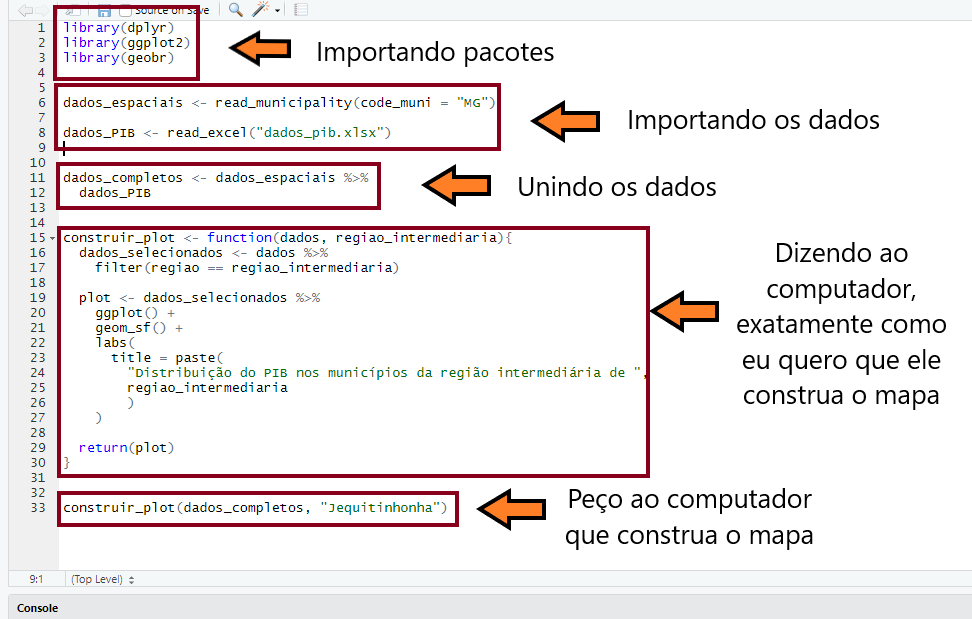

# Sobre os autores {-}


**Pedro Duarte Faria**


Pedro Duarte Faria é economista formado pela Universidade Federal de
Ouro Preto - UFOP, e professor apaixonado pela linguagem R. 
Atualmente é Analista de Performance e Inteligência
de Negócios em Take Blip.

Já ministrou vários cursos sobre a linguagem R, dentro de centros de pós-graduação 
além de organizações federais e estaduais. 
Vem programando a quatro anos com a linguagem R,
construindo programas, relatórios e análises para instituições de pesquisa e grandes empresas do país. Como pesquisador, tem experiência em especial na
área de Economia da Ciência, Tecnologia e Inovação.

Lattes: [http://lattes.cnpq.br/0308632529554550](http://lattes.cnpq.br/0308632529554550)

Site pessoal: [https://pedro-faria.netlify.app/](https://pedro-faria.netlify.app/)

Twitter: [\@PedroPark9](https://twitter.com/PedroPark9)


**João Pedro Figueira Amorim Parga**


João Pedro Figueira Amorim Parga é mestre em Economia pelo CEDEPLAR-UFMG
(2020), e possui graduação em Economia pela mesma instituição. Atualmente é Pesquisador Assistente
no Instituto de Pesquisa Econômica Aplicada (IPEA). Possui
experiência em Economia Regional e Urbana, especialmente nos seguintes
temas: distribuição espacial de atividades econômicas, setor de
serviços, ciência de dados, habitação, aglomeração espacial e geografia
econômica.

Lattes: [http://lattes.cnpq.br/8639351648030747](http://lattes.cnpq.br/8639351648030747)


# Prefácio {-}

## O que é esse livro? {-}


Este livro surgiu inicialmente, como um material de apoio aos pesquisadores e alunos do Curso Introdutório de R, que foi realizado durante o primeiro semestre de 2020, na Fundação João Pinheiro^[A Fundação João Pinheiro (fundada em 1969), é uma instituição de pesquisa e ensino vinculada à Secretaria de Estado de Planejamento e Gestão de Minas Gerais, e é responsável por produzir as principais estatísticas econômicas, sociais e demográficas do estado de Minas Gerais.] (FJP-MG). O projeto foi idealizado na época, por um conjunto de três pessoas, dentre elas, estão os autores desta obra: Pedro Duarte Faria e João Pedro Figueira Amorim Parga. 

Portanto, esse material é resultado dessa experiência de ensino, onde buscamos compartilhar conhecimentos sobre essa linguagem com outras pessoas. Eu como professor, aluno e economista, sou muito grato por ter compartilhado essas experiências, com meu querido colega João Pedro Figueira Amorim Parga, que me ajudou a montar este livro.

As origens da linguagem R, remetem a um dos mais importantes laboratórios de pesquisa do mundo, a Bell Labs, localizada nos EUA. Por sua origem, a enorme maioria dos materiais de referência a respeito da linguagem, estão em inglês, incluindo as principais fontes de ajuda da linguagem, como o [StackOverflow](https://stackoverflow.com/questions/tagged/r), ou as páginas e manuais internos do [CRAN R](https://cran.r-project.org/).

Entretanto, a comunidade de R no Brasil, tem se expandido constantemente nos últimos anos. Brasileiros tem desenvolvido importantes pacotes para a linguagem, que trazem grande apoio à produção científica do país. Apenas para citar alguns desses excelentes trabalhos, estão [@geobr; @read_dbc; @cepr; @sidrar; @pnadc]. 

Como resultado, bons materiais em português, de referência e apoio à linguagem tem surgido. Exemplos são: os materiais curtos montados pelo [Curso R](https://www.curso-r.com/material/); os trabalhos realizados pelos capítulos brasileiros do grupo [R-Ladies](https://rladies.org/), como os [posts do capítulo de Belo Horizonte](https://medium.com/rladiesbh), e os [encontros desenvolvidos pelo capítulo de São Paulo](https://www.meetup.com/pt-BR/rladies-sao-paulo/); além de alguns materias produzidos pelo Departamento de Estatística da UFPR, como um [site de apoio ao seu curso](http://cursos.leg.ufpr.br/ecr/), ou este produzido por um dos professores do departamento, o [Dr. Walmes Marques Zeviani](http://leg.ufpr.br/~walmes/cursoR/data-vis/).


Porém, mesmo com esse avanço, grande parte desses conteúdos em português geralmente caem em algum desses dois problemas: 1) carecem de profundidade, ou de detalhamento sobre o que está "ocorrendo nos bastidores". Em outras palavras, esses materiais são muito abstratos, pois tentam abordar muita coisa em um espaço muito curto, sem dar o devido tempo a cada um dos componentes por trás da linguagem; 2) ou são especializados demais. Por exemplo, materiais que ensinam como estimar modelos específicos (ex: regressão linear sobre dados em painel), ou a trabalhar com bases de dados específicas (ex: PNAD contínua). Em outras palavras, esses materiais concedem em geral, uma visão muito restrita sobre a linguagem, e que é de difícil transposição para outros cenários e necessidades práticas.


Esses problemas emergem do próprio objetivo que esses materiais buscam cumprir. Como exemplo, os materiais escritos pelo [Curso-R](https://www.curso-r.com/) carregam certa abstração, pois em nenhum momento esses materiais pretendem oferecer uma revisão completa e profunda sobre o tema, mas sim, tutoriais rápidos e úteis, que lhe mostram o básico. 

Tendo isso em mente, esta obra em específico, representa a nossa tentativa de combater esses dois problemas. Ao discutir pacotes largamente utilizados nas mais diversas aplicações, além de fornecer uma visão aprofundada sobre os fundamentos (ou a teoria) da linguagem R. Por isso, o público-alvo deste livro são os brasileiros que desejam obter uma base mais sólida e uma visão mais abrangente da linguagem, de forma que eles possam identificar mais facilmente, as possíveis soluções que o R oferece para vários problemas de seu trabalho. 


Por essas razões, este material é até certo ponto, prolixo em muitos assuntos aos quais são comumente tratados como simples e rápidos de se compreender (e.g. Objetos). Ao mesmo tempo, este material certamente busca ser descritivo, e não poupa detalhes em assuntos que são complexos e de difícil compreensão (e.g. Funções e *Loops*). Para mais, fornecemos ao longo da obra, diversos diagramas e representações visuais, que ajudam o leitor, a formar um modelo mental sobre como a linguagem R funciona. A obra também oferece exercícios ao final de cada capítulo, e suas respostas estão disponíveis na página de publicação do livro.

Vários exemplos são fornecidos em cada tópico. Alguns desses exemplos são reais e retirados diretamente de nosso dia-a-dia com a linguagem. Já uma outra parte desses exemplos, buscam evidenciar ou demonstrar problemas práticos que podem emergir de seu trabalho com a linguagem e, portanto, mostrar quais são as possíveis soluções a serem empregadas. Dessa forma, podemos construir um *workflow*, ou um modelo mental de trabalho com a linguagem, ao longo de diferentes tópicos importantes para a sua aplicação prática em análise de dados.


Você sempre pode encontrar uma versão atualizada desta obra, em sua [página de publicação](https://pedro-faria.netlify.app/pt/publication/book/introducao_linguagem_r/). Este documento foi criado dentro do RStudio, por meio do pacote `rmarkdown` e do sistema \LaTeX. Grande parte do conhecimento exposto aqui, está baseado em diversas referências sobre a linguagem R, em especial os trabalhos de [@wickham2015_advanced; @peng2015; @wickham2017; @long2019], 
assim como a documentação oficial da linguagem R [@Rlanguage; @Rintroduction].


\begin{flushleft}
\textit{
Pedro Duarte Faria\\
06/04/2022\\
Belo Horizonte - MG\\
Brasil
}
\end{flushleft}


## Novidades desta terceira edição {-}

Esta terceira edição traz muitas novidades. Temos seis novos capítulos, os quais compõe uma nova parte do livro e, trazem consigo, grandes avanços sobre o processo de desenvolvimento de programas no R. Além disso, várias melhorias foram feitas em seções específicas do livro, especialmente sobre o capítulo 2.

Primeiro, houve uma reorganização significativa do livro. Os capítulos pré-existentes foram reorganizados em quatro partes diferentes. Já a quinta e nova parte (Funções e *Loops*: construindo os seus próprios programas e automatizando tarefas) é composta pelos seis novos capítulos introduzidos nesta edição.

Segundo, o capítulo de Funções e *Loops* foi completamente reescrito, expandido, e, repartido em dois novos capítulos. Mais especificamente, os capítulos 14 (Funções) e 15 (*Loops*) desta edição.

Terceiro, o capítulo 16 desta edição traz uma das novidades programadas desde a segunda edição: um novo (e robusto) capítulo sobre *functional programming*. Com essa adição, esta obra se torna uma referência mais moderna e, se aproxima dos padrões adotados hoje pela comunidade internacional de R.

Quarto, várias adições e melhorias foram feitas no capítulo 2 (Fundamentos da Linguagem R). Dentre elas, temos: um novo estudo de caso (Importando os dados da PINTEC); novas seções sobre as funções `str()` e `is.*()`; além de melhorias significativas sobre as seções de Coerção no R e Valores especiais do R.

Quinto, um novo e pequeno capítulo foi adicionado à segunda parte do livro, com o objetivo de introduzir o universo do `tidyverse` ao leitor de maneira mais clara e amigável.

Sexto, o apêndice contendo as respostas dos exercícios foi retirado, com o objetivo de reduzir o número de páginas do livro. Consequentemente, as respostas dos exercícios estão sendo disponibilizadas em um PDF separado, o qual pode ser baixado gratuitamente, a partir da página de publicação do livro^[ [https://pedro-faria.netlify.app/pt/publication/book/introducao_linguagem_r/](https://pedro-faria.netlify.app/pt/publication/book/introducao_linguagem_r/) ].


## Porque aprender R? Quais são as suas vantagens? {-}

A resposta curta é: uma parte crescente de nosso trabalho é realizada dentro de um computador, e a linguagem R nos permite comunicar as nossas intenções e necessidades para esse computador de maneira muito mais precisa e eficiente.

Temos dependido cada vez mais de computadores para desenvolver as nossas tarefas. Isso vale tanto para secretários, que precisam enviar e-mails, organizar agendas e reuniões; ou para engenheiros, que precisam desenhar plantas e calcular volumes de materiais; ou para analistas, que precisam construir planilhas, calcular indicadores e construir relatórios; e para várias outras categorias de profissionais.

Como um outro exemplo, praticamente a totalidade da ciência atual é desenvolvida dentro de um computador. Todo cientista precisa (em algum momento) escrever um artigo científico, e, tal atividade geralmente é feita hoje em programas como Microsoft Word, LibreOffice e Latex. Além disso, cientistas usam computadores para desenvolver experimentos nas mais diversas áreas da ciência, seja simulando cenários, ou desenvolvendo modelos computacionais que explicam a realidade que nos cerca.

Saber como se comunicar com o seu computador nunca foi tão importante como nos dias de hoje. Se você possui esse tipo de conhecimento, você é capaz de dizer ao seu computador, exatamente o que você precisa que ele faça, e, com isso, você pode deixar o trabalho duro com ele. Ou seja, você é capaz de delegar e automatizar tarefas, pois o seu computador passa a realizar esse trabalho por você. Consequentemente, você consegue realizar mais trabalho, em menos tempo.


### Computadores e linguagens de programação {-}

Computadores falam um único idioma, que é o código binário (ou *machine code*). Entretanto, este idioma é extremamente complicado para nós seres humanos. Por esse conflito, programadores e cientistas criaram o que chamamos de linguagens de programação. A linguagem R é uma dessas várias linguagens existentes.

Uma linguagem de programação é uma espécie de idioma intermediário, que utilizamos para criar um programa. Um programa é um conjunto de instruções que podem ser seguidas e executadas por um computador com o objetivo de desempenhar uma atividade específica. 

Sendo assim, nós utilizamos uma linguagem de programação (como a linguagem R) para dizer aos nossos computadores, o que eles devem fazer, quais são os elementos envolvidos nessa atividade, com quem ou o quê o computador deve se comunicar, de onde ele deve extrair os recursos, e como ele vai combinar esses recursos e calcular o resultado que desejamos obter ao final dessa atividade.

Essa atividade pode ser qualquer coisa, desde enviar um e-mail todos os dias para a diretoria, contendo o último relatório gerado, ou, estimar um modelo com os dados mais recentes do Yahoo Finance, até reorganizar um conjunto de planilhas do Excel no formato adequado para serem inseridas em uma base de dados.

Como uma parte cada vez maior do trabalho humano está sendo realizada através de computadores, existe um conjunto crescente de atividades, problemas e desafios que você pode solucionar ao construir um programa através de uma linguagem como o R. 

Como exemplo, programas como Adobe Photoshop e Figma foram desenvolvidos a partir do momento em que designers precisavam desenhar sites, materiais, artes e documentos para o mundo digital da web. Logo, antes desse período, não existiam grandes motivos para desenharmos através de computadores. 

Ou seja, uma necessidade surgiu, e por essa necessidade, certas pessoas utilizaram uma linguagem de programação para construir um programa que permitisse que os designers desenvolvessem o seu trabalho dentro de um computador. Como exemplo, tanto o Figma quanto o Adobe Photoshop são programas construídos a partir da linguagem C++.

Imagine por exemplo, criar um programa capaz de controlar um robô que está a milhares de quilômetros de distância. Na verdade, esse programa já existe. A NASA (agência espacial americana) possui diversos projetos focados em robótica e automação, e tem desenvolvido vários programas para controlar (à distância) os seus robôs espaciais. Você pode saber mais desses programas, ao navegar pelo site do [programa de transferência tecnológica da agência](https://software.nasa.gov/) (NASA'S TECHNOLOGY TRANSFER PROGRAM).


### Velocidade e capacidade de processamento {-}

Em resumo, linguagens como Python e R possuem um nível de abstração mínimo, que facilita muito a sua compreensão e o seu trabalho com elas. Por outro lado, devido a essas escolhas, essas linguagens (Python e R) não são particularmente rápidas se comparadas com outras linguagens que lhe obrigam a especificar cada componente de sua análise, como as linguagens C e C++. Pois o computador tem de reservar um tempo para calcular e compilar essas especificações por você.

Porém, essas linguagens ainda assim são muito mais rápidas do que programas como Excel, e lidam muito melhor com grandes volumes de dados. Por exemplo, se você usa o Excel em seu trabalho, você provavelmente sabe que as suas versões mais recentes são capazes de abrir arquivos com mais de 1 milhão de linhas. Mas se você já tentou, por exemplo, adicionar uma nova coluna a este arquivo, você rapidamente percebeu que o Excel não foi feito para lidar eficientemente com arquivos desta magnitude. 

Com linguagens como o R, você possui uma capacidade de processamento maior, e os seus problemas geralmente se limitam a quantidade de memória que você possui em seu computador. Se você possui memória suficiente para alocar uma tabela com mais de 1 milhão de linhas, o seu trabalho com esses dados será muito mais rápido e eficiente no R. E como os componentes de computadores tem ficado cada vez mais baratos, essa vantagem tende a aumentar com o tempo. Hoje, um cartucho de 16GB de RAM (que já é uma quantidade muito boa de memória) é muito mais barato, do que ele era a 10 anos atrás.


### Reprodutibilidade: automatizando processos e reduzindo riscos {-}

Vamos a um exemplo prático! Eu comecei a aplicar a linguagem R, quando ainda trabalhava na Diretoria de Estatística e Informações da Fundação João Pinheiro (FJP) como estagiário. A FJP é uma instituição de pesquisa ligada à Secretaria de Estado de Planejamento e Gestão de Minas Gerais, e é responsável pela produção e divulgação das principais estatísticas econômicas e demográficas do estado de Minas Gerais. 

Na época, uma de minhas responsabilidades era a produção de mapas temáticos para os informativos mensais de PIB das regiões intermediárias do estado. Eu poderia fabricar esses mapas, utilizando programas especializados como o QGis. Porém, utilizar o QGis, tornava a atividade repetitiva e manual.

Para mais, cada uma das etapas do processo (importar os dados de PIB, importar os *shapefiles*, escolher as cores do mapa, escolher os títulos e rótulos, criar uma legenda, etc.) não eram salvas em algum lugar. Consequentemente, o mapa criado no QGis, não era reproduzível! 

Essas considerações são muito importantes, pois quase sempre eu tinha que reconstruir o mapa. Seja porque o editorial sugeria o uso de novas cores, ou porque o tamanho da fonte estava pequeno, ou principalmente, porque erros podem surgir no processo! Se o mapa gerado pelo QGis possui um erro, seja por falha humana ou do computador, eu tenho que recomeçar o trabalho do zero, pois as etapas do processo não foram salvas de alguma forma.


É tendo essas preocupações em mente, que eu construí na época, um *script* no R (isto é, um programa), que guarda todos os comandos necessários para produzir esses mapas. Dessa maneira, não apenas cada etapa do processo é contida e salva em cada comando do R utilizado, mas eu também posso reproduzir cada uma dessas etapas (ou comandos), com muita facilidade, ao longo de vários pontos diferentes. 

Isso significa, por exemplo, que eu posso criar um mapa com as mesmas especificações, para cada uma das 13 regiões intermediárias, em questão de segundos, e utilizando apenas 1 comando. Caso eu precise, também posso expandir esse programa, para gerar um mapa com as mesmas especificações, para todas as regiões intermediárias do país. Novamente, esses mapas são gerados em questão de segundos, pois computadores são extremamente rápidos em seus cálculos.


A figura abaixo, é uma representação deste *script*, onde delimito cada uma das etapas que o R realiza para construir esses mapas por mim. Se a nossa equipe descobre um erro no mapa, eu posso voltar ao *script*, e executá-lo parte por parte, e descobrir em qual delas o erro surge. Será que eu errei ao filtrar os dados? Ou o R não conseguiu gerar o gráfico corretamente? Ou será que o erro aparece antes mesmo de eu importar os dados para o R? 


```{r, out.width="70%", fig.cap="Um exemplo de script contendo comandos do R", echo = FALSE}

```


A partir do momento em que eu descubro em qual parte de meu *script* o erro ocorre, eu posso corrigir o erro naquele local em específico, e após me assegurar de que tudo está ok, eu posso executar todo o *script* novamente, e assim, o novo mapa contendo as correções aplicadas é gerado em questão de segundos. Dessa forma, eu estou automatizando as etapas repetitivas que possuo em meu trabalho, e não preciso começar do zero caso algum erro ocorra durante o processo.

Neste caso, eu posso inclusive criar alguns processos automatizados que conferem a robustez dos dados, para evitar que erros humanos gerem mais dor de cabeça do que o necessário. Por exemplo, se na minha base de dados, cada linha representa um município de Minas Gerais, eu posso criar um sistema que confere se esta base possui 853 linhas (número total de municípios no estado de Minas Gerais). Como os mapas são geralmente produzidos para cada região intermediária do estado, eu posso também, me certificar que o número de linhas (ou o número de municípios) que compõe cada região intermediária dessa base, estão corretos.


### Conexões e API's {-}

A linguagem R possui vários pacotes e interfaces que facilitam a sua conexão com servidores e outras linguagens. Exemplos são os pacotes `DBI` e `odbc`, que são muito utilizados para a conexão de sua sessão do R, com servidores SQL (*Structured Query Language*). Com essa conexão, você pode puxar resultados de *queries* direto do servidor para a sua sessão do R.

Outro exemplo, é o pacote `Rcpp` que provê uma boa interface entre o R e a linguagem C++. Com este pacote, você pode misturar comandos em C++ com os seus comandos em R, com o objetivo de utilizar uma linguagem mais rápida (C++) em processos que são, por natureza, muito trabalhosos para o seu computador.

Além disso, tanto o Python quanto o R, possuem interfaces para se comunicar entre si. Isto é uma ferramenta muito poderosa! Pois você pode se aproveitar do melhor que as duas principais linguagens utilizadas em análise de dados oferecem. O R possui um arsenal estatístico melhor do que o Python, porém, ele não possui a conectividade e amplitude de aplicações que o Python oferece. No caso do R, o pacote `reticulate` fornece tal interface para o interpretador do Python.

Para mais, grandes esforços tem sido empregado no desenvolvimento de pacotes voltados para serviços web. Uma área que até pouco tempo, possuía pouco suporte dentro da linguagem R. Hoje, você já pode criar sites (pacote `blogdown`), dashboards interativos em HTML (pacote `shiny`), além de REST APIs (pacote `plumber`) com os recursos disponíveis. Também há pacotes como `httr` e `rvest`, que possibilitam a realização de atividades de *web scrapping*. Além dos pacotes `xml2` e `jsonlite`, que permitem a leitura de dados em XML e JSON, respectivamente. Para esse tópico, você pode descobrir mais pacotes na seção de [Web Technologies do CRAN R](https://cran.r-project.org/web/views/WebTechnologies.html).

Por último, o time da Microsoft, também tem desenvolvido interfaces em seus serviços da Azure Cloud Computing, permitindo que você utilize R em seus projetos na plataforma. Caso esteja interessado nisso, você pode consultar a página da empresa sobre este serviço^[https://docs.microsoft.com/en-us/azure/architecture/data-guide/technology-choices/r-developers-guide].


### Comunidade {-}

O R é uma linguagem gratuita e *open source* e, por isso, o seu crescimento como linguagem depende não apenas da fundação que a mantém e a atualiza (*R Foundation*), mas também depende de sua comunidade que está o tempo todo discutindo, inovando e abrindo novos caminhos, tudo isso de forma aberta e gratuita. Esta obra é uma contribuição a essa comunidade e um convite a você. Venha para a comunidade de R!

Portanto, a comunidade é um dos principais ativos da linguagem R (e também do Python). Grande parte dessa comunidade, está concentrada no [Twitter](https://twitter.com/). Mas essa comunidade também está muito presente em blogs, comentando novas soluções e recursos para a linguagem (sendo o [Tidyverse blog](https://www.tidyverse.org/blog/), [Rweekly](https://rweekly.org/)  e [ROpensci](https://ropensci.org/) os principais exemplos) e, com isso, você pode se manter atualizado sobre o que a linguagem oferece. Por outro lado, parte desses blogs, possuem um foco maior em tutoriais, e representam assim, um local em que você sempre pode aprender mais sobre o R (o principal exemplo dessa categoria se trata do [R-Bloggers](https://www.r-bloggers.com/)).

Recentemente, um novo e excelente centro de discussão foi criado pela comunidade, denominado [R4DS Online Learning Community](https://www.rfordatasci.com/), um nome que claramente se refere a obra de @wickham2017. Esse é um ótimo local para criar conversas com membros da comunidade, e pedir por ajuda em algum problema que você esteja enfrentando. 

Além disso, a comunidade de R também possui forte presença no [StackOverflow](https://stackoverflow.com/questions/tagged/r), que é comumente caracterizado como o principal canal de dúvidas e de ajuda em diversas linguagens de programação. Logo, se você não sabe como realizar um processo, ou não consegue descobrir de onde um erro está surgindo em seu *script*, você pode pedir por ajuda da comunidade ao postar uma pergunta, ou encontrar uma pergunta parecida com o seu problema que já foi respondida no [*StackOverflow*](https://stackoverflow.com/questions/tagged/r).

No caso do Brasil, a principal força motriz de nossa comunidade provavelmente se encontra nos capítulos brasileiros do [R-Ladies global](https://rladies.org/), além do blog [Curso-R](https://www.curso-r.com/blog/). Por exemplo, temos os encontros mensais online realizados pelo [capítulo de São Paulo](https://www.meetup.com/pt-BR/rladies-sao-paulo/), além dos bons tutoriais escritos pelo [capítulo de Belo Horizonte](https://medium.com/rladiesbh). Existem também, outros capítulos no Brasil^[Você pode consultar a lista completa dos capítulos brasileiros na página principal do [R-Ladies global](https://rladies.org/).], que também realizam alguns encontros.

```{r, echo = F, out.width="80%", fig.cap = "Code Hero por Allison Horst"}
knitr::include_graphics("Figuras/code_hero.jpg")
```

